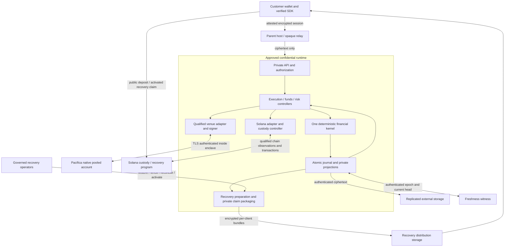

# Cinder architecture

Architecture baseline: 2026-09-30. This document describes the intended product
and maps it to the implementation sequence; it is not a deployment claim.
[BASELINE](implementation/BASELINE.md) controls approved economic/security policy;
[PLAN](implementation/PLAN.md) controls phase scope; [TRACKER](implementation/TRACKER.md)
records actual completion. An older research proposal does not override those files.

## 1. System purpose and current implementation boundary

Cinder is a private, programmatic perpetual-futures broker over existing venue
liquidity. A customer has a private Cinder account; external venues execute through
Cinder's pooled accounts. The intended benefits are private customer-level state,
one programmatic interface, and pooled trading economics where a venue supports
them. Cinder is not a matching engine, central counterparty, or blanket guarantor
of every venue loss. It does not internally cross customer orders.

Pacifica is the first integration. AWS Nitro Enclaves is the confidential-runtime
target. Additional venues are a future extension behind qualified adapters, not
an assumption that unrelated venue accounts share collateral or identical risk.
BULK research is retained but its integration is paused. The old Phoenix/PER
implementation is a separate workstream, not the template for this architecture.

| Component | In this PR / implementation status | Owning phase |
| --- | --- | --- |
| Build, typed amounts, IDs, canonical primitive encoding | Implemented and previously merged | P01–P02 |
| Single quote-pool ledger, exact positions, ownership, cash/location bridge | Implemented in base PR; pure in-memory proposals | P03 |
| Funding, fees, source discrepancies | Implemented in base stack; qualified normalized inputs, no live adapter | P04 |
| Local atomic journal and replay | Implemented in base stack; opaque storage and mandatory protection interface | P05 |
| Encrypted replicas, current-head witness and writer fencing | Implemented against a trusted witness port; no independently deployed witness or Nitro qualification | P06 |
| Bound order intents, partial/terminal lifecycle and shared holds | Implemented against trusted authentication/source ports; no live execution | P07 |
| Partial funds and FIFO payouts | Implemented with marked collateral and qualified receipt ports; no native sends | P08 |
| Joined margin, capital and liquidity admission | Implemented with conservative pending bounds and finite synthetic stress paths; not calibrated | P09 |
| House protection and repeated claims | Implemented in the same ledger with explicit coverage/allocation ports, lifetime caps and actual recovery; live terms remain gated | P10 |
| Liquidation and close exceptions | Funded bounded customer liquidation, private-close excess allocation and existing-house unwind; no calibrated depth or general crisis authority | P11 |
| Native ADL and RF1/RF2 restoration | Qualified cuts, bounded exact-EDF schedule and original-basis postings implemented; no live ADL recognizer or execution service | P12 |
| Pacifica observations | Lossless bounded codecs, durable provenance/replay and explicit capability gaps implemented; no live qualification | P13 |
| Pacifica signing adapter | Durable native preimages, scoped Ed25519 signer, shared credit reservation and fake transport implemented; no live-qualified deployment | P14 |
| Solana custody vault and normal authorization | Anchor 1.2 program, public receipts/shared paid counters and offline signed SBF tests implemented; deployment gated | P15 |
| Funding round trip | Durable three-location coordinator, original-wire/attempt reconciliation and shared credit budget tested offline; source/live qualification gated | P16 |
| Recovery claims | Planned; bounded prototypes remain evidence only | P17 |
| Private API/SDK, attested client channel, actual Nitro runtime | Planned | P18–P20 |
| Integrated recovery, adversarial/live qualification, release review | Planned acceptance gates | P21–P24 |

The P03/P04 implementation is deliberately a single configured quote pool with one
native account, multiple linear-perp markets, private customer books, house and
suspense. It is not a multi-venue clearing engine. It introduces no new native
account topology or fee/insurance promise.

## 2. Components and trust boundaries

The following is a target topology, not a collection of services already running:



The host transports traffic and stores ciphertext. It is not trusted to decide
customer balances, provide unsigned account truth, select claim amounts, read
private records, or hold unrestricted plaintext signing keys. A compromised host
can still delay, drop or reorder traffic and deny service; confidentiality is not
availability. Timing, size and declared health metadata need explicit bounds.

The enclave contains private authorization, accounting, allocation and signing
logic. Attestation lets a verifier bind a session to an approved release; it does
not establish that the release is bug-free. A release allowlist obtained only from
the same untrusted endpoint is not an independent trust anchor.

External venues are authoritative for their actual executions and native balances.
Cinder is authoritative for customer entitlements and their allocation under the
approved contract. Solana is authoritative for its vault/mode/claim-consumption
state. Reconciliation connects these domains; none substitutes for the others.

### Code ownership

The off-chain workspace has five Rust crates:

- `cinder-kernel`: dependency-free, `no_std`, checked integer types and pure state
  transitions. No clock, database, signer, network or venue SDK imports.
- `cinder-ports`: typed external-effect interfaces. Interfaces are not production
  implementations or evidence that a venue supports an action.
- `cinder-test-support`: deterministic clocks, stores and venue doubles for fault
  tests. It must not become a production store or enter the kernel dependency graph.
- `cinder-journal`: versioned transactions, joined holds/attempts, exact replay and
  opaque SQLite storage. Its pinned storage/hash dependencies stay outside the
  kernel; [ADR 0005](architecture/0005-durable-journal.md) specifies the contract.
- `cinder-pacifica`: native observation/signing codecs and durable adapter authority;
  native execution remains separately qualified.

The isolated `programs/` Anchor workspace owns public Solana custody, not private
financial accounting. Its generated typed client is `clients/vault/`; neither
adds Anchor dependencies to the kernel or the off-chain workspace.

New packages are introduced when an owning phase implements a real boundary,
with an architecture decision. Language/runtime pins are in
[ADR 0001](architecture/0001-workspace.md). P05 selects local SQLite explicitly;
transport cryptography and production witness providers are
not selected implicitly by this diagram. A controller may request a transition; it cannot maintain an
independently authoritative balance table.

## 3. Accounts, assets and authority

| Identity / state | What it owns or controls | What it does not imply |
| --- | --- | --- |
| Private Cinder account | Its attributed cash, positions, funding, fees, claims and holds | A separate native position/account, LP shares, or exclusive ownership of a particular pooled token |
| Native pooled account | Actual external orders, net positions, collateral and venue authority | Knowledge of every private customer's position, margin or liquidation state |
| House book | Protocol capital, explicit house exposures, income and obligations | A residual bucket for unexplained differences or customer assets |
| Suspense | Named observations awaiting attribution/resolution | Spendable profit or permission to erase a missing customer's claim |
| Solana vault | Program-enforced custody of tokens currently on Solana | PDA authority over an ordinary signed HTTP venue account |
| Broker wallet tokens | Separate intermediate custody on the allowlisted route | Vault payout liquidity, venue margin, a second customer deposit, or automatic recovery access |
| Transit receivable | One evidenced transfer leg between locations | Another deposit, immediately spendable tokens, or guaranteed recovery |

Keep customer wallet/agent authorization, native trading authority, fund/recovery
authority, transport keys, storage keys and release/upgrade governance distinct.
A customer's Cinder agent is not a native agent for the omnibus account. Grants
must bind deployment, owner, methods, market/amount constraints, expiry and epoch.
Revocation prevents new unauthorized work; it does not undo an already exposed
native request.

Logical role separation does not narrow a venue's real credential capabilities.
If a native credential can move funds, calling it a trading signer does not make
it trading-only. The supported intermediate key-controlled funding account remains
an explicit custody boundary. No Solana program, encrypted snapshot, or threshold
signature is claimed to manufacture an unsupported native authorization interface.

P15 selects one cohesive Solana custody program; P17 will add recovery using its
same token authority and preserved paid counters. [ADR 0015](architecture/0015-solana-vault.md)
records the role/epoch fence, immutable receipts and bootstrap upgrade-authority
check. Its public counters are not current private entitlements. HyperLink's
contract count is not a requirement for Cinder.

[ADR 0016](architecture/0016-funding-coordinator.md) joins this vault to native
funding through the existing journal. Prepared physical allocations inform a
forecast, not trading credit. Exact original wire/attempt identity persists before
egress; HTTP acknowledgements cannot become settlement. Live source completeness,
RPC trust and production key governance remain explicit qualification gates.

## 4. The financial state and its reconciliation

The complete target state includes private and native books, physical locations,
transfers, unsettled funding, reservations, claims/protection, operation/attempt
identities, source cutoffs, policy revisions, writer epochs and recovery counters.
They form one event-driven financial state. P03 implements its position,
cash/location, attribution and in-memory provenance foundation. P04 adds unsettled
funding, native/broker costs, frozen funding inventory and evidence containment.

Customer and house cash can be negative: they are signed ledger quantities, not
token-account balances. A native signed cash balance also excludes its unrealized
position PnL. Reported native total equity is a reconciliation observation, never
an additional asset beside the components that already produce it.

For customer `i`, market `m`, and a common qualified mark `p_m`, write `c` for
settled cash, `q` for signed lots, `b` for signed remaining basis and `a` for
recognized unsettled funding. Prices in these equations include the explicitly
configured conversion to quote atoms per lot:

```text
e_i = c_i + Σ_m(q_im p_m - b_im) + a_i
h   = c_H + Σ_m(q_Hm p_m - b_Hm) + a_H
s   = c_S + Σ_m(q_Sm p_m - b_Sm) + a_S
N   = vault + broker + transit - unpaired_settlement
    + native_cash + Σ_m(q_Vm p_m - b_Vm) + a_V
q_Vm = Σ_i q_im + q_Hm + q_Sm
N = Σ_i e_i + h + s
```

This implemented form represents unattributed obligations in suspense, not also as a
second subtraction from assets. Later third-party liabilities must have a named
representation and be subtracted exactly once. No generic balancing adjustment
is allowed to hide a broken bridge.
`unpaired_settlement` offsets an independently observed arrival whose matching
debit has not yet arrived; it is not a second customer claim or spendable capital.

P03 checks exposure and a price-independent cash-minus-basis identity; P04 extends
the intercept to include recognized funding after every distinct accepted event.
Consequently the equity bridge holds at any common
exactly representable mark. This is a hand-derived identity with implementation
tests, not proof of authentic venue evidence or correctly supplied ownership.

Claims cannot be netted against imaginary collectible customer debt:

```text
C = Σ_i max(e_i, 0)                 positive customer claims
D = Σ_i max(-e_i, 0)                customer deficits, zero assumed collectibility
W = N - C - max(s, 0) = h - D + min(s, 0)
shortfall = max(-W, 0)
```

An unresolved suspense event remains a qualification failure even when its current
value is zero. A nonnegative `W` is not free collateral, liquid cash, a capital
target pass, or a future-solvency guarantee. Gross customer risk, native net risk,
capital adequacy and payment liquidity need separate checks.

Example: Alice and Bob each deposit 100; house capital is 30. Alice buys one perp
at 100 and Bob sells one at 100, each through actual venue executions. At mark 250,
Alice has 250 equity, Bob has -50, and house equity is 30. Native exposure is flat
and assets are 230, but positive customer claims are 250: the shortfall is 20.
The correct result is a visible deficit, not a fictitious 50 receivable or an
automatic haircut to Alice.

### Exact positions, not spot-notional accounting

Opening a perp does not debit its full notional from customer cash. Collateral
and margin are separate. For an actual fill `x` at price `v`:

```text
Opening / increasing: q' = q+x; b' = b+xv; c' = c
Reducing / reversing:
  z = min(|q|, |x|); t = sign(q)
  beta = trunc_toward_zero(b z / |q|)
  r = t z v - beta
  x_open = x + t z
  q' = q+x; b' = b-beta+x_open v; c' = c+r
```

Residue stays in remaining basis; full close consumes every basis atom. Display
average price is derived, not authoritative. The same actual fill updates the
native net book and the attributed private book independently: their realized cash
and remaining basis can differ. Before fees, each book's marked equity changes
by `x(p-v)`, preserving the bridge without forcing their basis values to match.

P03 uses versioned rational lot/tick-to-quote conversion and rejects inexact
conversion rather than guessing a venue rounding rule. See
[ADR 0003](architecture/0003-unified-ledger.md) for implemented boundaries,
transition algebra, test coverage and limitations.

### Funding, costs and source evidence

[ADR 0004](architecture/0004-funding-reconciliation.md) details the implemented
P04 transitions. Funding uses positions frozen at a qualified boundary, not their
values when a delayed message arrives. Known native funding waits in suspense
until private allocation inputs qualify. Recognition adds unsettled funding;
settlement moves that boundary's accrual to cash once. Derived rounding and
unexplained native differences are separate; only the former may go to house.

Actual signed fees/rebates follow the stored execution owner. Fee-inclusive native
PnL normalizes once and is compared with native, not private, basis. Separate
authorized broker fees move customer cash to house without a second venue debit.
Named source corrections preserve history; they do not repeat fills or funding.

Matching native snapshots compare components and cannot set balances. Resolving
an old discrepancy requires named effects explaining all its known components,
not just a later matching total. Missing/stale evidence restricts dependent views;
aged issues and conflicts freeze that evidence gate. Qualified diagnostics still
need current marks and do not replace P09 risk, capital or liquidity admission.

## 5. Events, persistence and execution ordering

There are three different identities: customer request, exposed signed attempt,
and actual economic event. They cannot replace each other. One order can have
several fills; REST and WebSocket can deliver the same fill repeatedly; a reversal
can contain distinct native execution legs.

The target normalized envelope binds network/deployment, native source account,
semantic namespace, economic event/leg, operation/attempt, units/precision, source
cut/observation time, authority, payload and policy versions. P02 defines the
primitive keys; P03 compares exact normalized events in memory; P04 ingestion also
retains rejected/duplicate observations and injected arrival times. P05 persists
the full envelope and raw evidence; P13 must still qualify its native source and
causal meaning. A matching identifier with changed payload
is a conflict, not an update to silently overwrite.

Processing order is:

1. Preserve bounded raw evidence and authenticate/qualify its source.
2. Normalize without floating-point loss; identify its causal operation and owner.
3. Under one writer/version, compute a pure transition including all shared holds.
4. Atomically commit postings, event consumption, holds, resulting state and version.
5. Only then expose the corresponding durable receipt or authorized side effect.

Before a signature can escape, persist its exact attempt, nonce, limits and
authority epoch. Timeout after exposure means outcome unknown, not failed. Retain
commitments, reconcile the original attempt, and retry only with sufficient
evidence. ACK is not fill; cancel ACK is not complete fill history.

Invalid/unattributed observations cannot be silently discarded because the pool
is frozen. Preserve the raw fact; either post qualified economics to suspense or
contain it until normalization is possible. Real adverse fills remain recordable
when new orders would fail risk admission. A correction is an explicit auditable
event, not mutation of history or a general-purpose admin balance setter.

P03/P04 clone state to propose transitions and expose read-only projections. P04's
ingestion path preserves named evidence even when an economic transition rejects;
complete replay uses observation history, not only accepted financial events. This
is failure atomicity inside a pure function. P05 wraps that function in a durable
SQLite CAS transaction and replays complete observations, receipts, holds and
attempts. Facts remain recordable when the accompanying all-or-none control
proposal refuses. Bounded flat-cash reservations are not P09 margin approval;
exactly one prepared attempt per hold can become possibly exposed, and a lost
reply never regenerates its local delivery. Disk/uncertain commit errors poison
the coordinator until explicit replay. This is not authentication or permission
to send money. P06 adds [AEAD, replication and witnessed acceptance](architecture/0006-encrypted-durability.md).
Its restore safety is conditional on the independently authenticated witness port;
the P05-only protector/public chain still cannot detect complete valid rollback.

## 6. Normal operating flows

### Deposit and working-collateral allocation

The target customer experience starts with a Solana wallet. A qualified final
deposit into the program vault credits its customer once. Wrong-owner, wrong-mint,
duplicate or incomplete receipts must not produce another claim. Unknown ownership
uses suspense/refund handling; a deposit may repay an existing debt under the
approved recovery policy rather than become entirely free cash.

The funds controller allocates marginal working collateral through the supported,
allowlisted broker route to the venue. Source debit moves assets into a transfer
receivable; linked arrival consumes that receivable and establishes native cash.
It never credits the customer again. Finality, fees, partial arrivals, failed
returns, bootstrap exceptions and impairment need explicit states. P03 has only
the fee-free full-debit/full-arrival algebra; P08/P16 supply that full lifecycle.

Useful collateral remains on the venue between orders. An order need not trigger
a wasteful vault-to-venue round trip each time. Conversely an unconfirmed transfer
does not provide available native margin merely because Cinder expects it to arrive.

### Orders, fills and cancellation

The customer or scoped agent authorizes a private Cinder intent. Controllers check
user margin, pending outcomes, native margin, concentration, capital and location
liquidity against one version. Durable reservation and acceptance precede native
signing. The adapter submits only admitted bounded actions, with cleanup capacity
reserved in the native API-credit budget.

Qualified fills update actual executed quantity, private/native basis, realized
PnL, fees and reservations, including partial fills and reversals. Native account
netting does not authorize internal customer matching. Native reduce-only checks
the pooled position; a customer close must separately respect their private position.
A late close after forced reduction must not silently reverse the customer.

Cancel requests apply only to the caller's attributed orders. A customer cannot
invoke raw omnibus cancel-all. Partial execution, cancel acknowledgement, history
coverage and final settlement are distinct facts. Unknown outcomes keep bounded
exposure commitments instead of releasing collateral optimistically.

### Funding, fees and reconciliation

Accrual recognizes an obligation; settlement moves it into cash and must not earn
or charge it again. Allocate qualified funding by actual private exposure at the
specified boundary, not current positions sampled later. A net-flat native account
does not provide enough evidence for gross private funding on its own.

Normalize fee-inclusive native PnL before posting separate fees. Rebates, rounding
and house residuals require explicit policy/provenance. An unexplained difference
is not house revenue or a tolerated rounding plug. Entry times, partial closes,
reversals and out-of-order feeds all belong in the qualification suite.

Reconcile native positions, cash, orders, fills, fees and funding against private
allocation and physical receipts. A flat position snapshot does not prove complete
execution history. Missing evidence is unknown, not zero. The active Pacifica
research cautions are preserved in [EVIDENCE](implementation/EVIDENCE.md); P13
revalidates them against current primary documentation before enabling capabilities.

### Ordinary withdrawals

Customers may withdraw genuinely free collateral while positions remain open,
provided joined risk and location-liquidity checks pass. This is not an automatic
close-all requirement. Reserve the total debit, including declared fees, against
the same commitments used by trading and capital operations.

Use durable FIFO per pool/asset while solvent and obtain consent for partial
payments. FIFO is not an insolvency priority rule. If venue collateral must return,
the source debit is not yet a customer payout. Only qualified final payment
discharges the matching entitlement and advances its durable paid counter once.
Payout destinations are authenticated and constrained, not an arbitrary venue
`to` field. Unknown/outgoing effects remain reserved through restart.

## 7. Risk, house protection and forced events

Risk decisions evaluate customer gross exposure, native net exposure, uncertain
pending outcomes, market concentration, capital and cash available at the needed
location/deadline. Equal dollar values at two venues are not the same immediately
usable resource. Customer assets are not protocol capital, and anticipated fees
or fundraising are not current available funds.

The capital target is to be derived from transition-driven stress paths, including
correlated defaults, price gaps, depth loss, venue interruption, ADL and repeated
shocks before replenishment. Numerical limits and calibrated confidence/horizon
choices remain G02. A reduce-only label does not prove lower total broker risk;
an external shock can breach thresholds even if every admitted action passed.

Initial protection is house-funded quote-asset capital, not outside redeemable
fund shares. Designation of cash as insurance does not create another asset.
Recognition, commitment, absorption and payment are distinct transitions. Eligible
claims, priority and exhausted-fund treatment must be explicit before live risk.
Operational errors are not silently charged to unrelated customers.

With designated reserve `R`, committed claims `P`, conservative net backing `W_cons`
and other house encumbrances `O`, the approved diagnostic is:

```text
F_free = max(0, min(R-P, W_cons-O))
```

Still display untruncated shortages. Absorbing an existing flat customer deficit
transfers entitlement from house to that customer and reduces the designated/
committed reserve; it does not destroy cash a second time or make the resulting
collection record a collectible asset. Subsequent recoveries repay remaining debt,
then replenish the resources that actually absorbed it; excess belongs to the
customer. Multiple episodes must not enable double recovery.

Customer liquidation, native ADL and pool distress are separate event families.
Mitigation includes conservative admission, bounded exit capacity, house support
and justified risk cohorts. Subaccounts are useful only if actual margin isolation,
parent authority and fee aggregation are verified; they are not assumed equivalent
to legally/economically separated estates. No default per-customer native accounts.

For native ADL, approved RF1 preserves original entry economics only on quantities
actually restored; house owns both favorable and unfavorable replacement-price
differences, replacement fees and the corresponding refund obligations. No funding
is invented for exposure absent during the gap. Unrestored quantity retains actual
ADL economics; healthy positions cannot be guaranteed never to be reduced.

RF2 freezes affected same-side quantities at a qualified causal cut, apportions
removed lots proportionally, and schedules restoration with monotone prefix quotas.
Largest remainders and canonical identity break finite-lot ties. Composed residual
allocation has a less-than-two-lot bound, not account-splitting immunity. Changed
close intent voids remaining restoration for that customer, not an opportunity to
reweight allocations opportunistically. [P12](architecture/0012-adl-restoration.md)
uses a certified repeated-block schedule with explicit work/space limits; unsupported
profiles are contained, not assigned an alternative allocation. House exception exposure is funded,
hard-limited and explicitly unwound, never an unrestricted speculative strategy.

## 8. Confidential runtime, persistence and client verification

Private requests, responses, error paths and streams terminate cryptographically
inside the enclave. Outer HTTPS/WSS may terminate at a relay only while the private
payload remains encrypted to the verified enclave session. Outbound venue TLS is
validated inside the enclave too; host-decrypted account responses are not trusted
inputs. The final channel protocol and pinned crypto library need P19 review.

Verify attestation chain/signature, approved nondebug measurement, freshness and
exact session-key binding before releasing private data. Bind customer authentication
to the session/deployment. Transport counters, request IDs, native nonces, storage
key versions and writer epochs serve different purposes. No plaintext downgrade,
identity-bearing early data or ad hoc wallet-signature-derived encryption keys.
A hostile website can steal plaintext before encryption, so verified client
distribution is part of the threat model, not merely enclave measurement display.

Nitro is not durable private storage. The target uses authenticated encrypted
journal segments and snapshots outside the enclave, replicated under a declared
failure policy, with an authenticated current head and writer epoch. Snapshots
accelerate replay; the journal preserves the accepted tail between snapshots.
Ordinary periodic on-chain roots alone do not prevent deleting that tail.

Restoration must detect old but authentic ciphertext, missing segments and competing
histories. A locally simulated witness does not establish independent freshness.
Replication domains, retention, witness governance, key recovery and availability
budgets remain explicit qualification choices. Stop new durable acceptance when
the required durable/freshness guarantees cannot be met; already-live venue actions
remain real and need bounded recoverable containment.

Keys are released only to approved runtime policies. KMS revocation prevents future
release, not use of already-loaded keys. Fencing requires native authority changes
where supported, plus reconciliation of already-exposed requests; a database lease
cannot revoke them. Restore private state only inside approved recovery code,
never by an operator's plaintext account-export script.

## 9. Recovery and verifiable claims

The promise is operator-assisted recovery followed by customer-executable claims,
not automatic operator-free exit while a venue is halted. A heartbeat failure
raises an alarm; it does not make an old snapshot payable.

```text
normal → freeze new risk / ordinary payout authority
       → fence old writers, signers and exposed effects
       → privately restore and reconcile the accepted journal and native history
       → settle positions / funding / costs under approved loss policy
       → return available assets and finalize unpaid entitlements
       → prepare immutable root and independently retrievable encrypted claim kits
       → operator activates exactly that funded recovery epoch
       → customers claim once without the ordinary trading API
```

Open positions and unresolved native withdrawals prevent pretending marked equity
is fixed payable cash. Operators must not choose a more favorable stale snapshot
after a loss. Venue inaccessibility preserves obligations and blocks unsupported
payment promises; it does not turn inaccessible balances into Solana vault tokens.

Three records have different jobs:

| Record | Storage / purpose | Payment authority |
| --- | --- | --- |
| Encrypted journal and full snapshots | External replicas; private restore/replay | None by themselves |
| Routine account checkpoint | Compact on-chain commitment with private per-account evidence | Not redeemable merely because Cinder is offline |
| Final recovery root | Immutable funded epoch plus private final claim packages | Payable only after authorized activation |

Use salted, domain-bound commitments rather than public account records or guessable
wallet/balance hashes. A customer package contains their applicable leaf, salt,
membership path, domain/epoch/asset/recipient, amount and counter/cutoff data, not
other customers' private statements. The approved recovery runtime prepares it,
encrypts it to the customer's wallet-authorized encryption key, and makes it
retrievable without the ordinary API. A root cannot reconstruct missing packages.
P17/P21 qualify exact encoding, construction, delivery and lost-key procedures.

Normal and recovery payout paths share claim capacity and paid-counter semantics.
Prior settled payouts are subtracted once; exposed unknown payouts remain held.
Activation segregates real available backing, disables competing spending and fixes
the root, policy and epoch. Root replacement cannot reset paid claims. The program
validates owner, recipient, mint/token program, domain/epoch, proof, consumption and
remaining capacity atomically with transfer. Late deposits use separate suspense/
refund accounting, not retroactive modification of the active estate.

After activation, each customer can submit their own valid claim without an
operator's per-claim signature. Public payout reveals its destination and amount,
not the customer's full position/order history or unopened private statements.
This is account privacy, not private transfers.

### What verification establishes

Keep four claims separate: approved code/channel identity, own-claim inclusion,
complete liabilities/backing, and practical authority/availability to pay. A Merkle
path proves membership in a root, not that every customer was included or assets
exist. An authorized publisher could omit a liability and still provide another
customer a valid path; declared-total capacity checks alone do not detect that.

ZK can strengthen hidden arithmetic/aggregate statements only with reviewed
witness completeness and authentic source inputs. It does not recover lost data,
force venue withdrawals or repair insolvency. The production D14 promise and its
independent verifier remain G04; this architecture neither mandates an unapproved
circuit nor advertises ordinary inclusion as a complete solvency proof.

## 10. Modes, operational visibility and release gates

Readiness is multidimensional: accounting evidence, writer/key authority, transport,
native connectivity, capital and location liquidity must each qualify. Boot/restore,
read-only/reconciling, normal admission, restricted risk, payout-held, prepared
recovery and active recovery need distinct permissions. A generic global `healthy`
boolean or an admin `unpause` must not bypass outstanding conditions.

Monitor aggregate lag/conflict/unknown-outcome counts, journal/witness health,
authority/release epochs, reserve deficits and claim-package availability without
logging private accounts, orders, balances or signed wires. Alerts do not authorize
an economic rewrite. Incident runbooks must name the evidence and authority needed
to resume or activate recovery, including late native actions after attempted fencing.

Offline acceptance runs against production components with fake transport/chain/
time, then separate SBF, Nitro and bounded live tests qualify their real boundaries.
Adversarial tests include defaults with offsetting positions, funding/fee overlap,
ADL gaps, insufficient protection, inaccessible cash, duplicate/conflicting events,
unknown execution, competing withdrawals, rollback and missing claim packages.
An insolvent test state should still reconcile correctly.

Before customer funds, close G01 native semantics, G02 calibrated financial policy,
G03 key/upgrade/recovery/witness governance, G04 assurance scope and independent
review. Every external test/deployment separately needs G05 authority and cleanup
limits. Completing a PR, passing CI, or reproducing a prototype is not a release
approval. The exact phase-by-phase obligations and evidence remain in
[PLAN](implementation/PLAN.md) and [EVIDENCE](implementation/EVIDENCE.md).

This document is maintained with changes to component boundaries and approved
flows. Detailed local design decisions live in the architecture ADRs; open policy
must stay visibly open rather than becoming a default through illustrative prose.
