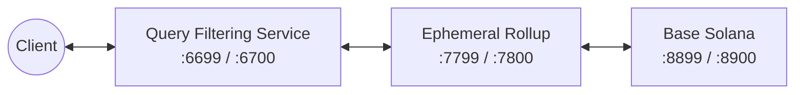

# Aggregated Documentation

Total files: 155

---

# Source: `_llms/cn.md`

**Original URL:** `https://docs.magicblock.gg/_llms/cn.md`

**Local path:** `_llms/cn.md`

---

# MagicBlock Documentation: Chinese

> With MagicBlock, anything you imagine is possible. Build unstoppable games, high-speed DeFi, and Web3 apps that run like Web2.

## Chinese

### 概览

- [产品](https://docs.magicblock.gg/cn/pages/overview/products.md): MagicBlock 是为新金融互联网而生的后端。升级你的 Solana 程序，借助实时 UX、链上隐私和可验证随机性，构建可组合的应用。

#### 更多信息

- [白皮书](https://docs.magicblock.gg/cn/pages/overview/additional-information/whitepaper.md): Ephemeral Rollups Are All You Need (https://arxiv.org/abs/2311.02650)
- [安全与审计](https://docs.magicblock.gg/cn/pages/overview/additional-information/security-and-audits.md): 在 MagicBlock，安全是重中之重。我们的所有核心程序都经过了专业审计，以确保对用户而言具备稳健性与安全性。
- [定价](https://docs.magicblock.gg/cn/pages/overview/additional-information/pricing.md): MagicBlock 的定价模型借鉴了去中心化云基础设施。目标是在为开发者提供 **可预测计算成本** 的同时，也为需要优先访问或专属资源的企业提供 **灵活性**。
- [系统状态](https://docs.magicblock.gg/cn/pages/overview/additional-information/system-status.md)
- [产品征集](https://docs.magicblock.gg/cn/pages/overview/additional-information/request-for-products.md): 通过解决真实问题和社区挑战，迈出教程之外的一步。Request for Products (RFP) 展示了等待像你这样的贡献者参与的开放想法与挑战。
- [MagicBlock Dev Skill](https://docs.magicblock.gg/cn/pages/overview/additional-information/ai-dev-skill.md): 面向 AI 编码 agent 的 MagicBlock Ephemeral Rollups 开发 skill,包含委托、Magic Actions、cranks、VRF、lamports 充值、commit 赞助、带 swaps 的 private payments 以及双连接架构等 MagicBlock 专属模式。

### Ephemeral Rollup

#### 操作指南

- [快速开始](https://docs.magicblock.gg/cn/pages/ephemeral-rollups-ers/how-to-guide/quickstart.md): 任何 Solana 程序都可以通过加入 delegation 能力升级为支持 Ephemeral Rollups。
- [本地开发](https://docs.magicblock.gg/cn/pages/ephemeral-rollups-ers/how-to-guide/local-development.md): 使用完整本地 Ephemeral Rollup 栈、Surfpool 或本地 VRF 预言机来运行和测试你的 Native Rust 或 Anchor 程序。

##### Rust 示例

- [Solana 程序](https://docs.magicblock.gg/cn/pages/ephemeral-rollups-ers/how-to-guide/rust-program.md): 学习如何编写一个在 Solana 上委托并递增计数器的简单 Rust 程序
- [测试你的程序](https://docs.magicblock.gg/cn/pages/ephemeral-rollups-ers/how-to-guide/rust-tests.md): 学习如何测试一个简单的 Rust 程序

#### 参考资料

- [Ephemeral Rollup](https://docs.magicblock.gg/cn/pages/ephemeral-rollups-ers/introduction/why.md): 面向 Solana 实时应用的高性能引擎
- [常见问题](https://docs.magicblock.gg/cn/pages/ephemeral-rollups-ers/introduction/faq.md): 实时执行交易并同步状态。

##### 工作原理

- [委托、提交与取消委托](https://docs.magicblock.gg/cn/pages/ephemeral-rollups-ers/introduction/ephemeral-rollup.md): 实时执行交易并同步状态。
- [Ephemeral Accounts](https://docs.magicblock.gg/cn/pages/ephemeral-rollups-ers/introduction/ephemeral-accounts.md): 创建、调整大小并关闭完全存在于 Ephemeral Rollup 中的账户。
- [Magic Router](https://docs.magicblock.gg/cn/pages/ephemeral-rollups-ers/introduction/magic-router.md): 了解 MagicBlock 的 Magic Router 如何通过将交易路由到正确的执行环境来加速交易。

###### Magic Actions

- [介绍](https://docs.magicblock.gg/cn/pages/ephemeral-rollups-ers/magic-actions/overview.md): 在委托期间自动执行基础层操作
- [程序端实现](https://docs.magicblock.gg/cn/pages/ephemeral-rollups-ers/magic-actions/implementation.md): 使用 Magic Actions 的程序端构建指南
- [客户端实现](https://docs.magicblock.gg/cn/pages/ephemeral-rollups-ers/magic-actions/client.md): 使用 Magic Actions 的客户端构建指南
- [故障排查](https://docs.magicblock.gg/cn/pages/ephemeral-rollups-ers/magic-actions/troubleshooting.md): 诊断 Magic Actions 的常见问题

#### ROUTER API

- [介绍](https://docs.magicblock.gg/cn/pages/ephemeral-rollups-ers/api-reference/er/introduction.md): MagicBlock Router API 文档
- [getRoutes](https://docs.magicblock.gg/cn/pages/ephemeral-rollups-ers/api-reference/er/getRoutes.md): Get available ephemeral rollup nodes from the Magic Router
- [getIdentity](https://docs.magicblock.gg/cn/pages/ephemeral-rollups-ers/api-reference/er/getIdentity.md): Get the identity information of the current ER Validator
- [getBlockhashForAccounts](https://docs.magicblock.gg/cn/pages/ephemeral-rollups-ers/api-reference/er/getBlockhashForAccounts.md): Get blockhash for multiple account addresses.
- [getSignatureStatuses](https://docs.magicblock.gg/cn/pages/ephemeral-rollups-ers/api-reference/er/getSignatureStatuses.md): Returns the confirmation status for one or more signatures
- [getAccountInfo](https://docs.magicblock.gg/cn/pages/ephemeral-rollups-ers/api-reference/er/getAccountInfo.md): Get AccountInfo for a single account.
- [getDelegationStatus](https://docs.magicblock.gg/cn/pages/ephemeral-rollups-ers/api-reference/er/getDelegationStatus.md): Get delegation status for a single account from Magic Router.

#### RPC API

- [RPC API 介绍](https://docs.magicblock.gg/cn/pages/ephemeral-rollups-ers/api-reference/rpc/introduction.md): MagicBlock devnet RPC 端点上的 Solana JSON-RPC HTTP 方法。

##### 方法

- [getAccountInfo](https://docs.magicblock.gg/cn/pages/ephemeral-rollups-ers/api-reference/rpc/getAccountInfo.md): Returns all information associated with an account of provided Pubkey.
- [getBalance](https://docs.magicblock.gg/cn/pages/ephemeral-rollups-ers/api-reference/rpc/getBalance.md): Solana JSON-RPC method getBalance.
- [getBlock](https://docs.magicblock.gg/cn/pages/ephemeral-rollups-ers/api-reference/rpc/getBlock.md): Returns identity and transaction information about a confirmed block in the ledger.
- [getBlockCommitment](https://docs.magicblock.gg/cn/pages/ephemeral-rollups-ers/api-reference/rpc/getBlockCommitment.md): Returns commitment for particular block.
- [getBlockHeight](https://docs.magicblock.gg/cn/pages/ephemeral-rollups-ers/api-reference/rpc/getBlockHeight.md): Returns the current block height of the node.
- [getBlocks](https://docs.magicblock.gg/cn/pages/ephemeral-rollups-ers/api-reference/rpc/getBlocks.md): Returns a list of confirmed blocks between two slots.
- [getBlocksWithLimit](https://docs.magicblock.gg/cn/pages/ephemeral-rollups-ers/api-reference/rpc/getBlocksWithLimit.md): Returns a list of confirmed blocks starting at the given slot for a given limit.
- [getBlockTime](https://docs.magicblock.gg/cn/pages/ephemeral-rollups-ers/api-reference/rpc/getBlockTime.md): Returns the estimated production time of a block.
- [getFirstAvailableBlock](https://docs.magicblock.gg/cn/pages/ephemeral-rollups-ers/api-reference/rpc/getFirstAvailableBlock.md): Solana JSON-RPC method getFirstAvailableBlock.
- [getGenesisHash](https://docs.magicblock.gg/cn/pages/ephemeral-rollups-ers/api-reference/rpc/getGenesisHash.md): Solana JSON-RPC method getGenesisHash.
- [getHealth](https://docs.magicblock.gg/cn/pages/ephemeral-rollups-ers/api-reference/rpc/getHealth.md): Solana JSON-RPC method getHealth.
- [getIdentity](https://docs.magicblock.gg/cn/pages/ephemeral-rollups-ers/api-reference/rpc/getIdentity.md): Solana JSON-RPC method getIdentity.
- [getLargestAccounts](https://docs.magicblock.gg/cn/pages/ephemeral-rollups-ers/api-reference/rpc/getLargestAccounts.md): Returns the 20 largest accounts, by lamport balance.
- [getLatestBlockhash](https://docs.magicblock.gg/cn/pages/ephemeral-rollups-ers/api-reference/rpc/getLatestBlockhash.md): Returns the latest blockhash.
- [getLeaderSchedule](https://docs.magicblock.gg/cn/pages/ephemeral-rollups-ers/api-reference/rpc/getLeaderSchedule.md): Returns the leader schedule for an epoch.
- [getMinimumBalanceForRentExemption](https://docs.magicblock.gg/cn/pages/ephemeral-rollups-ers/api-reference/rpc/getMinimumBalanceForRentExemption.md): Returns minimum balance required to make account rent exempt.
- [getMultipleAccounts](https://docs.magicblock.gg/cn/pages/ephemeral-rollups-ers/api-reference/rpc/getMultipleAccounts.md): Returns the account information for a list of Pubkeys.
- [getProgramAccounts](https://docs.magicblock.gg/cn/pages/ephemeral-rollups-ers/api-reference/rpc/getProgramAccounts.md): Returns all accounts owned by the provided program Pubkey.
- [getRecentPerformanceSamples](https://docs.magicblock.gg/cn/pages/ephemeral-rollups-ers/api-reference/rpc/getRecentPerformanceSamples.md): Returns a list of recent performance samples, in reverse slot order.
- [getSignaturesForAddress](https://docs.magicblock.gg/cn/pages/ephemeral-rollups-ers/api-reference/rpc/getSignaturesForAddress.md): Returns signatures for confirmed transactions that include the given address.
- [getSignatureStatuses](https://docs.magicblock.gg/cn/pages/ephemeral-rollups-ers/api-reference/rpc/getSignatureStatuses.md): Returns the statuses of a list of signatures.
- [getSlot](https://docs.magicblock.gg/cn/pages/ephemeral-rollups-ers/api-reference/rpc/getSlot.md): Returns the slot that has reached the given or default commitment level.
- [getTokenAccountBalance](https://docs.magicblock.gg/cn/pages/ephemeral-rollups-ers/api-reference/rpc/getTokenAccountBalance.md): Returns the token balance of an SPL Token account.
- [getTokenAccountsByDelegate](https://docs.magicblock.gg/cn/pages/ephemeral-rollups-ers/api-reference/rpc/getTokenAccountsByDelegate.md): Returns all SPL Token accounts by approved Delegate.
- [getTokenAccountsByOwner](https://docs.magicblock.gg/cn/pages/ephemeral-rollups-ers/api-reference/rpc/getTokenAccountsByOwner.md): Returns all SPL Token accounts by token owner.
- [getTokenLargestAccounts](https://docs.magicblock.gg/cn/pages/ephemeral-rollups-ers/api-reference/rpc/getTokenLargestAccounts.md): Returns the 20 largest accounts of a particular SPL Token type.
- [getTokenSupply](https://docs.magicblock.gg/cn/pages/ephemeral-rollups-ers/api-reference/rpc/getTokenSupply.md): Returns the total supply of an SPL Token type.
- [getTransaction](https://docs.magicblock.gg/cn/pages/ephemeral-rollups-ers/api-reference/rpc/getTransaction.md): Returns transaction details for a confirmed transaction.
- [getTransactionCount](https://docs.magicblock.gg/cn/pages/ephemeral-rollups-ers/api-reference/rpc/getTransactionCount.md): Returns the current transaction count from the ledger.
- [getVersion](https://docs.magicblock.gg/cn/pages/ephemeral-rollups-ers/api-reference/rpc/getVersion.md): Solana JSON-RPC method getVersion.
- [isBlockhashValid](https://docs.magicblock.gg/cn/pages/ephemeral-rollups-ers/api-reference/rpc/isBlockhashValid.md): Returns whether a blockhash is still valid or not.
- [sendTransaction](https://docs.magicblock.gg/cn/pages/ephemeral-rollups-ers/api-reference/rpc/sendTransaction.md): Submits a signed transaction to the cluster for processing.
- [simulateTransaction](https://docs.magicblock.gg/cn/pages/ephemeral-rollups-ers/api-reference/rpc/simulateTransaction.md): Simulate sending a transaction.

### Private Ephemeral Rollup

#### 操作指南

- [快速开始](https://docs.magicblock.gg/cn/pages/private-ephemeral-rollups-pers/how-to-guide/quickstart.md): 通过 MagicBlock 的 ER 和基于 Intel TDX 的 Trusted Execution Environment，为任意 Solana 程序状态账户启用隐私。
- [访问控制](https://docs.magicblock.gg/cn/pages/private-ephemeral-rollups-pers/how-to-guide/access-control.md): 了解如何在 Private Ephemeral Rollups 中管理细粒度访问控制和成员权限。

#### 参考资料

- [链上隐私](https://docs.magicblock.gg/cn/pages/private-ephemeral-rollups-pers/introduction/onchain-privacy.md): 面向 Solana 上需要隐私与合规的实时应用的高性能引擎
- [授权](https://docs.magicblock.gg/cn/pages/private-ephemeral-rollups-pers/introduction/authorization.md): 通过链上账户级限制，为用户组定制授权访问。
- [合规框架](https://docs.magicblock.gg/cn/pages/private-ephemeral-rollups-pers/introduction/compliance-framework.md): MagicBlock 在不牺牲性能、合规性或控制力的前提下实现机密执行。

#### Private Payments API

- [介绍](https://docs.magicblock.gg/cn/pages/private-ephemeral-rollups-pers/api-reference/per/introduction.md): Private Payments API 文档
- [健康状态](https://docs.magicblock.gg/cn/pages/private-ephemeral-rollups-pers/api-reference/per/health.md)
- [Challenge](https://docs.magicblock.gg/cn/pages/private-ephemeral-rollups-pers/api-reference/per/challenge.md)
- [Login](https://docs.magicblock.gg/cn/pages/private-ephemeral-rollups-pers/api-reference/per/login.md)
- [存入 SPL Tokens](https://docs.magicblock.gg/cn/pages/private-ephemeral-rollups-pers/api-reference/per/deposit.md)
- [转移 SPL Tokens](https://docs.magicblock.gg/cn/pages/private-ephemeral-rollups-pers/api-reference/per/transfer.md)
- [提取 SPL Tokens](https://docs.magicblock.gg/cn/pages/private-ephemeral-rollups-pers/api-reference/per/withdraw.md)
- [初始化 Mint](https://docs.magicblock.gg/cn/pages/private-ephemeral-rollups-pers/api-reference/per/initialize-mint.md)
- [余额](https://docs.magicblock.gg/cn/pages/private-ephemeral-rollups-pers/api-reference/per/balance.md)
- [私密余额](https://docs.magicblock.gg/cn/pages/private-ephemeral-rollups-pers/api-reference/per/private-balance.md)
- [Mint 是否已初始化](https://docs.magicblock.gg/cn/pages/private-ephemeral-rollups-pers/api-reference/per/is-mint-initialized.md)
- [Swap 报价](https://docs.magicblock.gg/cn/pages/private-ephemeral-rollups-pers/api-reference/per/quote.md)
- [Swap](https://docs.magicblock.gg/cn/pages/private-ephemeral-rollups-pers/api-reference/per/swap.md)
- [MCP](https://docs.magicblock.gg/cn/pages/private-ephemeral-rollups-pers/api-reference/per/mcp.md)

### Ephemeral SPL Token

#### 开始使用

- [Ephemeral SPL Token](https://docs.magicblock.gg/cn/pages/ephemeral-spl-token/overview.md): 使用 Ephemeral SPL Token 程序，以 Ephemeral Rollup 的速度转移 SPL token，并了解 eATA、Global Vault、委托、托管与私密支付模型。
- [Ephemeral SPL Token 快速入门](https://docs.magicblock.gg/cn/pages/ephemeral-spl-token/quickstart.md): 使用 ephemeral-rollups-sdk 将 SPL token account 委托给 Ephemeral Rollup，在 ER 上转账，并提取回 base layer。

#### 指南

- [智能合约集成](https://docs.magicblock.gg/cn/pages/ephemeral-spl-token/smart-contract-integration.md): 在 Ephemeral Rollup 上通过你自己的 Solana 程序托管并转移 SPL token，包括 PDA 签名转账、委托以及提交/取消委托。
- [使用 Ephemeral SPL Token 进行私密支付](https://docs.magicblock.gg/cn/pages/ephemeral-spl-token/private-payments.md): 使用 Ephemeral SPL Token 实现私密存入、转账和提取，并通过托管 API 使用私密可见性、stealth handle 与队列式结算。

#### API 参考

- [简介](https://docs.magicblock.gg/cn/pages/ephemeral-spl-token/api-reference/introduction.md): Ephemeral SPL Token API 文档
- [健康状态](https://docs.magicblock.gg/cn/pages/ephemeral-spl-token/api-reference/health.md)
- [MCP](https://docs.magicblock.gg/cn/pages/ephemeral-spl-token/api-reference/mcp.md)

##### 核心 Token API

- [存入 SPL Token](https://docs.magicblock.gg/cn/pages/ephemeral-spl-token/api-reference/deposit.md): Wraps the SDK `delegateSpl(...)` flow. The API generates `shuttleId` server-side and pins `escrowIndex` to `0`.
- [转移 SPL Token](https://docs.magicblock.gg/cn/pages/ephemeral-spl-token/api-reference/transfer.md): Transfer SPL tokens publicly or privately through an ephemeral rollup. Accepts an optional `Authorization: Bearer <token>` header obtained from the `/v1/spl/login` flow when the request needs to read or write data inside the Private Ephemeral Rollup.
- [提取 SPL Token](https://docs.magicblock.gg/cn/pages/ephemeral-spl-token/api-reference/withdraw.md): Wraps the SDK `withdrawSpl(...)` flow. The API generates `shuttleId` server-side.
- [余额](https://docs.magicblock.gg/cn/pages/ephemeral-spl-token/api-reference/balance.md): Reads the owner's associated token account on the base RPC.
- [初始化 Mint](https://docs.magicblock.gg/cn/pages/ephemeral-spl-token/api-reference/initialize-mint.md)
- [Mint 是否已初始化](https://docs.magicblock.gg/cn/pages/ephemeral-spl-token/api-reference/is-mint-initialized.md)
- [取消委托 Ephemeral ATA](https://docs.magicblock.gg/cn/pages/ephemeral-spl-token/api-reference/undelegate-ephemeral-ata.md): Build an unsigned ephemeral-rollup transaction that undelegates a wallet's ephemeral ATA (eATA) for a mint, committing its balance back toward the base layer. Accepts an optional `Authorization: Bearer <token>` header.
- [发送交易](https://docs.magicblock.gg/cn/pages/ephemeral-spl-token/api-reference/transaction-send.md): Submit a signed, serialized transaction. Use the `sendTo` value returned by a build endpoint (deposit / transfer / withdraw / stealth-pool) to route the transaction to the base layer or the ephemeral RPC. Accepts an optional `Authorization: Bearer <token>` header for ephemeral submissions that requi…

##### 私密支付

- [挑战](https://docs.magicblock.gg/cn/pages/ephemeral-spl-token/api-reference/challenge.md): Returns a challenge string that the wallet must sign. The signature is then submitted to `/v1/spl/login` in exchange for a bearer token used to read private data.
- [登录](https://docs.magicblock.gg/cn/pages/ephemeral-spl-token/api-reference/login.md): Verifies the wallet's signature over the challenge issued by `/v1/spl/challenge` and returns an authentication token. Pass the token as `Authorization: Bearer <token>` on `/v1/spl/private-balance` and on `/v1/spl/transfer` requests that need to connect to the Private Ephemeral Rollup.
- [私密余额](https://docs.magicblock.gg/cn/pages/ephemeral-spl-token/api-reference/private-balance.md): Reads the owner's associated token account on the ephemeral RPC. Requires an `Authorization: Bearer <token>` header obtained from `/v1/spl/login`.
- [创建 Stealth Pool](https://docs.magicblock.gg/cn/pages/ephemeral-spl-token/api-reference/stealth-pool.md): Build unsigned stealth-pool setup and ER update transactions that map a handle to 1-10 destination owner keys. Requires an `Authorization: Bearer <token>` header from the `/v1/spl/login` flow. Once initialized, the handle can be used as the `to` value of a private `/v1/spl/transfer`.
- [获取 Stealth Pool 状态](https://docs.magicblock.gg/cn/pages/ephemeral-spl-token/api-reference/stealth-pool-status.md): Derive a stealth-pool PDA from an exact handle and report whether the base account exists. Does not return the destination keys.
- [确保 Transfer Queue Crank 运行](https://docs.magicblock.gg/cn/pages/ephemeral-spl-token/api-reference/transfer-queue-ensure-crank.md): After setup confirmation, verify that the validator-scoped transfer queue exists for a mint and force one crank attempt. Used to make sure queued private transfers make progress.

##### Swap

- [Swap 报价](https://docs.magicblock.gg/cn/pages/ephemeral-spl-token/api-reference/quote.md): Returns a swap quote between two SPL mints. The quote response can be passed as-is into `POST /v1/swap/swap` to build the swap transaction.
- [兑换](https://docs.magicblock.gg/cn/pages/ephemeral-spl-token/api-reference/swap.md): Build an unsigned swap transaction from a quote.

### Solana VRF

#### 操作指南

- [快速开始](https://docs.magicblock.gg/cn/pages/verifiable-randomness-functions-vrfs/how-to-guide/quickstart.md): 了解如何使用 MagicBlock VRF SDK 请求并消费 Solana VRF 链上随机数。
- [最佳实践](https://docs.magicblock.gg/cn/pages/verifiable-randomness-functions-vrfs/how-to-guide/best-practices.md): 集成可验证随机数的指导原则

#### 参考资料

- [概览](https://docs.magicblock.gg/cn/pages/verifiable-randomness-functions-vrfs/introduction/solana-vrf.md): 使用 Solana VRF 为 Solana 游戏、抽奖、抽卡、匹配和实时应用请求可证明公平的随机数。
- [定价](https://docs.magicblock.gg/cn/pages/verifiable-randomness-functions-vrfs/introduction/pricing.md): MagicBlock Solana VRF 可证明公平随机数请求的定价。

##### 工作原理

- [技术细节](https://docs.magicblock.gg/cn/pages/verifiable-randomness-functions-vrfs/introduction/technical-details.md): Solana VRF 如何与 MagicBlock 集成
- [安全性](https://docs.magicblock.gg/cn/pages/verifiable-randomness-functions-vrfs/introduction/security.md): Solana VRF 随机数证明如何被验证
- [常见问题](https://docs.magicblock.gg/cn/pages/verifiable-randomness-functions-vrfs/introduction/faq.md): 关于 Solana VRF 的常见问题

### 模板

- [私密支付](https://docs.magicblock.gg/cn/pages/templates/private-payments.md)
- [石头剪刀布](https://docs.magicblock.gg/cn/pages/templates/rock-paper-scissors.md)
- [实时价格源](https://docs.magicblock.gg/cn/pages/templates/real-time-price-feed.md)
- [Gachapon](https://docs.magicblock.gg/cn/pages/templates/gachapon.md)
- [随机角色生成器](https://docs.magicblock.gg/cn/pages/templates/random-character-generator.md)
- [链上骰子](https://docs.magicblock.gg/cn/pages/templates/onchain-dice.md)
- [计数器](https://docs.magicblock.gg/cn/pages/templates/counter.md)

### 工具

#### 工具

- [介绍](https://docs.magicblock.gg/cn/pages/tools/introduction.md): 利用现有 SDK 与框架加速你的开发流程

#### Wallets & Onramp

- [概览](https://docs.magicblock.gg/cn/pages/tools/wallets-and-onramp/overview.md): 使用现有钱包与入金方案加速用户接入

#### Session Keys

- [介绍](https://docs.magicblock.gg/cn/pages/tools/session-keys/introduction.md): 什么是 Session Keys？
- [Session Keys 如何工作？](https://docs.magicblock.gg/cn/pages/tools/session-keys/how-do-session-keys-work.md): 什么是 Session Keys？
- [安全](https://docs.magicblock.gg/cn/pages/tools/session-keys/security.md): 密钥管理与安全模型

##### 开始使用

- [在程序中集成 Sessions](https://docs.magicblock.gg/cn/pages/tools/session-keys/integrating-sessions-in-your-program.md): 在你的 Solana Programs 中集成并管理 sessions
- [安装](https://docs.magicblock.gg/cn/pages/tools/session-keys/installation.md): 逐步说明如何在你的 dApp 中设置并集成会话钱包管理系统
- [Session Provider 与 Context](https://docs.magicblock.gg/cn/pages/tools/session-keys/session-provider-and-context.md): 理解 SessionWalletProvider 及其提供的上下文用法，以便在应用组件间轻松访问会话钱包功能
- [使用示例](https://docs.magicblock.gg/cn/pages/tools/session-keys/usage-examples.md): 通过多个实用示例，学习如何使用 useSessionKeyManager 和 SessionWalletProvider 与你的 dApp 交互
- [使用 session key manager](https://docs.magicblock.gg/cn/pages/tools/session-keys/use-sessionkey-manager.md): 一个自定义 React hook，用于管理会话令牌的创建与撤销，并以安全且易用的方式提供签名和发送交易所需的核心方法

#### Oracles

- [介绍](https://docs.magicblock.gg/cn/pages/tools/oracle/introduction.md): 借助 MagicBlock Ephemeral Rollups 获取实时链上数据
- [实现](https://docs.magicblock.gg/cn/pages/tools/oracle/implementation.md): 推导 Pyth Lazer 价格源账户并解码其字节数据

#### Cranks

- [介绍](https://docs.magicblock.gg/cn/pages/tools/crank/introduction.md): 按时间自动执行链上指令
- [实现](https://docs.magicblock.gg/cn/pages/tools/crank/implementation.md): 了解如何在 Solana program 中使用 MagicBlock Ephemeral Rollups 实现 crank

#### Solana Unity SDK

- [介绍](https://docs.magicblock.gg/cn/pages/tools/solana-unity-sdk/overview.md): 开源 Unity-Solana SDK，支持 NFT 与完整 RPC 覆盖。
- [贡献指南](https://docs.magicblock.gg/cn/pages/tools/solana-unity-sdk/contribution-guide.md): 感谢你有兴趣为 Solana.Unity-SDK 做出贡献！这是一个开源社区项目，无论贡献大小，我们都非常欢迎。贡献形式包括但不限于提交问题、补充文档、修复漏洞、创建示例以及实现功能。

##### 开始使用

- [安装](https://docs.magicblock.gg/cn/pages/tools/solana-unity-sdk/getting-started/installation.md)
- [配置](https://docs.magicblock.gg/cn/pages/tools/solana-unity-sdk/getting-started/configuration.md): 了解如何配置你偏好的钱包
- [示例场景](https://docs.magicblock.gg/cn/pages/tools/solana-unity-sdk/getting-started/sample-scene.md): 体验示例场景

##### 核心概念

- [关联代币账户](https://docs.magicblock.gg/cn/pages/tools/solana-unity-sdk/core-concepts/associated-token-account.md): Associated Token Account Program 定义了约定，并提供了将用户钱包地址映射到其持有关联代币账户的机制。
- [转移代币](https://docs.magicblock.gg/cn/pages/tools/solana-unity-sdk/core-concepts/transfer-token.md): Token program 为同质化代币和非同质化代币定义了通用实现。
- [交易构建器](https://docs.magicblock.gg/cn/pages/tools/solana-unity-sdk/core-concepts/transaction-builder.md): Learn about Transactions on the official Anchor [documentation](https://www.anchor-lang.com/docs/intro-to-solana)
- [质押](https://docs.magicblock.gg/cn/pages/tools/solana-unity-sdk/core-concepts/staking.md): SOL 代币持有者可以将代币质押给一个或多个验证器，以赚取奖励并帮助保护网络。质押奖励取决于当前通胀率、网络中的总质押 SOL 数量，以及单个验证器的在线率和佣金（费用）。
- [添加签名](https://docs.magicblock.gg/cn/pages/tools/solana-unity-sdk/core-concepts/add-signature.md): 可在 Solana 官方[文档](https://docs.solana.com/developing/programming-model/accounts#signers)中了解 Signatures

##### 指南

- [铸造 NFT](https://docs.magicblock.gg/cn/pages/tools/solana-unity-sdk/guides/mint-an-nft.md): 要铸造 NFT，我们将与 [Token Metadata](https://docs.metaplex.com/programs/token-metadata/) 程序交互。完整概览请参阅 metaplex [文档](https://docs.metaplex.com/)。
- [在 Github Pages 上托管你的游戏](https://docs.magicblock.gg/cn/pages/tools/solana-unity-sdk/guides/host-your-game.md): 使用 Github Pages 免费托管你的游戏
- [将你的游戏发布为 xNFT](https://docs.magicblock.gg/cn/pages/tools/solana-unity-sdk/guides/publishing-a-game.md)
- [与 Orca 的 DEX 集成](https://docs.magicblock.gg/cn/pages/tools/solana-unity-sdk/guides/dex-integration.md): SDK 原生支持 Orca，并提供便捷的工具方法来构建交换、开仓、资金管理和与 Whirlpools 交互所需的交易。
- [Jupiter V6 集成](https://docs.magicblock.gg/cn/pages/tools/solana-unity-sdk/guides/jupiter.md): 在你的游戏中集成 Jupiter v6 API
- [更多示例](https://docs.magicblock.gg/cn/pages/tools/solana-unity-sdk/guides/additional-examples.md)

#### On-chain identity

- [SOAR](https://docs.magicblock.gg/cn/pages/tools/open-source-programs/SOAR.md): Solana 链上成就与排名

## OpenAPI Specs

- [openapi-getRoutes](/pages/ephemeral-rollups-ers/api-reference/er/openapi/openapi-getRoutes.json)
- [openapi-getIdentity](/pages/ephemeral-rollups-ers/api-reference/er/openapi/openapi-getIdentity.json)
- [openapi-getBlockhashForAccounts](/pages/ephemeral-rollups-ers/api-reference/er/openapi/openapi-getBlockhashForAccounts.json)
- [openapi-getSignatureStatuses](/pages/ephemeral-rollups-ers/api-reference/er/openapi/openapi-getSignatureStatuses.json)
- [openapi-getAccountInfo](/pages/ephemeral-rollups-ers/api-reference/er/openapi/openapi-getAccountInfo.json)
- [openapi-getDelegationStatus](/pages/ephemeral-rollups-ers/api-reference/er/openapi/openapi-getDelegationStatus.json)
- [openapi-rpc-getAccountInfo](/pages/ephemeral-rollups-ers/api-reference/rpc/openapi/openapi-rpc-getAccountInfo.json)
- [openapi-rpc-getBalance](/pages/ephemeral-rollups-ers/api-reference/rpc/openapi/openapi-rpc-getBalance.json)
- [openapi-rpc-getBlock](/pages/ephemeral-rollups-ers/api-reference/rpc/openapi/openapi-rpc-getBlock.json)
- [openapi-rpc-getBlockCommitment](/pages/ephemeral-rollups-ers/api-reference/rpc/openapi/openapi-rpc-getBlockCommitment.json)
- [openapi-rpc-getBlockHeight](/pages/ephemeral-rollups-ers/api-reference/rpc/openapi/openapi-rpc-getBlockHeight.json)
- [openapi-rpc-getBlocks](/pages/ephemeral-rollups-ers/api-reference/rpc/openapi/openapi-rpc-getBlocks.json)
- [openapi-rpc-getBlocksWithLimit](/pages/ephemeral-rollups-ers/api-reference/rpc/openapi/openapi-rpc-getBlocksWithLimit.json)
- [openapi-rpc-getBlockTime](/pages/ephemeral-rollups-ers/api-reference/rpc/openapi/openapi-rpc-getBlockTime.json)
- [openapi-rpc-getFirstAvailableBlock](/pages/ephemeral-rollups-ers/api-reference/rpc/openapi/openapi-rpc-getFirstAvailableBlock.json)
- [openapi-rpc-getGenesisHash](/pages/ephemeral-rollups-ers/api-reference/rpc/openapi/openapi-rpc-getGenesisHash.json)
- [openapi-rpc-getHealth](/pages/ephemeral-rollups-ers/api-reference/rpc/openapi/openapi-rpc-getHealth.json)
- [openapi-rpc-getIdentity](/pages/ephemeral-rollups-ers/api-reference/rpc/openapi/openapi-rpc-getIdentity.json)
- [openapi-rpc-getLargestAccounts](/pages/ephemeral-rollups-ers/api-reference/rpc/openapi/openapi-rpc-getLargestAccounts.json)
- [openapi-rpc-getLatestBlockhash](/pages/ephemeral-rollups-ers/api-reference/rpc/openapi/openapi-rpc-getLatestBlockhash.json)
- [openapi-rpc-getLeaderSchedule](/pages/ephemeral-rollups-ers/api-reference/rpc/openapi/openapi-rpc-getLeaderSchedule.json)
- [openapi-rpc-getMinimumBalanceForRentExemption](/pages/ephemeral-rollups-ers/api-reference/rpc/openapi/openapi-rpc-getMinimumBalanceForRentExemption.json)
- [openapi-rpc-getMultipleAccounts](/pages/ephemeral-rollups-ers/api-reference/rpc/openapi/openapi-rpc-getMultipleAccounts.json)
- [openapi-rpc-getProgramAccounts](/pages/ephemeral-rollups-ers/api-reference/rpc/openapi/openapi-rpc-getProgramAccounts.json)
- [openapi-rpc-getRecentPerformanceSamples](/pages/ephemeral-rollups-ers/api-reference/rpc/openapi/openapi-rpc-getRecentPerformanceSamples.json)
- [openapi-rpc-getSignaturesForAddress](/pages/ephemeral-rollups-ers/api-reference/rpc/openapi/openapi-rpc-getSignaturesForAddress.json)
- [openapi-rpc-getSignatureStatuses](/pages/ephemeral-rollups-ers/api-reference/rpc/openapi/openapi-rpc-getSignatureStatuses.json)
- [openapi-rpc-getSlot](/pages/ephemeral-rollups-ers/api-reference/rpc/openapi/openapi-rpc-getSlot.json)
- [openapi-rpc-getTokenAccountBalance](/pages/ephemeral-rollups-ers/api-reference/rpc/openapi/openapi-rpc-getTokenAccountBalance.json)
- [openapi-rpc-getTokenAccountsByDelegate](/pages/ephemeral-rollups-ers/api-reference/rpc/openapi/openapi-rpc-getTokenAccountsByDelegate.json)
- [openapi-rpc-getTokenAccountsByOwner](/pages/ephemeral-rollups-ers/api-reference/rpc/openapi/openapi-rpc-getTokenAccountsByOwner.json)
- [openapi-rpc-getTokenLargestAccounts](/pages/ephemeral-rollups-ers/api-reference/rpc/openapi/openapi-rpc-getTokenLargestAccounts.json)
- [openapi-rpc-getTokenSupply](/pages/ephemeral-rollups-ers/api-reference/rpc/openapi/openapi-rpc-getTokenSupply.json)
- [openapi-rpc-getTransaction](/pages/ephemeral-rollups-ers/api-reference/rpc/openapi/openapi-rpc-getTransaction.json)
- [openapi-rpc-getTransactionCount](/pages/ephemeral-rollups-ers/api-reference/rpc/openapi/openapi-rpc-getTransactionCount.json)
- [openapi-rpc-getVersion](/pages/ephemeral-rollups-ers/api-reference/rpc/openapi/openapi-rpc-getVersion.json)
- [openapi-rpc-isBlockhashValid](/pages/ephemeral-rollups-ers/api-reference/rpc/openapi/openapi-rpc-isBlockhashValid.json)
- [openapi-rpc-sendTransaction](/pages/ephemeral-rollups-ers/api-reference/rpc/openapi/openapi-rpc-sendTransaction.json)
- [openapi-rpc-simulateTransaction](/pages/ephemeral-rollups-ers/api-reference/rpc/openapi/openapi-rpc-simulateTransaction.json)
- [deposit.openapi](/pages/ephemeral-spl-token/api-reference/openapi/deposit.openapi.json)
- [transfer.openapi](/pages/ephemeral-spl-token/api-reference/openapi/transfer.openapi.json)
- [withdraw.openapi](/pages/ephemeral-spl-token/api-reference/openapi/withdraw.openapi.json)
- [balance.openapi](/pages/ephemeral-spl-token/api-reference/openapi/balance.openapi.json)
- [initialize-mint.openapi](/pages/ephemeral-spl-token/api-reference/openapi/initialize-mint.openapi.json)
- [is-mint-initialized.openapi](/pages/ephemeral-spl-token/api-reference/openapi/is-mint-initialized.openapi.json)
- [undelegate-ephemeral-ata.openapi](/pages/ephemeral-spl-token/api-reference/openapi/undelegate-ephemeral-ata.openapi.json)
- [transaction-send.openapi](/pages/ephemeral-spl-token/api-reference/openapi/transaction-send.openapi.json)
- [challenge.openapi](/pages/ephemeral-spl-token/api-reference/openapi/challenge.openapi.json)
- [login.openapi](/pages/ephemeral-spl-token/api-reference/openapi/login.openapi.json)
- [private-balance.openapi](/pages/ephemeral-spl-token/api-reference/openapi/private-balance.openapi.json)
- [stealth-pool.openapi](/pages/ephemeral-spl-token/api-reference/openapi/stealth-pool.openapi.json)
- [transfer-queue-ensure-crank.openapi](/pages/ephemeral-spl-token/api-reference/openapi/transfer-queue-ensure-crank.openapi.json)
- [quote.openapi](/pages/ephemeral-spl-token/api-reference/openapi/quote.openapi.json)
- [swap.openapi](/pages/ephemeral-spl-token/api-reference/openapi/swap.openapi.json)
- [health.openapi](/pages/ephemeral-spl-token/api-reference/openapi/health.openapi.json)
- [mcp.openapi](/pages/ephemeral-spl-token/api-reference/openapi/mcp.openapi.json)

<!-- END SOURCE: _llms/cn.md -->

---

# Source: `_llms/jp.md`

**Original URL:** `https://docs.magicblock.gg/_llms/jp.md`

**Local path:** `_llms/jp.md`

---

# MagicBlock Documentation: Japanese

> With MagicBlock, anything you imagine is possible. Build unstoppable games, high-speed DeFi, and Web3 apps that run like Web2.

## Japanese

### 概要

- [製品](https://docs.magicblock.gg/jp/pages/overview/products.md): MagicBlock は新しい金融インターネットのためのバックエンドです。あなたの Solana プログラムをアップグレードし、リアルタイム UX、オンチェーンプライバシー、検証可能なランダム性を備えたコンポーザブルなアプリケーションを構築しましょう。

#### 追加情報

- [ホワイトペーパー](https://docs.magicblock.gg/jp/pages/overview/additional-information/whitepaper.md): Ephemeral Rollups Are All You Need (https://arxiv.org/abs/2311.02650)
- [セキュリティと監査](https://docs.magicblock.gg/jp/pages/overview/additional-information/security-and-audits.md): MagicBlock ではセキュリティを最優先事項としています。すべてのコアプログラムは、堅牢性と安全性を確保するために専門監査を受けています。
- [料金](https://docs.magicblock.gg/jp/pages/overview/additional-information/pricing.md): MagicBlock の料金体系は分散型クラウドインフラをモデルにしています。開発者にとって **予測しやすい計算コスト** を保ちながら、優先アクセスや専用リソースが必要な企業向けに **柔軟性** も提供します。
- [システムステータス](https://docs.magicblock.gg/jp/pages/overview/additional-information/system-status.md)
- [製品提案](https://docs.magicblock.gg/jp/pages/overview/additional-information/request-for-products.md): チュートリアルを超えて、実際の課題やコミュニティの挑戦に取り組みましょう。Request for Products (RFP) には、あなたのようなコントリビューターを待つアイデアや課題が並んでいます。
- [MagicBlock Dev Skill](https://docs.magicblock.gg/jp/pages/overview/additional-information/ai-dev-skill.md): AI コーディングエージェント向けの MagicBlock Ephemeral Rollups 開発 skill。委任、Magic Actions、cranks、VRF、lamports トップアップ、commit スポンサーシップ、swaps を含む private payments、デュアルコネクションアーキテクチャなどの MagicBlock 固有パターンを含みます。

### Ephemeral Rollup

#### ガイド

- [クイックスタート](https://docs.magicblock.gg/jp/pages/ephemeral-rollups-ers/how-to-guide/quickstart.md): どの Solana プログラムでも、delegation 機能を追加することで Ephemeral Rollups に対応できます。
- [ローカル開発](https://docs.magicblock.gg/jp/pages/ephemeral-rollups-ers/how-to-guide/local-development.md): 完全ローカルな Ephemeral Rollup スタック、Surfpool、またはローカル VRF オラクルを使って Native Rust や Anchor のプログラムを実行・テストします。

##### Rust 例

- [Solana プログラム](https://docs.magicblock.gg/jp/pages/ephemeral-rollups-ers/how-to-guide/rust-program.md): Solana 上でカウンターを委任し増加させるシンプルな Rust プログラムの書き方を学ぶ
- [プログラムをテストする](https://docs.magicblock.gg/jp/pages/ephemeral-rollups-ers/how-to-guide/rust-tests.md): シンプルな Rust プログラムのテスト方法を学ぶ

#### 参考資料

- [Ephemeral Rollup](https://docs.magicblock.gg/jp/pages/ephemeral-rollups-ers/introduction/why.md): Solana 上のリアルタイムアプリケーション向け高性能エンジン
- [よくある質問](https://docs.magicblock.gg/jp/pages/ephemeral-rollups-ers/introduction/faq.md): トランザクション実行も状態同期も、すべてリアルタイム。

##### 仕組み

- [委任、コミット、Undelegation](https://docs.magicblock.gg/jp/pages/ephemeral-rollups-ers/introduction/ephemeral-rollup.md): トランザクション実行も状態同期も、すべてリアルタイム。
- [Ephemeral Accounts](https://docs.magicblock.gg/jp/pages/ephemeral-rollups-ers/introduction/ephemeral-accounts.md): Ephemeral Rollup 上だけに存在するアカウントを作成・リサイズ・クローズします。
- [Magic Router](https://docs.magicblock.gg/jp/pages/ephemeral-rollups-ers/introduction/magic-router.md): MagicBlock の Magic Router が、適切な実行環境へルーティングすることで取引をどう高速化するかを学びましょう。

###### Magic Actions

- [概要](https://docs.magicblock.gg/jp/pages/ephemeral-rollups-ers/magic-actions/overview.md): 委任中にベースレイヤーのアクションを自動実行
- [プログラム実装](https://docs.magicblock.gg/jp/pages/ephemeral-rollups-ers/magic-actions/implementation.md): Magic Actions を構築するためのプログラム側ガイド
- [クライアント実装](https://docs.magicblock.gg/jp/pages/ephemeral-rollups-ers/magic-actions/client.md): Magic Actions を構築するためのクライアント側ガイド
- [トラブルシューティング](https://docs.magicblock.gg/jp/pages/ephemeral-rollups-ers/magic-actions/troubleshooting.md): Magic Actions の一般的な問題を診断する

#### ROUTER API

- [概要](https://docs.magicblock.gg/jp/pages/ephemeral-rollups-ers/api-reference/er/introduction.md): MagicBlock Router API ドキュメント
- [getRoutes](https://docs.magicblock.gg/jp/pages/ephemeral-rollups-ers/api-reference/er/getRoutes.md): Get available ephemeral rollup nodes from the Magic Router
- [getIdentity](https://docs.magicblock.gg/jp/pages/ephemeral-rollups-ers/api-reference/er/getIdentity.md): Get the identity information of the current ER Validator
- [getBlockhashForAccounts](https://docs.magicblock.gg/jp/pages/ephemeral-rollups-ers/api-reference/er/getBlockhashForAccounts.md): Get blockhash for multiple account addresses.
- [getSignatureStatuses](https://docs.magicblock.gg/jp/pages/ephemeral-rollups-ers/api-reference/er/getSignatureStatuses.md): Returns the confirmation status for one or more signatures
- [getAccountInfo](https://docs.magicblock.gg/jp/pages/ephemeral-rollups-ers/api-reference/er/getAccountInfo.md): Get AccountInfo for a single account.
- [getDelegationStatus](https://docs.magicblock.gg/jp/pages/ephemeral-rollups-ers/api-reference/er/getDelegationStatus.md): Get delegation status for a single account from Magic Router.

#### RPC API

- [RPC API 紹介](https://docs.magicblock.gg/jp/pages/ephemeral-rollups-ers/api-reference/rpc/introduction.md): MagicBlock devnet RPC エンドポイント上の Solana JSON-RPC HTTP メソッド。

##### メソッド

- [getAccountInfo](https://docs.magicblock.gg/jp/pages/ephemeral-rollups-ers/api-reference/rpc/getAccountInfo.md): Returns all information associated with an account of provided Pubkey.
- [getBalance](https://docs.magicblock.gg/jp/pages/ephemeral-rollups-ers/api-reference/rpc/getBalance.md): Solana JSON-RPC method getBalance.
- [getBlock](https://docs.magicblock.gg/jp/pages/ephemeral-rollups-ers/api-reference/rpc/getBlock.md): Returns identity and transaction information about a confirmed block in the ledger.
- [getBlockCommitment](https://docs.magicblock.gg/jp/pages/ephemeral-rollups-ers/api-reference/rpc/getBlockCommitment.md): Returns commitment for particular block.
- [getBlockHeight](https://docs.magicblock.gg/jp/pages/ephemeral-rollups-ers/api-reference/rpc/getBlockHeight.md): Returns the current block height of the node.
- [getBlocks](https://docs.magicblock.gg/jp/pages/ephemeral-rollups-ers/api-reference/rpc/getBlocks.md): Returns a list of confirmed blocks between two slots.
- [getBlocksWithLimit](https://docs.magicblock.gg/jp/pages/ephemeral-rollups-ers/api-reference/rpc/getBlocksWithLimit.md): Returns a list of confirmed blocks starting at the given slot for a given limit.
- [getBlockTime](https://docs.magicblock.gg/jp/pages/ephemeral-rollups-ers/api-reference/rpc/getBlockTime.md): Returns the estimated production time of a block.
- [getFirstAvailableBlock](https://docs.magicblock.gg/jp/pages/ephemeral-rollups-ers/api-reference/rpc/getFirstAvailableBlock.md): Solana JSON-RPC method getFirstAvailableBlock.
- [getGenesisHash](https://docs.magicblock.gg/jp/pages/ephemeral-rollups-ers/api-reference/rpc/getGenesisHash.md): Solana JSON-RPC method getGenesisHash.
- [getHealth](https://docs.magicblock.gg/jp/pages/ephemeral-rollups-ers/api-reference/rpc/getHealth.md): Solana JSON-RPC method getHealth.
- [getIdentity](https://docs.magicblock.gg/jp/pages/ephemeral-rollups-ers/api-reference/rpc/getIdentity.md): Solana JSON-RPC method getIdentity.
- [getLargestAccounts](https://docs.magicblock.gg/jp/pages/ephemeral-rollups-ers/api-reference/rpc/getLargestAccounts.md): Returns the 20 largest accounts, by lamport balance.
- [getLatestBlockhash](https://docs.magicblock.gg/jp/pages/ephemeral-rollups-ers/api-reference/rpc/getLatestBlockhash.md): Returns the latest blockhash.
- [getLeaderSchedule](https://docs.magicblock.gg/jp/pages/ephemeral-rollups-ers/api-reference/rpc/getLeaderSchedule.md): Returns the leader schedule for an epoch.
- [getMinimumBalanceForRentExemption](https://docs.magicblock.gg/jp/pages/ephemeral-rollups-ers/api-reference/rpc/getMinimumBalanceForRentExemption.md): Returns minimum balance required to make account rent exempt.
- [getMultipleAccounts](https://docs.magicblock.gg/jp/pages/ephemeral-rollups-ers/api-reference/rpc/getMultipleAccounts.md): Returns the account information for a list of Pubkeys.
- [getProgramAccounts](https://docs.magicblock.gg/jp/pages/ephemeral-rollups-ers/api-reference/rpc/getProgramAccounts.md): Returns all accounts owned by the provided program Pubkey.
- [getRecentPerformanceSamples](https://docs.magicblock.gg/jp/pages/ephemeral-rollups-ers/api-reference/rpc/getRecentPerformanceSamples.md): Returns a list of recent performance samples, in reverse slot order.
- [getSignaturesForAddress](https://docs.magicblock.gg/jp/pages/ephemeral-rollups-ers/api-reference/rpc/getSignaturesForAddress.md): Returns signatures for confirmed transactions that include the given address.
- [getSignatureStatuses](https://docs.magicblock.gg/jp/pages/ephemeral-rollups-ers/api-reference/rpc/getSignatureStatuses.md): Returns the statuses of a list of signatures.
- [getSlot](https://docs.magicblock.gg/jp/pages/ephemeral-rollups-ers/api-reference/rpc/getSlot.md): Returns the slot that has reached the given or default commitment level.
- [getTokenAccountBalance](https://docs.magicblock.gg/jp/pages/ephemeral-rollups-ers/api-reference/rpc/getTokenAccountBalance.md): Returns the token balance of an SPL Token account.
- [getTokenAccountsByDelegate](https://docs.magicblock.gg/jp/pages/ephemeral-rollups-ers/api-reference/rpc/getTokenAccountsByDelegate.md): Returns all SPL Token accounts by approved Delegate.
- [getTokenAccountsByOwner](https://docs.magicblock.gg/jp/pages/ephemeral-rollups-ers/api-reference/rpc/getTokenAccountsByOwner.md): Returns all SPL Token accounts by token owner.
- [getTokenLargestAccounts](https://docs.magicblock.gg/jp/pages/ephemeral-rollups-ers/api-reference/rpc/getTokenLargestAccounts.md): Returns the 20 largest accounts of a particular SPL Token type.
- [getTokenSupply](https://docs.magicblock.gg/jp/pages/ephemeral-rollups-ers/api-reference/rpc/getTokenSupply.md): Returns the total supply of an SPL Token type.
- [getTransaction](https://docs.magicblock.gg/jp/pages/ephemeral-rollups-ers/api-reference/rpc/getTransaction.md): Returns transaction details for a confirmed transaction.
- [getTransactionCount](https://docs.magicblock.gg/jp/pages/ephemeral-rollups-ers/api-reference/rpc/getTransactionCount.md): Returns the current transaction count from the ledger.
- [getVersion](https://docs.magicblock.gg/jp/pages/ephemeral-rollups-ers/api-reference/rpc/getVersion.md): Solana JSON-RPC method getVersion.
- [isBlockhashValid](https://docs.magicblock.gg/jp/pages/ephemeral-rollups-ers/api-reference/rpc/isBlockhashValid.md): Returns whether a blockhash is still valid or not.
- [sendTransaction](https://docs.magicblock.gg/jp/pages/ephemeral-rollups-ers/api-reference/rpc/sendTransaction.md): Submits a signed transaction to the cluster for processing.
- [simulateTransaction](https://docs.magicblock.gg/jp/pages/ephemeral-rollups-ers/api-reference/rpc/simulateTransaction.md): Simulate sending a transaction.

### Private Ephemeral Rollup

#### ガイド

- [クイックスタート](https://docs.magicblock.gg/jp/pages/private-ephemeral-rollups-pers/how-to-guide/quickstart.md): MagicBlock の ER と Intel TDX 上の Trusted Execution Environment を通じて、任意の Solana プログラムのステートアカウントにプライバシーを付与します。
- [アクセス制御](https://docs.magicblock.gg/jp/pages/private-ephemeral-rollups-pers/how-to-guide/access-control.md): Private Ephemeral Rollups におけるきめ細かなアクセス制御とメンバー権限の管理方法を学びます。

#### 参考資料

- [オンチェーンプライバシー](https://docs.magicblock.gg/jp/pages/private-ephemeral-rollups-pers/introduction/onchain-privacy.md): Solana 上でプライバシーとコンプライアンスを必要とするリアルタイムアプリケーション向けの高性能エンジン
- [認可](https://docs.magicblock.gg/jp/pages/private-ephemeral-rollups-pers/introduction/authorization.md): ユーザーグループ向けに、オンチェーンのアカウント単位制限で認可アクセスをカスタマイズします。
- [コンプライアンスフレームワーク](https://docs.magicblock.gg/jp/pages/private-ephemeral-rollups-pers/introduction/compliance-framework.md): MagicBlock は、性能、コンプライアンス、制御を損なうことなく機密実行を実現します。

#### Private Payments API

- [概要](https://docs.magicblock.gg/jp/pages/private-ephemeral-rollups-pers/api-reference/per/introduction.md): Private Payments API ドキュメント
- [ヘルス](https://docs.magicblock.gg/jp/pages/private-ephemeral-rollups-pers/api-reference/per/health.md)
- [Challenge](https://docs.magicblock.gg/jp/pages/private-ephemeral-rollups-pers/api-reference/per/challenge.md)
- [Login](https://docs.magicblock.gg/jp/pages/private-ephemeral-rollups-pers/api-reference/per/login.md)
- [SPL トークンを入金](https://docs.magicblock.gg/jp/pages/private-ephemeral-rollups-pers/api-reference/per/deposit.md)
- [SPL トークンを送金](https://docs.magicblock.gg/jp/pages/private-ephemeral-rollups-pers/api-reference/per/transfer.md)
- [SPL トークンを出金](https://docs.magicblock.gg/jp/pages/private-ephemeral-rollups-pers/api-reference/per/withdraw.md)
- [Mint を初期化](https://docs.magicblock.gg/jp/pages/private-ephemeral-rollups-pers/api-reference/per/initialize-mint.md)
- [残高](https://docs.magicblock.gg/jp/pages/private-ephemeral-rollups-pers/api-reference/per/balance.md)
- [プライベート残高](https://docs.magicblock.gg/jp/pages/private-ephemeral-rollups-pers/api-reference/per/private-balance.md)
- [Mint は初期化済みか](https://docs.magicblock.gg/jp/pages/private-ephemeral-rollups-pers/api-reference/per/is-mint-initialized.md)
- [Swap クォート](https://docs.magicblock.gg/jp/pages/private-ephemeral-rollups-pers/api-reference/per/quote.md)
- [Swap](https://docs.magicblock.gg/jp/pages/private-ephemeral-rollups-pers/api-reference/per/swap.md)
- [MCP](https://docs.magicblock.gg/jp/pages/private-ephemeral-rollups-pers/api-reference/per/mcp.md)

### Ephemeral SPL Token

#### スタートガイド

- [Ephemeral SPL Token](https://docs.magicblock.gg/jp/pages/ephemeral-spl-token/overview.md): Ephemeral SPL Token プログラムを使って Ephemeral Rollup の速度で SPL token を移動し、eATA、Global Vault、委任、カストディ、プライベート決済のモデルを学びます。
- [Ephemeral SPL Token クイックスタート](https://docs.magicblock.gg/jp/pages/ephemeral-spl-token/quickstart.md): ephemeral-rollups-sdk を使って SPL token account を Ephemeral Rollup に委任し、ER 上で送金して base layer に出金します。

#### ガイド

- [スマートコントラクト統合](https://docs.magicblock.gg/jp/pages/ephemeral-spl-token/smart-contract-integration.md): Ephemeral Rollup 上で独自の Solana プログラムから SPL token をカストディ・移動します。PDA 署名送金、委任、コミット/委任解除に対応します。
- [Ephemeral SPL Token を使ったプライベート決済](https://docs.magicblock.gg/jp/pages/ephemeral-spl-token/private-payments.md): Ephemeral SPL Token で入金、送金、出金をプライベートにし、ホステッド API を通じてプライベート可視性、stealth handle、キュー型決済を利用します。

#### API リファレンス

- [はじめに](https://docs.magicblock.gg/jp/pages/ephemeral-spl-token/api-reference/introduction.md): Ephemeral SPL Token API ドキュメント
- [ヘルス](https://docs.magicblock.gg/jp/pages/ephemeral-spl-token/api-reference/health.md)
- [MCP](https://docs.magicblock.gg/jp/pages/ephemeral-spl-token/api-reference/mcp.md)

##### コア Token API

- [SPL Token を入金](https://docs.magicblock.gg/jp/pages/ephemeral-spl-token/api-reference/deposit.md): Wraps the SDK `delegateSpl(...)` flow. The API generates `shuttleId` server-side and pins `escrowIndex` to `0`.
- [SPL Token を送金](https://docs.magicblock.gg/jp/pages/ephemeral-spl-token/api-reference/transfer.md): Transfer SPL tokens publicly or privately through an ephemeral rollup. Accepts an optional `Authorization: Bearer <token>` header obtained from the `/v1/spl/login` flow when the request needs to read or write data inside the Private Ephemeral Rollup.
- [SPL Token を出金](https://docs.magicblock.gg/jp/pages/ephemeral-spl-token/api-reference/withdraw.md): Wraps the SDK `withdrawSpl(...)` flow. The API generates `shuttleId` server-side.
- [残高](https://docs.magicblock.gg/jp/pages/ephemeral-spl-token/api-reference/balance.md): Reads the owner's associated token account on the base RPC.
- [Mint を初期化](https://docs.magicblock.gg/jp/pages/ephemeral-spl-token/api-reference/initialize-mint.md)
- [Mint の初期化状態](https://docs.magicblock.gg/jp/pages/ephemeral-spl-token/api-reference/is-mint-initialized.md)
- [Ephemeral ATA の委任を解除](https://docs.magicblock.gg/jp/pages/ephemeral-spl-token/api-reference/undelegate-ephemeral-ata.md): Build an unsigned ephemeral-rollup transaction that undelegates a wallet's ephemeral ATA (eATA) for a mint, committing its balance back toward the base layer. Accepts an optional `Authorization: Bearer <token>` header.
- [トランザクションを送信](https://docs.magicblock.gg/jp/pages/ephemeral-spl-token/api-reference/transaction-send.md): Submit a signed, serialized transaction. Use the `sendTo` value returned by a build endpoint (deposit / transfer / withdraw / stealth-pool) to route the transaction to the base layer or the ephemeral RPC. Accepts an optional `Authorization: Bearer <token>` header for ephemeral submissions that requi…

##### プライベート決済

- [チャレンジ](https://docs.magicblock.gg/jp/pages/ephemeral-spl-token/api-reference/challenge.md): Returns a challenge string that the wallet must sign. The signature is then submitted to `/v1/spl/login` in exchange for a bearer token used to read private data.
- [ログイン](https://docs.magicblock.gg/jp/pages/ephemeral-spl-token/api-reference/login.md): Verifies the wallet's signature over the challenge issued by `/v1/spl/challenge` and returns an authentication token. Pass the token as `Authorization: Bearer <token>` on `/v1/spl/private-balance` and on `/v1/spl/transfer` requests that need to connect to the Private Ephemeral Rollup.
- [プライベート残高](https://docs.magicblock.gg/jp/pages/ephemeral-spl-token/api-reference/private-balance.md): Reads the owner's associated token account on the ephemeral RPC. Requires an `Authorization: Bearer <token>` header obtained from `/v1/spl/login`.
- [Stealth Pool を作成](https://docs.magicblock.gg/jp/pages/ephemeral-spl-token/api-reference/stealth-pool.md): Build unsigned stealth-pool setup and ER update transactions that map a handle to 1-10 destination owner keys. Requires an `Authorization: Bearer <token>` header from the `/v1/spl/login` flow. Once initialized, the handle can be used as the `to` value of a private `/v1/spl/transfer`.
- [Stealth Pool の状態を取得](https://docs.magicblock.gg/jp/pages/ephemeral-spl-token/api-reference/stealth-pool-status.md): Derive a stealth-pool PDA from an exact handle and report whether the base account exists. Does not return the destination keys.
- [Transfer Queue Crank を実行](https://docs.magicblock.gg/jp/pages/ephemeral-spl-token/api-reference/transfer-queue-ensure-crank.md): After setup confirmation, verify that the validator-scoped transfer queue exists for a mint and force one crank attempt. Used to make sure queued private transfers make progress.

##### Swap

- [Swap クォート](https://docs.magicblock.gg/jp/pages/ephemeral-spl-token/api-reference/quote.md): Returns a swap quote between two SPL mints. The quote response can be passed as-is into `POST /v1/swap/swap` to build the swap transaction.
- [Swap](https://docs.magicblock.gg/jp/pages/ephemeral-spl-token/api-reference/swap.md): Build an unsigned swap transaction from a quote.

### Solana VRF

#### ガイド

- [クイックスタート](https://docs.magicblock.gg/jp/pages/verifiable-randomness-functions-vrfs/how-to-guide/quickstart.md): MagicBlock VRF SDK を使って Solana VRF のオンチェーンランダムネスを要求し利用する方法を学びます。
- [ベストプラクティス](https://docs.magicblock.gg/jp/pages/verifiable-randomness-functions-vrfs/how-to-guide/best-practices.md): 検証可能なランダムネスを統合するためのガイドライン

#### 参考資料

- [概要](https://docs.magicblock.gg/jp/pages/verifiable-randomness-functions-vrfs/introduction/solana-vrf.md): Solana VRF を使って、Solana ゲーム、抽選、ガチャ、マッチメイキング、リアルタイムアプリ向けに証明可能に公平なランダムネスを要求します。
- [料金](https://docs.magicblock.gg/jp/pages/verifiable-randomness-functions-vrfs/introduction/pricing.md): MagicBlock Solana VRF の証明可能に公平なランダムネスリクエストの料金です。

##### 仕組み

- [技術詳細](https://docs.magicblock.gg/jp/pages/verifiable-randomness-functions-vrfs/introduction/technical-details.md): Solana VRF が MagicBlock とどのように統合されるか
- [セキュリティ](https://docs.magicblock.gg/jp/pages/verifiable-randomness-functions-vrfs/introduction/security.md): Solana VRF のランダムネス証明がどのように検証されるか
- [よくある質問](https://docs.magicblock.gg/jp/pages/verifiable-randomness-functions-vrfs/introduction/faq.md): Solana VRF に関するよくある質問

### テンプレート

- [プライベート決済](https://docs.magicblock.gg/jp/pages/templates/private-payments.md)
- [じゃんけん](https://docs.magicblock.gg/jp/pages/templates/rock-paper-scissors.md)
- [リアルタイム価格フィード](https://docs.magicblock.gg/jp/pages/templates/real-time-price-feed.md)
- [Gachapon](https://docs.magicblock.gg/jp/pages/templates/gachapon.md)
- [ランダムキャラクター生成](https://docs.magicblock.gg/jp/pages/templates/random-character-generator.md)
- [オンチェーンダイス](https://docs.magicblock.gg/jp/pages/templates/onchain-dice.md)
- [カウンター](https://docs.magicblock.gg/jp/pages/templates/counter.md)

### ツール

#### ツール

- [紹介](https://docs.magicblock.gg/jp/pages/tools/introduction.md): 既存の SDK やフレームワークを活用して開発を加速する

#### Wallets & Onramp

- [概要](https://docs.magicblock.gg/jp/pages/tools/wallets-and-onramp/overview.md): 既存のウォレットとオンランプを使ってユーザー導入を加速する

#### Session Keys

- [紹介](https://docs.magicblock.gg/jp/pages/tools/session-keys/introduction.md): Session Keys とは？
- [Session Keys はどう動くのか？](https://docs.magicblock.gg/jp/pages/tools/session-keys/how-do-session-keys-work.md): Session Keys とは何か？
- [セキュリティ](https://docs.magicblock.gg/jp/pages/tools/session-keys/security.md): 鍵管理とセキュリティモデル

##### スタートガイド

- [プログラムに Sessions を統合する](https://docs.magicblock.gg/jp/pages/tools/session-keys/integrating-sessions-in-your-program.md): Solana Programs に sessions を統合し管理する
- [インストール](https://docs.magicblock.gg/jp/pages/tools/session-keys/installation.md): セッションウォレット管理システムを dApp に設定・統合するためのステップバイステップガイド
- [Session Provider と Context](https://docs.magicblock.gg/jp/pages/tools/session-keys/session-provider-and-context.md): SessionWalletProvider と、それが提供する context の使い方を理解し、アプリケーション内の各コンポーネントから session wallet 機能へ簡単にアクセスできるようにする
- [使用例](https://docs.magicblock.gg/jp/pages/tools/session-keys/usage-examples.md): さまざまな実践例を通じて、useSessionKeyManager と SessionWalletProvider を使って dApp とやり取りする方法を学ぶ
- [session key manager を使う](https://docs.magicblock.gg/jp/pages/tools/session-keys/use-sessionkey-manager.md): セッショントークンの作成と失効を管理し、安全で使いやすい形でトランザクションの署名・送信に必要なメソッドを提供するカスタム React hook

#### Oracles

- [紹介](https://docs.magicblock.gg/jp/pages/tools/oracle/introduction.md): MagicBlock Ephemeral Rollups によるリアルタイムオンチェーンデータ
- [実装](https://docs.magicblock.gg/jp/pages/tools/oracle/implementation.md): Pyth Lazer の価格フィードアカウントを導出し、そのバイト列をデコードする

#### Cranks

- [紹介](https://docs.magicblock.gg/jp/pages/tools/crank/introduction.md): 時間ベースで自動実行されるオンチェーン命令
- [実装](https://docs.magicblock.gg/jp/pages/tools/crank/implementation.md): MagicBlock Ephemeral Rollups を使って Solana program に cranks を実装する方法を学ぶ

#### Solana Unity SDK

- [紹介](https://docs.magicblock.gg/jp/pages/tools/solana-unity-sdk/overview.md): NFT サポートと完全な RPC カバレッジを備えたオープンソースの Unity-Solana SDK。
- [コントリビューションガイド](https://docs.magicblock.gg/jp/pages/tools/solana-unity-sdk/contribution-guide.md): Solana.Unity-SDK への貢献に興味を持っていただきありがとうございます！これはオープンソースのコミュニティプロジェクトであり、大小を問わずあらゆる貢献を歓迎します。貢献には、issue の作成、ドキュメント追加、バグ修正、サンプル作成、機能実装などが含まれます。

##### スタートガイド

- [インストール](https://docs.magicblock.gg/jp/pages/tools/solana-unity-sdk/getting-started/installation.md)
- [設定](https://docs.magicblock.gg/jp/pages/tools/solana-unity-sdk/getting-started/configuration.md): 好みのウォレットを設定する方法を学ぶ
- [サンプルシーン](https://docs.magicblock.gg/jp/pages/tools/solana-unity-sdk/getting-started/sample-scene.md): サンプルシーンを試してみる

##### コアコンセプト

- [Associated Token Account](https://docs.magicblock.gg/jp/pages/tools/solana-unity-sdk/core-concepts/associated-token-account.md): Associated Token Account Program は、ユーザーのウォレットアドレスを保有する関連トークンアカウントへ対応付けるための規約と仕組みを定義します。
- [トークンを送る](https://docs.magicblock.gg/jp/pages/tools/solana-unity-sdk/core-concepts/transfer-token.md): Token program は、Fungible token と Non Fungible token の共通実装を定義します。
- [Transaction Builder](https://docs.magicblock.gg/jp/pages/tools/solana-unity-sdk/core-concepts/transaction-builder.md): Learn about Transactions on the official Anchor [documentation](https://www.anchor-lang.com/docs/intro-to-solana)
- [ステーキング](https://docs.magicblock.gg/jp/pages/tools/solana-unity-sdk/core-concepts/staking.md): SOL トークン保有者は、1 つ以上のバリデータにトークンをステークすることで報酬を得て、ネットワークの保護にも貢献できます。ステーク報酬は、現在のインフレ率、ネットワーク全体でステークされている SOL の総量、各バリデータの稼働率と手数料に基づきます。
- [署名を追加する](https://docs.magicblock.gg/jp/pages/tools/solana-unity-sdk/core-concepts/add-signature.md): Signatures については Solana 公式[ドキュメント](https://docs.solana.com/developing/programming-model/accounts#signers)を参照してください

##### ガイド

- [NFT をミントする](https://docs.magicblock.gg/jp/pages/tools/solana-unity-sdk/guides/mint-an-nft.md): NFT をミントするには、[Token Metadata](https://docs.metaplex.com/programs/token-metadata/) プログラムとやり取りします。全体像については metaplex の[ドキュメント](https://docs.metaplex.com/)を参照してください。
- [Github Pages でゲームを公開する](https://docs.magicblock.gg/jp/pages/tools/solana-unity-sdk/guides/host-your-game.md): Github Pages を使ってゲームを無料で公開する
- [ゲームを xNFT として公開する](https://docs.magicblock.gg/jp/pages/tools/solana-unity-sdk/guides/publishing-a-game.md)
- [Orca との DEX 統合](https://docs.magicblock.gg/jp/pages/tools/solana-unity-sdk/guides/dex-integration.md): SDK は Orca をネイティブにサポートしており、スワップ、ポジション作成、資金管理、Whirlpools とのやり取りに必要なトランザクションを簡単に構築できます。
- [Jupiter V6 統合](https://docs.magicblock.gg/jp/pages/tools/solana-unity-sdk/guides/jupiter.md): ゲームに Jupiter v6 API を統合する
- [追加のサンプル](https://docs.magicblock.gg/jp/pages/tools/solana-unity-sdk/guides/additional-examples.md)

#### On-chain identity

- [SOAR](https://docs.magicblock.gg/jp/pages/tools/open-source-programs/SOAR.md): Solana オンチェーンの実績とランキング

## OpenAPI Specs

- [openapi-getRoutes](/pages/ephemeral-rollups-ers/api-reference/er/openapi/openapi-getRoutes.json)
- [openapi-getIdentity](/pages/ephemeral-rollups-ers/api-reference/er/openapi/openapi-getIdentity.json)
- [openapi-getBlockhashForAccounts](/pages/ephemeral-rollups-ers/api-reference/er/openapi/openapi-getBlockhashForAccounts.json)
- [openapi-getSignatureStatuses](/pages/ephemeral-rollups-ers/api-reference/er/openapi/openapi-getSignatureStatuses.json)
- [openapi-getAccountInfo](/pages/ephemeral-rollups-ers/api-reference/er/openapi/openapi-getAccountInfo.json)
- [openapi-getDelegationStatus](/pages/ephemeral-rollups-ers/api-reference/er/openapi/openapi-getDelegationStatus.json)
- [openapi-rpc-getAccountInfo](/pages/ephemeral-rollups-ers/api-reference/rpc/openapi/openapi-rpc-getAccountInfo.json)
- [openapi-rpc-getBalance](/pages/ephemeral-rollups-ers/api-reference/rpc/openapi/openapi-rpc-getBalance.json)
- [openapi-rpc-getBlock](/pages/ephemeral-rollups-ers/api-reference/rpc/openapi/openapi-rpc-getBlock.json)
- [openapi-rpc-getBlockCommitment](/pages/ephemeral-rollups-ers/api-reference/rpc/openapi/openapi-rpc-getBlockCommitment.json)
- [openapi-rpc-getBlockHeight](/pages/ephemeral-rollups-ers/api-reference/rpc/openapi/openapi-rpc-getBlockHeight.json)
- [openapi-rpc-getBlocks](/pages/ephemeral-rollups-ers/api-reference/rpc/openapi/openapi-rpc-getBlocks.json)
- [openapi-rpc-getBlocksWithLimit](/pages/ephemeral-rollups-ers/api-reference/rpc/openapi/openapi-rpc-getBlocksWithLimit.json)
- [openapi-rpc-getBlockTime](/pages/ephemeral-rollups-ers/api-reference/rpc/openapi/openapi-rpc-getBlockTime.json)
- [openapi-rpc-getFirstAvailableBlock](/pages/ephemeral-rollups-ers/api-reference/rpc/openapi/openapi-rpc-getFirstAvailableBlock.json)
- [openapi-rpc-getGenesisHash](/pages/ephemeral-rollups-ers/api-reference/rpc/openapi/openapi-rpc-getGenesisHash.json)
- [openapi-rpc-getHealth](/pages/ephemeral-rollups-ers/api-reference/rpc/openapi/openapi-rpc-getHealth.json)
- [openapi-rpc-getIdentity](/pages/ephemeral-rollups-ers/api-reference/rpc/openapi/openapi-rpc-getIdentity.json)
- [openapi-rpc-getLargestAccounts](/pages/ephemeral-rollups-ers/api-reference/rpc/openapi/openapi-rpc-getLargestAccounts.json)
- [openapi-rpc-getLatestBlockhash](/pages/ephemeral-rollups-ers/api-reference/rpc/openapi/openapi-rpc-getLatestBlockhash.json)
- [openapi-rpc-getLeaderSchedule](/pages/ephemeral-rollups-ers/api-reference/rpc/openapi/openapi-rpc-getLeaderSchedule.json)
- [openapi-rpc-getMinimumBalanceForRentExemption](/pages/ephemeral-rollups-ers/api-reference/rpc/openapi/openapi-rpc-getMinimumBalanceForRentExemption.json)
- [openapi-rpc-getMultipleAccounts](/pages/ephemeral-rollups-ers/api-reference/rpc/openapi/openapi-rpc-getMultipleAccounts.json)
- [openapi-rpc-getProgramAccounts](/pages/ephemeral-rollups-ers/api-reference/rpc/openapi/openapi-rpc-getProgramAccounts.json)
- [openapi-rpc-getRecentPerformanceSamples](/pages/ephemeral-rollups-ers/api-reference/rpc/openapi/openapi-rpc-getRecentPerformanceSamples.json)
- [openapi-rpc-getSignaturesForAddress](/pages/ephemeral-rollups-ers/api-reference/rpc/openapi/openapi-rpc-getSignaturesForAddress.json)
- [openapi-rpc-getSignatureStatuses](/pages/ephemeral-rollups-ers/api-reference/rpc/openapi/openapi-rpc-getSignatureStatuses.json)
- [openapi-rpc-getSlot](/pages/ephemeral-rollups-ers/api-reference/rpc/openapi/openapi-rpc-getSlot.json)
- [openapi-rpc-getTokenAccountBalance](/pages/ephemeral-rollups-ers/api-reference/rpc/openapi/openapi-rpc-getTokenAccountBalance.json)
- [openapi-rpc-getTokenAccountsByDelegate](/pages/ephemeral-rollups-ers/api-reference/rpc/openapi/openapi-rpc-getTokenAccountsByDelegate.json)
- [openapi-rpc-getTokenAccountsByOwner](/pages/ephemeral-rollups-ers/api-reference/rpc/openapi/openapi-rpc-getTokenAccountsByOwner.json)
- [openapi-rpc-getTokenLargestAccounts](/pages/ephemeral-rollups-ers/api-reference/rpc/openapi/openapi-rpc-getTokenLargestAccounts.json)
- [openapi-rpc-getTokenSupply](/pages/ephemeral-rollups-ers/api-reference/rpc/openapi/openapi-rpc-getTokenSupply.json)
- [openapi-rpc-getTransaction](/pages/ephemeral-rollups-ers/api-reference/rpc/openapi/openapi-rpc-getTransaction.json)
- [openapi-rpc-getTransactionCount](/pages/ephemeral-rollups-ers/api-reference/rpc/openapi/openapi-rpc-getTransactionCount.json)
- [openapi-rpc-getVersion](/pages/ephemeral-rollups-ers/api-reference/rpc/openapi/openapi-rpc-getVersion.json)
- [openapi-rpc-isBlockhashValid](/pages/ephemeral-rollups-ers/api-reference/rpc/openapi/openapi-rpc-isBlockhashValid.json)
- [openapi-rpc-sendTransaction](/pages/ephemeral-rollups-ers/api-reference/rpc/openapi/openapi-rpc-sendTransaction.json)
- [openapi-rpc-simulateTransaction](/pages/ephemeral-rollups-ers/api-reference/rpc/openapi/openapi-rpc-simulateTransaction.json)
- [deposit.openapi](/pages/ephemeral-spl-token/api-reference/openapi/deposit.openapi.json)
- [transfer.openapi](/pages/ephemeral-spl-token/api-reference/openapi/transfer.openapi.json)
- [withdraw.openapi](/pages/ephemeral-spl-token/api-reference/openapi/withdraw.openapi.json)
- [balance.openapi](/pages/ephemeral-spl-token/api-reference/openapi/balance.openapi.json)
- [initialize-mint.openapi](/pages/ephemeral-spl-token/api-reference/openapi/initialize-mint.openapi.json)
- [is-mint-initialized.openapi](/pages/ephemeral-spl-token/api-reference/openapi/is-mint-initialized.openapi.json)
- [undelegate-ephemeral-ata.openapi](/pages/ephemeral-spl-token/api-reference/openapi/undelegate-ephemeral-ata.openapi.json)
- [transaction-send.openapi](/pages/ephemeral-spl-token/api-reference/openapi/transaction-send.openapi.json)
- [challenge.openapi](/pages/ephemeral-spl-token/api-reference/openapi/challenge.openapi.json)
- [login.openapi](/pages/ephemeral-spl-token/api-reference/openapi/login.openapi.json)
- [private-balance.openapi](/pages/ephemeral-spl-token/api-reference/openapi/private-balance.openapi.json)
- [stealth-pool.openapi](/pages/ephemeral-spl-token/api-reference/openapi/stealth-pool.openapi.json)
- [transfer-queue-ensure-crank.openapi](/pages/ephemeral-spl-token/api-reference/openapi/transfer-queue-ensure-crank.openapi.json)
- [quote.openapi](/pages/ephemeral-spl-token/api-reference/openapi/quote.openapi.json)
- [swap.openapi](/pages/ephemeral-spl-token/api-reference/openapi/swap.openapi.json)
- [health.openapi](/pages/ephemeral-spl-token/api-reference/openapi/health.openapi.json)
- [mcp.openapi](/pages/ephemeral-spl-token/api-reference/openapi/mcp.openapi.json)

<!-- END SOURCE: _llms/jp.md -->

---

# Source: `_llms/ko.md`

**Original URL:** `https://docs.magicblock.gg/_llms/ko.md`

**Local path:** `_llms/ko.md`

---

# MagicBlock Documentation: Korean

> With MagicBlock, anything you imagine is possible. Build unstoppable games, high-speed DeFi, and Web3 apps that run like Web2.

## Korean

### 개요

- [제품](https://docs.magicblock.gg/ko/pages/overview/products.md): MagicBlock은 새로운 금융 인터넷을 위한 백엔드입니다. 당신의 Solana 프로그램을 업그레이드하고, 실시간 UX, 온체인 프라이버시, 검증 가능한 랜덤성을 갖춘 컴포저블 애플리케이션을 구축하세요.

#### 추가 정보

- [백서](https://docs.magicblock.gg/ko/pages/overview/additional-information/whitepaper.md): Ephemeral Rollups Are All You Need (https://arxiv.org/abs/2311.02650)
- [보안 및 감사](https://docs.magicblock.gg/ko/pages/overview/additional-information/security-and-audits.md): MagicBlock에서 보안은 최우선 과제입니다. 모든 핵심 프로그램은 사용자 안전과 견고함을 보장하기 위해 전문 감사를 거쳤습니다.
- [요금](https://docs.magicblock.gg/ko/pages/overview/additional-information/pricing.md): MagicBlock의 요금 모델은 탈중앙화 클라우드 인프라를 기반으로 합니다. 목표는 개발자에게 **예측 가능한 컴퓨팅 비용** 을 제공하면서도, 우선 접근이나 전용 리소스가 필요한 기업에는 **유연성** 을 제공하는 것입니다.
- [시스템 상태](https://docs.magicblock.gg/ko/pages/overview/additional-information/system-status.md)
- [제품 제안](https://docs.magicblock.gg/ko/pages/overview/additional-information/request-for-products.md): 튜토리얼을 넘어 실제 문제와 커뮤니티 과제에 도전해 보세요. Request for Products(RFP)는 여러분 같은 기여자를 기다리는 아이디어와 과제를 보여줍니다.
- [MagicBlock Dev Skill](https://docs.magicblock.gg/ko/pages/overview/additional-information/ai-dev-skill.md): AI 코딩 에이전트를 위한 MagicBlock Ephemeral Rollups 개발 skill입니다. 위임, Magic Actions, cranks, VRF, lamports 충전, commit 스폰서십, swaps를 포함한 private payments, 듀얼 커넥션 아키텍처 같은 MagicBlock 특화 패턴을 포함합니다.

### Ephemeral Rollup

#### 가이드

- [빠른 시작](https://docs.magicblock.gg/ko/pages/ephemeral-rollups-ers/how-to-guide/quickstart.md): 어떤 Solana 프로그램이든 delegation 기능을 추가하면 Ephemeral Rollups를 지원하도록 업그레이드할 수 있습니다.
- [로컬 개발](https://docs.magicblock.gg/ko/pages/ephemeral-rollups-ers/how-to-guide/local-development.md): 완전한 로컬 Ephemeral Rollup 스택, Surfpool, 또는 로컬 VRF 오라클을 사용해 Native Rust 또는 Anchor 프로그램을 실행하고 테스트하세요.

##### Rust 예제

- [Solana 프로그램](https://docs.magicblock.gg/ko/pages/ephemeral-rollups-ers/how-to-guide/rust-program.md): Solana에서 카운터를 위임하고 증가시키는 간단한 Rust 프로그램 작성법 배우기
- [프로그램 테스트하기](https://docs.magicblock.gg/ko/pages/ephemeral-rollups-ers/how-to-guide/rust-tests.md): 간단한 Rust 프로그램을 테스트하는 방법 배우기

#### 참고 자료

- [Ephemeral Rollup](https://docs.magicblock.gg/ko/pages/ephemeral-rollups-ers/introduction/why.md): Solana 위 실시간 애플리케이션을 위한 고성능 엔진
- [자주 묻는 질문](https://docs.magicblock.gg/ko/pages/ephemeral-rollups-ers/introduction/faq.md): 트랜잭션 실행과 상태 동기화를 모두 실시간으로.

##### 작동 방식

- [위임, 커밋, 위임 해제](https://docs.magicblock.gg/ko/pages/ephemeral-rollups-ers/introduction/ephemeral-rollup.md): 트랜잭션 실행과 상태 동기화를 모두 실시간으로.
- [Ephemeral Accounts](https://docs.magicblock.gg/ko/pages/ephemeral-rollups-ers/introduction/ephemeral-accounts.md): Ephemeral Rollup에만 존재하는 계정을 생성, 리사이즈, 종료합니다.
- [Magic Router](https://docs.magicblock.gg/ko/pages/ephemeral-rollups-ers/introduction/magic-router.md): MagicBlock의 Magic Router가 거래를 올바른 실행 환경으로 라우팅해 어떻게 가속하는지 알아보세요.

###### Magic Actions

- [소개](https://docs.magicblock.gg/ko/pages/ephemeral-rollups-ers/magic-actions/overview.md): 위임 상태에서 베이스 레이어 작업을 자동 실행합니다
- [프로그램 구현](https://docs.magicblock.gg/ko/pages/ephemeral-rollups-ers/magic-actions/implementation.md): Magic Actions를 구축하기 위한 프로그램 측 가이드
- [클라이언트 구현](https://docs.magicblock.gg/ko/pages/ephemeral-rollups-ers/magic-actions/client.md): Magic Actions를 구축하기 위한 클라이언트 측 가이드
- [문제 해결](https://docs.magicblock.gg/ko/pages/ephemeral-rollups-ers/magic-actions/troubleshooting.md): Magic Actions에서 자주 발생하는 문제를 진단합니다

#### ROUTER API

- [소개](https://docs.magicblock.gg/ko/pages/ephemeral-rollups-ers/api-reference/er/introduction.md): MagicBlock Router API 문서
- [getRoutes](https://docs.magicblock.gg/ko/pages/ephemeral-rollups-ers/api-reference/er/getRoutes.md): Get available ephemeral rollup nodes from the Magic Router
- [getIdentity](https://docs.magicblock.gg/ko/pages/ephemeral-rollups-ers/api-reference/er/getIdentity.md): Get the identity information of the current ER Validator
- [getBlockhashForAccounts](https://docs.magicblock.gg/ko/pages/ephemeral-rollups-ers/api-reference/er/getBlockhashForAccounts.md): Get blockhash for multiple account addresses.
- [getSignatureStatuses](https://docs.magicblock.gg/ko/pages/ephemeral-rollups-ers/api-reference/er/getSignatureStatuses.md): Returns the confirmation status for one or more signatures
- [getAccountInfo](https://docs.magicblock.gg/ko/pages/ephemeral-rollups-ers/api-reference/er/getAccountInfo.md): Get AccountInfo for a single account.
- [getDelegationStatus](https://docs.magicblock.gg/ko/pages/ephemeral-rollups-ers/api-reference/er/getDelegationStatus.md): Get delegation status for a single account from Magic Router.

#### RPC API

- [RPC API 소개](https://docs.magicblock.gg/ko/pages/ephemeral-rollups-ers/api-reference/rpc/introduction.md): MagicBlock devnet RPC 엔드포인트의 Solana JSON-RPC HTTP 메서드입니다.

##### 메서드

- [getAccountInfo](https://docs.magicblock.gg/ko/pages/ephemeral-rollups-ers/api-reference/rpc/getAccountInfo.md): Returns all information associated with an account of provided Pubkey.
- [getBalance](https://docs.magicblock.gg/ko/pages/ephemeral-rollups-ers/api-reference/rpc/getBalance.md): Solana JSON-RPC method getBalance.
- [getBlock](https://docs.magicblock.gg/ko/pages/ephemeral-rollups-ers/api-reference/rpc/getBlock.md): Returns identity and transaction information about a confirmed block in the ledger.
- [getBlockCommitment](https://docs.magicblock.gg/ko/pages/ephemeral-rollups-ers/api-reference/rpc/getBlockCommitment.md): Returns commitment for particular block.
- [getBlockHeight](https://docs.magicblock.gg/ko/pages/ephemeral-rollups-ers/api-reference/rpc/getBlockHeight.md): Returns the current block height of the node.
- [getBlocks](https://docs.magicblock.gg/ko/pages/ephemeral-rollups-ers/api-reference/rpc/getBlocks.md): Returns a list of confirmed blocks between two slots.
- [getBlocksWithLimit](https://docs.magicblock.gg/ko/pages/ephemeral-rollups-ers/api-reference/rpc/getBlocksWithLimit.md): Returns a list of confirmed blocks starting at the given slot for a given limit.
- [getBlockTime](https://docs.magicblock.gg/ko/pages/ephemeral-rollups-ers/api-reference/rpc/getBlockTime.md): Returns the estimated production time of a block.
- [getFirstAvailableBlock](https://docs.magicblock.gg/ko/pages/ephemeral-rollups-ers/api-reference/rpc/getFirstAvailableBlock.md): Solana JSON-RPC method getFirstAvailableBlock.
- [getGenesisHash](https://docs.magicblock.gg/ko/pages/ephemeral-rollups-ers/api-reference/rpc/getGenesisHash.md): Solana JSON-RPC method getGenesisHash.
- [getHealth](https://docs.magicblock.gg/ko/pages/ephemeral-rollups-ers/api-reference/rpc/getHealth.md): Solana JSON-RPC method getHealth.
- [getIdentity](https://docs.magicblock.gg/ko/pages/ephemeral-rollups-ers/api-reference/rpc/getIdentity.md): Solana JSON-RPC method getIdentity.
- [getLargestAccounts](https://docs.magicblock.gg/ko/pages/ephemeral-rollups-ers/api-reference/rpc/getLargestAccounts.md): Returns the 20 largest accounts, by lamport balance.
- [getLatestBlockhash](https://docs.magicblock.gg/ko/pages/ephemeral-rollups-ers/api-reference/rpc/getLatestBlockhash.md): Returns the latest blockhash.
- [getLeaderSchedule](https://docs.magicblock.gg/ko/pages/ephemeral-rollups-ers/api-reference/rpc/getLeaderSchedule.md): Returns the leader schedule for an epoch.
- [getMinimumBalanceForRentExemption](https://docs.magicblock.gg/ko/pages/ephemeral-rollups-ers/api-reference/rpc/getMinimumBalanceForRentExemption.md): Returns minimum balance required to make account rent exempt.
- [getMultipleAccounts](https://docs.magicblock.gg/ko/pages/ephemeral-rollups-ers/api-reference/rpc/getMultipleAccounts.md): Returns the account information for a list of Pubkeys.
- [getProgramAccounts](https://docs.magicblock.gg/ko/pages/ephemeral-rollups-ers/api-reference/rpc/getProgramAccounts.md): Returns all accounts owned by the provided program Pubkey.
- [getRecentPerformanceSamples](https://docs.magicblock.gg/ko/pages/ephemeral-rollups-ers/api-reference/rpc/getRecentPerformanceSamples.md): Returns a list of recent performance samples, in reverse slot order.
- [getSignaturesForAddress](https://docs.magicblock.gg/ko/pages/ephemeral-rollups-ers/api-reference/rpc/getSignaturesForAddress.md): Returns signatures for confirmed transactions that include the given address.
- [getSignatureStatuses](https://docs.magicblock.gg/ko/pages/ephemeral-rollups-ers/api-reference/rpc/getSignatureStatuses.md): Returns the statuses of a list of signatures.
- [getSlot](https://docs.magicblock.gg/ko/pages/ephemeral-rollups-ers/api-reference/rpc/getSlot.md): Returns the slot that has reached the given or default commitment level.
- [getTokenAccountBalance](https://docs.magicblock.gg/ko/pages/ephemeral-rollups-ers/api-reference/rpc/getTokenAccountBalance.md): Returns the token balance of an SPL Token account.
- [getTokenAccountsByDelegate](https://docs.magicblock.gg/ko/pages/ephemeral-rollups-ers/api-reference/rpc/getTokenAccountsByDelegate.md): Returns all SPL Token accounts by approved Delegate.
- [getTokenAccountsByOwner](https://docs.magicblock.gg/ko/pages/ephemeral-rollups-ers/api-reference/rpc/getTokenAccountsByOwner.md): Returns all SPL Token accounts by token owner.
- [getTokenLargestAccounts](https://docs.magicblock.gg/ko/pages/ephemeral-rollups-ers/api-reference/rpc/getTokenLargestAccounts.md): Returns the 20 largest accounts of a particular SPL Token type.
- [getTokenSupply](https://docs.magicblock.gg/ko/pages/ephemeral-rollups-ers/api-reference/rpc/getTokenSupply.md): Returns the total supply of an SPL Token type.
- [getTransaction](https://docs.magicblock.gg/ko/pages/ephemeral-rollups-ers/api-reference/rpc/getTransaction.md): Returns transaction details for a confirmed transaction.
- [getTransactionCount](https://docs.magicblock.gg/ko/pages/ephemeral-rollups-ers/api-reference/rpc/getTransactionCount.md): Returns the current transaction count from the ledger.
- [getVersion](https://docs.magicblock.gg/ko/pages/ephemeral-rollups-ers/api-reference/rpc/getVersion.md): Solana JSON-RPC method getVersion.
- [isBlockhashValid](https://docs.magicblock.gg/ko/pages/ephemeral-rollups-ers/api-reference/rpc/isBlockhashValid.md): Returns whether a blockhash is still valid or not.
- [sendTransaction](https://docs.magicblock.gg/ko/pages/ephemeral-rollups-ers/api-reference/rpc/sendTransaction.md): Submits a signed transaction to the cluster for processing.
- [simulateTransaction](https://docs.magicblock.gg/ko/pages/ephemeral-rollups-ers/api-reference/rpc/simulateTransaction.md): Simulate sending a transaction.

### Private Ephemeral Rollup

#### 가이드

- [퀵스타트](https://docs.magicblock.gg/ko/pages/private-ephemeral-rollups-pers/how-to-guide/quickstart.md): MagicBlock의 ER과 Intel TDX 기반의 Trusted Execution Environment를 통해 임의의 Solana 프로그램 상태 계정에 프라이버시를 부여합니다.
- [접근 제어](https://docs.magicblock.gg/ko/pages/private-ephemeral-rollups-pers/how-to-guide/access-control.md): Private Ephemeral Rollups에서 세밀한 접근 제어와 멤버 권한을 관리하는 방법을 알아봅니다.

#### 참고 자료

- [온체인 프라이버시](https://docs.magicblock.gg/ko/pages/private-ephemeral-rollups-pers/introduction/onchain-privacy.md): Solana에서 프라이버시와 컴플라이언스가 필요한 실시간 애플리케이션을 위한 고성능 엔진
- [인가](https://docs.magicblock.gg/ko/pages/private-ephemeral-rollups-pers/introduction/authorization.md): 사용자 그룹을 위해 온체인 계정 단위 제한으로 인가된 접근을 구성합니다.
- [컴플라이언스 프레임워크](https://docs.magicblock.gg/ko/pages/private-ephemeral-rollups-pers/introduction/compliance-framework.md): MagicBlock은 성능, 컴플라이언스, 제어를 희생하지 않고 기밀 실행을 가능하게 합니다.

#### Private Payments API

- [소개](https://docs.magicblock.gg/ko/pages/private-ephemeral-rollups-pers/api-reference/per/introduction.md): Private Payments API 문서
- [상태](https://docs.magicblock.gg/ko/pages/private-ephemeral-rollups-pers/api-reference/per/health.md)
- [Challenge](https://docs.magicblock.gg/ko/pages/private-ephemeral-rollups-pers/api-reference/per/challenge.md)
- [Login](https://docs.magicblock.gg/ko/pages/private-ephemeral-rollups-pers/api-reference/per/login.md)
- [SPL 토큰 입금](https://docs.magicblock.gg/ko/pages/private-ephemeral-rollups-pers/api-reference/per/deposit.md)
- [SPL 토큰 전송](https://docs.magicblock.gg/ko/pages/private-ephemeral-rollups-pers/api-reference/per/transfer.md)
- [SPL 토큰 출금](https://docs.magicblock.gg/ko/pages/private-ephemeral-rollups-pers/api-reference/per/withdraw.md)
- [Mint 초기화](https://docs.magicblock.gg/ko/pages/private-ephemeral-rollups-pers/api-reference/per/initialize-mint.md)
- [잔액](https://docs.magicblock.gg/ko/pages/private-ephemeral-rollups-pers/api-reference/per/balance.md)
- [프라이빗 잔액](https://docs.magicblock.gg/ko/pages/private-ephemeral-rollups-pers/api-reference/per/private-balance.md)
- [Mint 초기화 여부](https://docs.magicblock.gg/ko/pages/private-ephemeral-rollups-pers/api-reference/per/is-mint-initialized.md)
- [Swap 견적](https://docs.magicblock.gg/ko/pages/private-ephemeral-rollups-pers/api-reference/per/quote.md)
- [Swap](https://docs.magicblock.gg/ko/pages/private-ephemeral-rollups-pers/api-reference/per/swap.md)
- [MCP](https://docs.magicblock.gg/ko/pages/private-ephemeral-rollups-pers/api-reference/per/mcp.md)

### Ephemeral SPL Token

#### 시작하기

- [Ephemeral SPL Token](https://docs.magicblock.gg/ko/pages/ephemeral-spl-token/overview.md): Ephemeral SPL Token 프로그램으로 Ephemeral Rollup 속도로 SPL token을 이동하고 eATA, Global Vault, 위임, 커스터디, 프라이빗 결제 모델을 알아봅니다.
- [Ephemeral SPL Token 빠른 시작](https://docs.magicblock.gg/ko/pages/ephemeral-spl-token/quickstart.md): ephemeral-rollups-sdk를 사용해 SPL token account를 Ephemeral Rollup에 위임하고 ER에서 전송한 뒤 base layer로 출금합니다.

#### 가이드

- [스마트 컨트랙트 통합](https://docs.magicblock.gg/ko/pages/ephemeral-spl-token/smart-contract-integration.md): Ephemeral Rollup에서 자체 Solana 프로그램으로 SPL token을 커스터디하고 이동합니다. PDA 서명 전송, 위임, 커밋/위임 해제를 다룹니다.
- [Ephemeral SPL Token을 활용한 프라이빗 결제](https://docs.magicblock.gg/ko/pages/ephemeral-spl-token/private-payments.md): Ephemeral SPL Token으로 입금, 전송, 출금을 프라이빗하게 처리하고 호스팅 API를 통해 프라이빗 가시성, stealth handle, 대기열 기반 정산을 사용합니다.

#### API 레퍼런스

- [소개](https://docs.magicblock.gg/ko/pages/ephemeral-spl-token/api-reference/introduction.md): Ephemeral SPL Token API 문서
- [상태 확인](https://docs.magicblock.gg/ko/pages/ephemeral-spl-token/api-reference/health.md)
- [MCP](https://docs.magicblock.gg/ko/pages/ephemeral-spl-token/api-reference/mcp.md)

##### 핵심 Token API

- [SPL Token 입금](https://docs.magicblock.gg/ko/pages/ephemeral-spl-token/api-reference/deposit.md): Wraps the SDK `delegateSpl(...)` flow. The API generates `shuttleId` server-side and pins `escrowIndex` to `0`.
- [SPL Token 전송](https://docs.magicblock.gg/ko/pages/ephemeral-spl-token/api-reference/transfer.md): Transfer SPL tokens publicly or privately through an ephemeral rollup. Accepts an optional `Authorization: Bearer <token>` header obtained from the `/v1/spl/login` flow when the request needs to read or write data inside the Private Ephemeral Rollup.
- [SPL Token 출금](https://docs.magicblock.gg/ko/pages/ephemeral-spl-token/api-reference/withdraw.md): Wraps the SDK `withdrawSpl(...)` flow. The API generates `shuttleId` server-side.
- [잔액](https://docs.magicblock.gg/ko/pages/ephemeral-spl-token/api-reference/balance.md): Reads the owner's associated token account on the base RPC.
- [Mint 초기화](https://docs.magicblock.gg/ko/pages/ephemeral-spl-token/api-reference/initialize-mint.md)
- [Mint 초기화 여부](https://docs.magicblock.gg/ko/pages/ephemeral-spl-token/api-reference/is-mint-initialized.md)
- [Ephemeral ATA 위임 해제](https://docs.magicblock.gg/ko/pages/ephemeral-spl-token/api-reference/undelegate-ephemeral-ata.md): Build an unsigned ephemeral-rollup transaction that undelegates a wallet's ephemeral ATA (eATA) for a mint, committing its balance back toward the base layer. Accepts an optional `Authorization: Bearer <token>` header.
- [트랜잭션 전송](https://docs.magicblock.gg/ko/pages/ephemeral-spl-token/api-reference/transaction-send.md): Submit a signed, serialized transaction. Use the `sendTo` value returned by a build endpoint (deposit / transfer / withdraw / stealth-pool) to route the transaction to the base layer or the ephemeral RPC. Accepts an optional `Authorization: Bearer <token>` header for ephemeral submissions that requi…

##### 프라이빗 결제

- [챌린지](https://docs.magicblock.gg/ko/pages/ephemeral-spl-token/api-reference/challenge.md): Returns a challenge string that the wallet must sign. The signature is then submitted to `/v1/spl/login` in exchange for a bearer token used to read private data.
- [로그인](https://docs.magicblock.gg/ko/pages/ephemeral-spl-token/api-reference/login.md): Verifies the wallet's signature over the challenge issued by `/v1/spl/challenge` and returns an authentication token. Pass the token as `Authorization: Bearer <token>` on `/v1/spl/private-balance` and on `/v1/spl/transfer` requests that need to connect to the Private Ephemeral Rollup.
- [프라이빗 잔액](https://docs.magicblock.gg/ko/pages/ephemeral-spl-token/api-reference/private-balance.md): Reads the owner's associated token account on the ephemeral RPC. Requires an `Authorization: Bearer <token>` header obtained from `/v1/spl/login`.
- [Stealth Pool 생성](https://docs.magicblock.gg/ko/pages/ephemeral-spl-token/api-reference/stealth-pool.md): Build unsigned stealth-pool setup and ER update transactions that map a handle to 1-10 destination owner keys. Requires an `Authorization: Bearer <token>` header from the `/v1/spl/login` flow. Once initialized, the handle can be used as the `to` value of a private `/v1/spl/transfer`.
- [Stealth Pool 상태 조회](https://docs.magicblock.gg/ko/pages/ephemeral-spl-token/api-reference/stealth-pool-status.md): Derive a stealth-pool PDA from an exact handle and report whether the base account exists. Does not return the destination keys.
- [Transfer Queue Crank 실행 보장](https://docs.magicblock.gg/ko/pages/ephemeral-spl-token/api-reference/transfer-queue-ensure-crank.md): After setup confirmation, verify that the validator-scoped transfer queue exists for a mint and force one crank attempt. Used to make sure queued private transfers make progress.

##### Swap

- [Swap 견적](https://docs.magicblock.gg/ko/pages/ephemeral-spl-token/api-reference/quote.md): Returns a swap quote between two SPL mints. The quote response can be passed as-is into `POST /v1/swap/swap` to build the swap transaction.
- [Swap](https://docs.magicblock.gg/ko/pages/ephemeral-spl-token/api-reference/swap.md): Build an unsigned swap transaction from a quote.

### Solana VRF

#### 가이드

- [빠른 시작](https://docs.magicblock.gg/ko/pages/verifiable-randomness-functions-vrfs/how-to-guide/quickstart.md): MagicBlock VRF SDK로 Solana VRF 온체인 랜덤니스를 요청하고 소비하는 방법을 알아봅니다.
- [모범 사례](https://docs.magicblock.gg/ko/pages/verifiable-randomness-functions-vrfs/how-to-guide/best-practices.md): 검증 가능 랜덤니스를 통합하기 위한 가이드라인

#### 참고 자료

- [개요](https://docs.magicblock.gg/ko/pages/verifiable-randomness-functions-vrfs/introduction/solana-vrf.md): Solana VRF로 Solana 게임, 추첨, 가챠, 매치메이킹, 실시간 앱에 증명 가능하게 공정한 랜덤니스를 요청하세요.
- [요금](https://docs.magicblock.gg/ko/pages/verifiable-randomness-functions-vrfs/introduction/pricing.md): MagicBlock Solana VRF의 증명 가능하게 공정한 랜덤니스 요청 요금입니다.

##### 작동 방식

- [기술 세부 사항](https://docs.magicblock.gg/ko/pages/verifiable-randomness-functions-vrfs/introduction/technical-details.md): Solana VRF가 MagicBlock과 통합되는 방식
- [보안](https://docs.magicblock.gg/ko/pages/verifiable-randomness-functions-vrfs/introduction/security.md): Solana VRF 랜덤니스 증명이 검증되는 방식
- [자주 묻는 질문](https://docs.magicblock.gg/ko/pages/verifiable-randomness-functions-vrfs/introduction/faq.md): Solana VRF에 대한 자주 묻는 질문

### 템플릿

- [프라이빗 결제](https://docs.magicblock.gg/ko/pages/templates/private-payments.md)
- [가위바위보](https://docs.magicblock.gg/ko/pages/templates/rock-paper-scissors.md)
- [실시간 가격 피드](https://docs.magicblock.gg/ko/pages/templates/real-time-price-feed.md)
- [Gachapon](https://docs.magicblock.gg/ko/pages/templates/gachapon.md)
- [랜덤 캐릭터 생성기](https://docs.magicblock.gg/ko/pages/templates/random-character-generator.md)
- [온체인 주사위](https://docs.magicblock.gg/ko/pages/templates/onchain-dice.md)
- [카운터](https://docs.magicblock.gg/ko/pages/templates/counter.md)

### 도구

#### 도구

- [소개](https://docs.magicblock.gg/ko/pages/tools/introduction.md): 기존 SDK와 프레임워크를 활용해 개발 과정을 가속하세요

#### Wallets & Onramp

- [개요](https://docs.magicblock.gg/ko/pages/tools/wallets-and-onramp/overview.md): 기존 지갑과 온램프 솔루션으로 사용자 온보딩을 가속하세요

#### Session Keys

- [소개](https://docs.magicblock.gg/ko/pages/tools/session-keys/introduction.md): Session Keys란 무엇인가요?
- [Session Keys는 어떻게 동작하나요?](https://docs.magicblock.gg/ko/pages/tools/session-keys/how-do-session-keys-work.md): Session Keys란 무엇인가요?
- [보안](https://docs.magicblock.gg/ko/pages/tools/session-keys/security.md): 키 관리와 보안 모델

##### 시작하기

- [프로그램에 Sessions 통합하기](https://docs.magicblock.gg/ko/pages/tools/session-keys/integrating-sessions-in-your-program.md): Solana Programs에 sessions를 통합하고 관리하기
- [설치](https://docs.magicblock.gg/ko/pages/tools/session-keys/installation.md): dApp에 세션 지갑 관리 시스템을 설정하고 통합하는 단계별 가이드
- [Session Provider와 Context](https://docs.magicblock.gg/ko/pages/tools/session-keys/session-provider-and-context.md): SessionWalletProvider와 그것이 제공하는 context의 사용법을 이해하여 애플리케이션 컴포넌트 전반에서 session wallet 기능에 쉽게 접근할 수 있도록 합니다
- [사용 예제](https://docs.magicblock.gg/ko/pages/tools/session-keys/usage-examples.md): 다양한 실전 예제를 통해 useSessionKeyManager와 SessionWalletProvider를 사용해 dApp과 상호작용하는 방법을 배웁니다
- [session key manager 사용하기](https://docs.magicblock.gg/ko/pages/tools/session-keys/use-sessionkey-manager.md): 세션 토큰의 생성과 철회를 관리하고, 안전하고 사용하기 쉬운 방식으로 트랜잭션 서명과 전송에 필요한 핵심 메서드를 제공하는 커스텀 React hook

#### Oracles

- [소개](https://docs.magicblock.gg/ko/pages/tools/oracle/introduction.md): MagicBlock Ephemeral Rollups로 실시간 온체인 데이터 활용하기
- [구현](https://docs.magicblock.gg/ko/pages/tools/oracle/implementation.md): Pyth Lazer 가격 피드 계정을 도출하고 바이트를 디코딩하기

#### Cranks

- [소개](https://docs.magicblock.gg/ko/pages/tools/crank/introduction.md): 시간 기반으로 자동 실행되는 온체인 명령
- [구현](https://docs.magicblock.gg/ko/pages/tools/crank/implementation.md): MagicBlock Ephemeral Rollups를 사용해 Solana program에 cranks를 구현하는 방법 알아보기

#### Solana Unity SDK

- [소개](https://docs.magicblock.gg/ko/pages/tools/solana-unity-sdk/overview.md): NFT 지원과 완전한 RPC 커버리지를 갖춘 오픈소스 Unity-Solana SDK.
- [기여 가이드](https://docs.magicblock.gg/ko/pages/tools/solana-unity-sdk/contribution-guide.md): Solana.Unity-SDK에 기여해 주셔서 감사합니다! 이 프로젝트는 오픈소스 커뮤니티 프로젝트이며, 크고 작은 모든 기여를 환영합니다. 기여 방식에는 이슈 등록, 문서 추가, 버그 수정, 예제 작성, 기능 구현 등이 포함됩니다.

##### 시작하기

- [설치](https://docs.magicblock.gg/ko/pages/tools/solana-unity-sdk/getting-started/installation.md)
- [설정](https://docs.magicblock.gg/ko/pages/tools/solana-unity-sdk/getting-started/configuration.md): 원하는 지갑을 설정하는 방법을 알아보세요
- [샘플 씬](https://docs.magicblock.gg/ko/pages/tools/solana-unity-sdk/getting-started/sample-scene.md): 샘플 씬을 직접 체험해 보세요

##### 핵심 개념

- [Associated Token Account](https://docs.magicblock.gg/ko/pages/tools/solana-unity-sdk/core-concepts/associated-token-account.md): Associated Token Account Program은 사용자의 지갑 주소를 해당 사용자가 보유한 관련 토큰 계정에 매핑하는 규칙과 메커니즘을 정의합니다.
- [토큰 전송](https://docs.magicblock.gg/ko/pages/tools/solana-unity-sdk/core-concepts/transfer-token.md): Token program은 대체 가능 토큰과 대체 불가능 토큰을 위한 공통 구현을 정의합니다.
- [트랜잭션 빌더](https://docs.magicblock.gg/ko/pages/tools/solana-unity-sdk/core-concepts/transaction-builder.md): Learn about Transactions on the official Anchor [documentation](https://www.anchor-lang.com/docs/intro-to-solana)
- [스테이킹](https://docs.magicblock.gg/ko/pages/tools/solana-unity-sdk/core-concepts/staking.md): SOL 토큰 보유자는 하나 이상의 검증자에게 토큰을 스테이킹하여 보상을 얻고 네트워크 보안에도 기여할 수 있습니다. 스테이킹 보상은 현재 인플레이션율, 네트워크 전체에 스테이킹된 SOL 총량, 각 검증자의 가동 시간과 수수료에 따라 결정됩니다.
- [서명 추가](https://docs.magicblock.gg/ko/pages/tools/solana-unity-sdk/core-concepts/add-signature.md): Signatures에 대해서는 Solana 공식 [문서](https://docs.solana.com/developing/programming-model/accounts#signers)를 참고하세요

##### 가이드

- [NFT 민팅하기](https://docs.magicblock.gg/ko/pages/tools/solana-unity-sdk/guides/mint-an-nft.md): NFT를 민팅하려면 [Token Metadata](https://docs.metaplex.com/programs/token-metadata/) 프로그램과 상호작용해야 합니다. 전체 개요는 metaplex [문서](https://docs.metaplex.com/)를 참고하세요.
- [Github Pages에 게임 호스팅하기](https://docs.magicblock.gg/ko/pages/tools/solana-unity-sdk/guides/host-your-game.md): Github Pages를 사용해 게임을 무료로 호스팅하세요
- [게임을 xNFT로 게시하기](https://docs.magicblock.gg/ko/pages/tools/solana-unity-sdk/guides/publishing-a-game.md)
- [Orca와의 DEX 통합](https://docs.magicblock.gg/ko/pages/tools/solana-unity-sdk/guides/dex-integration.md): SDK는 Orca를 네이티브로 지원하며, 스왑, 포지션 개설, 자금 관리, Whirlpools 상호작용에 필요한 트랜잭션을 쉽게 구성할 수 있는 유틸리티 메서드를 제공합니다.
- [Jupiter V6 통합](https://docs.magicblock.gg/ko/pages/tools/solana-unity-sdk/guides/jupiter.md): 게임에 Jupiter v6 API 통합하기
- [추가 예제](https://docs.magicblock.gg/ko/pages/tools/solana-unity-sdk/guides/additional-examples.md)

#### On-chain identity

- [SOAR](https://docs.magicblock.gg/ko/pages/tools/open-source-programs/SOAR.md): Solana 온체인 업적 및 랭킹

## OpenAPI Specs

- [openapi-getRoutes](/pages/ephemeral-rollups-ers/api-reference/er/openapi/openapi-getRoutes.json)
- [openapi-getIdentity](/pages/ephemeral-rollups-ers/api-reference/er/openapi/openapi-getIdentity.json)
- [openapi-getBlockhashForAccounts](/pages/ephemeral-rollups-ers/api-reference/er/openapi/openapi-getBlockhashForAccounts.json)
- [openapi-getSignatureStatuses](/pages/ephemeral-rollups-ers/api-reference/er/openapi/openapi-getSignatureStatuses.json)
- [openapi-getAccountInfo](/pages/ephemeral-rollups-ers/api-reference/er/openapi/openapi-getAccountInfo.json)
- [openapi-getDelegationStatus](/pages/ephemeral-rollups-ers/api-reference/er/openapi/openapi-getDelegationStatus.json)
- [openapi-rpc-getAccountInfo](/pages/ephemeral-rollups-ers/api-reference/rpc/openapi/openapi-rpc-getAccountInfo.json)
- [openapi-rpc-getBalance](/pages/ephemeral-rollups-ers/api-reference/rpc/openapi/openapi-rpc-getBalance.json)
- [openapi-rpc-getBlock](/pages/ephemeral-rollups-ers/api-reference/rpc/openapi/openapi-rpc-getBlock.json)
- [openapi-rpc-getBlockCommitment](/pages/ephemeral-rollups-ers/api-reference/rpc/openapi/openapi-rpc-getBlockCommitment.json)
- [openapi-rpc-getBlockHeight](/pages/ephemeral-rollups-ers/api-reference/rpc/openapi/openapi-rpc-getBlockHeight.json)
- [openapi-rpc-getBlocks](/pages/ephemeral-rollups-ers/api-reference/rpc/openapi/openapi-rpc-getBlocks.json)
- [openapi-rpc-getBlocksWithLimit](/pages/ephemeral-rollups-ers/api-reference/rpc/openapi/openapi-rpc-getBlocksWithLimit.json)
- [openapi-rpc-getBlockTime](/pages/ephemeral-rollups-ers/api-reference/rpc/openapi/openapi-rpc-getBlockTime.json)
- [openapi-rpc-getFirstAvailableBlock](/pages/ephemeral-rollups-ers/api-reference/rpc/openapi/openapi-rpc-getFirstAvailableBlock.json)
- [openapi-rpc-getGenesisHash](/pages/ephemeral-rollups-ers/api-reference/rpc/openapi/openapi-rpc-getGenesisHash.json)
- [openapi-rpc-getHealth](/pages/ephemeral-rollups-ers/api-reference/rpc/openapi/openapi-rpc-getHealth.json)
- [openapi-rpc-getIdentity](/pages/ephemeral-rollups-ers/api-reference/rpc/openapi/openapi-rpc-getIdentity.json)
- [openapi-rpc-getLargestAccounts](/pages/ephemeral-rollups-ers/api-reference/rpc/openapi/openapi-rpc-getLargestAccounts.json)
- [openapi-rpc-getLatestBlockhash](/pages/ephemeral-rollups-ers/api-reference/rpc/openapi/openapi-rpc-getLatestBlockhash.json)
- [openapi-rpc-getLeaderSchedule](/pages/ephemeral-rollups-ers/api-reference/rpc/openapi/openapi-rpc-getLeaderSchedule.json)
- [openapi-rpc-getMinimumBalanceForRentExemption](/pages/ephemeral-rollups-ers/api-reference/rpc/openapi/openapi-rpc-getMinimumBalanceForRentExemption.json)
- [openapi-rpc-getMultipleAccounts](/pages/ephemeral-rollups-ers/api-reference/rpc/openapi/openapi-rpc-getMultipleAccounts.json)
- [openapi-rpc-getProgramAccounts](/pages/ephemeral-rollups-ers/api-reference/rpc/openapi/openapi-rpc-getProgramAccounts.json)
- [openapi-rpc-getRecentPerformanceSamples](/pages/ephemeral-rollups-ers/api-reference/rpc/openapi/openapi-rpc-getRecentPerformanceSamples.json)
- [openapi-rpc-getSignaturesForAddress](/pages/ephemeral-rollups-ers/api-reference/rpc/openapi/openapi-rpc-getSignaturesForAddress.json)
- [openapi-rpc-getSignatureStatuses](/pages/ephemeral-rollups-ers/api-reference/rpc/openapi/openapi-rpc-getSignatureStatuses.json)
- [openapi-rpc-getSlot](/pages/ephemeral-rollups-ers/api-reference/rpc/openapi/openapi-rpc-getSlot.json)
- [openapi-rpc-getTokenAccountBalance](/pages/ephemeral-rollups-ers/api-reference/rpc/openapi/openapi-rpc-getTokenAccountBalance.json)
- [openapi-rpc-getTokenAccountsByDelegate](/pages/ephemeral-rollups-ers/api-reference/rpc/openapi/openapi-rpc-getTokenAccountsByDelegate.json)
- [openapi-rpc-getTokenAccountsByOwner](/pages/ephemeral-rollups-ers/api-reference/rpc/openapi/openapi-rpc-getTokenAccountsByOwner.json)
- [openapi-rpc-getTokenLargestAccounts](/pages/ephemeral-rollups-ers/api-reference/rpc/openapi/openapi-rpc-getTokenLargestAccounts.json)
- [openapi-rpc-getTokenSupply](/pages/ephemeral-rollups-ers/api-reference/rpc/openapi/openapi-rpc-getTokenSupply.json)
- [openapi-rpc-getTransaction](/pages/ephemeral-rollups-ers/api-reference/rpc/openapi/openapi-rpc-getTransaction.json)
- [openapi-rpc-getTransactionCount](/pages/ephemeral-rollups-ers/api-reference/rpc/openapi/openapi-rpc-getTransactionCount.json)
- [openapi-rpc-getVersion](/pages/ephemeral-rollups-ers/api-reference/rpc/openapi/openapi-rpc-getVersion.json)
- [openapi-rpc-isBlockhashValid](/pages/ephemeral-rollups-ers/api-reference/rpc/openapi/openapi-rpc-isBlockhashValid.json)
- [openapi-rpc-sendTransaction](/pages/ephemeral-rollups-ers/api-reference/rpc/openapi/openapi-rpc-sendTransaction.json)
- [openapi-rpc-simulateTransaction](/pages/ephemeral-rollups-ers/api-reference/rpc/openapi/openapi-rpc-simulateTransaction.json)
- [deposit.openapi](/pages/ephemeral-spl-token/api-reference/openapi/deposit.openapi.json)
- [transfer.openapi](/pages/ephemeral-spl-token/api-reference/openapi/transfer.openapi.json)
- [withdraw.openapi](/pages/ephemeral-spl-token/api-reference/openapi/withdraw.openapi.json)
- [balance.openapi](/pages/ephemeral-spl-token/api-reference/openapi/balance.openapi.json)
- [initialize-mint.openapi](/pages/ephemeral-spl-token/api-reference/openapi/initialize-mint.openapi.json)
- [is-mint-initialized.openapi](/pages/ephemeral-spl-token/api-reference/openapi/is-mint-initialized.openapi.json)
- [undelegate-ephemeral-ata.openapi](/pages/ephemeral-spl-token/api-reference/openapi/undelegate-ephemeral-ata.openapi.json)
- [transaction-send.openapi](/pages/ephemeral-spl-token/api-reference/openapi/transaction-send.openapi.json)
- [challenge.openapi](/pages/ephemeral-spl-token/api-reference/openapi/challenge.openapi.json)
- [login.openapi](/pages/ephemeral-spl-token/api-reference/openapi/login.openapi.json)
- [private-balance.openapi](/pages/ephemeral-spl-token/api-reference/openapi/private-balance.openapi.json)
- [stealth-pool.openapi](/pages/ephemeral-spl-token/api-reference/openapi/stealth-pool.openapi.json)
- [transfer-queue-ensure-crank.openapi](/pages/ephemeral-spl-token/api-reference/openapi/transfer-queue-ensure-crank.openapi.json)
- [quote.openapi](/pages/ephemeral-spl-token/api-reference/openapi/quote.openapi.json)
- [swap.openapi](/pages/ephemeral-spl-token/api-reference/openapi/swap.openapi.json)
- [health.openapi](/pages/ephemeral-spl-token/api-reference/openapi/health.openapi.json)
- [mcp.openapi](/pages/ephemeral-spl-token/api-reference/openapi/mcp.openapi.json)

<!-- END SOURCE: _llms/ko.md -->

---

# Source: `pages/ephemeral-rollups-ers/api-reference/er/getAccountInfo.md`

**Original URL:** `https://docs.magicblock.gg/pages/ephemeral-rollups-ers/api-reference/er/getAccountInfo.md`

**Local path:** `pages/ephemeral-rollups-ers/api-reference/er/getAccountInfo.md`

---

> ## Documentation Index
> Fetch the complete documentation index at: https://docs.magicblock.gg/llms.txt
> Use this file to discover all available pages before exploring further.

# getAccountInfo

> Get AccountInfo for a single account.


## OpenAPI

````yaml pages/ephemeral-rollups-ers/api-reference/er/openapi/openapi-getAccountInfo.json POST /
openapi: 3.1.0
info:
  title: MagicBlock Router API
  description: JSON-RPC API for the MagicBlock Router.
  version: 2.0.0
servers:
  - url: https://devnet-router.magicblock.app
    description: Devnet - RPC Magic Router
  - url: https://router.magicblock.app
    description: Mainnet - RPC Magic Router
security: []
paths:
  /:
    post:
      summary: getAccountInfo
      description: Get AccountInfo for a single account.
      requestBody:
        required: true
        content:
          application/json:
            schema:
              type: object
              properties:
                jsonrpc:
                  type: string
                  enum:
                    - '2.0'
                  default: '2.0'
                id:
                  type: integer
                  default: 1
                method:
                  type: string
                  enum:
                    - getAccountInfo
                  default: getAccountInfo
                params:
                  type: array
                  items:
                    oneOf:
                      - type: string
                        description: Account public key to query.
                      - type: object
                        description: Request options.
                        properties:
                          encoding:
                            type: string
                            enum:
                              - base64
                              - base64+zstd
                            default: base64
                          commitment:
                            type: string
                          dataSlice:
                            type: object
                            properties:
                              offset:
                                type: integer
                              length:
                                type: integer
                            required:
                              - offset
                              - length
                        required:
                          - encoding
                  minItems: 2
                  maxItems: 2
                  description: Account address and optional config object
                  example:
                    - 5RgeA5P8bRaynJovch3zQURfJxXL3QK2JYg1YamSvyLb
                    - encoding: base64
                  default:
                    - 5RgeA5P8bRaynJovch3zQURfJxXL3QK2JYg1YamSvyLb
                    - encoding: base64
              required:
                - jsonrpc
                - id
                - method
                - params
              default:
                jsonrpc: '2.0'
                id: 1
                method: getAccountInfo
                params:
                  - 5RgeA5P8bRaynJovch3zQURfJxXL3QK2JYg1YamSvyLb
                  - encoding: base64
              example:
                jsonrpc: '2.0'
                id: 1
                method: getAccountInfo
                params:
                  - 5RgeA5P8bRaynJovch3zQURfJxXL3QK2JYg1YamSvyLb
                  - encoding: base64
              examples:
                - jsonrpc: '2.0'
                  id: 1
                  method: getAccountInfo
                  params:
                    - 5RgeA5P8bRaynJovch3zQURfJxXL3QK2JYg1YamSvyLb
                    - encoding: base64
            example:
              jsonrpc: '2.0'
              id: 1
              method: getAccountInfo
              params:
                - 5RgeA5P8bRaynJovch3zQURfJxXL3QK2JYg1YamSvyLb
                - encoding: base64
            examples:
              default:
                summary: Default getAccountInfo request
                value:
                  jsonrpc: '2.0'
                  id: 1
                  method: getAccountInfo
                  params:
                    - 5RgeA5P8bRaynJovch3zQURfJxXL3QK2JYg1YamSvyLb
                    - encoding: base64
      responses:
        '200':
          description: Successful response
          content:
            application/json:
              schema:
                type: object
                properties:
                  jsonrpc:
                    type: string
                    enum:
                      - '2.0'
                    default: '2.0'
                  id:
                    oneOf:
                      - type: integer
                      - type: string
                  result:
                    type: object
                    properties:
                      context:
                        type: object
                        properties:
                          apiVersion:
                            type: string
                          slot:
                            type: integer
                        required:
                          - apiVersion
                          - slot
                      value:
                        type: object
                        properties:
                          data:
                            type: array
                            items:
                              type: string
                            description: >-
                              Account data as base64 string with optional
                              encoding info
                          executable:
                            type: boolean
                          lamports:
                            type: integer
                          owner:
                            type: string
                          rentEpoch:
                            oneOf:
                              - type: integer
                                minimum: 0
                              - type: string
                                pattern: ^[0-9]+$
                            description: >-
                              Rent epoch. Rent-exempt accounts may return
                              u64::MAX (18446744073709551615); treat as an
                              unsigned 64-bit value and prefer string handling
                              in JavaScript to avoid precision loss.
                          space:
                            type: integer
                        required:
                          - data
                          - executable
                          - lamports
                          - owner
                          - rentEpoch
                          - space
                    required:
                      - context
                      - value
                required:
                  - jsonrpc
                  - id
                  - result
              example:
                jsonrpc: '2.0'
                result:
                  context:
                    apiVersion: 2.2.1
                    slot: 85838062
                  value:
                    data:
                      - KLUv/QBYQQAAAgAAAAAAAAA=
                      - base64
                    executable: false
                    lamports: 946560
                    owner: 2qgx11jg9RzZHT88FwwvwxKJmtJi5cPL8KgcCAH7yRda
                    rentEpoch: '18446744073709551615'
                    space: 8
                id: 1

````

<!-- END SOURCE: pages/ephemeral-rollups-ers/api-reference/er/getAccountInfo.md -->

---

# Source: `pages/ephemeral-rollups-ers/api-reference/er/getBlockhashForAccounts.md`

**Original URL:** `https://docs.magicblock.gg/pages/ephemeral-rollups-ers/api-reference/er/getBlockhashForAccounts.md`

**Local path:** `pages/ephemeral-rollups-ers/api-reference/er/getBlockhashForAccounts.md`

---

> ## Documentation Index
> Fetch the complete documentation index at: https://docs.magicblock.gg/llms.txt
> Use this file to discover all available pages before exploring further.

# getBlockhashForAccounts

> Get blockhash for multiple account addresses.


## OpenAPI

````yaml pages/ephemeral-rollups-ers/api-reference/er/openapi/openapi-getBlockhashForAccounts.json POST /
openapi: 3.1.0
info:
  title: MagicBlock Router API
  description: JSON-RPC API for the MagicBlock Router.
  version: 2.0.0
servers:
  - url: https://devnet-router.magicblock.app
    description: Devnet - RPC Magic Router
  - url: https://router.magicblock.app
    description: Mainnet - RPC Magic Router
security: []
paths:
  /:
    post:
      summary: getBlockhashForAccounts
      description: Get blockhash for multiple account addresses.
      requestBody:
        required: true
        content:
          application/json:
            schema:
              type: object
              properties:
                jsonrpc:
                  type: string
                  enum:
                    - '2.0'
                  default: '2.0'
                id:
                  type: integer
                  default: 1
                method:
                  type: string
                  enum:
                    - getBlockhashForAccounts
                  default: getBlockhashForAccounts
                params:
                  type: array
                  items:
                    type: array
                    items:
                      type: string
                    minItems: 1
                    maxItems: 100
                    description: Array of account addresses (max 100)
                  minItems: 1
                  maxItems: 1
                  description: Single account-address array argument
                  default:
                    - - 7xKXtg2CW87d97TXJSDpbD5jBkheTqA83TZRuJosgAsU
                      - 9WzDXwBbmkg8ZTbNMqUxvQRAyrZzDsGYdLVL9zYtAWWM
              required:
                - jsonrpc
                - id
                - method
                - params
            example:
              jsonrpc: '2.0'
              id: 1
              method: getBlockhashForAccounts
              params:
                - - 7xKXtg2CW87d97TXJSDpbD5jBkheTqA83TZRuJosgAsU
                  - 9WzDXwBbmkg8ZTbNMqUxvQRAyrZzDsGYdLVL9zYtAWWM
      responses:
        '200':
          description: Successful response
          content:
            application/json:
              schema:
                type: object
                properties:
                  jsonrpc:
                    type: string
                    enum:
                      - '2.0'
                    default: '2.0'
                  id:
                    oneOf:
                      - type: integer
                      - type: string
                  result:
                    type: object
                    properties:
                      blockhash:
                        type: string
                        description: The blockhash for the accounts
                      lastValidBlockHeight:
                        type: integer
                        description: The last valid block height
                    required:
                      - blockhash
                      - lastValidBlockHeight
                  error:
                    type: object
                    default: null
              example:
                jsonrpc: '2.0'
                id: 1
                result:
                  blockhash: 9tJWqpCLuFZ8PWQZJaYqydTXzhTCNmrtGraG2wyZXrP7
                  lastValidBlockHeight: 399468682

````

<!-- END SOURCE: pages/ephemeral-rollups-ers/api-reference/er/getBlockhashForAccounts.md -->

---

# Source: `pages/ephemeral-rollups-ers/api-reference/er/getDelegationStatus.md`

**Original URL:** `https://docs.magicblock.gg/pages/ephemeral-rollups-ers/api-reference/er/getDelegationStatus.md`

**Local path:** `pages/ephemeral-rollups-ers/api-reference/er/getDelegationStatus.md`

---

> ## Documentation Index
> Fetch the complete documentation index at: https://docs.magicblock.gg/llms.txt
> Use this file to discover all available pages before exploring further.

# getDelegationStatus

> Get delegation status for a single account from Magic Router.


## OpenAPI

````yaml pages/ephemeral-rollups-ers/api-reference/er/openapi/openapi-getDelegationStatus.json POST /
openapi: 3.1.0
info:
  title: MagicBlock Router API
  description: JSON-RPC method getDelegationStatus on MagicBlock Router endpoints.
  version: 2.0.0
servers:
  - url: https://devnet-router.magicblock.app
    description: Devnet - RPC Magic Router
  - url: https://router.magicblock.app
    description: Mainnet - RPC Magic Router
security: []
paths:
  /:
    post:
      summary: getDelegationStatus
      description: Get delegation status for a single account from Magic Router.
      requestBody:
        required: true
        content:
          application/json:
            schema:
              type: object
              properties:
                jsonrpc:
                  type: string
                  enum:
                    - '2.0'
                  default: '2.0'
                id:
                  type: integer
                  default: 1
                method:
                  type: string
                  enum:
                    - getDelegationStatus
                  default: getDelegationStatus
                params:
                  type: array
                  items:
                    type: string
                  minItems: 1
                  maxItems: 1
                  description: Single account address
                  default:
                    - 5RgeA5P8bRaynJovch3zQURfJxXL3QK2JYg1YamSvyLb
              required:
                - jsonrpc
                - id
                - method
                - params
            examples:
              default:
                summary: Default getDelegationStatus request
                value:
                  jsonrpc: '2.0'
                  id: 1
                  method: getDelegationStatus
                  params:
                    - 5RgeA5P8bRaynJovch3zQURfJxXL3QK2JYg1YamSvyLb
      responses:
        '200':
          description: Successful response
          content:
            application/json:
              schema:
                type: object
                properties:
                  jsonrpc:
                    type: string
                    enum:
                      - '2.0'
                    default: '2.0'
                  id:
                    oneOf:
                      - type: integer
                      - type: string
                  result:
                    type: object
                    properties:
                      isDelegated:
                        type: boolean
                        description: Whether the account is delegated
                      fqdn:
                        type: string
                        description: Fully qualified domain name
                      delegationRecord:
                        type: object
                        properties:
                          authority:
                            type: string
                            description: The authority address
                          owner:
                            type: string
                            description: The owner address
                          delegationSlot:
                            type: integer
                            description: The delegation slot
                          lamports:
                            type: integer
                            description: The amount in lamports
                        required:
                          - authority
                          - owner
                          - delegationSlot
                          - lamports
                    required:
                      - isDelegated
                      - delegationRecord
                  error:
                    type: object
                    default: null
              example:
                jsonrpc: '2.0'
                id: 1
                result:
                  isDelegated: true
                  fqdn: https://devnet-as.magicblock.app/
                  delegationRecord:
                    authority: MAS1Dt9qreoRMQ14YQuhg8UTZMMzDdKhmkZMECCzk57
                    owner: 3JnJ727jWEmPVU8qfXwtH63sCNDX7nMgsLbg8qy8aaPX
                    delegationSlot: 388473478
                    lamports: 15144960

````

<!-- END SOURCE: pages/ephemeral-rollups-ers/api-reference/er/getDelegationStatus.md -->

---

# Source: `pages/ephemeral-rollups-ers/api-reference/er/getIdentity.md`

**Original URL:** `https://docs.magicblock.gg/pages/ephemeral-rollups-ers/api-reference/er/getIdentity.md`

**Local path:** `pages/ephemeral-rollups-ers/api-reference/er/getIdentity.md`

---

> ## Documentation Index
> Fetch the complete documentation index at: https://docs.magicblock.gg/llms.txt
> Use this file to discover all available pages before exploring further.

# getIdentity

> Get the identity information of the current ER Validator


## OpenAPI

````yaml pages/ephemeral-rollups-ers/api-reference/er/openapi/openapi-getIdentity.json POST /
openapi: 3.1.0
info:
  title: MagicBlock Router API
  description: JSON-RPC API for the MagicBlock Router.
  version: 2.0.0
servers:
  - url: https://devnet-router.magicblock.app
    description: Devnet - RPC Magic Router
  - url: https://router.magicblock.app
    description: Mainnet - RPC Magic Router
security: []
paths:
  /:
    post:
      summary: getIdentity
      description: Get the identity information of the current ER Validator
      requestBody:
        required: true
        content:
          application/json:
            schema:
              type: object
              properties:
                jsonrpc:
                  type: string
                  enum:
                    - '2.0'
                  default: '2.0'
                id:
                  type: integer
                  default: 1
                method:
                  type: string
                  enum:
                    - getIdentity
                  default: getIdentity
              required:
                - jsonrpc
                - id
                - method
      responses:
        '200':
          description: Successful response
          content:
            application/json:
              schema:
                type: object
                properties:
                  jsonrpc:
                    type: string
                    enum:
                      - '2.0'
                    default: '2.0'
                  id:
                    oneOf:
                      - type: integer
                      - type: string
                    default: 1
                  result:
                    type: object
                    properties:
                      identity:
                        type: string
                        description: The public key identity of the ER node
                      fqdn:
                        type: string
                        description: The fully qualified domain name of the ER node
                    required:
                      - identity
                      - fqdn
                  error:
                    type: object
                    default: null
              example:
                jsonrpc: '2.0'
                id: 1
                result:
                  identity: MAS1Dt9qreoRMQ14YQuhg8UTZMMzDdKhmkZMECCzk57
                  fqdn: https://devnet-as.magicblock.app/

````

<!-- END SOURCE: pages/ephemeral-rollups-ers/api-reference/er/getIdentity.md -->

---

# Source: `pages/ephemeral-rollups-ers/api-reference/er/getRoutes.md`

**Original URL:** `https://docs.magicblock.gg/pages/ephemeral-rollups-ers/api-reference/er/getRoutes.md`

**Local path:** `pages/ephemeral-rollups-ers/api-reference/er/getRoutes.md`

---

> ## Documentation Index
> Fetch the complete documentation index at: https://docs.magicblock.gg/llms.txt
> Use this file to discover all available pages before exploring further.

# getRoutes

> Get available ephemeral rollup nodes from the Magic Router


## OpenAPI

````yaml pages/ephemeral-rollups-ers/api-reference/er/openapi/openapi-getRoutes.json POST /
openapi: 3.1.0
info:
  title: MagicBlock Router API
  description: JSON-RPC API for the MagicBlock Router.
  version: 2.0.0
servers:
  - url: https://devnet-router.magicblock.app
    description: Devnet - RPC Magic Router
  - url: https://router.magicblock.app
    description: Mainnet - RPC Magic Router
security: []
paths:
  /:
    post:
      summary: getRoutes
      description: Get available ephemeral rollup nodes from the Magic Router
      requestBody:
        required: true
        content:
          application/json:
            schema:
              type: object
              properties:
                jsonrpc:
                  type: string
                  enum:
                    - '2.0'
                  default: '2.0'
                id:
                  type: integer
                  default: 1
                method:
                  type: string
                  enum:
                    - getRoutes
                  default: getRoutes
              required:
                - jsonrpc
                - id
                - method
      responses:
        '200':
          description: Successful response
          content:
            application/json:
              schema:
                type: object
                properties:
                  jsonrpc:
                    type: string
                    enum:
                      - '2.0'
                    default: '2.0'
                  id:
                    oneOf:
                      - type: integer
                      - type: string
                    default: 1
                  result:
                    type: array
                    items:
                      type: object
                      properties:
                        identity:
                          type: string
                          description: Node identity/address
                        fqdn:
                          type: string
                          description: Fully qualified domain name
                        baseFee:
                          type: integer
                          description: Base fee in lamports
                        blockTimeMs:
                          type: integer
                          description: Block time in milliseconds
                        countryCode:
                          type: string
                          description: Country code
                      required:
                        - identity
                        - fqdn
                        - baseFee
                        - blockTimeMs
                        - countryCode
                  error:
                    type: object
                    default: null
              example:
                jsonrpc: '2.0'
                id: 1
                result:
                  - identity: MAS1Dt9qreoRMQ14YQuhg8UTZMMzDdKhmkZMECCzk57
                    fqdn: https://devnet-as.magicblock.app
                    baseFee: 0
                    blockTimeMs: 50
                    countryCode: SGP
                  - identity: MEUGGrYPxKk17hCr7wpT6s8dtNokZj5U2L57vjYMS8e
                    fqdn: https://devnet-eu.magicblock.app
                    baseFee: 0
                    blockTimeMs: 50
                    countryCode: DEU
                  - identity: MUS3hc9TCw4cGC12vHNoYcCGzJG1txjgQLZWVoeNHNd
                    fqdn: https://devnet-us.magicblock.app
                    baseFee: 0
                    blockTimeMs: 50
                    countryCode: USA

````

<!-- END SOURCE: pages/ephemeral-rollups-ers/api-reference/er/getRoutes.md -->

---

# Source: `pages/ephemeral-rollups-ers/api-reference/er/getSignatureStatuses.md`

**Original URL:** `https://docs.magicblock.gg/pages/ephemeral-rollups-ers/api-reference/er/getSignatureStatuses.md`

**Local path:** `pages/ephemeral-rollups-ers/api-reference/er/getSignatureStatuses.md`

---

> ## Documentation Index
> Fetch the complete documentation index at: https://docs.magicblock.gg/llms.txt
> Use this file to discover all available pages before exploring further.

# getSignatureStatuses

> Returns the confirmation status for one or more signatures


## OpenAPI

````yaml pages/ephemeral-rollups-ers/api-reference/er/openapi/openapi-getSignatureStatuses.json POST /
openapi: 3.1.0
info:
  title: MagicBlock Router API
  description: JSON-RPC API for the MagicBlock Router.
  version: 2.0.0
servers:
  - url: https://devnet-router.magicblock.app
    description: Devnet - RPC Magic Router
  - url: https://router.magicblock.app
    description: Mainnet - RPC Magic Router
security: []
paths:
  /:
    post:
      summary: getSignatureStatuses
      description: Returns the confirmation status for one or more signatures
      requestBody:
        required: true
        content:
          application/json:
            schema:
              type: object
              properties:
                jsonrpc:
                  type: string
                  enum:
                    - '2.0'
                  default: '2.0'
                id:
                  type: integer
                  default: 1
                method:
                  type: string
                  enum:
                    - getSignatureStatuses
                  default: getSignatureStatuses
                params:
                  type: array
                  items:
                    type: array
                    items:
                      type: string
                  minItems: 1
                  description: Array of signature arrays
                  default:
                    - - >-
                        9hXHgR18oj4eZMx6sxL7i93PYkqzUx9qC1ardVoGGc8WpzZnFWfs3iRDj2xu9GZWvbv5P5gba7hkrWucU6PqzbB
                      - >-
                        2CR2mYhjyyMh1YBEwThy7p7ghSQeopaRgc9CB3UKiAApBm5xoj6CbuKgA3fwxAWawRU36uodVcRzJGeUztwwGTMU
              required:
                - jsonrpc
                - id
                - method
                - params
            example:
              jsonrpc: '2.0'
              id: 1
              method: getSignatureStatuses
              params:
                - - >-
                    9hXHgR18oj4eZMx6sxL7i93PYkqzUx9qC1ardVoGGc8WpzZnFWfs3iRDj2xu9GZWvbv5P5gba7hkrWucU6PqzbB
                  - >-
                    2CR2mYhjyyMh1YBEwThy7p7ghSQeopaRgc9CB3UKiAApBm5xoj6CbuKgA3fwxAWawRU36uodVcRzJGeUztwwGTMU
      responses:
        '200':
          description: Successful response
          content:
            application/json:
              schema:
                type: object
                properties:
                  jsonrpc:
                    type: string
                    enum:
                      - '2.0'
                    default: '2.0'
                  id:
                    oneOf:
                      - type: integer
                      - type: string
                  result:
                    type: object
                    properties:
                      context:
                        type: object
                        properties:
                          apiVersion:
                            type: string
                          slot:
                            type: integer
                        required:
                          - apiVersion
                          - slot
                      value:
                        type: array
                        items:
                          type: object
                          properties:
                            confirmationStatus:
                              type: string
                              enum:
                                - finalized
                                - confirmed
                                - processed
                            confirmations:
                              type:
                                - integer
                                - 'null'
                            err:
                              type:
                                - object
                                - 'null'
                            slot:
                              type: integer
                            status:
                              type: object
                              properties:
                                Ok:
                                  type:
                                    - object
                                    - 'null'
                              required:
                                - Ok
                          required:
                            - confirmationStatus
                            - confirmations
                            - err
                            - slot
                            - status
                    required:
                      - context
                      - value
                  error:
                    type:
                      - object
                      - 'null'
                    default: null
                required:
                  - jsonrpc
                  - id
                  - result
                  - error
                example:
                  jsonrpc: '2.0'
                  id: 1
                  result:
                    context:
                      apiVersion: 2.2.1
                      slot: 85828189
                    value:
                      - confirmationStatus: finalized
                        confirmations: null
                        err: null
                        slot: 85763743
                        status:
                          Ok: null
                      - confirmationStatus: finalized
                        confirmations: null
                        err: null
                        slot: 85763745
                        status:
                          Ok: null
                  error: null

````

<!-- END SOURCE: pages/ephemeral-rollups-ers/api-reference/er/getSignatureStatuses.md -->

---

# Source: `pages/ephemeral-rollups-ers/api-reference/er/introduction.md`

**Original URL:** `https://docs.magicblock.gg/pages/ephemeral-rollups-ers/api-reference/er/introduction.md`

**Local path:** `pages/ephemeral-rollups-ers/api-reference/er/introduction.md`

---

> ## Documentation Index
> Fetch the complete documentation index at: https://docs.magicblock.gg/llms.txt
> Use this file to discover all available pages before exploring further.

# Introduction

> MagicBlock Router API documentation

## Overview

The MagicBlock Router API is a JSON-RPC API that implements almost all standard Solana RPC methods and adds router-specific methods. It simplifies multi-node setups by handling node selection and routing behind a single endpoint.

It can be used to retrieve delegation status for accounts and identify the closest node for request execution. For example, `getBlockhashForAccounts` returns a blockhash from the appropriate node based on the provided accounts and their delegation status.

**Mainnet URL:** `https://router.magicblock.app`

**Devnet URL:** `https://devnet-router.magicblock.app`

**API Version:** 2.0

## Main Operations

### Network Information

* [**Get Routes**](/pages/ephemeral-rollups-ers/api-reference/er/getRoutes) - Query available routing information
* [**Get Identity**](/pages/ephemeral-rollups-ers/api-reference/er/getIdentity) - Retrieve identity information

### Account Operations

* [**Get Account Info**](/pages/ephemeral-rollups-ers/api-reference/er/getAccountInfo) - Fetch account information
* [**Get Blockhash For Accounts**](/pages/ephemeral-rollups-ers/api-reference/er/getBlockhashForAccounts) - Get blockhash for specific accounts

### Status & Delegation

* [**Get Signature Statuses**](/pages/ephemeral-rollups-ers/api-reference/er/getSignatureStatuses) - Check transaction signature statuses
* [**Get Delegation Status**](/pages/ephemeral-rollups-ers/api-reference/er/getDelegationStatus) - Query delegation information

## Key Features

* **Solana RPC Coverage** - Implements almost all standard Solana RPC methods through the router
* **Router-Specific Methods** - Adds methods such as `getBlockhashForAccounts` and `getDelegationStatus`
* **Simplified Multi-Node Setup** - Use one router endpoint instead of manually managing multiple node endpoints
* **Fast Route Query** - Efficiently determine routing paths for transactions
* **Account State** - Access current account information and balances
* **Transaction Tracking** - Monitor transaction status and confirmation
* **Delegation Queries** - Check delegation relationships through the router

## Use Cases

* Retrieve account balances and state
* Check transaction confirmation status
* Query route information for transaction routing
* Verify delegation configurations
* Avoid manual multi-node endpoint management

<!-- END SOURCE: pages/ephemeral-rollups-ers/api-reference/er/introduction.md -->

---

# Source: `pages/ephemeral-rollups-ers/api-reference/rpc/getAccountInfo.md`

**Original URL:** `https://docs.magicblock.gg/pages/ephemeral-rollups-ers/api-reference/rpc/getAccountInfo.md`

**Local path:** `pages/ephemeral-rollups-ers/api-reference/rpc/getAccountInfo.md`

---

> ## Documentation Index
> Fetch the complete documentation index at: https://docs.magicblock.gg/llms.txt
> Use this file to discover all available pages before exploring further.

# getAccountInfo

> Returns all information associated with an account of provided Pubkey.

<RequestExample>
  ```bash cURL theme={null}
  curl --request POST \
    --url https://devnet-as.magicblock.app/ \
    --header 'Content-Type: application/json' \
    --data '{
    "method": "getAccountInfo",
    "jsonrpc": "2.0",
    "params": [
      "5RgeA5P8bRaynJovch3zQURfJxXL3QK2JYg1YamSvyLb",
      {
        "encoding": "base64"
      }
    ],
    "id": 0
  }'
  ```
</RequestExample>


## OpenAPI

````yaml pages/ephemeral-rollups-ers/api-reference/rpc/openapi/openapi-rpc-getAccountInfo.json POST /
openapi: 3.1.0
info:
  title: MagicBlock Solana RPC API
  description: Solana JSON-RPC method getAccountInfo on MagicBlock devnet RPC endpoints.
  version: 1.0.0
servers:
  - url: https://devnet-as.magicblock.app/
    description: Devnet AS - RPC
  - url: https://devnet-us.magicblock.app/
    description: Devnet US - RPC
  - url: https://devnet-eu.magicblock.app/
    description: Devnet EU - RPC
  - url: https://devnet-tee.magicblock.app/
    description: Devnet TEE - RPC
  - url: https://as.magicblock.app/
    description: Mainnet AS - RPC
  - url: https://us.magicblock.app/
    description: Mainnet US - RPC
  - url: https://eu.magicblock.app/
    description: Mainnet EU - RPC
  - url: https://mainnet-tee.magicblock.app/
    description: Mainnet TEE - RPC
security: []
paths:
  /:
    post:
      summary: getAccountInfo
      description: Returns all information associated with an account of provided Pubkey.
      operationId: getAccountInfoRpc
      requestBody:
        required: true
        content:
          application/json:
            schema:
              type: object
              properties:
                jsonrpc:
                  type: string
                  enum:
                    - '2.0'
                  default: '2.0'
                id:
                  type: integer
                  default: 1
                method:
                  type: string
                  enum:
                    - getAccountInfo
                  default: getAccountInfo
                params:
                  type: array
                  items:
                    type:
                      - string
                      - object
                  minItems: 2
                  maxItems: 2
                  description: Account address and optional config object
                  example:
                    - 5RgeA5P8bRaynJovch3zQURfJxXL3QK2JYg1YamSvyLb
                    - encoding: base64
                  default:
                    - 5RgeA5P8bRaynJovch3zQURfJxXL3QK2JYg1YamSvyLb
                    - encoding: base64
              required:
                - jsonrpc
                - id
                - method
                - params
              default:
                jsonrpc: '2.0'
                id: 1
                method: getAccountInfo
                params:
                  - 5RgeA5P8bRaynJovch3zQURfJxXL3QK2JYg1YamSvyLb
                  - encoding: base64
              example:
                jsonrpc: '2.0'
                id: 1
                method: getAccountInfo
                params:
                  - 5RgeA5P8bRaynJovch3zQURfJxXL3QK2JYg1YamSvyLb
                  - encoding: base64
              examples:
                - jsonrpc: '2.0'
                  id: 1
                  method: getAccountInfo
                  params:
                    - 5RgeA5P8bRaynJovch3zQURfJxXL3QK2JYg1YamSvyLb
                    - encoding: base64
            example:
              jsonrpc: '2.0'
              id: 1
              method: getAccountInfo
              params:
                - 5RgeA5P8bRaynJovch3zQURfJxXL3QK2JYg1YamSvyLb
                - encoding: base64
            examples:
              default:
                summary: Default getAccountInfo request
                value:
                  jsonrpc: '2.0'
                  id: 1
                  method: getAccountInfo
                  params:
                    - 5RgeA5P8bRaynJovch3zQURfJxXL3QK2JYg1YamSvyLb
                    - encoding: base64
      responses:
        '200':
          description: Successful response
          content:
            application/json:
              schema:
                type: object
                properties:
                  jsonrpc:
                    type: string
                    enum:
                      - '2.0'
                    default: '2.0'
                  id:
                    oneOf:
                      - type: integer
                      - type: string
                  result:
                    type: object
                    properties:
                      context:
                        type: object
                        properties:
                          apiVersion:
                            type: string
                          slot:
                            type: integer
                        required:
                          - apiVersion
                          - slot
                      value:
                        type: object
                        properties:
                          data:
                            type: array
                            items:
                              type: string
                            description: >-
                              Account data as base64 string with optional
                              encoding info
                          executable:
                            type: boolean
                          lamports:
                            type: integer
                          owner:
                            type: string
                          rentEpoch:
                            oneOf:
                              - type: integer
                                minimum: 0
                              - type: string
                                pattern: ^[0-9]+$
                            description: Rent epoch.
                          space:
                            type: integer
                        required:
                          - data
                          - executable
                          - lamports
                          - owner
                          - rentEpoch
                          - space
                    required:
                      - context
                      - value
                required:
                  - jsonrpc
                  - id
                  - result
              example:
                jsonrpc: '2.0'
                result:
                  context:
                    apiVersion: 2.2.1
                    slot: 85838062
                  value:
                    data:
                      - KLUv/QBYQQAAAgAAAAAAAAA=
                      - base64
                    executable: false
                    lamports: 946560
                    owner: '11111111111111111111111111111111'
                    rentEpoch: '18446744073709551615'
                    space: 8
                id: 1
      externalDocs:
        description: Official Solana RPC documentation
        url: https://solana.com/docs/rpc/http/getaccountinfo

````

<!-- END SOURCE: pages/ephemeral-rollups-ers/api-reference/rpc/getAccountInfo.md -->

---

# Source: `pages/ephemeral-rollups-ers/api-reference/rpc/getBalance.md`

**Original URL:** `https://docs.magicblock.gg/pages/ephemeral-rollups-ers/api-reference/rpc/getBalance.md`

**Local path:** `pages/ephemeral-rollups-ers/api-reference/rpc/getBalance.md`

---

> ## Documentation Index
> Fetch the complete documentation index at: https://docs.magicblock.gg/llms.txt
> Use this file to discover all available pages before exploring further.

# getBalance

> Solana JSON-RPC method getBalance.


## OpenAPI

````yaml pages/ephemeral-rollups-ers/api-reference/rpc/openapi/openapi-rpc-getBalance.json POST /
openapi: 3.1.0
info:
  title: MagicBlock Solana RPC API
  description: Solana JSON-RPC method getBalance on MagicBlock devnet RPC endpoints.
  version: 1.0.0
servers:
  - url: https://devnet-as.magicblock.app/
    description: Devnet AS - RPC
  - url: https://devnet-us.magicblock.app/
    description: Devnet US - RPC
  - url: https://devnet-eu.magicblock.app/
    description: Devnet EU - RPC
  - url: https://devnet-tee.magicblock.app/
    description: Devnet TEE - RPC
  - url: https://as.magicblock.app/
    description: Mainnet AS - RPC
  - url: https://us.magicblock.app/
    description: Mainnet US - RPC
  - url: https://eu.magicblock.app/
    description: Mainnet EU - RPC
  - url: https://mainnet-tee.magicblock.app/
    description: Mainnet TEE - RPC
security: []
paths:
  /:
    post:
      summary: getBalance
      description: Solana JSON-RPC method getBalance.
      operationId: getBalanceRpc
      requestBody:
        required: true
        content:
          application/json:
            schema:
              type: object
              properties:
                method:
                  type: string
                  enum:
                    - getBalance
                  default: getBalance
                jsonrpc:
                  type: string
                  enum:
                    - '2.0'
                  default: '2.0'
                params:
                  type: array
                  items:
                    type:
                      - string
                      - object
                  description: >-
                    Method-specific parameters. See Solana RPC docs for exact
                    shape.
                  minItems: 1
                  maxItems: 2
                  default:
                    - 5RgeA5P8bRaynJovch3zQURfJxXL3QK2JYg1YamSvyLb
                id:
                  oneOf:
                    - type: integer
                    - type: string
                  default: 0
              default:
                method: getBalance
                jsonrpc: '2.0'
                params:
                  - 5RgeA5P8bRaynJovch3zQURfJxXL3QK2JYg1YamSvyLb
                id: 0
              required:
                - jsonrpc
                - id
                - method
                - params
            example:
              method: getBalance
              jsonrpc: '2.0'
              params:
                - 5RgeA5P8bRaynJovch3zQURfJxXL3QK2JYg1YamSvyLb
              id: 0
            examples:
              default:
                summary: Default getBalance request
                value:
                  method: getBalance
                  jsonrpc: '2.0'
                  params:
                    - 5RgeA5P8bRaynJovch3zQURfJxXL3QK2JYg1YamSvyLb
                  id: 0
      responses:
        '200':
          description: Successful response
          content:
            application/json:
              schema:
                type: object
                properties:
                  jsonrpc:
                    type: string
                    enum:
                      - '2.0'
                    default: '2.0'
                  id:
                    oneOf:
                      - type: integer
                      - type: string
                  result:
                    description: Method-specific result payload.
                    oneOf:
                      - type: object
                      - type: array
                      - type: string
                      - type: number
                      - type: boolean
                      - type: 'null'
                  error:
                    type:
                      - object
                      - 'null'
                    default: null
                required:
                  - jsonrpc
                  - id
              example:
                jsonrpc: '2.0'
                id: 0
                result:
                  context:
                    apiVersion: 2.2.1
                    slot: 85838062
                  value:
                    amount: 5000000
                    decimals: 9
                error: null
      externalDocs:
        description: Official Solana RPC documentation
        url: https://solana.com/docs/rpc/http/getbalance

````

<!-- END SOURCE: pages/ephemeral-rollups-ers/api-reference/rpc/getBalance.md -->

---

# Source: `pages/ephemeral-rollups-ers/api-reference/rpc/getBlock.md`

**Original URL:** `https://docs.magicblock.gg/pages/ephemeral-rollups-ers/api-reference/rpc/getBlock.md`

**Local path:** `pages/ephemeral-rollups-ers/api-reference/rpc/getBlock.md`

---

> ## Documentation Index
> Fetch the complete documentation index at: https://docs.magicblock.gg/llms.txt
> Use this file to discover all available pages before exploring further.

# getBlock

> Returns identity and transaction information about a confirmed block in the ledger.

<RequestExample>
  ```bash cURL theme={null}
  curl --request POST \
    --url https://devnet-as.magicblock.app/ \
    --header 'Content-Type: application/json' \
    --data '{
    "jsonrpc": "2.0",
    "id": 1,
    "method": "getBlock",
    "params": [
      378967388,
      {
        "commitment": "finalized",
        "encoding": "json",
        "transactionDetails": "full",
        "maxSupportedTransactionVersion": 0,
        "rewards": false
      }
    ]
  }'
  ```
</RequestExample>


## OpenAPI

````yaml pages/ephemeral-rollups-ers/api-reference/rpc/openapi/openapi-rpc-getBlock.json POST /
openapi: 3.1.0
info:
  title: MagicBlock Solana RPC API
  description: Solana JSON-RPC method getBlock on MagicBlock devnet RPC endpoints.
  version: 1.0.0
servers:
  - url: https://devnet-as.magicblock.app/
    description: Devnet AS - RPC
  - url: https://devnet-us.magicblock.app/
    description: Devnet US - RPC
  - url: https://devnet-eu.magicblock.app/
    description: Devnet EU - RPC
  - url: https://devnet-tee.magicblock.app/
    description: Devnet TEE - RPC
  - url: https://as.magicblock.app/
    description: Mainnet AS - RPC
  - url: https://us.magicblock.app/
    description: Mainnet US - RPC
  - url: https://eu.magicblock.app/
    description: Mainnet EU - RPC
  - url: https://mainnet-tee.magicblock.app/
    description: Mainnet TEE - RPC
security: []
paths:
  /:
    post:
      summary: getBlock
      description: >-
        Returns identity and transaction information about a confirmed block in
        the ledger.
      operationId: getBlockRpc
      requestBody:
        required: true
        content:
          application/json:
            schema:
              type: object
              properties:
                method:
                  type: string
                  enum:
                    - getBlock
                  default: getBlock
                jsonrpc:
                  type: string
                  enum:
                    - '2.0'
                  default: '2.0'
                params:
                  type: array
                  items:
                    type: integer
                  minItems: 1
                  maxItems: 1
                  description: Slot number (u64).
                  default:
                    - 378967388
                id:
                  oneOf:
                    - type: integer
                    - type: string
                  default: 1
                commitment:
                  type: string
                  description: Commitment level (passed in params config object).
                  default: finalized
                encoding:
                  type: string
                  description: Encoding format for account data.
                  default: json
                transactionDetails:
                  type: string
                  description: Level of transaction detail to return.
                  default: full
                maxSupportedTransactionVersion:
                  type: integer
                  description: Max transaction version to return in responses.
                  default: 0
                rewards:
                  type: boolean
                  description: Whether to populate the rewards array.
                  default: false
              required:
                - jsonrpc
                - id
                - method
                - params
              default:
                method: getBlock
                jsonrpc: '2.0'
                params:
                  - 378967388
                id: 1
                commitment: finalized
                encoding: json
                transactionDetails: full
                maxSupportedTransactionVersion: 0
                rewards: false
            example:
              method: getBlock
              jsonrpc: '2.0'
              params:
                - 378967388
                - commitment: finalized
                  encoding: json
                  transactionDetails: full
                  maxSupportedTransactionVersion: 0
                  rewards: false
              id: 1
            examples:
              default:
                summary: Default getBlock request
                value:
                  method: getBlock
                  jsonrpc: '2.0'
                  params:
                    - 378967388
                    - commitment: finalized
                      encoding: json
                      transactionDetails: full
                      maxSupportedTransactionVersion: 0
                      rewards: false
                  id: 1
      responses:
        '200':
          description: Successful response
          content:
            application/json:
              schema:
                type: object
                properties:
                  jsonrpc:
                    type: string
                    enum:
                      - '2.0'
                    default: '2.0'
                  id:
                    oneOf:
                      - type: integer
                      - type: string
                  result:
                    type:
                      - object
                      - 'null'
                    description: Block information or null if block is not confirmed.
                    properties:
                      blockhash:
                        type: string
                        description: Blockhash of this block.
                      previousBlockhash:
                        type: string
                        description: Blockhash of the previous block.
                      parentSlot:
                        type: integer
                        description: Slot index of the parent block.
                      blockHeight:
                        type:
                          - integer
                          - 'null'
                        description: Estimated block height.
                      blockTime:
                        type:
                          - integer
                          - 'null'
                        description: Estimated production time as Unix timestamp.
                      transactions:
                        type: array
                        description: Array of transaction objects.
                      rewards:
                        type: array
                        description: Array of reward objects.
                required:
                  - jsonrpc
                  - id
      externalDocs:
        description: Official Solana RPC documentation
        url: https://solana.com/docs/rpc/http/getblock

````

<!-- END SOURCE: pages/ephemeral-rollups-ers/api-reference/rpc/getBlock.md -->

---

# Source: `pages/ephemeral-rollups-ers/api-reference/rpc/getBlockCommitment.md`

**Original URL:** `https://docs.magicblock.gg/pages/ephemeral-rollups-ers/api-reference/rpc/getBlockCommitment.md`

**Local path:** `pages/ephemeral-rollups-ers/api-reference/rpc/getBlockCommitment.md`

---

> ## Documentation Index
> Fetch the complete documentation index at: https://docs.magicblock.gg/llms.txt
> Use this file to discover all available pages before exploring further.

# getBlockCommitment

> Returns commitment for particular block.

<RequestExample>
  ```bash cURL theme={null}
  curl --request POST \
    --url https://devnet-as.magicblock.app/ \
    --header 'Content-Type: application/json' \
    --data '{
    "jsonrpc": "2.0",
    "id": 1,
    "method": "getBlockCommitment",
    "params": [
      5
    ]
  }'
  ```
</RequestExample>


## OpenAPI

````yaml pages/ephemeral-rollups-ers/api-reference/rpc/openapi/openapi-rpc-getBlockCommitment.json POST /
openapi: 3.1.0
info:
  title: MagicBlock Solana RPC API
  description: >-
    Solana JSON-RPC method getBlockCommitment on MagicBlock devnet RPC
    endpoints.
  version: 1.0.0
servers:
  - url: https://devnet-as.magicblock.app/
    description: Devnet AS - RPC
  - url: https://devnet-us.magicblock.app/
    description: Devnet US - RPC
  - url: https://devnet-eu.magicblock.app/
    description: Devnet EU - RPC
  - url: https://devnet-tee.magicblock.app/
    description: Devnet TEE - RPC
  - url: https://as.magicblock.app/
    description: Mainnet AS - RPC
  - url: https://us.magicblock.app/
    description: Mainnet US - RPC
  - url: https://eu.magicblock.app/
    description: Mainnet EU - RPC
  - url: https://mainnet-tee.magicblock.app/
    description: Mainnet TEE - RPC
security: []
paths:
  /:
    post:
      summary: getBlockCommitment
      description: Returns commitment for particular block.
      requestBody:
        required: true
        content:
          application/json:
            schema:
              type: object
              properties:
                jsonrpc:
                  type: string
                  enum:
                    - '2.0'
                  default: '2.0'
                id:
                  type: integer
                  default: 1
                method:
                  type: string
                  enum:
                    - getBlockCommitment
                  default: getBlockCommitment
                params:
                  type: array
                  items:
                    type:
                      - string
                      - object
                  description: Method-specific parameters.
                  default:
                    - '5'
              required:
                - jsonrpc
                - id
                - method
                - params
              default:
                jsonrpc: '2.0'
                id: 1
                method: getBlockCommitment
                params:
                  - '5'
              example:
                jsonrpc: '2.0'
                id: 1
                method: getBlockCommitment
                params:
                  - '5'
            example:
              jsonrpc: '2.0'
              id: 1
              method: getBlockCommitment
              params:
                - '5'
            examples:
              default:
                summary: Default getBlockCommitment request
                value:
                  jsonrpc: '2.0'
                  id: 1
                  method: getBlockCommitment
                  params:
                    - '5'
      responses:
        '200':
          description: Successful response
          content:
            application/json:
              schema:
                type: object
                properties:
                  jsonrpc:
                    type: string
                    enum:
                      - '2.0'
                    default: '2.0'
                  id:
                    oneOf:
                      - type: integer
                      - type: string
                  result:
                    description: Method-specific result payload.
                    oneOf:
                      - type: object
                      - type: array
                      - type: string
                      - type: number
                      - type: boolean
                      - type: 'null'
                  error:
                    type:
                      - object
                      - 'null'
                    default: null
                required:
                  - jsonrpc
                  - id
              example:
                jsonrpc: '2.0'
                id: 1
                result: null
                error: null
      externalDocs:
        description: Official Solana RPC documentation
        url: https://solana.com/docs/rpc/http/getblockcommitment

````

<!-- END SOURCE: pages/ephemeral-rollups-ers/api-reference/rpc/getBlockCommitment.md -->

---

# Source: `pages/ephemeral-rollups-ers/api-reference/rpc/getBlockHeight.md`

**Original URL:** `https://docs.magicblock.gg/pages/ephemeral-rollups-ers/api-reference/rpc/getBlockHeight.md`

**Local path:** `pages/ephemeral-rollups-ers/api-reference/rpc/getBlockHeight.md`

---

> ## Documentation Index
> Fetch the complete documentation index at: https://docs.magicblock.gg/llms.txt
> Use this file to discover all available pages before exploring further.

# getBlockHeight

> Returns the current block height of the node.

<RequestExample>
  ```bash cURL theme={null}
  curl --request POST \
    --url https://devnet-as.magicblock.app/ \
    --header 'Content-Type: application/json' \
    --data '{
    "jsonrpc": "2.0",
    "id": 1,
    "method": "getBlockHeight",
    "params": [
      {
        "commitment": "finalized"
      }
    ]
  }'
  ```
</RequestExample>


## OpenAPI

````yaml pages/ephemeral-rollups-ers/api-reference/rpc/openapi/openapi-rpc-getBlockHeight.json POST /
openapi: 3.1.0
info:
  title: MagicBlock Solana RPC API
  description: Solana JSON-RPC method getBlockHeight on MagicBlock devnet RPC endpoints.
  version: 1.0.0
servers:
  - url: https://devnet-as.magicblock.app/
    description: Devnet AS - RPC
  - url: https://devnet-us.magicblock.app/
    description: Devnet US - RPC
  - url: https://devnet-eu.magicblock.app/
    description: Devnet EU - RPC
  - url: https://devnet-tee.magicblock.app/
    description: Devnet TEE - RPC
  - url: https://as.magicblock.app/
    description: Mainnet AS - RPC
  - url: https://us.magicblock.app/
    description: Mainnet US - RPC
  - url: https://eu.magicblock.app/
    description: Mainnet EU - RPC
  - url: https://mainnet-tee.magicblock.app/
    description: Mainnet TEE - RPC
security: []
paths:
  /:
    post:
      summary: getBlockHeight
      description: Returns the current block height of the node.
      requestBody:
        required: true
        content:
          application/json:
            schema:
              type: object
              properties:
                jsonrpc:
                  type: string
                  enum:
                    - '2.0'
                  default: '2.0'
                id:
                  type: integer
                  default: 1
                method:
                  type: string
                  enum:
                    - getBlockHeight
                  default: getBlockHeight
                params:
                  type: array
                  items:
                    type:
                      - string
                      - object
                  description: Method-specific parameters.
                  default:
                    - commitment: finalized
              required:
                - jsonrpc
                - id
                - method
                - params
              default:
                jsonrpc: '2.0'
                id: 1
                method: getBlockHeight
                params:
                  - commitment: finalized
              example:
                jsonrpc: '2.0'
                id: 1
                method: getBlockHeight
                params:
                  - commitment: finalized
            example:
              jsonrpc: '2.0'
              id: 1
              method: getBlockHeight
              params:
                - commitment: finalized
            examples:
              default:
                summary: Default getBlockHeight request
                value:
                  jsonrpc: '2.0'
                  id: 1
                  method: getBlockHeight
                  params:
                    - commitment: finalized
      responses:
        '200':
          description: Successful response
          content:
            application/json:
              schema:
                type: object
                properties:
                  jsonrpc:
                    type: string
                    enum:
                      - '2.0'
                    default: '2.0'
                  id:
                    oneOf:
                      - type: integer
                      - type: string
                  result:
                    description: Method-specific result payload.
                    oneOf:
                      - type: object
                      - type: array
                      - type: string
                      - type: number
                      - type: boolean
                      - type: 'null'
                  error:
                    type:
                      - object
                      - 'null'
                    default: null
                required:
                  - jsonrpc
                  - id
              example:
                jsonrpc: '2.0'
                id: 1
                result: null
                error: null
      externalDocs:
        description: Official Solana RPC documentation
        url: https://solana.com/docs/rpc/http/getblockheight

````

<!-- END SOURCE: pages/ephemeral-rollups-ers/api-reference/rpc/getBlockHeight.md -->

---

# Source: `pages/ephemeral-rollups-ers/api-reference/rpc/getBlockTime.md`

**Original URL:** `https://docs.magicblock.gg/pages/ephemeral-rollups-ers/api-reference/rpc/getBlockTime.md`

**Local path:** `pages/ephemeral-rollups-ers/api-reference/rpc/getBlockTime.md`

---

> ## Documentation Index
> Fetch the complete documentation index at: https://docs.magicblock.gg/llms.txt
> Use this file to discover all available pages before exploring further.

# getBlockTime

> Returns the estimated production time of a block.

<RequestExample>
  ```bash cURL theme={null}
  curl --request POST \
    --url https://devnet-as.magicblock.app/ \
    --header 'Content-Type: application/json' \
    --data '{
    "jsonrpc": "2.0",
    "id": 1,
    "method": "getBlockTime",
    "params": [
      5
    ]
  }'
  ```
</RequestExample>


## OpenAPI

````yaml pages/ephemeral-rollups-ers/api-reference/rpc/openapi/openapi-rpc-getBlockTime.json POST /
openapi: 3.1.0
info:
  title: MagicBlock Solana RPC API
  description: Solana JSON-RPC method getBlockTime on MagicBlock devnet RPC endpoints.
  version: 1.0.0
servers:
  - url: https://devnet-as.magicblock.app/
    description: Devnet AS - RPC
  - url: https://devnet-us.magicblock.app/
    description: Devnet US - RPC
  - url: https://devnet-eu.magicblock.app/
    description: Devnet EU - RPC
  - url: https://devnet-tee.magicblock.app/
    description: Devnet TEE - RPC
  - url: https://as.magicblock.app/
    description: Mainnet AS - RPC
  - url: https://us.magicblock.app/
    description: Mainnet US - RPC
  - url: https://eu.magicblock.app/
    description: Mainnet EU - RPC
  - url: https://mainnet-tee.magicblock.app/
    description: Mainnet TEE - RPC
security: []
paths:
  /:
    post:
      summary: getBlockTime
      description: Returns the estimated production time of a block.
      requestBody:
        required: true
        content:
          application/json:
            schema:
              type: object
              properties:
                jsonrpc:
                  type: string
                  enum:
                    - '2.0'
                  default: '2.0'
                id:
                  type: integer
                  default: 1
                method:
                  type: string
                  enum:
                    - getBlockTime
                  default: getBlockTime
                params:
                  type: array
                  items:
                    type:
                      - string
                      - object
                  description: Method-specific parameters.
                  default:
                    - '5'
              required:
                - jsonrpc
                - id
                - method
                - params
              default:
                jsonrpc: '2.0'
                id: 1
                method: getBlockTime
                params:
                  - '5'
              example:
                jsonrpc: '2.0'
                id: 1
                method: getBlockTime
                params:
                  - '5'
            example:
              jsonrpc: '2.0'
              id: 1
              method: getBlockTime
              params:
                - '5'
            examples:
              default:
                summary: Default getBlockTime request
                value:
                  jsonrpc: '2.0'
                  id: 1
                  method: getBlockTime
                  params:
                    - '5'
      responses:
        '200':
          description: Successful response
          content:
            application/json:
              schema:
                type: object
                properties:
                  jsonrpc:
                    type: string
                    enum:
                      - '2.0'
                    default: '2.0'
                  id:
                    oneOf:
                      - type: integer
                      - type: string
                  result:
                    description: Method-specific result payload.
                    oneOf:
                      - type: object
                      - type: array
                      - type: string
                      - type: number
                      - type: boolean
                      - type: 'null'
                  error:
                    type:
                      - object
                      - 'null'
                    default: null
                required:
                  - jsonrpc
                  - id
              example:
                jsonrpc: '2.0'
                id: 1
                result: null
                error: null
      externalDocs:
        description: Official Solana RPC documentation
        url: https://solana.com/docs/rpc/http/getblocktime

````

<!-- END SOURCE: pages/ephemeral-rollups-ers/api-reference/rpc/getBlockTime.md -->

---

# Source: `pages/ephemeral-rollups-ers/api-reference/rpc/getBlocks.md`

**Original URL:** `https://docs.magicblock.gg/pages/ephemeral-rollups-ers/api-reference/rpc/getBlocks.md`

**Local path:** `pages/ephemeral-rollups-ers/api-reference/rpc/getBlocks.md`

---

> ## Documentation Index
> Fetch the complete documentation index at: https://docs.magicblock.gg/llms.txt
> Use this file to discover all available pages before exploring further.

# getBlocks

> Returns a list of confirmed blocks between two slots.

<RequestExample>
  ```bash cURL theme={null}
  curl --request POST \
    --url https://devnet-as.magicblock.app/ \
    --header 'Content-Type: application/json' \
    --data '{
    "jsonrpc": "2.0",
    "id": 1,
    "method": "getBlocks",
    "params": [
      5,
      10,
      {
        "commitment": "finalized"
      }
    ]
  }'
  ```
</RequestExample>


## OpenAPI

````yaml pages/ephemeral-rollups-ers/api-reference/rpc/openapi/openapi-rpc-getBlocks.json POST /
openapi: 3.1.0
info:
  title: MagicBlock Solana RPC API
  description: Solana JSON-RPC method getBlocks on MagicBlock devnet RPC endpoints.
  version: 1.0.0
servers:
  - url: https://devnet-as.magicblock.app/
    description: Devnet AS - RPC
  - url: https://devnet-us.magicblock.app/
    description: Devnet US - RPC
  - url: https://devnet-eu.magicblock.app/
    description: Devnet EU - RPC
  - url: https://devnet-tee.magicblock.app/
    description: Devnet TEE - RPC
  - url: https://as.magicblock.app/
    description: Mainnet AS - RPC
  - url: https://us.magicblock.app/
    description: Mainnet US - RPC
  - url: https://eu.magicblock.app/
    description: Mainnet EU - RPC
  - url: https://mainnet-tee.magicblock.app/
    description: Mainnet TEE - RPC
security: []
paths:
  /:
    post:
      summary: getBlocks
      description: Returns a list of confirmed blocks between two slots.
      requestBody:
        required: true
        content:
          application/json:
            schema:
              type: object
              properties:
                jsonrpc:
                  type: string
                  enum:
                    - '2.0'
                  default: '2.0'
                id:
                  type: integer
                  default: 1
                method:
                  type: string
                  enum:
                    - getBlocks
                  default: getBlocks
                params:
                  type: array
                  items:
                    type:
                      - string
                      - object
                  minItems: 1
                  maxItems: 3
                  description: Start slot, optional end slot, and optional config object.
                  default:
                    - '5'
                    - '10'
                    - commitment: finalized
              required:
                - jsonrpc
                - id
                - method
                - params
              default:
                jsonrpc: '2.0'
                id: 1
                method: getBlocks
                params:
                  - '5'
                  - '10'
                  - commitment: finalized
              example:
                jsonrpc: '2.0'
                id: 1
                method: getBlocks
                params:
                  - '5'
                  - '10'
                  - commitment: finalized
            example:
              jsonrpc: '2.0'
              id: 1
              method: getBlocks
              params:
                - '5'
                - '10'
                - commitment: finalized
            examples:
              default:
                summary: Default getBlocks request
                value:
                  jsonrpc: '2.0'
                  id: 1
                  method: getBlocks
                  params:
                    - '5'
                    - '10'
                    - commitment: finalized
      responses:
        '200':
          description: Successful response
          content:
            application/json:
              schema:
                type: object
                properties:
                  jsonrpc:
                    type: string
                    enum:
                      - '2.0'
                    default: '2.0'
                  id:
                    oneOf:
                      - type: integer
                      - type: string
                  result:
                    type: array
                    items:
                      type: integer
                    description: >-
                      Array of confirmed slot numbers between start_slot and
                      end_slot.
                required:
                  - jsonrpc
                  - id
              example:
                jsonrpc: '2.0'
                result:
                  - 5
                  - 6
                  - 7
                  - 8
                  - 9
                  - 10
                id: 1
      externalDocs:
        description: Official Solana RPC documentation
        url: https://solana.com/docs/rpc/http/getblocks

````

<!-- END SOURCE: pages/ephemeral-rollups-ers/api-reference/rpc/getBlocks.md -->

---

# Source: `pages/ephemeral-rollups-ers/api-reference/rpc/getBlocksWithLimit.md`

**Original URL:** `https://docs.magicblock.gg/pages/ephemeral-rollups-ers/api-reference/rpc/getBlocksWithLimit.md`

**Local path:** `pages/ephemeral-rollups-ers/api-reference/rpc/getBlocksWithLimit.md`

---

> ## Documentation Index
> Fetch the complete documentation index at: https://docs.magicblock.gg/llms.txt
> Use this file to discover all available pages before exploring further.

# getBlocksWithLimit

> Returns a list of confirmed blocks starting at the given slot for a given limit.

<RequestExample>
  ```bash cURL theme={null}
  curl --request POST \
    --url https://devnet-as.magicblock.app/ \
    --header 'Content-Type: application/json' \
    --data '{
    "jsonrpc": "2.0",
    "id": 1,
    "method": "getBlocksWithLimit",
    "params": [
      5,
      3
    ]
  }'
  ```
</RequestExample>


## OpenAPI

````yaml pages/ephemeral-rollups-ers/api-reference/rpc/openapi/openapi-rpc-getBlocksWithLimit.json POST /
openapi: 3.1.0
info:
  title: MagicBlock Solana RPC API
  description: >-
    Solana JSON-RPC method getBlocksWithLimit on MagicBlock devnet RPC
    endpoints.
  version: 1.0.0
servers:
  - url: https://devnet-as.magicblock.app/
    description: Devnet AS - RPC
  - url: https://devnet-us.magicblock.app/
    description: Devnet US - RPC
  - url: https://devnet-eu.magicblock.app/
    description: Devnet EU - RPC
  - url: https://devnet-tee.magicblock.app/
    description: Devnet TEE - RPC
  - url: https://as.magicblock.app/
    description: Mainnet AS - RPC
  - url: https://us.magicblock.app/
    description: Mainnet US - RPC
  - url: https://eu.magicblock.app/
    description: Mainnet EU - RPC
  - url: https://mainnet-tee.magicblock.app/
    description: Mainnet TEE - RPC
security: []
paths:
  /:
    post:
      summary: getBlocksWithLimit
      description: >-
        Returns a list of confirmed blocks starting at the given slot for a
        given limit.
      operationId: getBlocksWithLimitRpc
      requestBody:
        required: true
        content:
          application/json:
            schema:
              type: object
              properties:
                method:
                  type: string
                  enum:
                    - getBlocksWithLimit
                  default: getBlocksWithLimit
                jsonrpc:
                  type: string
                  enum:
                    - '2.0'
                  default: '2.0'
                params:
                  type: array
                  items:
                    type:
                      - string
                      - object
                  description: Start slot and limit. See Solana RPC docs for exact shape.
                  minItems: 1
                  maxItems: 2
                  default:
                    - '5'
                    - '3'
                id:
                  oneOf:
                    - type: integer
                    - type: string
                  default: 1
              default:
                method: getBlocksWithLimit
                jsonrpc: '2.0'
                params:
                  - '5'
                  - '3'
                id: 1
              required:
                - jsonrpc
                - id
                - method
                - params
            example:
              method: getBlocksWithLimit
              jsonrpc: '2.0'
              params:
                - '5'
                - '3'
              id: 1
            examples:
              default:
                summary: Default getBlocksWithLimit request
                value:
                  method: getBlocksWithLimit
                  jsonrpc: '2.0'
                  params:
                    - '5'
                    - '3'
                  id: 1
      responses:
        '200':
          description: Successful response
          content:
            application/json:
              schema:
                type: object
                properties:
                  jsonrpc:
                    type: string
                    enum:
                      - '2.0'
                    default: '2.0'
                  id:
                    oneOf:
                      - type: integer
                      - type: string
                  result:
                    type: array
                    items:
                      type: integer
                    description: Array of confirmed slot numbers.
                required:
                  - jsonrpc
                  - id
              example:
                jsonrpc: '2.0'
                result:
                  - 5
                  - 6
                  - 7
                id: 1
      externalDocs:
        description: Official Solana RPC documentation
        url: https://solana.com/docs/rpc/http/getblockswithlimit

````

<!-- END SOURCE: pages/ephemeral-rollups-ers/api-reference/rpc/getBlocksWithLimit.md -->

---

# Source: `pages/ephemeral-rollups-ers/api-reference/rpc/getFirstAvailableBlock.md`

**Original URL:** `https://docs.magicblock.gg/pages/ephemeral-rollups-ers/api-reference/rpc/getFirstAvailableBlock.md`

**Local path:** `pages/ephemeral-rollups-ers/api-reference/rpc/getFirstAvailableBlock.md`

---

> ## Documentation Index
> Fetch the complete documentation index at: https://docs.magicblock.gg/llms.txt
> Use this file to discover all available pages before exploring further.

# getFirstAvailableBlock

> Solana JSON-RPC method getFirstAvailableBlock.


## OpenAPI

````yaml pages/ephemeral-rollups-ers/api-reference/rpc/openapi/openapi-rpc-getFirstAvailableBlock.json POST /
openapi: 3.1.0
info:
  title: MagicBlock Solana RPC API
  description: >-
    Solana JSON-RPC method getFirstAvailableBlock on MagicBlock devnet RPC
    endpoints.
  version: 1.0.0
servers:
  - url: https://devnet-as.magicblock.app/
    description: Devnet AS - RPC
  - url: https://devnet-us.magicblock.app/
    description: Devnet US - RPC
  - url: https://devnet-eu.magicblock.app/
    description: Devnet EU - RPC
  - url: https://devnet-tee.magicblock.app/
    description: Devnet TEE - RPC
  - url: https://as.magicblock.app/
    description: Mainnet AS - RPC
  - url: https://us.magicblock.app/
    description: Mainnet US - RPC
  - url: https://eu.magicblock.app/
    description: Mainnet EU - RPC
  - url: https://mainnet-tee.magicblock.app/
    description: Mainnet TEE - RPC
security: []
paths:
  /:
    post:
      summary: getFirstAvailableBlock
      description: Solana JSON-RPC method getFirstAvailableBlock.
      requestBody:
        required: true
        content:
          application/json:
            schema:
              type: object
              properties:
                jsonrpc:
                  type: string
                  enum:
                    - '2.0'
                  default: '2.0'
                id:
                  oneOf:
                    - type: integer
                    - type: string
                  default: 1
                method:
                  type: string
                  enum:
                    - getFirstAvailableBlock
                  default: getFirstAvailableBlock
                params:
                  type: array
                  items: {}
                  description: >-
                    Method-specific parameters. See Solana RPC docs for exact
                    shape.
                  default: []
              required:
                - jsonrpc
                - id
                - method
            example:
              jsonrpc: '2.0'
              id: 1
              method: getFirstAvailableBlock
              params: []
      responses:
        '200':
          description: Successful response
          content:
            application/json:
              schema:
                type: object
                properties:
                  jsonrpc:
                    type: string
                    enum:
                      - '2.0'
                    default: '2.0'
                  id:
                    oneOf:
                      - type: integer
                      - type: string
                  result:
                    description: Method-specific result payload.
                    oneOf:
                      - type: object
                      - type: array
                      - type: string
                      - type: number
                      - type: boolean
                      - type: 'null'
                  error:
                    type:
                      - object
                      - 'null'
                    default: null
                required:
                  - jsonrpc
                  - id
              example:
                jsonrpc: '2.0'
                id: 1
                result: null
                error: null
      externalDocs:
        description: Official Solana RPC documentation
        url: https://solana.com/docs/rpc/http/getfirstavailableblock

````

<!-- END SOURCE: pages/ephemeral-rollups-ers/api-reference/rpc/getFirstAvailableBlock.md -->

---

# Source: `pages/ephemeral-rollups-ers/api-reference/rpc/getGenesisHash.md`

**Original URL:** `https://docs.magicblock.gg/pages/ephemeral-rollups-ers/api-reference/rpc/getGenesisHash.md`

**Local path:** `pages/ephemeral-rollups-ers/api-reference/rpc/getGenesisHash.md`

---

> ## Documentation Index
> Fetch the complete documentation index at: https://docs.magicblock.gg/llms.txt
> Use this file to discover all available pages before exploring further.

# getGenesisHash

> Solana JSON-RPC method getGenesisHash.


## OpenAPI

````yaml pages/ephemeral-rollups-ers/api-reference/rpc/openapi/openapi-rpc-getGenesisHash.json POST /
openapi: 3.1.0
info:
  title: MagicBlock Solana RPC API
  description: Solana JSON-RPC method getGenesisHash on MagicBlock devnet RPC endpoints.
  version: 1.0.0
servers:
  - url: https://devnet-as.magicblock.app/
    description: Devnet AS - RPC
  - url: https://devnet-us.magicblock.app/
    description: Devnet US - RPC
  - url: https://devnet-eu.magicblock.app/
    description: Devnet EU - RPC
  - url: https://devnet-tee.magicblock.app/
    description: Devnet TEE - RPC
  - url: https://as.magicblock.app/
    description: Mainnet AS - RPC
  - url: https://us.magicblock.app/
    description: Mainnet US - RPC
  - url: https://eu.magicblock.app/
    description: Mainnet EU - RPC
  - url: https://mainnet-tee.magicblock.app/
    description: Mainnet TEE - RPC
security: []
paths:
  /:
    post:
      summary: getGenesisHash
      description: Solana JSON-RPC method getGenesisHash.
      requestBody:
        required: true
        content:
          application/json:
            schema:
              type: object
              properties:
                jsonrpc:
                  type: string
                  enum:
                    - '2.0'
                  default: '2.0'
                id:
                  oneOf:
                    - type: integer
                    - type: string
                  default: 1
                method:
                  type: string
                  enum:
                    - getGenesisHash
                  default: getGenesisHash
                params:
                  type: array
                  items: {}
                  description: >-
                    Method-specific parameters. See Solana RPC docs for exact
                    shape.
                  default: []
              required:
                - jsonrpc
                - id
                - method
            example:
              jsonrpc: '2.0'
              id: 1
              method: getGenesisHash
              params: []
      responses:
        '200':
          description: Successful response
          content:
            application/json:
              schema:
                type: object
                properties:
                  jsonrpc:
                    type: string
                    enum:
                      - '2.0'
                    default: '2.0'
                  id:
                    oneOf:
                      - type: integer
                      - type: string
                  result:
                    description: Method-specific result payload.
                    oneOf:
                      - type: object
                      - type: array
                      - type: string
                      - type: number
                      - type: boolean
                      - type: 'null'
                  error:
                    type:
                      - object
                      - 'null'
                    default: null
                required:
                  - jsonrpc
                  - id
              example:
                jsonrpc: '2.0'
                id: 1
                result: null
                error: null
      externalDocs:
        description: Official Solana RPC documentation
        url: https://solana.com/docs/rpc/http/getgenesishash

````

<!-- END SOURCE: pages/ephemeral-rollups-ers/api-reference/rpc/getGenesisHash.md -->

---

# Source: `pages/ephemeral-rollups-ers/api-reference/rpc/getHealth.md`

**Original URL:** `https://docs.magicblock.gg/pages/ephemeral-rollups-ers/api-reference/rpc/getHealth.md`

**Local path:** `pages/ephemeral-rollups-ers/api-reference/rpc/getHealth.md`

---

> ## Documentation Index
> Fetch the complete documentation index at: https://docs.magicblock.gg/llms.txt
> Use this file to discover all available pages before exploring further.

# getHealth

> Solana JSON-RPC method getHealth.


## OpenAPI

````yaml pages/ephemeral-rollups-ers/api-reference/rpc/openapi/openapi-rpc-getHealth.json POST /
openapi: 3.1.0
info:
  title: MagicBlock Solana RPC API
  description: Solana JSON-RPC method getHealth on MagicBlock devnet RPC endpoints.
  version: 1.0.0
servers:
  - url: https://devnet-as.magicblock.app/
    description: Devnet AS - RPC
  - url: https://devnet-us.magicblock.app/
    description: Devnet US - RPC
  - url: https://devnet-eu.magicblock.app/
    description: Devnet EU - RPC
  - url: https://devnet-tee.magicblock.app/
    description: Devnet TEE - RPC
  - url: https://as.magicblock.app/
    description: Mainnet AS - RPC
  - url: https://us.magicblock.app/
    description: Mainnet US - RPC
  - url: https://eu.magicblock.app/
    description: Mainnet EU - RPC
  - url: https://mainnet-tee.magicblock.app/
    description: Mainnet TEE - RPC
security: []
paths:
  /:
    post:
      summary: getHealth
      description: Solana JSON-RPC method getHealth.
      requestBody:
        required: true
        content:
          application/json:
            schema:
              type: object
              properties:
                jsonrpc:
                  type: string
                  enum:
                    - '2.0'
                  default: '2.0'
                id:
                  oneOf:
                    - type: integer
                    - type: string
                  default: 1
                method:
                  type: string
                  enum:
                    - getHealth
                  default: getHealth
                params:
                  type: array
                  items: {}
                  description: >-
                    Method-specific parameters. See Solana RPC docs for exact
                    shape.
                  default: []
              required:
                - jsonrpc
                - id
                - method
            example:
              jsonrpc: '2.0'
              id: 1
              method: getHealth
              params: []
      responses:
        '200':
          description: Successful response
          content:
            application/json:
              schema:
                type: object
                properties:
                  jsonrpc:
                    type: string
                    enum:
                      - '2.0'
                    default: '2.0'
                  id:
                    oneOf:
                      - type: integer
                      - type: string
                  result:
                    description: Method-specific result payload.
                    oneOf:
                      - type: object
                      - type: array
                      - type: string
                      - type: number
                      - type: boolean
                      - type: 'null'
                  error:
                    type:
                      - object
                      - 'null'
                    default: null
                required:
                  - jsonrpc
                  - id
              example:
                jsonrpc: '2.0'
                id: 1
                result: null
                error: null
      externalDocs:
        description: Official Solana RPC documentation
        url: https://solana.com/docs/rpc/http/gethealth

````

<!-- END SOURCE: pages/ephemeral-rollups-ers/api-reference/rpc/getHealth.md -->

---

# Source: `pages/ephemeral-rollups-ers/api-reference/rpc/getIdentity.md`

**Original URL:** `https://docs.magicblock.gg/pages/ephemeral-rollups-ers/api-reference/rpc/getIdentity.md`

**Local path:** `pages/ephemeral-rollups-ers/api-reference/rpc/getIdentity.md`

---

> ## Documentation Index
> Fetch the complete documentation index at: https://docs.magicblock.gg/llms.txt
> Use this file to discover all available pages before exploring further.

# getIdentity

> Solana JSON-RPC method getIdentity.


## OpenAPI

````yaml pages/ephemeral-rollups-ers/api-reference/rpc/openapi/openapi-rpc-getIdentity.json POST /
openapi: 3.1.0
info:
  title: MagicBlock Solana RPC API
  description: Solana JSON-RPC method getIdentity on MagicBlock devnet RPC endpoints.
  version: 1.0.0
servers:
  - url: https://devnet-as.magicblock.app/
    description: Devnet AS - RPC
  - url: https://devnet-us.magicblock.app/
    description: Devnet US - RPC
  - url: https://devnet-eu.magicblock.app/
    description: Devnet EU - RPC
  - url: https://devnet-tee.magicblock.app/
    description: Devnet TEE - RPC
  - url: https://as.magicblock.app/
    description: Mainnet AS - RPC
  - url: https://us.magicblock.app/
    description: Mainnet US - RPC
  - url: https://eu.magicblock.app/
    description: Mainnet EU - RPC
  - url: https://mainnet-tee.magicblock.app/
    description: Mainnet TEE - RPC
security: []
paths:
  /:
    post:
      summary: getIdentity
      description: Solana JSON-RPC method getIdentity.
      requestBody:
        required: true
        content:
          application/json:
            schema:
              type: object
              properties:
                jsonrpc:
                  type: string
                  enum:
                    - '2.0'
                  default: '2.0'
                id:
                  oneOf:
                    - type: integer
                    - type: string
                  default: 1
                method:
                  type: string
                  enum:
                    - getIdentity
                  default: getIdentity
                params:
                  type: array
                  items: {}
                  description: >-
                    Method-specific parameters. See Solana RPC docs for exact
                    shape.
                  default: []
              required:
                - jsonrpc
                - id
                - method
            example:
              jsonrpc: '2.0'
              id: 1
              method: getIdentity
              params: []
      responses:
        '200':
          description: Successful response
          content:
            application/json:
              schema:
                type: object
                properties:
                  jsonrpc:
                    type: string
                    enum:
                      - '2.0'
                    default: '2.0'
                  id:
                    oneOf:
                      - type: integer
                      - type: string
                  result:
                    description: Method-specific result payload.
                    oneOf:
                      - type: object
                      - type: array
                      - type: string
                      - type: number
                      - type: boolean
                      - type: 'null'
                  error:
                    type:
                      - object
                      - 'null'
                    default: null
                required:
                  - jsonrpc
                  - id
              example:
                jsonrpc: '2.0'
                id: 1
                result: null
                error: null
      externalDocs:
        description: Official Solana RPC documentation
        url: https://solana.com/docs/rpc/http/getidentity

````

<!-- END SOURCE: pages/ephemeral-rollups-ers/api-reference/rpc/getIdentity.md -->

---

# Source: `pages/ephemeral-rollups-ers/api-reference/rpc/getLargestAccounts.md`

**Original URL:** `https://docs.magicblock.gg/pages/ephemeral-rollups-ers/api-reference/rpc/getLargestAccounts.md`

**Local path:** `pages/ephemeral-rollups-ers/api-reference/rpc/getLargestAccounts.md`

---

> ## Documentation Index
> Fetch the complete documentation index at: https://docs.magicblock.gg/llms.txt
> Use this file to discover all available pages before exploring further.

# getLargestAccounts

> Returns the 20 largest accounts, by lamport balance.

<RequestExample>
  ```bash cURL theme={null}
  curl --request POST \
    --url https://devnet-as.magicblock.app/ \
    --header 'Content-Type: application/json' \
    --data '{
    "jsonrpc": "2.0",
    "id": 1,
    "method": "getLargestAccounts",
    "params": [
      {
        "commitment": "finalized"
      }
    ]
  }'
  ```
</RequestExample>


## OpenAPI

````yaml pages/ephemeral-rollups-ers/api-reference/rpc/openapi/openapi-rpc-getLargestAccounts.json POST /
openapi: 3.1.0
info:
  title: MagicBlock Solana RPC API
  description: >-
    Solana JSON-RPC method getLargestAccounts on MagicBlock devnet RPC
    endpoints.
  version: 1.0.0
servers:
  - url: https://devnet-as.magicblock.app/
    description: Devnet AS - RPC
  - url: https://devnet-us.magicblock.app/
    description: Devnet US - RPC
  - url: https://devnet-eu.magicblock.app/
    description: Devnet EU - RPC
  - url: https://devnet-tee.magicblock.app/
    description: Devnet TEE - RPC
  - url: https://as.magicblock.app/
    description: Mainnet AS - RPC
  - url: https://us.magicblock.app/
    description: Mainnet US - RPC
  - url: https://eu.magicblock.app/
    description: Mainnet EU - RPC
  - url: https://mainnet-tee.magicblock.app/
    description: Mainnet TEE - RPC
security: []
paths:
  /:
    post:
      summary: getLargestAccounts
      description: Returns the 20 largest accounts, by lamport balance.
      requestBody:
        required: true
        content:
          application/json:
            schema:
              type: object
              properties:
                jsonrpc:
                  type: string
                  enum:
                    - '2.0'
                  default: '2.0'
                id:
                  type: integer
                  default: 1
                method:
                  type: string
                  enum:
                    - getLargestAccounts
                  default: getLargestAccounts
                params:
                  type: array
                  items:
                    type:
                      - string
                      - object
                  description: Method-specific parameters.
                  default:
                    - commitment: finalized
              required:
                - jsonrpc
                - id
                - method
                - params
              default:
                jsonrpc: '2.0'
                id: 1
                method: getLargestAccounts
                params:
                  - commitment: finalized
              example:
                jsonrpc: '2.0'
                id: 1
                method: getLargestAccounts
                params:
                  - commitment: finalized
            example:
              jsonrpc: '2.0'
              id: 1
              method: getLargestAccounts
              params:
                - commitment: finalized
            examples:
              default:
                summary: Default getLargestAccounts request
                value:
                  jsonrpc: '2.0'
                  id: 1
                  method: getLargestAccounts
                  params:
                    - commitment: finalized
      responses:
        '200':
          description: Successful response
          content:
            application/json:
              schema:
                type: object
                properties:
                  jsonrpc:
                    type: string
                    enum:
                      - '2.0'
                    default: '2.0'
                  id:
                    oneOf:
                      - type: integer
                      - type: string
                  result:
                    description: Method-specific result payload.
                    oneOf:
                      - type: object
                      - type: array
                      - type: string
                      - type: number
                      - type: boolean
                      - type: 'null'
                  error:
                    type:
                      - object
                      - 'null'
                    default: null
                required:
                  - jsonrpc
                  - id
              example:
                jsonrpc: '2.0'
                id: 1
                result: null
                error: null
      externalDocs:
        description: Official Solana RPC documentation
        url: https://solana.com/docs/rpc/http/getlargestaccounts

````

<!-- END SOURCE: pages/ephemeral-rollups-ers/api-reference/rpc/getLargestAccounts.md -->

---

# Source: `pages/ephemeral-rollups-ers/api-reference/rpc/getLatestBlockhash.md`

**Original URL:** `https://docs.magicblock.gg/pages/ephemeral-rollups-ers/api-reference/rpc/getLatestBlockhash.md`

**Local path:** `pages/ephemeral-rollups-ers/api-reference/rpc/getLatestBlockhash.md`

---

> ## Documentation Index
> Fetch the complete documentation index at: https://docs.magicblock.gg/llms.txt
> Use this file to discover all available pages before exploring further.

# getLatestBlockhash

> Returns the latest blockhash.

<RequestExample>
  ```bash cURL theme={null}
  curl --request POST \
    --url https://devnet-as.magicblock.app/ \
    --header 'Content-Type: application/json' \
    --data '{
    "jsonrpc": "2.0",
    "id": 1,
    "method": "getLatestBlockhash",
    "params": [
      {
        "commitment": "processed"
      }
    ]
  }'
  ```
</RequestExample>


## OpenAPI

````yaml pages/ephemeral-rollups-ers/api-reference/rpc/openapi/openapi-rpc-getLatestBlockhash.json POST /
openapi: 3.1.0
info:
  title: MagicBlock Solana RPC API
  description: >-
    Solana JSON-RPC method getLatestBlockhash on MagicBlock devnet RPC
    endpoints.
  version: 1.0.0
servers:
  - url: https://devnet-as.magicblock.app/
    description: Devnet AS - RPC
  - url: https://devnet-us.magicblock.app/
    description: Devnet US - RPC
  - url: https://devnet-eu.magicblock.app/
    description: Devnet EU - RPC
  - url: https://devnet-tee.magicblock.app/
    description: Devnet TEE - RPC
  - url: https://as.magicblock.app/
    description: Mainnet AS - RPC
  - url: https://us.magicblock.app/
    description: Mainnet US - RPC
  - url: https://eu.magicblock.app/
    description: Mainnet EU - RPC
  - url: https://mainnet-tee.magicblock.app/
    description: Mainnet TEE - RPC
security: []
paths:
  /:
    post:
      summary: getLatestBlockhash
      description: Returns the latest blockhash.
      requestBody:
        required: true
        content:
          application/json:
            schema:
              type: object
              properties:
                jsonrpc:
                  type: string
                  enum:
                    - '2.0'
                  default: '2.0'
                id:
                  type: integer
                  default: 1
                method:
                  type: string
                  enum:
                    - getLatestBlockhash
                  default: getLatestBlockhash
                params:
                  type: array
                  items:
                    type:
                      - string
                      - object
                  description: Method-specific parameters.
                  default:
                    - commitment: processed
              required:
                - jsonrpc
                - id
                - method
                - params
              default:
                jsonrpc: '2.0'
                id: 1
                method: getLatestBlockhash
                params:
                  - commitment: processed
              example:
                jsonrpc: '2.0'
                id: 1
                method: getLatestBlockhash
                params:
                  - commitment: processed
            example:
              jsonrpc: '2.0'
              id: 1
              method: getLatestBlockhash
              params:
                - commitment: processed
            examples:
              default:
                summary: Default getLatestBlockhash request
                value:
                  jsonrpc: '2.0'
                  id: 1
                  method: getLatestBlockhash
                  params:
                    - commitment: processed
      responses:
        '200':
          description: Successful response
          content:
            application/json:
              schema:
                type: object
                properties:
                  jsonrpc:
                    type: string
                    enum:
                      - '2.0'
                    default: '2.0'
                  id:
                    oneOf:
                      - type: integer
                      - type: string
                  result:
                    description: Method-specific result payload.
                    oneOf:
                      - type: object
                      - type: array
                      - type: string
                      - type: number
                      - type: boolean
                      - type: 'null'
                  error:
                    type:
                      - object
                      - 'null'
                    default: null
                required:
                  - jsonrpc
                  - id
              example:
                jsonrpc: '2.0'
                id: 1
                result: null
                error: null
      externalDocs:
        description: Official Solana RPC documentation
        url: https://solana.com/docs/rpc/http/getlatestblockhash

````

<!-- END SOURCE: pages/ephemeral-rollups-ers/api-reference/rpc/getLatestBlockhash.md -->

---

# Source: `pages/ephemeral-rollups-ers/api-reference/rpc/getLeaderSchedule.md`

**Original URL:** `https://docs.magicblock.gg/pages/ephemeral-rollups-ers/api-reference/rpc/getLeaderSchedule.md`

**Local path:** `pages/ephemeral-rollups-ers/api-reference/rpc/getLeaderSchedule.md`

---

> ## Documentation Index
> Fetch the complete documentation index at: https://docs.magicblock.gg/llms.txt
> Use this file to discover all available pages before exploring further.

# getLeaderSchedule

> Returns the leader schedule for an epoch.

<RequestExample>
  ```bash cURL theme={null}
  curl --request POST \
    --url https://devnet-as.magicblock.app/ \
    --header 'Content-Type: application/json' \
    --data '{
    "jsonrpc": "2.0",
    "id": 1,
    "method": "getLeaderSchedule",
    "params": [
      null,
      {
        "commitment": "processed",
        "identity": "dv2eQHeP4RFrJZ6UeiZWoc3XTtmtZCUKxxCApCDcRNV"
      }
    ]
  }'
  ```
</RequestExample>


## OpenAPI

````yaml pages/ephemeral-rollups-ers/api-reference/rpc/openapi/openapi-rpc-getLeaderSchedule.json POST /
openapi: 3.1.0
info:
  title: MagicBlock Solana RPC API
  description: Solana JSON-RPC method getLeaderSchedule on MagicBlock devnet RPC endpoints.
  version: 1.0.0
servers:
  - url: https://devnet-as.magicblock.app/
    description: Devnet AS - RPC
  - url: https://devnet-us.magicblock.app/
    description: Devnet US - RPC
  - url: https://devnet-eu.magicblock.app/
    description: Devnet EU - RPC
  - url: https://devnet-tee.magicblock.app/
    description: Devnet TEE - RPC
  - url: https://as.magicblock.app/
    description: Mainnet AS - RPC
  - url: https://us.magicblock.app/
    description: Mainnet US - RPC
  - url: https://eu.magicblock.app/
    description: Mainnet EU - RPC
  - url: https://mainnet-tee.magicblock.app/
    description: Mainnet TEE - RPC
security: []
paths:
  /:
    post:
      summary: getLeaderSchedule
      description: Returns the leader schedule for an epoch.
      requestBody:
        required: true
        content:
          application/json:
            schema:
              type: object
              properties:
                jsonrpc:
                  type: string
                  enum:
                    - '2.0'
                  default: '2.0'
                id:
                  type: integer
                  default: 1
                method:
                  type: string
                  enum:
                    - getLeaderSchedule
                  default: getLeaderSchedule
                params:
                  type: array
                  items:
                    type:
                      - string
                      - object
                  description: Method-specific parameters.
                  default:
                    - 'null'
                    - commitment: processed
                      identity: dv2eQHeP4RFrJZ6UeiZWoc3XTtmtZCUKxxCApCDcRNV
              required:
                - jsonrpc
                - id
                - method
                - params
              default:
                jsonrpc: '2.0'
                id: 1
                method: getLeaderSchedule
                params:
                  - 'null'
                  - commitment: processed
                    identity: dv2eQHeP4RFrJZ6UeiZWoc3XTtmtZCUKxxCApCDcRNV
              example:
                jsonrpc: '2.0'
                id: 1
                method: getLeaderSchedule
                params:
                  - 'null'
                  - commitment: processed
                    identity: dv2eQHeP4RFrJZ6UeiZWoc3XTtmtZCUKxxCApCDcRNV
            example:
              jsonrpc: '2.0'
              id: 1
              method: getLeaderSchedule
              params:
                - 'null'
                - commitment: processed
                  identity: dv2eQHeP4RFrJZ6UeiZWoc3XTtmtZCUKxxCApCDcRNV
            examples:
              default:
                summary: Default getLeaderSchedule request
                value:
                  jsonrpc: '2.0'
                  id: 1
                  method: getLeaderSchedule
                  params:
                    - 'null'
                    - commitment: processed
                      identity: dv2eQHeP4RFrJZ6UeiZWoc3XTtmtZCUKxxCApCDcRNV
      responses:
        '200':
          description: Successful response
          content:
            application/json:
              schema:
                type: object
                properties:
                  jsonrpc:
                    type: string
                    enum:
                      - '2.0'
                    default: '2.0'
                  id:
                    oneOf:
                      - type: integer
                      - type: string
                  result:
                    description: Method-specific result payload.
                    oneOf:
                      - type: object
                      - type: array
                      - type: string
                      - type: number
                      - type: boolean
                      - type: 'null'
                  error:
                    type:
                      - object
                      - 'null'
                    default: null
                required:
                  - jsonrpc
                  - id
              example:
                jsonrpc: '2.0'
                id: 1
                result: null
                error: null
      externalDocs:
        description: Official Solana RPC documentation
        url: https://solana.com/docs/rpc/http/getleaderschedule

````

<!-- END SOURCE: pages/ephemeral-rollups-ers/api-reference/rpc/getLeaderSchedule.md -->

---

# Source: `pages/ephemeral-rollups-ers/api-reference/rpc/getMinimumBalanceForRentExemption.md`

**Original URL:** `https://docs.magicblock.gg/pages/ephemeral-rollups-ers/api-reference/rpc/getMinimumBalanceForRentExemption.md`

**Local path:** `pages/ephemeral-rollups-ers/api-reference/rpc/getMinimumBalanceForRentExemption.md`

---

> ## Documentation Index
> Fetch the complete documentation index at: https://docs.magicblock.gg/llms.txt
> Use this file to discover all available pages before exploring further.

# getMinimumBalanceForRentExemption

> Returns minimum balance required to make account rent exempt.

<RequestExample>
  ```bash cURL theme={null}
  curl --request POST \
    --url https://devnet-as.magicblock.app/ \
    --header 'Content-Type: application/json' \
    --data '{
    "jsonrpc": "2.0",
    "id": 1,
    "method": "getMinimumBalanceForRentExemption",
    "params": [
      50,
      {
        "commitment": "processed"
      }
    ]
  }'
  ```
</RequestExample>


## OpenAPI

````yaml pages/ephemeral-rollups-ers/api-reference/rpc/openapi/openapi-rpc-getMinimumBalanceForRentExemption.json POST /
openapi: 3.1.0
info:
  title: MagicBlock Solana RPC API
  description: >-
    Solana JSON-RPC method getMinimumBalanceForRentExemption on MagicBlock
    devnet RPC endpoints.
  version: 1.0.0
servers:
  - url: https://devnet-as.magicblock.app/
    description: Devnet AS - RPC
  - url: https://devnet-us.magicblock.app/
    description: Devnet US - RPC
  - url: https://devnet-eu.magicblock.app/
    description: Devnet EU - RPC
  - url: https://devnet-tee.magicblock.app/
    description: Devnet TEE - RPC
  - url: https://as.magicblock.app/
    description: Mainnet AS - RPC
  - url: https://us.magicblock.app/
    description: Mainnet US - RPC
  - url: https://eu.magicblock.app/
    description: Mainnet EU - RPC
  - url: https://mainnet-tee.magicblock.app/
    description: Mainnet TEE - RPC
security: []
paths:
  /:
    post:
      summary: getMinimumBalanceForRentExemption
      description: Returns minimum balance required to make account rent exempt.
      requestBody:
        required: true
        content:
          application/json:
            schema:
              type: object
              properties:
                jsonrpc:
                  type: string
                  enum:
                    - '2.0'
                  default: '2.0'
                id:
                  type: integer
                  default: 1
                method:
                  type: string
                  enum:
                    - getMinimumBalanceForRentExemption
                  default: getMinimumBalanceForRentExemption
                params:
                  type: array
                  items:
                    type:
                      - string
                      - object
                  description: Method-specific parameters.
                  default:
                    - '50'
                    - commitment: processed
              required:
                - jsonrpc
                - id
                - method
                - params
              default:
                jsonrpc: '2.0'
                id: 1
                method: getMinimumBalanceForRentExemption
                params:
                  - '50'
                  - commitment: processed
              example:
                jsonrpc: '2.0'
                id: 1
                method: getMinimumBalanceForRentExemption
                params:
                  - '50'
                  - commitment: processed
            example:
              jsonrpc: '2.0'
              id: 1
              method: getMinimumBalanceForRentExemption
              params:
                - '50'
                - commitment: processed
            examples:
              default:
                summary: Default getMinimumBalanceForRentExemption request
                value:
                  jsonrpc: '2.0'
                  id: 1
                  method: getMinimumBalanceForRentExemption
                  params:
                    - '50'
                    - commitment: processed
      responses:
        '200':
          description: Successful response
          content:
            application/json:
              schema:
                type: object
                properties:
                  jsonrpc:
                    type: string
                    enum:
                      - '2.0'
                    default: '2.0'
                  id:
                    oneOf:
                      - type: integer
                      - type: string
                  result:
                    description: Method-specific result payload.
                    oneOf:
                      - type: object
                      - type: array
                      - type: string
                      - type: number
                      - type: boolean
                      - type: 'null'
                  error:
                    type:
                      - object
                      - 'null'
                    default: null
                required:
                  - jsonrpc
                  - id
              example:
                jsonrpc: '2.0'
                id: 1
                result: null
                error: null
      externalDocs:
        description: Official Solana RPC documentation
        url: https://solana.com/docs/rpc/http/getminimumbalanceforrentexemption

````

<!-- END SOURCE: pages/ephemeral-rollups-ers/api-reference/rpc/getMinimumBalanceForRentExemption.md -->

---

# Source: `pages/ephemeral-rollups-ers/api-reference/rpc/getMultipleAccounts.md`

**Original URL:** `https://docs.magicblock.gg/pages/ephemeral-rollups-ers/api-reference/rpc/getMultipleAccounts.md`

**Local path:** `pages/ephemeral-rollups-ers/api-reference/rpc/getMultipleAccounts.md`

---

> ## Documentation Index
> Fetch the complete documentation index at: https://docs.magicblock.gg/llms.txt
> Use this file to discover all available pages before exploring further.

# getMultipleAccounts

> Returns the account information for a list of Pubkeys.

<RequestExample>
  ```bash cURL theme={null}
  curl --request POST \
    --url https://devnet-as.magicblock.app/ \
    --header 'Content-Type: application/json' \
    --data '{
    "jsonrpc": "2.0",
    "id": 1,
    "method": "getMultipleAccounts",
    "params": [
      [
        "vines1vzrYbzLMRdu58ou5XTby4qAqVRLmqo36NKPTg",
        "4fYNw3dojWmQ4dXtSGE9epjRGy9pFSx62YypT7avPYvA"
      ],
      {
        "encoding": "base58",
        "commitment": "finalized"
      }
    ]
  }'
  ```
</RequestExample>


## OpenAPI

````yaml pages/ephemeral-rollups-ers/api-reference/rpc/openapi/openapi-rpc-getMultipleAccounts.json POST /
openapi: 3.1.0
info:
  title: MagicBlock Solana RPC API
  description: >-
    Solana JSON-RPC method getMultipleAccounts on MagicBlock devnet RPC
    endpoints.
  version: 1.0.0
servers:
  - url: https://devnet-as.magicblock.app/
    description: Devnet AS - RPC
  - url: https://devnet-us.magicblock.app/
    description: Devnet US - RPC
  - url: https://devnet-eu.magicblock.app/
    description: Devnet EU - RPC
  - url: https://devnet-tee.magicblock.app/
    description: Devnet TEE - RPC
  - url: https://as.magicblock.app/
    description: Mainnet AS - RPC
  - url: https://us.magicblock.app/
    description: Mainnet US - RPC
  - url: https://eu.magicblock.app/
    description: Mainnet EU - RPC
  - url: https://mainnet-tee.magicblock.app/
    description: Mainnet TEE - RPC
security: []
paths:
  /:
    post:
      summary: getMultipleAccounts
      description: Returns the account information for a list of Pubkeys.
      requestBody:
        required: true
        content:
          application/json:
            schema:
              type: object
              properties:
                jsonrpc:
                  type: string
                  enum:
                    - '2.0'
                  default: '2.0'
                id:
                  type: integer
                  default: 1
                method:
                  type: string
                  enum:
                    - getMultipleAccounts
                  default: getMultipleAccounts
                params:
                  type: array
                  items:
                    type:
                      - string
                      - object
                  description: Method-specific parameters.
                  default:
                    - - vines1vzrYbzLMRdu58ou5XTby4qAqVRLmqo36NKPTg
                      - 4fYNw3dojWmQ4dXtSGE9epjRGy9pFSx62YypT7avPYvA
                    - encoding: base58
                      commitment: finalized
              required:
                - jsonrpc
                - id
                - method
                - params
              default:
                jsonrpc: '2.0'
                id: 1
                method: getMultipleAccounts
                params:
                  - - vines1vzrYbzLMRdu58ou5XTby4qAqVRLmqo36NKPTg
                    - 4fYNw3dojWmQ4dXtSGE9epjRGy9pFSx62YypT7avPYvA
                  - encoding: base58
                    commitment: finalized
              example:
                jsonrpc: '2.0'
                id: 1
                method: getMultipleAccounts
                params:
                  - - vines1vzrYbzLMRdu58ou5XTby4qAqVRLmqo36NKPTg
                    - 4fYNw3dojWmQ4dXtSGE9epjRGy9pFSx62YypT7avPYvA
                  - encoding: base58
                    commitment: finalized
            example:
              jsonrpc: '2.0'
              id: 1
              method: getMultipleAccounts
              params:
                - - vines1vzrYbzLMRdu58ou5XTby4qAqVRLmqo36NKPTg
                  - 4fYNw3dojWmQ4dXtSGE9epjRGy9pFSx62YypT7avPYvA
                - encoding: base58
                  commitment: finalized
            examples:
              default:
                summary: Default getMultipleAccounts request
                value:
                  jsonrpc: '2.0'
                  id: 1
                  method: getMultipleAccounts
                  params:
                    - - vines1vzrYbzLMRdu58ou5XTby4qAqVRLmqo36NKPTg
                      - 4fYNw3dojWmQ4dXtSGE9epjRGy9pFSx62YypT7avPYvA
                    - encoding: base58
                      commitment: finalized
      responses:
        '200':
          description: Successful response
          content:
            application/json:
              schema:
                type: object
                properties:
                  jsonrpc:
                    type: string
                    enum:
                      - '2.0'
                    default: '2.0'
                  id:
                    oneOf:
                      - type: integer
                      - type: string
                  result:
                    description: Method-specific result payload.
                    oneOf:
                      - type: object
                      - type: array
                      - type: string
                      - type: number
                      - type: boolean
                      - type: 'null'
                  error:
                    type:
                      - object
                      - 'null'
                    default: null
                required:
                  - jsonrpc
                  - id
              example:
                jsonrpc: '2.0'
                id: 1
                result: null
                error: null
      externalDocs:
        description: Official Solana RPC documentation
        url: https://solana.com/docs/rpc/http/getmultipleaccounts

````

<!-- END SOURCE: pages/ephemeral-rollups-ers/api-reference/rpc/getMultipleAccounts.md -->

---

# Source: `pages/ephemeral-rollups-ers/api-reference/rpc/getProgramAccounts.md`

**Original URL:** `https://docs.magicblock.gg/pages/ephemeral-rollups-ers/api-reference/rpc/getProgramAccounts.md`

**Local path:** `pages/ephemeral-rollups-ers/api-reference/rpc/getProgramAccounts.md`

---

> ## Documentation Index
> Fetch the complete documentation index at: https://docs.magicblock.gg/llms.txt
> Use this file to discover all available pages before exploring further.

# getProgramAccounts

> Returns all accounts owned by the provided program Pubkey.

<RequestExample>
  ```bash cURL theme={null}
  curl --request POST \
    --url https://devnet-as.magicblock.app/ \
    --header 'Content-Type: application/json' \
    --data '{
    "jsonrpc": "2.0",
    "id": 1,
    "method": "getProgramAccounts",
    "params": [
      "4Nd1mBQtrMJVYVfKf2PJy9NZUZdTAsp7D4xWLs4gDB4T",
      {
        "commitment": "finalized",
        "filters": [
          {
            "dataSize": 17
          },
          {
            "memcmp": {
              "offset": 4,
              "bytes": "3Mc6vR"
            }
          }
        ]
      }
    ]
  }'
  ```
</RequestExample>


## OpenAPI

````yaml pages/ephemeral-rollups-ers/api-reference/rpc/openapi/openapi-rpc-getProgramAccounts.json POST /
openapi: 3.1.0
info:
  title: MagicBlock Solana RPC API
  description: >-
    Solana JSON-RPC method getProgramAccounts on MagicBlock devnet RPC
    endpoints.
  version: 1.0.0
servers:
  - url: https://devnet-as.magicblock.app/
    description: Devnet AS - RPC
  - url: https://devnet-us.magicblock.app/
    description: Devnet US - RPC
  - url: https://devnet-eu.magicblock.app/
    description: Devnet EU - RPC
  - url: https://devnet-tee.magicblock.app/
    description: Devnet TEE - RPC
  - url: https://as.magicblock.app/
    description: Mainnet AS - RPC
  - url: https://us.magicblock.app/
    description: Mainnet US - RPC
  - url: https://eu.magicblock.app/
    description: Mainnet EU - RPC
  - url: https://mainnet-tee.magicblock.app/
    description: Mainnet TEE - RPC
security: []
paths:
  /:
    post:
      summary: getProgramAccounts
      description: Returns all accounts owned by the provided program Pubkey.
      requestBody:
        required: true
        content:
          application/json:
            schema:
              type: object
              properties:
                jsonrpc:
                  type: string
                  enum:
                    - '2.0'
                  default: '2.0'
                id:
                  type: integer
                  default: 1
                method:
                  type: string
                  enum:
                    - getProgramAccounts
                  default: getProgramAccounts
                params:
                  type: array
                  items:
                    type:
                      - string
                      - object
                  description: Method-specific parameters.
                  default:
                    - 4Nd1mBQtrMJVYVfKf2PJy9NZUZdTAsp7D4xWLs4gDB4T
                    - commitment: finalized
                      filters:
                        - dataSize: 17
                        - memcmp:
                            offset: 4
                            bytes: 3Mc6vR
              required:
                - jsonrpc
                - id
                - method
                - params
              default:
                jsonrpc: '2.0'
                id: 1
                method: getProgramAccounts
                params:
                  - 4Nd1mBQtrMJVYVfKf2PJy9NZUZdTAsp7D4xWLs4gDB4T
                  - commitment: finalized
                    filters:
                      - dataSize: 17
                      - memcmp:
                          offset: 4
                          bytes: 3Mc6vR
              example:
                jsonrpc: '2.0'
                id: 1
                method: getProgramAccounts
                params:
                  - 4Nd1mBQtrMJVYVfKf2PJy9NZUZdTAsp7D4xWLs4gDB4T
                  - commitment: finalized
                    filters:
                      - dataSize: 17
                      - memcmp:
                          offset: 4
                          bytes: 3Mc6vR
            example:
              jsonrpc: '2.0'
              id: 1
              method: getProgramAccounts
              params:
                - 4Nd1mBQtrMJVYVfKf2PJy9NZUZdTAsp7D4xWLs4gDB4T
                - commitment: finalized
                  filters:
                    - dataSize: 17
                    - memcmp:
                        offset: 4
                        bytes: 3Mc6vR
            examples:
              default:
                summary: Default getProgramAccounts request
                value:
                  jsonrpc: '2.0'
                  id: 1
                  method: getProgramAccounts
                  params:
                    - 4Nd1mBQtrMJVYVfKf2PJy9NZUZdTAsp7D4xWLs4gDB4T
                    - commitment: finalized
                      filters:
                        - dataSize: 17
                        - memcmp:
                            offset: 4
                            bytes: 3Mc6vR
      responses:
        '200':
          description: Successful response
          content:
            application/json:
              schema:
                type: object
                properties:
                  jsonrpc:
                    type: string
                    enum:
                      - '2.0'
                    default: '2.0'
                  id:
                    oneOf:
                      - type: integer
                      - type: string
                  result:
                    description: Method-specific result payload.
                    oneOf:
                      - type: object
                      - type: array
                      - type: string
                      - type: number
                      - type: boolean
                      - type: 'null'
                  error:
                    type:
                      - object
                      - 'null'
                    default: null
                required:
                  - jsonrpc
                  - id
              example:
                jsonrpc: '2.0'
                id: 1
                result: null
                error: null
      externalDocs:
        description: Official Solana RPC documentation
        url: https://solana.com/docs/rpc/http/getprogramaccounts

````

<!-- END SOURCE: pages/ephemeral-rollups-ers/api-reference/rpc/getProgramAccounts.md -->

---

# Source: `pages/ephemeral-rollups-ers/api-reference/rpc/getRecentPerformanceSamples.md`

**Original URL:** `https://docs.magicblock.gg/pages/ephemeral-rollups-ers/api-reference/rpc/getRecentPerformanceSamples.md`

**Local path:** `pages/ephemeral-rollups-ers/api-reference/rpc/getRecentPerformanceSamples.md`

---

> ## Documentation Index
> Fetch the complete documentation index at: https://docs.magicblock.gg/llms.txt
> Use this file to discover all available pages before exploring further.

# getRecentPerformanceSamples

> Returns a list of recent performance samples, in reverse slot order.

<RequestExample>
  ```bash cURL theme={null}
  curl --request POST \
    --url https://devnet-as.magicblock.app/ \
    --header 'Content-Type: application/json' \
    --data '{
    "jsonrpc": "2.0",
    "id": 1,
    "method": "getRecentPerformanceSamples",
    "params": [
      2
    ]
  }'
  ```
</RequestExample>


## OpenAPI

````yaml pages/ephemeral-rollups-ers/api-reference/rpc/openapi/openapi-rpc-getRecentPerformanceSamples.json POST /
openapi: 3.1.0
info:
  title: MagicBlock Solana RPC API
  description: >-
    Solana JSON-RPC method getRecentPerformanceSamples on MagicBlock devnet RPC
    endpoints.
  version: 1.0.0
servers:
  - url: https://devnet-as.magicblock.app/
    description: Devnet AS - RPC
  - url: https://devnet-us.magicblock.app/
    description: Devnet US - RPC
  - url: https://devnet-eu.magicblock.app/
    description: Devnet EU - RPC
  - url: https://devnet-tee.magicblock.app/
    description: Devnet TEE - RPC
  - url: https://as.magicblock.app/
    description: Mainnet AS - RPC
  - url: https://us.magicblock.app/
    description: Mainnet US - RPC
  - url: https://eu.magicblock.app/
    description: Mainnet EU - RPC
  - url: https://mainnet-tee.magicblock.app/
    description: Mainnet TEE - RPC
security: []
paths:
  /:
    post:
      summary: getRecentPerformanceSamples
      description: Returns a list of recent performance samples, in reverse slot order.
      requestBody:
        required: true
        content:
          application/json:
            schema:
              type: object
              properties:
                jsonrpc:
                  type: string
                  enum:
                    - '2.0'
                  default: '2.0'
                id:
                  type: integer
                  default: 1
                method:
                  type: string
                  enum:
                    - getRecentPerformanceSamples
                  default: getRecentPerformanceSamples
                params:
                  type: array
                  items:
                    type:
                      - string
                      - object
                  description: Method-specific parameters.
                  default:
                    - '2'
              required:
                - jsonrpc
                - id
                - method
                - params
              default:
                jsonrpc: '2.0'
                id: 1
                method: getRecentPerformanceSamples
                params:
                  - '2'
              example:
                jsonrpc: '2.0'
                id: 1
                method: getRecentPerformanceSamples
                params:
                  - '2'
            example:
              jsonrpc: '2.0'
              id: 1
              method: getRecentPerformanceSamples
              params:
                - '2'
            examples:
              default:
                summary: Default getRecentPerformanceSamples request
                value:
                  jsonrpc: '2.0'
                  id: 1
                  method: getRecentPerformanceSamples
                  params:
                    - '2'
      responses:
        '200':
          description: Successful response
          content:
            application/json:
              schema:
                type: object
                properties:
                  jsonrpc:
                    type: string
                    enum:
                      - '2.0'
                    default: '2.0'
                  id:
                    oneOf:
                      - type: integer
                      - type: string
                  result:
                    description: Method-specific result payload.
                    oneOf:
                      - type: object
                      - type: array
                      - type: string
                      - type: number
                      - type: boolean
                      - type: 'null'
                  error:
                    type:
                      - object
                      - 'null'
                    default: null
                required:
                  - jsonrpc
                  - id
              example:
                jsonrpc: '2.0'
                id: 1
                result: null
                error: null
      externalDocs:
        description: Official Solana RPC documentation
        url: https://solana.com/docs/rpc/http/getrecentperformancesamples

````

<!-- END SOURCE: pages/ephemeral-rollups-ers/api-reference/rpc/getRecentPerformanceSamples.md -->

---

# Source: `pages/ephemeral-rollups-ers/api-reference/rpc/getSignatureStatuses.md`

**Original URL:** `https://docs.magicblock.gg/pages/ephemeral-rollups-ers/api-reference/rpc/getSignatureStatuses.md`

**Local path:** `pages/ephemeral-rollups-ers/api-reference/rpc/getSignatureStatuses.md`

---

> ## Documentation Index
> Fetch the complete documentation index at: https://docs.magicblock.gg/llms.txt
> Use this file to discover all available pages before exploring further.

# getSignatureStatuses

> Returns the statuses of a list of signatures.

<RequestExample>
  ```bash cURL theme={null}
  curl --request POST \
    --url https://devnet-as.magicblock.app/ \
    --header 'Content-Type: application/json' \
    --data '{
    "jsonrpc": "2.0",
    "id": 1,
    "method": "getSignatureStatuses",
    "params": [
      [
        "4cdd1oX7cfVALfr26tP52BZ6cSzrgnNGtYD7BFhm6FFeZV5sPTnRvg6NRn8yC6DbEikXcrNChBM5vVJnTgKhGhVu"
      ],
      {
        "searchTransactionHistory": true
      }
    ]
  }'
  ```
</RequestExample>


## OpenAPI

````yaml pages/ephemeral-rollups-ers/api-reference/rpc/openapi/openapi-rpc-getSignatureStatuses.json POST /
openapi: 3.1.0
info:
  title: MagicBlock Solana RPC API
  description: >-
    Solana JSON-RPC method getSignatureStatuses on MagicBlock devnet RPC
    endpoints.
  version: 1.0.0
servers:
  - url: https://devnet-as.magicblock.app/
    description: Devnet AS - RPC
  - url: https://devnet-us.magicblock.app/
    description: Devnet US - RPC
  - url: https://devnet-eu.magicblock.app/
    description: Devnet EU - RPC
  - url: https://devnet-tee.magicblock.app/
    description: Devnet TEE - RPC
  - url: https://as.magicblock.app/
    description: Mainnet AS - RPC
  - url: https://us.magicblock.app/
    description: Mainnet US - RPC
  - url: https://eu.magicblock.app/
    description: Mainnet EU - RPC
  - url: https://mainnet-tee.magicblock.app/
    description: Mainnet TEE - RPC
security: []
paths:
  /:
    post:
      summary: getSignatureStatuses
      description: Returns the statuses of a list of signatures.
      requestBody:
        required: true
        content:
          application/json:
            schema:
              type: object
              properties:
                jsonrpc:
                  type: string
                  enum:
                    - '2.0'
                  default: '2.0'
                id:
                  type: integer
                  default: 1
                method:
                  type: string
                  enum:
                    - getSignatureStatuses
                  default: getSignatureStatuses
                params:
                  type: array
                  items:
                    type:
                      - string
                      - object
                  description: Method-specific parameters.
                  default:
                    - - >-
                        4cdd1oX7cfVALfr26tP52BZ6cSzrgnNGtYD7BFhm6FFeZV5sPTnRvg6NRn8yC6DbEikXcrNChBM5vVJnTgKhGhVu
                    - searchTransactionHistory: true
              required:
                - jsonrpc
                - id
                - method
                - params
              default:
                jsonrpc: '2.0'
                id: 1
                method: getSignatureStatuses
                params:
                  - - >-
                      4cdd1oX7cfVALfr26tP52BZ6cSzrgnNGtYD7BFhm6FFeZV5sPTnRvg6NRn8yC6DbEikXcrNChBM5vVJnTgKhGhVu
                  - searchTransactionHistory: true
              example:
                jsonrpc: '2.0'
                id: 1
                method: getSignatureStatuses
                params:
                  - - >-
                      4cdd1oX7cfVALfr26tP52BZ6cSzrgnNGtYD7BFhm6FFeZV5sPTnRvg6NRn8yC6DbEikXcrNChBM5vVJnTgKhGhVu
                  - searchTransactionHistory: true
            example:
              jsonrpc: '2.0'
              id: 1
              method: getSignatureStatuses
              params:
                - - >-
                    4cdd1oX7cfVALfr26tP52BZ6cSzrgnNGtYD7BFhm6FFeZV5sPTnRvg6NRn8yC6DbEikXcrNChBM5vVJnTgKhGhVu
                - searchTransactionHistory: true
            examples:
              default:
                summary: Default getSignatureStatuses request
                value:
                  jsonrpc: '2.0'
                  id: 1
                  method: getSignatureStatuses
                  params:
                    - - >-
                        4cdd1oX7cfVALfr26tP52BZ6cSzrgnNGtYD7BFhm6FFeZV5sPTnRvg6NRn8yC6DbEikXcrNChBM5vVJnTgKhGhVu
                    - searchTransactionHistory: true
      responses:
        '200':
          description: Successful response
          content:
            application/json:
              schema:
                type: object
                properties:
                  jsonrpc:
                    type: string
                    enum:
                      - '2.0'
                    default: '2.0'
                  id:
                    oneOf:
                      - type: integer
                      - type: string
                  result:
                    description: Method-specific result payload.
                    oneOf:
                      - type: object
                      - type: array
                      - type: string
                      - type: number
                      - type: boolean
                      - type: 'null'
                  error:
                    type:
                      - object
                      - 'null'
                    default: null
                required:
                  - jsonrpc
                  - id
              example:
                jsonrpc: '2.0'
                id: 1
                result: null
                error: null
      externalDocs:
        description: Official Solana RPC documentation
        url: https://solana.com/docs/rpc/http/getsignaturestatuses

````

<!-- END SOURCE: pages/ephemeral-rollups-ers/api-reference/rpc/getSignatureStatuses.md -->

---

# Source: `pages/ephemeral-rollups-ers/api-reference/rpc/getSignaturesForAddress.md`

**Original URL:** `https://docs.magicblock.gg/pages/ephemeral-rollups-ers/api-reference/rpc/getSignaturesForAddress.md`

**Local path:** `pages/ephemeral-rollups-ers/api-reference/rpc/getSignaturesForAddress.md`

---

> ## Documentation Index
> Fetch the complete documentation index at: https://docs.magicblock.gg/llms.txt
> Use this file to discover all available pages before exploring further.

# getSignaturesForAddress

> Returns signatures for confirmed transactions that include the given address.

<RequestExample>
  ```bash cURL theme={null}
  curl --request POST \
    --url https://devnet-as.magicblock.app/ \
    --header 'Content-Type: application/json' \
    --data '{
    "jsonrpc": "2.0",
    "id": 1,
    "method": "getSignaturesForAddress",
    "params": [
      "Vote111111111111111111111111111111111111111",
      {
        "commitment": "finalized",
        "limit": 1
      }
    ]
  }'
  ```
</RequestExample>


## OpenAPI

````yaml pages/ephemeral-rollups-ers/api-reference/rpc/openapi/openapi-rpc-getSignaturesForAddress.json POST /
openapi: 3.1.0
info:
  title: MagicBlock Solana RPC API
  description: >-
    Solana JSON-RPC method getSignaturesForAddress on MagicBlock devnet RPC
    endpoints.
  version: 1.0.0
servers:
  - url: https://devnet-as.magicblock.app/
    description: Devnet AS - RPC
  - url: https://devnet-us.magicblock.app/
    description: Devnet US - RPC
  - url: https://devnet-eu.magicblock.app/
    description: Devnet EU - RPC
  - url: https://devnet-tee.magicblock.app/
    description: Devnet TEE - RPC
  - url: https://as.magicblock.app/
    description: Mainnet AS - RPC
  - url: https://us.magicblock.app/
    description: Mainnet US - RPC
  - url: https://eu.magicblock.app/
    description: Mainnet EU - RPC
  - url: https://mainnet-tee.magicblock.app/
    description: Mainnet TEE - RPC
security: []
paths:
  /:
    post:
      summary: getSignaturesForAddress
      description: >-
        Returns signatures for confirmed transactions that include the given
        address.
      requestBody:
        required: true
        content:
          application/json:
            schema:
              type: object
              properties:
                jsonrpc:
                  type: string
                  enum:
                    - '2.0'
                  default: '2.0'
                id:
                  type: integer
                  default: 1
                method:
                  type: string
                  enum:
                    - getSignaturesForAddress
                  default: getSignaturesForAddress
                params:
                  type: array
                  items:
                    type:
                      - string
                      - object
                  description: Method-specific parameters.
                  default:
                    - Vote111111111111111111111111111111111111111
                    - commitment: finalized
                      limit: 1
              required:
                - jsonrpc
                - id
                - method
                - params
              default:
                jsonrpc: '2.0'
                id: 1
                method: getSignaturesForAddress
                params:
                  - Vote111111111111111111111111111111111111111
                  - commitment: finalized
                    limit: 1
              example:
                jsonrpc: '2.0'
                id: 1
                method: getSignaturesForAddress
                params:
                  - Vote111111111111111111111111111111111111111
                  - commitment: finalized
                    limit: 1
            example:
              jsonrpc: '2.0'
              id: 1
              method: getSignaturesForAddress
              params:
                - Vote111111111111111111111111111111111111111
                - commitment: finalized
                  limit: 1
            examples:
              default:
                summary: Default getSignaturesForAddress request
                value:
                  jsonrpc: '2.0'
                  id: 1
                  method: getSignaturesForAddress
                  params:
                    - Vote111111111111111111111111111111111111111
                    - commitment: finalized
                      limit: 1
      responses:
        '200':
          description: Successful response
          content:
            application/json:
              schema:
                type: object
                properties:
                  jsonrpc:
                    type: string
                    enum:
                      - '2.0'
                    default: '2.0'
                  id:
                    oneOf:
                      - type: integer
                      - type: string
                  result:
                    description: Method-specific result payload.
                    oneOf:
                      - type: object
                      - type: array
                      - type: string
                      - type: number
                      - type: boolean
                      - type: 'null'
                  error:
                    type:
                      - object
                      - 'null'
                    default: null
                required:
                  - jsonrpc
                  - id
              example:
                jsonrpc: '2.0'
                id: 1
                result: null
                error: null
      externalDocs:
        description: Official Solana RPC documentation
        url: https://solana.com/docs/rpc/http/getsignaturesforaddress

````

<!-- END SOURCE: pages/ephemeral-rollups-ers/api-reference/rpc/getSignaturesForAddress.md -->

---

# Source: `pages/ephemeral-rollups-ers/api-reference/rpc/getSlot.md`

**Original URL:** `https://docs.magicblock.gg/pages/ephemeral-rollups-ers/api-reference/rpc/getSlot.md`

**Local path:** `pages/ephemeral-rollups-ers/api-reference/rpc/getSlot.md`

---

> ## Documentation Index
> Fetch the complete documentation index at: https://docs.magicblock.gg/llms.txt
> Use this file to discover all available pages before exploring further.

# getSlot

> Returns the slot that has reached the given or default commitment level.

<RequestExample>
  ```bash cURL theme={null}
  curl --request POST \
    --url https://devnet-as.magicblock.app/ \
    --header 'Content-Type: application/json' \
    --data '{
    "jsonrpc": "2.0",
    "id": 1,
    "method": "getSlot",
    "params": [
      {
        "commitment": "finalized"
      }
    ]
  }'
  ```
</RequestExample>


## OpenAPI

````yaml pages/ephemeral-rollups-ers/api-reference/rpc/openapi/openapi-rpc-getSlot.json POST /
openapi: 3.1.0
info:
  title: MagicBlock Solana RPC API
  description: Solana JSON-RPC method getSlot on MagicBlock devnet RPC endpoints.
  version: 1.0.0
servers:
  - url: https://devnet-as.magicblock.app/
    description: Devnet AS - RPC
  - url: https://devnet-us.magicblock.app/
    description: Devnet US - RPC
  - url: https://devnet-eu.magicblock.app/
    description: Devnet EU - RPC
  - url: https://devnet-tee.magicblock.app/
    description: Devnet TEE - RPC
  - url: https://as.magicblock.app/
    description: Mainnet AS - RPC
  - url: https://us.magicblock.app/
    description: Mainnet US - RPC
  - url: https://eu.magicblock.app/
    description: Mainnet EU - RPC
  - url: https://mainnet-tee.magicblock.app/
    description: Mainnet TEE - RPC
security: []
paths:
  /:
    post:
      summary: getSlot
      description: Returns the slot that has reached the given or default commitment level.
      requestBody:
        required: true
        content:
          application/json:
            schema:
              type: object
              properties:
                jsonrpc:
                  type: string
                  enum:
                    - '2.0'
                  default: '2.0'
                id:
                  type: integer
                  default: 1
                method:
                  type: string
                  enum:
                    - getSlot
                  default: getSlot
                params:
                  type: array
                  items:
                    type:
                      - string
                      - object
                  description: Method-specific parameters.
                  default:
                    - commitment: finalized
              required:
                - jsonrpc
                - id
                - method
                - params
              default:
                jsonrpc: '2.0'
                id: 1
                method: getSlot
                params:
                  - commitment: finalized
              example:
                jsonrpc: '2.0'
                id: 1
                method: getSlot
                params:
                  - commitment: finalized
            example:
              jsonrpc: '2.0'
              id: 1
              method: getSlot
              params:
                - commitment: finalized
            examples:
              default:
                summary: Default getSlot request
                value:
                  jsonrpc: '2.0'
                  id: 1
                  method: getSlot
                  params:
                    - commitment: finalized
      responses:
        '200':
          description: Successful response
          content:
            application/json:
              schema:
                type: object
                properties:
                  jsonrpc:
                    type: string
                    enum:
                      - '2.0'
                    default: '2.0'
                  id:
                    oneOf:
                      - type: integer
                      - type: string
                  result:
                    description: Method-specific result payload.
                    oneOf:
                      - type: object
                      - type: array
                      - type: string
                      - type: number
                      - type: boolean
                      - type: 'null'
                  error:
                    type:
                      - object
                      - 'null'
                    default: null
                required:
                  - jsonrpc
                  - id
              example:
                jsonrpc: '2.0'
                id: 1
                result: null
                error: null
      externalDocs:
        description: Official Solana RPC documentation
        url: https://solana.com/docs/rpc/http/getslot

````

<!-- END SOURCE: pages/ephemeral-rollups-ers/api-reference/rpc/getSlot.md -->

---

# Source: `pages/ephemeral-rollups-ers/api-reference/rpc/getTokenAccountBalance.md`

**Original URL:** `https://docs.magicblock.gg/pages/ephemeral-rollups-ers/api-reference/rpc/getTokenAccountBalance.md`

**Local path:** `pages/ephemeral-rollups-ers/api-reference/rpc/getTokenAccountBalance.md`

---

> ## Documentation Index
> Fetch the complete documentation index at: https://docs.magicblock.gg/llms.txt
> Use this file to discover all available pages before exploring further.

# getTokenAccountBalance

> Returns the token balance of an SPL Token account.

<RequestExample>
  ```bash cURL theme={null}
  curl --request POST \
    --url https://devnet-as.magicblock.app/ \
    --header 'Content-Type: application/json' \
    --data '{
    "jsonrpc": "2.0",
    "id": 1,
    "method": "getTokenAccountBalance",
    "params": [
      "7fUAJdStEuGbc3sM84cKRL6yYaaSstyLSU4ve5oovLS7",
      {
        "commitment": "finalized"
      }
    ]
  }'
  ```
</RequestExample>


## OpenAPI

````yaml pages/ephemeral-rollups-ers/api-reference/rpc/openapi/openapi-rpc-getTokenAccountBalance.json POST /
openapi: 3.1.0
info:
  title: MagicBlock Solana RPC API
  description: >-
    Solana JSON-RPC method getTokenAccountBalance on MagicBlock devnet RPC
    endpoints.
  version: 1.0.0
servers:
  - url: https://devnet-as.magicblock.app/
    description: Devnet AS - RPC
  - url: https://devnet-us.magicblock.app/
    description: Devnet US - RPC
  - url: https://devnet-eu.magicblock.app/
    description: Devnet EU - RPC
  - url: https://devnet-tee.magicblock.app/
    description: Devnet TEE - RPC
  - url: https://as.magicblock.app/
    description: Mainnet AS - RPC
  - url: https://us.magicblock.app/
    description: Mainnet US - RPC
  - url: https://eu.magicblock.app/
    description: Mainnet EU - RPC
  - url: https://mainnet-tee.magicblock.app/
    description: Mainnet TEE - RPC
security: []
paths:
  /:
    post:
      summary: getTokenAccountBalance
      description: Returns the token balance of an SPL Token account.
      requestBody:
        required: true
        content:
          application/json:
            schema:
              type: object
              properties:
                jsonrpc:
                  type: string
                  enum:
                    - '2.0'
                  default: '2.0'
                id:
                  type: integer
                  default: 1
                method:
                  type: string
                  enum:
                    - getTokenAccountBalance
                  default: getTokenAccountBalance
                params:
                  type: array
                  items:
                    type:
                      - string
                      - object
                  description: Method-specific parameters.
                  default:
                    - 7fUAJdStEuGbc3sM84cKRL6yYaaSstyLSU4ve5oovLS7
                    - commitment: finalized
              required:
                - jsonrpc
                - id
                - method
                - params
              default:
                jsonrpc: '2.0'
                id: 1
                method: getTokenAccountBalance
                params:
                  - 7fUAJdStEuGbc3sM84cKRL6yYaaSstyLSU4ve5oovLS7
                  - commitment: finalized
              example:
                jsonrpc: '2.0'
                id: 1
                method: getTokenAccountBalance
                params:
                  - 7fUAJdStEuGbc3sM84cKRL6yYaaSstyLSU4ve5oovLS7
                  - commitment: finalized
            example:
              jsonrpc: '2.0'
              id: 1
              method: getTokenAccountBalance
              params:
                - 7fUAJdStEuGbc3sM84cKRL6yYaaSstyLSU4ve5oovLS7
                - commitment: finalized
            examples:
              default:
                summary: Default getTokenAccountBalance request
                value:
                  jsonrpc: '2.0'
                  id: 1
                  method: getTokenAccountBalance
                  params:
                    - 7fUAJdStEuGbc3sM84cKRL6yYaaSstyLSU4ve5oovLS7
                    - commitment: finalized
      responses:
        '200':
          description: Successful response
          content:
            application/json:
              schema:
                type: object
                properties:
                  jsonrpc:
                    type: string
                    enum:
                      - '2.0'
                    default: '2.0'
                  id:
                    oneOf:
                      - type: integer
                      - type: string
                  result:
                    description: Method-specific result payload.
                    oneOf:
                      - type: object
                      - type: array
                      - type: string
                      - type: number
                      - type: boolean
                      - type: 'null'
                  error:
                    type:
                      - object
                      - 'null'
                    default: null
                required:
                  - jsonrpc
                  - id
              example:
                jsonrpc: '2.0'
                id: 1
                result: null
                error: null
      externalDocs:
        description: Official Solana RPC documentation
        url: https://solana.com/docs/rpc/http/gettokenaccountbalance

````

<!-- END SOURCE: pages/ephemeral-rollups-ers/api-reference/rpc/getTokenAccountBalance.md -->

---

# Source: `pages/ephemeral-rollups-ers/api-reference/rpc/getTokenAccountsByDelegate.md`

**Original URL:** `https://docs.magicblock.gg/pages/ephemeral-rollups-ers/api-reference/rpc/getTokenAccountsByDelegate.md`

**Local path:** `pages/ephemeral-rollups-ers/api-reference/rpc/getTokenAccountsByDelegate.md`

---

> ## Documentation Index
> Fetch the complete documentation index at: https://docs.magicblock.gg/llms.txt
> Use this file to discover all available pages before exploring further.

# getTokenAccountsByDelegate

> Returns all SPL Token accounts by approved Delegate.

<RequestExample>
  ```bash cURL theme={null}
  curl --request POST \
    --url https://devnet-as.magicblock.app/ \
    --header 'Content-Type: application/json' \
    --data '{
    "jsonrpc": "2.0",
    "id": 1,
    "method": "getTokenAccountsByDelegate",
    "params": [
      "4Nd1mBQtrMJVYVfKf2PJy9NZUZdTAsp7D4xWLs4gDB4T",
      {
        "programId": "TokenkegQfeZyiNwAJbNbGKPFXCWuBvf9Ss623VQ5DA"
      },
      {
        "commitment": "finalized",
        "encoding": "jsonParsed"
      }
    ]
  }'
  ```
</RequestExample>


## OpenAPI

````yaml pages/ephemeral-rollups-ers/api-reference/rpc/openapi/openapi-rpc-getTokenAccountsByDelegate.json POST /
openapi: 3.1.0
info:
  title: MagicBlock Solana RPC API
  description: >-
    Solana JSON-RPC method getTokenAccountsByDelegate on MagicBlock devnet RPC
    endpoints.
  version: 1.0.0
servers:
  - url: https://devnet-as.magicblock.app/
    description: Devnet AS - RPC
  - url: https://devnet-us.magicblock.app/
    description: Devnet US - RPC
  - url: https://devnet-eu.magicblock.app/
    description: Devnet EU - RPC
  - url: https://devnet-tee.magicblock.app/
    description: Devnet TEE - RPC
  - url: https://as.magicblock.app/
    description: Mainnet AS - RPC
  - url: https://us.magicblock.app/
    description: Mainnet US - RPC
  - url: https://eu.magicblock.app/
    description: Mainnet EU - RPC
  - url: https://mainnet-tee.magicblock.app/
    description: Mainnet TEE - RPC
security: []
paths:
  /:
    post:
      summary: getTokenAccountsByDelegate
      description: Returns all SPL Token accounts by approved Delegate.
      requestBody:
        required: true
        content:
          application/json:
            schema:
              type: object
              properties:
                jsonrpc:
                  type: string
                  enum:
                    - '2.0'
                  default: '2.0'
                id:
                  type: integer
                  default: 1
                method:
                  type: string
                  enum:
                    - getTokenAccountsByDelegate
                  default: getTokenAccountsByDelegate
                params:
                  type: array
                  items:
                    type:
                      - string
                      - object
                  description: Method-specific parameters.
                  default:
                    - 4Nd1mBQtrMJVYVfKf2PJy9NZUZdTAsp7D4xWLs4gDB4T
                    - programId: TokenkegQfeZyiNwAJbNbGKPFXCWuBvf9Ss623VQ5DA
                    - commitment: finalized
                      encoding: jsonParsed
              required:
                - jsonrpc
                - id
                - method
                - params
              default:
                jsonrpc: '2.0'
                id: 1
                method: getTokenAccountsByDelegate
                params:
                  - 4Nd1mBQtrMJVYVfKf2PJy9NZUZdTAsp7D4xWLs4gDB4T
                  - programId: TokenkegQfeZyiNwAJbNbGKPFXCWuBvf9Ss623VQ5DA
                  - commitment: finalized
                    encoding: jsonParsed
              example:
                jsonrpc: '2.0'
                id: 1
                method: getTokenAccountsByDelegate
                params:
                  - 4Nd1mBQtrMJVYVfKf2PJy9NZUZdTAsp7D4xWLs4gDB4T
                  - programId: TokenkegQfeZyiNwAJbNbGKPFXCWuBvf9Ss623VQ5DA
                  - commitment: finalized
                    encoding: jsonParsed
            example:
              jsonrpc: '2.0'
              id: 1
              method: getTokenAccountsByDelegate
              params:
                - 4Nd1mBQtrMJVYVfKf2PJy9NZUZdTAsp7D4xWLs4gDB4T
                - programId: TokenkegQfeZyiNwAJbNbGKPFXCWuBvf9Ss623VQ5DA
                - commitment: finalized
                  encoding: jsonParsed
            examples:
              default:
                summary: Default getTokenAccountsByDelegate request
                value:
                  jsonrpc: '2.0'
                  id: 1
                  method: getTokenAccountsByDelegate
                  params:
                    - 4Nd1mBQtrMJVYVfKf2PJy9NZUZdTAsp7D4xWLs4gDB4T
                    - programId: TokenkegQfeZyiNwAJbNbGKPFXCWuBvf9Ss623VQ5DA
                    - commitment: finalized
                      encoding: jsonParsed
      responses:
        '200':
          description: Successful response
          content:
            application/json:
              schema:
                type: object
                properties:
                  jsonrpc:
                    type: string
                    enum:
                      - '2.0'
                    default: '2.0'
                  id:
                    oneOf:
                      - type: integer
                      - type: string
                  result:
                    description: Method-specific result payload.
                    oneOf:
                      - type: object
                      - type: array
                      - type: string
                      - type: number
                      - type: boolean
                      - type: 'null'
                  error:
                    type:
                      - object
                      - 'null'
                    default: null
                required:
                  - jsonrpc
                  - id
              example:
                jsonrpc: '2.0'
                id: 1
                result: null
                error: null
      externalDocs:
        description: Official Solana RPC documentation
        url: https://solana.com/docs/rpc/http/gettokenaccountsbydelegate

````

<!-- END SOURCE: pages/ephemeral-rollups-ers/api-reference/rpc/getTokenAccountsByDelegate.md -->

---

# Source: `pages/ephemeral-rollups-ers/api-reference/rpc/getTokenAccountsByOwner.md`

**Original URL:** `https://docs.magicblock.gg/pages/ephemeral-rollups-ers/api-reference/rpc/getTokenAccountsByOwner.md`

**Local path:** `pages/ephemeral-rollups-ers/api-reference/rpc/getTokenAccountsByOwner.md`

---

> ## Documentation Index
> Fetch the complete documentation index at: https://docs.magicblock.gg/llms.txt
> Use this file to discover all available pages before exploring further.

# getTokenAccountsByOwner

> Returns all SPL Token accounts by token owner.

<RequestExample>
  ```bash cURL theme={null}
  curl --request POST \
    --url https://devnet-as.magicblock.app/ \
    --header 'Content-Type: application/json' \
    --data '{
    "jsonrpc": "2.0",
    "id": 1,
    "method": "getTokenAccountsByOwner",
    "params": [
      "A1TMhSGzQxMr1TboBKtgixKz1sS6REASMxPo1qsyTSJd",
      {
        "programId": "TokenkegQfeZyiNwAJbNbGKPFXCWuBvf9Ss623VQ5DA"
      },
      {
        "commitment": "finalized",
        "encoding": "jsonParsed"
      }
    ]
  }'
  ```
</RequestExample>


## OpenAPI

````yaml pages/ephemeral-rollups-ers/api-reference/rpc/openapi/openapi-rpc-getTokenAccountsByOwner.json POST /
openapi: 3.1.0
info:
  title: MagicBlock Solana RPC API
  description: >-
    Solana JSON-RPC method getTokenAccountsByOwner on MagicBlock devnet RPC
    endpoints.
  version: 1.0.0
servers:
  - url: https://devnet-as.magicblock.app/
    description: Devnet AS - RPC
  - url: https://devnet-us.magicblock.app/
    description: Devnet US - RPC
  - url: https://devnet-eu.magicblock.app/
    description: Devnet EU - RPC
  - url: https://devnet-tee.magicblock.app/
    description: Devnet TEE - RPC
  - url: https://as.magicblock.app/
    description: Mainnet AS - RPC
  - url: https://us.magicblock.app/
    description: Mainnet US - RPC
  - url: https://eu.magicblock.app/
    description: Mainnet EU - RPC
  - url: https://mainnet-tee.magicblock.app/
    description: Mainnet TEE - RPC
security: []
paths:
  /:
    post:
      summary: getTokenAccountsByOwner
      description: Returns all SPL Token accounts by token owner.
      requestBody:
        required: true
        content:
          application/json:
            schema:
              type: object
              properties:
                jsonrpc:
                  type: string
                  enum:
                    - '2.0'
                  default: '2.0'
                id:
                  type: integer
                  default: 1
                method:
                  type: string
                  enum:
                    - getTokenAccountsByOwner
                  default: getTokenAccountsByOwner
                params:
                  type: array
                  items:
                    type:
                      - string
                      - object
                  description: Method-specific parameters.
                  default:
                    - A1TMhSGzQxMr1TboBKtgixKz1sS6REASMxPo1qsyTSJd
                    - programId: TokenkegQfeZyiNwAJbNbGKPFXCWuBvf9Ss623VQ5DA
                    - commitment: finalized
                      encoding: jsonParsed
              required:
                - jsonrpc
                - id
                - method
                - params
              default:
                jsonrpc: '2.0'
                id: 1
                method: getTokenAccountsByOwner
                params:
                  - A1TMhSGzQxMr1TboBKtgixKz1sS6REASMxPo1qsyTSJd
                  - programId: TokenkegQfeZyiNwAJbNbGKPFXCWuBvf9Ss623VQ5DA
                  - commitment: finalized
                    encoding: jsonParsed
              example:
                jsonrpc: '2.0'
                id: 1
                method: getTokenAccountsByOwner
                params:
                  - A1TMhSGzQxMr1TboBKtgixKz1sS6REASMxPo1qsyTSJd
                  - programId: TokenkegQfeZyiNwAJbNbGKPFXCWuBvf9Ss623VQ5DA
                  - commitment: finalized
                    encoding: jsonParsed
            example:
              jsonrpc: '2.0'
              id: 1
              method: getTokenAccountsByOwner
              params:
                - A1TMhSGzQxMr1TboBKtgixKz1sS6REASMxPo1qsyTSJd
                - programId: TokenkegQfeZyiNwAJbNbGKPFXCWuBvf9Ss623VQ5DA
                - commitment: finalized
                  encoding: jsonParsed
            examples:
              default:
                summary: Default getTokenAccountsByOwner request
                value:
                  jsonrpc: '2.0'
                  id: 1
                  method: getTokenAccountsByOwner
                  params:
                    - A1TMhSGzQxMr1TboBKtgixKz1sS6REASMxPo1qsyTSJd
                    - programId: TokenkegQfeZyiNwAJbNbGKPFXCWuBvf9Ss623VQ5DA
                    - commitment: finalized
                      encoding: jsonParsed
      responses:
        '200':
          description: Successful response
          content:
            application/json:
              schema:
                type: object
                properties:
                  jsonrpc:
                    type: string
                    enum:
                      - '2.0'
                    default: '2.0'
                  id:
                    oneOf:
                      - type: integer
                      - type: string
                  result:
                    description: Method-specific result payload.
                    oneOf:
                      - type: object
                      - type: array
                      - type: string
                      - type: number
                      - type: boolean
                      - type: 'null'
                  error:
                    type:
                      - object
                      - 'null'
                    default: null
                required:
                  - jsonrpc
                  - id
              example:
                jsonrpc: '2.0'
                id: 1
                result: null
                error: null
      externalDocs:
        description: Official Solana RPC documentation
        url: https://solana.com/docs/rpc/http/gettokenaccountsbyowner

````

<!-- END SOURCE: pages/ephemeral-rollups-ers/api-reference/rpc/getTokenAccountsByOwner.md -->

---

# Source: `pages/ephemeral-rollups-ers/api-reference/rpc/getTokenLargestAccounts.md`

**Original URL:** `https://docs.magicblock.gg/pages/ephemeral-rollups-ers/api-reference/rpc/getTokenLargestAccounts.md`

**Local path:** `pages/ephemeral-rollups-ers/api-reference/rpc/getTokenLargestAccounts.md`

---

> ## Documentation Index
> Fetch the complete documentation index at: https://docs.magicblock.gg/llms.txt
> Use this file to discover all available pages before exploring further.

# getTokenLargestAccounts

> Returns the 20 largest accounts of a particular SPL Token type.

<RequestExample>
  ```bash cURL theme={null}
  curl --request POST \
    --url https://devnet-as.magicblock.app/ \
    --header 'Content-Type: application/json' \
    --data '{
    "jsonrpc": "2.0",
    "id": 1,
    "method": "getTokenLargestAccounts",
    "params": [
      "3wyAj7Rt1TWVPZVteFJPLa26JmLvdb1CAKEFZm3NY75E",
      {
        "commitment": "finalized"
      }
    ]
  }'
  ```
</RequestExample>


## OpenAPI

````yaml pages/ephemeral-rollups-ers/api-reference/rpc/openapi/openapi-rpc-getTokenLargestAccounts.json POST /
openapi: 3.1.0
info:
  title: MagicBlock Solana RPC API
  description: >-
    Solana JSON-RPC method getTokenLargestAccounts on MagicBlock devnet RPC
    endpoints.
  version: 1.0.0
servers:
  - url: https://devnet-as.magicblock.app/
    description: Devnet AS - RPC
  - url: https://devnet-us.magicblock.app/
    description: Devnet US - RPC
  - url: https://devnet-eu.magicblock.app/
    description: Devnet EU - RPC
  - url: https://devnet-tee.magicblock.app/
    description: Devnet TEE - RPC
  - url: https://as.magicblock.app/
    description: Mainnet AS - RPC
  - url: https://us.magicblock.app/
    description: Mainnet US - RPC
  - url: https://eu.magicblock.app/
    description: Mainnet EU - RPC
  - url: https://mainnet-tee.magicblock.app/
    description: Mainnet TEE - RPC
security: []
paths:
  /:
    post:
      summary: getTokenLargestAccounts
      description: Returns the 20 largest accounts of a particular SPL Token type.
      requestBody:
        required: true
        content:
          application/json:
            schema:
              type: object
              properties:
                jsonrpc:
                  type: string
                  enum:
                    - '2.0'
                  default: '2.0'
                id:
                  type: integer
                  default: 1
                method:
                  type: string
                  enum:
                    - getTokenLargestAccounts
                  default: getTokenLargestAccounts
                params:
                  type: array
                  items:
                    type:
                      - string
                      - object
                  description: Method-specific parameters.
                  default:
                    - 3wyAj7Rt1TWVPZVteFJPLa26JmLvdb1CAKEFZm3NY75E
                    - commitment: finalized
              required:
                - jsonrpc
                - id
                - method
                - params
              default:
                jsonrpc: '2.0'
                id: 1
                method: getTokenLargestAccounts
                params:
                  - 3wyAj7Rt1TWVPZVteFJPLa26JmLvdb1CAKEFZm3NY75E
                  - commitment: finalized
              example:
                jsonrpc: '2.0'
                id: 1
                method: getTokenLargestAccounts
                params:
                  - 3wyAj7Rt1TWVPZVteFJPLa26JmLvdb1CAKEFZm3NY75E
                  - commitment: finalized
            example:
              jsonrpc: '2.0'
              id: 1
              method: getTokenLargestAccounts
              params:
                - 3wyAj7Rt1TWVPZVteFJPLa26JmLvdb1CAKEFZm3NY75E
                - commitment: finalized
            examples:
              default:
                summary: Default getTokenLargestAccounts request
                value:
                  jsonrpc: '2.0'
                  id: 1
                  method: getTokenLargestAccounts
                  params:
                    - 3wyAj7Rt1TWVPZVteFJPLa26JmLvdb1CAKEFZm3NY75E
                    - commitment: finalized
      responses:
        '200':
          description: Successful response
          content:
            application/json:
              schema:
                type: object
                properties:
                  jsonrpc:
                    type: string
                    enum:
                      - '2.0'
                    default: '2.0'
                  id:
                    oneOf:
                      - type: integer
                      - type: string
                  result:
                    description: Method-specific result payload.
                    oneOf:
                      - type: object
                      - type: array
                      - type: string
                      - type: number
                      - type: boolean
                      - type: 'null'
                  error:
                    type:
                      - object
                      - 'null'
                    default: null
                required:
                  - jsonrpc
                  - id
              example:
                jsonrpc: '2.0'
                id: 1
                result: null
                error: null
      externalDocs:
        description: Official Solana RPC documentation
        url: https://solana.com/docs/rpc/http/gettokenlargestaccounts

````

<!-- END SOURCE: pages/ephemeral-rollups-ers/api-reference/rpc/getTokenLargestAccounts.md -->

---

# Source: `pages/ephemeral-rollups-ers/api-reference/rpc/getTokenSupply.md`

**Original URL:** `https://docs.magicblock.gg/pages/ephemeral-rollups-ers/api-reference/rpc/getTokenSupply.md`

**Local path:** `pages/ephemeral-rollups-ers/api-reference/rpc/getTokenSupply.md`

---

> ## Documentation Index
> Fetch the complete documentation index at: https://docs.magicblock.gg/llms.txt
> Use this file to discover all available pages before exploring further.

# getTokenSupply

> Returns the total supply of an SPL Token type.

<RequestExample>
  ```bash cURL theme={null}
  curl --request POST \
    --url https://devnet-as.magicblock.app/ \
    --header 'Content-Type: application/json' \
    --data '{
    "jsonrpc": "2.0",
    "id": 1,
    "method": "getTokenSupply",
    "params": [
      "3wyAj7Rt1TWVPZVteFJPLa26JmLvdb1CAKEFZm3NY75E",
      {
        "commitment": "finalized"
      }
    ]
  }'
  ```
</RequestExample>


## OpenAPI

````yaml pages/ephemeral-rollups-ers/api-reference/rpc/openapi/openapi-rpc-getTokenSupply.json POST /
openapi: 3.1.0
info:
  title: MagicBlock Solana RPC API
  description: Solana JSON-RPC method getTokenSupply on MagicBlock devnet RPC endpoints.
  version: 1.0.0
servers:
  - url: https://devnet-as.magicblock.app/
    description: Devnet AS - RPC
  - url: https://devnet-us.magicblock.app/
    description: Devnet US - RPC
  - url: https://devnet-eu.magicblock.app/
    description: Devnet EU - RPC
  - url: https://devnet-tee.magicblock.app/
    description: Devnet TEE - RPC
  - url: https://as.magicblock.app/
    description: Mainnet AS - RPC
  - url: https://us.magicblock.app/
    description: Mainnet US - RPC
  - url: https://eu.magicblock.app/
    description: Mainnet EU - RPC
  - url: https://mainnet-tee.magicblock.app/
    description: Mainnet TEE - RPC
security: []
paths:
  /:
    post:
      summary: getTokenSupply
      description: Returns the total supply of an SPL Token type.
      requestBody:
        required: true
        content:
          application/json:
            schema:
              type: object
              properties:
                jsonrpc:
                  type: string
                  enum:
                    - '2.0'
                  default: '2.0'
                id:
                  type: integer
                  default: 1
                method:
                  type: string
                  enum:
                    - getTokenSupply
                  default: getTokenSupply
                params:
                  type: array
                  items:
                    type:
                      - string
                      - object
                  description: Method-specific parameters.
                  default:
                    - 3wyAj7Rt1TWVPZVteFJPLa26JmLvdb1CAKEFZm3NY75E
                    - commitment: finalized
              required:
                - jsonrpc
                - id
                - method
                - params
              default:
                jsonrpc: '2.0'
                id: 1
                method: getTokenSupply
                params:
                  - 3wyAj7Rt1TWVPZVteFJPLa26JmLvdb1CAKEFZm3NY75E
                  - commitment: finalized
              example:
                jsonrpc: '2.0'
                id: 1
                method: getTokenSupply
                params:
                  - 3wyAj7Rt1TWVPZVteFJPLa26JmLvdb1CAKEFZm3NY75E
                  - commitment: finalized
            example:
              jsonrpc: '2.0'
              id: 1
              method: getTokenSupply
              params:
                - 3wyAj7Rt1TWVPZVteFJPLa26JmLvdb1CAKEFZm3NY75E
                - commitment: finalized
            examples:
              default:
                summary: Default getTokenSupply request
                value:
                  jsonrpc: '2.0'
                  id: 1
                  method: getTokenSupply
                  params:
                    - 3wyAj7Rt1TWVPZVteFJPLa26JmLvdb1CAKEFZm3NY75E
                    - commitment: finalized
      responses:
        '200':
          description: Successful response
          content:
            application/json:
              schema:
                type: object
                properties:
                  jsonrpc:
                    type: string
                    enum:
                      - '2.0'
                    default: '2.0'
                  id:
                    oneOf:
                      - type: integer
                      - type: string
                  result:
                    description: Method-specific result payload.
                    oneOf:
                      - type: object
                      - type: array
                      - type: string
                      - type: number
                      - type: boolean
                      - type: 'null'
                  error:
                    type:
                      - object
                      - 'null'
                    default: null
                required:
                  - jsonrpc
                  - id
              example:
                jsonrpc: '2.0'
                id: 1
                result: null
                error: null
      externalDocs:
        description: Official Solana RPC documentation
        url: https://solana.com/docs/rpc/http/gettokensupply

````

<!-- END SOURCE: pages/ephemeral-rollups-ers/api-reference/rpc/getTokenSupply.md -->

---

# Source: `pages/ephemeral-rollups-ers/api-reference/rpc/getTransaction.md`

**Original URL:** `https://docs.magicblock.gg/pages/ephemeral-rollups-ers/api-reference/rpc/getTransaction.md`

**Local path:** `pages/ephemeral-rollups-ers/api-reference/rpc/getTransaction.md`

---

> ## Documentation Index
> Fetch the complete documentation index at: https://docs.magicblock.gg/llms.txt
> Use this file to discover all available pages before exploring further.

# getTransaction

> Returns transaction details for a confirmed transaction.

<RequestExample>
  ```bash cURL theme={null}
  curl --request POST \
    --url https://devnet-as.magicblock.app/ \
    --header 'Content-Type: application/json' \
    --data '{
    "jsonrpc": "2.0",
    "id": 1,
    "method": "getTransaction",
    "params": [
      "4ReKprwf3WdLHRrzp4ctPWNBsQDPL3VZz3zMmoZfcGJMJCHh5Vq937mPdyxhCbw54wNnA6hZ7KfNpQdpt13yY7A9",
      {
        "commitment": "confirmed",
        "maxSupportedTransactionVersion": 0,
        "encoding": "json"
      }
    ]
  }'
  ```
</RequestExample>


## OpenAPI

````yaml pages/ephemeral-rollups-ers/api-reference/rpc/openapi/openapi-rpc-getTransaction.json POST /
openapi: 3.1.0
info:
  title: MagicBlock Solana RPC API
  description: Solana JSON-RPC method getTransaction on MagicBlock devnet RPC endpoints.
  version: 1.0.0
servers:
  - url: https://devnet-as.magicblock.app/
    description: Devnet AS - RPC
  - url: https://devnet-us.magicblock.app/
    description: Devnet US - RPC
  - url: https://devnet-eu.magicblock.app/
    description: Devnet EU - RPC
  - url: https://devnet-tee.magicblock.app/
    description: Devnet TEE - RPC
  - url: https://as.magicblock.app/
    description: Mainnet AS - RPC
  - url: https://us.magicblock.app/
    description: Mainnet US - RPC
  - url: https://eu.magicblock.app/
    description: Mainnet EU - RPC
  - url: https://mainnet-tee.magicblock.app/
    description: Mainnet TEE - RPC
security: []
paths:
  /:
    post:
      summary: getTransaction
      description: Returns transaction details for a confirmed transaction.
      requestBody:
        required: true
        content:
          application/json:
            schema:
              type: object
              properties:
                jsonrpc:
                  type: string
                  enum:
                    - '2.0'
                  default: '2.0'
                id:
                  type: integer
                  default: 1
                method:
                  type: string
                  enum:
                    - getTransaction
                  default: getTransaction
                params:
                  type: array
                  items:
                    type:
                      - string
                      - object
                  description: Method-specific parameters.
                  default:
                    - >-
                      4ReKprwf3WdLHRrzp4ctPWNBsQDPL3VZz3zMmoZfcGJMJCHh5Vq937mPdyxhCbw54wNnA6hZ7KfNpQdpt13yY7A9
                    - commitment: confirmed
                      maxSupportedTransactionVersion: 0
                      encoding: json
              required:
                - jsonrpc
                - id
                - method
                - params
              default:
                jsonrpc: '2.0'
                id: 1
                method: getTransaction
                params:
                  - >-
                    4ReKprwf3WdLHRrzp4ctPWNBsQDPL3VZz3zMmoZfcGJMJCHh5Vq937mPdyxhCbw54wNnA6hZ7KfNpQdpt13yY7A9
                  - commitment: confirmed
                    maxSupportedTransactionVersion: 0
                    encoding: json
              example:
                jsonrpc: '2.0'
                id: 1
                method: getTransaction
                params:
                  - >-
                    4ReKprwf3WdLHRrzp4ctPWNBsQDPL3VZz3zMmoZfcGJMJCHh5Vq937mPdyxhCbw54wNnA6hZ7KfNpQdpt13yY7A9
                  - commitment: confirmed
                    maxSupportedTransactionVersion: 0
                    encoding: json
            example:
              jsonrpc: '2.0'
              id: 1
              method: getTransaction
              params:
                - >-
                  4ReKprwf3WdLHRrzp4ctPWNBsQDPL3VZz3zMmoZfcGJMJCHh5Vq937mPdyxhCbw54wNnA6hZ7KfNpQdpt13yY7A9
                - commitment: confirmed
                  maxSupportedTransactionVersion: 0
                  encoding: json
            examples:
              default:
                summary: Default getTransaction request
                value:
                  jsonrpc: '2.0'
                  id: 1
                  method: getTransaction
                  params:
                    - >-
                      4ReKprwf3WdLHRrzp4ctPWNBsQDPL3VZz3zMmoZfcGJMJCHh5Vq937mPdyxhCbw54wNnA6hZ7KfNpQdpt13yY7A9
                    - commitment: confirmed
                      maxSupportedTransactionVersion: 0
                      encoding: json
      responses:
        '200':
          description: Successful response
          content:
            application/json:
              schema:
                type: object
                properties:
                  jsonrpc:
                    type: string
                    enum:
                      - '2.0'
                    default: '2.0'
                  id:
                    oneOf:
                      - type: integer
                      - type: string
                  result:
                    description: Method-specific result payload.
                    oneOf:
                      - type: object
                      - type: array
                      - type: string
                      - type: number
                      - type: boolean
                      - type: 'null'
                  error:
                    type:
                      - object
                      - 'null'
                    default: null
                required:
                  - jsonrpc
                  - id
              example:
                jsonrpc: '2.0'
                id: 1
                result: null
                error: null
      externalDocs:
        description: Official Solana RPC documentation
        url: https://solana.com/docs/rpc/http/gettransaction

````

<!-- END SOURCE: pages/ephemeral-rollups-ers/api-reference/rpc/getTransaction.md -->

---

# Source: `pages/ephemeral-rollups-ers/api-reference/rpc/getTransactionCount.md`

**Original URL:** `https://docs.magicblock.gg/pages/ephemeral-rollups-ers/api-reference/rpc/getTransactionCount.md`

**Local path:** `pages/ephemeral-rollups-ers/api-reference/rpc/getTransactionCount.md`

---

> ## Documentation Index
> Fetch the complete documentation index at: https://docs.magicblock.gg/llms.txt
> Use this file to discover all available pages before exploring further.

# getTransactionCount

> Returns the current transaction count from the ledger.

<RequestExample>
  ```bash cURL theme={null}
  curl --request POST \
    --url https://devnet-as.magicblock.app/ \
    --header 'Content-Type: application/json' \
    --data '{
    "jsonrpc": "2.0",
    "id": 1,
    "method": "getTransactionCount",
    "params": [
      {
        "commitment": "finalized"
      }
    ]
  }'
  ```
</RequestExample>


## OpenAPI

````yaml pages/ephemeral-rollups-ers/api-reference/rpc/openapi/openapi-rpc-getTransactionCount.json POST /
openapi: 3.1.0
info:
  title: MagicBlock Solana RPC API
  description: >-
    Solana JSON-RPC method getTransactionCount on MagicBlock devnet RPC
    endpoints.
  version: 1.0.0
servers:
  - url: https://devnet-as.magicblock.app/
    description: Devnet AS - RPC
  - url: https://devnet-us.magicblock.app/
    description: Devnet US - RPC
  - url: https://devnet-eu.magicblock.app/
    description: Devnet EU - RPC
  - url: https://devnet-tee.magicblock.app/
    description: Devnet TEE - RPC
  - url: https://as.magicblock.app/
    description: Mainnet AS - RPC
  - url: https://us.magicblock.app/
    description: Mainnet US - RPC
  - url: https://eu.magicblock.app/
    description: Mainnet EU - RPC
  - url: https://mainnet-tee.magicblock.app/
    description: Mainnet TEE - RPC
security: []
paths:
  /:
    post:
      summary: getTransactionCount
      description: Returns the current transaction count from the ledger.
      requestBody:
        required: true
        content:
          application/json:
            schema:
              type: object
              properties:
                jsonrpc:
                  type: string
                  enum:
                    - '2.0'
                  default: '2.0'
                id:
                  type: integer
                  default: 1
                method:
                  type: string
                  enum:
                    - getTransactionCount
                  default: getTransactionCount
                params:
                  type: array
                  items:
                    type:
                      - string
                      - object
                  description: Method-specific parameters.
                  default:
                    - commitment: finalized
              required:
                - jsonrpc
                - id
                - method
                - params
              default:
                jsonrpc: '2.0'
                id: 1
                method: getTransactionCount
                params:
                  - commitment: finalized
              example:
                jsonrpc: '2.0'
                id: 1
                method: getTransactionCount
                params:
                  - commitment: finalized
            example:
              jsonrpc: '2.0'
              id: 1
              method: getTransactionCount
              params:
                - commitment: finalized
            examples:
              default:
                summary: Default getTransactionCount request
                value:
                  jsonrpc: '2.0'
                  id: 1
                  method: getTransactionCount
                  params:
                    - commitment: finalized
      responses:
        '200':
          description: Successful response
          content:
            application/json:
              schema:
                type: object
                properties:
                  jsonrpc:
                    type: string
                    enum:
                      - '2.0'
                    default: '2.0'
                  id:
                    oneOf:
                      - type: integer
                      - type: string
                  result:
                    description: Method-specific result payload.
                    oneOf:
                      - type: object
                      - type: array
                      - type: string
                      - type: number
                      - type: boolean
                      - type: 'null'
                  error:
                    type:
                      - object
                      - 'null'
                    default: null
                required:
                  - jsonrpc
                  - id
              example:
                jsonrpc: '2.0'
                id: 1
                result: null
                error: null
      externalDocs:
        description: Official Solana RPC documentation
        url: https://solana.com/docs/rpc/http/gettransactioncount

````

<!-- END SOURCE: pages/ephemeral-rollups-ers/api-reference/rpc/getTransactionCount.md -->

---

# Source: `pages/ephemeral-rollups-ers/api-reference/rpc/getVersion.md`

**Original URL:** `https://docs.magicblock.gg/pages/ephemeral-rollups-ers/api-reference/rpc/getVersion.md`

**Local path:** `pages/ephemeral-rollups-ers/api-reference/rpc/getVersion.md`

---

> ## Documentation Index
> Fetch the complete documentation index at: https://docs.magicblock.gg/llms.txt
> Use this file to discover all available pages before exploring further.

# getVersion

> Solana JSON-RPC method getVersion.


## OpenAPI

````yaml pages/ephemeral-rollups-ers/api-reference/rpc/openapi/openapi-rpc-getVersion.json POST /
openapi: 3.1.0
info:
  title: MagicBlock Solana RPC API
  description: Solana JSON-RPC method getVersion on MagicBlock devnet RPC endpoints.
  version: 1.0.0
servers:
  - url: https://devnet-as.magicblock.app/
    description: Devnet AS - RPC
  - url: https://devnet-us.magicblock.app/
    description: Devnet US - RPC
  - url: https://devnet-eu.magicblock.app/
    description: Devnet EU - RPC
  - url: https://devnet-tee.magicblock.app/
    description: Devnet TEE - RPC
  - url: https://as.magicblock.app/
    description: Mainnet AS - RPC
  - url: https://us.magicblock.app/
    description: Mainnet US - RPC
  - url: https://eu.magicblock.app/
    description: Mainnet EU - RPC
  - url: https://mainnet-tee.magicblock.app/
    description: Mainnet TEE - RPC
security: []
paths:
  /:
    post:
      summary: getVersion
      description: Solana JSON-RPC method getVersion.
      requestBody:
        required: true
        content:
          application/json:
            schema:
              type: object
              properties:
                jsonrpc:
                  type: string
                  enum:
                    - '2.0'
                  default: '2.0'
                id:
                  oneOf:
                    - type: integer
                    - type: string
                  default: 1
                method:
                  type: string
                  enum:
                    - getVersion
                  default: getVersion
                params:
                  type: array
                  items: {}
                  description: >-
                    Method-specific parameters. See Solana RPC docs for exact
                    shape.
                  default: []
              required:
                - jsonrpc
                - id
                - method
            example:
              jsonrpc: '2.0'
              id: 1
              method: getVersion
              params: []
      responses:
        '200':
          description: Successful response
          content:
            application/json:
              schema:
                type: object
                properties:
                  jsonrpc:
                    type: string
                    enum:
                      - '2.0'
                    default: '2.0'
                  id:
                    oneOf:
                      - type: integer
                      - type: string
                  result:
                    description: Method-specific result payload.
                    oneOf:
                      - type: object
                      - type: array
                      - type: string
                      - type: number
                      - type: boolean
                      - type: 'null'
                  error:
                    type:
                      - object
                      - 'null'
                    default: null
                required:
                  - jsonrpc
                  - id
              example:
                jsonrpc: '2.0'
                id: 1
                result: null
                error: null
      externalDocs:
        description: Official Solana RPC documentation
        url: https://solana.com/docs/rpc/http/getversion

````

<!-- END SOURCE: pages/ephemeral-rollups-ers/api-reference/rpc/getVersion.md -->

---

# Source: `pages/ephemeral-rollups-ers/api-reference/rpc/introduction.md`

**Original URL:** `https://docs.magicblock.gg/pages/ephemeral-rollups-ers/api-reference/rpc/introduction.md`

**Local path:** `pages/ephemeral-rollups-ers/api-reference/rpc/introduction.md`

---

> ## Documentation Index
> Fetch the complete documentation index at: https://docs.magicblock.gg/llms.txt
> Use this file to discover all available pages before exploring further.

# RPC API

> Solana JSON-RPC HTTP methods on MagicBlock devnet RPC endpoints.

This section documents the Solana JSON-RPC HTTP method catalog on MagicBlock endpoints:

**Devnet:**

* `https://devnet-as.magicblock.app/`
* `https://devnet-us.magicblock.app/`
* `https://devnet-eu.magicblock.app/`
* `https://devnet-tee.magicblock.app/`

**Mainnet:**

* `https://as.magicblock.app/`
* `https://us.magicblock.app/`
* `https://eu.magicblock.app/`
* `https://mainnet-tee.magicblock.app/`

The method catalog is aligned with Solana RPC HTTP methods:

* [Solana RPC HTTP Methods](https://solana.com/docs/rpc/http)

<Note>
  TEE RPC endpoints may require an authentication token for certain methods. See
  [Authorization
  guide](/pages/private-ephemeral-rollups-pers/how-to-guide/quickstart#4-authorize)
  for details.
</Note>

<!-- END SOURCE: pages/ephemeral-rollups-ers/api-reference/rpc/introduction.md -->

---

# Source: `pages/ephemeral-rollups-ers/api-reference/rpc/isBlockhashValid.md`

**Original URL:** `https://docs.magicblock.gg/pages/ephemeral-rollups-ers/api-reference/rpc/isBlockhashValid.md`

**Local path:** `pages/ephemeral-rollups-ers/api-reference/rpc/isBlockhashValid.md`

---

> ## Documentation Index
> Fetch the complete documentation index at: https://docs.magicblock.gg/llms.txt
> Use this file to discover all available pages before exploring further.

# isBlockhashValid

> Returns whether a blockhash is still valid or not.

<RequestExample>
  ```bash cURL theme={null}
  curl --request POST \
    --url https://devnet-as.magicblock.app/ \
    --header 'Content-Type: application/json' \
    --data '{
    "jsonrpc": "2.0",
    "id": 1,
    "method": "isBlockhashValid",
    "params": [
      "J7rBdM6AecPDEZp8aPq5iPSNKVkU5Q76F3oAV4eW5wsW",
      {
        "commitment": "processed"
      }
    ]
  }'
  ```
</RequestExample>


## OpenAPI

````yaml pages/ephemeral-rollups-ers/api-reference/rpc/openapi/openapi-rpc-isBlockhashValid.json POST /
openapi: 3.1.0
info:
  title: MagicBlock Solana RPC API
  description: Solana JSON-RPC method isBlockhashValid on MagicBlock devnet RPC endpoints.
  version: 1.0.0
servers:
  - url: https://devnet-as.magicblock.app/
    description: Devnet AS - RPC
  - url: https://devnet-us.magicblock.app/
    description: Devnet US - RPC
  - url: https://devnet-eu.magicblock.app/
    description: Devnet EU - RPC
  - url: https://devnet-tee.magicblock.app/
    description: Devnet TEE - RPC
  - url: https://as.magicblock.app/
    description: Mainnet AS - RPC
  - url: https://us.magicblock.app/
    description: Mainnet US - RPC
  - url: https://eu.magicblock.app/
    description: Mainnet EU - RPC
  - url: https://mainnet-tee.magicblock.app/
    description: Mainnet TEE - RPC
security: []
paths:
  /:
    post:
      summary: isBlockhashValid
      description: Returns whether a blockhash is still valid or not.
      requestBody:
        required: true
        content:
          application/json:
            schema:
              type: object
              properties:
                jsonrpc:
                  type: string
                  enum:
                    - '2.0'
                  default: '2.0'
                id:
                  type: integer
                  default: 1
                method:
                  type: string
                  enum:
                    - isBlockhashValid
                  default: isBlockhashValid
                params:
                  type: array
                  items:
                    type:
                      - string
                      - object
                  description: Method-specific parameters.
                  default:
                    - J7rBdM6AecPDEZp8aPq5iPSNKVkU5Q76F3oAV4eW5wsW
                    - commitment: processed
              required:
                - jsonrpc
                - id
                - method
                - params
              default:
                jsonrpc: '2.0'
                id: 1
                method: isBlockhashValid
                params:
                  - J7rBdM6AecPDEZp8aPq5iPSNKVkU5Q76F3oAV4eW5wsW
                  - commitment: processed
              example:
                jsonrpc: '2.0'
                id: 1
                method: isBlockhashValid
                params:
                  - J7rBdM6AecPDEZp8aPq5iPSNKVkU5Q76F3oAV4eW5wsW
                  - commitment: processed
            example:
              jsonrpc: '2.0'
              id: 1
              method: isBlockhashValid
              params:
                - J7rBdM6AecPDEZp8aPq5iPSNKVkU5Q76F3oAV4eW5wsW
                - commitment: processed
            examples:
              default:
                summary: Default isBlockhashValid request
                value:
                  jsonrpc: '2.0'
                  id: 1
                  method: isBlockhashValid
                  params:
                    - J7rBdM6AecPDEZp8aPq5iPSNKVkU5Q76F3oAV4eW5wsW
                    - commitment: processed
      responses:
        '200':
          description: Successful response
          content:
            application/json:
              schema:
                type: object
                properties:
                  jsonrpc:
                    type: string
                    enum:
                      - '2.0'
                    default: '2.0'
                  id:
                    oneOf:
                      - type: integer
                      - type: string
                  result:
                    description: Method-specific result payload.
                    oneOf:
                      - type: object
                      - type: array
                      - type: string
                      - type: number
                      - type: boolean
                      - type: 'null'
                  error:
                    type:
                      - object
                      - 'null'
                    default: null
                required:
                  - jsonrpc
                  - id
              example:
                jsonrpc: '2.0'
                id: 1
                result: null
                error: null
      externalDocs:
        description: Official Solana RPC documentation
        url: https://solana.com/docs/rpc/http/isblockhashvalid

````

<!-- END SOURCE: pages/ephemeral-rollups-ers/api-reference/rpc/isBlockhashValid.md -->

---

# Source: `pages/ephemeral-rollups-ers/api-reference/rpc/sendTransaction.md`

**Original URL:** `https://docs.magicblock.gg/pages/ephemeral-rollups-ers/api-reference/rpc/sendTransaction.md`

**Local path:** `pages/ephemeral-rollups-ers/api-reference/rpc/sendTransaction.md`

---

> ## Documentation Index
> Fetch the complete documentation index at: https://docs.magicblock.gg/llms.txt
> Use this file to discover all available pages before exploring further.

# sendTransaction

> Submits a signed transaction to the cluster for processing.

<RequestExample>
  ```bash cURL theme={null}
  curl --request POST \
    --url https://devnet-as.magicblock.app/ \
    --header 'Content-Type: application/json' \
    --data '{
    "jsonrpc": "2.0",
    "id": 1,
    "method": "sendTransaction",
    "params": [
      "4hXTCkRzt9WyecNzV1XPgCDfGAZzQKNxLXgynz5QDuWWPSAZBZSHptvWRL3BjCvzUXRdKvHL2b7yGrRQcWyaqsaBCncVG7BFggS8w9snUts67BSh3EqKpXLUm5UMHfD7ZBe9GhARjbNQMLJ1QD3Spr6oMTBU6EhdB4RD8CP2xUxr2u3d6fos36PD98XS6oX8TQjLpsMwncs5DAMiD4nNnR8NBfyghGCWvCVifVwvA8B8TJxE1aiyiv2L429BCWfyzAme5sZW8rDb14NeCQHhZbtNqfXhcp2tAnaAT"
    ]
  }'
  ```
</RequestExample>


## OpenAPI

````yaml pages/ephemeral-rollups-ers/api-reference/rpc/openapi/openapi-rpc-sendTransaction.json POST /
openapi: 3.1.0
info:
  title: MagicBlock Solana RPC API
  description: Solana JSON-RPC method sendTransaction on MagicBlock devnet RPC endpoints.
  version: 1.0.0
servers:
  - url: https://devnet-as.magicblock.app/
    description: Devnet AS - RPC
  - url: https://devnet-us.magicblock.app/
    description: Devnet US - RPC
  - url: https://devnet-eu.magicblock.app/
    description: Devnet EU - RPC
  - url: https://devnet-tee.magicblock.app/
    description: Devnet TEE - RPC
  - url: https://as.magicblock.app/
    description: Mainnet AS - RPC
  - url: https://us.magicblock.app/
    description: Mainnet US - RPC
  - url: https://eu.magicblock.app/
    description: Mainnet EU - RPC
  - url: https://mainnet-tee.magicblock.app/
    description: Mainnet TEE - RPC
security: []
paths:
  /:
    post:
      summary: sendTransaction
      description: Submits a signed transaction to the cluster for processing.
      requestBody:
        required: true
        content:
          application/json:
            schema:
              type: object
              properties:
                jsonrpc:
                  type: string
                  enum:
                    - '2.0'
                  default: '2.0'
                id:
                  type: integer
                  default: 1
                method:
                  type: string
                  enum:
                    - sendTransaction
                  default: sendTransaction
                params:
                  type: array
                  items:
                    type:
                      - string
                      - object
                  description: Method-specific parameters.
                  default:
                    - >-
                      4hXTCkRzt9WyecNzV1XPgCDfGAZzQKNxLXgynz5QDuWWPSAZBZSHptvWRL3BjCvzUXRdKvHL2b7yGrRQcWyaqsaBCncVG7BFggS8w9snUts67BSh3EqKpXLUm5UMHfD7ZBe9GhARjbNQMLJ1QD3Spr6oMTBU6EhdB4RD8CP2xUxr2u3d6fos36PD98XS6oX8TQjLpsMwncs5DAMiD4nNnR8NBfyghGCWvCVifVwvA8B8TJxE1aiyiv2L429BCWfyzAme5sZW8rDb14NeCQHhZbtNqfXhcp2tAnaAT
              required:
                - jsonrpc
                - id
                - method
                - params
              default:
                jsonrpc: '2.0'
                id: 1
                method: sendTransaction
                params:
                  - >-
                    4hXTCkRzt9WyecNzV1XPgCDfGAZzQKNxLXgynz5QDuWWPSAZBZSHptvWRL3BjCvzUXRdKvHL2b7yGrRQcWyaqsaBCncVG7BFggS8w9snUts67BSh3EqKpXLUm5UMHfD7ZBe9GhARjbNQMLJ1QD3Spr6oMTBU6EhdB4RD8CP2xUxr2u3d6fos36PD98XS6oX8TQjLpsMwncs5DAMiD4nNnR8NBfyghGCWvCVifVwvA8B8TJxE1aiyiv2L429BCWfyzAme5sZW8rDb14NeCQHhZbtNqfXhcp2tAnaAT
              example:
                jsonrpc: '2.0'
                id: 1
                method: sendTransaction
                params:
                  - >-
                    4hXTCkRzt9WyecNzV1XPgCDfGAZzQKNxLXgynz5QDuWWPSAZBZSHptvWRL3BjCvzUXRdKvHL2b7yGrRQcWyaqsaBCncVG7BFggS8w9snUts67BSh3EqKpXLUm5UMHfD7ZBe9GhARjbNQMLJ1QD3Spr6oMTBU6EhdB4RD8CP2xUxr2u3d6fos36PD98XS6oX8TQjLpsMwncs5DAMiD4nNnR8NBfyghGCWvCVifVwvA8B8TJxE1aiyiv2L429BCWfyzAme5sZW8rDb14NeCQHhZbtNqfXhcp2tAnaAT
            example:
              jsonrpc: '2.0'
              id: 1
              method: sendTransaction
              params:
                - >-
                  4hXTCkRzt9WyecNzV1XPgCDfGAZzQKNxLXgynz5QDuWWPSAZBZSHptvWRL3BjCvzUXRdKvHL2b7yGrRQcWyaqsaBCncVG7BFggS8w9snUts67BSh3EqKpXLUm5UMHfD7ZBe9GhARjbNQMLJ1QD3Spr6oMTBU6EhdB4RD8CP2xUxr2u3d6fos36PD98XS6oX8TQjLpsMwncs5DAMiD4nNnR8NBfyghGCWvCVifVwvA8B8TJxE1aiyiv2L429BCWfyzAme5sZW8rDb14NeCQHhZbtNqfXhcp2tAnaAT
            examples:
              default:
                summary: Default sendTransaction request
                value:
                  jsonrpc: '2.0'
                  id: 1
                  method: sendTransaction
                  params:
                    - >-
                      4hXTCkRzt9WyecNzV1XPgCDfGAZzQKNxLXgynz5QDuWWPSAZBZSHptvWRL3BjCvzUXRdKvHL2b7yGrRQcWyaqsaBCncVG7BFggS8w9snUts67BSh3EqKpXLUm5UMHfD7ZBe9GhARjbNQMLJ1QD3Spr6oMTBU6EhdB4RD8CP2xUxr2u3d6fos36PD98XS6oX8TQjLpsMwncs5DAMiD4nNnR8NBfyghGCWvCVifVwvA8B8TJxE1aiyiv2L429BCWfyzAme5sZW8rDb14NeCQHhZbtNqfXhcp2tAnaAT
      responses:
        '200':
          description: Successful response
          content:
            application/json:
              schema:
                type: object
                properties:
                  jsonrpc:
                    type: string
                    enum:
                      - '2.0'
                    default: '2.0'
                  id:
                    oneOf:
                      - type: integer
                      - type: string
                  result:
                    description: Method-specific result payload.
                    oneOf:
                      - type: object
                      - type: array
                      - type: string
                      - type: number
                      - type: boolean
                      - type: 'null'
                  error:
                    type:
                      - object
                      - 'null'
                    default: null
                required:
                  - jsonrpc
                  - id
              example:
                jsonrpc: '2.0'
                id: 1
                result: null
                error: null
      externalDocs:
        description: Official Solana RPC documentation
        url: https://solana.com/docs/rpc/http/sendtransaction

````

<!-- END SOURCE: pages/ephemeral-rollups-ers/api-reference/rpc/sendTransaction.md -->

---

# Source: `pages/ephemeral-rollups-ers/api-reference/rpc/simulateTransaction.md`

**Original URL:** `https://docs.magicblock.gg/pages/ephemeral-rollups-ers/api-reference/rpc/simulateTransaction.md`

**Local path:** `pages/ephemeral-rollups-ers/api-reference/rpc/simulateTransaction.md`

---

> ## Documentation Index
> Fetch the complete documentation index at: https://docs.magicblock.gg/llms.txt
> Use this file to discover all available pages before exploring further.

# simulateTransaction

> Simulate sending a transaction.

<RequestExample>
  ```bash cURL theme={null}
  curl --request POST \
    --url https://devnet-as.magicblock.app/ \
    --header 'Content-Type: application/json' \
    --data '{
    "jsonrpc": "2.0",
    "id": 1,
    "method": "simulateTransaction",
    "params": [
      "AQAAAAAAAAAAAAAAAAAAAAAAAAAAAAAAAAAAAAAAAAAAAAAAAAAAAAAAAAAAAAAAAAAAAAAAAAAAAAAAAAAAAAABAAEEjNmKiZGiOtSZ+g0//wH5kEQo3+UzictY+KlLV8hjXcs44M/Xnr+1SlZsqS6cFMQc46yj9PIsxqkycxJmXT+veJjIvefX4nhY9rY+B5qreeqTHu4mG6Xtxr5udn4MN8PnBt324e51j94YQl285GzN2rYa/E2DuQ0n/r35KNihi/zamQ6EeyeeVDvPVgUO2W3Lgt9hT+CfyqHvIa11egFPCgEDAwIBAAkDZAAAAAAAAAA=",
      {
        "commitment": "confirmed",
        "encoding": "base64",
        "replaceRecentBlockhash": true
      }
    ]
  }'
  ```
</RequestExample>


## OpenAPI

````yaml pages/ephemeral-rollups-ers/api-reference/rpc/openapi/openapi-rpc-simulateTransaction.json POST /
openapi: 3.1.0
info:
  title: MagicBlock Solana RPC API
  description: >-
    Solana JSON-RPC method simulateTransaction on MagicBlock devnet RPC
    endpoints.
  version: 1.0.0
servers:
  - url: https://devnet-as.magicblock.app/
    description: Devnet AS - RPC
  - url: https://devnet-us.magicblock.app/
    description: Devnet US - RPC
  - url: https://devnet-eu.magicblock.app/
    description: Devnet EU - RPC
  - url: https://devnet-tee.magicblock.app/
    description: Devnet TEE - RPC
  - url: https://as.magicblock.app/
    description: Mainnet AS - RPC
  - url: https://us.magicblock.app/
    description: Mainnet US - RPC
  - url: https://eu.magicblock.app/
    description: Mainnet EU - RPC
  - url: https://mainnet-tee.magicblock.app/
    description: Mainnet TEE - RPC
security: []
paths:
  /:
    post:
      summary: simulateTransaction
      description: Simulate sending a transaction.
      requestBody:
        required: true
        content:
          application/json:
            schema:
              type: object
              properties:
                jsonrpc:
                  type: string
                  enum:
                    - '2.0'
                  default: '2.0'
                id:
                  type: integer
                  default: 1
                method:
                  type: string
                  enum:
                    - simulateTransaction
                  default: simulateTransaction
                params:
                  type: array
                  items:
                    type:
                      - string
                      - object
                  description: Method-specific parameters.
                  default:
                    - >-
                      AQAAAAAAAAAAAAAAAAAAAAAAAAAAAAAAAAAAAAAAAAAAAAAAAAAAAAAAAAAAAAAAAAAAAAAAAAAAAAAAAAAAAAABAAEEjNmKiZGiOtSZ+g0//wH5kEQo3+UzictY+KlLV8hjXcs44M/Xnr+1SlZsqS6cFMQc46yj9PIsxqkycxJmXT+veJjIvefX4nhY9rY+B5qreeqTHu4mG6Xtxr5udn4MN8PnBt324e51j94YQl285GzN2rYa/E2DuQ0n/r35KNihi/zamQ6EeyeeVDvPVgUO2W3Lgt9hT+CfyqHvIa11egFPCgEDAwIBAAkDZAAAAAAAAAA=
                    - commitment: confirmed
                      encoding: base64
                      replaceRecentBlockhash: true
              required:
                - jsonrpc
                - id
                - method
                - params
              default:
                jsonrpc: '2.0'
                id: 1
                method: simulateTransaction
                params:
                  - >-
                    AQAAAAAAAAAAAAAAAAAAAAAAAAAAAAAAAAAAAAAAAAAAAAAAAAAAAAAAAAAAAAAAAAAAAAAAAAAAAAAAAAAAAAABAAEEjNmKiZGiOtSZ+g0//wH5kEQo3+UzictY+KlLV8hjXcs44M/Xnr+1SlZsqS6cFMQc46yj9PIsxqkycxJmXT+veJjIvefX4nhY9rY+B5qreeqTHu4mG6Xtxr5udn4MN8PnBt324e51j94YQl285GzN2rYa/E2DuQ0n/r35KNihi/zamQ6EeyeeVDvPVgUO2W3Lgt9hT+CfyqHvIa11egFPCgEDAwIBAAkDZAAAAAAAAAA=
                  - commitment: confirmed
                    encoding: base64
                    replaceRecentBlockhash: true
              example:
                jsonrpc: '2.0'
                id: 1
                method: simulateTransaction
                params:
                  - >-
                    AQAAAAAAAAAAAAAAAAAAAAAAAAAAAAAAAAAAAAAAAAAAAAAAAAAAAAAAAAAAAAAAAAAAAAAAAAAAAAAAAAAAAAABAAEEjNmKiZGiOtSZ+g0//wH5kEQo3+UzictY+KlLV8hjXcs44M/Xnr+1SlZsqS6cFMQc46yj9PIsxqkycxJmXT+veJjIvefX4nhY9rY+B5qreeqTHu4mG6Xtxr5udn4MN8PnBt324e51j94YQl285GzN2rYa/E2DuQ0n/r35KNihi/zamQ6EeyeeVDvPVgUO2W3Lgt9hT+CfyqHvIa11egFPCgEDAwIBAAkDZAAAAAAAAAA=
                  - commitment: confirmed
                    encoding: base64
                    replaceRecentBlockhash: true
            example:
              jsonrpc: '2.0'
              id: 1
              method: simulateTransaction
              params:
                - >-
                  AQAAAAAAAAAAAAAAAAAAAAAAAAAAAAAAAAAAAAAAAAAAAAAAAAAAAAAAAAAAAAAAAAAAAAAAAAAAAAAAAAAAAAABAAEEjNmKiZGiOtSZ+g0//wH5kEQo3+UzictY+KlLV8hjXcs44M/Xnr+1SlZsqS6cFMQc46yj9PIsxqkycxJmXT+veJjIvefX4nhY9rY+B5qreeqTHu4mG6Xtxr5udn4MN8PnBt324e51j94YQl285GzN2rYa/E2DuQ0n/r35KNihi/zamQ6EeyeeVDvPVgUO2W3Lgt9hT+CfyqHvIa11egFPCgEDAwIBAAkDZAAAAAAAAAA=
                - commitment: confirmed
                  encoding: base64
                  replaceRecentBlockhash: true
            examples:
              default:
                summary: Default simulateTransaction request
                value:
                  jsonrpc: '2.0'
                  id: 1
                  method: simulateTransaction
                  params:
                    - >-
                      AQAAAAAAAAAAAAAAAAAAAAAAAAAAAAAAAAAAAAAAAAAAAAAAAAAAAAAAAAAAAAAAAAAAAAAAAAAAAAAAAAAAAAABAAEEjNmKiZGiOtSZ+g0//wH5kEQo3+UzictY+KlLV8hjXcs44M/Xnr+1SlZsqS6cFMQc46yj9PIsxqkycxJmXT+veJjIvefX4nhY9rY+B5qreeqTHu4mG6Xtxr5udn4MN8PnBt324e51j94YQl285GzN2rYa/E2DuQ0n/r35KNihi/zamQ6EeyeeVDvPVgUO2W3Lgt9hT+CfyqHvIa11egFPCgEDAwIBAAkDZAAAAAAAAAA=
                    - commitment: confirmed
                      encoding: base64
                      replaceRecentBlockhash: true
      responses:
        '200':
          description: Successful response
          content:
            application/json:
              schema:
                type: object
                properties:
                  jsonrpc:
                    type: string
                    enum:
                      - '2.0'
                    default: '2.0'
                  id:
                    oneOf:
                      - type: integer
                      - type: string
                  result:
                    description: Method-specific result payload.
                    oneOf:
                      - type: object
                      - type: array
                      - type: string
                      - type: number
                      - type: boolean
                      - type: 'null'
                  error:
                    type:
                      - object
                      - 'null'
                    default: null
                required:
                  - jsonrpc
                  - id
              example:
                jsonrpc: '2.0'
                id: 1
                result: null
                error: null
      externalDocs:
        description: Official Solana RPC documentation
        url: https://solana.com/docs/rpc/http/simulatetransaction

````

<!-- END SOURCE: pages/ephemeral-rollups-ers/api-reference/rpc/simulateTransaction.md -->

---

# Source: `pages/ephemeral-rollups-ers/how-to-guide/anchor.md`

**Original URL:** `https://docs.magicblock.gg/pages/ephemeral-rollups-ers/how-to-guide/anchor.md`

**Local path:** `pages/ephemeral-rollups-ers/how-to-guide/anchor.md`

---

> ## Documentation Index
> Fetch the complete documentation index at: https://docs.magicblock.gg/llms.txt
> Use this file to discover all available pages before exploring further.

# Anchor Guide

> Learn how to write a simple Anchor program that increments a counter on Solana

<div
  style={{
position: "relative",
paddingBottom: "56.25%",
height: 0,
overflow: "hidden",
}}
>
  <iframe
    src="https://www.youtube.com/embed/qwu2RBKyFiw?si=PMg-3UbRfvvbrs7C&list=PLWR_ZQiGMS8mIe1kPZe8OfHIbhvZqaM8V"
    title="Build a real-time Anchor Counter on Solana with MagicBlock's Ephemeral Rollup | Tutorial"
    style={{
  position: "absolute",
  top: 0,
  left: 0,
  width: "100%",
  height: "100%",
}}
    frameBorder="0"
    allow="accelerometer; autoplay; clipboard-write; encrypted-media; gyroscope; picture-in-picture; web-share"
    allowFullScreen
    referrerPolicy="strict-origin-when-cross-origin"
  />
</div>

This guide will walk you through the process of writing a simple Anchor program that increments a counter. You'll learn how to deploy this program on Solana and interact with it using a React client.

## Software Packages

This program is developed and tested with the following software packages. Other versions may also be compatible.

| Software   | Version | Installation Guide                                              |
| ---------- | ------- | --------------------------------------------------------------- |
| **Solana** | 3.1.9   | [Install Solana](https://docs.anza.xyz/cli/install)             |
| **Rust**   | 1.89.0  | [Install Rust](https://www.rust-lang.org/tools/install)         |
| **Anchor** | 1.0.2   | [Install Anchor](https://www.anchor-lang.com/docs/installation) |

## Quick Access to Source Code

If you prefer to dive straight into the code:

<CardGroup cols={2}>
  <Card title="Source Code: Anchor Counter Program" icon="anchor" href="https://github.com/magicblock-labs/magicblock-engine-examples/tree/main/anchor-counter" iconType="duotone" />

  <Card title="Live Example App" icon="react" href="https://counter-example.magicblock.app/" iconType="duotone" />
</CardGroup>

## Writing the Anchor Program

Let's break down the key components of our counter program:

## Core Functionality

The program implements two main instructions:

1. `initialize`: Sets the counter to 0
2. `increment`: Increments the counter by 1

Here's the core structure of our program:

```rust theme={null}
#[ephemeral]
#[program]
pub mod public_counter {
    use super::*;

    /// Initialize the counter.
    pub fn initialize(ctx: Context<Initialize>) -> Result<()> {
        let counter = &mut ctx.accounts.counter;
        counter.count = 0;
        Ok(())
    }

    /// Increment the counter.
    pub fn increment(ctx: Context<Increment>) -> Result<()> {
        let counter = &mut ctx.accounts.counter;
        counter.count += 1;
        Ok(())
    }

    // ... Additional instructions will be added here
}
```

Nothing special here, just a simple Anchor program that increments a counter. The only difference is that we're adding the `delegate` macro to inject some useful logic to interact with the delegation program.

### Delegating the Counter PDA

In order to delegate the counter PDA, and make it writable in an Ephemeral Rollup session, we need to add an instruction which
internally calls the `delegate_account` function. `delegate_account` will CPI to the delegation program, which upon validation will gain ownership of the account.
After this step, an ephemeral validator can start processing transactions on the counter PDA and propose state diff trough the delegation program.

<Card title="Transaction (Base Layer): Delegate" icon="magnifying-glass" href="https://solscan.io/tx/5tyEk8gkdP88xe8GL7X12f9WGZfYZtmDbuXozvqkpea4rphXPiNp91vAzmSjsyUR399wimBYazEszKSH35sidPRH?cluster=devnet" iconType="duotone">
  Inspect transactions details on Solana Explorer
</Card>

```rust theme={null}
/// Add delegate function to the context
#[delegate]
#[derive(Accounts)]
pub struct DelegateInput<'info> {
    pub payer: Signer<'info>,
    /// CHECK The pda to delegate
    #[account(mut, del)]
    pub pda: AccountInfo<'info>,
}
```

```rust theme={null}
/// Delegate the account to the delegation program
/// Set specific validator based on ER, see https://docs.magicblock.gg/pages/ephemeral-rollups-ers/how-to-guide/local-development
pub fn delegate(ctx: Context<DelegateInput>) -> Result<()> {
    ctx.accounts.delegate_pda(
        &ctx.accounts.payer,
        &[COUNTER_SEED],
        DelegateConfig {
            // Optionally set a specific validator from the first remaining account
            validator: ctx.remaining_accounts.first().map(|acc| acc.key()),
            ..Default::default()
        },
    )?;
    Ok(())
}
```

### Committing while the PDA is delegated

The ephemeral runtime allows committing the state of the PDA while it is delegated. This is done by building a `MagicIntentBundleBuilder` with the `commit` intent and invoking it.

<CardGroup cols={2}>
  <Card title="Transaction (ER): Commit" icon="magnifying-glass" href="https://solscan.io/tx/335F5UcgAW3P8wSaVoEPiBoxeykw9wR1kcJLWUnd9sHmxymCgGvLtxaGDy6ZKDgJw2ku9jtRqwVNY85DuAHvs9GT?cluster=custom&customUrl=https://devnet.magicblock.app" iconType="duotone">
    Inspect transaction details on Solana Explorer
  </Card>

  <Card title="Transaction (Base layer): Commit" icon="magnifying-glass" href="https://solscan.io/tx/3xzMGbj2fwFCnGp6r7wyMv5LExmL6SXaEbt52DmxA3Wx1LyksuXpPJS4AAPtqoSeJe3aF7oY3jFNiEhBQKwhzRGN?cluster=devnet" iconType="duotone">
    Inspect transaction details on Solana Explorer
  </Card>
</CardGroup>

```rust theme={null}
use ephemeral_rollups_sdk::ephem::MagicIntentBundleBuilder;

/// Increment the counter and manually commit the account in the Ephemeral Rollup session.
pub fn increment_and_commit(ctx: Context<IncrementAndCommit>) -> Result<()> {
    let counter = &mut ctx.accounts.counter;
    counter.count += 1;
    // Serialize the Anchor account before the CPI sees it
    counter.exit(&crate::ID)?;
    MagicIntentBundleBuilder::new(
        ctx.accounts.payer.to_account_info(),
        ctx.accounts.magic_context.to_account_info(),
        ctx.accounts.magic_program.to_account_info(),
    )
    .commit(&[ctx.accounts.counter.to_account_info()])
    .build_and_invoke()?;
    Ok(())
}
```

### Undelegating the PDA

Undelegating the PDA is done by building a `MagicIntentBundleBuilder` with the `commit_and_undelegate` intent.
This commits the latest state and returns ownership of the PDA to the owner program.

<CardGroup cols={2}>
  <Card title="Transaction (ER): Undelegate" icon="magnifying-glass" href="https://solscan.io/tx/3MN6Avygk3FwsuQPoKHzpLo9kBBommHwRHTdgxBooDwsaNHgSYr1yaDXYEe63Eii5DCVbtaK89Yyrhy3dSGhHmvw?cluster=custom&customUrl=https://devnet.magicblock.app" iconType="duotone">
    Inspect transaction details on Solana Explorer
  </Card>

  <Card title="Transaction (Base layer): Undelegate" icon="magnifying-glass" href="https://solscan.io/tx/2YwzNQh632bJu8TSP9GPsXmh7o78KgMMM9QPNbdaAzamtjGZfmT4o7bkG2PtpCWp7aJmmxpxTXr4Qo36k5EjgPab?cluster=devnet" iconType="duotone">
    Inspect transaction details on Solana Explorer
  </Card>
</CardGroup>

```rust theme={null}
use ephemeral_rollups_sdk::ephem::MagicIntentBundleBuilder;

/// Undelegate the account from the delegation program
pub fn undelegate(ctx: Context<IncrementAndCommit>) -> Result<()> {
    MagicIntentBundleBuilder::new(
        ctx.accounts.payer.to_account_info(),
        ctx.accounts.magic_context.to_account_info(),
        ctx.accounts.magic_program.to_account_info(),
    )
    .commit_and_undelegate(&[ctx.accounts.counter.to_account_info()])
    .build_and_invoke()?;
    Ok(())
}
```

## Connecting the React Client

The React client is a simple interface that allows you to interact with the Anchor program.
It uses the Anchor bindings to interact with the program and the MagicBlock SDK to interact with the Ephemeral Rollup session. Source lives alongside the program at [`anchor-counter/app`](https://github.com/magicblock-labs/magicblock-engine-examples/tree/main/anchor-counter/app).

{" "}

<Card title="Live Example App" icon="react" href="https://counter-example.magicblock.app/" iconType="duotone" />

<iframe src="https://counter-example.magicblock.app/" width="100%" height="500" frameborder="0" />

<Warning>
  Iframes only work with some wallets (e.g. Backpack). Alternatively, try the
  deployed demo here: [https://counter-example.magicblock.app/](https://counter-example.magicblock.app/)
</Warning>

### Ephemeral Endpoint Configuration

To interact with the Ephemeral Rollup session, you need to configure the appropriate endpoint:

* For devnet, use the following ephemeral endpoint:

  [https://devnet.magicblock.app](https://devnet.magicblock.app)

* For mainnet, please reach out to the MagicBlock team to receive the appropriate endpoint.

* For <a href="/pages/ephemeral-rollups-ers/how-to-guide/local-development">localhost</a>, download, install, and run the ephemeral validator locally with the appropriate environment variables.

Make sure to update your client configuration to use the correct endpoint based on your development or production environment.

<Note>
  These public RPC endpoints are currently free and supported for development:
  <br /> Magic Router Devnet: [https://devnet-router.magicblock.app](https://devnet-router.magicblock.app) <br />
  Solana Devnet: [https://api.devnet.solana.com](https://api.devnet.solana.com) <br />
  ER Devnet (Asia): [https://devnet-as.magicblock.app](https://devnet-as.magicblock.app) <br />
  ER Devnet (EU): [https://devnet-eu.magicblock.app](https://devnet-eu.magicblock.app) <br />
  ER Devnet (US): [https://devnet-us.magicblock.app](https://devnet-us.magicblock.app) <br />
  TEE Devnet: [https://devnet-tee.magicblock.app/](https://devnet-tee.magicblock.app/) <br />
  Find out more details{" "}
  <a href="/pages/ephemeral-rollups-ers/how-to-guide/local-development">here</a>
  .
</Note>

<CardGroup cols={2}>
  <Card title="Source Code: Anchor Counter Program" icon="anchor" href="https://github.com/magicblock-labs/magicblock-engine-examples/tree/main/anchor-counter" iconType="duotone" />

  <Card title="Live Example App" icon="react" href="https://counter-example.magicblock.app/" iconType="duotone" />
</CardGroup>

<!-- END SOURCE: pages/ephemeral-rollups-ers/how-to-guide/anchor.md -->

---

# Source: `pages/ephemeral-rollups-ers/how-to-guide/local-development.md`

**Original URL:** `https://docs.magicblock.gg/pages/ephemeral-rollups-ers/how-to-guide/local-development.md`

**Local path:** `pages/ephemeral-rollups-ers/how-to-guide/local-development.md`

---

> ## Documentation Index
> Fetch the complete documentation index at: https://docs.magicblock.gg/llms.txt
> Use this file to discover all available pages before exploring further.

# Local Development

> Run and test your Native Rust or Anchor programs with a fully local Ephemeral Rollup stack, Surfpool, or a local VRF oracle.

***

### Quick Access

Explore program and test scripts for both Anchor and Native Rust:

<CardGroup cols={2}>
  <Card title="GitHub" icon="anchor" href="/pages/ephemeral-rollups-ers/how-to-guide/quickstart" iconType="duotone">
    Anchor Implementation
  </Card>

  <Card title="GitHub" icon="rust" href="/pages/ephemeral-rollups-ers/how-to-guide/rust-program" iconType="duotone">
    Native Rust Implementation
  </Card>
</CardGroup>

***

## Local Setup Options

You can run Ephemeral Rollups locally in three ways:

* A fully local stack with `mb-test-validator` as the base layer and a local `ephemeral-validator`.
* A local Surfpool instance as the base layer alternative, while still running the rollup locally.
* A local `ephemeral-validator` connected directly to a public base layer such as Devnet.

Use the fully local path when you want everything on your machine. Use Surfpool when you want to keep the Surfpool workflow while testing against a local Ephemeral Rollup. Use the Devnet option when you want a local rollup process without running a local Solana validator.

### Important: upgrade your program with the correct validator identity

When using a local ER validator, connect it to the base layer where the accounts are delegated. If you delegate your PDA to a specific ER validator identity, update the delegation config in your program so commits and undelegations can complete correctly on the base layer.

<Note>
  <p>
    These public validators are supported for development. Make sure to add the
    specific ER validator in your delegation instruction:
  </p>

  **Mainnet**

  <ul>
    <li>
      Asia (as.magicblock.app):{" "}
      <code>MAS1Dt9qreoRMQ14YQuhg8UTZMMzDdKhmkZMECCzk57</code>
    </li>

    <li>
      EU (eu.magicblock.app):{" "}
      <code>MEUGGrYPxKk17hCr7wpT6s8dtNokZj5U2L57vjYMS8e</code>
    </li>

    <li>
      US (us.magicblock.app):{" "}
      <code>MUS3hc9TCw4cGC12vHNoYcCGzJG1txjgQLZWVoeNHNd</code>
    </li>

    <li>
      TEE (mainnet-tee.magicblock.app):{" "}
      <code>MTEWGuqxUpYZGFJQcp8tLN7x5v9BSeoFHYWQQ3n3xzo</code>
    </li>
  </ul>

  **Devnet**

  <ul>
    <li>
      Asia (devnet-as.magicblock.app):{" "}
      <code>MAS1Dt9qreoRMQ14YQuhg8UTZMMzDdKhmkZMECCzk57</code>
    </li>

    <li>
      EU (devnet-eu.magicblock.app):{" "}
      <code>MEUGGrYPxKk17hCr7wpT6s8dtNokZj5U2L57vjYMS8e</code>
    </li>

    <li>
      US (devnet-us.magicblock.app):{" "}
      <code>MUS3hc9TCw4cGC12vHNoYcCGzJG1txjgQLZWVoeNHNd</code>
    </li>

    <li>
      TEE (devnet-tee.magicblock.app):{" "}
      <code>MTEWGuqxUpYZGFJQcp8tLN7x5v9BSeoFHYWQQ3n3xzo</code>
    </li>
  </ul>

  **Localnet**

  <ul>
    <li>
      Local ER (localhost:7799):{" "}
      <code>mAGicPQYBMvcYveUZA5F5UNNwyHvfYh5xkLS2Fr1mev</code>
    </li>
  </ul>
</Note>

<Tabs>
  <Tab title="Fully local">
    <Steps>
      <Step title="Install the Ephemeral Validator CLI">
        ```bash theme={null}
        npm install -g @magicblock-labs/ephemeral-validator@latest
        ```
      </Step>

      <Step title="Start the local Solana base layer">
        `mb-test-validator` starts a local Solana validator you can use as the base layer for a fully local setup.

        ```bash theme={null}
        mb-test-validator --reset
        ```

        This setup uses `http://localhost:8899` for RPC and `ws://localhost:8900` for WebSocket connections.
      </Step>

      <Step title="Deploy or upgrade your program on localhost">
        <Tabs>
          <Tab title="Rust Native">
            ```bash theme={null}
            cargo build-sbf
            solana config set --url localhost
            solana program deploy YOUR_PROGRAM_PATH
            ```
          </Tab>

          <Tab title="Anchor">
            ```bash theme={null}
            anchor build && anchor deploy \
              --provider.cluster localnet
            ```
          </Tab>
        </Tabs>
      </Step>

      <Step title="Start the local ephemeral validator">
        Connect the local Ephemeral Rollup to the local Solana validator:

        ```bash theme={null}
        ephemeral-validator --remotes "http://localhost:8899" --remotes "ws://localhost:8900" -l "7799" --lifecycle ephemeral
        ```
      </Step>

      <Step title="Run tests against the local rollup">
        The local rollup is exposed on `http://localhost:7799` for RPC and `ws://localhost:7800` for WebSocket connections.

        <Tabs>
          <Tab title="Rust Native">
            ```bash theme={null}
            EPHEMERAL_PROVIDER_ENDPOINT=http://localhost:7799 \
            EPHEMERAL_WS_ENDPOINT=ws://localhost:7800 \
            PROVIDER_ENDPOINT=http://localhost:8899 \
            WS_ENDPOINT=ws://localhost:8900 \
            yarn test
            ```
          </Tab>

          <Tab title="Anchor">
            ```bash theme={null}
            EPHEMERAL_PROVIDER_ENDPOINT="http://localhost:7799" \
            EPHEMERAL_WS_ENDPOINT="ws://localhost:7800" \
            anchor test \
              --provider.cluster localnet \
              --skip-local-validator \
              --skip-build \
              --skip-deploy
            ```
          </Tab>
        </Tabs>
      </Step>
    </Steps>
  </Tab>

  <Tab title="Surfpool">
    <Steps>
      <Step title="Install Surfpool">
        ```bash theme={null}
        curl -sL https://run.surfpool.run/ | bash
        ```
      </Step>

      <Step title="Install the Ephemeral Validator CLI">
        ```bash theme={null}
        npm install -g @magicblock-labs/ephemeral-validator@latest
        ```
      </Step>

      <Step title="Start Surfpool">
        This example keeps Surfpool local while using Solana Devnet as the upstream base layer:

        ```bash theme={null}
        surfpool start --rpc-url https://api.devnet.solana.com
        ```

        Surfpool exposes the local RPC and WebSocket endpoints that the ephemeral validator connects to.
      </Step>

      <Step title="Start the ephemeral validator">
        Point the validator to Surfpool's local RPC and WebSocket endpoints:

        ```bash theme={null}
        ephemeral-validator --remotes "http://localhost:8899" --remotes "ws://localhost:8900" -l "7799" --lifecycle ephemeral
        ```
      </Step>

      <Step title="Send a test transaction to the rollup">
        ```bash theme={null}
        solana transfer <your address> 0 -u "http://localhost:7799"
        ```
      </Step>

      <Step title="Inspect the transaction">
        The transaction should appear in the ER TUI, where you can inspect it and open it in the explorer.

        This flow is based on [Running Ephemeral Rollups locally with Surfpool](https://x.com/PiccoGabriele/status/2030045550230524212).
      </Step>
    </Steps>
  </Tab>

  <Tab title="Devnet">
    <Steps>
      <Step title="Deploy or upgrade your program on Devnet">
        Upgrade your program with MagicBlock delegation and deploy it to Devnet:

        <Tabs>
          <Tab title="Rust Native">
            ```bash theme={null}
            cargo build-sbf
            solana config set --url devnet
            solana program deploy YOUR_PROGRAM_PATH
            ```
          </Tab>

          <Tab title="Anchor">
            ```bash theme={null}
            anchor build && anchor deploy \
              --provider.cluster devnet
            ```
          </Tab>
        </Tabs>
      </Step>

      <Step title="Install and run the local ephemeral validator">
        ```bash theme={null}
        npm install -g @magicblock-labs/ephemeral-validator@latest
        ```

        ```bash theme={null}
        RUST_LOG=info ephemeral-validator \
          --lifecycle ephemeral \
          --remote-url "https://rpc.magicblock.app/devnet" \
          --rpc-port 7799
        ```
      </Step>

      <Step title="Run tests against the local rollup">
        <Tabs>
          <Tab title="Rust Native">
            ```bash theme={null}
            EPHEMERAL_PROVIDER_ENDPOINT=http://localhost:7799 \
            EPHEMERAL_WS_ENDPOINT=ws://localhost:7800 \
            yarn test
            ```
          </Tab>

          <Tab title="Anchor">
            ```bash theme={null}
            EPHEMERAL_PROVIDER_ENDPOINT="http://localhost:7799" \
            EPHEMERAL_WS_ENDPOINT="ws://localhost:7800" \
            anchor test \
              --provider.cluster devnet \
              --skip-local-validator \
              --skip-build \
              --skip-deploy
            ```
          </Tab>
        </Tabs>
      </Step>
    </Steps>
  </Tab>
</Tabs>

## Run the VRF Oracle Locally

If you also need to test VRF end to end, run a local `vrf-oracle` against a local test queue.

<Steps>
  <Step title="Install the latest Ephemeral Validator CLI">
    ```bash theme={null}
    npm install -g @magicblock-labs/ephemeral-validator@latest
    ```
  </Step>

  <Step title="Start the local Solana validator">
    ```bash theme={null}
    mb-test-validator --reset
    ```
  </Step>

  <Step title="Start the ephemeral validator">
    ```bash theme={null}
    ephemeral-validator --remote-url "http://localhost:8899" --rpc-port 7799 --lifecycle ephemeral
    ```
  </Step>

  <Step title="Start the local VRF oracle">
    This oracle adds requests to the local test queue:

    ```bash theme={null}
    VRF_ORACLE_SKIP_PREFLIGHT="true" RPC_URL="http://localhost:8899" WEBSOCKET_URL="ws://localhost:8999" RUST_LOG=info vrf-oracle
    ```

    If your local validator exposes a different WebSocket port, update `WEBSOCKET_URL` accordingly.
  </Step>
</Steps>

***

<!-- END SOURCE: pages/ephemeral-rollups-ers/how-to-guide/local-development.md -->

---

# Source: `pages/ephemeral-rollups-ers/how-to-guide/quickstart.md`

**Original URL:** `https://docs.magicblock.gg/pages/ephemeral-rollups-ers/how-to-guide/quickstart.md`

**Local path:** `pages/ephemeral-rollups-ers/how-to-guide/quickstart.md`

---

> ## Documentation Index
> Fetch the complete documentation index at: https://docs.magicblock.gg/llms.txt
> Use this file to discover all available pages before exploring further.

# Quickstart

> Any Solana program can be upgraded with Ephemeral Rollups by adding delegation capabilities.

***

<Tip>
  **Building with an AI coding agent?** Install the MagicBlock Dev Skill to give your agent MagicBlock-specific patterns — delegation flows, Magic Actions, cranks, VRF, and more.

  Quick install for Claude Code:

  ```bash theme={null}
  npx skills add https://github.com/magicblock-labs/magicblock-dev-skill
  ```

  Using Cursor, Codex, Windsurf, Cline, or another agent? See the [AI Dev Skill](/pages/overview/additional-information/ai-dev-skill) page for all install targets.
</Tip>

### Quick Access

Check out basic counter example:

<CardGroup cols={2}>
  <Card title="GitHub" icon="anchor" href="https://github.com/magicblock-labs/magicblock-engine-examples/tree/main/counter/anchor" iconType="duotone">
    Anchor Implementation
  </Card>

  <Card title="GitHub" icon="react" href="https://github.com/GabrielePicco/ephemeral-counter-ui" iconType="duotone">
    React Implementation
  </Card>
</CardGroup>

***

<div
  style={{
position: "relative",
paddingBottom: "56.25%",
height: 0,
overflow: "hidden",
}}
>
  <iframe
    src="https://www.youtube.com/embed/qwu2RBKyFiw?si=PMg-3UbRfvvbrs7C&list=PLWR_ZQiGMS8mIe1kPZe8OfHIbhvZqaM8V"
    title="Build a real-time Anchor Counter on Solana with MagicBlock's Ephemeral Rollup | Tutorial"
    style={{
  position: "absolute",
  top: 0,
  left: 0,
  width: "100%",
  height: "100%",
}}
    frameBorder="0"
    allow="accelerometer; autoplay; clipboard-write; encrypted-media; gyroscope; picture-in-picture; web-share"
    allowFullScreen
    referrerPolicy="strict-origin-when-cross-origin"
  />
</div>

***

## Step-By-Step Guide

Build your program and upgrade it with delegation hooks with MagicBlock's Delegation Program `DELeGGvXpWV2fqJUhqcF5ZSYMS4JTLjteaAMARRSaeSh`:

<Steps>
  <Step title={<a href="#1-write-program">Write your program</a>}>
    Write your Solana program as you normally would.
  </Step>

  <Step
    title={
  <a href="#2-delegate">
    Add delegation and undelegation hooks in your program
  </a>
}
  >
    Add CPI hooks to delegate, commit and undelegate state accounts through
    Ephemeral Rollup sessions.

    <Note>
      <p>
        These public validators are supported for development. Make sure to add the
        specific ER validator in your delegation instruction:
      </p>

      **Mainnet**

      <ul>
        <li>
          Asia (as.magicblock.app):{" "}
          <code>MAS1Dt9qreoRMQ14YQuhg8UTZMMzDdKhmkZMECCzk57</code>
        </li>

        <li>
          EU (eu.magicblock.app):{" "}
          <code>MEUGGrYPxKk17hCr7wpT6s8dtNokZj5U2L57vjYMS8e</code>
        </li>

        <li>
          US (us.magicblock.app):{" "}
          <code>MUS3hc9TCw4cGC12vHNoYcCGzJG1txjgQLZWVoeNHNd</code>
        </li>

        <li>
          TEE (mainnet-tee.magicblock.app):{" "}
          <code>MTEWGuqxUpYZGFJQcp8tLN7x5v9BSeoFHYWQQ3n3xzo</code>
        </li>
      </ul>

      **Devnet**

      <ul>
        <li>
          Asia (devnet-as.magicblock.app):{" "}
          <code>MAS1Dt9qreoRMQ14YQuhg8UTZMMzDdKhmkZMECCzk57</code>
        </li>

        <li>
          EU (devnet-eu.magicblock.app):{" "}
          <code>MEUGGrYPxKk17hCr7wpT6s8dtNokZj5U2L57vjYMS8e</code>
        </li>

        <li>
          US (devnet-us.magicblock.app):{" "}
          <code>MUS3hc9TCw4cGC12vHNoYcCGzJG1txjgQLZWVoeNHNd</code>
        </li>

        <li>
          TEE (devnet-tee.magicblock.app):{" "}
          <code>MTEWGuqxUpYZGFJQcp8tLN7x5v9BSeoFHYWQQ3n3xzo</code>
        </li>
      </ul>

      **Localnet**

      <ul>
        <li>
          Local ER (localhost:7799):{" "}
          <code>mAGicPQYBMvcYveUZA5F5UNNwyHvfYh5xkLS2Fr1mev</code>
        </li>
      </ul>
    </Note>
  </Step>

  <Step title={<a href="#3-deploy">Deploy your program on Solana.</a>}>
    Deploy your program directly on Solana using Anchor or Solana CLI.
  </Step>

  <Step
    title={
  <a href="#4-test">
    Ready to execute transactions for delegation and real-time speed
  </a>
}
  >
    Send transactions without modifications on-chain and off-chain that also
    comply with the SVM RPC specification.
  </Step>
</Steps>

***

## Counter Example


The following software packages may be required, other versions may also be compatible:

| Software   | Version | Installation Guide                                              |
| ---------- | ------- | --------------------------------------------------------------- |
| **Solana** | 3.1.9   | [Install Solana](https://docs.anza.xyz/cli/install)             |
| **Rust**   | 1.89.0  | [Install Rust](https://www.rust-lang.org/tools/install)         |
| **Anchor** | 1.0.2   | [Install Anchor](https://www.anchor-lang.com/docs/installation) |
| **Node**   | 24.10.0 | [Install Node](https://nodejs.org/en/download/current)          |

### Code Snippets

<Tabs>
  <Tab title="1. Write program">
    The program implements two main instructions:

    1. `initialize`: Sets the counter to 0
    2. `increment`: Increments the counter by 1

    The program implements specific instructions for delegating and undelegating the counter:

    1. `Delegate`: Delegates counter from Base Layer to ER (called on Base Layer)
    2. `CommitAndUndelegate`: Schedules sync of counter from ER to Base Layer, and undelegates counter on ER (called on ER)
    3. `Commit`: Schedules sync of counter from ER to Base Layer (called on ER)
    4. `Undelegate`:
       * Schedules sync and undelegation of counter (called on ER)
       * Undelegation triggered through callback instruction injected through #\[ephemeral] (called on Base Layer through validator CPI)

    <Note>
      The undelegation callback discriminator `[196, 28, 41, 206, 48, 37, 51, 167]`
      and its instruction processor must be specified in your program. This
      instruction triggered by Delegation Program reverts account ownership on the
      Base Layer after calling undelegation on ER.

      With [`[#ephemeral]`](/pages/ephemeral-rollups-ers/how-to-guide/quickstart#1-write-program) Anchor macro from MagicBlock's Ephemeral Rollup SDK, the undelegation callback discriminator and processor are injected into your program.
    </Note>

    ```rust theme={null}
    #[ephemeral]
    #[program]
    pub mod public_counter {
        use super::*;

        /// Initialize the counter.
        pub fn initialize(ctx: Context<Initialize>) -> Result<()> {
            let counter = &mut ctx.accounts.counter;
            counter.count = 0;
            Ok(())
        }

        /// Increment the counter.
        pub fn increment(ctx: Context<Increment>) -> Result<()> {
            let counter = &mut ctx.accounts.counter;
            counter.count += 1;
            Ok(())
        }

        /// Delegate the account to the delegation program
        /// Set specific validator based on ER, see https://docs.magicblock.gg/pages/get-started/how-integrate-your-program/local-setup
        pub fn delegate(ctx: Context<DelegateInput>) -> Result<()> {
        // ...
        }

        /// Manually commit the counter state in the Ephemeral Rollup session.
        pub fn commit(ctx: Context<IncrementAndCommit>) -> Result<()> {
        // ...
        }

        /// Increment the counter and commit in the same instruction.
        pub fn increment_and_commit(ctx: Context<IncrementAndCommit>) -> Result<()> {
        // ...
        }

        /// Undelegate the account from the delegation program.
        pub fn undelegate(ctx: Context<IncrementAndCommit>) -> Result<()> {
        // ...
        }
    }

    pub const COUNTER_SEED: &[u8] = b"counter";

    /// Context for initializing counter
    #[derive(Accounts)]
    pub struct Initialize<'info> {
        #[account(init_if_needed, payer = user, space = 8 + 8, seeds = [COUNTER_SEED], bump)]
        pub counter: Account<'info, Counter>,
        #[account(mut)]
        pub user: Signer<'info>,
        pub system_program: Program<'info, System>,
    }

    /// Context for incrementing counter
    #[derive(Accounts)]
    pub struct Increment<'info> {
        #[account(mut, seeds = [COUNTER_SEED], bump)]
        pub counter: Account<'info, Counter>,
    }

    /// Counter struct
    #[account]
    pub struct Counter {
        pub count: u64,
    }

    /// Other context for delegation
    ```

    Nothing special here, just a simple Anchor program that increments a counter. The only difference is that we're adding the `ephemeral` macro for undelegation and `delegate` macro to inject some useful logic to interact with the delegation program.

    [⬆️ Back to Top](#code-snippets)
  </Tab>

  <Tab title="2. Delegate">
    <Note>
      <p>
        These public validators are supported for development. Make sure to add the
        specific ER validator in your delegation instruction:
      </p>

      **Mainnet**

      <ul>
        <li>
          Asia (as.magicblock.app):{" "}
          <code>MAS1Dt9qreoRMQ14YQuhg8UTZMMzDdKhmkZMECCzk57</code>
        </li>

        <li>
          EU (eu.magicblock.app):{" "}
          <code>MEUGGrYPxKk17hCr7wpT6s8dtNokZj5U2L57vjYMS8e</code>
        </li>

        <li>
          US (us.magicblock.app):{" "}
          <code>MUS3hc9TCw4cGC12vHNoYcCGzJG1txjgQLZWVoeNHNd</code>
        </li>

        <li>
          TEE (mainnet-tee.magicblock.app):{" "}
          <code>MTEWGuqxUpYZGFJQcp8tLN7x5v9BSeoFHYWQQ3n3xzo</code>
        </li>
      </ul>

      **Devnet**

      <ul>
        <li>
          Asia (devnet-as.magicblock.app):{" "}
          <code>MAS1Dt9qreoRMQ14YQuhg8UTZMMzDdKhmkZMECCzk57</code>
        </li>

        <li>
          EU (devnet-eu.magicblock.app):{" "}
          <code>MEUGGrYPxKk17hCr7wpT6s8dtNokZj5U2L57vjYMS8e</code>
        </li>

        <li>
          US (devnet-us.magicblock.app):{" "}
          <code>MUS3hc9TCw4cGC12vHNoYcCGzJG1txjgQLZWVoeNHNd</code>
        </li>

        <li>
          TEE (devnet-tee.magicblock.app):{" "}
          <code>MTEWGuqxUpYZGFJQcp8tLN7x5v9BSeoFHYWQQ3n3xzo</code>
        </li>
      </ul>

      **Localnet**

      <ul>
        <li>
          Local ER (localhost:7799):{" "}
          <code>mAGicPQYBMvcYveUZA5F5UNNwyHvfYh5xkLS2Fr1mev</code>
        </li>
      </ul>
    </Note>

    1. Add `ephemeral-rollups-sdk` with Anchor features to your program

    ```bash theme={null}
    cargo add ephemeral-rollups-sdk --features anchor
    ```

    Import `delegate`, `commit`, `ephemeral`, `DelegateConfig`, and `MagicIntentBundleBuilder` (which replaces the deprecated `commit_accounts` and `commit_and_undelegate_accounts` helpers):

    ```rust theme={null}
    use ephemeral_rollups_sdk::anchor::{
      commit,
      delegate,
      ephemeral
    };
    use ephemeral_rollups_sdk::cpi::DelegateConfig;
    use ephemeral_rollups_sdk::ephem::MagicIntentBundleBuilder;
    ```

    2. Add `delegate` macro and instruction, `ephemeral` macro, and `undelegate` instruction to your program. Specify your preferred delegation config such as auto commits and specific ER validator:

    ```rust theme={null}
    /// Add delegate function to the context
    #[delegate]
    #[derive(Accounts)]
    pub struct DelegateInput<'info> {
        pub payer: Signer<'info>,
        /// CHECK: The pda to delegate
        #[account(mut, del)]
        pub pda: AccountInfo<'info>,
    }
    ```

    ```rust theme={null}
    /// Delegate the account to the delegation program
    /// Set specific validator based on ER, see https://docs.magicblock.gg/pages/get-started/how-integrate-your-program/local-setup
    pub fn delegate(ctx: Context<DelegateInput>) -> Result<()> {
        ctx.accounts.delegate_pda(
            &ctx.accounts.payer,
            &[COUNTER_SEED],
            DelegateConfig {
                // Optionally set a specific validator from the first remaining account
                validator: ctx.remaining_accounts.first().map(|acc| acc.key()),
                ..Default::default()
            },
        )?;
        Ok(())
    }
    ```

    ```rust theme={null}
    use ephemeral_rollups_sdk::ephem::MagicIntentBundleBuilder;

    /// Manually commit the counter state in the Ephemeral Rollup session.
    pub fn commit(ctx: Context<IncrementAndCommit>) -> Result<()> {
        MagicIntentBundleBuilder::new(
            ctx.accounts.payer.to_account_info(),
            ctx.accounts.magic_context.to_account_info(),
            ctx.accounts.magic_program.to_account_info(),
        )
        .commit(&[ctx.accounts.counter.to_account_info()])
        .build_and_invoke()?;
        Ok(())
    }

    /// Increment the counter and commit the new state in the same instruction.
    pub fn increment_and_commit(ctx: Context<IncrementAndCommit>) -> Result<()> {
        let counter = &mut ctx.accounts.counter;
        counter.count += 1;
        // Serialize the Anchor account before the CPI sees it
        counter.exit(&crate::ID)?;
        MagicIntentBundleBuilder::new(
            ctx.accounts.payer.to_account_info(),
            ctx.accounts.magic_context.to_account_info(),
            ctx.accounts.magic_program.to_account_info(),
        )
        .commit(&[ctx.accounts.counter.to_account_info()])
        .build_and_invoke()?;
        Ok(())
    }
    ```

    ```rust theme={null}
    use ephemeral_rollups_sdk::ephem::MagicIntentBundleBuilder;

    /// Undelegate the account from the delegation program.
    /// Commits the latest state and returns ownership of the PDA back to the owner program.
    pub fn undelegate(ctx: Context<IncrementAndCommit>) -> Result<()> {
        MagicIntentBundleBuilder::new(
            ctx.accounts.payer.to_account_info(),
            ctx.accounts.magic_context.to_account_info(),
            ctx.accounts.magic_program.to_account_info(),
        )
        .commit_and_undelegate(&[ctx.accounts.counter.to_account_info()])
        .build_and_invoke()?;
        Ok(())
    }
    ```

    > `Delegation` is the process of transferring ownership of one or more of your program's `PDAs` to the delegation program. Ephemeral Validators will then be able to use the `PDAs` to perform transactions in the SVM runtime.

    > `Commit` is the process of updating the state of the `PDAs` from ER to the base layer. After the finalization process, the `PDAs` remain locked on base layer.

    > `Undelegation` is the process of transferring ownership of the `PDAs` back to your program. On undelegation, the state is committed and it trigger the finalization process. Once state it validated, the `PDAs` are unlocked and can be used as normal on base layer.

    [⬆️ Back to Top](#code-snippets)
  </Tab>

  <Tab title="3. Deploy">
    Now you’re program is upgraded and ready! Fund your deployer wallet, then build and deploy to the
    desired cluster:

    ```bash theme={null}
    # Devnet: airdrop SOL to your configured keypair before deploying
    solana airdrop 2 --url https://api.devnet.solana.com

    anchor build && anchor deploy
    ```

    [⬆️ Back to Top](#code-snippets)
  </Tab>

  <Tab title="4. Test">
    Ready to execute transactions for delegation and real-time speed.

    <Note>
      <p>
        These public validators are supported for development. Make sure to add the
        specific ER validator in your delegation instruction:
      </p>

      **Mainnet**

      <ul>
        <li>
          Asia (as.magicblock.app):{" "}
          <code>MAS1Dt9qreoRMQ14YQuhg8UTZMMzDdKhmkZMECCzk57</code>
        </li>

        <li>
          EU (eu.magicblock.app):{" "}
          <code>MEUGGrYPxKk17hCr7wpT6s8dtNokZj5U2L57vjYMS8e</code>
        </li>

        <li>
          US (us.magicblock.app):{" "}
          <code>MUS3hc9TCw4cGC12vHNoYcCGzJG1txjgQLZWVoeNHNd</code>
        </li>

        <li>
          TEE (mainnet-tee.magicblock.app):{" "}
          <code>MTEWGuqxUpYZGFJQcp8tLN7x5v9BSeoFHYWQQ3n3xzo</code>
        </li>
      </ul>

      **Devnet**

      <ul>
        <li>
          Asia (devnet-as.magicblock.app):{" "}
          <code>MAS1Dt9qreoRMQ14YQuhg8UTZMMzDdKhmkZMECCzk57</code>
        </li>

        <li>
          EU (devnet-eu.magicblock.app):{" "}
          <code>MEUGGrYPxKk17hCr7wpT6s8dtNokZj5U2L57vjYMS8e</code>
        </li>

        <li>
          US (devnet-us.magicblock.app):{" "}
          <code>MUS3hc9TCw4cGC12vHNoYcCGzJG1txjgQLZWVoeNHNd</code>
        </li>

        <li>
          TEE (devnet-tee.magicblock.app):{" "}
          <code>MTEWGuqxUpYZGFJQcp8tLN7x5v9BSeoFHYWQQ3n3xzo</code>
        </li>
      </ul>

      **Localnet**

      <ul>
        <li>
          Local ER (localhost:7799):{" "}
          <code>mAGicPQYBMvcYveUZA5F5UNNwyHvfYh5xkLS2Fr1mev</code>
        </li>
      </ul>
    </Note>

    ```bash theme={null}
    anchor test --skip-build --skip-deploy --skip-local-validator
    ```

    Run the following test:

    ```typescript theme={null}
    const COUNTER_SEED = "counter";

    // Set Anchor providers
    const provider = new anchor.AnchorProvider(
      new anchor.web3.Connection(
        process.env.PROVIDER_ENDPOINT || "https://api.devnet.solana.com",
        {
          wsEndpoint: process.env.PROVIDER_WS_ENDPOINT || undefined,
          commitment: "confirmed",
        },
      ),
      anchor.Wallet.local(),
    );
    anchor.setProvider(provider);

    const providerEphemeralRollup = new anchor.AnchorProvider(
      new anchor.web3.Connection(
        process.env.EPHEMERAL_PROVIDER_ENDPOINT ||
          "https://devnet-as.magicblock.app/",
        {
          wsEndpoint:
            process.env.EPHEMERAL_WS_ENDPOINT || "wss://devnet-as.magicblock.app/",
          commitment: "confirmed",
        },
      ),
      anchor.Wallet.local(),
    );

    // Set program and PDA
    const program = anchor.workspace.PublicCounter as Program<PublicCounter>;
    const [counterPDA] = anchor.web3.PublicKey.findProgramAddressSync(
      [Buffer.from(COUNTER_SEED)],
      program.programId,
    );

    // Initialize counter on base layer
    let initTx = await program.methods
      .initialize()
      .accounts({
        user: provider.wallet.publicKey,
      })
      .transaction();
    const initTxHash = await provider.sendAndConfirm(initTx, [
      provider.wallet.payer,
    ]);

    // Increment counter on base layer
    let incBaseTx = await program.methods
      .increment()
      .accounts({
        counter: counterPDA,
      })
      .transaction();
    const incBaseTxHash = await provider.sendAndConfirm(incBaseTx, [
      provider.wallet.payer,
    ]);

    // Delegate counter to ER
    // Pin a specific validator by passing it in remaining_accounts
    const ER_VALIDATOR = new anchor.web3.PublicKey(
      "MAS1Dt9qreoRMQ14YQuhg8UTZMMzDdKhmkZMECCzk57", // Asia ER validator
    );
    let delTx = await program.methods
      .delegate()
      .accounts({
        payer: provider.wallet.publicKey,
        pda: counterPDA,
      })
      .remainingAccounts([
        { pubkey: ER_VALIDATOR, isSigner: false, isWritable: false },
      ])
      .transaction();
    const delTxHash = await provider.sendAndConfirm(delTx, [
      provider.wallet.payer,
    ]);

    // Increment counter in real time on ER
    let incErTx = await program.methods
      .increment()
      .accounts({
        counter: counterPDA,
      })
      .transaction();
    incErTx.feePayer = providerEphemeralRollup.wallet.publicKey;
    incErTx.recentBlockhash = (
      await providerEphemeralRollup.connection.getLatestBlockhash()
    ).blockhash;
    incErTx = await providerEphemeralRollup.wallet.signTransaction(incErTx);
    const incErTxHash = await providerEphemeralRollup.sendAndConfirm(incErTx);

    // Commit and undelegate counter from ER back to base layer
    let undelTx = await program.methods
      .undelegate()
      .accounts({
        payer: providerEphemeralRollup.wallet.publicKey,
      })
      .transaction();
    undelTx.feePayer = providerEphemeralRollup.wallet.publicKey;
    undelTx.recentBlockhash = (
      await providerEphemeralRollup.connection.getLatestBlockhash()
    ).blockhash;
    undelTx = await providerEphemeralRollup.wallet.signTransaction(undelTx);
    const undelTxHash = await providerEphemeralRollup.sendAndConfirm(undelTx);
    ```

    To make it easier to integrate via the frontend, we created the [Magic Router](/pages/ephemeral-rollups-ers/introduction/magic-router). You send transactions directly to the magic router, and we can determine for you whether it should be routed to the [Ephemeral Rollup](/pages/ephemeral-rollups-ers/introduction/ephemeral-rollup) or base layer.

    <Note>
      These public RPC endpoints are currently free and supported for development:
      <br /> Magic Router Devnet: [https://devnet-router.magicblock.app](https://devnet-router.magicblock.app) <br />
      Solana Devnet: [https://api.devnet.solana.com](https://api.devnet.solana.com) <br />
      ER Devnet (Asia): [https://devnet-as.magicblock.app](https://devnet-as.magicblock.app) <br />
      ER Devnet (EU): [https://devnet-eu.magicblock.app](https://devnet-eu.magicblock.app) <br />
      ER Devnet (US): [https://devnet-us.magicblock.app](https://devnet-us.magicblock.app) <br />
      TEE Devnet: [https://devnet-tee.magicblock.app/](https://devnet-tee.magicblock.app/) <br />
      Find out more details{" "}
      <a href="/pages/ephemeral-rollups-ers/how-to-guide/local-development">here</a>
      .
    </Note>

    [⬆️ Back to Top](#code-snippets)
  </Tab>
</Tabs>

***

### Advanced Code Snippets

<Tabs>
  <Tab title="Resize PDA">
    When resizing a delegated PDA:

    * PDA must have enough lamports to remain rent-exempt for the new account size.
    * If additional lamports are needed, the **payer account must be delegated** to provide the difference.
    * PDA must be owned by the program, and the transaction must include any signer(s) required for transferring lamports.
    * Use `system_instruction::allocate`

    ```rust theme={null}
    #[account]
    pub struct Counter {
        pub count: u64,
        pub extra_data: Vec<u8>,
    }

    #[derive(Accounts)]
    pub struct ResizeCounter<'info> {
        #[account(mut)]
        pub counter: Account<'info, Counter>,
        #[account(mut)]
        pub payer: Signer<'info>,
        pub system_program: Program<'info, System>,
    }

        // Resize the counter (e.g., to store more extra_data)
        pub fn resize_counter(ctx: Context<ResizeCounter>, new_size: usize) -> Result<()> {
            let account_to_resize = &mut ctx.accounts.counter.to_account_info();
            let payer = &mut ctx.accounts.payer.to_account_info();

            // Calculate rent-exemption for the new size
            let rent = Rent::get()?;
            let min_balance = rent.minimum_balance(new_size);

            // Top up lamports if needed
            let current_lamports = **account_to_resize.lamports.borrow();
            if current_lamports < min_balance {
                let to_transfer = min_balance - current_lamports;
                **payer.try_borrow_mut_lamports()? -= to_transfer;
                **account_to_resize.try_borrow_mut_lamports()? += to_transfer;
            }

            // Resize account
            account_to_resize.resize(new_size)?;

            Ok(())
        }
    ```

    [⬆️ Back to Top](#advanced-code-snippets)
  </Tab>

  <Tab title="Magic Router">
    Initialize connection with Magic Router before you send transactions dynamically.

    <Note>
      These public RPC endpoints are currently free and supported for development:
      <br /> Magic Router Devnet: [https://devnet-router.magicblock.app](https://devnet-router.magicblock.app) <br />
    </Note>

    Choose your preferred SDK to initialize, send and confirm transactions:

    * `ephemeral-rollups-kit` for `@solana/kit`
    * `ephemeral-rollups-sdk` for `@solana/web.js`

    <CodeGroup>
      ```typescript Kit theme={null}
      import { Connection } from "@magicblock-labs/ephemeral-rollups-kit";

      // Initialize connection
      const connection = await Connection.create(
        "https://devnet-router.magicblock.app",
        "wss://devnet-router.magicblock.app"
      );

      // ... create transaction

      // Send and confirm transaction
      const txHash = await connection.sendAndConfirmTransaction(
        transactionMessage,
        [userKeypair],
        { commitment: "confirmed", skipPreflight: true }
      );
      ```

      ```typescript Web3.js theme={null}
      import { sendAndConfirmTransaction } from "@solana/web3.js";
      import { ConnectionMagicRouter } from "@magicblock-labs/ephemeral-rollups-sdk";

      // Initialize connection
      const connection = new ConnectionMagicRouter(
        "https://devnet-router.magicblock.app/",
        { wsEndpoint: "wss://devnet-router.magicblock.app/" }
      );

      // ... create transaction

      // Send and confirm transaction
      const txHash = await sendAndConfirmTransaction(connection, tx, [payer], {
        skipPreflight: true,
        commitment: "confirmed",
      });
      ```
    </CodeGroup>

    [Learn more about Magic Router](/pages/ephemeral-rollups-ers/introduction/magic-router)

    [⬆️ Back to Top](#advanced-code-snippets)
  </Tab>

  <Tab title="Magic Action">
    ### Quick Access

    <CardGroup cols={2}>
      <Card title="Magic Actions Example" icon="code" href="https://github.com/magicblock-labs/magicblock-engine-examples/tree/main/magic-actions/anchor" iconType="duotone">
        Explore reference implementation on GitHub
      </Card>
    </CardGroup>

    Attach one or more instructions that run automatically on the Solana base layer immediately after an Ephemeral Rollup
    (ER) commit.
    [Learn more about Magic Action](/pages/ephemeral-rollups-ers/magic-actions/overview)

    ### 1) Create action instruction

    The instruction `update_leaderboard` runs on the base layer immediately after the commit lands. The `#[action]` attribute on its accounts context marks it as callable from a post-commit action.

    <Warning>
      `#[action]` makes the instruction **callable from** a post-commit action — it
      does not make it callable **only** that way. The handler is an ordinary
      base-layer instruction, so anyone can invoke it directly with a wallet.
      Address, `seeds`, and `owner` constraints only pin *which* accounts are passed;
      they do not authenticate *who* called it. Any handler that moves value or
      changes authoritative state must verify the injected `escrow` signer — see
      [Authenticate the caller](/pages/ephemeral-rollups-ers/magic-actions/troubleshooting#security-authenticate-the-caller).
    </Warning>

    ```rust theme={null}
    // program instruction
    pub fn update_leaderboard(ctx: Context<UpdateLeaderboard>) -> Result<()> {
        let leaderboard = &mut ctx.accounts.leaderboard;
        let counter_info = &mut ctx.accounts.counter.to_account_info();
        let mut data: &[u8] = &counter_info.try_borrow_data()?;
        let counter = Counter::try_deserialize(&mut data)?;

        if counter.count > leaderboard.high_score {
            leaderboard.high_score = counter.count;
        }

        msg!(
            "Leaderboard updated! High score: {}",
            leaderboard.high_score
        );
        Ok(())
    }

    // instruction context
    #[action]
    #[derive(Accounts)]
    pub struct UpdateLeaderboard<'info> {
        #[account(mut, seeds = [LEADERBOARD_SEED], bump)]
        pub leaderboard: Account<'info, Leaderboard>,
        /// CHECK: PDA owner depends on: 1) Delegated: Delegation Program; 2) Undelegated: Your program ID
        pub counter: UncheckedAccount<'info>,
    }
    ```

    ### 2) Build the commit instruction with the action

    The commit instruction `commit_and_update_leaderboard` runs on the ER. It uses `MagicIntentBundleBuilder` to schedule both the commit and the post-commit action onto `magic_context` — both are applied together when the ER transaction is sealed back to the base layer.

    ```rust theme={null}
    // commit action instruction on ER
    pub fn commit_and_update_leaderboard(ctx: Context<CommitAndUpdateLeaderboard>) -> Result<()> {
        // Build the post-commit action that updates the leaderboard on base layer
        let instruction_data =
            anchor_lang::InstructionData::data(&crate::instruction::UpdateLeaderboard {});
        let action_args = ActionArgs::new(instruction_data);
        let action_accounts = vec![
            ShortAccountMeta {
                pubkey: ctx.accounts.leaderboard.key(),
                is_writable: true,
            },
            ShortAccountMeta {
                pubkey: ctx.accounts.counter.key(),
                is_writable: false,
            },
        ];
        let action = CallHandler {
            destination_program: crate::ID,
            accounts: action_accounts,
            args: action_args,
            // Signer that pays transaction fees for the action from its escrow PDA
            escrow_authority: ctx.accounts.payer.to_account_info(),
            compute_units: 200_000,
        };

        // Schedule commit + post-commit action on magic_context
        MagicIntentBundleBuilder::new(
            ctx.accounts.payer.to_account_info(),
            ctx.accounts.magic_context.to_account_info(),
            ctx.accounts.magic_program.to_account_info(),
        )
        .commit(&[ctx.accounts.counter.to_account_info()])
        .add_post_commit_actions([action])
        .build_and_invoke()?;

        Ok(())
    }

    // commit action context on ER
    #[commit]
    #[derive(Accounts)]
    pub struct CommitAndUpdateLeaderboard<'info> {
        #[account(mut)]
        pub payer: Signer<'info>,

        #[account(mut, seeds = [COUNTER_SEED], bump)]
        pub counter: Account<'info, Counter>,

        /// CHECK: Leaderboard PDA - not mut here, writable set in handler
        #[account(seeds = [LEADERBOARD_SEED], bump)]
        pub leaderboard: UncheckedAccount<'info>,

        /// CHECK: Your program ID
        pub program_id: AccountInfo<'info>,
    }
    ```

    ### Execute multiple actions

    You can commit multiple accounts and chain several actions in one call. Actions execute sequentially in the order they're passed to `add_post_commit_actions`.

    ```rust theme={null}
    // Chain several actions — they execute sequentially on base layer after the commit lands.
    MagicIntentBundleBuilder::new(
        ctx.accounts.payer.to_account_info(),
        ctx.accounts.magic_context.to_account_info(),
        ctx.accounts.magic_program.to_account_info(),
    )
    .commit(&[
        ctx.accounts.counter.to_account_info(),
        // ... additional committed accounts
    ])
    .add_post_commit_actions([action_1, action_2, action_3])
    .build_and_invoke()?;
    ```

    ### Undelegate with actions

    Actions can also be chained onto an undelegation — the counter commits, undelegates, and the actions run, all atomically in one ER transaction.

    ```rust theme={null}
    // Commit, undelegate, AND execute actions — all atomically on base layer after the ER transaction seals.
    MagicIntentBundleBuilder::new(
        ctx.accounts.payer.to_account_info(),
        ctx.accounts.magic_context.to_account_info(),
        ctx.accounts.magic_program.to_account_info(),
    )
    .commit_and_undelegate(&[ctx.accounts.counter.to_account_info()])
    .add_post_commit_actions([action])
    .build_and_invoke()?;
    ```

    [⬆️ Back to Top](#advanced-code-snippets)
  </Tab>

  <Tab title="Top-up delegated account">
    Top up a delegated account's lamports on the ER side. The transaction is submitted on the **base layer** and uses the Ephemeral SPL Token program to shuttle lamports to the destination's delegated balance via a single-use lamports PDA.

    Common use case: keeping a delegated fee payer funded for a long session. Without a fee payer, an account stops after 10 commits. With a fee payer and `magic_fee_vault`, it can keep committing, and the payer starts paying live commit fees on commit 26.

    Notes:

    * Generate a fresh 32-byte salt per top-up via `crypto.getRandomValues` — re-using a salt collides with an existing PDA.
    * Submit to the base-layer RPC, not the ER.
    * The destination must already be delegated.

    ```typescript theme={null}
    import {
      Connection,
      Keypair,
      PublicKey,
      Transaction,
      sendAndConfirmTransaction,
    } from "@solana/web3.js";
    import {
      lamportsDelegatedTransferIx,
      deriveLamportsPda,
    } from "@magicblock-labs/ephemeral-rollups-sdk";

    /**
     * Top up a delegated account with lamports.
     *
     * The transaction is submitted on the BASE LAYER. The Ephemeral SPL Token
     * program creates a single-use lamports PDA, funds it from the payer, and
     * delegates it so the ER credits the destination's delegated balance.
     */
    async function topUpDelegatedAccount(
      connection: Connection,         // base-layer connection
      payer: Keypair,
      destination: PublicKey,         // delegated account to top up
      amountLamports: bigint,
    ) {
      // Generate a fresh 32-byte salt per top-up.
      // Re-using a salt collides with an existing lamports PDA and the call fails.
      const salt = crypto.getRandomValues(new Uint8Array(32));

      const [lamportsPda] = deriveLamportsPda(payer.publicKey, destination, salt);

      const ix = await lamportsDelegatedTransferIx(
        payer.publicKey,
        destination,
        amountLamports,
        salt,
      );

      const tx = new Transaction().add(ix);
      tx.feePayer = payer.publicKey;

      // CRITICAL: send to the base-layer RPC, not the ER.
      const sig = await sendAndConfirmTransaction(connection, tx, [payer], {
        commitment: "confirmed",
        skipPreflight: true,
      });

      return { sig, lamportsPda };
    }
    ```

    [⬆️ Back to Top](#advanced-code-snippets)
  </Tab>

  <Tab title="On-Curve Delegation">
    ### Quick Access

    <CardGroup cols={2}>
      <Card title="GitHub" icon="wallet" href="https://github.com/magicblock-labs/magicblock-engine-examples/tree/main/oncurve-delegation/client" iconType="duotone">
        On-Curve Delegation
      </Card>
    </CardGroup>

    Required signers for delegating an on-curve account:

    1. On-curve account to be delegated
    2. Fee payer

    Required instructions for delegating on-curve accounts:

    1. Assign System Account to Delegation Program
    2. Delegate to Delegation Program

    <CodeGroup>
      ```typescript Kit theme={null}
      // Create assign instruction
      // The on-curve account must sign this instruction to change its owner
      const accountSigner = await cryptoKeyPairToTransactionSigner(userKeypair);
      const delegationProgramAddress = address(DELEGATION_PROGRAM_ID.toString());
      const assignInstruction = getAssignInstruction({
        account: accountSigner,
        programAddress: delegationProgramAddress,
      });

      // Create delegate instruction
      const delegateInstruction = await createDelegateInstruction({
        payer: feePayerAddress,
        delegatedAccount: userAddress,
        ownerProgram: ownerProgramAddress,
        validator: validatorAddress,
      });

      // Prepare transaction
      const transactionMessage = pipe(
        createTransactionMessage({ version: 0 }),
        (tx) => setTransactionMessageFeePayer(feePayerAddress, tx),
        (tx) =>
          appendTransactionMessageInstructions(
            [assignInstruction, delegateInstruction],
            tx
          )
      );
      // Send and confirm transaction (fee payer need to sign, on-curve account cannot be signer since delegated)
      const txHash = await connection.sendAndConfirmTransaction(
        transactionMessage,
        [userKeypair, feePayerKeypair],
        { commitment: "confirmed", skipPreflight: true }
      );
      ```

      ```typescript Web3.js theme={null}
      // Create assign instruction
      const assignInstruction = SystemProgram.assign({
        accountPubkey: userPubkey,
        programId: DELEGATION_PROGRAM_ID,
      });

      // Create delegate instruction
      const delegateInstruction = createDelegateInstruction({
        payer: feePayerKeypair.publicKey,
        delegatedAccount: userPubkey,
        ownerProgram: ownerProgram,
        validator: validator,
      });

      // Create and send transaction (fee payer need to sign, on-curve account cannot be signer since delegated)
      const tx = new Transaction().add(assignInstruction, delegateInstruction);
      tx.feePayer = feePayerKeypair.publicKey;
      const txSignature = await sendAndConfirmTransaction(
        connectionBaseLayer,
        tx,
        [userKeypair, feePayerKeypair],
        {
          skipPreflight: true,
        }
      );
      ```
    </CodeGroup>

    Direct commit and undelegate through Magic Program only.

    <CodeGroup>
      ```typescript Kit theme={null}
      // Create commit and undelegate instruction
      const commitAndUndelegateInstruction = createCommitAndUndelegateInstruction(
        userAddress,
        [userAddress]
      );

      // Prepare transaction
      const transactionMessage = pipe(
        createTransactionMessage({ version: 0 }),
        (tx) => setTransactionMessageFeePayer(feePayerAddress, tx),
        (tx) =>
          appendTransactionMessageInstructions([commitAndUndelegateInstruction], tx)
      );

      // Send and confirm transaction on ephemeral connection
      const txHash = await ephemeralConnection.sendAndConfirmTransaction(
        transactionMessage,
        [userKeypair, feePayerKeypair],
        { commitment: "confirmed", skipPreflight: true }
      );
      ```

      ```typescript Web3.js theme={null}
      // Create commit and undelegate instruction
      const commitAndUndelegateInstruction = createCommitAndUndelegateInstruction(
        userPubkey,
        [userPubkey]
      );

      // Send and confirm transaction on ephemeral connection
      const tx = new Transaction().add(commitAndUndelegateInstruction);
      tx.feePayer = feePayerKeypair.publicKey;
      const txSignature = await sendAndConfirmTransaction(
        ephemeralConnection,
        tx,
        [userKeypair, feePayerKeypair],
        {
          skipPreflight: true,
        }
      );
      ```
    </CodeGroup>

    [⬆️ Back to Top](#advanced-code-snippets)
  </Tab>

  <Tab title="Delegation Actions">
    ### Quick Access

    <CardGroup cols={2}>
      <Card title="Delegation Actions Example" icon="code" href="https://github.com/magicblock-labs/magicblock-engine-examples/tree/main/delegation-actions/anchor" iconType="duotone">
        Explore reference implementation on GitHub
      </Card>
    </CardGroup>

    Attach instructions to a delegation that the ER validator runs automatically
    inside the rollup, right after the account is delegated — no extra transaction:

    * Build the action(s) as standard `Instruction`s and convert them to the
      compact payload with `.cleartext()` (public) — encrypted actions are built
      off-chain by a client holding the validator key.
    * The base-layer delegation program stores the payload in the delegation
      record; the ER validator executes it once the account lands in the rollup.
    * CPI with `delegate_account_with_actions` instead of the plain `delegate_pda`
      helper; the `#[delegate]` macro still provides the buffer/record/metadata
      accounts.

    ```rust theme={null}
    /// Reuse the same accounts context as a normal delegation
    #[delegate]
    #[derive(Accounts)]
    pub struct DelegateInput<'info> {
        pub payer: Signer<'info>,
        /// CHECK: The pda to delegate
        #[account(mut, del)]
        pub pda: AccountInfo<'info>,
    }
    ```

    ```rust theme={null}
    use anchor_lang::solana_program::instruction::{AccountMeta, Instruction};
    use anchor_lang::InstructionData;
    use ephemeral_rollups_sdk::cpi::{
        delegate_account_with_actions, DelegateAccounts, DelegateConfig,
    };
    use ephemeral_rollups_sdk::dlp_api::compact::ClearText;

    /// Delegate the account AND attach a post-delegation action. The action is stored
    /// in the delegation record on the base layer and executed automatically by the ER
    /// validator inside the rollup, right after the account is delegated — no extra
    /// transaction. Here the action is a self-CPI back into `increment`.
    pub fn delegate_with_actions(ctx: Context<DelegateInput>) -> Result<()> {
        let counter_key = ctx.accounts.pda.key();

        // The instruction the ER validator runs post-delegation, inside the rollup.
        let increment_action = Instruction {
            program_id: crate::ID,
            accounts: vec![AccountMeta::new(counter_key, false)],
            data: crate::instruction::Increment {}.data(),
        };

        // Convert to the compact, cleartext post-delegation actions payload.
        // (Use `cleartext` for public actions; encrypted actions are built off-chain
        // by a client that holds the validator key.)
        let actions = vec![increment_action].cleartext();

        let payer = ctx.accounts.payer.to_account_info();
        let pda = ctx.accounts.pda.to_account_info();
        let delegate_accounts = DelegateAccounts {
            payer: &payer,
            pda: &pda,
            owner_program: &ctx.accounts.owner_program,
            buffer: &ctx.accounts.buffer_pda,
            delegation_record: &ctx.accounts.delegation_record_pda,
            delegation_metadata: &ctx.accounts.delegation_metadata_pda,
            delegation_program: &ctx.accounts.delegation_program,
            system_program: &ctx.accounts.system_program,
        };

        delegate_account_with_actions(
            delegate_accounts,
            &[COUNTER_SEED],
            DelegateConfig {
                // Optionally set a specific validator from the first remaining account
                validator: ctx.remaining_accounts.first().map(|acc| acc.key()),
                ..Default::default()
            },
            actions,
            // No extra signers are required by the increment action.
            &[],
        )?;
        Ok(())
    }
    ```

    [⬆️ Back to Top](#advanced-code-snippets)
  </Tab>
</Tabs>

***

### Quick Access

Learn more about private ER, Rust Native implementation, and local development:

<CardGroup>
  <Card title="Private Ephemeral Rollups (PER)" icon="anchor" href="/pages/private-ephemeral-rollups-pers/how-to-guide/quickstart" iconType="duotone">
    Quickstart
  </Card>

  <Card title="Rust Native" icon="rust" href="/pages/ephemeral-rollups-ers/how-to-guide/rust-program" iconType="duotone">
    Quickstart
  </Card>

  <Card title="Guide" icon="computer" href="/pages/ephemeral-rollups-ers/how-to-guide/local-development" iconType="duotone">
    Local Development
  </Card>
</CardGroup>

***

## Solana Explorer

Get insights about your transactions and accounts on Solana:

<CardGroup cols={2}>
  <Card title="Solana Explorer" icon="search" href="https://explorer.solana.com/" iconType="duotone">
    Official Solana Explorer
  </Card>

  <Card title="Solscan" icon="searchengin" href="https://solscan.io/" iconType="duotone">
    Explore Solana Blockchain
  </Card>
</CardGroup>

## Solana RPC Providers

Send transactions and requests through existing RPC providers:

<CardGroup cols={2}>
  <Card title="Solana" icon="star" href="https://solana.com/docs/references/clusters#on-a-high-level" iconType="duotone">
    Free Public Nodes
  </Card>

  <Card title="Helius" icon="sun" href="https://www.helius.dev/solana-rpc-nodes" iconType="duotone">
    Free Shared Nodes
  </Card>

  <Card title="Triton" icon="crystal-ball" href="https://triton.one/solana" iconType="duotone">
    Dedicated High-Performance Nodes
  </Card>
</CardGroup>

## Solana Validator Dashboard

Find real-time updates on Solana's validator infrastructure:

<CardGroup cols={2}>
  <Card title="Solana Beach" icon="wave" href="https://solanabeach.io/" iconType="duotone">
    Get Validator Insights
  </Card>

  <Card title="Validators App" icon="cloud-binary" href="https://www.validators.app/" iconType="duotone">
    Discover Validator Metrics
  </Card>
</CardGroup>

## Server Status

Subscribe to Solana's and MagicBlock's server status:

<CardGroup cols={2}>
  <Card title="Solana Status" icon="server" href="https://status.solana.com/" iconType="duotone">
    Subscribe to Solana Server Updates
  </Card>

  <Card title="MagicBlock Status" icon="heart-pulse" href="/pages/overview/additional-information/system-status" iconType="duotone">
    Subscribe to MagicBlock Server Status
  </Card>
</CardGroup>

***

## MagicBlock Products

<CardGroup cols={2}>
  <Card title="Ephemeral Rollup (ER)" icon="bolt" href="/pages/ephemeral-rollups-ers/how-to-guide/quickstart" iconType="duotone">
    Execute real-time, zero-fee transactions securely on Solana.
  </Card>

  <Card title="Private Ephemeral Rollup (PER)" icon="shield-check" href="/pages/private-ephemeral-rollups-pers/how-to-guide/quickstart" iconType="duotone">
    Protect sensitive data with compliance — built on top of Ephemeral Rollups.
  </Card>

  <Card title="Ephemeral SPL Token" icon="coins" href="/pages/ephemeral-spl-token/overview" iconType="duotone">
    Move SPL tokens at rollup speed — public or private transfers, swaps, and private payments for trading and DeFi apps.
  </Card>

  <Card title="Prediction Markets & Trading" icon="chart-line" href="/pages/solutions/prediction-markets" iconType="duotone">
    Combine real-time execution, session keys, token custody, price feeds, automation, and settlement.
  </Card>

  <Card title="Solana VRF" icon="dice" href="/pages/verifiable-randomness-functions-vrfs/introduction/solana-vrf" iconType="duotone">
    Add provably fair onchain randomness to games, raffles, and real-time apps.
  </Card>

  <Card title="Pricing Oracle" icon="waveform" href="/pages/tools/oracle/introduction" iconType="duotone">
    Access low-latency onchain price feeds for trading and DeFi.
  </Card>
</CardGroup>

***

<!-- END SOURCE: pages/ephemeral-rollups-ers/how-to-guide/quickstart.md -->

---

# Source: `pages/ephemeral-rollups-ers/how-to-guide/rust-program.md`

**Original URL:** `https://docs.magicblock.gg/pages/ephemeral-rollups-ers/how-to-guide/rust-program.md`

**Local path:** `pages/ephemeral-rollups-ers/how-to-guide/rust-program.md`

---

> ## Documentation Index
> Fetch the complete documentation index at: https://docs.magicblock.gg/llms.txt
> Use this file to discover all available pages before exploring further.

# Solana Program

> Learn how to write a simple Rust program that delegates and increments a counter on Solana

***

### Quick Access

Check out basic counter example in other implementations:

<CardGroup cols={2}>
  <Card title="GitHub" icon="rust" href="https://github.com/magicblock-labs/magicblock-engine-examples/tree/main/counter/native-rust" iconType="duotone">
    Native Rust Implementation
  </Card>

  <Card title="GitHub" icon="face-lying" href="https://github.com/magicblock-labs/magicblock-engine-examples/tree/main/counter/pinocchio" iconType="duotone">
    Pinocchio Implementation
  </Card>

  <Card title="Guide" icon="computer" href="/pages/ephemeral-rollups-ers/how-to-guide/local-development" iconType="duotone">
    Local Development
  </Card>
</CardGroup>

***

<div
  style={{
position: "relative",
paddingBottom: "56.25%",
height: 0,
overflow: "hidden",
}}
>
  <iframe
    src="https://www.youtube.com/embed/b77bwSGDHK0?si=Oknc5f8CuC17WBnV&list=PLWR_ZQiGMS8mIe1kPZe8OfHIbhvZqaM8V"
    title="Build a real-time Rust Counter on Solana with MagicBlock's Ephemeral Rollup | Tutorial"
    style={{
  position: "absolute",
  top: 0,
  left: 0,
  width: "100%",
  height: "100%",
}}
    frameBorder="0"
    allow="accelerometer; autoplay; clipboard-write; encrypted-media; gyroscope; picture-in-picture; web-share"
    allowFullScreen
    referrerPolicy="strict-origin-when-cross-origin"
  />
</div>

***

## Step-By-Step Guide

Build your program and upgrade it with delegation hooks with MagicBlock’s Delegation Program `DELeGGvXpWV2fqJUhqcF5ZSYMS4JTLjteaAMARRSaeSh`:

<Steps>
  <Step
    title={
  <a href="#1-write-program">
    Write program and add delegation instructions
  </a>
}
  >
    Write your Solana program as you normally would.
  </Step>

  <Step title={<a href="#2-delegate">Delegate PDA on Base Layer</a>}>
    Add CPI hooks to delegate, commit and undelegate state accounts through
    Ephemeral Rollup sessions.

    <Note>
      <p>
        These public validators are supported for development. Make sure to add the
        specific ER validator in your delegation instruction:
      </p>

      **Mainnet**

      <ul>
        <li>
          Asia (as.magicblock.app):{" "}
          <code>MAS1Dt9qreoRMQ14YQuhg8UTZMMzDdKhmkZMECCzk57</code>
        </li>

        <li>
          EU (eu.magicblock.app):{" "}
          <code>MEUGGrYPxKk17hCr7wpT6s8dtNokZj5U2L57vjYMS8e</code>
        </li>

        <li>
          US (us.magicblock.app):{" "}
          <code>MUS3hc9TCw4cGC12vHNoYcCGzJG1txjgQLZWVoeNHNd</code>
        </li>

        <li>
          TEE (mainnet-tee.magicblock.app):{" "}
          <code>MTEWGuqxUpYZGFJQcp8tLN7x5v9BSeoFHYWQQ3n3xzo</code>
        </li>
      </ul>

      **Devnet**

      <ul>
        <li>
          Asia (devnet-as.magicblock.app):{" "}
          <code>MAS1Dt9qreoRMQ14YQuhg8UTZMMzDdKhmkZMECCzk57</code>
        </li>

        <li>
          EU (devnet-eu.magicblock.app):{" "}
          <code>MEUGGrYPxKk17hCr7wpT6s8dtNokZj5U2L57vjYMS8e</code>
        </li>

        <li>
          US (devnet-us.magicblock.app):{" "}
          <code>MUS3hc9TCw4cGC12vHNoYcCGzJG1txjgQLZWVoeNHNd</code>
        </li>

        <li>
          TEE (devnet-tee.magicblock.app):{" "}
          <code>MTEWGuqxUpYZGFJQcp8tLN7x5v9BSeoFHYWQQ3n3xzo</code>
        </li>
      </ul>

      **Localnet**

      <ul>
        <li>
          Local ER (localhost:7799):{" "}
          <code>mAGicPQYBMvcYveUZA5F5UNNwyHvfYh5xkLS2Fr1mev</code>
        </li>
      </ul>
    </Note>
  </Step>

  <Step title={<a href="#3-commit">Commit PDA on ER</a>}>
    Deploy your program directly on Solana using Solana CLI.
  </Step>

  <Step title={<a href="#4-undelegate">Undelegate PDA on ER</a>}>
    Send transactions without modifications on-chain and off-chain that also
    comply with the SVM RPC specification.
  </Step>
</Steps>

***

## Counter Example

The following software packages may be required, other versions may also be compatible:

| Software   | Version | Installation Guide                                      |
| ---------- | ------- | ------------------------------------------------------- |
| **Solana** | 3.1.9   | [Install Solana](https://docs.anza.xyz/cli/install)     |
| **Rust**   | 1.89.0  | [Install Rust](https://www.rust-lang.org/tools/install) |
| **Node**   | 24.10.0 | [Install Node](https://nodejs.org/en/download/current)  |

### Code Snippets

<Tabs>
  <Tab title="1. Write Program">
    The program implements two main instructions:

    1. `InitializeCounter`: Initialize and sets the counter to 0 (called on Base Layer)
    2. `IncreaseCounter`: Increments the initialized counter by X amount (called on Base Layer or ER)

    The program implements specific instructions for delegating and undelegating the counter:

    1. `Delegate`: Delegates counter from Base Layer to ER (called on Base Layer)
    2. `CommitAndUndelegate`: Schedules sync of counter from ER to Base Layer, and undelegates counter on ER (called on ER)
    3. `Commit`: Schedules sync of counter from ER to Base Layer (called on ER)
    4. `Undelegate`: Undelegates counter on the Base Layer (called on Base Layer through validator CPI)
    5. `IncrementAndCommit`: Increments and commits in a single ER transaction (called on ER)
    6. `IncrementAndUndelegate`: Increments, commits, and undelegates in a single ER transaction (called on ER)

    <Note>
      The undelegation callback discriminator `[196, 28, 41, 206, 48, 37, 51, 167]`
      and its instruction processor must be specified in your program. This
      instruction triggered by Delegation Program reverts account ownership on the
      Base Layer after calling undelegation on ER.

      With [`[#ephemeral]`](/pages/ephemeral-rollups-ers/how-to-guide/quickstart#1-write-program) Anchor macro from MagicBlock's Ephemeral Rollup SDK, the undelegation callback discriminator and processor are injected into your program.
    </Note>

    Here's the core structure of our program:

    {" "}

    ```rust theme={null}
    use borsh::BorshDeserialize;
    use solana_program::program_error::ProgramError;

    pub enum ProgramInstruction {
        InitializeCounter,
        IncreaseCounter { increase_by: u64 },
        Delegate,
        CommitAndUndelegate,
        Commit,
        Undelegate { pda_seeds: Vec<Vec<u8>> },
        IncrementAndCommit { increase_by: u64 },
        IncrementAndUndelegate { increase_by: u64 },
    }

    #[derive(BorshDeserialize)]
    struct IncreaseCounterPayload {
        increase_by: u64,
    }

    impl ProgramInstruction {
        pub fn unpack(input: &[u8]) -> Result<Self, ProgramError> {
            // Ensure the input has at least 8 bytes for the variant
            if input.len() < 8 {
                return Err(ProgramError::InvalidInstructionData);
            }

            // Extract the first 8 bytes as variant
            let (ix_discriminator, rest) = input.split_at(8);

            // Match instruction discriminator with process and deserialize payload
            Ok(match ix_discriminator {
                [0, 0, 0, 0, 0, 0, 0, 0] => Self::InitializeCounter,
                [1, 0, 0, 0, 0, 0, 0, 0] => {
                    let payload = IncreaseCounterPayload::try_from_slice(rest)?;
                    Self::IncreaseCounter {
                        increase_by: payload.increase_by,
                    }
                }
                [2, 0, 0, 0, 0, 0, 0, 0] => Self::Delegate,
                [3, 0, 0, 0, 0, 0, 0, 0] => Self::CommitAndUndelegate,
                [4, 0, 0, 0, 0, 0, 0, 0] => Self::Commit,
                [5, 0, 0, 0, 0, 0, 0, 0] => {
                    let payload = IncreaseCounterPayload::try_from_slice(rest)?;
                    Self::IncrementAndCommit {
                        increase_by: payload.increase_by,
                    }
                }
                [6, 0, 0, 0, 0, 0, 0, 0] => {
                    let payload = IncreaseCounterPayload::try_from_slice(rest)?;
                    Self::IncrementAndUndelegate {
                        increase_by: payload.increase_by,
                    }
                }
                [196, 28, 41, 206, 48, 37, 51, 167] => {
                    let pda_seeds: Vec<Vec<u8>> = Vec::<Vec<u8>>::try_from_slice(rest)?;
                    Self::Undelegate { pda_seeds }
                }
                _ => return Err(ProgramError::InvalidInstructionData),
            })
        }
    }
    ```

    <Note>
      Your "Undelegate" instruction must have the exact discriminator. It is never
      called by you, instead the validator on the Base Layer will callback with a
      CPI into your program after undelegating your account on ER.
    </Note>

    [⬆️ Back to Top](#code-snippets)
  </Tab>

  <Tab title="2. Delegate">
    ### Delegating the Counter PDA

    In order to delegate the counter PDA, and make it writable in an Ephemeral Rollup session, we need to add an instruction which
    internally calls the `delegate_account` function. `delegate_account` will CPI to the delegation program, which upon validation will gain ownership of the account.
    After this step, an ephemeral validator can start processing transactions on the counter PDA and propose state diff trough the delegation program.

    <Card title="Transaction (Base Layer): Delegate" icon="magnifying-glass" href="https://solscan.io/tx/5jUdf5rsfQsbLYAahS9axrnLnEjdbUqtXUmGfgGuS7QqbYJ4FZHgXTNoT1bxPXp7XQu78r8Ebpp1RT2u9V6qsc1r?cluster=devnet" iconType="duotone">
      Inspect transactions details on Solana Explorer
    </Card>

    ```rust theme={null}
    use solana_program::{
        account_info::{next_account_info, AccountInfo},
        entrypoint::ProgramResult,
        msg,
        pubkey::Pubkey,
    };
    use ephemeral_rollups_sdk::cpi::{delegate_account, DelegateAccounts, DelegateConfig};

    // For Base Layer only
    // Set specific validator based on ER, see https://docs.magicblock.gg/pages/get-started/how-integrate-your-program/local-setup
    pub fn process_delegate(_program_id: &Pubkey, accounts: &[AccountInfo]) -> ProgramResult {
        // Get accounts
        let account_info_iter = &mut accounts.iter();
        let initializer = next_account_info(account_info_iter)?;
        let system_program = next_account_info(account_info_iter)?;
        let pda_to_delegate = next_account_info(account_info_iter)?;
        let owner_program = next_account_info(account_info_iter)?;
        let delegation_buffer = next_account_info(account_info_iter)?;
        let delegation_record = next_account_info(account_info_iter)?;
        let delegation_metadata = next_account_info(account_info_iter)?;
        let delegation_program = next_account_info(account_info_iter)?;
        let validator_account = account_info_iter.next();

        // Optional: client-provided validator or default validator
        let validator_pubkey: Option<Pubkey> = validator_account.map(|acc_info| acc_info.key.clone());

        // Prepare counter pda seeds
        let seed_1 = b"counter";
        let seed_2 = initializer.key.as_ref();
        let pda_seeds: &[&[u8]] = &[seed_1, seed_2];

        let delegate_accounts = DelegateAccounts {
            payer: initializer,
            pda: pda_to_delegate,
            owner_program,
            buffer: delegation_buffer,
            delegation_record,
            delegation_metadata,
            delegation_program,
            system_program,
        };

        let delegate_config = DelegateConfig {
            validator: validator_pubkey, // Set delegating ER validator
            ..Default::default()
        };

        delegate_account(delegate_accounts, pda_seeds, delegate_config)?;

        Ok(())
    }
    ```

    [⬆️ Back to Top](#code-snippets)
  </Tab>

  <Tab title="3. Commit">
    ### Committing while the PDA is delegated

    The ephemeral runtime allows committing the state of the PDA while it is delegated. This is done by building a `MagicIntentBundleBuilder` with the `commit` intent.

    <CardGroup cols={2}>
      <Card title="Transaction (ER): Commit" icon="magnifying-glass" href="https://solscan.io/tx/5GiFGyrnJPkEQbhE8EHVYczoj2RPGe1YSnoq1DzcUHAxpyzMUKtxG2Tc7TLkxtcCHr72ftnvmkAVMfecTaf6TCK8?cluster=custom&customUrl=https://devnet.magicblock.app" iconType="duotone">
        Inspect transaction details on Solana Explorer
      </Card>

      <Card title="Transaction (Base layer): Commit" icon="magnifying-glass" href="https://solscan.io/tx/5fHBADq99LAEBzGoeDXGtN3ut8RBf2s5UhbDM1N6TMTpvADNeYLz8e8vinNWj1VhLhrR7UxFoW7bo2u6pBR3YRjj?cluster=devnet" iconType="duotone">
        Inspect transaction details on Solana Explorer
      </Card>
    </CardGroup>

    ```rust theme={null}
    use solana_program::{
        account_info::{next_account_info, AccountInfo},
        entrypoint::ProgramResult,
        msg,
        program_error::ProgramError,
        pubkey::Pubkey,
    };
    use ephemeral_rollups_sdk::ephem::{FoldableIntentBuilder, MagicIntentBundleBuilder};

    // For ER only
    pub fn process_commit(
        _program_id: &Pubkey,
        accounts: &[AccountInfo],
    ) -> ProgramResult {
        // Get accounts
        let account_info_iter = &mut accounts.iter();
        let initializer = next_account_info(account_info_iter)?;
        let counter_account = next_account_info(account_info_iter)?;
        let magic_program = next_account_info(account_info_iter)?;
        let magic_context = next_account_info(account_info_iter)?;

        // Signer should be the same as the initializer
        if !initializer.is_signer {
            msg!("Initializer {} should be the signer", initializer.key);
            return Err(ProgramError::MissingRequiredSignature);
        }

        MagicIntentBundleBuilder::new(
            initializer.clone(),
            magic_context.clone(),
            magic_program.clone(),
        )
        .commit(&[counter_account.clone()])
        .build_and_invoke()?;

        Ok(())
    }
    ```

    [⬆️ Back to Top](#code-snippets)
  </Tab>

  <Tab title="4. Undelegate">
    ### Undelegating the PDA

    Undelegating the PDA is done by building a `MagicIntentBundleBuilder` with the `commit_and_undelegate` intent as part of some instruction.
    This commits the latest state and returns ownership of the PDA to the owner program. After undelegating and finalizing the state, the validator will create a callback CPI into `undelegate` on the base layer.

    <Note>
      The undelegation callback discriminator `[196, 28, 41, 206, 48, 37, 51, 167]`
      and its instruction processor must be specified in your program. This
      instruction triggered by Delegation Program reverts account ownership on the
      Base Layer after calling undelegation on ER.

      With [`[#ephemeral]`](/pages/ephemeral-rollups-ers/how-to-guide/quickstart#1-write-program) Anchor macro from MagicBlock's Ephemeral Rollup SDK, the undelegation callback discriminator and processor are injected into your program.
    </Note>

    <CardGroup cols={2}>
      <Card title="Transaction (ER): Undelegate" icon="magnifying-glass" href="https://solscan.io/tx/bMN6AhXrGH93Uc6ALibGgjnE39hcnY57mBhYkZ8TRaKxNRvyFaweaQPBmDxPv81cgR47WTTzzhfziTUEgAT8Y5m?cluster=custom&customUrl=https://devnet.magicblock.app" iconType="duotone">
        Inspect transaction details on Solana Explorer
      </Card>

      <Card title="Transaction (Base layer): Undelegate" icon="magnifying-glass" href="https://solscan.io/tx/8JafYWiXmd4CHc2E97WKYnaNPmChZeg8aGYY7UUWaQ7Z54N5WoMcAVivyv2vdn9wKirMkR3y4UcmFPdXYqBtKAa?cluster=devnet" iconType="duotone">
        Inspect transaction details on Solana Explorer
      </Card>
    </CardGroup>

    ```rust theme={null}
    use solana_program::{
        account_info::{next_account_info, AccountInfo},
        entrypoint::ProgramResult,
        msg,
        program_error::ProgramError,
        pubkey::Pubkey,
    };
    use ephemeral_rollups_sdk::cpi::undelegate_account;
    use ephemeral_rollups_sdk::ephem::{FoldableIntentBuilder, MagicIntentBundleBuilder};

    // For ER only
    pub fn process_commit_and_undelegate(
        _program_id: &Pubkey,
        accounts: &[AccountInfo],
    ) -> ProgramResult {
        // Get accounts
        let account_info_iter = &mut accounts.iter();
        let initializer = next_account_info(account_info_iter)?;
        let counter_account = next_account_info(account_info_iter)?;
        let magic_program = next_account_info(account_info_iter)?;
        let magic_context = next_account_info(account_info_iter)?;

        // Signer should be the same as the initializer
        if !initializer.is_signer {
            msg!("Initializer {} should be the signer", initializer.key);
            return Err(ProgramError::MissingRequiredSignature);
        }

        // Commit and undelegate counter_account on ER
        MagicIntentBundleBuilder::new(
            initializer.clone(),
            magic_context.clone(),
            magic_program.clone(),
        )
        .commit_and_undelegate(&[counter_account.clone()])
        .build_and_invoke()?;

        Ok(())
    }

    // For Base Layer CPI callback
    pub fn process_undelegate(
        program_id: &Pubkey,
        accounts: &[AccountInfo],
        pda_seeds: Vec<Vec<u8>>,
    ) -> ProgramResult {
        // Get accounts
        let account_info_iter = &mut accounts.iter();
        let delegated_pda = next_account_info(account_info_iter)?;
        let delegation_buffer = next_account_info(account_info_iter)?;
        let initializer = next_account_info(account_info_iter)?;
        let system_program = next_account_info(account_info_iter)?;

        // CPI on Solana
        undelegate_account(
            delegated_pda,
            program_id,
            delegation_buffer,
            initializer,
            system_program,
            pda_seeds,
        )?;

        Ok(())
    }
    ```

    [⬆️ Back to Top](#code-snippets)
  </Tab>
</Tabs>

***

### Advanced Code Snippets

<Tabs>
  <Tab title="Resize PDA">
    When resizing a delegated PDA:

    * PDA must have enough lamports to remain rent-exempt for the new account size.
    * If additional lamports are needed, the **payer account must be delegated** to provide the difference.
    * PDA must be owned by the program, and the transaction must include any signer(s) required for transferring lamports.
    * Use `system_instruction::allocate`

    ```rust theme={null}
    #[derive(BorshSerialize, BorshDeserialize, Debug)]
    pub struct Counter {
        pub count: u64,
    }

    // Resize counter account
    pub fn resize_counter_account(
        counter_acc: &AccountInfo,
        payer: &AccountInfo,
        program_id: &Pubkey,
        new_size: usize,
        bump: u8,
    ) -> ProgramResult {
        let rent = Rent::get()?;
        let lamports_required = rent.minimum_balance(new_size);

        let current_lamports = counter_acc.lamports();
        if lamports_required > current_lamports {
            let lamports_to_add = lamports_required - current_lamports;
            invoke_signed(
                &system_instruction::transfer(
                    &payer.key,
                    &counter_acc.key,
                    lamports_to_add,
                ),
                &[payer.clone(), counter_acc.clone()],
                &[&[COUNTER_SEED, &[bump]]],
            )?;
        }

        // Allocate new size
        invoke_signed(
            &system_instruction::allocate(&counter_acc.key, new_size as u64),
            &[counter_acc.clone()],
            &[&[COUNTER_SEED, &[bump]]],
        )?;

        // Assign back to program
        invoke_signed(
            &system_instruction::assign(&counter_acc.key, program_id),
            &[counter_acc.clone()],
            &[&[COUNTER_SEED, &[bump]]],
        )?;

        msg!("Counter account resized to {} bytes", new_size);
        Ok(())
    }
    ```

    [⬆️ Back to Top](#advanced-code-snippets)
  </Tab>

  <Tab title="Magic Router">
    Initialize connection with Magic Router before you send transactions dynamically.

    <Note>
      These public RPC endpoints are currently free and supported for development:
      <br /> Magic Router Devnet: [https://devnet-router.magicblock.app](https://devnet-router.magicblock.app) <br />
    </Note>

    Choose your preferred SDK to initialize, send and confirm transactions:

    * `ephemeral-rollups-kit` for `@solana/kit`
    * `ephemeral-rollups-sdk` for `@solana/web.js`

    <CodeGroup>
      ```typescript Kit theme={null}
      import { Connection } from "@magicblock-labs/ephemeral-rollups-kit";

      // Initialize connection
      const connection = await Connection.create(
        "https://devnet-router.magicblock.app",
        "wss://devnet-router.magicblock.app"
      );

      // ... create transaction

      // Send and confirm transaction
      const txHash = await connection.sendAndConfirmTransaction(
        transactionMessage,
        [userKeypair],
        { commitment: "confirmed", skipPreflight: true }
      );
      ```

      ```typescript Web3.js theme={null}
      import { sendAndConfirmTransaction } from "@solana/web3.js";
      import { ConnectionMagicRouter } from "@magicblock-labs/ephemeral-rollups-sdk";

      // Initialize connection
      const connection = new ConnectionMagicRouter(
        "https://devnet-router.magicblock.app/",
        { wsEndpoint: "wss://devnet-router.magicblock.app/" }
      );

      // ... create transaction

      // Send and confirm transaction
      const txHash = await sendAndConfirmTransaction(connection, tx, [payer], {
        skipPreflight: true,
        commitment: "confirmed",
      });
      ```
    </CodeGroup>

    [Learn more about Magic Router](/pages/ephemeral-rollups-ers/introduction/magic-router)

    [⬆️ Back to Top](#advanced-code-snippets)
  </Tab>

  <Tab title="Magic Action">
    Attach one or more instructions that run automatically on the Solana base
    layer immediately after an ER commit, scheduled with `MagicIntentBundleBuilder`.
    [Learn more about Magic Action](/pages/ephemeral-rollups-ers/magic-actions/overview)

    ```rust theme={null}
    use solana_program::{
        account_info::{next_account_info, AccountInfo},
        entrypoint::ProgramResult,
        pubkey::Pubkey,
    };
    use ephemeral_rollups_sdk::ephem::{CallHandler, MagicIntentBundleBuilder};
    use ephemeral_rollups_sdk::{ActionArgs, ShortAccountMeta};

    // Runs on the ER. Commits the counter to the base layer and attaches a
    // post-commit action (`update_leaderboard`) that the base layer executes
    // automatically once the commit lands — both applied in one ER transaction.
    pub fn process_commit_with_action(
        program_id: &Pubkey,
        accounts: &[AccountInfo],
    ) -> ProgramResult {
        let account_info_iter = &mut accounts.iter();
        let payer = next_account_info(account_info_iter)?;
        let counter = next_account_info(account_info_iter)?;
        let leaderboard = next_account_info(account_info_iter)?;
        let magic_context = next_account_info(account_info_iter)?;
        let magic_program = next_account_info(account_info_iter)?;

        // The instruction that runs on the base layer after the commit.
        // `args` is your program's own instruction payload (e.g. update_leaderboard).
        let action = CallHandler {
            destination_program: *program_id,
            accounts: vec![
                ShortAccountMeta { pubkey: *leaderboard.key, is_writable: true },
                ShortAccountMeta { pubkey: *counter.key, is_writable: false },
            ],
            args: ActionArgs::new(update_leaderboard_instruction_data()),
            // Signer that pays the action's fees from its escrow PDA.
            escrow_authority: payer.clone(),
            compute_units: 200_000,
        };

        // Schedule the commit + post-commit action on magic_context.
        MagicIntentBundleBuilder::new(
            payer.clone(),
            magic_context.clone(),
            magic_program.clone(),
        )
        .commit(&[counter.clone()])
        .add_post_commit_actions([action])
        .build_and_invoke()?;

        Ok(())
    }
    ```

    [⬆️ Back to Top](#advanced-code-snippets)
  </Tab>

  <Tab title="Top-up delegated account">
    Top up a delegated account's lamports on the ER side. The transaction is submitted on the **base layer** and uses the Ephemeral SPL Token program to shuttle lamports to the destination's delegated balance via a single-use lamports PDA.

    Common use case: keeping a delegated fee payer funded for a long session. Without a fee payer, an account stops after 10 commits. With a fee payer and `magic_fee_vault`, it can keep committing, and the payer starts paying live commit fees on commit 26.

    Notes:

    * Generate a fresh 32-byte salt per top-up via `crypto.getRandomValues` — re-using a salt collides with an existing PDA.
    * Submit to the base-layer RPC, not the ER.
    * The destination must already be delegated.

    ```typescript theme={null}
    import {
      Connection,
      Keypair,
      PublicKey,
      Transaction,
      sendAndConfirmTransaction,
    } from "@solana/web3.js";
    import {
      lamportsDelegatedTransferIx,
      deriveLamportsPda,
    } from "@magicblock-labs/ephemeral-rollups-sdk";

    /**
     * Top up a delegated account with lamports.
     *
     * The transaction is submitted on the BASE LAYER. The Ephemeral SPL Token
     * program creates a single-use lamports PDA, funds it from the payer, and
     * delegates it so the ER credits the destination's delegated balance.
     */
    async function topUpDelegatedAccount(
      connection: Connection,         // base-layer connection
      payer: Keypair,
      destination: PublicKey,         // delegated account to top up
      amountLamports: bigint,
    ) {
      // Generate a fresh 32-byte salt per top-up.
      // Re-using a salt collides with an existing lamports PDA and the call fails.
      const salt = crypto.getRandomValues(new Uint8Array(32));

      const [lamportsPda] = deriveLamportsPda(payer.publicKey, destination, salt);

      const ix = await lamportsDelegatedTransferIx(
        payer.publicKey,
        destination,
        amountLamports,
        salt,
      );

      const tx = new Transaction().add(ix);
      tx.feePayer = payer.publicKey;

      // CRITICAL: send to the base-layer RPC, not the ER.
      const sig = await sendAndConfirmTransaction(connection, tx, [payer], {
        commitment: "confirmed",
        skipPreflight: true,
      });

      return { sig, lamportsPda };
    }
    ```

    [⬆️ Back to Top](#advanced-code-snippets)
  </Tab>

  <Tab title="On-Curve Delegation">
    ### Quick Access

    <CardGroup cols={2}>
      <Card title="GitHub" icon="wallet" href="https://github.com/magicblock-labs/magicblock-engine-examples/tree/main/oncurve-delegation/client" iconType="duotone">
        On-Curve Delegation
      </Card>
    </CardGroup>

    Required signers for delegating an on-curve account:

    1. On-curve account to be delegated
    2. Fee payer

    Required instructions for delegating on-curve accounts:

    1. Assign System Account to Delegation Program
    2. Delegate to Delegation Program

    <CodeGroup>
      ```typescript Kit theme={null}
      // Create assign instruction
      // The on-curve account must sign this instruction to change its owner
      const accountSigner = await cryptoKeyPairToTransactionSigner(userKeypair);
      const delegationProgramAddress = address(DELEGATION_PROGRAM_ID.toString());
      const assignInstruction = getAssignInstruction({
        account: accountSigner,
        programAddress: delegationProgramAddress,
      });

      // Create delegate instruction
      const delegateInstruction = await createDelegateInstruction({
        payer: feePayerAddress,
        delegatedAccount: userAddress,
        ownerProgram: ownerProgramAddress,
        validator: validatorAddress,
      });

      // Prepare transaction
      const transactionMessage = pipe(
        createTransactionMessage({ version: 0 }),
        (tx) => setTransactionMessageFeePayer(feePayerAddress, tx),
        (tx) =>
          appendTransactionMessageInstructions(
            [assignInstruction, delegateInstruction],
            tx
          )
      );
      // Send and confirm transaction (fee payer need to sign, on-curve account cannot be signer since delegated)
      const txHash = await connection.sendAndConfirmTransaction(
        transactionMessage,
        [userKeypair, feePayerKeypair],
        { commitment: "confirmed", skipPreflight: true }
      );
      ```

      ```typescript Web3.js theme={null}
      // Create assign instruction
      const assignInstruction = SystemProgram.assign({
        accountPubkey: userPubkey,
        programId: DELEGATION_PROGRAM_ID,
      });

      // Create delegate instruction
      const delegateInstruction = createDelegateInstruction({
        payer: feePayerKeypair.publicKey,
        delegatedAccount: userPubkey,
        ownerProgram: ownerProgram,
        validator: validator,
      });

      // Create and send transaction (fee payer need to sign, on-curve account cannot be signer since delegated)
      const tx = new Transaction().add(assignInstruction, delegateInstruction);
      tx.feePayer = feePayerKeypair.publicKey;
      const txSignature = await sendAndConfirmTransaction(
        connectionBaseLayer,
        tx,
        [userKeypair, feePayerKeypair],
        {
          skipPreflight: true,
        }
      );
      ```
    </CodeGroup>

    Direct commit and undelegate through Magic Program only.

    <CodeGroup>
      ```typescript Kit theme={null}
      // Create commit and undelegate instruction
      const commitAndUndelegateInstruction = createCommitAndUndelegateInstruction(
        userAddress,
        [userAddress]
      );

      // Prepare transaction
      const transactionMessage = pipe(
        createTransactionMessage({ version: 0 }),
        (tx) => setTransactionMessageFeePayer(feePayerAddress, tx),
        (tx) =>
          appendTransactionMessageInstructions([commitAndUndelegateInstruction], tx)
      );

      // Send and confirm transaction on ephemeral connection
      const txHash = await ephemeralConnection.sendAndConfirmTransaction(
        transactionMessage,
        [userKeypair, feePayerKeypair],
        { commitment: "confirmed", skipPreflight: true }
      );
      ```

      ```typescript Web3.js theme={null}
      // Create commit and undelegate instruction
      const commitAndUndelegateInstruction = createCommitAndUndelegateInstruction(
        userPubkey,
        [userPubkey]
      );

      // Send and confirm transaction on ephemeral connection
      const tx = new Transaction().add(commitAndUndelegateInstruction);
      tx.feePayer = feePayerKeypair.publicKey;
      const txSignature = await sendAndConfirmTransaction(
        ephemeralConnection,
        tx,
        [userKeypair, feePayerKeypair],
        {
          skipPreflight: true,
        }
      );
      ```
    </CodeGroup>

    [⬆️ Back to Top](#advanced-code-snippets)
  </Tab>

  <Tab title="Delegation Actions">
    ### Quick Access

    <CardGroup cols={2}>
      <Card title="Delegation Actions Example" icon="code" href="https://github.com/magicblock-labs/magicblock-engine-examples/tree/main/delegation-actions/anchor" iconType="duotone">
        Explore reference implementation on GitHub
      </Card>
    </CardGroup>

    Attach instructions to a delegation that the ER validator runs automatically
    inside the rollup, right after the account is delegated — no extra transaction:

    * Build the action(s) as standard `Instruction`s and convert them to the
      compact payload with `.cleartext()` (public) — encrypted actions are built
      off-chain by a client holding the validator key.
    * The base-layer delegation program stores the payload in the delegation
      record; the ER validator executes it once the account lands in the rollup.
    * CPI with `delegate_account_with_actions` (same `DelegateAccounts` /
      `DelegateConfig` as a normal delegation, plus the actions payload).

    ```rust theme={null}
    use solana_program::{
        account_info::{next_account_info, AccountInfo},
        entrypoint::ProgramResult,
        instruction::{AccountMeta, Instruction},
        pubkey::Pubkey,
    };
    use ephemeral_rollups_sdk::cpi::{
        delegate_account_with_actions, DelegateAccounts, DelegateConfig,
    };
    use ephemeral_rollups_sdk::dlp_api::compact::ClearText;

    // Delegate a PDA AND attach a post-delegation action. The action is stored in the
    // delegation record on the base layer and executed automatically by the ER
    // validator inside the rollup, right after the account is delegated — no extra
    // transaction. Here the action is a self-CPI back into the program's increment.
    pub fn process_delegate_with_actions(
        _program_id: &Pubkey,
        accounts: &[AccountInfo],
    ) -> ProgramResult {
        let account_info_iter = &mut accounts.iter();
        let initializer = next_account_info(account_info_iter)?;
        let system_program = next_account_info(account_info_iter)?;
        let pda_to_delegate = next_account_info(account_info_iter)?;
        let owner_program = next_account_info(account_info_iter)?;
        let delegation_buffer = next_account_info(account_info_iter)?;
        let delegation_record = next_account_info(account_info_iter)?;
        let delegation_metadata = next_account_info(account_info_iter)?;
        let delegation_program = next_account_info(account_info_iter)?;
        let validator_account = account_info_iter.next();

        let pda_seeds: &[&[u8]] = &[b"counter", initializer.key.as_ref()];

        // The instruction the ER validator runs post-delegation, inside the rollup.
        // `data` is your program's own instruction payload (e.g. the increment ix).
        let increment_action = Instruction {
            program_id: *owner_program.key,
            accounts: vec![AccountMeta::new(*pda_to_delegate.key, false)],
            data: increment_instruction_data(),
        };

        // Convert to the compact, cleartext post-delegation actions payload.
        // (Use `cleartext` for public actions; encrypted actions are built off-chain
        // by a client that holds the validator key.)
        let actions = vec![increment_action].cleartext();

        let delegate_accounts = DelegateAccounts {
            payer: initializer,
            pda: pda_to_delegate,
            owner_program,
            buffer: delegation_buffer,
            delegation_record,
            delegation_metadata,
            delegation_program,
            system_program,
        };

        let delegate_config = DelegateConfig {
            validator: validator_account.map(|acc| *acc.key),
            ..Default::default()
        };

        delegate_account_with_actions(
            delegate_accounts,
            pda_seeds,
            delegate_config,
            actions,
            // No extra signers are required by the increment action.
            &[],
        )?;

        Ok(())
    }
    ```

    [⬆️ Back to Top](#advanced-code-snippets)
  </Tab>
</Tabs>

***

## Solana Explorer

Get insights about your transactions and accounts on Solana:

<CardGroup cols={2}>
  <Card title="Solana Explorer" icon="search" href="https://explorer.solana.com/" iconType="duotone">
    Official Solana Explorer
  </Card>

  <Card title="Solscan" icon="searchengin" href="https://solscan.io/" iconType="duotone">
    Explore Solana Blockchain
  </Card>
</CardGroup>

## Solana RPC Providers

Send transactions and requests through existing RPC providers:

<CardGroup cols={2}>
  <Card title="Solana" icon="star" href="https://solana.com/docs/references/clusters#on-a-high-level" iconType="duotone">
    Free Public Nodes
  </Card>

  <Card title="Helius" icon="sun" href="https://www.helius.dev/solana-rpc-nodes" iconType="duotone">
    Free Shared Nodes
  </Card>

  <Card title="Triton" icon="crystal-ball" href="https://triton.one/solana" iconType="duotone">
    Dedicated High-Performance Nodes
  </Card>
</CardGroup>

## Solana Validator Dashboard

Find real-time updates on Solana's validator infrastructure:

<CardGroup cols={2}>
  <Card title="Solana Beach" icon="wave" href="https://solanabeach.io/" iconType="duotone">
    Get Validator Insights
  </Card>

  <Card title="Validators App" icon="cloud-binary" href="https://www.validators.app/" iconType="duotone">
    Discover Validator Metrics
  </Card>
</CardGroup>

## Server Status

Subscribe to Solana's and MagicBlock's server status:

<CardGroup cols={2}>
  <Card title="Solana Status" icon="server" href="https://status.solana.com/" iconType="duotone">
    Subscribe to Solana Server Updates
  </Card>

  <Card title="MagicBlock Status" icon="heart-pulse" href="/pages/overview/additional-information/system-status" iconType="duotone">
    Subscribe to MagicBlock Server Status
  </Card>
</CardGroup>

***

<!-- END SOURCE: pages/ephemeral-rollups-ers/how-to-guide/rust-program.md -->

---

# Source: `pages/ephemeral-rollups-ers/how-to-guide/rust-tests.md`

**Original URL:** `https://docs.magicblock.gg/pages/ephemeral-rollups-ers/how-to-guide/rust-tests.md`

**Local path:** `pages/ephemeral-rollups-ers/how-to-guide/rust-tests.md`

---

> ## Documentation Index
> Fetch the complete documentation index at: https://docs.magicblock.gg/llms.txt
> Use this file to discover all available pages before exploring further.

# Test Your Program

> Learn how to test a simple Rust program

***

### Quick Access

If you prefer to dive straight into the code:

<CardGroup cols={2}>
  <Card title="GitHub" icon="js" href="https://github.com/magicblock-labs/magicblock-engine-examples/tree/main/counter/native-rust/tests" iconType="duotone">
    Tests for Rust Counter
  </Card>

  <Card title="GitHub" icon="js" href="https://github.com/magicblock-labs/magicblock-engine-examples/tree/main/counter/pinocchio/tests" iconType="duotone">
    Tests for Pinocchio Counter
  </Card>

  <Card title="Guide" icon="computer" href="/pages/ephemeral-rollups-ers/how-to-guide/local-development" iconType="duotone">
    Local Development
  </Card>
</CardGroup>

***

## Step-By-Step Guide

Build valid transactions that calls your program instructions for delegation and undelegation.
The complete test for this project can be found in the [Typescript Test Script](https://github.com/magicblock-labs/magicblock-engine-examples/tree/main/counter/native-rust/tests).

<Steps>
  <Step title={<a href="#1-connection">Import SDK and initialize Connection</a>}>
    Set up connection and accounts
  </Step>

  <Step title={<a href="#2-delegate">Delegate PDA on Base Layer</a>}>
    Test CPI hook to delegate state account on Base Layer

    <Note>
      <p>
        These public validators are supported for development. Make sure to add the
        specific ER validator in your delegation instruction:
      </p>

      **Mainnet**

      <ul>
        <li>
          Asia (as.magicblock.app):{" "}
          <code>MAS1Dt9qreoRMQ14YQuhg8UTZMMzDdKhmkZMECCzk57</code>
        </li>

        <li>
          EU (eu.magicblock.app):{" "}
          <code>MEUGGrYPxKk17hCr7wpT6s8dtNokZj5U2L57vjYMS8e</code>
        </li>

        <li>
          US (us.magicblock.app):{" "}
          <code>MUS3hc9TCw4cGC12vHNoYcCGzJG1txjgQLZWVoeNHNd</code>
        </li>

        <li>
          TEE (mainnet-tee.magicblock.app):{" "}
          <code>MTEWGuqxUpYZGFJQcp8tLN7x5v9BSeoFHYWQQ3n3xzo</code>
        </li>
      </ul>

      **Devnet**

      <ul>
        <li>
          Asia (devnet-as.magicblock.app):{" "}
          <code>MAS1Dt9qreoRMQ14YQuhg8UTZMMzDdKhmkZMECCzk57</code>
        </li>

        <li>
          EU (devnet-eu.magicblock.app):{" "}
          <code>MEUGGrYPxKk17hCr7wpT6s8dtNokZj5U2L57vjYMS8e</code>
        </li>

        <li>
          US (devnet-us.magicblock.app):{" "}
          <code>MUS3hc9TCw4cGC12vHNoYcCGzJG1txjgQLZWVoeNHNd</code>
        </li>

        <li>
          TEE (devnet-tee.magicblock.app):{" "}
          <code>MTEWGuqxUpYZGFJQcp8tLN7x5v9BSeoFHYWQQ3n3xzo</code>
        </li>
      </ul>

      **Localnet**

      <ul>
        <li>
          Local ER (localhost:7799):{" "}
          <code>mAGicPQYBMvcYveUZA5F5UNNwyHvfYh5xkLS2Fr1mev</code>
        </li>
      </ul>
    </Note>
  </Step>

  <Step title={<a href="#3-commit">Commit PDA on ER</a>}>
    Test CPI hook to commit state account on ER
  </Step>

  <Step title={<a href="#4-undelegate">Undelegate PDA on ER</a>}>
    Test CPI hook to undelegate state account on ER
  </Step>
</Steps>

***

## Counter Example

The following software packages may be required, other versions may also be compatible:

| Software   | Version | Installation Guide                                      |
| ---------- | ------- | ------------------------------------------------------- |
| **Solana** | 3.1.9   | [Install Solana](https://docs.anza.xyz/cli/install)     |
| **Rust**   | 1.89.0  | [Install Rust](https://www.rust-lang.org/tools/install) |
| **Node**   | 24.10.0 | [Install Node](https://nodejs.org/en/download/current)  |

### Code Snippets

<Tabs>
  <Tab title="1. Connection">
    ### Import SDK and create Connection

    Import relevant libraries `@magicblock-labs/ephemeral-rollups-sdk` or `@magicblock-labs/ephemeral-rollups-kit`. Initialize connection before testing and sending transactions.

    <CodeGroup>
      ```bash kit theme={null}
      yarn add @magicblock-labs/ephemeral-rollups-kit@latest
      ```

      ```bash web3.js theme={null}
      yarn add @magicblock-labs/ephemeral-rollups-sdk@latest
      ```
    </CodeGroup>

    <Note>
      These public RPC endpoints are currently free and supported for development:
      <br /> Magic Router Devnet: [https://devnet-router.magicblock.app](https://devnet-router.magicblock.app) <br />
      Solana Devnet: [https://api.devnet.solana.com](https://api.devnet.solana.com) <br />
      ER Devnet (Asia): [https://devnet-as.magicblock.app](https://devnet-as.magicblock.app) <br />
      ER Devnet (EU): [https://devnet-eu.magicblock.app](https://devnet-eu.magicblock.app) <br />
      ER Devnet (US): [https://devnet-us.magicblock.app](https://devnet-us.magicblock.app) <br />
      TEE Devnet: [https://devnet-tee.magicblock.app/](https://devnet-tee.magicblock.app/) <br />
      Find out more details{" "}
      <a href="/pages/ephemeral-rollups-ers/how-to-guide/local-development">here</a>
      .
    </Note>

    <CodeGroup>
      ```typescript Kit theme={null}
      import {
        Instruction,
        getAddressEncoder,
        getProgramDerivedAddress,
        AccountRole,
        createKeyPairFromBytes,
        getAddressFromPublicKey,
        address,
        createTransactionMessage,
        appendTransactionMessageInstructions,
        pipe,
        setTransactionMessageFeePayer,
      } from "@solana/kit";

      import {
        Connection,
        DELEGATION_PROGRAM_ID,
        delegationRecordPdaFromDelegatedAccount,
        delegationMetadataPdaFromDelegatedAccount,
        delegateBufferPdaFromDelegatedAccountAndOwnerProgram,
        MAGIC_CONTEXT_ID,
        MAGIC_PROGRAM_ID,
      } from "@magicblock-labs/ephemeral-rollups-kit";

      // Set up a base and ephemeral connection (alternatively use router, see Magic Router)
      const connection = await Connection.create(
        process.env.PROVIDER_ENDPOINT || "https://api.devnet.solana.com",
        process.env.WS_ENDPOINT || "wss://api.devnet.solana.com"
      );
      const ephemeralConnection = await Connection.create(
        process.env.EPHEMERAL_PROVIDER_ENDPOINT || "https://devnet-as.magicblock.app",
        process.env.EPHEMERAL_WS_ENDPOINT || "wss://devnet-as.magicblock.app"
      );

      // Prepare user
      const userKeypair = await initializeSolSignerKeypair();
      const userPubkey = await getAddressFromPublicKey(userKeypair.publicKey);

      // Get PDA
      const addressEncoder = getAddressEncoder();
      const [counterPda, bump] = await getProgramDerivedAddress({
        programAddress: PROGRAM_ID,
        seeds: [Buffer.from("counter"), addressEncoder.encode(userPubkey)],
      });
      ```

      ```typescript Web3.js theme={null}
      import {
        Keypair,
        PublicKey,
        SystemProgram,
        Transaction,
        TransactionInstruction,
        Connection,
        sendAndConfirmTransaction,
      } from "@solana/web3.js";

      import {
        DELEGATION_PROGRAM_ID,
        delegationRecordPdaFromDelegatedAccount,
        delegationMetadataPdaFromDelegatedAccount,
        delegateBufferPdaFromDelegatedAccountAndOwnerProgram,
        MAGIC_CONTEXT_ID,
        MAGIC_PROGRAM_ID,
        GetCommitmentSignature,
      } from "@magicblock-labs/ephemeral-rollups-sdk";

      // Set up a base and ephemeral connection (alternatively use router, see Magic Router)
      const connectionBaseLayer = new Connection(
        process.env.PROVIDER_ENDPOINT || "https://api.devnet.solana.com",
        { wsEndpoint: process.env.WS_ENDPOINT || "wss://api.devnet.solana.com" }
      );
      const connectionEphemeralRollup = new Connection(
        process.env.EPHEMERAL_PROVIDER_ENDPOINT ||
          "https://devnet-as.magicblock.app/",
        {
          wsEndpoint:
            process.env.EPHEMERAL_WS_ENDPOINT || "wss://devnet-as.magicblock.app/",
        }
      );

      // Create user keypair and airdrop SOL if needed
      const userKeypair = initializeSolSignerKeypair();

      // Get pda
      let [counterPda, bump] = PublicKey.findProgramAddressSync(
        [Buffer.from("counter"), userKeypair.publicKey.toBuffer()],
        PROGRAM_ID
      );
      ```
    </CodeGroup>

    [⬆️ Back to Top](#code-snippets)
  </Tab>

  <Tab title="2. Delegate">
    ### Test `delegation` transaction

    Create a instruction with the right order and attributes of accounts, and the instruction discriminator for `delegation` of your program. Send the transaction with the instruction to Base Layer (Solana) network.

    <Card title="Transaction (Base Layer): Delegate" icon="magnifying-glass" href="https://solscan.io/tx/5jUdf5rsfQsbLYAahS9axrnLnEjdbUqtXUmGfgGuS7QqbYJ4FZHgXTNoT1bxPXp7XQu78r8Ebpp1RT2u9V6qsc1r?cluster=devnet" iconType="duotone">
      Inspect transactions details on Solana Explorer
    </Card>

    <CodeGroup>
      ```typescript Kit theme={null}
      // "Delegate" transaction

      // Add local validator identity to the remaining accounts if running on localnet
      const remainingAccounts =
        connection.clusterUrlHttp.includes("localhost") ||
        connection.clusterUrlHttp.includes("127.0.0.1")
          ? [
              {
                address: address("mAGicPQYBMvcYveUZA5F5UNNwyHvfYh5xkLS2Fr1mev"),
                role: AccountRole.READONLY,
              },
            ]
          : [];
      const accounts = [
        { address: userPubkey, role: AccountRole.WRITABLE_SIGNER },
        { address: SYSTEM_PROGRAM_ADDRESS, role: AccountRole.READONLY },
        { address: counterPda, role: AccountRole.WRITABLE },
        { address: PROGRAM_ID, role: AccountRole.READONLY },
        {
          address: await delegateBufferPdaFromDelegatedAccountAndOwnerProgram(
            counterPda,
            PROGRAM_ID
          ),
          role: AccountRole.WRITABLE,
        },
        {
          address: await delegationRecordPdaFromDelegatedAccount(counterPda),
          role: AccountRole.WRITABLE,
        },
        {
          address: await delegationMetadataPdaFromDelegatedAccount(counterPda),
          role: AccountRole.WRITABLE,
        },
        { address: DELEGATION_PROGRAM_ID, role: AccountRole.READONLY },
        ...remainingAccounts,
      ];
      const serializedInstructionData = Buffer.from(
        CounterInstruction.Delegate,
        "hex"
      );
      const delegateIx: Instruction = {
        accounts,
        programAddress: PROGRAM_ID,
        data: serializedInstructionData,
      };
      const transactionMessage = pipe(
        createTransactionMessage({ version: 0 }),
        (tx) => setTransactionMessageFeePayer(userPubkey, tx),
        (tx) => appendTransactionMessageInstructions([delegateIx], tx)
      );

      // Send and confirm transaction on base layer
      const txHash = await connection.sendAndConfirmTransaction(
        transactionMessage,
        [userKeypair],
        { commitment: "confirmed", skipPreflight: true }
      );
      ```

      ```typescript Web3.js theme={null}
      // "Delegate" transaction

      // Add local validator identity to the remaining accounts if running on localnet
      const remainingAccounts =
        connectionEphemeralRollup.rpcEndpoint.includes("localhost") ||
        connectionEphemeralRollup.rpcEndpoint.includes("127.0.0.1")
          ? [
              {
                pubkey: new PublicKey("mAGicPQYBMvcYveUZA5F5UNNwyHvfYh5xkLS2Fr1mev"),
                isSigner: false,
                isWritable: false,
              },
            ]
          : [];

      const tx = new web3.Transaction();
      const keys = [
        // Initializer
        {
          pubkey: userKeypair.publicKey,
          isSigner: true,
          isWritable: true,
        },
        // System Program
        {
          pubkey: web3.SystemProgram.programId,
          isSigner: false,
          isWritable: false,
        },
        // Counter Account
        {
          pubkey: counterPda,
          isSigner: false,
          isWritable: true,
        },
        // Owner Program
        {
          pubkey: PROGRAM_ID,
          isSigner: false,
          isWritable: false,
        },
        // Delegation Buffer
        {
          pubkey: getDelegationBufferPda(counterPda, PROGRAM_ID),
          isSigner: false,
          isWritable: true,
        },
        // Delegation Record
        {
          pubkey: getDelegationRecordPda(counterPda),
          isSigner: false,
          isWritable: true,
        },
        // Delegation Metadata
        {
          pubkey: getDelegationMetadataPda(counterPda),
          isSigner: false,
          isWritable: true,
        },
        // Delegation Program
        {
          pubkey: DELEGATION_PROGRAM_ID,
          isSigner: false,
          isWritable: false,
        },
        // ER Validator
        ...remainingAccounts,
      ];
      const serializedInstructionData = Buffer.from(
        CounterInstruction.Delegate,
        "hex"
      );
      const delegateIx = new web3.TransactionInstruction({
        keys: keys,
        programId: PROGRAM_ID,
        data: serializedInstructionData,
      });
      tx.add(delegateIx);

      // Send and confirm transaction to Base Layer
      const txHash = await sendAndConfirmTransaction(
        connectionBaseLayer,
        tx,
        [userKeypair],
        {
          skipPreflight: true,
          commitment: "confirmed",
        }
      );
      ```
    </CodeGroup>

    [⬆️ Back to Top](#code-snippets)
  </Tab>

  <Tab title="3. Commit">
    ### Test `commit` transaction

    Create a instruction with the right order and attributes of accounts, and the instruction discriminator for `commit` of your program. Send the transaction with the instruction to ER network.

    <CardGroup cols={2}>
      <Card title="Transaction (ER): Commit" icon="magnifying-glass" href="https://solscan.io/tx/5GiFGyrnJPkEQbhE8EHVYczoj2RPGe1YSnoq1DzcUHAxpyzMUKtxG2Tc7TLkxtcCHr72ftnvmkAVMfecTaf6TCK8?cluster=custom&customUrl=https://devnet.magicblock.app" iconType="duotone">
        Inspect transaction details on Solana Explorer
      </Card>

      <Card title="Transaction (Base layer): Commit" icon="magnifying-glass" href="https://solscan.io/tx/5fHBADq99LAEBzGoeDXGtN3ut8RBf2s5UhbDM1N6TMTpvADNeYLz8e8vinNWj1VhLhrR7UxFoW7bo2u6pBR3YRjj?cluster=devnet" iconType="duotone">
        Inspect transaction details on Solana Explorer
      </Card>
    </CardGroup>

    <CodeGroup>
      ```typescript Kit theme={null}
      // "Commit" transaction

      const accounts = [
        { address: userPubkey, role: AccountRole.WRITABLE_SIGNER },
        { address: counterPda, role: AccountRole.WRITABLE },
        { address: address(MAGIC_PROGRAM_ID.toString()), role: AccountRole.READONLY },
        { address: address(MAGIC_CONTEXT_ID.toString()), role: AccountRole.WRITABLE },
      ];
      const serializedInstructionData = Buffer.from(CounterInstruction.Commit, "hex");
      const commitIx: Instruction = {
        accounts,
        programAddress: PROGRAM_ID,
        data: serializedInstructionData,
      };
      const transactionMessage = pipe(
        createTransactionMessage({ version: 0 }),
        (tx) => setTransactionMessageFeePayer(userPubkey, tx),
        (tx) => appendTransactionMessageInstructions([commitIx], tx)
      );

      // Send and confirm transaction on ER
      const txHash = await ephemeralConnection.sendAndConfirmTransaction(
        transactionMessage,
        [userKeypair],
        { commitment: "confirmed", skipPreflight: true }
      );
      ```

      ```typescript Web3.js theme={null}
      // "Commit" transaction

      const tx = new web3.Transaction();
      const keys = [
        // Initializer
        {
          pubkey: userKeypair.publicKey,
          isSigner: true,
          isWritable: true,
        },
        // Counter Account
        {
          pubkey: counterPda,
          isSigner: false,
          isWritable: true,
        },
        // Magic Program
        {
          pubkey: MAGIC_PROGRAM_ID,
          isSigner: false,
          isWritable: false,
        },
        // Magic Context
        {
          pubkey: MAGIC_CONTEXT_ID,
          isSigner: false,
          isWritable: true,
        },
      ];
      const serializedInstructionData = Buffer.from(CounterInstruction.Commit, "hex");
      const commitIx = new web3.TransactionInstruction({
        keys: keys,
        programId: PROGRAM_ID,
        data: serializedInstructionData,
      });
      tx.add(commitIx);

      // Send and confirm transaction to ER
      const txHash = await sendAndConfirmTransaction(
        connectionEphemeralRollup,
        tx,
        [userKeypair],
        {
          skipPreflight: true,
          commitment: "confirmed",
        }
      );
      ```
    </CodeGroup>

    [⬆️ Back to Top](#code-snippets)
  </Tab>

  <Tab title="4. Undelegate">
    ### Test `undelegation` transaction

    Create a instruction with the right order and attributes of accounts, and the instruction discriminator for `undelegation` of your program. Send the transaction with the instruction to ER network.

    <CardGroup cols={2}>
      <Card title="Transaction (ER): Undelegate" icon="magnifying-glass" href="https://solscan.io/tx/bMN6AhXrGH93Uc6ALibGgjnE39hcnY57mBhYkZ8TRaKxNRvyFaweaQPBmDxPv81cgR47WTTzzhfziTUEgAT8Y5m?cluster=custom&customUrl=https://devnet.magicblock.app" iconType="duotone">
        Inspect transaction details on Solana Explorer
      </Card>

      <Card title="Transaction (Base layer): Undelegate" icon="magnifying-glass" href="https://solscan.io/tx/8JafYWiXmd4CHc2E97WKYnaNPmChZeg8aGYY7UUWaQ7Z54N5WoMcAVivyv2vdn9wKirMkR3y4UcmFPdXYqBtKAa?cluster=devnet" iconType="duotone">
        Inspect transaction details on Solana Explorer
      </Card>
    </CardGroup>

    <CodeGroup>
      ```typescript Kit theme={null}
      // "Undelegate" transaction

      const accounts = [
        { address: userPubkey, role: AccountRole.WRITABLE_SIGNER },
        { address: counterPda, role: AccountRole.WRITABLE },
        { address: address(MAGIC_PROGRAM_ID.toString()), role: AccountRole.READONLY },
        { address: address(MAGIC_CONTEXT_ID.toString()), role: AccountRole.WRITABLE },
      ];
      const serializedInstructionData = Buffer.from(
        CounterInstruction.CommitAndUndelegate,
        "hex"
      );
      const undelegateIx: Instruction = {
        accounts,
        programAddress: PROGRAM_ID,
        data: serializedInstructionData,
      };
      const transactionMessage = pipe(
        createTransactionMessage({ version: 0 }),
        (tx) => setTransactionMessageFeePayer(userPubkey, tx),
        (tx) => appendTransactionMessageInstructions([undelegateIx], tx)
      );

      // Send and confirm transaction on ER
      const txHash = await ephemeralConnection.sendAndConfirmTransaction(
        transactionMessage,
        [userKeypair],
        { commitment: "confirmed", skipPreflight: true }
      );
      ```

      ```typescript Web3.js theme={null}
      // "Undelegate" transaction

      const tx = new web3.Transaction();
      const keys = [
        // Initializer
        {
          pubkey: userKeypair.publicKey,
          isSigner: true,
          isWritable: true,
        },
        // Counter Account
        {
          pubkey: counterPda,
          isSigner: false,
          isWritable: true,
        },
        // Magic Program
        {
          pubkey: MAGIC_PROGRAM_ID,
          isSigner: false,
          isWritable: false,
        },
        // Magic Context
        {
          pubkey: MAGIC_CONTEXT_ID,
          isSigner: false,
          isWritable: true,
        },
      ];
      const serializedInstructionData = Buffer.from(
        CounterInstruction.CommitAndUndelegate,
        "hex"
      );
      const undelegateIx = new web3.TransactionInstruction({
        keys: keys,
        programId: PROGRAM_ID,
        data: serializedInstructionData,
      });
      tx.add(undelegateIx);

      // Send and confirm transaction to ER. Afterwards CPI callback will be triggered to "Undelegate" instruction of your program on the Base Layer.
      const txHash = await sendAndConfirmTransaction(
        connectionEphemeralRollup,
        tx,
        [userKeypair],
        {
          skipPreflight: true,
          commitment: "confirmed",
        }
      );
      ```
    </CodeGroup>

    [⬆️ Back to Top](#code-snippets)
  </Tab>
</Tabs>

***

## Solana Explorer

Get insights about your transactions and accounts on Solana:

<CardGroup cols={2}>
  <Card title="Solana Explorer" icon="search" href="https://explorer.solana.com/" iconType="duotone">
    Official Solana Explorer
  </Card>

  <Card title="Solscan" icon="searchengin" href="https://solscan.io/" iconType="duotone">
    Explore Solana Blockchain
  </Card>
</CardGroup>

## Solana RPC Providers

Send transactions and requests through existing RPC providers:

<CardGroup cols={2}>
  <Card title="Solana" icon="star" href="https://solana.com/docs/references/clusters#on-a-high-level" iconType="duotone">
    Free Public Nodes
  </Card>

  <Card title="Helius" icon="sun" href="https://www.helius.dev/solana-rpc-nodes" iconType="duotone">
    Free Shared Nodes
  </Card>

  <Card title="Triton" icon="crystal-ball" href="https://triton.one/solana" iconType="duotone">
    Dedicated High-Performance Nodes
  </Card>
</CardGroup>

## Solana Validator Dashboard

Find real-time updates on Solana's validator infrastructure:

<CardGroup cols={2}>
  <Card title="Solana Beach" icon="wave" href="https://solanabeach.io/" iconType="duotone">
    Get Validator Insights
  </Card>

  <Card title="Validators App" icon="cloud-binary" href="https://www.validators.app/" iconType="duotone">
    Discover Validator Metrics
  </Card>
</CardGroup>

## Server Status

Subscribe to Solana's and MagicBlock's server status:

<CardGroup cols={2}>
  <Card title="Solana Status" icon="server" href="https://status.solana.com/" iconType="duotone">
    Subscribe to Solana Server Updates
  </Card>

  <Card title="MagicBlock Status" icon="heart-pulse" href="/pages/overview/additional-information/system-status" iconType="duotone">
    Subscribe to MagicBlock Server Status
  </Card>
</CardGroup>

***

<!-- END SOURCE: pages/ephemeral-rollups-ers/how-to-guide/rust-tests.md -->

---

# Source: `pages/ephemeral-rollups-ers/introduction/ephemeral-accounts.md`

**Original URL:** `https://docs.magicblock.gg/pages/ephemeral-rollups-ers/introduction/ephemeral-accounts.md`

**Local path:** `pages/ephemeral-rollups-ers/introduction/ephemeral-accounts.md`

---

> ## Documentation Index
> Fetch the complete documentation index at: https://docs.magicblock.gg/llms.txt
> Use this file to discover all available pages before exploring further.

# Ephemeral Accounts

> Create, resize, and close accounts that live entirely on the Ephemeral Rollup.

Ephemeral accounts are accounts that exist only within the Ephemeral Rollup. A **sponsor** account (which is delegated to the ER) pays rent on behalf of ephemeral accounts at **32 lamports/byte** — 109x cheaper than Solana's base rent.

**Key properties:**

* Born, live, and die entirely on the ER
* Owned by the calling program (inferred from CPI context)
* Funded by a sponsor account's lamports
* Can be created, resized, and closed

***

## The `#[ephemeral_accounts]` Macro

This proc-macro attribute goes on an Anchor `Accounts` struct. It recognizes two custom markers inside `#[account(...)]`:

| Marker    | Purpose                                                 |
| --------- | ------------------------------------------------------- |
| `sponsor` | Marks the account that pays rent for ephemeral accounts |
| `eph`     | Marks an account as ephemeral (ER-only)                 |

### Validation Rules

* At least one `sponsor` is required if any `eph` fields exist
* Only **one** `sponsor` is allowed per struct
* `eph` cannot be combined with `init` or `init_if_needed` (use the generated methods instead)
* If the sponsor is a PDA (not a `Signer`), it must have `seeds` for PDA signing

### Generated Methods

For a field named `conversation`, the macro generates:

| Method                                  | Signature                           | Description                             |
| --------------------------------------- | ----------------------------------- | --------------------------------------- |
| `create_ephemeral_conversation`         | `(data_len: u32) -> Result<()>`     | Creates the ephemeral account           |
| `init_if_needed_ephemeral_conversation` | `(data_len: u32) -> Result<()>`     | Creates only if `data_len == 0`         |
| `resize_ephemeral_conversation`         | `(new_data_len: u32) -> Result<()>` | Grows or shrinks the account            |
| `close_ephemeral_conversation`          | `() -> Result<()>`                  | Closes account, refunds rent to sponsor |

***

## Signing Requirements

* **Sponsor**: Must be a signer for all operations (create, resize, close)
* **Ephemeral**: Must be a signer **only on create** (prevents pubkey squatting). Not required for resize or close.
* For PDA accounts, the macro auto-derives signer seeds via `find_program_address`

***

## Rent Model

```rust theme={null}
pub const EPHEMERAL_RENT_PER_BYTE: u64 = 32;
const ACCOUNT_OVERHEAD: u32 = 60;

// rent = (data_len + 60) * 32
pub const fn rent(data_len: u32) -> u64 {
    (data_len as u64 + ACCOUNT_OVERHEAD as u64) * EPHEMERAL_RENT_PER_BYTE
}
```

* **Growing**: sponsor pays additional rent to vault
* **Shrinking**: vault refunds excess rent to sponsor
* **Close**: all rent refunded from vault to sponsor

***

## Create an Ephemeral Account

```rust theme={null}
use ephemeral_rollups_sdk::anchor::ephemeral_accounts;

pub fn create_conversation(ctx: Context<CreateConversation>) -> Result<()> {
    ctx.accounts
        .create_ephemeral_conversation((8 + Conversation::space_for_message_count(0)) as u32)?;

    let conversation = Conversation {
        handle_owner: ctx.accounts.profile_owner.handle.clone(),
        handle_other: ctx.accounts.profile_other.handle.clone(),
        bump: ctx.bumps.conversation,
        messages: Vec::new(),
    };
    let mut data = ctx.accounts.conversation.try_borrow_mut_data()?;
    conversation.try_serialize(&mut &mut data[..])?;

    Ok(())
}

#[ephemeral_accounts]
#[derive(Accounts)]
pub struct CreateConversation<'info> {
    #[account(mut)]
    pub authority: Signer<'info>,

    #[account(
        mut,
        sponsor,
        seeds = [b"profile", profile_owner.handle.as_bytes()],
        bump = profile_owner.bump,
        has_one = authority
    )]
    pub profile_owner: Account<'info, Profile>,

    #[account(
        seeds = [b"profile", profile_other.handle.as_bytes()],
        bump = profile_other.bump,
    )]
    pub profile_other: Account<'info, Profile>,

    /// CHECK: Ephemeral conversation PDA sponsored by the profile.
    #[account(
        mut,
        eph,
        seeds = [b"conversation", profile_owner.handle.as_bytes(), profile_other.handle.as_bytes()],
        bump
    )]
    pub conversation: AccountInfo<'info>,
    // vault and magic_program are auto-injected by the macro
}
```

<Warning>
  After calling `create_ephemeral_*`, you must manually serialize your data struct into the raw account data. The macro allocates space but does not initialize the data.
</Warning>

***

## Resize an Ephemeral Account

```rust theme={null}
pub fn extend_conversation(
    ctx: Context<ExtendConversation>,
    additional_messages: u32,
) -> Result<()> {
    let current_capacity =
        Conversation::message_capacity(ctx.accounts.conversation.to_account_info().data_len());
    let new_capacity = current_capacity + additional_messages as usize;

    ctx.accounts.resize_ephemeral_conversation(
        (8 + Conversation::space_for_message_count(new_capacity)) as u32,
    )?;

    Ok(())
}

#[ephemeral_accounts]
#[derive(Accounts)]
pub struct ExtendConversation<'info> {
    #[account(mut)]
    pub authority: Signer<'info>,
    #[account(mut, sponsor, seeds = [...], bump = ..., has_one = authority)]
    pub profile_sender: Account<'info, Profile>,
    #[account(seeds = [...], bump = ...)]
    pub profile_other: Account<'info, Profile>,
    /// CHECK: Ephemeral conversation PDA
    #[account(mut, eph, seeds = [...], bump)]
    pub conversation: AccountInfo<'info>,
}
```

***

## Close an Ephemeral Account

```rust theme={null}
pub fn close_conversation(ctx: Context<CloseConversation>) -> Result<()> {
    let profile = &mut ctx.accounts.profile_owner;
    profile.active_conversation_count = profile
        .active_conversation_count
        .checked_sub(1)
        .ok_or(ChatError::ConversationCountUnderflow)?;

    ctx.accounts.close_ephemeral_conversation()?;

    Ok(())
}

#[ephemeral_accounts]
#[derive(Accounts)]
pub struct CloseConversation<'info> {
    #[account(mut)]
    pub authority: Signer<'info>,
    #[account(mut, sponsor, seeds = [...], bump = ..., has_one = authority)]
    pub profile_owner: Account<'info, Profile>,
    #[account(seeds = [...], bump = ...)]
    pub profile_other: Account<'info, Profile>,
    /// CHECK: Ephemeral conversation PDA
    #[account(mut, eph, seeds = [...], bump)]
    pub conversation: AccountInfo<'info>,
}
```

***

## Using a Wallet as Sponsor

A `Signer` can be used directly as the sponsor instead of a PDA:

```rust theme={null}
#[ephemeral_accounts]
#[derive(Accounts)]
pub struct CreateGame<'info> {
    #[account(mut, sponsor)]
    pub payer: Signer<'info>,

    /// CHECK: Ephemeral PDA
    #[account(mut, eph, seeds = [b"game", payer.key().as_ref()], bump)]
    pub game_state: AccountInfo<'info>,
}
```

***

## TypeScript Client Usage

All ephemeral account operations are sent to the **ER connection**, not the base layer:

```typescript theme={null}
// Create
await erProgram.methods
    .createConversation()
    .accounts({
        authority: userA.publicKey,
        profileOwner: profileAPda,
        profileOther: profileBPda,
        conversation: conversationPda,
        systemProgram: SystemProgram.programId,
    })
    .rpc();

// Resize
await erProgram.methods
    .extendConversation(5)
    .accounts({
        authority: userA.publicKey,
        profileSender: profileAPda,
        profileOther: profileBPda,
    })
    .rpc();

// Close
await erProgram.methods
    .closeConversation()
    .accounts({
        authority: userA.publicKey,
        profileOwner: profileAPda,
        profileOther: profileBPda,
        conversation: conversationPda,
    })
    .rpc();
```

***

## Common Gotchas

<AccordionGroup>
  <Accordion title="eph fields must use AccountInfo, not Account">
    `eph` fields must use `AccountInfo<'info>`, not `Account<'info, T>`. The account doesn't exist yet at validation time, so Anchor cannot deserialize it.
  </Accordion>

  <Accordion title="Manual serialization is required after create">
    After calling `create_ephemeral_*`, you must serialize your data struct into the raw account data yourself. The macro allocates space but does not write any data.
  </Accordion>

  <Accordion title="Cannot combine eph with init">
    The macro enforces this at compile time. Use the generated `create_ephemeral_*` method instead of Anchor's `init` constraint.
  </Accordion>

  <Accordion title="Sponsor must be delegated first">
    The sponsor account needs lamports on the ER to pay ephemeral rent. It must be delegated before creating ephemeral accounts.
  </Accordion>

  <Accordion title="Top up the sponsor before delegation">
    Transfer extra SOL to the sponsor account before delegating it, so it has enough lamports to fund ephemeral accounts on the ER.
  </Accordion>

  <Accordion title="vault and magic_program are auto-injected">
    You don't need to declare them in your struct, but they appear in the IDL and must be passed from the client. Anchor resolves them automatically if named correctly.
  </Accordion>
</AccordionGroup>

***

## Learn More

<CardGroup cols={3}>
  <Card title="Ephemeral Accounts Demo" icon="github" href="https://github.com/magicblock-labs/magicblock-engine-examples/tree/main/ephemeral-account-chats/anchor/programs/ephemeral-account-chats" iconType="duotone">
    Full example program on GitHub
  </Card>

  <Card title="Delegation & Undelegation" icon="arrows-rotate" href="/pages/ephemeral-rollups-ers/introduction/ephemeral-rollup" iconType="duotone">
    How delegation and state synchronization work
  </Card>

  <Card title="Quickstart" icon="hammer" href="/pages/ephemeral-rollups-ers/how-to-guide/quickstart" iconType="duotone">
    Build your first program with Ephemeral Rollups
  </Card>
</CardGroup>

<!-- END SOURCE: pages/ephemeral-rollups-ers/introduction/ephemeral-accounts.md -->

---

# Source: `pages/ephemeral-rollups-ers/introduction/ephemeral-rollup.md`

**Original URL:** `https://docs.magicblock.gg/pages/ephemeral-rollups-ers/introduction/ephemeral-rollup.md`

**Local path:** `pages/ephemeral-rollups-ers/introduction/ephemeral-rollup.md`

---

> ## Documentation Index
> Fetch the complete documentation index at: https://docs.magicblock.gg/llms.txt
> Use this file to discover all available pages before exploring further.

# Delegation, Commitment & Undelegation

> Execute Transactions, Synchronize States, all in real-time.


[Magicblock's Ephemeral Rollup](/pages/overview/additional-information/whitepaper) **leverages the Solana Virtual Machine (SVM)’s account-based structure and parallel execution** to optimize state management. By structuring the state into **clusters**, users can **lock one or multiple accounts** and temporarily shift state execution to a **dedicated auxiliary layer**— "Ephemeral Rollup (ER)". A dynamic fraud-proof mechanism enables fast state finalization through a decentralized Security Committee, see [whitepaper](/public/Ephemeral_Rollups_Fraud_Proof.pdf).

***

## Account Lifecycle for executing transactions in real-time with ER:


<Steps>
  <Step title="Delegate Account">
    State accounts must be delegated to an specific ER validator first by
    changing the account owner to the [Delegation
    Program](https://github.com/magicblock-labs/delegation-program)
    `DELeGGvXpWV2fqJUhqcF5ZSYMS4JTLjteaAMARRSaeSh` and specifying parameters
    like ER validator, account lifetime and synchronization frequency.

    <Note>
      <p>
        These public validators are supported for development. Make sure to add the
        specific ER validator in your delegation instruction:
      </p>

      **Mainnet**

      <ul>
        <li>
          Asia (as.magicblock.app):{" "}
          <code>MAS1Dt9qreoRMQ14YQuhg8UTZMMzDdKhmkZMECCzk57</code>
        </li>

        <li>
          EU (eu.magicblock.app):{" "}
          <code>MEUGGrYPxKk17hCr7wpT6s8dtNokZj5U2L57vjYMS8e</code>
        </li>

        <li>
          US (us.magicblock.app):{" "}
          <code>MUS3hc9TCw4cGC12vHNoYcCGzJG1txjgQLZWVoeNHNd</code>
        </li>

        <li>
          TEE (mainnet-tee.magicblock.app):{" "}
          <code>MTEWGuqxUpYZGFJQcp8tLN7x5v9BSeoFHYWQQ3n3xzo</code>
        </li>
      </ul>

      **Devnet**

      <ul>
        <li>
          Asia (devnet-as.magicblock.app):{" "}
          <code>MAS1Dt9qreoRMQ14YQuhg8UTZMMzDdKhmkZMECCzk57</code>
        </li>

        <li>
          EU (devnet-eu.magicblock.app):{" "}
          <code>MEUGGrYPxKk17hCr7wpT6s8dtNokZj5U2L57vjYMS8e</code>
        </li>

        <li>
          US (devnet-us.magicblock.app):{" "}
          <code>MUS3hc9TCw4cGC12vHNoYcCGzJG1txjgQLZWVoeNHNd</code>
        </li>

        <li>
          TEE (devnet-tee.magicblock.app):{" "}
          <code>MTEWGuqxUpYZGFJQcp8tLN7x5v9BSeoFHYWQQ3n3xzo</code>
        </li>
      </ul>

      **Localnet**

      <ul>
        <li>
          Local ER (localhost:7799):{" "}
          <code>mAGicPQYBMvcYveUZA5F5UNNwyHvfYh5xkLS2Fr1mev</code>
        </li>
      </ul>
    </Note>
  </Step>

  <Step title="Execute Transaction in real-time">
    Delegated state accounts are updated in real-time with transactions on the
    ER directly or via [Magic
    Router](/pages/ephemeral-rollups-ers/introduction/magic-router). The
    **initial transaction on ER clones the delegated account** from base layer
    to the ephemeral rollup.
  </Step>

  <Step title="Commit State">
    The operator commits the ephemeral state to the base layer **periodically or
    on-demand**, including new state and relevant pointers. The account state is
    finalized using a fraud-proof mechanism as detailed in the paper.
  </Step>

  <Step title="Execute Transaction in real-time continuously">
    Delegated account states can continuously be updated in real-time on the ER
    directly or via [Magic
    Router](/pages/ephemeral-rollups-ers/introduction/magic-router).
  </Step>

  <Step title="Undelegate Account">
    Delegated account states are committed through ER validator to the base
    layer and the account owner are reversed from the [Delegation
    Program](https://github.com/magicblock-labs/delegation-program)
    `DELeGGvXpWV2fqJUhqcF5ZSYMS4JTLjteaAMARRSaeSh` to the original owner.
  </Step>
</Steps>

<!-- END SOURCE: pages/ephemeral-rollups-ers/introduction/ephemeral-rollup.md -->

---

# Source: `pages/ephemeral-rollups-ers/introduction/faq.md`

**Original URL:** `https://docs.magicblock.gg/pages/ephemeral-rollups-ers/introduction/faq.md`

**Local path:** `pages/ephemeral-rollups-ers/introduction/faq.md`

---

> ## Documentation Index
> Fetch the complete documentation index at: https://docs.magicblock.gg/llms.txt
> Use this file to discover all available pages before exploring further.

# FAQ

> Execute Transactions, Synchronize States, all in real-time.

<AccordionGroup>
  <Accordion title="Can delegated accounts be created on ER?">
    **No.** Delegated account must exist on Solana beforehand. Delegated accounts are cloned after requesting the account on ER or submitting a transaction with the delegated account.
  </Accordion>

  <Accordion title="Can programs be delegated to ER?">
    **No.** Program accounts are never delegated. Only state accounts can be delegated, while **program accounts are cloned** when a transaction is submitted on ER and subscribed for updates thereafter.
  </Accordion>

  <Accordion title="Can delegated accounts compose with all programs on Solana?">
    **Yes.** Delegated accounts can benefit from all Solana programs and accounts. Every account on Solana is readable on ER, while only delegated account can be changed on ER within an atomic transaction.
  </Accordion>

  <Accordion title="Are compute unit limits and account size caps the same on ER as on Solana?">
    **Mostly yes.** The ER runs the SVM, so the default **200k CU per instruction**, the **1.4M CU per transaction** cap (via `SetComputeUnitLimit`), and the **10 MiB max account size** all match Solana. The exception is transaction size: the ER accepts serialized transactions up to **64 KB**, versus 1,232 bytes on the base layer. See [Runtime Limits](/pages/ephemeral-rollups-ers/introduction/runtime-limits).
  </Accordion>

  <Accordion title="Should developers use slot time as a reliable timing mechanism?">
    **No.** As of 2026-08-05, Solana uses a **400 ms slot time**, while MagicBlock’s Execution Runtime (ER) operates with a **10 ms slot time**. Developers may be tempted to rely on slot time as a fixed-duration measure; however, **slot times are not guaranteed and may change over time**. Code or logic that depends on a specific slot duration should therefore be written with caution.
  </Accordion>
</AccordionGroup>

<!-- END SOURCE: pages/ephemeral-rollups-ers/introduction/faq.md -->

---

# Source: `pages/ephemeral-rollups-ers/introduction/fees-and-commit-economics.md`

**Original URL:** `https://docs.magicblock.gg/pages/ephemeral-rollups-ers/introduction/fees-and-commit-economics.md`

**Local path:** `pages/ephemeral-rollups-ers/introduction/fees-and-commit-economics.md`

---

> ## Documentation Index
> Fetch the complete documentation index at: https://docs.magicblock.gg/llms.txt
> Use this file to discover all available pages before exploring further.

# Fees, Commits, and Refunds

> A plain-language guide to ER fees, commit limits, delegation deposits, and refunds

This page explains what your app pays when it delegates an account to an Ephemeral Rollup (ER),
commits that account back to Solana, and later undelegates it.

## The short version

There are two separate fee systems:

1. **A deposit on Solana.** You fund this deposit when you delegate an account. When you undelegate,
   MagicBlock takes the session and commit charges from it and returns anything left over.
2. **A live commit limit inside the ER.** Without a delegated fee payer, an account can commit 10
   times. For a longer session, add a delegated fee payer and `magic_fee_vault`. This removes the
   10-commit stop. The fee payer starts paying an extra live fee on commit 26.

These systems work together. A commit with no immediate fee can still be charged against the Solana
deposit when the account is undelegated.

<Note>
  The values on this page were checked against the source on August 20, 2026.
</Note>

## Current prices

One SOL contains 1 billion lamports.

| What you pay for                     |                                  Price | When you pay                                      |
| :----------------------------------- | -------------------------------------: | :------------------------------------------------ |
| Normal ER transaction                |             `0` in the current release | No charge                                         |
| One delegation session               |      `300,000` lamports (`0.0003 SOL`) | Taken from the Solana deposit when you undelegate |
| Commits after the first              | `100,000` lamports (`0.0001 SOL`) each | Taken from the Solana deposit when you undelegate |
| Live commits starting with commit 26 |         `100,000` lamports per account | Taken immediately from the delegated fee payer    |
| Base Actions                         |   Based on the requested compute units | Taken immediately from the delegated fee payer    |
| Adding a callback                    |                       `5,000` lamports | Taken immediately from the delegated fee payer    |
| Temporary Ephemeral Account storage  |      Based on account size; refundable | Reserved when the account is created or grows     |

Normal ER transactions cost `0` in the current release. Solana transaction fees are separate from
the prices above.

## 1. The deposit you fund on Solana

Delegating an account creates two small Solana accounts: a **delegation record** and **delegation
metadata**. The delegation payer funds both accounts so they are rent-exempt.

Think of that money as a refundable balance, not a one-time fee that buys unlimited commits.

When you undelegate, MagicBlock calculates the charge:

```text theme={null}
session charge = 300,000 lamports
commit charge = 100,000 lamports for each commit after commit 1
total charge = session charge + commit charge
```

MagicBlock takes no more than the amount held in the two deposit accounts. It sends the unused amount
back to the wallet recorded as the `rent_payer` when the account was delegated.

In practical terms:

* even a session with no commit can use up to `300,000` lamports from the deposit;
* commit 1 adds no commit charge;
* commits 2, 3, 4, and so on add `100,000` lamports each;
* if the calculated charge is larger than the deposit, MagicBlock takes the deposit but does not
  create a debt or fail undelegation;
* any money left in the deposit is refunded.

The exact deposit size varies because it depends on Solana rent, the account's stored seeds, and any
actions included with the delegation.

## 2. Committing without a fee payer

* Commits 1 through 10 are accepted.
* Commit 11 fails with custom error `0xA0000000`.
* The accepted commits are still included in the deposit charge when you undelegate.

A final **commit-and-undelegate** can still run after the limit so the account is not trapped inside
the ER. It does not allow more normal commits.

## 3. Committing with a fee payer

For a longer session, provide:

* a delegated account that will pay the fees; and
* the `magic_fee_vault` that belongs to the ER validator you are using.

This path does not stop after 10 commits. Instead:

* commits 1 through 25 have no **extra live commit fee**;
* commit 26 is the first live commit fee;
* commit 26 and every later commit cost `100,000` lamports per committed account.

Live fees are taken from the delegated fee payer when the bundle is scheduled. Deposit charges are
calculated separately when the account is undelegated, so your app may pay both.

If one bundle commits several accounts, MagicBlock checks each account separately. For example, a
bundle that contains two accounts on commit 26 costs `200,000` lamports in live commit fees.

If the fee payer cannot cover the full charge, the instruction fails with `InsufficientFunds`. No
partial payment is taken.

<Note>
  The committed account and the fee payer do not have to be the same account. If your app pays for
  users, set spending limits and rate limits so one user cannot drain the shared payer.
</Note>

## Worked examples

The examples below do not include normal Solana transaction fees. `D` means the deposit balance just
before undelegation.

### One commit, then undelegate

```text theme={null}
calculated deposit charge = 300,000 lamports
amount taken = the smaller of D and 300,000
refund = D - amount taken
live commit fee = 0
```

### Ten simple commits, then undelegate

```text theme={null}
session charge = 300,000
commit charge = 9 * 100,000
calculated deposit charge = 1,200,000 lamports
amount taken = the smaller of D and 1,200,000
refund = D - amount taken
live commit fee = 0
```

An 11th simple commit fails before it is scheduled.

### Twenty-six commits with a delegated fee payer

```text theme={null}
calculated deposit charge at undelegation = 300,000 + (25 * 100,000)
                                            = 2,800,000 lamports
amount taken from deposit = the smaller of D and 2,800,000
live fee taken on commit 26 = 100,000 lamports
refund = D - amount taken from deposit
```

## Keeping the fee payer funded

Use `lamportsDelegatedTransferIx` to add lamports to a delegated fee payer. You submit the top-up
transaction on Solana, and the Ephemeral SPL Token program moves the balance into the ER.

See the [top-up example](/pages/ephemeral-rollups-ers/how-to-guide/quickstart#top-up-delegated-account).

Include these costs in your budget:

* the lamports you are transferring;
* the top-up helper's current `300,000`-lamport setup charge;
* the normal Solana transaction fee.

The top-up setup charge and the `300,000`-lamport delegation session charge are different charges.
They currently happen to have the same value.

## Base Actions and callbacks

A Base Action is an instruction that the ER asks MagicBlock to execute on Solana after a commit. On
the fee-payer path, its price depends on the compute units requested by the action:

```text theme={null}
price = round up(requested compute units * 50,000 / 1,000,000) lamports
```

For example:

* one action requesting `200,000` compute units costs `10,000` lamports;
* two such actions cost `20,000` lamports.

Adding a callback costs another `5,000` lamports. The callback's requested compute units are not
included in the Base Action calculation above.

## Refundable Ephemeral Account storage

Ephemeral Accounts exist only inside the ER and never commit to Solana. They use a separate,
refundable storage balance:

```text theme={null}
storage balance = (account data bytes + 60) * 32 lamports
```

The sponsor provides this balance when the account is created or grows. The corresponding amount is
returned to the sponsor when the account shrinks or closes.

For example:

* an account with no data reserves `1,920` lamports;
* an account with 1,000 bytes of data reserves `33,920` lamports.

See [Ephemeral Accounts](/pages/ephemeral-rollups-ers/introduction/ephemeral-accounts) for the full
account lifecycle.

## Other balance movements that are not app fees

When a commit changes an account's lamport balance, MagicBlock must make the ER balance and Solana
balance match. Lamports may move between the account and the validator during this settlement. This
is balance reconciliation, not an extra fixed or percentage fee.

The older two-step commit path also uses temporary Solana accounts. The validator funds them and gets
the unused balance back after finalization. These are validator operating costs, not additional app
fees.

Validators also pay Solana priority fees when submitting commit transactions. Those operator costs
are separate from the Base Action price charged to an app.

If a delegated account has no data and no lamports, the Delegation Program may add `890,880` lamports
to keep it rent-exempt. That money funds the account; it is not protocol revenue.

## Common errors

| What happened                                              | Result                                                   |
| :--------------------------------------------------------- | :------------------------------------------------------- |
| You try a normal 11th commit without the fee-payer path    | Custom error `0xA0000000`                                |
| MagicBlock cannot find the account's commit number         | Custom error `0xA0000001`                                |
| The validator's `magic_fee_vault` is missing or incorrect  | `MissingAccount`                                         |
| The fee vault is not writable and delegated                | `IllegalOwner`                                           |
| The delegated fee payer cannot cover the whole charge      | `InsufficientFunds`                                      |
| An Ephemeral Account sponsor cannot fund storage           | `InsufficientFunds`                                      |
| The Solana deposit is smaller than the undelegation charge | MagicBlock takes at most the deposit; no debt is created |

## Where the fees go

When the deposit is settled, about 10% of the collected amount goes to the protocol fee vault and
about 90% goes to the validator fee vault. Small rounding differences are possible.

When a validator later withdraws its accumulated fees, 10% of that withdrawal goes to the protocol
and the validator receives the rest. Validators wait until their vault balance is above
`100,000,000` lamports before automatically withdrawing. This threshold is only for batching; it is
not an app fee.

## Verify the current numbers

The fee rules are split between two repositories. Check both when verifying production behavior:

| Repository                                                                                                                    | What to check                                                                                  |
| :---------------------------------------------------------------------------------------------------------------------------- | :--------------------------------------------------------------------------------------------- |
| [Delegation Program](https://github.com/magicblock-labs/delegation-program/tree/6898ef4b82ba1f2b6fbb5d91eca578729edbbeb8)     | Fee constants, deposit settlement, refunds, and validator fee withdrawals                      |
| [MagicBlock validator](https://github.com/magicblock-labs/magicblock-validator/tree/cec4cf574ace267029e9487b61780d5218256b42) | Commit limits, live fees, Base Action charges, callback charges, and Ephemeral Account storage |

<!-- END SOURCE: pages/ephemeral-rollups-ers/introduction/fees-and-commit-economics.md -->

---

# Source: `pages/ephemeral-rollups-ers/introduction/magic-router.md`

**Original URL:** `https://docs.magicblock.gg/pages/ephemeral-rollups-ers/introduction/magic-router.md`

**Local path:** `pages/ephemeral-rollups-ers/introduction/magic-router.md`

---

> ## Documentation Index
> Fetch the complete documentation index at: https://docs.magicblock.gg/llms.txt
> Use this file to discover all available pages before exploring further.

# Magic Router

> Learn how Magicblock's Magic Router accelerates transactions by routing them to the right execution environment.

<div
  style={{
position: "relative",
paddingBottom: "56.25%",
height: 0,
overflow: "hidden",
}}
>
  <iframe
    src="https://www.youtube.com/embed/Wc2XMAKtEug?si=bjitIDG7w5fY5zmK&list=PLWR_ZQiGMS8mIe1kPZe8OfHIbhvZqaM8V"
    title="Why Build with MagicBlock? Solve Scaling & UX Pain Points with Ephemeral Rollups"
    style={{
  position: "absolute",
  top: 0,
  left: 0,
  width: "100%",
  height: "100%",
}}
    frameBorder="0"
    allow="accelerometer; autoplay; clipboard-write; encrypted-media; gyroscope; picture-in-picture; web-share"
    allowFullScreen
    referrerPolicy="strict-origin-when-cross-origin"
  />
</div>

***

## Dynamic Transaction Routing

**Magicblock's Magic Router** is an dynamic transaction routing engine that accelerates transactions by intelligently deciding where they should be executed — either on **Ephemeral Rollups** or **Solana** — based on transaction metadata.

This eliminates the need for manual routing logic from the developer, providing significant benefits in transaction speed and development experience.

* ✅ **Simple Integration with Single Endpoint**: Just connect to a single RPC endpoint.
* ✅ **Seamless Wallet Experience**: Connect, sign, and submit — no need to know what’s happening behind the scenes.
* ✅ **Faster Confirmations**: Magic Router routes to the fastest available endpoint.


***

## Quick Access

<CardGroup cols={2}>
  <Card title="Anchor" icon="anchor" href="https://github.com/magicblock-labs/magicblock-engine-examples/tree/main/counter/anchor" iconType="duotone">
    Integrate with an Anchor program
  </Card>

  <Card title="Native Rust" icon="rust" href="https://github.com/magicblock-labs/magicblock-engine-examples/tree/main/counter/native-rust" iconType="duotone">
    Integrate with a Native Rust program
  </Card>

  <Card title="API" icon="server" href="/pages/ephemeral-rollups-ers/api-reference/er/getRoutes" iconType="duotone">
    Experiment with Magic Router API
  </Card>
</CardGroup>

***

## Code Snippets

Initialize connection with Magic Router before you send transactions dynamically.

<Note>
  These public RPC endpoints are currently free and supported for development:
  <br /> Magic Router Devnet: [https://devnet-router.magicblock.app](https://devnet-router.magicblock.app) <br />
</Note>

Choose your preferred SDK to initialize, send and confirm transactions:

* `ephemeral-rollups-kit` for `@solana/kit`
* `ephemeral-rollups-sdk` for `@solana/web.js`

<CodeGroup>
  ```typescript Kit theme={null}
  import { Connection } from "@magicblock-labs/ephemeral-rollups-kit";

  // Initialize connection
  const connection = await Connection.create(
    "https://devnet-router.magicblock.app",
    "wss://devnet-router.magicblock.app"
  );

  // ... create transaction

  // Send and confirm transaction
  const txHash = await connection.sendAndConfirmTransaction(
    transactionMessage,
    [userKeypair],
    { commitment: "confirmed", skipPreflight: true }
  );
  ```

  ```typescript Web3.js theme={null}
  import { sendAndConfirmTransaction } from "@solana/web3.js";
  import { ConnectionMagicRouter } from "@magicblock-labs/ephemeral-rollups-sdk";

  // Initialize connection
  const connection = new ConnectionMagicRouter(
    "https://devnet-router.magicblock.app/",
    { wsEndpoint: "wss://devnet-router.magicblock.app/" }
  );

  // ... create transaction

  // Send and confirm transaction
  const txHash = await sendAndConfirmTransaction(connection, tx, [payer], {
    skipPreflight: true,
    commitment: "confirmed",
  });
  ```
</CodeGroup>

The Magic Router analyzes each transaction’s metadata (e.g. writable accounts, owner, and signer) and automatically routes it to the closest dedicated endpoint:


1. **Client - Transaction Submission** The dApp or user sends a transaction to the
   Magic Router RPC endpoint.

2. **RPC - Metadata Inspection**
   The Magic Router inspects the transaction metadata and checks the owner of writable accounts.

3. **Validator - Smart Routing and Execution**
   Based on the metadata, the router determines whether to send it to:

   * **Ephemeral Rollup** for fast, low-latency, zero-cost execution
   * **Solana** for persistent, high-throughput execution

***

<!-- END SOURCE: pages/ephemeral-rollups-ers/introduction/magic-router.md -->

---

# Source: `pages/ephemeral-rollups-ers/introduction/runtime-limits.md`

**Original URL:** `https://docs.magicblock.gg/pages/ephemeral-rollups-ers/introduction/runtime-limits.md`

**Local path:** `pages/ephemeral-rollups-ers/introduction/runtime-limits.md`

---

> ## Documentation Index
> Fetch the complete documentation index at: https://docs.magicblock.gg/llms.txt
> Use this file to discover all available pages before exploring further.

# Runtime Limits

> Compute, transaction size, and account size limits on the Ephemeral Rollup compared to Solana

The Ephemeral Rollup (ER) runs the **Solana Virtual Machine (SVM)**, so programs execute under the same runtime rules as on the base layer. The key difference is the transaction size limit, which the ER raises significantly.

| Limit                                                          | Solana Base Layer | Ephemeral Rollup |
| :------------------------------------------------------------- | :---------------- | :--------------- |
| Compute units per instruction (default)                        | 200,000 CU        | 200,000 CU       |
| Compute units per transaction (max, via `SetComputeUnitLimit`) | 1,400,000 CU      | 1,400,000 CU     |
| Serialized transaction size (max)                              | 1,232 bytes       | **64 KB**        |
| Account size (max)                                             | 10 MiB            | 10 MiB           |
| Slot time                                                      | \~400 ms          | \~10 ms          |

<Note>
  Slot times are not guaranteed and may change over time. Avoid writing logic
  that depends on a specific slot duration — see the
  [FAQ](/pages/ephemeral-rollups-ers/introduction/faq).
</Note>

## Requesting more compute

As on Solana, the default compute budget is 200,000 CU per instruction. Request a higher limit (up to 1.4M CU per transaction) by prepending a `SetComputeUnitLimit` instruction:

```typescript theme={null}
import { ComputeBudgetProgram, Transaction } from "@solana/web3.js";

const tx = new Transaction().add(
  ComputeBudgetProgram.setComputeUnitLimit({ units: 1_400_000 }),
  yourProgramInstruction
);
```

## Larger transactions

The ER accepts serialized transactions up to **64 KB**, compared to the 1,232-byte packet limit on the base layer. This removes the need for address lookup tables or transaction splitting in most cases, and allows instructions with many accounts or large instruction data to execute in a single transaction.

<Warning>
  The 64 KB limit only applies to transactions executed on the ER (i.e. all
  writable accounts are delegated). Transactions routed to the base layer —
  including delegation and undelegation transactions — remain subject to the
  1,232-byte Solana limit.
</Warning>

<!-- END SOURCE: pages/ephemeral-rollups-ers/introduction/runtime-limits.md -->

---

# Source: `pages/ephemeral-rollups-ers/introduction/why.md`

**Original URL:** `https://docs.magicblock.gg/pages/ephemeral-rollups-ers/introduction/why.md`

**Local path:** `pages/ephemeral-rollups-ers/introduction/why.md`

---

> ## Documentation Index
> Fetch the complete documentation index at: https://docs.magicblock.gg/llms.txt
> Use this file to discover all available pages before exploring further.

# Ephemeral Rollup

> The high-performance engine for real-time applications on Solana

<div
  style={{
position: "relative",
paddingBottom: "56.25%",
height: 0,
overflow: "hidden",
}}
>
  <iframe
    src="https://www.youtube.com/embed/yfgDZJJvydU?si=3k8ndg9Z69sv6_LE&list=PLWR_ZQiGMS8mIe1kPZe8OfHIbhvZqaM8V"
    title="Why Build with MagicBlock? Solve Scaling & UX Pain Points with Ephemeral Rollups"
    style={{
  position: "absolute",
  top: 0,
  left: 0,
  width: "100%",
  height: "100%",
}}
    frameBorder="0"
    allow="accelerometer; autoplay; clipboard-write; encrypted-media; gyroscope; picture-in-picture; web-share"
    allowFullScreen
    referrerPolicy="strict-origin-when-cross-origin"
  />
</div>

<Card>
  [MagicBlock' Ephemeral
  Rollup](/pages/ephemeral-rollups-ers/introduction/ephemeral-rollup) is an
  extension of the Solana network designed for high-performance decentralized
  applications. It enhances Solana’s capabilities while preserving its
  composability and integrity.
</Card>

***

## Why Ephemeral Rollups?

While blockchain technology is revolutionizing decentralized applications, it still faces fundamental challenges in:

* **Latency** – Blockchain transaction speeds are too slow for real-time applications.
* **Cost** – Even "low-fee" blockchains can become expensive at scale.
* **Scalability** – Current architectures struggle to handle high-throughput applications.
* **Privacy** – Blockchains are by default public, meaning all data onchain can be read.

## **Benefits of MagicBlock's Ephemeral Rollup**

The ephemeral rollup functions as a **specialized SVM runtime** and can be **customized** to include:

* ✅ **Gasless Transactions** – Zero fees enabling scalability and mass adoption.
* ✅ **Faster Block Times** – Sub 10ms latency for seamless UX.
* ✅ **High-precision Scheduling** – Built-in automation to execute transactions.
* ✅ **Program and States Synchronization** – No fragmentation, composable and upgradable.
* ✅ **Horizontal Scaling** – Multiple rollups on-demand for millions of transactions.
* ✅ **Familiar Tooling** – Reusability of existing and familiar programming language, libraries and testing tools.

<CardGroup cols={2}>
  <Card title="Ephemeral Rollup" icon="bolt" href="/pages/ephemeral-rollups-ers/introduction/ephemeral-rollup" iconType="duotone">
    Learn how Ephemeral Rollups works
  </Card>

  <Card title="Magic Router" icon="router" href="/pages/ephemeral-rollups-ers/introduction/magic-router" iconType="duotone">
    Learn how Magic Router works
  </Card>

  <Card title="Quickstart" icon="hammer" href="/pages/ephemeral-rollups-ers/how-to-guide/quickstart" iconType="duotone">
    Try out with Rust, Anchor, and Typescript
  </Card>

  <Card title="Privacy" icon="shield-check" href="/pages/private-ephemeral-rollups-pers/introduction/onchain-privacy" iconType="duotone">
    Build private, verifiable applications with TEEs
  </Card>
</CardGroup>

<!-- END SOURCE: pages/ephemeral-rollups-ers/introduction/why.md -->

---

# Source: `pages/ephemeral-rollups-ers/magic-actions/client.md`

**Original URL:** `https://docs.magicblock.gg/pages/ephemeral-rollups-ers/magic-actions/client.md`

**Local path:** `pages/ephemeral-rollups-ers/magic-actions/client.md`

---

> ## Documentation Index
> Fetch the complete documentation index at: https://docs.magicblock.gg/llms.txt
> Use this file to discover all available pages before exploring further.

# Client Implementation

> Client-side guide to building with Magic Actions

***

### Quick Access

<CardGroup cols={2}>
  <Card title="Magic Actions Example" icon="code" href="https://github.com/magicblock-labs/magicblock-engine-examples/tree/main/magic-actions/anchor" iconType="duotone">
    Explore reference implementation on GitHub
  </Card>
</CardGroup>

***

### Setup Router Connection

Use Magic Router to route and send transactions to ER and base layer.

<CodeGroup>
  ```typescript Kit theme={null}
  import { Connection } from "@magicblock-labs/ephemeral-rollups-kit";

  // Initialize connection
  const connection = await Connection.create(
    "https://devnet-router.magicblock.app",
    "wss://devnet-router.magicblock.app"
  );

  // ... create transaction

  // Send and confirm transaction
  const txHash = await connection.sendAndConfirmTransaction(
    transactionMessage,
    [userKeypair],
    { commitment: "confirmed", skipPreflight: true }
  );
  ```

  ```typescript Web3.js theme={null}
  import { sendAndConfirmTransaction } from "@solana/web3.js";
  import { ConnectionMagicRouter } from "@magicblock-labs/ephemeral-rollups-sdk";

  // Initialize connection
  const connection = new ConnectionMagicRouter(
    "https://devnet-router.magicblock.app/",
    { wsEndpoint: "wss://devnet-router.magicblock.app/" }
  );

  // ... create transaction

  // Send and confirm transaction
  const txHash = await sendAndConfirmTransaction(connection, tx, [payer], {
    skipPreflight: true,
    commitment: "confirmed",
  });
  ```
</CodeGroup>

### Transaction Flow

1. Delegate counter to ER

```ts theme={null}
const delegateTx = await program.methods
  .delegate()
  .accounts({
    payer: anchor.Wallet.local().publicKey,
    pda: pda,
  })
  .transaction();
```

2. Increment counter on ER in real-time

```ts theme={null}
const incrementTx = await program.methods
  .increment()
  .accounts({
    counter: pda,
  })
  .transaction();
```

3. Commit with Magic Action

```ts theme={null}
const commitTx = await program.methods
  .commitAndUpdateLeaderboard()
  .accounts({ payer: wallet.publicKey /* your accounts */ })
  .transaction();
```

### Examples

<CardGroup cols={2}>
  <Card title="Quickstart Ephemeral Rollups" icon="play" href="/pages/ephemeral-rollups-ers/how-to-guide/quickstart" iconType="duotone">
    End-to-end walkthrough on ER usage
  </Card>

  <Card title="Magic Router" icon="route" href="/pages/ephemeral-rollups-ers/introduction/magic-router" iconType="duotone">
    Router overview and flow
  </Card>
</CardGroup>

<!-- END SOURCE: pages/ephemeral-rollups-ers/magic-actions/client.md -->

---

# Source: `pages/ephemeral-rollups-ers/magic-actions/implementation.md`

**Original URL:** `https://docs.magicblock.gg/pages/ephemeral-rollups-ers/magic-actions/implementation.md`

**Local path:** `pages/ephemeral-rollups-ers/magic-actions/implementation.md`

---

> ## Documentation Index
> Fetch the complete documentation index at: https://docs.magicblock.gg/llms.txt
> Use this file to discover all available pages before exploring further.

# Program Implementation

> Program-side guide to building with Magic Actions

***

### Quick Access

<CardGroup cols={2}>
  <Card title="Magic Actions Example" icon="code" href="https://github.com/magicblock-labs/magicblock-engine-examples/tree/main/magic-actions/anchor" iconType="duotone">
    Explore reference implementation on GitHub
  </Card>
</CardGroup>

***

### 1) Create action instruction

The instruction `update_leaderboard` runs on the base layer immediately after the commit lands. The `#[action]` attribute on its accounts context marks it as callable from a post-commit action.

<Warning>
  `#[action]` makes the instruction **callable from** a post-commit action — it
  does not make it callable **only** that way. The handler is an ordinary
  base-layer instruction, so anyone can invoke it directly with a wallet.
  Address, `seeds`, and `owner` constraints only pin *which* accounts are passed;
  they do not authenticate *who* called it. Any handler that moves value or
  changes authoritative state must verify the injected `escrow` signer — see
  [Authenticate the caller](/pages/ephemeral-rollups-ers/magic-actions/troubleshooting#security-authenticate-the-caller).
</Warning>

```rust theme={null}
// program instruction
pub fn update_leaderboard(ctx: Context<UpdateLeaderboard>) -> Result<()> {
    let leaderboard = &mut ctx.accounts.leaderboard;
    let counter_info = &mut ctx.accounts.counter.to_account_info();
    let mut data: &[u8] = &counter_info.try_borrow_data()?;
    let counter = Counter::try_deserialize(&mut data)?;

    if counter.count > leaderboard.high_score {
        leaderboard.high_score = counter.count;
    }

    msg!(
        "Leaderboard updated! High score: {}",
        leaderboard.high_score
    );
    Ok(())
}

// instruction context
#[action]
#[derive(Accounts)]
pub struct UpdateLeaderboard<'info> {
    #[account(mut, seeds = [LEADERBOARD_SEED], bump)]
    pub leaderboard: Account<'info, Leaderboard>,
    /// CHECK: PDA owner depends on: 1) Delegated: Delegation Program; 2) Undelegated: Your program ID
    pub counter: UncheckedAccount<'info>,
}
```

### 2) Build the commit instruction with the action

The commit instruction `commit_and_update_leaderboard` runs on the ER. It uses `MagicIntentBundleBuilder` to schedule both the commit and the post-commit action onto `magic_context` — both are applied together when the ER transaction is sealed back to the base layer.

```rust theme={null}
// commit action instruction on ER
pub fn commit_and_update_leaderboard(ctx: Context<CommitAndUpdateLeaderboard>) -> Result<()> {
    // Build the post-commit action that updates the leaderboard on base layer
    let instruction_data =
        anchor_lang::InstructionData::data(&crate::instruction::UpdateLeaderboard {});
    let action_args = ActionArgs::new(instruction_data);
    let action_accounts = vec![
        ShortAccountMeta {
            pubkey: ctx.accounts.leaderboard.key(),
            is_writable: true,
        },
        ShortAccountMeta {
            pubkey: ctx.accounts.counter.key(),
            is_writable: false,
        },
    ];
    let action = CallHandler {
        destination_program: crate::ID,
        accounts: action_accounts,
        args: action_args,
        // Signer that pays transaction fees for the action from its escrow PDA
        escrow_authority: ctx.accounts.payer.to_account_info(),
        compute_units: 200_000,
    };

    // Schedule commit + post-commit action on magic_context
    MagicIntentBundleBuilder::new(
        ctx.accounts.payer.to_account_info(),
        ctx.accounts.magic_context.to_account_info(),
        ctx.accounts.magic_program.to_account_info(),
    )
    .commit(&[ctx.accounts.counter.to_account_info()])
    .add_post_commit_actions([action])
    .build_and_invoke()?;

    Ok(())
}

// commit action context on ER
#[commit]
#[derive(Accounts)]
pub struct CommitAndUpdateLeaderboard<'info> {
    #[account(mut)]
    pub payer: Signer<'info>,

    #[account(mut, seeds = [COUNTER_SEED], bump)]
    pub counter: Account<'info, Counter>,

    /// CHECK: Leaderboard PDA - not mut here, writable set in handler
    #[account(seeds = [LEADERBOARD_SEED], bump)]
    pub leaderboard: UncheckedAccount<'info>,

    /// CHECK: Your program ID
    pub program_id: AccountInfo<'info>,
}
```

### Execute multiple actions

You can commit multiple accounts and chain several actions in one call. Actions execute sequentially in the order they're passed to `add_post_commit_actions`.

```rust theme={null}
// Chain several actions — they execute sequentially on base layer after the commit lands.
MagicIntentBundleBuilder::new(
    ctx.accounts.payer.to_account_info(),
    ctx.accounts.magic_context.to_account_info(),
    ctx.accounts.magic_program.to_account_info(),
)
.commit(&[
    ctx.accounts.counter.to_account_info(),
    // ... additional committed accounts
])
.add_post_commit_actions([action_1, action_2, action_3])
.build_and_invoke()?;
```

### Undelegate with actions

Actions can also be chained onto an undelegation — the counter commits, undelegates, and the actions run, all atomically in one ER transaction.

```rust theme={null}
// Commit, undelegate, AND execute actions — all atomically on base layer after the ER transaction seals.
MagicIntentBundleBuilder::new(
    ctx.accounts.payer.to_account_info(),
    ctx.accounts.magic_context.to_account_info(),
    ctx.accounts.magic_program.to_account_info(),
)
.commit_and_undelegate(&[ctx.accounts.counter.to_account_info()])
.add_post_commit_actions([action])
.build_and_invoke()?;
```

***

<!-- END SOURCE: pages/ephemeral-rollups-ers/magic-actions/implementation.md -->

---

# Source: `pages/ephemeral-rollups-ers/magic-actions/overview.md`

**Original URL:** `https://docs.magicblock.gg/pages/ephemeral-rollups-ers/magic-actions/overview.md`

**Local path:** `pages/ephemeral-rollups-ers/magic-actions/overview.md`

---

> ## Documentation Index
> Fetch the complete documentation index at: https://docs.magicblock.gg/llms.txt
> Use this file to discover all available pages before exploring further.

# Introduction

> Automatically execute base-layer actions while Delegated

***

### Quick Access

<CardGroup cols={2}>
  <Card title="Magic Actions Example" icon="code" href="https://github.com/magicblock-labs/magicblock-engine-examples/tree/main/magic-actions/anchor" iconType="duotone">
    Explore reference implementation on GitHub
  </Card>

  <Card title="Prediction-market settlement" icon="chart-line" href="/pages/solutions/prediction-markets" iconType="duotone">
    Compare ER custody with post-commit base-layer payouts in a complete protocol flow.
  </Card>
</CardGroup>

***

### What are Magic Actions?

Magic Actions let you attach one or more call instructions that run automatically on the Solana base layer immediately after an Ephemeral Rollup
(ER) commit. Use committed state as inputs to orchestrate multi-step workflows in
a single transaction.

* **State sync**: propagate ER changes to base-layer accounts
* **Cross-program composition**: invoke other programs after commit
* **Automated workflows**: chain complex operations from one commit
* **Event-driven actions**: branch logic based on committed state

### How it works

1. Delegate accounts to an Ephemeral Rollup
2. Execute low-latency transactions on Ephemeral Rollup
3. Commit to base layer with attached instruction actions while staying delegated
4. Handlers execute automatically using the freshly committed state

***

### See also

Magic Action work along with Ephemeral Rollups.

<CardGroup cols={2}>
  <Card title="Ephemeral Rollups" icon="bolt" href="/pages/ephemeral-rollups-ers/introduction/ephemeral-rollup" iconType="duotone">
    Delegation, Commitment & Undelegation
  </Card>
</CardGroup>

<!-- END SOURCE: pages/ephemeral-rollups-ers/magic-actions/overview.md -->

---

# Source: `pages/ephemeral-rollups-ers/magic-actions/troubleshooting.md`

**Original URL:** `https://docs.magicblock.gg/pages/ephemeral-rollups-ers/magic-actions/troubleshooting.md`

**Local path:** `pages/ephemeral-rollups-ers/magic-actions/troubleshooting.md`

---

> ## Documentation Index
> Fetch the complete documentation index at: https://docs.magicblock.gg/llms.txt
> Use this file to discover all available pages before exploring further.

# Troubleshooting

> Diagnose common issues with Magic Actions

### Handler not executing

* Verify `instruction discriminator`
* Allocate sufficient `compute_units`

### Deserialization errors

* Use `UncheckedAccount` for committed accounts in action context
* Manually deserialize via `try_deserialize` on borrowed data
* Check account discriminator matches expected type

### Transaction failures

* Ensure all action accounts are listed in `ShortAccountMeta`
* Match `is_writable` flags to actual usage
* Increase compute budget for all actions in the commit

### Security: authenticate the caller

An action is a delegation-program instruction the committor runs on the base layer
after a commit; the validator pays its transaction fee. The handler may still need
an on-chain payer for any **rent** it creates (e.g. initializing an ATA). For that
the delegation program uses an **ephemeral balance escrow** — a SOL-holding PDA
derived from `[b"balance", escrow_auth, escrow_index]`
— and injects two accounts into your `#[action]` context: `escrow_auth` (the payer
identity that owns the balance — a user wallet or a program PDA) and `escrow` (the
SOL PDA itself, which the delegation program **signs via `invoke_signed`** when it
runs the action, so the handler can spend it for rent).

That escrow signature is also the authentication anchor. A `#[action]` handler
is otherwise a normal base-layer instruction — for **any** work it performs
(writing a PDA it owns, leaderboard updates, mints, settlements, token
transfers; no action type is special). The attribute
makes it dispatchable from a post-commit action, **not** exclusively so — anyone
can invoke it directly. `#[account(address = ...)]`, `seeds`, and `owner`
constraints only pin *which* accounts are passed; only the injected `escrow`
signer proves the delegation program dispatched the call (no wallet or other
program can sign for that PDA). `ActionArgs::new` defaults `escrow_index` to `255`.

On every handler, require `escrow` as `signer` pinned to its derivation. When the
handler acts with a program-owned PDA, also bind `escrow_auth` to that PDA:

```rust theme={null}
pub const ACTION_ESCROW_INDEX: u8 = 255; // ActionArgs::new default

// In the #[action] accounts context:

/// CHECK: payer identity the action was scheduled with. When the handler acts
/// with a program-owned PDA, bind this to that PDA so only actions *your*
/// program scheduled — not a foreign program's — can drive the handler.
#[account(address = vault_authority.key())]
pub escrow_auth: UncheckedAccount<'info>,

/// CHECK: only the delegation program can sign for this PDA, so `signer`
/// proves the call arrived through the real post-commit path.
#[account(
    signer,
    address = ephemeral_rollups_sdk::pda::ephemeral_balance_pda_from_payer(
        &escrow_auth.key(),
        ACTION_ESCROW_INDEX,
    ),
)]
pub escrow: UncheckedAccount<'info>,
```

`signer` alone is not enough — a different program could still schedule an action
into your handler with its own escrow authority; binding `escrow_auth` to your
program's PDA closes that. For user-paid actions (escrow authority = the user's
wallet) the signer + derivation check is the guarantee, and there is no fixed PDA
to bind against.

**Need the same logic callable outside an action too** (an admin settlement, the
user directly)? The escrow constraints above make the instruction action-only.
The default fix is **two thin instructions over one shared function**: keep the
`#[action]` entrypoint with its escrow checks, add a normal `Signer`-authorized
entrypoint, and have both call the same internal function. A single dual-mode
instruction is possible — declare `escrow`/`escrow_auth` as `Option<...>`, add an
optional authority, and branch in the handler requiring exactly one path
(`via_action ^ via_direct`) — but injected/optional accounts are positional (the
delegation program appends its accounts last), so two instructions is the cleaner
default.

### Limitations & considerations

* Handlers execute on base layer and consume base-layer fees
* Standard Solana limits apply (compute, account locks)
* Atomicity: any action failure reverts the commit
* First two action accounts are injected (`escrow`, `escrow_auth`)

### Helpful links

<CardGroup cols={2}>
  <Card title="Ephemeral Rollups" icon="bolt" href="/pages/ephemeral-rollups-ers/introduction/ephemeral-rollup" iconType="duotone">
    Delegation, Commitment & Undelegation
  </Card>

  {" "}

  <Card title="Magic Router" icon="route" href="/pages/ephemeral-rollups-ers/introduction/magic-router" iconType="duotone">
    Router overview and flow
  </Card>

  {" "}

  <Card title="Magic Actions Example" icon="code" href="https://github.com/magicblock-labs/magicblock-engine-examples/tree/main/magic-actions/anchor" iconType="duotone">
    Explore reference implementation on GitHub
  </Card>

  <Card title="Community Support" icon="telegram" href="https://t.me/+78KHQkUsy0ViMzQ6" iconType="duotone">
    Chat with the team and community
  </Card>
</CardGroup>

<!-- END SOURCE: pages/ephemeral-rollups-ers/magic-actions/troubleshooting.md -->

---

# Source: `pages/ephemeral-spl-token/api-reference/balance.md`

**Original URL:** `https://docs.magicblock.gg/pages/ephemeral-spl-token/api-reference/balance.md`

**Local path:** `pages/ephemeral-spl-token/api-reference/balance.md`

---

> ## Documentation Index
> Fetch the complete documentation index at: https://docs.magicblock.gg/llms.txt
> Use this file to discover all available pages before exploring further.

# Balance

> Reads the owner's associated token account on the base RPC.


## OpenAPI

````yaml pages/ephemeral-spl-token/api-reference/openapi/balance.openapi.json GET /v1/spl/balance
openapi: 3.1.0
info:
  title: Private Payments API
  version: 0.1.0
  description: Fetch the SPL token balance for the owner's ATA on the base RPC.
servers:
  - url: https://payments.magicblock.app
    description: Mainnet - Private Payments API
security: []
paths:
  /v1/spl/balance:
    get:
      summary: Balance
      description: Reads the owner's associated token account on the base RPC.
      parameters:
        - name: address
          in: query
          required: true
          description: Owner wallet pubkey.
          schema:
            type: string
            example: Bt9oNR5cCtnfuMmXgWELd6q5i974PdEMQDUE55nBC57L
        - name: mint
          in: query
          required: true
          description: SPL mint pubkey.
          schema:
            type: string
            example: EPjFWdd5AufqSSqeM2qN1xzybapC8G4wEGGkZwyTDt1v
        - name: cluster
          in: query
          required: false
          description: >-
            Optional. Use `mainnet` for BASE_RPC_URL and EPHEMERAL_RPC_URL,
            `devnet` for BASE_DEVNET_RPC_URL and EPHEMERAL_DEVNET_RPC_URL, or
            provide a custom http(s) RPC URL to override the base RPC while
            keeping the configured ephemeral RPC.
          schema:
            anyOf:
              - type: string
                enum:
                  - mainnet
                  - devnet
              - type: string
            example: mainnet
      responses:
        '200':
          description: Base-chain token balance
          content:
            application/json:
              schema:
                type: object
                properties:
                  address:
                    type: string
                  mint:
                    type: string
                  ata:
                    type: string
                  location:
                    type: string
                    enum:
                      - base
                      - ephemeral
                  balance:
                    type: string
                    description: Base-unit balance as a string.
                required:
                  - address
                  - mint
                  - ata
                  - location
                  - balance
              example:
                address: Bt9oNR5cCtnfuMmXgWELd6q5i974PdEMQDUE55nBC57L
                mint: EPjFWdd5AufqSSqeM2qN1xzybapC8G4wEGGkZwyTDt1v
                ata: 3rXKwQ1kpjBd5tdcco32qsvqUh1BnZjcYnS5kYrP7AYE
                location: base
                balance: '1000000'
        '400':
          description: Query error
        '422':
          description: Validation error

````

<!-- END SOURCE: pages/ephemeral-spl-token/api-reference/balance.md -->

---

# Source: `pages/ephemeral-spl-token/api-reference/challenge.md`

**Original URL:** `https://docs.magicblock.gg/pages/ephemeral-spl-token/api-reference/challenge.md`

**Local path:** `pages/ephemeral-spl-token/api-reference/challenge.md`

---

> ## Documentation Index
> Fetch the complete documentation index at: https://docs.magicblock.gg/llms.txt
> Use this file to discover all available pages before exploring further.

# Challenge

> Returns a challenge string that the wallet must sign. The signature is then submitted to `/v1/spl/login` in exchange for a bearer token used to read private data.


## OpenAPI

````yaml pages/ephemeral-spl-token/api-reference/openapi/challenge.openapi.json GET /v1/spl/challenge
openapi: 3.1.0
info:
  title: Private Payments API
  version: 0.1.0
  description: >-
    Generate a challenge string for a wallet to sign as part of the Private
    Ephemeral Rollup login flow.
servers:
  - url: https://payments.magicblock.app
    description: Mainnet - Private Payments API
security: []
paths:
  /v1/spl/challenge:
    get:
      summary: Challenge
      description: >-
        Returns a challenge string that the wallet must sign. The signature is
        then submitted to `/v1/spl/login` in exchange for a bearer token used to
        read private data.
      parameters:
        - name: pubkey
          in: query
          required: true
          description: The public key of the wallet that will read private data.
          schema:
            type: string
            example: Bt9oNR5cCtnfuMmXgWELd6q5i974PdEMQDUE55nBC57L
        - name: cluster
          in: query
          required: false
          description: >-
            Optional. Use `mainnet` for BASE_RPC_URL and EPHEMERAL_RPC_URL,
            `devnet` for BASE_DEVNET_RPC_URL and EPHEMERAL_DEVNET_RPC_URL, or
            provide a custom http(s) RPC URL to override the base RPC while
            keeping the configured ephemeral RPC.
          schema:
            anyOf:
              - type: string
                enum:
                  - mainnet
                  - devnet
              - type: string
            example: mainnet
        - name: mock
          in: query
          required: false
          description: >-
            Optional. When `true`, the API uses a mock challenge for testing.
            Defaults to `false`.
          schema:
            type: boolean
            example: false
      responses:
        '200':
          description: Challenge string
          content:
            application/json:
              schema:
                type: object
                properties:
                  challenge:
                    type: string
                    description: >-
                      The challenge string generated by the Private Ephemeral
                      Rollup.
                required:
                  - challenge
              example:
                challenge: '1234567890'
        '422':
          description: Validation error
        '500':
          description: Internal server error

````

<!-- END SOURCE: pages/ephemeral-spl-token/api-reference/challenge.md -->

---

# Source: `pages/ephemeral-spl-token/api-reference/deposit.md`

**Original URL:** `https://docs.magicblock.gg/pages/ephemeral-spl-token/api-reference/deposit.md`

**Local path:** `pages/ephemeral-spl-token/api-reference/deposit.md`

---

> ## Documentation Index
> Fetch the complete documentation index at: https://docs.magicblock.gg/llms.txt
> Use this file to discover all available pages before exploring further.

# Deposit SPL Tokens

> Wraps the SDK `delegateSpl(...)` flow. The API generates `shuttleId` server-side and pins `escrowIndex` to `0`.


## OpenAPI

````yaml pages/ephemeral-spl-token/api-reference/openapi/deposit.openapi.json POST /v1/spl/deposit
openapi: 3.1.0
info:
  title: Private Payments API
  version: 0.1.0
  description: >-
    Build an unsigned transaction that deposits SPL tokens from Solana into an
    ephemeral rollup.
servers:
  - url: https://payments.magicblock.app
    description: Mainnet - Private Payments API
security: []
paths:
  /v1/spl/deposit:
    post:
      summary: Deposit SPL Tokens
      description: >-
        Wraps the SDK `delegateSpl(...)` flow. The API generates `shuttleId`
        server-side and pins `escrowIndex` to `0`.
      requestBody:
        required: true
        content:
          application/json:
            schema:
              type: object
              properties:
                owner:
                  type: string
                  example: 3rXKwQ1kpjBd5tdcco32qsvqUh1BnZjcYnS5kYrP7AYE
                cluster:
                  anyOf:
                    - type: string
                      enum:
                        - mainnet
                        - devnet
                    - type: string
                  example: mainnet
                  description: >-
                    Optional. Use `mainnet` for BASE_RPC_URL and
                    EPHEMERAL_RPC_URL, `devnet` for BASE_DEVNET_RPC_URL and
                    EPHEMERAL_DEVNET_RPC_URL, or provide a custom http(s) RPC
                    URL to override the base RPC while keeping the configured
                    ephemeral RPC.
                mint:
                  type: string
                  example: EPjFWdd5AufqSSqeM2qN1xzybapC8G4wEGGkZwyTDt1v
                  description: >-
                    Optional. Defaults to Solana USDC on mainnet:
                    `EPjFWdd5AufqSSqeM2qN1xzybapC8G4wEGGkZwyTDt1v`. On devnet it
                    defaults to devnet USDC:
                    `4zMMC9srt5Ri5X14GAgXhaHii3GnPAEERYPJgZJDncDU`.
                amount:
                  type: integer
                  minimum: 1
                  example: 1
                  description: Base-unit amount as an integer JSON value with minimum 1.
                validator:
                  type: string
                  example: MAS1Dt9qreoRMQ14YQuhg8UTZMMzDdKhmkZMECCzk57
                  description: >-
                    Optional. Defaults to the selected ephemeral RPC identity
                    resolved via `getIdentity`.
                initIfMissing:
                  type: boolean
                  description: Optional. Initialize the transfer queue if missing.
                initVaultIfMissing:
                  type: boolean
                  description: Optional. Initialize the vault if missing.
                initAtasIfMissing:
                  type: boolean
                  description: Optional. Initialize associated token accounts if missing.
                idempotent:
                  type: boolean
                  description: >-
                    Optional. When `true`, the API uses idempotent variants for
                    any preparatory init instructions.
                private:
                  type: boolean
                  default: true
                  description: >-
                    Optional. When `true`, the deposited balance is kept
                    private.
              required:
                - owner
                - amount
              example:
                owner: 3rXKwQ1kpjBd5tdcco32qsvqUh1BnZjcYnS5kYrP7AYE
                amount: 1
                initIfMissing: true
                initVaultIfMissing: true
                initAtasIfMissing: true
                idempotent: true
      responses:
        '200':
          description: Unsigned serialized transaction
          content:
            application/json:
              schema:
                type: object
                properties:
                  kind:
                    type: string
                    enum:
                      - deposit
                  version:
                    type: string
                    enum:
                      - legacy
                      - v0
                  transactionBase64:
                    type: string
                  sendTo:
                    type: string
                    enum:
                      - base
                      - ephemeral
                  recentBlockhash:
                    type: string
                  lastValidBlockHeight:
                    type: integer
                  instructionCount:
                    type: integer
                    minimum: 0
                  requiredSigners:
                    type: array
                    items:
                      type: string
                  validator:
                    type: string
                required:
                  - kind
                  - version
                  - transactionBase64
                  - sendTo
                  - recentBlockhash
                  - lastValidBlockHeight
                  - instructionCount
                  - requiredSigners
              example:
                kind: deposit
                version: legacy
                transactionBase64: >-
                  AQAAAAAAAAAAAAAAAAAAAAAAAAAAAAAAAAAAAAAAAAAAAAAAAAAAAAAAAAAAAAAAAAAAAAAAAAAAAAAAAAAAAAABAAIDKmcfsS5XfSOLaLlaBHJry50iH2Ufk2TMz4STC2fHzIcFKkerg3q2DD3Yn8TISmGeKoxSLz+BiP7iQ4pYqXYXsgu8D8C7R8ovdMQRLpSrE8+jxjTl3BfqywPNGiPNfnh8eS+smowIxqKDcCjw5liNXQkkCbBSDCBDFwtrgCKqoQ0DAgEBBAECAwQCAQEEAgIDBAIBAQQDAgME
                sendTo: base
                recentBlockhash: 9A4VhP8M8fQZxP4h7rB6mP6eM8w2pJkYh7QdZk7V4r2x
                lastValidBlockHeight: 284512337
                instructionCount: 3
                requiredSigners:
                  - 3rXKwQ1kpjBd5tdcco32qsvqUh1BnZjcYnS5kYrP7AYE
                validator: MAS1Dt9qreoRMQ14YQuhg8UTZMMzDdKhmkZMECCzk57
        '400':
          description: Build error
        '422':
          description: Validation error

````

<!-- END SOURCE: pages/ephemeral-spl-token/api-reference/deposit.md -->

---

# Source: `pages/ephemeral-spl-token/api-reference/health.md`

**Original URL:** `https://docs.magicblock.gg/pages/ephemeral-spl-token/api-reference/health.md`

**Local path:** `pages/ephemeral-spl-token/api-reference/health.md`

---

> ## Documentation Index
> Fetch the complete documentation index at: https://docs.magicblock.gg/llms.txt
> Use this file to discover all available pages before exploring further.

# Health


## OpenAPI

````yaml pages/ephemeral-spl-token/api-reference/openapi/health.openapi.json GET /health
openapi: 3.1.0
info:
  title: Private Payments API
  version: 0.1.0
  description: Health check endpoint for the Private Payments API.
servers:
  - url: https://payments.magicblock.app
    description: Mainnet - Private Payments API
security: []
paths:
  /health:
    get:
      summary: Health
      responses:
        '200':
          description: Health check
          content:
            application/json:
              schema:
                type: object
                properties:
                  status:
                    type: string
                    enum:
                      - ok
                required:
                  - status

````

<!-- END SOURCE: pages/ephemeral-spl-token/api-reference/health.md -->

---

# Source: `pages/ephemeral-spl-token/api-reference/initialize-mint.md`

**Original URL:** `https://docs.magicblock.gg/pages/ephemeral-spl-token/api-reference/initialize-mint.md`

**Local path:** `pages/ephemeral-spl-token/api-reference/initialize-mint.md`

---

> ## Documentation Index
> Fetch the complete documentation index at: https://docs.magicblock.gg/llms.txt
> Use this file to discover all available pages before exploring further.

# Initialize Mint


## OpenAPI

````yaml pages/ephemeral-spl-token/api-reference/openapi/initialize-mint.openapi.json POST /v1/spl/initialize-mint
openapi: 3.1.0
info:
  title: Private Payments API
  version: 0.1.0
  description: >-
    Build an unsigned base-chain transaction that initializes a validator-scoped
    transfer queue for a mint.
servers:
  - url: https://payments.magicblock.app
    description: Mainnet - Private Payments API
security: []
paths:
  /v1/spl/initialize-mint:
    post:
      summary: Initialize Mint
      requestBody:
        required: true
        content:
          application/json:
            schema:
              type: object
              properties:
                owner:
                  type: string
                cluster:
                  type: string
                mint:
                  type: string
                validator:
                  type: string
              required:
                - owner
                - mint
      responses:
        '200':
          description: Unsigned serialized transaction
        '400':
          description: Build error
        '422':
          description: Validation error

````

<!-- END SOURCE: pages/ephemeral-spl-token/api-reference/initialize-mint.md -->

---

# Source: `pages/ephemeral-spl-token/api-reference/introduction.md`

**Original URL:** `https://docs.magicblock.gg/pages/ephemeral-spl-token/api-reference/introduction.md`

**Local path:** `pages/ephemeral-spl-token/api-reference/introduction.md`

---

> ## Documentation Index
> Fetch the complete documentation index at: https://docs.magicblock.gg/llms.txt
> Use this file to discover all available pages before exploring further.

# Introduction

> Ephemeral SPL Token API documentation

<CardGroup cols={2}>
  <Card title="Ephemeral SPL Token Program" icon="github" href="https://github.com/magicblock-labs/ephemeral-spl-token" iconType="duotone">
    The on-chain Ephemeral SPL Token program
  </Card>

  <Card title="Private Payment Example" icon="shield-check" href="https://one.magicblock.app/" iconType="duotone">
    Explore the example private payments application and API flow
  </Card>
</CardGroup>

## Overview

The Ephemeral SPL Token API builds unsigned SPL token transactions for deposits, transfers, withdrawals, swaps, and mint initialization across Solana and MagicBlock ephemeral rollups. It also exposes balance queries, mint-initialization status, stealth pools, and a wallet challenge/login flow that issues bearer tokens for reading private data. The canonical public reference is available at [payments.magicblock.app/reference](https://payments.magicblock.app/reference).

### Meta

* [**Health**](/pages/ephemeral-spl-token/api-reference/health) - Check API health and availability
* [**Send Transaction**](/pages/ephemeral-spl-token/api-reference/transaction-send) - Submit a signed transaction to the base layer or ephemeral RPC

### Auth

* [**Challenge**](/pages/ephemeral-spl-token/api-reference/challenge) - Generate a challenge string for the wallet to sign
* [**Login**](/pages/ephemeral-spl-token/api-reference/login) - Exchange a signed challenge for a bearer token

### SPL

* [**Deposit SPL Tokens**](/pages/ephemeral-spl-token/api-reference/deposit) - Build an unsigned deposit transaction from Solana into an ephemeral rollup
* [**Transfer SPL Tokens**](/pages/ephemeral-spl-token/api-reference/transfer) - Build an unsigned public or private SPL transfer
* [**Withdraw SPL Tokens**](/pages/ephemeral-spl-token/api-reference/withdraw) - Build an unsigned withdrawal transaction back to Solana
* [**Undelegate Ephemeral ATA**](/pages/ephemeral-spl-token/api-reference/undelegate-ephemeral-ata) - Build an unsigned transaction that undelegates a wallet's eATA for a mint
* [**Initialize Mint**](/pages/ephemeral-spl-token/api-reference/initialize-mint) - Build an unsigned transaction that initializes a validator-scoped transfer queue for a mint
* [**Ensure Transfer Queue Crank**](/pages/ephemeral-spl-token/api-reference/transfer-queue-ensure-crank) - Verify a mint's transfer queue and force one crank attempt
* [**Balance**](/pages/ephemeral-spl-token/api-reference/balance) - Get the base-chain SPL token balance for an address
* [**Private Balance**](/pages/ephemeral-spl-token/api-reference/private-balance) - Get the ephemeral-rollup SPL token balance for an address (auth required)
* [**Is Mint Initialized**](/pages/ephemeral-spl-token/api-reference/is-mint-initialized) - Check whether a mint has a validator-scoped transfer queue on the ephemeral RPC

### Stealth Pools

* [**Create Stealth Pool**](/pages/ephemeral-spl-token/api-reference/stealth-pool) - Map a handle to destination keys for private transfers (auth required)
* [**Get Stealth Pool Status**](/pages/ephemeral-spl-token/api-reference/stealth-pool-status) - Check whether a handle's stealth pool exists

### Swap

* [**Swap Quote**](/pages/ephemeral-spl-token/api-reference/quote) - Get a swap quote between two SPL mints
* [**Swap**](/pages/ephemeral-spl-token/api-reference/swap) - Build an unsigned swap transaction (public pass-through or private with scheduled transfer)

### MCP

* [**MCP**](/pages/ephemeral-spl-token/api-reference/mcp) - Access the stateless Streamable HTTP MCP endpoint

```
┌────────────────────────────────────────────┐
│ 1. Deposit                                │
├────────────────────────────────────────────┤
│ • Build an unsigned deposit transaction   │
│ • Solana base balance → ephemeral rollup  │
└────────────────────────────────────────────┘
                     ↓
┌────────────────────────────────────────────┐
│ 2. Transfer / Swap                        │
├────────────────────────────────────────────┤
│ • Build SPL transfer or swap              │
│ • base/ephemeral → base/ephemeral         │
│ • public or private (delayed + split)     │
└────────────────────────────────────────────┘
                     ↓
┌────────────────────────────────────────────┐
│ 3. Withdraw                               │
├────────────────────────────────────────────┤
│ • Build an unsigned withdrawal            │
│ • ephemeral rollup → Solana base balance  │
└────────────────────────────────────────────┘
```

## Auth Flow

Endpoints that read private data inside the Private Ephemeral Rollup require a bearer token:

1. `GET /v1/spl/challenge?pubkey=<wallet>` returns a `challenge` string
2. The wallet signs the challenge
3. `POST /v1/spl/login` with `{ pubkey, challenge, signature }` returns a `token`
4. Pass `Authorization: Bearer <token>` on `/v1/spl/private-balance` (required) and on `/v1/spl/transfer` requests that need to connect to the Private Ephemeral Rollup (optional)

## Response Format

Successful transaction-building endpoints return an unsigned transaction payload:

```json theme={null}
{
  "kind": "deposit",
  "version": "legacy",
  "transactionBase64": "base64-encoded-transaction",
  "sendTo": "base",
  "recentBlockhash": "blockhash",
  "lastValidBlockHeight": 284512337,
  "instructionCount": 3,
  "requiredSigners": ["3rXKwQ1kpjBd5tdcco32qsvqUh1BnZjcYnS5kYrP7AYE"]
}
```

The expected client flow is:

1. Call the API
2. Decode `transactionBase64`
3. Optionally adjust the transaction if the client needs to
4. Sign with the required wallet(s)
5. Send to the RPC indicated by `sendTo` (`"base"` or `"ephemeral"`)

<!-- END SOURCE: pages/ephemeral-spl-token/api-reference/introduction.md -->

---

# Source: `pages/ephemeral-spl-token/api-reference/is-mint-initialized.md`

**Original URL:** `https://docs.magicblock.gg/pages/ephemeral-spl-token/api-reference/is-mint-initialized.md`

**Local path:** `pages/ephemeral-spl-token/api-reference/is-mint-initialized.md`

---

> ## Documentation Index
> Fetch the complete documentation index at: https://docs.magicblock.gg/llms.txt
> Use this file to discover all available pages before exploring further.

# Is Mint Initialized


## OpenAPI

````yaml pages/ephemeral-spl-token/api-reference/openapi/is-mint-initialized.openapi.json GET /v1/spl/is-mint-initialized
openapi: 3.1.0
info:
  title: Private Payments API
  version: 0.1.0
  description: >-
    Check whether the validator-scoped transfer queue exists for a mint on the
    ephemeral RPC.
servers:
  - url: https://payments.magicblock.app
    description: Mainnet - Private Payments API
security: []
paths:
  /v1/spl/is-mint-initialized:
    get:
      summary: Is Mint Initialized
      parameters:
        - name: mint
          in: query
          required: true
          schema:
            type: string
        - name: cluster
          in: query
          required: false
          schema:
            type: string
        - name: validator
          in: query
          required: false
          schema:
            type: string
      responses:
        '200':
          description: Mint transfer queue initialization status
          content:
            application/json:
              schema:
                type: object
                properties:
                  initialized:
                    type: boolean
                required:
                  - initialized
        '400':
          description: Query error
        '422':
          description: Validation error

````

<!-- END SOURCE: pages/ephemeral-spl-token/api-reference/is-mint-initialized.md -->

---

# Source: `pages/ephemeral-spl-token/api-reference/login.md`

**Original URL:** `https://docs.magicblock.gg/pages/ephemeral-spl-token/api-reference/login.md`

**Local path:** `pages/ephemeral-spl-token/api-reference/login.md`

---

> ## Documentation Index
> Fetch the complete documentation index at: https://docs.magicblock.gg/llms.txt
> Use this file to discover all available pages before exploring further.

# Login

> Verifies the wallet's signature over the challenge issued by `/v1/spl/challenge` and returns an authentication token. Pass the token as `Authorization: Bearer <token>` on `/v1/spl/private-balance` and on `/v1/spl/transfer` requests that need to connect to the Private Ephemeral Rollup.


## OpenAPI

````yaml pages/ephemeral-spl-token/api-reference/openapi/login.openapi.json POST /v1/spl/login
openapi: 3.1.0
info:
  title: Private Payments API
  version: 0.1.0
  description: >-
    Exchange a signed challenge for an authentication token that allows reading
    private data inside the Private Ephemeral Rollup.
servers:
  - url: https://payments.magicblock.app
    description: Mainnet - Private Payments API
security: []
paths:
  /v1/spl/login:
    post:
      summary: Login
      description: >-
        Verifies the wallet's signature over the challenge issued by
        `/v1/spl/challenge` and returns an authentication token. Pass the token
        as `Authorization: Bearer <token>` on `/v1/spl/private-balance` and on
        `/v1/spl/transfer` requests that need to connect to the Private
        Ephemeral Rollup.
      requestBody:
        required: true
        content:
          application/json:
            schema:
              type: object
              properties:
                pubkey:
                  type: string
                  description: The public key of the wallet that will read private data.
                  example: Bt9oNR5cCtnfuMmXgWELd6q5i974PdEMQDUE55nBC57L
                challenge:
                  type: string
                  description: The challenge string returned by `/v1/spl/challenge`.
                  example: '1234567890'
                signature:
                  type: string
                  description: The wallet's signature over the challenge string.
                  example: '1234567890'
                cluster:
                  anyOf:
                    - type: string
                      enum:
                        - mainnet
                        - devnet
                    - type: string
                  example: mainnet
                  description: >-
                    Optional. Use `mainnet` for BASE_RPC_URL and
                    EPHEMERAL_RPC_URL, `devnet` for BASE_DEVNET_RPC_URL and
                    EPHEMERAL_DEVNET_RPC_URL, or provide a custom http(s) RPC
                    URL to override the base RPC while keeping the configured
                    ephemeral RPC.
                mock:
                  type: boolean
                  description: >-
                    Optional. When `true`, the API uses a mock login flow for
                    testing. Defaults to `false`.
                  example: false
              required:
                - pubkey
                - challenge
                - signature
              example:
                pubkey: Bt9oNR5cCtnfuMmXgWELd6q5i974PdEMQDUE55nBC57L
                challenge: '1234567890'
                signature: '1234567890'
      responses:
        '200':
          description: Authentication token
          content:
            application/json:
              schema:
                type: object
                properties:
                  token:
                    type: string
                    description: >-
                      The authentication token provided by the Private Ephemeral
                      Rollup.
                required:
                  - token
              example:
                token: '1234567890'
        '403':
          description: Signature verification failed
        '422':
          description: Validation error
        '500':
          description: Internal server error

````

<!-- END SOURCE: pages/ephemeral-spl-token/api-reference/login.md -->

---

# Source: `pages/ephemeral-spl-token/api-reference/mcp.md`

**Original URL:** `https://docs.magicblock.gg/pages/ephemeral-spl-token/api-reference/mcp.md`

**Local path:** `pages/ephemeral-spl-token/api-reference/mcp.md`

---

> ## Documentation Index
> Fetch the complete documentation index at: https://docs.magicblock.gg/llms.txt
> Use this file to discover all available pages before exploring further.

# MCP


## OpenAPI

````yaml pages/ephemeral-spl-token/api-reference/openapi/mcp.openapi.json POST /mcp
openapi: 3.1.0
info:
  title: Private Payments API
  version: 0.1.0
  description: Stateless Streamable HTTP MCP endpoint for the Private Payments API.
servers:
  - url: https://payments.magicblock.app
    description: Mainnet - Private Payments API
security: []
paths:
  /mcp:
    post:
      summary: MCP
      requestBody:
        required: true
        content:
          application/json:
            schema:
              type: object
              description: JSON-RPC request body for the MCP endpoint.
      responses:
        '200':
          description: MCP JSON-RPC response
        '202':
          description: Notification accepted; no response body is returned.
        '400':
          description: Invalid JSON or invalid JSON-RPC request
        '415':
          description: Content-Type must be application/json

````

<!-- END SOURCE: pages/ephemeral-spl-token/api-reference/mcp.md -->

---

# Source: `pages/ephemeral-spl-token/api-reference/private-balance.md`

**Original URL:** `https://docs.magicblock.gg/pages/ephemeral-spl-token/api-reference/private-balance.md`

**Local path:** `pages/ephemeral-spl-token/api-reference/private-balance.md`

---

> ## Documentation Index
> Fetch the complete documentation index at: https://docs.magicblock.gg/llms.txt
> Use this file to discover all available pages before exploring further.

# Private Balance

> Reads the owner's associated token account on the ephemeral RPC. Requires an `Authorization: Bearer <token>` header obtained from `/v1/spl/login`.


## OpenAPI

````yaml pages/ephemeral-spl-token/api-reference/openapi/private-balance.openapi.json GET /v1/spl/private-balance
openapi: 3.1.0
info:
  title: Private Payments API
  version: 0.1.0
  description: >-
    Fetch the SPL token balance for the owner's ATA on the ephemeral RPC.
    Requires authentication via the Private Ephemeral Rollup login flow.
servers:
  - url: https://payments.magicblock.app
    description: Mainnet - Private Payments API
security: []
paths:
  /v1/spl/private-balance:
    get:
      summary: Private Balance
      description: >-
        Reads the owner's associated token account on the ephemeral RPC.
        Requires an `Authorization: Bearer <token>` header obtained from
        `/v1/spl/login`.
      parameters:
        - name: address
          in: query
          required: true
          description: Owner wallet pubkey.
          schema:
            type: string
            example: Bt9oNR5cCtnfuMmXgWELd6q5i974PdEMQDUE55nBC57L
        - name: mint
          in: query
          required: true
          description: SPL mint pubkey.
          schema:
            type: string
            example: EPjFWdd5AufqSSqeM2qN1xzybapC8G4wEGGkZwyTDt1v
        - name: cluster
          in: query
          required: false
          description: >-
            Optional. Use `mainnet` for BASE_RPC_URL and EPHEMERAL_RPC_URL,
            `devnet` for BASE_DEVNET_RPC_URL and EPHEMERAL_DEVNET_RPC_URL, or
            provide a custom http(s) RPC URL to override the base RPC while
            keeping the configured ephemeral RPC.
          schema:
            anyOf:
              - type: string
                enum:
                  - mainnet
                  - devnet
              - type: string
            example: mainnet
      responses:
        '200':
          description: Ephemeral token balance
          content:
            application/json:
              schema:
                type: object
                properties:
                  address:
                    type: string
                  mint:
                    type: string
                  ata:
                    type: string
                  location:
                    type: string
                    enum:
                      - base
                      - ephemeral
                  balance:
                    type: string
                    description: Base-unit balance as a string.
                required:
                  - address
                  - mint
                  - ata
                  - location
                  - balance
              example:
                address: Bt9oNR5cCtnfuMmXgWELd6q5i974PdEMQDUE55nBC57L
                mint: EPjFWdd5AufqSSqeM2qN1xzybapC8G4wEGGkZwyTDt1v
                ata: 3rXKwQ1kpjBd5tdcco32qsvqUh1BnZjcYnS5kYrP7AYE
                location: ephemeral
                balance: '1000000'
        '400':
          description: Missing auth token (`MISSING_AUTH_TOKEN`) or other query error
        '422':
          description: Validation error
      security:
        - bearerAuth: []
components:
  securitySchemes:
    bearerAuth:
      type: http
      scheme: bearer
      description: Token obtained from the `/v1/spl/login` flow.

````

<!-- END SOURCE: pages/ephemeral-spl-token/api-reference/private-balance.md -->

---

# Source: `pages/ephemeral-spl-token/api-reference/quote.md`

**Original URL:** `https://docs.magicblock.gg/pages/ephemeral-spl-token/api-reference/quote.md`

**Local path:** `pages/ephemeral-spl-token/api-reference/quote.md`

---

> ## Documentation Index
> Fetch the complete documentation index at: https://docs.magicblock.gg/llms.txt
> Use this file to discover all available pages before exploring further.

# Swap Quote

> Returns a swap quote between two SPL mints. The quote response can be passed as-is into `POST /v1/swap/swap` to build the swap transaction.


## OpenAPI

````yaml pages/ephemeral-spl-token/api-reference/openapi/quote.openapi.json GET /v1/swap/quote
openapi: 3.1.0
info:
  title: Private Payments API
  version: 0.1.0
  description: Get a swap quote. Proxies the configured Triton Metis Swap API.
servers:
  - url: https://payments.magicblock.app
    description: Mainnet - Private Payments API
security: []
paths:
  /v1/swap/quote:
    get:
      summary: Swap Quote
      description: >-
        Returns a swap quote between two SPL mints. The quote response can be
        passed as-is into `POST /v1/swap/swap` to build the swap transaction.
      parameters:
        - name: inputMint
          in: query
          required: true
          description: Input token mint address.
          schema:
            type: string
            example: So11111111111111111111111111111111111111112
        - name: outputMint
          in: query
          required: true
          description: Output token mint address.
          schema:
            type: string
            example: EPjFWdd5AufqSSqeM2qN1xzybapC8G4wEGGkZwyTDt1v
        - name: amount
          in: query
          required: true
          description: >-
            Raw amount to swap before decimals are applied, as an unsigned
            integer string.
          schema:
            type: string
            pattern: ^\d+$
            example: '1000000'
        - name: slippageBps
          in: query
          required: false
          description: Slippage threshold in basis points.
          schema:
            type: integer
            minimum: 0
            example: 50
        - name: swapMode
          in: query
          required: false
          description: >-
            Use `ExactIn` for fixed input amount or `ExactOut` for fixed output
            amount.
          schema:
            type: string
            enum:
              - ExactIn
              - ExactOut
            example: ExactIn
        - name: dexes
          in: query
          required: false
          description: Optional comma-separated list of DEX labels to include.
          schema:
            type: string
            example: Raydium,Orca+V2
        - name: excludeDexes
          in: query
          required: false
          description: Optional comma-separated list of DEX labels to exclude.
          schema:
            type: string
            example: Meteora+DLMM
        - name: restrictIntermediateTokens
          in: query
          required: false
          description: Restrict intermediate tokens to a more stable set.
          schema:
            type: boolean
            example: true
        - name: onlyDirectRoutes
          in: query
          required: false
          description: Limit routing to a single hop.
          schema:
            type: boolean
            example: false
        - name: asLegacyTransaction
          in: query
          required: false
          description: Request a legacy transaction-compatible route.
          schema:
            type: boolean
            example: false
        - name: platformFeeBps
          in: query
          required: false
          description: Optional platform fee in basis points.
          schema:
            type: integer
            minimum: 0
            example: 20
        - name: maxAccounts
          in: query
          required: false
          description: Approximate maximum account budget for the route.
          schema:
            type: integer
            minimum: 0
            example: 64
        - name: instructionVersion
          in: query
          required: false
          description: Instruction format to target.
          schema:
            type: string
            enum:
              - V1
              - V2
            example: V1
        - name: dynamicSlippage
          in: query
          required: false
          description: Keep for compatibility with upstream quote parameters.
          schema:
            type: boolean
            example: false
        - name: forJitoBundle
          in: query
          required: false
          description: Exclude routes that are incompatible with Jito bundles.
          schema:
            type: boolean
            example: false
        - name: supportDynamicIntermediateTokens
          in: query
          required: false
          description: Allow dynamic selection of intermediate tokens.
          schema:
            type: boolean
            example: false
      responses:
        '200':
          description: Swap quote
          content:
            application/json:
              schema:
                type: object
                properties:
                  inputMint:
                    type: string
                  inAmount:
                    type: string
                  outputMint:
                    type: string
                  outAmount:
                    type: string
                  otherAmountThreshold:
                    type: string
                  swapMode:
                    type: string
                    enum:
                      - ExactIn
                      - ExactOut
                  slippageBps:
                    type: integer
                    minimum: 0
                  priceImpactPct:
                    type: string
                  routePlan:
                    type: array
                    items:
                      type: object
                      properties:
                        swapInfo:
                          type: object
                          additionalProperties: true
                        percent:
                          type: integer
                          minimum: 0
                        bps:
                          type:
                            - integer
                            - 'null'
                          minimum: 0
                  instructionVersion:
                    type:
                      - string
                      - 'null'
                    enum:
                      - V1
                      - V2
                      - null
                  platformFee:
                    type:
                      - object
                      - 'null'
                    additionalProperties: true
                  contextSlot:
                    type: integer
                    minimum: 0
                  timeTaken:
                    type: number
                additionalProperties: true
                required:
                  - inputMint
                  - inAmount
                  - outputMint
                  - outAmount
                  - otherAmountThreshold
                  - swapMode
                  - slippageBps
                  - priceImpactPct
                  - routePlan
              example:
                inputMint: EPjFWdd5AufqSSqeM2qN1xzybapC8G4wEGGkZwyTDt1v
                inAmount: '1000000'
                outputMint: Es9vMFrzaCERmJfrF4H2FYD4KCoNkY11McCe8BenwNYB
                outAmount: '999519'
                otherAmountThreshold: '994522'
                swapMode: ExactIn
                slippageBps: 50
                priceImpactPct: '0'
                routePlan:
                  - swapInfo:
                      ammKey: DB3sUCP2H4icbeKmK6yb6nUxU5ogbcRHtGuq7W2RoRwW
                      label: HumidiFi
                      inputMint: EPjFWdd5AufqSSqeM2qN1xzybapC8G4wEGGkZwyTDt1v
                      outputMint: So11111111111111111111111111111111111111112
                      inAmount: '1000000'
                      outAmount: '11687625'
                    percent: 100
                    bps: null
                  - swapInfo:
                      ammKey: 4rJggoVMajEUtipev1XhSMjESYk8Zibz6CDHPtUe1mem
                      label: GoonFi V2
                      inputMint: So11111111111111111111111111111111111111112
                      outputMint: Es9vMFrzaCERmJfrF4H2FYD4KCoNkY11McCe8BenwNYB
                      inAmount: '11687625'
                      outAmount: '999519'
                    percent: 100
                    bps: null
                contextSlot: 414697033
                timeTaken: 0.001218
        '500':
          description: Configuration error (e.g. missing `METIS_SWAP_API_URL`)
        '502':
          description: Upstream error

````

<!-- END SOURCE: pages/ephemeral-spl-token/api-reference/quote.md -->

---

# Source: `pages/ephemeral-spl-token/api-reference/stealth-pool-status.md`

**Original URL:** `https://docs.magicblock.gg/pages/ephemeral-spl-token/api-reference/stealth-pool-status.md`

**Local path:** `pages/ephemeral-spl-token/api-reference/stealth-pool-status.md`

---

> ## Documentation Index
> Fetch the complete documentation index at: https://docs.magicblock.gg/llms.txt
> Use this file to discover all available pages before exploring further.

# Get Stealth Pool Status

> Derive a stealth-pool PDA from an exact handle and report whether the base account exists. Does not return the destination keys.


## OpenAPI

````yaml pages/ephemeral-spl-token/api-reference/openapi/stealth-pool.openapi.json GET /v1/spl/stealth-pool
openapi: 3.1.0
info:
  title: Private Payments API
  version: 0.1.0
  description: >-
    Create and look up stealth pools that map a human-readable handle to one or
    more destination keys for private transfers.
servers:
  - url: https://payments.magicblock.app
    description: Mainnet - Private Payments API
security: []
paths:
  /v1/spl/stealth-pool:
    get:
      summary: Get Stealth Pool Status
      description: >-
        Derive a stealth-pool PDA from an exact handle and report whether the
        base account exists. Does not return the destination keys.
      parameters:
        - name: handle
          in: query
          required: true
          description: >-
            The exact handle (up to 255 UTF-8 bytes). Must match the stored
            bytes exactly.
          schema:
            type: string
            minLength: 1
            maxLength: 255
            example: john.doe@magicblock.id
        - name: cluster
          in: query
          required: false
          description: Optional. Cluster selector or custom http(s) RPC URL.
          schema:
            anyOf:
              - type: string
                enum:
                  - mainnet
                  - devnet
                  - mainnet-private
                  - devnet-private
              - type: string
                format: uri
            example: mainnet
      responses:
        '200':
          description: Stealth pool status
          content:
            application/json:
              schema:
                type: object
                properties:
                  stealthPool:
                    type: string
                    description: Derived stealth-pool PDA.
                  exists:
                    type: boolean
                    description: Whether the base account exists.
                required:
                  - stealthPool
                  - exists
              example:
                stealthPool: 9xQeWv...PDA
                exists: true
        '400':
          description: Query error
        '422':
          description: Validation error

````

<!-- END SOURCE: pages/ephemeral-spl-token/api-reference/stealth-pool-status.md -->

---

# Source: `pages/ephemeral-spl-token/api-reference/stealth-pool.md`

**Original URL:** `https://docs.magicblock.gg/pages/ephemeral-spl-token/api-reference/stealth-pool.md`

**Local path:** `pages/ephemeral-spl-token/api-reference/stealth-pool.md`

---

> ## Documentation Index
> Fetch the complete documentation index at: https://docs.magicblock.gg/llms.txt
> Use this file to discover all available pages before exploring further.

# Create Stealth Pool

> Build unsigned stealth-pool setup and ER update transactions that map a handle to 1-10 destination owner keys. Requires an `Authorization: Bearer <token>` header from the `/v1/spl/login` flow. Once initialized, the handle can be used as the `to` value of a private `/v1/spl/transfer`.


## OpenAPI

````yaml pages/ephemeral-spl-token/api-reference/openapi/stealth-pool.openapi.json POST /v1/spl/stealth-pool
openapi: 3.1.0
info:
  title: Private Payments API
  version: 0.1.0
  description: >-
    Create and look up stealth pools that map a human-readable handle to one or
    more destination keys for private transfers.
servers:
  - url: https://payments.magicblock.app
    description: Mainnet - Private Payments API
security: []
paths:
  /v1/spl/stealth-pool:
    post:
      summary: Create Stealth Pool
      description: >-
        Build unsigned stealth-pool setup and ER update transactions that map a
        handle to 1-10 destination owner keys. Requires an `Authorization:
        Bearer <token>` header from the `/v1/spl/login` flow. Once initialized,
        the handle can be used as the `to` value of a private
        `/v1/spl/transfer`.
      requestBody:
        required: true
        content:
          application/json:
            schema:
              type: object
              properties:
                payer:
                  type: string
                  example: 3rXKwQ1kpjBd5tdcco32qsvqUh1BnZjcYnS5kYrP7AYE
                authority:
                  type: string
                  example: 3rXKwQ1kpjBd5tdcco32qsvqUh1BnZjcYnS5kYrP7AYE
                  description: Authority allowed to manage the pool.
                handle:
                  type: string
                  minLength: 1
                  maxLength: 255
                  example: john.doe@magicblock.id
                  description: >-
                    Human-readable handle, up to 255 UTF-8 bytes. Stored as its
                    exact bytes — NOT trimmed, lowercased, or normalized, so
                    `John.Doe@…` is a different handle than `john.doe@…`.
                destinations:
                  type: array
                  items:
                    type: string
                  minItems: 1
                  maxItems: 10
                  description: 1-10 destination owner pubkeys (owners, not token accounts).
                  example:
                    - Bt9oNR5cCtnfuMmXgWELd6q5i974PdEMQDUE55nBC57L
                splitAcrossKeys:
                  type: boolean
                  description: >-
                    Optional. When `true`, split payments may resolve
                    independently across the destination keys.
                validator:
                  type: string
                  example: MAS1Dt9qreoRMQ14YQuhg8UTZMMzDdKhmkZMECCzk57
                  description: Optional. Validator identity to receive the delegated pool.
                cluster:
                  anyOf:
                    - type: string
                      enum:
                        - mainnet
                        - devnet
                        - mainnet-private
                        - devnet-private
                    - type: string
                      format: uri
                  example: mainnet
                  description: Optional. Cluster selector or custom http(s) RPC URL.
              required:
                - payer
                - authority
                - handle
                - destinations
              example:
                payer: 3rXKwQ1kpjBd5tdcco32qsvqUh1BnZjcYnS5kYrP7AYE
                authority: 3rXKwQ1kpjBd5tdcco32qsvqUh1BnZjcYnS5kYrP7AYE
                handle: john.doe@magicblock.id
                destinations:
                  - Bt9oNR5cCtnfuMmXgWELd6q5i974PdEMQDUE55nBC57L
                splitAcrossKeys: false
      responses:
        '200':
          description: Unsigned setup and ER update transactions
          content:
            application/json:
              schema:
                type: object
                properties:
                  kind:
                    type: string
                    enum:
                      - stealthPool
                  version:
                    type: string
                    enum:
                      - legacy
                      - v0
                  transactionBase64:
                    type: string
                    description: The ER update transaction.
                  sendTo:
                    type: string
                    enum:
                      - base
                      - ephemeral
                  sendRpcEndpoint:
                    type: string
                    format: uri
                  recentBlockhash:
                    type: string
                  lastValidBlockHeight:
                    type: integer
                  instructionCount:
                    type: integer
                    minimum: 0
                  requiredSigners:
                    type: array
                    items:
                      type: string
                  stealthPool:
                    type: string
                    description: Derived stealth-pool PDA.
                  setupTransaction:
                    type: object
                    description: >-
                      The base-chain setup transaction. It uses the same
                      transaction response contract as the top-level
                      transaction; `sendRpcEndpoint` is omitted when `sendTo` is
                      `base`.
                    properties:
                      kind:
                        type: string
                        enum:
                          - stealthPool
                      version:
                        type: string
                        enum:
                          - legacy
                          - v0
                      transactionBase64:
                        type: string
                      sendTo:
                        type: string
                        enum:
                          - base
                          - ephemeral
                      sendRpcEndpoint:
                        type: string
                        format: uri
                        description: >-
                          Exact ephemeral RPC endpoint where the signed
                          transaction should be submitted. Present when `sendTo`
                          is `ephemeral`.
                      from:
                        type: string
                        enum:
                          - base
                          - ephemeral
                      recentBlockhash:
                        type: string
                      lastValidBlockHeight:
                        type: integer
                      instructionCount:
                        type: integer
                        minimum: 0
                      requiredSigners:
                        type: array
                        items:
                          type: string
                      validator:
                        type: string
                      fees:
                        type: object
                        properties:
                          lamports:
                            type: string
                          tokens:
                            type: string
                        required:
                          - lamports
                          - tokens
                    required:
                      - kind
                      - version
                      - transactionBase64
                      - sendTo
                      - recentBlockhash
                      - lastValidBlockHeight
                      - instructionCount
                      - requiredSigners
                required:
                  - kind
                  - version
                  - transactionBase64
                  - sendTo
                  - recentBlockhash
                  - lastValidBlockHeight
                  - instructionCount
                  - requiredSigners
                  - stealthPool
                  - setupTransaction
        '400':
          description: Build error
        '422':
          description: Validation error
      security:
        - bearerAuth: []
components:
  securitySchemes:
    bearerAuth:
      type: http
      scheme: bearer
      description: Token obtained from the `/v1/spl/login` flow.

````

<!-- END SOURCE: pages/ephemeral-spl-token/api-reference/stealth-pool.md -->

---

# Source: `pages/ephemeral-spl-token/api-reference/swap.md`

**Original URL:** `https://docs.magicblock.gg/pages/ephemeral-spl-token/api-reference/swap.md`

**Local path:** `pages/ephemeral-spl-token/api-reference/swap.md`

---

> ## Documentation Index
> Fetch the complete documentation index at: https://docs.magicblock.gg/llms.txt
> Use this file to discover all available pages before exploring further.

# Swap

> Build an unsigned swap transaction from a quote.

**Visibility modes:**

- **`visibility: "public"`** (default) — pure pass-through to the Jupiter/Metis upstream. The returned transaction is whatever the upstream produces.
- **`visibility: "private"`** — the server forces Jupiter's output into a program-owned stash ATA (deterministically derived from `(userPublicKey, quoteResponse.outputMint)`), prepends an idempotent ATA-create, and appends a `schedule_private_transfer` instruction that registers a one-shot Hydra crank. When the crank fires, it self-CPIs into the on-chain private-transfer flow to deliver the swapped tokens to `destination` with the requested delay/split policy. The returned transaction is a v0 `VersionedTransaction` that is still unsigned — the client signs and submits.

When `visibility = "private"`, the fields `destination`, `minDelayMs`, `maxDelayMs`, and `split` are **required**. `clientRefId` and `validator` are optional. Explicitly setting `destinationTokenAccount` to anything other than the server-derived stash ATA returns `400`.


## OpenAPI

````yaml pages/ephemeral-spl-token/api-reference/openapi/swap.openapi.json POST /v1/swap/swap
openapi: 3.1.0
info:
  title: Private Payments API
  version: 0.1.0
  description: >-
    Build an unsigned swap transaction from a quote. Supports public swaps
    (transparent Jupiter/Metis pass-through) and private swaps (forces output
    into a program-owned stash ATA and appends a scheduled private transfer).
servers:
  - url: https://payments.magicblock.app
    description: Mainnet - Private Payments API
security: []
paths:
  /v1/swap/swap:
    post:
      summary: Swap
      description: >-
        Build an unsigned swap transaction from a quote.


        **Visibility modes:**


        - **`visibility: "public"`** (default) — pure pass-through to the
        Jupiter/Metis upstream. The returned transaction is whatever the
        upstream produces.

        - **`visibility: "private"`** — the server forces Jupiter's output into
        a program-owned stash ATA (deterministically derived from
        `(userPublicKey, quoteResponse.outputMint)`), prepends an idempotent
        ATA-create, and appends a `schedule_private_transfer` instruction that
        registers a one-shot Hydra crank. When the crank fires, it self-CPIs
        into the on-chain private-transfer flow to deliver the swapped tokens to
        `destination` with the requested delay/split policy. The returned
        transaction is a v0 `VersionedTransaction` that is still unsigned — the
        client signs and submits.


        When `visibility = "private"`, the fields `destination`, `minDelayMs`,
        `maxDelayMs`, and `split` are **required**. `clientRefId` and
        `validator` are optional. Explicitly setting `destinationTokenAccount`
        to anything other than the server-derived stash ATA returns `400`.
      requestBody:
        required: true
        content:
          application/json:
            schema:
              type: object
              additionalProperties: true
              properties:
                userPublicKey:
                  type: string
                  description: >-
                    Public key of the wallet that will sign the swap
                    transaction.
                  example: 3rXKwQ1kpjBd5tdcco32qsvqUh1BnZjcYnS5kYrP7AYE
                quoteResponse:
                  type: object
                  additionalProperties: true
                  description: Quote response from `GET /v1/swap/quote`.
                payer:
                  type: string
                  description: Optional fee payer for transaction fees and rent.
                  example: 3rXKwQ1kpjBd5tdcco32qsvqUh1BnZjcYnS5kYrP7AYE
                wrapAndUnwrapSol:
                  type: boolean
                  description: Automatically wrap and unwrap native SOL when needed.
                  example: true
                useSharedAccounts:
                  type: boolean
                  description: Allow shared accounts for intermediate routing state.
                  example: true
                feeAccount:
                  type: string
                  description: >-
                    Optional initialized token account used to collect platform
                    fees.
                trackingAccount:
                  type: string
                  description: >-
                    Optional public key used for downstream transaction
                    tracking.
                prioritizationFeeLamports:
                  anyOf:
                    - type: integer
                      minimum: 0
                    - type: object
                      additionalProperties: true
                  description: Optional priority fee configuration or fixed lamport amount.
                asLegacyTransaction:
                  type: boolean
                  description: >-
                    Build a legacy transaction instead of a versioned one. Not
                    allowed when `visibility = "private"`.
                destinationTokenAccount:
                  type: string
                  description: >-
                    Optional destination token account for the output mint. When
                    `visibility = "private"`, this is server-controlled and must
                    match the derived stash ATA.
                nativeDestinationAccount:
                  type: string
                  description: >-
                    Optional destination account for native SOL output. Not
                    supported when `visibility = "private"`.
                dynamicComputeUnitLimit:
                  type: boolean
                  description: >-
                    Estimate compute usage and set the compute unit limit
                    automatically.
                skipUserAccountsRpcCalls:
                  type: boolean
                  description: Skip extra RPC checks for required user accounts.
                dynamicSlippage:
                  type: boolean
                  description: >-
                    Let the upstream swap builder overwrite slippage on the
                    transaction.
                computeUnitPriceMicroLamports:
                  type: integer
                  minimum: 0
                  description: Optional exact compute unit price in micro-lamports.
                blockhashSlotsToExpiry:
                  type: integer
                  minimum: 0
                  description: Optional transaction expiry window in slots.
                positiveSlippage:
                  type: object
                  additionalProperties: true
                  description: Optional positive slippage collection settings.
                visibility:
                  type: string
                  enum:
                    - public
                    - private
                  description: >-
                    `public` (default) proxies Jupiter/Metis as-is. `private`
                    routes the output through a scheduled private transfer.
                  example: public
                destination:
                  type: string
                  description: >-
                    Final private-transfer recipient (wallet pubkey). Required
                    when `visibility = "private"`.
                minDelayMs:
                  type: string
                  pattern: ^\d+$
                  description: >-
                    Earliest (ms) the queued transfer may settle. Required when
                    `visibility = "private"`.
                  example: '0'
                maxDelayMs:
                  type: string
                  pattern: ^\d+$
                  description: >-
                    Latest (ms) the queued transfer may settle. Required when
                    `visibility = "private"`. Must be `>= minDelayMs` and `<=
                    600000` (10 minutes).
                  example: '60000'
                split:
                  type: integer
                  minimum: 1
                  maximum: 14
                  description: >-
                    Number of queue entries to split the transfer across.
                    Required when `visibility = "private"`. Must be between 1
                    and 14.
                clientRefId:
                  type: string
                  pattern: ^\d+$
                  description: >-
                    Optional u64 client correlation id attached to each queued
                    split.
                validator:
                  type: string
                  description: >-
                    Optional validator pubkey for the transfer-queue PDA.
                    Defaults to the well-known MagicBlock validator
                    (`MAS1Dt9qreoRMQ14YQuhg8UTZMMzDdKhmkZMECCzk57`).
              required:
                - userPublicKey
                - quoteResponse
            examples:
              public:
                summary: Public swap (default behaviour, upstream proxy)
                value:
                  userPublicKey: 3rXKwQ1kpjBd5tdcco32qsvqUh1BnZjcYnS5kYrP7AYE
                  quoteResponse:
                    inputMint: EPjFWdd5AufqSSqeM2qN1xzybapC8G4wEGGkZwyTDt1v
                    inAmount: '1000000'
                    outputMint: Es9vMFrzaCERmJfrF4H2FYD4KCoNkY11McCe8BenwNYB
                    outAmount: '999519'
                    otherAmountThreshold: '994522'
                    swapMode: ExactIn
                    slippageBps: 50
                    priceImpactPct: '0'
                    routePlan: []
              private:
                summary: Private swap with scheduled transfer
                value:
                  userPublicKey: 3rXKwQ1kpjBd5tdcco32qsvqUh1BnZjcYnS5kYrP7AYE
                  quoteResponse:
                    inputMint: EPjFWdd5AufqSSqeM2qN1xzybapC8G4wEGGkZwyTDt1v
                    inAmount: '1000000'
                    outputMint: Es9vMFrzaCERmJfrF4H2FYD4KCoNkY11McCe8BenwNYB
                    outAmount: '999519'
                    otherAmountThreshold: '994522'
                    swapMode: ExactIn
                    slippageBps: 50
                    priceImpactPct: '0'
                    routePlan: []
                  visibility: private
                  destination: 7xKXtg2CW87d97TXJSDpbD5jBkheTqA83TZRuJosgAsU
                  minDelayMs: '0'
                  maxDelayMs: '60000'
                  split: 1
      responses:
        '200':
          description: Swap transaction
          content:
            application/json:
              schema:
                type: object
                additionalProperties: true
                properties:
                  swapTransaction:
                    type: string
                    description: Base64-encoded unsigned transaction.
                  lastValidBlockHeight:
                    type: integer
                    minimum: 0
                  prioritizationFeeLamports:
                    type: integer
                    minimum: 0
                  privateTransfer:
                    type: object
                    description: >-
                      Present only when `visibility = "private"`. Diagnostic
                      metadata about the appended `schedule_private_transfer`
                      instruction.
                    properties:
                      stashAta:
                        type: string
                      hydraCrankPda:
                        type: string
                      shuttleId:
                        type: integer
                        minimum: 0
                    required:
                      - stashAta
                      - hydraCrankPda
                      - shuttleId
                required:
                  - swapTransaction
              examples:
                public:
                  summary: Response for visibility=public
                  value:
                    swapTransaction: AQABA...base64...
                    lastValidBlockHeight: 318120000
                private:
                  summary: Response for visibility=private (with diagnostic block)
                  value:
                    swapTransaction: >-
                      AQABA...base64 with appended ATA-create +
                      schedule_private_transfer...
                    lastValidBlockHeight: 318120000
                    privateTransfer:
                      stashAta: 9mZP3xKHvVqXd3xtk72nSeEwJjmsgqmXvUDfwNA9BM4K
                      hydraCrankPda: HyDraCrNkPdA11111111111111111111111111111111
                      shuttleId: 2147483647
        '400':
          description: Invalid request (missing or conflicting private-transfer fields)
        '500':
          description: Configuration error (e.g. missing `METIS_SWAP_API_URL`)
        '502':
          description: Upstream error

````

<!-- END SOURCE: pages/ephemeral-spl-token/api-reference/swap.md -->

---

# Source: `pages/ephemeral-spl-token/api-reference/transaction-send.md`

**Original URL:** `https://docs.magicblock.gg/pages/ephemeral-spl-token/api-reference/transaction-send.md`

**Local path:** `pages/ephemeral-spl-token/api-reference/transaction-send.md`

---

> ## Documentation Index
> Fetch the complete documentation index at: https://docs.magicblock.gg/llms.txt
> Use this file to discover all available pages before exploring further.

# Send Transaction

> Submit a signed, serialized transaction. Use the `sendTo` value returned by a build endpoint (deposit / transfer / withdraw / stealth-pool) to route the transaction to the base layer or the ephemeral RPC. Accepts an optional `Authorization: Bearer <token>` header for ephemeral submissions that require it.


## OpenAPI

````yaml pages/ephemeral-spl-token/api-reference/openapi/transaction-send.openapi.json POST /v1/transaction/send
openapi: 3.1.0
info:
  title: Private Payments API
  version: 0.1.0
  description: >-
    Submit a signed transaction produced by the build endpoints to the correct
    base-layer or ephemeral RPC.
servers:
  - url: https://payments.magicblock.app
    description: Mainnet - Private Payments API
security: []
paths:
  /v1/transaction/send:
    post:
      summary: Send Transaction
      description: >-
        Submit a signed, serialized transaction. Use the `sendTo` value returned
        by a build endpoint (deposit / transfer / withdraw / stealth-pool) to
        route the transaction to the base layer or the ephemeral RPC. Accepts an
        optional `Authorization: Bearer <token>` header for ephemeral
        submissions that require it.
      requestBody:
        required: true
        content:
          application/json:
            schema:
              type: object
              properties:
                transactionBase64:
                  type: string
                  minLength: 1
                  description: The signed, serialized transaction encoded as base64.
                sendTo:
                  type: string
                  enum:
                    - base
                    - ephemeral
                  description: >-
                    Where to submit. Use the `sendTo` value returned by the
                    build endpoint.
                sendRpcEndpoint:
                  type: string
                  format: uri
                  description: >-
                    Optional. Explicit ephemeral RPC endpoint. Only valid when
                    `sendTo` is `ephemeral`.
                cluster:
                  anyOf:
                    - type: string
                      enum:
                        - mainnet
                        - devnet
                        - mainnet-private
                        - devnet-private
                    - type: string
                  example: mainnet
                  description: Optional. Cluster selector or custom http(s) RPC URL.
                confirm:
                  type: boolean
                  description: >-
                    Optional. Defaults to `false`. When `true`, the API confirms
                    the transaction and requires `recentBlockhash` and
                    `lastValidBlockHeight`.
                recentBlockhash:
                  type: string
                  description: Required when `confirm` is `true`.
                lastValidBlockHeight:
                  type: integer
                  minimum: 0
                  description: Required when `confirm` is `true`.
                skipPreflight:
                  type: boolean
                  description: Optional. Skip preflight checks on submission.
                maxRetries:
                  type: integer
                  minimum: 0
                  description: Optional. Maximum number of send retries.
              required:
                - transactionBase64
                - sendTo
              if:
                properties:
                  confirm:
                    const: true
                required:
                  - confirm
              then:
                required:
                  - recentBlockhash
                  - lastValidBlockHeight
              example:
                transactionBase64: AQAAAAAAAAAAAAAAAAAAAAAAAAAAAAAAAAAAAAAAAAA=
                sendTo: base
                confirm: false
      responses:
        '200':
          description: Submission result
          content:
            application/json:
              schema:
                type: object
                properties:
                  signature:
                    type: string
                  sendTo:
                    type: string
                    enum:
                      - base
                      - ephemeral
                  confirmed:
                    type: boolean
                  confirmationRpcEndpoint:
                    type: string
                    format: uri
                  confirmationRequiresAuthToken:
                    type: boolean
                required:
                  - signature
                  - sendTo
                  - confirmed
                  - confirmationRpcEndpoint
                  - confirmationRequiresAuthToken
              example:
                signature: 5x8...abc
                sendTo: base
                confirmed: true
                confirmationRpcEndpoint: https://api.mainnet-beta.solana.com
                confirmationRequiresAuthToken: false
        '400':
          description: Send error
        '422':
          description: Validation error
      security:
        - bearerAuth: []
        - {}
components:
  securitySchemes:
    bearerAuth:
      type: http
      scheme: bearer
      description: Token obtained from the `/v1/spl/login` flow.

````

<!-- END SOURCE: pages/ephemeral-spl-token/api-reference/transaction-send.md -->

---

# Source: `pages/ephemeral-spl-token/api-reference/transfer-queue-ensure-crank.md`

**Original URL:** `https://docs.magicblock.gg/pages/ephemeral-spl-token/api-reference/transfer-queue-ensure-crank.md`

**Local path:** `pages/ephemeral-spl-token/api-reference/transfer-queue-ensure-crank.md`

---

> ## Documentation Index
> Fetch the complete documentation index at: https://docs.magicblock.gg/llms.txt
> Use this file to discover all available pages before exploring further.

# Ensure Transfer Queue Crank

> After setup confirmation, verify that the validator-scoped transfer queue exists for a mint and force one crank attempt. Used to make sure queued private transfers make progress.


## OpenAPI

````yaml pages/ephemeral-spl-token/api-reference/openapi/transfer-queue-ensure-crank.openapi.json POST /v1/spl/transfer-queue/ensure-crank
openapi: 3.1.0
info:
  title: Private Payments API
  version: 0.1.0
  description: >-
    Verify the validator-scoped transfer queue for a mint and force one crank
    attempt.
servers:
  - url: https://payments.magicblock.app
    description: Mainnet - Private Payments API
security: []
paths:
  /v1/spl/transfer-queue/ensure-crank:
    post:
      summary: Ensure Transfer Queue Crank
      description: >-
        After setup confirmation, verify that the validator-scoped transfer
        queue exists for a mint and force one crank attempt. Used to make sure
        queued private transfers make progress.
      requestBody:
        required: true
        content:
          application/json:
            schema:
              type: object
              properties:
                mint:
                  type: string
                  example: EPjFWdd5AufqSSqeM2qN1xzybapC8G4wEGGkZwyTDt1v
                cluster:
                  anyOf:
                    - type: string
                      enum:
                        - mainnet
                        - devnet
                    - type: string
                  example: mainnet
                  description: Optional. Cluster selector or custom http(s) RPC URL.
                validator:
                  type: string
                  example: MAS1Dt9qreoRMQ14YQuhg8UTZMMzDdKhmkZMECCzk57
                  description: >-
                    Optional. Defaults to the selected ephemeral RPC identity
                    resolved via `getIdentity`.
              required:
                - mint
              example:
                mint: EPjFWdd5AufqSSqeM2qN1xzybapC8G4wEGGkZwyTDt1v
                validator: MAS1Dt9qreoRMQ14YQuhg8UTZMMzDdKhmkZMECCzk57
      responses:
        '200':
          description: Forced transfer queue crank result
          content:
            application/json:
              schema:
                type: object
                properties:
                  mint:
                    type: string
                  validator:
                    type: string
                  transferQueue:
                    type: string
                  crankSignature:
                    type: string
                required:
                  - mint
                  - validator
                  - transferQueue
                  - crankSignature
        '400':
          description: Crank error
        '422':
          description: Validation error

````

<!-- END SOURCE: pages/ephemeral-spl-token/api-reference/transfer-queue-ensure-crank.md -->

---

# Source: `pages/ephemeral-spl-token/api-reference/transfer.md`

**Original URL:** `https://docs.magicblock.gg/pages/ephemeral-spl-token/api-reference/transfer.md`

**Local path:** `pages/ephemeral-spl-token/api-reference/transfer.md`

---

> ## Documentation Index
> Fetch the complete documentation index at: https://docs.magicblock.gg/llms.txt
> Use this file to discover all available pages before exploring further.

# Transfer SPL Tokens

> Transfer SPL tokens publicly or privately through an ephemeral rollup. Accepts an optional `Authorization: Bearer <token>` header obtained from the `/v1/spl/login` flow when the request needs to read or write data inside the Private Ephemeral Rollup.


## OpenAPI

````yaml pages/ephemeral-spl-token/api-reference/openapi/transfer.openapi.json POST /v1/spl/transfer
openapi: 3.1.0
info:
  title: Private Payments API
  version: 0.1.0
  description: >-
    Build an unsigned transaction that transfers SPL tokens publicly or
    privately through an ephemeral rollup.
servers:
  - url: https://payments.magicblock.app
    description: Mainnet - Private Payments API
security: []
paths:
  /v1/spl/transfer:
    post:
      summary: Transfer SPL Tokens
      description: >-
        Transfer SPL tokens publicly or privately through an ephemeral rollup.
        Accepts an optional `Authorization: Bearer <token>` header obtained from
        the `/v1/spl/login` flow when the request needs to read or write data
        inside the Private Ephemeral Rollup.
      requestBody:
        required: true
        content:
          application/json:
            schema:
              type: object
              properties:
                from:
                  type: string
                  description: Sender wallet pubkey.
                  example: 3rXKwQ1kpjBd5tdcco32qsvqUh1BnZjcYnS5kYrP7AYE
                to:
                  type: string
                  description: >-
                    Recipient wallet pubkey, or an initialized stealth handle
                    (e.g. `alice@magicblock.id`). When a non-pubkey handle is
                    provided it is resolved via its stealth pool and requires
                    `visibility: private`, `fromBalance: base`, `toBalance:
                    base`.
                  example: Bt9oNR5cCtnfuMmXgWELd6q5i974PdEMQDUE55nBC57L
                cluster:
                  anyOf:
                    - type: string
                      enum:
                        - mainnet
                        - devnet
                    - type: string
                  example: mainnet
                  description: >-
                    Optional. Use `mainnet` for BASE_RPC_URL and
                    EPHEMERAL_RPC_URL, `devnet` for BASE_DEVNET_RPC_URL and
                    EPHEMERAL_DEVNET_RPC_URL, or provide a custom http(s) RPC
                    URL to override the base RPC while keeping the configured
                    ephemeral RPC.
                mint:
                  type: string
                  description: SPL mint pubkey.
                  example: EPjFWdd5AufqSSqeM2qN1xzybapC8G4wEGGkZwyTDt1v
                amount:
                  type: integer
                  minimum: 1
                  example: 1000000
                  description: Base-unit amount as an integer JSON value with minimum 1.
                visibility:
                  type: string
                  enum:
                    - public
                    - private
                  description: >-
                    Optional. Defaults to `private`. Use `public` for a
                    transparent SPL transfer or `private` to route through the
                    Private Ephemeral Rollup.
                fromBalance:
                  type: string
                  enum:
                    - base
                    - ephemeral
                  description: >-
                    Optional. Defaults to `base`. Where the sender's balance is
                    held. Drives which RPC the API uses for blockhash and where
                    the client should submit.
                toBalance:
                  type: string
                  enum:
                    - base
                    - ephemeral
                  description: >-
                    Optional. Defaults to `base`. Where the recipient should
                    receive the funds.
                exactOut:
                  type: boolean
                  description: >-
                    Optional. When `true`, treats `amount` as the exact amount
                    the recipient should receive (relevant when fees are
                    deducted).
                validator:
                  type: string
                  example: MAS1Dt9qreoRMQ14YQuhg8UTZMMzDdKhmkZMECCzk57
                  description: >-
                    Optional. When this transfer route needs a validator and
                    none is provided, the API resolves it from the selected
                    ephemeral RPC via `getIdentity`.
                initIfMissing:
                  type: boolean
                  description: Optional. Initialize the transfer queue if missing.
                initAtasIfMissing:
                  type: boolean
                  description: Optional. Initialize associated token accounts if missing.
                initVaultIfMissing:
                  type: boolean
                  description: >-
                    Optional. Initialize the vault if missing. Defaults to
                    `false`.
                memo:
                  type: string
                  example: 'Order #1042'
                  description: >-
                    Optional. Appends a final Memo Program instruction with this
                    UTF-8 message.
                minDelayMs:
                  type: string
                  pattern: ^\d+$
                  example: '0'
                  description: >-
                    Optional. Private transfer only. Defaults to `0`. Earliest
                    (ms) the queued transfer may settle.
                maxDelayMs:
                  type: string
                  pattern: ^\d+$
                  example: '0'
                  description: >-
                    Optional. Private transfer only. Defaults to `0` when
                    omitted, or to `minDelayMs` when only `minDelayMs` is set.
                    Must be >= `minDelayMs`.
                clientRefId:
                  type: string
                  pattern: ^\d+$
                  example: '42'
                  description: >-
                    Optional. Private transfer only. Encrypted client reference
                    ID that can be used to confirm a payment.
                split:
                  type: integer
                  exclusiveMinimum: 0
                  maximum: 15
                  example: 1
                  description: >-
                    Optional. Private transfer only. Defaults to `1`. Number of
                    queue entries to split the transfer across. Must be between
                    1 and 15 and cannot exceed `amount`.
                gasless:
                  type: boolean
                  example: true
                  description: >-
                    Optional. When `true`, the API uses the configured sponsor
                    as transaction fee payer and prepends a relay-fee token
                    transfer to the sponsor ATA.
                legacy:
                  type: boolean
                  description: >-
                    Optional. Defaults to `false`. When `true`, skips
                    lookup-table compilation and returns a legacy transaction.
                    Private `base -> base` transfers may otherwise return a v0
                    transaction when a useful lookup table is configured.
              required:
                - from
                - to
                - mint
                - amount
              example:
                from: 3rXKwQ1kpjBd5tdcco32qsvqUh1BnZjcYnS5kYrP7AYE
                to: Bt9oNR5cCtnfuMmXgWELd6q5i974PdEMQDUE55nBC57L
                mint: EPjFWdd5AufqSSqeM2qN1xzybapC8G4wEGGkZwyTDt1v
                amount: 1000000
                visibility: private
                fromBalance: base
                toBalance: base
                exactOut: false
                initIfMissing: true
                initAtasIfMissing: true
                initVaultIfMissing: false
                memo: 'Order #1042'
                minDelayMs: '0'
                maxDelayMs: '0'
                clientRefId: '42'
                split: 1
                gasless: true
      responses:
        '200':
          description: Unsigned serialized transaction
          content:
            application/json:
              schema:
                type: object
                properties:
                  kind:
                    type: string
                    enum:
                      - transfer
                  version:
                    type: string
                    enum:
                      - legacy
                      - v0
                  transactionBase64:
                    type: string
                  sendTo:
                    type: string
                    enum:
                      - base
                      - ephemeral
                  from:
                    type: string
                    enum:
                      - base
                      - ephemeral
                    description: Mirrors the request `fromBalance`.
                  recentBlockhash:
                    type: string
                  lastValidBlockHeight:
                    type: integer
                  instructionCount:
                    type: integer
                    minimum: 0
                  requiredSigners:
                    type: array
                    items:
                      type: string
                  validator:
                    type: string
                  fees:
                    type: object
                    description: Fees applied to the transfer, in base units.
                    properties:
                      lamports:
                        type: string
                      tokens:
                        type: string
                    required:
                      - lamports
                      - tokens
                required:
                  - kind
                  - version
                  - transactionBase64
                  - sendTo
                  - recentBlockhash
                  - lastValidBlockHeight
                  - instructionCount
                  - requiredSigners
        '400':
          description: >-
            Build error or unsupported transfer route
            (`UNSUPPORTED_TRANSFER_ROUTE`)
        '422':
          description: Validation error
      security:
        - bearerAuth: []
        - {}
components:
  securitySchemes:
    bearerAuth:
      type: http
      scheme: bearer
      description: Token obtained from the `/v1/spl/login` flow.

````

<!-- END SOURCE: pages/ephemeral-spl-token/api-reference/transfer.md -->

---

# Source: `pages/ephemeral-spl-token/api-reference/undelegate-ephemeral-ata.md`

**Original URL:** `https://docs.magicblock.gg/pages/ephemeral-spl-token/api-reference/undelegate-ephemeral-ata.md`

**Local path:** `pages/ephemeral-spl-token/api-reference/undelegate-ephemeral-ata.md`

---

> ## Documentation Index
> Fetch the complete documentation index at: https://docs.magicblock.gg/llms.txt
> Use this file to discover all available pages before exploring further.

# Undelegate Ephemeral ATA

> Build an unsigned ephemeral-rollup transaction that undelegates a wallet's ephemeral ATA (eATA) for a mint, committing its balance back toward the base layer. Accepts an optional `Authorization: Bearer <token>` header.


## OpenAPI

````yaml pages/ephemeral-spl-token/api-reference/openapi/undelegate-ephemeral-ata.openapi.json POST /v1/spl/undelegate-ephemeral-ata
openapi: 3.1.0
info:
  title: Private Payments API
  version: 0.1.0
  description: >-
    Build an unsigned ephemeral-rollup transaction that undelegates a wallet's
    ephemeral ATA for a mint.
servers:
  - url: https://payments.magicblock.app
    description: Mainnet - Private Payments API
security: []
paths:
  /v1/spl/undelegate-ephemeral-ata:
    post:
      summary: Undelegate Ephemeral ATA
      description: >-
        Build an unsigned ephemeral-rollup transaction that undelegates a
        wallet's ephemeral ATA (eATA) for a mint, committing its balance back
        toward the base layer. Accepts an optional `Authorization: Bearer
        <token>` header.
      requestBody:
        required: true
        content:
          application/json:
            schema:
              type: object
              properties:
                payer:
                  type: string
                  example: 3rXKwQ1kpjBd5tdcco32qsvqUh1BnZjcYnS5kYrP7AYE
                mint:
                  type: string
                  example: EPjFWdd5AufqSSqeM2qN1xzybapC8G4wEGGkZwyTDt1v
                  description: SPL mint for the eATA to undelegate.
                cluster:
                  anyOf:
                    - type: string
                      enum:
                        - mainnet
                        - devnet
                    - type: string
                  example: mainnet
                  description: Optional. Cluster selector or custom http(s) RPC URL.
              required:
                - payer
                - mint
              example:
                payer: 3rXKwQ1kpjBd5tdcco32qsvqUh1BnZjcYnS5kYrP7AYE
                mint: EPjFWdd5AufqSSqeM2qN1xzybapC8G4wEGGkZwyTDt1v
      responses:
        '200':
          description: Unsigned serialized transaction
          content:
            application/json:
              schema:
                type: object
                properties:
                  kind:
                    type: string
                    enum:
                      - undelegateEphemeralAta
                  version:
                    type: string
                    enum:
                      - legacy
                      - v0
                  transactionBase64:
                    type: string
                  sendTo:
                    type: string
                    enum:
                      - base
                      - ephemeral
                  sendRpcEndpoint:
                    type: string
                    format: uri
                    description: >-
                      Exact ephemeral RPC endpoint where the signed undelegation
                      transaction should be submitted.
                  recentBlockhash:
                    type: string
                  lastValidBlockHeight:
                    type: integer
                  instructionCount:
                    type: integer
                    minimum: 0
                  requiredSigners:
                    type: array
                    items:
                      type: string
                required:
                  - kind
                  - version
                  - transactionBase64
                  - sendTo
                  - sendRpcEndpoint
                  - recentBlockhash
                  - lastValidBlockHeight
                  - instructionCount
                  - requiredSigners
        '400':
          description: Build error
        '422':
          description: Validation error
      security:
        - bearerAuth: []
        - {}
components:
  securitySchemes:
    bearerAuth:
      type: http
      scheme: bearer
      description: Token obtained from the `/v1/spl/login` flow.

````

<!-- END SOURCE: pages/ephemeral-spl-token/api-reference/undelegate-ephemeral-ata.md -->

---

# Source: `pages/ephemeral-spl-token/api-reference/withdraw.md`

**Original URL:** `https://docs.magicblock.gg/pages/ephemeral-spl-token/api-reference/withdraw.md`

**Local path:** `pages/ephemeral-spl-token/api-reference/withdraw.md`

---

> ## Documentation Index
> Fetch the complete documentation index at: https://docs.magicblock.gg/llms.txt
> Use this file to discover all available pages before exploring further.

# Withdraw SPL Tokens

> Wraps the SDK `withdrawSpl(...)` flow. The API generates `shuttleId` server-side.


## OpenAPI

````yaml pages/ephemeral-spl-token/api-reference/openapi/withdraw.openapi.json POST /v1/spl/withdraw
openapi: 3.1.0
info:
  title: Private Payments API
  version: 0.1.0
  description: >-
    Build an unsigned transaction that withdraws SPL tokens from an ephemeral
    rollup back to Solana.
servers:
  - url: https://payments.magicblock.app
    description: Mainnet - Private Payments API
security: []
paths:
  /v1/spl/withdraw:
    post:
      summary: Withdraw SPL Tokens
      description: >-
        Wraps the SDK `withdrawSpl(...)` flow. The API generates `shuttleId`
        server-side.
      requestBody:
        required: true
        content:
          application/json:
            schema:
              type: object
              properties:
                owner:
                  type: string
                  example: 3rXKwQ1kpjBd5tdcco32qsvqUh1BnZjcYnS5kYrP7AYE
                cluster:
                  anyOf:
                    - type: string
                      enum:
                        - mainnet
                        - devnet
                    - type: string
                  example: mainnet
                  description: >-
                    Optional. Use `mainnet` for BASE_RPC_URL and
                    EPHEMERAL_RPC_URL, `devnet` for BASE_DEVNET_RPC_URL and
                    EPHEMERAL_DEVNET_RPC_URL, or provide a custom http(s) RPC
                    URL to override the base RPC while keeping the configured
                    ephemeral RPC.
                mint:
                  type: string
                  example: EPjFWdd5AufqSSqeM2qN1xzybapC8G4wEGGkZwyTDt1v
                  description: SPL mint on Solana.
                amount:
                  type: integer
                  minimum: 1
                  example: 1000000
                  description: Base-unit amount as an integer JSON value with minimum 1.
                validator:
                  type: string
                  example: MAS1Dt9qreoRMQ14YQuhg8UTZMMzDdKhmkZMECCzk57
                  description: >-
                    Optional. Defaults to the selected ephemeral RPC identity
                    resolved via `getIdentity`.
                initIfMissing:
                  type: boolean
                  description: Optional. Initialize the transfer queue if missing.
                initAtasIfMissing:
                  type: boolean
                  description: Optional. Initialize associated token accounts if missing.
                escrowIndex:
                  type: integer
                  minimum: 0
                  description: Optional. Escrow index for the withdrawal.
                idempotent:
                  type: boolean
                  description: >-
                    Optional. When `true`, the API uses idempotent variants for
                    any preparatory init instructions.
              required:
                - owner
                - mint
                - amount
              example:
                owner: 3rXKwQ1kpjBd5tdcco32qsvqUh1BnZjcYnS5kYrP7AYE
                mint: EPjFWdd5AufqSSqeM2qN1xzybapC8G4wEGGkZwyTDt1v
                amount: 1000000
                idempotent: true
      responses:
        '200':
          description: Unsigned serialized transaction
          content:
            application/json:
              schema:
                type: object
                properties:
                  kind:
                    type: string
                    enum:
                      - withdraw
                  version:
                    type: string
                    enum:
                      - legacy
                      - v0
                  transactionBase64:
                    type: string
                  sendTo:
                    type: string
                    enum:
                      - base
                      - ephemeral
                  recentBlockhash:
                    type: string
                  lastValidBlockHeight:
                    type: integer
                  instructionCount:
                    type: integer
                    minimum: 0
                  requiredSigners:
                    type: array
                    items:
                      type: string
                  validator:
                    type: string
                required:
                  - kind
                  - version
                  - transactionBase64
                  - sendTo
                  - recentBlockhash
                  - lastValidBlockHeight
                  - instructionCount
                  - requiredSigners
              example:
                kind: withdraw
                version: legacy
                transactionBase64: >-
                  AQAAAAAAAAAAAAAAAAAAAAAAAAAAAAAAAAAAAAAAAAAAAAAAAAAAAAAAAAAAAAAAAAAAAAAAAAAAAAAAAAAAAAABAAIDKmcfsS5XfSOLaLlaBHJry50iH2Ufk2TMz4STC2fHzIcFKkerg3q2DD3Yn8TISmGeKoxSLz+BiP7iQ4pYqXYXsgu8D8C7R8ovdMQRLpSrE8+jxjTl3BfqywPNGiPNfnh8AazZ0ixOauLjpxaRgDCv6MChaoMAZAJg8BnPbZl31jECAgEBBAECAwQCAQEEAgIDBA==
                sendTo: base
                recentBlockhash: 7YH7nE6qj8vH3L9pR5uM2cD1xK4sT8wQ6bN3fJ2mP9z
                lastValidBlockHeight: 284512451
                instructionCount: 2
                requiredSigners:
                  - 3rXKwQ1kpjBd5tdcco32qsvqUh1BnZjcYnS5kYrP7AYE
                validator: MAS1Dt9qreoRMQ14YQuhg8UTZMMzDdKhmkZMECCzk57
        '400':
          description: Build error
        '422':
          description: Validation error

````

<!-- END SOURCE: pages/ephemeral-spl-token/api-reference/withdraw.md -->

---

# Source: `pages/ephemeral-spl-token/overview.md`

**Original URL:** `https://docs.magicblock.gg/pages/ephemeral-spl-token/overview.md`

**Local path:** `pages/ephemeral-spl-token/overview.md`

---

> ## Documentation Index
> Fetch the complete documentation index at: https://docs.magicblock.gg/llms.txt
> Use this file to discover all available pages before exploring further.

# Ephemeral SPL Tokens

> Move SPL tokens at Ephemeral Rollup speed with the Ephemeral SPL Token program — learn the eATA, Global Vault, delegation, custody, and private-payment models.

***

## Overview

**Ephemeral SPL Tokens** let you hold and move SPL tokens inside a [MagicBlock Ephemeral Rollup (ER)](/pages/ephemeral-rollups-ers/introduction/ephemeral-rollup)
with the same low latency as any other delegated state, then settle back to Solana's base layer. They
are the token primitive behind MagicBlock's **private payments** — but the primitive itself is general:
a transfer can be **public or private**.

Everything is powered by the on-chain **Ephemeral SPL Token program**
(`SPLxh1LVZzEkX99H6rqYizhytLWPZVV296zyYDPagv2`), which implements
[MIMD 0013](https://github.com/magicblock-labs/magicblock-validator/discussions/550).

<CardGroup cols={2}>
  <Card title="Ephemeral SPL Token program" icon="github" href="https://github.com/magicblock-labs/ephemeral-spl-token" iconType="duotone">
    On-chain program + hosted API. `SPLxh1LV…`
  </Card>

  <Card title="Quickstart" icon="rocket" href="/pages/ephemeral-spl-token/quickstart" iconType="duotone">
    Delegate a token account, transfer on the ER, withdraw — end to end.
  </Card>
</CardGroup>

<Card title="Building a prediction market or trading protocol?" icon="chart-line" href="/pages/solutions/prediction-markets" iconType="duotone">
  See how token custody fits with session keys, price oracles, cranks, and settlement.
</Card>

***

## The model

A normal SPL token account lives on Solana's base layer. To move tokens at ER speed, the Ephemeral SPL
Token program introduces two account types.

### Ephemeral ATA (eATA)

An **ephemeral ATA** is a program-owned PDA derived from `[owner, mint]` that holds a single `u64`
balance. It is **not** a real SPL token account — it is a lightweight balance record that can be
delegated to the ER and mutated there at high speed.

### Global Vault

The real tokens are custodied in a per-mint **Global Vault** — a PDA derived from `[mint]` that owns
the SPL token account backing **every** eATA of that mint. Depositing moves real tokens into the vault
and credits your eATA's `u64`; withdrawing does the reverse.

<Note>
  An eATA tracks a balance; the Global Vault holds the actual tokens. One vault backs all eATAs for a
  given mint.
</Note>

***

## Delegation lifecycle

eATAs follow the standard Ephemeral Rollup lifecycle:

<Steps>
  <Step title="Deposit & delegate">
    Real tokens move into the mint's Global Vault, your eATA is credited, and the eATA is delegated to
    a MagicBlock validator so it can be mutated inside the ER.
  </Step>

  <Step title="Transact on the ER">
    Transfer between eATAs inside the rollup at low latency. Transfers can be **public** or
    **private** (`visibility`).
  </Step>

  <Step title="Undelegate & commit">
    The eATA is committed and undelegated back to the base layer.
  </Step>

  <Step title="Withdraw">
    Tokens move out of the Global Vault back to a standard base-layer SPL token account.
  </Step>
</Steps>

***

## Public vs. private

The primitive supports both:

* **Public** — a normal fast transfer between eATAs on the ER.
* **Private (Private Payments)** — the destination and settlement are shielded: private `visibility`,
  encrypted/queued settlement, and **stealth handles** (a human-readable name such as
  `alice@magicblock.id` that resolves to one or more destination keys). This is the use case behind
  the [Private Payments guide](/pages/ephemeral-spl-token/private-payments).

***

## Two ways to integrate

<CardGroup cols={2}>
  <Card title="On-chain / SDK" icon="code" href="/pages/ephemeral-spl-token/quickstart" iconType="duotone">
    Integrate directly in your own Anchor program and client with
    `@magicblock-labs/ephemeral-rollups-sdk` — delegate a token account, transfer on the ER, withdraw.
  </Card>

  <Card title="Hosted REST / MCP API" icon="server" href="/pages/ephemeral-spl-token/api-reference/introduction" iconType="duotone">
    Let the hosted API build unsigned transactions for deposit, transfer, withdraw, balances, swap, and
    private payments.
  </Card>
</CardGroup>

<!-- END SOURCE: pages/ephemeral-spl-token/overview.md -->

---

# Source: `pages/ephemeral-spl-token/private-payments.md`

**Original URL:** `https://docs.magicblock.gg/pages/ephemeral-spl-token/private-payments.md`

**Local path:** `pages/ephemeral-spl-token/private-payments.md`

---

> ## Documentation Index
> Fetch the complete documentation index at: https://docs.magicblock.gg/llms.txt
> Use this file to discover all available pages before exploring further.

# Private Payments with Ephemeral SPL Tokens

> Use Ephemeral SPL Tokens for private deposits, transfers, and withdrawals — private visibility, stealth handles, and queued settlement over the hosted API.

***

### Quick Access

Check out example:

<CardGroup cols={2}>
  <Card title="GitHub" icon="github" href="https://github.com/magicblock-labs/magicblock-engine-examples/tree/main/spl-tokens" iconType="duotone">
    SPL Tokens Anchor Implementation
  </Card>

  <Card title="Live Example App" icon="coins" href="https://spl-demo.magicblock.app/" iconType="duotone">
    Try the SPL Tokens demo
  </Card>

  <Card title="Live Example App" icon="shield-check" href="https://one.magicblock.app/" iconType="duotone">
    Try private payments
  </Card>
</CardGroup>

***

## Overview

**Private Payments** are the privacy use case built on top of [SPL tokens on
ER](/pages/ephemeral-spl-token/overview). The same
deposit / transfer / withdraw primitive runs with **private visibility**, so the amount, destination,
and timing of a payment are shielded rather than broadcast publicly.

<Note>
  New to the primitive? Read the [Ephemeral SPL Tokens
  overview](/pages/ephemeral-spl-token/overview) first — this guide
  assumes the eATA / Global Vault / delegation model.
</Note>

The easiest way to build private payments is the hosted **Ephemeral SPL Token API**, which returns
unsigned transactions you sign and submit.

<CardGroup cols={2}>
  <Card title="API reference" icon="server" href="/pages/ephemeral-spl-token/api-reference/introduction" iconType="duotone">
    Endpoints for deposit, transfer, withdraw, balances, stealth pools, and auth.
  </Card>

  <Card title="Reference program" icon="github" href="https://github.com/magicblock-labs/ephemeral-spl-token" iconType="duotone">
    The on-chain Ephemeral SPL Token program.
  </Card>
</CardGroup>

***

## Privacy model

Private payments rely on:

* **Private visibility** — transfers execute inside the Ephemeral Rollup with `visibility: "private"`,
  so the transfer is not broadcast publicly.
* **Stealth handles** — send to a human-readable name (e.g. `alice@magicblock.id`) instead of a raw
  public key. The handle resolves to one or more destination keys via a **stealth pool**, breaking the
  direct sender → recipient link on-chain.
* **Queued settlement** — private transfers can settle through the program's transfer queue rather than
  a direct, immediately-linkable movement.

<Warning>
  Privacy here reduces **linkability**, not total observability. Amounts and timing may still be
  inferable at the network level. Threat-model your assumptions.
</Warning>

***

## Authentication

Private reads and stealth-pool operations require a bearer token. Obtain one with the challenge/login
flow before calling protected endpoints:

<Steps>
  <Step title="Request a challenge">
    `GET /v1/spl/challenge` returns a message for the user to sign.
  </Step>

  <Step title="Log in">
    `POST /v1/spl/login` exchanges the signed challenge for a bearer token.
  </Step>

  <Step title="Call protected endpoints">
    Send `Authorization: Bearer <token>` on `GET /v1/spl/private-balance` and
    `POST /v1/spl/stealth-pool`.
  </Step>
</Steps>

***

## Deposits

Move tokens into the mint's Global Vault and credit the depositor's ephemeral ATA.

* `POST /v1/spl/deposit` — builds the deposit transaction. Set `private: true` to keep the deposited
  balance private.

The response is an unsigned transaction plus a `sendTo` field (`base` or `ephemeral`). Sign it and
submit via [`POST /v1/transaction/send`](/pages/ephemeral-spl-token/api-reference/transaction-send)
or your own RPC.

***

## Private transfers

* `POST /v1/spl/transfer` with `visibility: "private"`.

Two destination modes:

| Destination    | `to` value                   | Requirements                                                        |
| -------------- | ---------------------------- | ------------------------------------------------------------------- |
| Direct         | recipient public key         | `visibility: "private"`                                             |
| Stealth handle | an initialized handle string | `visibility: "private"`, `fromBalance: "base"`, `toBalance: "base"` |

To use a stealth handle, initialize it first:

* `POST /v1/spl/stealth-pool` — map a handle (≤255 UTF-8 bytes; **not** normalized, so
  `Alice@…` ≠ `alice@…`) to 1–10 destination owner keys, optionally splitting payments across them.
* `GET /v1/spl/stealth-pool?handle=…` — check whether a handle's pool exists.

<Note>
  Handles are stored as their exact UTF-8 bytes. `GET` returns only whether the pool exists — never the
  destination keys.
</Note>

***

## Fees and gasless transfers

`visibility` and `gasless` are independent request fields: `visibility` controls how the transfer is
routed, while `gasless` controls who pays gas. The cost of a private transfer is the sum of a
**privacy fee**, which always applies, and the chosen **gas payment mode**.

Every private base → base transfer pays a **0.1% (10 bps) privacy fee**, charged in the token being
transferred — not in SOL. Gas can be paid in either of two modes:

|                     | Self-paid               | Gasless (`gasless: true`)          |
| ------------------- | ----------------------- | ---------------------------------- |
| SOL transaction fee | sender pays (needs SOL) | sponsor pays (sender needs no SOL) |
| Relay fee           | none                    | flat 0.2 USDC/USDT to the sponsor  |
| 0.1% privacy fee    | yes, in tokens          | yes, in tokens                     |
| Minimum amount      | none                    | 0.5 USDC/USDT                      |
| Supported mints     | any                     | mainnet USDC/USDT, devnet USDC     |

With `gasless: true`, the configured sponsor becomes the transaction fee payer and co-signs, and the
API prepends a token-transfer instruction that reimburses the sponsor with a flat **0.2 USDC/USDT
relay fee** from the sender's balance. Because the relay fee is flat, gasless transfers require a
minimum of **0.5 USDC/USDT**; the minimum applies only to the gasless mode, not to private transfers
in general. Amounts below it can still be sent with `visibility: "private"` by omitting `gasless`.

A first private transfer may also include a one-time **\~0.00204 SOL** of rent to set up the ephemeral
token account. All token-denominated fees are reported in the transfer response as `fees.tokens`, and
SOL-denominated costs as `fees.lamports`.

<Note>
  A `gasless: true` request below the minimum, or with an unsupported mint, is rejected with a `400`
  error (`INVALID_GASLESS_TRANSFER_AMOUNT` / `INVALID_GASLESS_TRANSFER_MINT`). The API never changes
  the requested `visibility`: a transfer is only public when the request says so. Clients that handle
  gasless errors by rebuilding the request should preserve `visibility: "private"` if privacy is
  intended.
</Note>

`gasless: true` is ignored when `from` is an off-curve PDA owner (gasless requires a wallet sender);
the transfer still executes with the requested visibility, with the sender as fee payer.

***

## Withdrawals

Move a balance back out of the Global Vault to a standard base-layer SPL token account.

* `POST /v1/spl/withdraw` — builds the withdrawal transaction.

Check balances any time:

* `GET /v1/spl/balance` — public balance.
* `GET /v1/spl/private-balance` — private balance (requires the bearer token).

***

## Developer notes

* **Privacy is a spectrum.** Ephemeral SPL tokens reduce linkability; they do not hide amounts, timing,
  or protect against network-level analysis.
* **Handles aren't normalized.** Casing/whitespace matter — display and store handles consistently.
* **Match the flow.** Stealth-handle transfers require `visibility: "private"`, `fromBalance: "base"`,
  `toBalance: "base"` (these are also the omitted-field defaults).
* **Sign then send.** Builder endpoints return unsigned transactions; submit them with
  `POST /v1/transaction/send` and honor the returned `sendTo`.

***

## Next steps

<CardGroup cols={2}>
  <Card title="Ephemeral SPL Tokens — Overview" icon="book" href="/pages/ephemeral-spl-token/overview" iconType="duotone">
    The primitive behind private payments.
  </Card>

  <Card title="SDK Quickstart" icon="rocket" href="/pages/ephemeral-spl-token/quickstart" iconType="duotone">
    The on-chain/SDK integration path.
  </Card>
</CardGroup>

<!-- END SOURCE: pages/ephemeral-spl-token/private-payments.md -->

---

# Source: `pages/ephemeral-spl-token/quickstart.md`

**Original URL:** `https://docs.magicblock.gg/pages/ephemeral-spl-token/quickstart.md`

**Local path:** `pages/ephemeral-spl-token/quickstart.md`

---

> ## Documentation Index
> Fetch the complete documentation index at: https://docs.magicblock.gg/llms.txt
> Use this file to discover all available pages before exploring further.

# Ephemeral SPL Token Quickstart

> Delegate an SPL token account to an Ephemeral Rollup, transfer on the ER, and withdraw back to the base layer — with the ephemeral-rollups-sdk.

***

<Tip>
  **Building with an AI coding agent?** Install the MagicBlock Dev Skill to give your agent MagicBlock-specific patterns — delegation flows, Magic Actions, cranks, VRF, and more.

  Quick install for Claude Code:

  ```bash theme={null}
  npx skills add https://github.com/magicblock-labs/magicblock-dev-skill
  ```

  Using Cursor, Codex, Windsurf, Cline, or another agent? See the [AI Dev Skill](/pages/overview/additional-information/ai-dev-skill) page for all install targets.
</Tip>

### Quick Access

Check out example:

<CardGroup cols={2}>
  <Card title="GitHub" icon="github" href="https://github.com/magicblock-labs/magicblock-engine-examples/tree/main/spl-tokens" iconType="duotone">
    SPL Tokens Anchor Implementation
  </Card>

  <Card title="Live Example App" icon="coins" href="https://spl-demo.magicblock.app/" iconType="duotone">
    Try the SPL Tokens demo
  </Card>

  <Card title="Live Example App" icon="shield-check" href="https://one.magicblock.app/" iconType="duotone">
    Try private payments
  </Card>
</CardGroup>

<Note>
  Snippets target `@magicblock-labs/ephemeral-rollups-sdk` **v0.14.3** with the legacy-vault path. The
  idempotent-shuttle path targets v0.15.3 — keep the same path across `delegateSpl` / `undelegateIx` /
  `withdrawSpl` within one lifecycle.
</Note>

***

## Step-By-Step Guide

Move SPL tokens through the full lifecycle against the Ephemeral SPL Token program
`SPLxh1LVZzEkX99H6rqYizhytLWPZVV296zyYDPagv2` — [delegate](/pages/ephemeral-rollups-ers/introduction/ephemeral-accounts), transact on the [ER](/pages/ephemeral-rollups-ers/introduction/ephemeral-rollup), then settle back to
Solana:

<Steps>
  <Step title={<a href="#1-delegate">Delegate the token account</a>}>
    Delegate an owner's balance to a validator on the base layer. The first delegation for a mint
    creates the shared Global Vault.
  </Step>

  <Step title={<a href="#2-transfer">Transfer on the ER</a>}>
    Move tokens between eATAs inside the rollup — public or private.
  </Step>

  <Step title={<a href="#3-undelegate">Undelegate & commit</a>}>
    Undelegate on the ER and wait for the commit back to base.
  </Step>

  <Step title={<a href="#4-withdraw">Withdraw to base</a>}>
    Move the balance out of the Global Vault to a base-layer token account.
  </Step>
</Steps>

***

## Ephemeral SPL Token Example

The following software packages may be required, other versions may also be compatible:

| Software   | Version | Installation Guide                                              |
| ---------- | ------- | --------------------------------------------------------------- |
| **Solana** | 3.1.9   | [Install Solana](https://docs.anza.xyz/cli/install)             |
| **Rust**   | 1.89.0  | [Install Rust](https://www.rust-lang.org/tools/install)         |
| **Anchor** | 1.0.2   | [Install Anchor](https://www.anchor-lang.com/docs/installation) |
| **Node**   | 24.10.0 | [Install Node](https://nodejs.org/en/download/current)          |

Install the SDK:

```bash theme={null}
yarn add @magicblock-labs/ephemeral-rollups-sdk@0.14.3
```

### Code Snippets

<Tabs>
  <Tab title="1. Delegate">
    `delegateSpl` delegates an owner's balance to a validator. The first delegation for a mint creates
    the shared Global Vault (`initVaultIfMissing: true`); later ones reuse it. Send on the **base
    layer**, and fund the rent sponsor (`deriveRentPda()`) before delegating.

    ```typescript theme={null}
    // Legacy vault flow — keep the same idempotent setting across
    // delegateSpl / undelegateIx / withdrawSpl within one lifecycle.
    const delegateOpts = { validator, idempotent: false as const, payer: admin.publicKey };

    const ixs = await delegateSpl(owner.publicKey, mint.publicKey, amount, {
      ...delegateOpts,
      initVaultIfMissing, // true for the first owner of this mint, false after
    });

    await provider.sendAndConfirm(
      new anchor.web3.Transaction().add(...ixs),
      [owner, admin],
      { commitment: "confirmed", skipPreflight: true },
    );
    ```

    [⬆️ Back to Top](#code-snippets)
  </Tab>

  <Tab title="2. Transfer">
    `transferSpl` moves tokens between eATAs inside the rollup. Send on the **ephemeral** provider. Set
    `visibility: "private"` for a private payment or `"public"` for a normal fast transfer.

    ```typescript theme={null}
    // Delegation confirms on base before the ER clones the account —
    // poll the ER view before transferring.
    await waitForErTokenAccount(ata, expectedAmount);

    const transferIxs = await transferSpl(
      recipientA.publicKey,
      recipientB.publicKey,
      mint.publicKey,
      2n,
      { visibility: "public", fromBalance: "ephemeral", toBalance: "ephemeral" },
    );

    await providerEphemeralRollup.sendAndConfirm(
      new anchor.web3.Transaction().add(...transferIxs),
      [recipientA],
      { commitment: "confirmed", skipPreflight: true },
    );
    ```

    [⬆️ Back to Top](#code-snippets)
  </Tab>

  <Tab title="3. Undelegate">
    Undelegate each owner on the ER (one per transaction), then wait for the commit back to base with
    `GetCommitmentSignature` before withdrawing.

    ```typescript theme={null}
    const sgn = await providerEphemeralRollup.sendAndConfirm(
      new anchor.web3.Transaction().add(undelegateIx(owner.publicKey, mint.publicKey)),
      [owner],
      { commitment: "confirmed", skipPreflight: true },
    );

    // Wait for the commit back to base before withdrawing, or the withdraw
    // races the commit and fails with InvalidAccountOwner.
    const commit = await GetCommitmentSignature(sgn, providerEphemeralRollup.connection);
    await connection.confirmTransaction(commit, "confirmed");
    ```

    [⬆️ Back to Top](#code-snippets)
  </Tab>

  <Tab title="4. Withdraw">
    `withdrawSpl` moves the balance out of the Global Vault back to the owner's base-layer ATA.

    ```typescript theme={null}
    const withdrawIxs = await withdrawSpl(owner.publicKey, mint.publicKey, amount, {
      idempotent: false,
    });

    await provider.sendAndConfirm(
      new anchor.web3.Transaction().add(...withdrawIxs),
      [owner],
      { commitment: "confirmed" },
    );
    ```

    [⬆️ Back to Top](#code-snippets)
  </Tab>

  <Tab title="ER-aware program">
    To route the ER-side transfer through your own program instead of the SDK helper, add the
    `#[ephemeral]` attribute — the instruction is a plain SPL Token CPI. See
    [Smart Contract Integration](/pages/ephemeral-spl-token/smart-contract-integration) for custody
    and PDA-signed transfers.

    ```rust theme={null}
    use anchor_lang::prelude::*;
    use anchor_spl::token::{self, Token, TokenAccount, Transfer as SplTransfer};
    use ephemeral_rollups_sdk::anchor::ephemeral;

    #[ephemeral]
    #[program]
    pub mod spl_tokens {
        use super::*;

        /// Transfer `amount` of SPL tokens from `from` to `to`.
        pub fn transfer(ctx: Context<TransferTokens>, amount: u64) -> Result<()> {
            require!(amount > 0, ErrorCode::InvalidAmount);
            let cpi_accounts = SplTransfer {
                from: ctx.accounts.from.to_account_info(),
                to: ctx.accounts.to.to_account_info(),
                authority: ctx.accounts.payer.to_account_info(),
            };
            let cpi_ctx = CpiContext::new(ctx.accounts.token_program.to_account_info(), cpi_accounts);
            token::transfer(cpi_ctx, amount)?;
            Ok(())
        }
    }
    ```

    [⬆️ Back to Top](#code-snippets)
  </Tab>
</Tabs>

<Note>
  **Run it locally:** `yarn` → `yarn build` → `yarn setup` (boots the local base + ER cluster; leave
  running) → `yarn test:local` in a second terminal.
</Note>

***

## Solana Explorer

Get insights about your transactions and accounts on Solana:

<CardGroup cols={2}>
  <Card title="Solana Explorer" icon="search" href="https://explorer.solana.com/" iconType="duotone">
    Official Solana Explorer
  </Card>

  <Card title="Solscan" icon="searchengin" href="https://solscan.io/" iconType="duotone">
    Explore Solana Blockchain
  </Card>
</CardGroup>

## Solana RPC Providers

Send transactions and requests through existing RPC providers:

<CardGroup cols={2}>
  <Card title="Solana" icon="star" href="https://solana.com/docs/references/clusters#on-a-high-level" iconType="duotone">
    Free Public Nodes
  </Card>

  <Card title="Helius" icon="sun" href="https://www.helius.dev/solana-rpc-nodes" iconType="duotone">
    Free Shared Nodes
  </Card>

  <Card title="Triton" icon="crystal-ball" href="https://triton.one/solana" iconType="duotone">
    Dedicated High-Performance Nodes
  </Card>
</CardGroup>

## Solana Validator Dashboard

Find real-time updates on Solana's validator infrastructure:

<CardGroup cols={2}>
  <Card title="Solana Beach" icon="wave" href="https://solanabeach.io/" iconType="duotone">
    Get Validator Insights
  </Card>

  <Card title="Validators App" icon="cloud-binary" href="https://www.validators.app/" iconType="duotone">
    Discover Validator Metrics
  </Card>
</CardGroup>

## Server Status

Subscribe to Solana's and MagicBlock's server status:

<CardGroup cols={2}>
  <Card title="Solana Status" icon="server" href="https://status.solana.com/" iconType="duotone">
    Subscribe to Solana Server Updates
  </Card>

  <Card title="MagicBlock Status" icon="heart-pulse" href="/pages/overview/additional-information/system-status" iconType="duotone">
    Subscribe to MagicBlock Server Status
  </Card>
</CardGroup>

***

## MagicBlock Products

<CardGroup cols={2}>
  <Card title="Ephemeral Rollup (ER)" icon="bolt" href="/pages/ephemeral-rollups-ers/how-to-guide/quickstart" iconType="duotone">
    Execute real-time, zero-fee transactions securely on Solana.
  </Card>

  <Card title="Private Ephemeral Rollup (PER)" icon="shield-check" href="/pages/private-ephemeral-rollups-pers/how-to-guide/quickstart" iconType="duotone">
    Protect sensitive data with compliance — built on top of Ephemeral Rollups.
  </Card>

  <Card title="Ephemeral SPL Token" icon="coins" href="/pages/ephemeral-spl-token/overview" iconType="duotone">
    Move SPL tokens at rollup speed — public or private transfers, swaps, and private payments for trading and DeFi apps.
  </Card>

  <Card title="Prediction Markets & Trading" icon="chart-line" href="/pages/solutions/prediction-markets" iconType="duotone">
    Combine real-time execution, session keys, token custody, price feeds, automation, and settlement.
  </Card>

  <Card title="Solana VRF" icon="dice" href="/pages/verifiable-randomness-functions-vrfs/introduction/solana-vrf" iconType="duotone">
    Add provably fair onchain randomness to games, raffles, and real-time apps.
  </Card>

  <Card title="Pricing Oracle" icon="waveform" href="/pages/tools/oracle/introduction" iconType="duotone">
    Access low-latency onchain price feeds for trading and DeFi.
  </Card>
</CardGroup>

***

<!-- END SOURCE: pages/ephemeral-spl-token/quickstart.md -->

---

# Source: `pages/ephemeral-spl-token/smart-contract-integration.md`

**Original URL:** `https://docs.magicblock.gg/pages/ephemeral-spl-token/smart-contract-integration.md`

**Local path:** `pages/ephemeral-spl-token/smart-contract-integration.md`

---

> ## Documentation Index
> Fetch the complete documentation index at: https://docs.magicblock.gg/llms.txt
> Use this file to discover all available pages before exploring further.

# Smart Contract Integration

> Custody and move SPL tokens from your own Solana program on an Ephemeral Rollup — PDA-signed transfers, delegation, and commit/undelegate.

***

### Quick Access

<CardGroup cols={3}>
  <Card title="binary-prediction" icon="github" href="https://github.com/magicblock-labs/magicblock-engine-examples/tree/main/binary-prediction" iconType="duotone">
    eATA custody end to end
  </Card>

  <Card title="rewards-delegated-vrf" icon="github" href="https://github.com/magicblock-labs/magicblock-engine-examples/tree/main/rewards-delegated-vrf" iconType="duotone">
    Base-layer post-commit payouts
  </Card>

  <Card title="spl-tokens" icon="github" href="https://github.com/magicblock-labs/magicblock-engine-examples/tree/main/spl-tokens" iconType="duotone">
    Non-custody transfers
  </Card>
</CardGroup>

This guide is for on-chain programs — a DEX, AMM, prediction market, escrow, or game — that hold user
funds and move them at [Ephemeral Rollup](/pages/ephemeral-rollups-ers/introduction/ephemeral-rollup) speed. The core pattern: a program-owned account, delegated to
the ER, with your program signing token transfers as a PDA.

<Note>
  Moving tokens from a client instead of on-chain? See the
  [Quickstart](/pages/ephemeral-spl-token/quickstart).
</Note>

### Two custody models

| Model                              | You delegate…                                | Tokens move…                                   | Use when                                                     |
| ---------------------------------- | -------------------------------------------- | ---------------------------------------------- | ------------------------------------------------------------ |
| **eATA custody**                   | a program-owned **ephemeral ATA (eATA)**     | **on the ER**, PDA-signed                      | you settle or pay out inside the rollup (e.g. a market fill) |
| **State PDA + post-commit payout** | only a **state PDA**; real ATAs stay on base | **on the base layer**, as a post-commit action | funds stay on L1 and settle on commit                        |

The walkthrough below covers **eATA custody**, with the post-commit variant in the advanced snippets.

***

## Step-By-Step Guide

Give your program authority over an eATA, delegate it, move funds PDA-signed on the ER, then settle
back to Solana:

<Steps>
  <Step title={<a href="#1-er-aware-program">Make your program ER-aware</a>}>
    Add the `#[ephemeral]` attribute and import the SDK helpers.
  </Step>

  <Step title={<a href="#2-create-eata">Create the custody PDA and eATA</a>}>
    Own an eATA under the Ephemeral SPL Token program from your custody PDA.
  </Step>

  <Step title={<a href="#3-delegate-eata">Delegate the eATA</a>}>
    CPI into the Ephemeral SPL Token program to delegate it to the ER.
  </Step>

  <Step title={<a href="#4-pda-signed-transfer">Move tokens PDA-signed</a>}>
    Sign the transfer as the custody PDA inside the rollup.
  </Step>

  <Step title={<a href="#5-commit-undelegate">Commit & undelegate</a>}>
    Return the account to the base layer.
  </Step>
</Steps>

***

## Custody Example

The following software packages may be required, other versions may also be compatible:

| Software   | Version | Installation Guide                                              |
| ---------- | ------- | --------------------------------------------------------------- |
| **Solana** | 3.1.9   | [Install Solana](https://docs.anza.xyz/cli/install)             |
| **Rust**   | 1.89.0  | [Install Rust](https://www.rust-lang.org/tools/install)         |
| **Anchor** | 1.0.2   | [Install Anchor](https://www.anchor-lang.com/docs/installation) |
| **Node**   | 24.10.0 | [Install Node](https://nodejs.org/en/download/current)          |

### Code Snippets

#### 1. ER-aware program

Wrap `#[program]` with `#[ephemeral]` and import the SDK helpers you need.

```rust theme={null}
use ephemeral_rollups_sdk::anchor::{commit, delegate, ephemeral};
use ephemeral_rollups_sdk::cpi::DelegateConfig;
use ephemeral_rollups_sdk::ephem::MagicIntentBundleBuilder;

#[ephemeral]
#[program]
pub mod your_program {
    use super::*;
    // ...
}
```

[⬆️ Back to Top](#code-snippets)

#### 2. Create eATA

Your program owns a state PDA (for example, a `Pool`) that is the authority over the funds. Custody
on the ER uses an **ephemeral ATA (eATA)** owned by that PDA, derived from `[owner, mint]` under the
Ephemeral SPL Token program (`SPLxh1LVZzEkX99H6rqYizhytLWPZVV296zyYDPagv2`).

```rust theme={null}
// The eATA is owned by your custody PDA (e.g. a Pool), derived under the
// Ephemeral SPL Token program from [owner, mint].
let (eata, _bump) = Pubkey::find_program_address(
    &[owner.as_ref(), mint.as_ref()],
    &EPHEMERAL_SPL_TOKEN_PROGRAM_ID,
);

// At initialize, create the eATA (InitializeEphemeralAta) and the per-mint
// global vault that backs every eATA (InitializeGlobalVault), then fund it.
```

[⬆️ Back to Top](#code-snippets)

#### 3. Delegate eATA

Delegate the eATA with a CPI to the Ephemeral SPL Token program (`DelegateEphemeralAta`,
discriminator `4`).

<Warning>
  Delegating a plain PDA-owned ATA directly to the ER is not supported — token custody on the ER
  goes through an eATA. To delegate program *state* (not a token account), use the SDK's
  `#[delegate]` macro instead.
</Warning>

```rust theme={null}
// Delegate the eATA with a CPI to the Ephemeral SPL Token program.
// An optional trailing validator pubkey routes to a specific validator.
let mut data = vec![4]; // DelegateEphemeralAta
if let Some(validator) = validator {
    data.extend_from_slice(validator.as_ref());
}

let instruction = Instruction {
    program_id: EPHEMERAL_SPL_TOKEN_PROGRAM_ID,
    accounts: vec![
        AccountMeta::new(payer.key(), true),
        AccountMeta::new(ephemeral_ata.key(), false),
        AccountMeta::new_readonly(EPHEMERAL_SPL_TOKEN_PROGRAM_ID, false),
        AccountMeta::new(buffer.key(), false),
        AccountMeta::new(record.key(), false),
        AccountMeta::new(metadata.key(), false),
        AccountMeta::new_readonly(delegation_program.key(), false),
        AccountMeta::new_readonly(system_program.key(), false),
    ],
    data,
};
invoke(&instruction, &account_infos)?;
```

[⬆️ Back to Top](#code-snippets)

#### 4. PDA-signed transfer

With the eATA delegated, move tokens inside the rollup with an SPL Token CPI signed by the custody
PDA via `CpiContext::new_with_signer`. The signer seeds are `[POOL_SEED, bump]` — the program
authorizes the payout itself, with no user signature.

```rust theme={null}
use anchor_spl::token::{self, Transfer as SplTransfer};

// The custody PDA signs the transfer — no user signature required.
let bump_seed = [pool_bump];
let signer_seeds: &[&[&[u8]]] = &[&[POOL_SEED, &bump_seed]];

let cpi_accounts = SplTransfer {
    from,
    to,
    authority: pool, // the Pool PDA
};
let cpi_ctx = CpiContext::new_with_signer(token_program.to_account_info(), cpi_accounts, signer_seeds);
token::transfer(cpi_ctx, amount)?;
```

[⬆️ Back to Top](#code-snippets)

<h4 id="5-commit-undelegate">
  5. Commit & undelegate
</h4>

Commit the ER state and return the account to the base layer with `MagicIntentBundleBuilder`.

```rust theme={null}
// The #[commit] attribute on the accounts context supplies
// magic_context and magic_program.
MagicIntentBundleBuilder::new(
    ctx.accounts.payer.to_account_info(),
    ctx.accounts.magic_context.to_account_info(),
    ctx.accounts.magic_program.to_account_info(),
)
.commit_and_undelegate(&[ctx.accounts.pool.to_account_info()])
.build_and_invoke()?;
```

[⬆️ Back to Top](#code-snippets)

***

### Advanced Code Snippets

<Tabs>
  <Tab title="Non-custody transfer">
    If your program doesn't custody funds — it moves tokens between two already-delegated accounts on a
    user's behalf — no PDA signer is needed. The authority is the user's `Signer`, with a plain
    `CpiContext::new`.

    ```rust theme={null}
    // No PDA signer — the authority is the user's Signer.
    let cpi_accounts = SplTransfer {
        from: ctx.accounts.from.to_account_info(),
        to: ctx.accounts.to.to_account_info(),
        authority: ctx.accounts.payer.to_account_info(),
    };
    token::transfer(CpiContext::new(ctx.accounts.token_program.to_account_info(), cpi_accounts), amount)?;
    ```

    [⬆️ Back to Top](#advanced-code-snippets)
  </Tab>

  <Tab title="Base-layer post-commit payout">
    To keep real token accounts on the base layer and delegate only program state, schedule the payout
    as a post-commit action that runs PDA-signed on the base layer right after a commit — using
    `transfer_checked` (Token-2022 compatible) and committing with the action attached.

    ```rust theme={null}
    // Keep real token accounts on base, delegate only program state, and pay out
    // PDA-signed on the base layer right after the commit. Use the PDA AccountInfo
    // as the payer and pass its seeds to build_and_invoke_signed.
    MagicIntentBundleBuilder::new(
        payer_pda.to_account_info(),
        magic_context.to_account_info(),
        magic_program.to_account_info(),
    )
        .magic_fee_vault(magic_fee_vault.to_account_info())
        .commit(&[state_pda.to_account_info()])
        .add_post_commit_actions([action])
        .build_and_invoke_signed(&[payer_seeds])?;
    ```

    <Warning>
      The post-commit handler is a normal base-layer instruction — anyone can
      call it directly, not only the delegation program. Because it signs the
      transfer with your PDA, it **must authenticate the caller**; otherwise any
      wallet can invoke it directly and move your program's tokens without
      authorization. Require the injected `escrow` account as a `signer` and pin it
      to `ephemeral_balance_pda_from_payer(escrow_auth, 255)`, and bind
      `escrow_auth` to your paying PDA. See
      [Authenticate the caller](/pages/ephemeral-rollups-ers/magic-actions/troubleshooting#security-authenticate-the-caller).
    </Warning>

    [⬆️ Back to Top](#advanced-code-snippets)
  </Tab>
</Tabs>

***

## Solana Explorer

Get insights about your transactions and accounts on Solana:

<CardGroup cols={2}>
  <Card title="Solana Explorer" icon="search" href="https://explorer.solana.com/" iconType="duotone">
    Official Solana Explorer
  </Card>

  <Card title="Solscan" icon="searchengin" href="https://solscan.io/" iconType="duotone">
    Explore Solana Blockchain
  </Card>
</CardGroup>

## Solana RPC Providers

Send transactions and requests through existing RPC providers:

<CardGroup cols={2}>
  <Card title="Solana" icon="star" href="https://solana.com/docs/references/clusters#on-a-high-level" iconType="duotone">
    Free Public Nodes
  </Card>

  <Card title="Helius" icon="sun" href="https://www.helius.dev/solana-rpc-nodes" iconType="duotone">
    Free Shared Nodes
  </Card>

  <Card title="Triton" icon="crystal-ball" href="https://triton.one/solana" iconType="duotone">
    Dedicated High-Performance Nodes
  </Card>
</CardGroup>

## Solana Validator Dashboard

Find real-time updates on Solana's validator infrastructure:

<CardGroup cols={2}>
  <Card title="Solana Beach" icon="wave" href="https://solanabeach.io/" iconType="duotone">
    Get Validator Insights
  </Card>

  <Card title="Validators App" icon="cloud-binary" href="https://www.validators.app/" iconType="duotone">
    Discover Validator Metrics
  </Card>
</CardGroup>

## Server Status

Subscribe to Solana's and MagicBlock's server status:

<CardGroup cols={2}>
  <Card title="Solana Status" icon="server" href="https://status.solana.com/" iconType="duotone">
    Subscribe to Solana Server Updates
  </Card>

  <Card title="MagicBlock Status" icon="heart-pulse" href="/pages/overview/additional-information/system-status" iconType="duotone">
    Subscribe to MagicBlock Server Status
  </Card>
</CardGroup>

***

<!-- END SOURCE: pages/ephemeral-spl-token/smart-contract-integration.md -->

---

# Source: `pages/get-started/introduction/why-magicblock.md`

**Original URL:** `https://docs.magicblock.gg/pages/get-started/introduction/why-magicblock.md`

**Local path:** `pages/get-started/introduction/why-magicblock.md`

---

> ## Documentation Index
> Fetch the complete documentation index at: https://docs.magicblock.gg/llms.txt
> Use this file to discover all available pages before exploring further.

# Why MagicBlock?

> The high-performance engine for real-time applications on Solana

<div
  style={{
position: "relative",
paddingBottom: "56.25%",
height: 0,
overflow: "hidden",
}}
>
  <iframe
    src="https://www.youtube.com/embed/yfgDZJJvydU?si=3k8ndg9Z69sv6_LE&list=PLWR_ZQiGMS8mIe1kPZe8OfHIbhvZqaM8V"
    title="Why Build with MagicBlock? Solve Scaling & UX Pain Points with Ephemeral Rollups"
    style={{
  position: "absolute",
  top: 0,
  left: 0,
  width: "100%",
  height: "100%",
}}
    frameBorder="0"
    allow="accelerometer; autoplay; clipboard-write; encrypted-media; gyroscope; picture-in-picture; web-share"
    allowFullScreen
    referrerPolicy="strict-origin-when-cross-origin"
  />
</div>

<Card>
  MagicBlock is an extension of the Solana network designed for high-performance
  decentralized applications. It enhances Solana’s capabilities while preserving
  its composability and integrity.
</Card>

## Why MagicBlock?

While blockchain technology is revolutionizing decentralized applications, it still faces fundamental challenges in:

* **Latency** – Blockchain transaction speeds are too slow for real-time applications.
* **Cost** – Even "low-fee" blockchains can become expensive at scale.
* **Scalability** – Current architectures struggle to handle high-throughput applications.
* **Privacy** – Blockchains are by default public, meaning all data onchain can be read.

MagicBlock solves these issues with an **ephemeral rollup**, enabling developers to build dApps that require **10 ms state transitions**, **gasless transactions**, and **horizontal scaling**. Here's how:

#### Built on Solana's Ecosystem and Performance

MagicBlock operates as a specialized **Solana Virtual Machine (SVM) runtime**, seamlessly integrating with Solana’s base layer. Developers deploying programs on Solana are fully compatible with the ephemeral rollup down to the bytecode, benefiting from the SVM’s high performance and robust ecosystem.


#### Overcoming Limitations in Scaling and Cost

Traditional rollups and Solana’s current execution model have inherent constraints when handling resource-intensive applications. MagicBlock removes these limitations by enabling:

* **Ultra-Low Latency (10 ms Block Time)**: Solana's default 400 ms block time is too slow for real-time applications. MagicBlock allows developers to customize execution environments while maintaining full compatibility.
* **State Integrity Without Fragmentation**: Traditional rollups fragment application states across multiple environments, making interoperability difficult. MagicBlock prevents this by utilizing specialized RPC providers that **route and process transactions in parallel** between Solana’s base layer and ephemeral rollups.
* **Near-Zero Transaction Fees**: Even Solana’s low fees (\~\$0.01 per transaction) can be expensive at scale. MagicBlock drastically reduces costs, enabling minimal or **zero-fee transactions**.
* **Horizontal Scalability**: Standard rollups struggle to scale efficiently. MagicBlock enables **horizontal auto-scaling**, seamlessly spinning up multiple ephemeral rollups to process millions of transactions per second.

### Where do I start?

<CardGroup cols={2}>
  <Card title="Ephemeral Rollup" icon="bolt" href="/pages/ephemeral-rollups-ers/introduction/ephemeral-rollup" iconType="duotone">
    Learn how Ephemeral Rollups works
  </Card>

  <Card title="Magic Router" icon="router" href="/pages/ephemeral-rollups-ers/introduction/magic-router" iconType="duotone">
    Learn how Magic Router works
  </Card>

  <Card title="Build" icon="hammer" href="/pages/ephemeral-rollups-ers/how-to-guide/quickstart" iconType="duotone">
    Try out with Rust, Anchor, and Typescript
  </Card>

  <Card title="Use Cases" icon="star" href="/pages/get-started/use-cases/introduction" iconType="duotone">
    Discover new ideas from examples
  </Card>

  <Card title="Frameworks and SDKs" icon="code" href="/pages/tools/introduction" iconType="duotone">
    Dive into Frameworks and SDKs
  </Card>

  <Card title="Privacy" icon="shield-check" href="/pages/get-started/use-cases/privacy" iconType="duotone">
    Build private, verifiable applications with TEEs
  </Card>
</CardGroup>

<!-- END SOURCE: pages/get-started/introduction/why-magicblock.md -->

---

# Source: `pages/get-started/use-cases/ai.md`

**Original URL:** `https://docs.magicblock.gg/pages/get-started/use-cases/ai.md`

**Local path:** `pages/get-started/use-cases/ai.md`

---

> ## Documentation Index
> Fetch the complete documentation index at: https://docs.magicblock.gg/llms.txt
> Use this file to discover all available pages before exploring further.

# AI Agents

> Unlock the next era of real-time on-chain AI

#### 🔴 Problems with AI

* **Centralized Control** – AI models are closed-source and biased.
* **Opaque Decision-Making** – Users cannot verify AI logic or data.
* **Monopoly on AI Access** – Only big tech controls AI resources.

#### ⛓️ Current Blockchain Limitations

* **Computational Cost** – On-chain AI execution is expensive.
* **Data Availability** – Limited high-speed on-chain data for AI.
* **Scalability** – AI models struggle with real-time blockchain inference.

#### ⚡ MagicBlock's Solution

* **Decentralized AI Models** – Open-source, auditable AI with trustless execution.
* **Real-Time On-Chain Data** – AI can interact with verifiable blockchain state.
* **Scalable AI Execution** – Optimized engine for fast, low-cost inference.

## Example: Ultra-Low Latency Decentralized AI Agent

<Card title="Source Code" icon="github" href="https://github.com/GabrielePicco/super-smart-contracts" iconType="duotone">
  Learn more about building and integrating Decentralized AI with MagicBlock!
</Card>

<!-- END SOURCE: pages/get-started/use-cases/ai.md -->

---

# Source: `pages/get-started/use-cases/depin.md`

**Original URL:** `https://docs.magicblock.gg/pages/get-started/use-cases/depin.md`

**Local path:** `pages/get-started/use-cases/depin.md`

---

> ## Documentation Index
> Fetch the complete documentation index at: https://docs.magicblock.gg/llms.txt
> Use this file to discover all available pages before exploring further.

# DePIN

> Unlock the next era of real-time decentralized physical infrastructure networks

#### 🔴 Problems with Infrastructure

* **Centralized Control & Single Points of Failure** – Networks, supply chains, and financial systems rely on centralized entities, making them vulnerable to outages, corruption, or censorship.
* **High Costs & Inefficiencies** – Multiple intermediaries slow down operations, increase costs, and introduce human errors.
* **Lack of Transparency & Trust** – Data manipulation and fraud thrive in closed systems, making it hard to verify authenticity.

#### ⛓️ Current Blockchain Limitations

* **Scalability Challenges** – Most blockchains struggle with high transaction loads, limiting their use for real-time infrastructure needs.
* **High Costs** – Rising gas fees make microtransactions and IoT integrations impractical.
* **Latency & Finality Delays** – Many blockchains require multiple confirmations, preventing instant execution in critical applications.

#### ⚡ MagicBlock’s Solution

* **Real-Time, Low-Cost Transactions** – Eliminates bottlenecks, enabling seamless on-chain infrastructure.
* **Scalable & Efficient** – Optimized for **high throughput** and **low fees**, making microtransactions viable.
* **Verifiable & Trustless** – Provides a tamper-proof, open ledger for **transparent** and **decentralized** infrastructure.

## Example: Ultra-Low Latency On-Chain Payments

<Card title="Source Code" icon="github" href="https://github.com/magicblock-labs/magicblock-engine-examples" iconType="duotone">
  Learn more about building and integrating on-chain payments with MagicBlock!
</Card>

<!-- END SOURCE: pages/get-started/use-cases/depin.md -->

---

# Source: `pages/get-started/use-cases/finance.md`

**Original URL:** `https://docs.magicblock.gg/pages/get-started/use-cases/finance.md`

**Local path:** `pages/get-started/use-cases/finance.md`

---

> ## Documentation Index
> Fetch the complete documentation index at: https://docs.magicblock.gg/llms.txt
> Use this file to discover all available pages before exploring further.

# Finance

> Unlock the next era of real-time decentralized finance


#### 🔴 Problems with Finance

* **Slow Settlement** – Transactions take days to finalize due to intermediaries.
* **Opaque Systems** – Users rely on centralized entities with limited visibility.
* **Limited Composability** – Financial platforms operate in silos, restricting innovation.

#### ⛓️ Current Blockchain Limitations

* **High Latency** – Transactions take seconds or minutes to confirm.
* **Scalability Issues** – Congestion leads to high gas fees and slow execution.
* **Off-Chain Dependencies** – Many DeFi platforms rely on centralized price oracles.

#### ⚡ MagicBlock's Solution

* **Real-Time Settlement** – Transactions finalize instantly with low latency.
* **Fully Transparent** – Programs provide auditable, tamper-proof execution.
* **Seamless Composability** – Financial applications interconnect permissionlessly.

## Example: Ultra-Low Latency DeFi

<CardGroup cols={2}>
  <Card title="Source Code: Real-Time Pricing Oracle" icon="github" href="https://github.com/magicblock-labs/real-time-pricing-oracle" iconType="duotone">
    Learn more about building and integrating DeFi with MagicBlock!
  </Card>

  <Card title="Pyth Price Data Demo" icon="dollar-sign" href="https://pyth-template.magicblock.app/" iconType="duotone">
    Try out our live demo showcasing Pyth price data streams with MagicBlock
  </Card>
</CardGroup>

<!-- END SOURCE: pages/get-started/use-cases/finance.md -->

---

# Source: `pages/get-started/use-cases/games.md`

**Original URL:** `https://docs.magicblock.gg/pages/get-started/use-cases/games.md`

**Local path:** `pages/get-started/use-cases/games.md`

---

> ## Documentation Index
> Fetch the complete documentation index at: https://docs.magicblock.gg/llms.txt
> Use this file to discover all available pages before exploring further.

# Games

> Unlock the next era of real-time on-chain gaming

<video autoPlay muted loop playsInline className="w-full aspect-video" src="https://github.com/GabrielePicco/notes/raw/refs/heads/main/demo-day.mov" controls />

#### 🔴 Problems with Gaming

* **Lack of True Ownership** – Game assets are controlled by companies.
* **Shut Down Risk** – Servers go offline, and players lose progress.
* **Closed Ecosystems** – No interoperability between game economies.

#### ⛓️ Current Blockchain Limitations

* **Slow Gameplay** – High latency prevents real-time interactions.
* **High Gas Costs** – Transactions are expensive for frequent in-game actions.
* **Limited Developer Tooling** – Complex blockchain development.

#### ⚡ MagicBlock's Solution

* **True Digital Ownership** – Players own and trade assets without restrictions.
* **Real-Time Gameplay** – Instant, gas-efficient transactions for smooth experiences.
* **Composable Worlds** – Game logic and economies can be extended by anyone.

## Example: MagicBlock Labs - Generals

### Abstract

In order to get a full birds eye view of all moving pieces involved with using MagicBlock, we provide a real-life example of a fully-fledged game accelerated by the MagicBlock Engine.


<CardGroup cols={2}>
  <Card title="Source Code: MagicBlock Labs - Generals" icon="github" href="https://github.com/magicblock-labs/solana-generals" iconType="duotone">
    Learn more about building and integrating games with MagicBlock!
  </Card>

  <Card title="More Tools" icon="code" href="/pages/tools/introduction" iconType="duotone">
    Streamline your workflow with Solana Unity SDK, SOAR, Session Keys, and more.
  </Card>
</CardGroup>

### Architecture

There are a few main components involved when building with MagicBlock:

* **Solana**, this will be `mainnet-beta` or `devnet` solana public chain's RPC

  * This is where the smart contracts will be deployed and fetched from
  * This is where the final and partial state of your game will be settled on

* **Ephemeral Rollups**, this is the MagicBlock validator RPC

  * This is where the transactions for your game will be run on
  * This is already deployed by MagicBlock and node operators (you can just use it as-is)

* **The Backend**, this is the source code for the smart contract of the game

  * Those smart contracts will then be deployed on the regular solana's chain
  * Source code is available: [HERE](https://github.com/magicblock-labs/solana-generals/tree/main/backend)

* **The Frontend**, this is the User Interface of the game
  * The UI will be fetching state from both the chain and the ephemeral
  * The UI will be sending transaction to both the chain and the ephemeral
  * Source code is available: [HERE](https://github.com/magicblock-labs/solana-generals/tree/main/frontend)

### Important processes

Browsing through the codebase will help understanding the high-level logic for setting up the ephemeral games.

### When the user creates a new game

When the user opens the "Create" page, we run create a new game: [HERE](https://github.com/magicblock-labs/solana-generals/blob/main/frontend/src/states/gameCreate.ts)

1. We first create a new account on chain, like a regular solana smart contract
2. We then delegate this new account to our ephemeral validator
3. We can then send all our game transactions directly to the ephemeral's RPC after that
   1. We generate the map (using a transaction sent to the ephemeral's RPC)
   2. Wait for the players to join
   3. Start the game when all player joined

#### When a player joins the game

When the user opens the main page, we fetch the list of existing games from the chain: [HERE](https://github.com/magicblock-labs/solana-generals/blob/main/frontend/src/states/gameList.ts)

1. When the user joined the game's page, we start listening to the game's state inside the ephemeral: [HERE](https://github.com/magicblock-labs/solana-generals/blob/main/frontend/src/states/gameListen.ts)
2. We update the UI to display the map every time the game changes inside of the ephemeral, you can find the code for the page logic: [HERE](https://github.com/magicblock-labs/solana-generals/blob/main/frontend/src/components/page/PagePlay.tsx)
3. When the user executes a move on the map, we send the command transaction through directly in the ephemeral: [HERE](https://github.com/magicblock-labs/solana-generals/blob/main/frontend/src/states/gameSystemCommand.ts)
4. This will update the state of the game inside of the ephemeral, notifying all players and updating the UI immediately

### Recap

Making a game using MagicBlock is very similar to making a game on Solana.

The only difference is the delegation process:

* Once you setup the accounts on Solana, you can `delegate` the accounts so that they can be used inside of MagicBlock Engine
* Once the accounts are delegated, you can send all transactions involving those accounts to the Ephemeral Rollups
* Those transactions running inside of the Ephemeral session run in real time and can be free
* Once you're done with the game's session, you can `undelegate` the accounts you need to use on Solana again

<!-- END SOURCE: pages/get-started/use-cases/games.md -->

---

# Source: `pages/get-started/use-cases/introduction.md`

**Original URL:** `https://docs.magicblock.gg/pages/get-started/use-cases/introduction.md`

**Local path:** `pages/get-started/use-cases/introduction.md`

---

> ## Documentation Index
> Fetch the complete documentation index at: https://docs.magicblock.gg/llms.txt
> Use this file to discover all available pages before exploring further.

# Introduction

> Discover Use Cases of Unstoppable Applications

We are entering an era where **centralized servers are no longer needed**—everything can be built **permanently on real-time, composable, decentralized blockchains**. The time is over with:

* ⏳ **Delays in transaction finality**
* 💰 **High fees for execution**.
* ⚖️ **Bottlenecks limiting adoption**

MagicBlock **accelerates** the benefits of **Solana’s speed and efficiency**, enabling **real-time zero-cost on-chain applications** that were previously impossible, while maintaining **composability** and **verifiability**.

With its innovative approach, MagicBlock unlocks **new use cases** in:

* **Finance & Payments** – Instant transactions with minimal fees.
* **AI & Automation** – On-chain machine learning and data processing.
* **Gaming & Metaverse** – Seamless, real-time interactions with full transparency.
* **DePIN** – Enabling zero-cost coordination of **real-world assets**, from **wireless networks** to **energy grids** and **sensor data**.

With **fast, scalable, and secure on-chain execution**, industries can **redefine what’s possible**—and MagicBlock is leading the way.

🚀 **Let’s build the future—real-time, verifiable, and unstoppable!**

## Explore and learn from use cases

<CardGroup cols={2}>
  <Card title="Finance" icon="dollar-sign" href="/pages/get-started/use-cases/finance" iconType="duotone">
    Build real-time DeFi apps!
  </Card>

  <Card title="Games" icon="joystick" href="/pages/get-started/use-cases/games" iconType="duotone">
    Build real-time games!
  </Card>

  <Card title="AI" icon="robot" href="/pages/get-started/use-cases/ai" iconType="duotone">
    Build fast responsive AI agents!
  </Card>

  <Card title="Payments" icon="credit-card" href="/pages/get-started/use-cases/payments" iconType="duotone">
    Build real-time payment!
  </Card>

  <Card title="DePIN" icon="computer" href="/pages/get-started/use-cases/depin" iconType="duotone">
    Build real-time zero-cost infrastructure!
  </Card>

  <Card title="Privacy" icon="shield-check" href="/pages/get-started/use-cases/privacy" iconType="duotone">
    Build private, verifiable applications!
  </Card>
</CardGroup>

<!-- END SOURCE: pages/get-started/use-cases/introduction.md -->

---

# Source: `pages/get-started/use-cases/payments.md`

**Original URL:** `https://docs.magicblock.gg/pages/get-started/use-cases/payments.md`

**Local path:** `pages/get-started/use-cases/payments.md`

---

> ## Documentation Index
> Fetch the complete documentation index at: https://docs.magicblock.gg/llms.txt
> Use this file to discover all available pages before exploring further.

# Payments

> Unlock the next era of real-time on-chain payments

#### 🔴 Problems with Payments

* **High Fees & Delays** – Cross-border payments are expensive and slow.
* **Censorship & Restrictions** – Payment networks can block transactions.
* **Lack of Programmability** – No automation for conditional payments.

#### ⛓️ Current Blockchain Limitations

* **Transaction Bottlenecks** – Network congestion causes delays.
* **High Costs** – Fees can spike unpredictably.
* **Merchant Adoption** – Crypto payments lack seamless merchant integration.

#### ⚡ MagicBlock's Solution

* **Instant, Low-Cost Transfers** – No middlemen, real-time finality.
* **Censorship-Resistant** – Payments cannot be blocked or reversed.
* **Programmable Money** – Programs automate payments, escrow, and subscriptions.

## Example: Ultra-Low Latency On-Chain Payments

<Card title="Source Code" icon="github" href="https://github.com/magicblock-labs/magicblock-engine-examples/tree/main/spl-tokens/anchor" iconType="duotone">
  Learn more about building and integrating on-chain payments with MagicBlock!
</Card>

<!-- END SOURCE: pages/get-started/use-cases/payments.md -->

---

# Source: `pages/get-started/use-cases/privacy.md`

**Original URL:** `https://docs.magicblock.gg/pages/get-started/use-cases/privacy.md`

**Local path:** `pages/get-started/use-cases/privacy.md`

---

> ## Documentation Index
> Fetch the complete documentation index at: https://docs.magicblock.gg/llms.txt
> Use this file to discover all available pages before exploring further.

# Privacy

> Unlock private, verifiable computation

<video autoPlay muted loop playsInline className="w-full aspect-video" src="https://mintcdn.com/magicblock-42/ct0E9_vTX6zALMvJ/images/TEE.mp4?fit=max&auto=format&n=ct0E9_vTX6zALMvJ&q=85&s=d33f98d9137dbc3cfd475555502feb25" controls data-path="images/TEE.mp4" />

#### 🔴 Problems with Privacy

* **Data Exposure** – Sensitive information is on the public ledger.
* **Centralized Trust** – Users must trust third parties with their private data.
* **Lack of Verifiability** – No way to prove computations were performed correctly without revealing data.

#### ⛓️ Current Blockchain Limitations

* **Public Execution** – All transactions and smart contract state are visible on-chain.
* **MEV Exploitation** – Front-running and sandwich attacks exploit transaction visibility.
* **Compliance Barriers** – Regulatory requirements often conflict with public transparency.

#### ⚡ MagicBlock's Solution

* **Trusted Execution Environments (TEEs)** on Intel TDX – Secure, isolated computing environments that protect data during processing.
* **Private State Execution** – Run computations on sensitive data without exposing it to the network.
* **Verifiable Privacy** – Cryptographic proofs ensure correct execution while maintaining confidentiality.

## Explore TEE Docs

<CardGroup cols={2}>
  <Card title="TEE Introduction" icon="shield" href="/pages/tools/tee/introduction" iconType="duotone">
    What PER is and why TEEs
  </Card>

  <Card title="Authorization" icon="key" href="/pages/tools/tee/authorization" iconType="duotone">
    Permission groups and access
  </Card>

  <Card title="Program Implementation" icon="code" href="/pages/tools/tee/program-implementation" iconType="duotone">
    Add permissions via CPI
  </Card>

  <Card title="Client Implementation" icon="browser" href="/pages/tools/tee/client-implementation" iconType="duotone">
    Attestation, challenge, and access
  </Card>
</CardGroup>

<!-- END SOURCE: pages/get-started/use-cases/privacy.md -->

---

# Source: `pages/overview/additional-information/ai-dev-skill.md`

**Original URL:** `https://docs.magicblock.gg/pages/overview/additional-information/ai-dev-skill.md`

**Local path:** `pages/overview/additional-information/ai-dev-skill.md`

---

> ## Documentation Index
> Fetch the complete documentation index at: https://docs.magicblock.gg/llms.txt
> Use this file to discover all available pages before exploring further.

# AI Dev Skill

> MagicBlock Ephemeral Rollups development skill for AI coding agents, with MagicBlock-specific patterns for delegation, fee economics, Magic Actions, cranks, VRF, lamports top-up, the Ephemeral SPL Token lifecycle, private payments with swaps, and dual-connection architecture.

<CardGroup cols={1}>
  <Card title="MagicBlock Dev Skill Repository" icon="browser" href="https://github.com/magicblock-labs/magicblock-dev-skill" iconType="duotone">
    View the repository, installation steps, and source files for the skill.
  </Card>
</CardGroup>

## Quick install

```bash theme={null}
npx skills add https://github.com/magicblock-labs/magicblock-dev-skill
```

## What It Is

The MagicBlock Dev Skill is an AI development skill that packages MagicBlock-specific patterns into a reusable workflow that activates when you ask for MagicBlock or Ephemeral Rollups help. Instead of re-explaining the same integration details in every prompt, the skill gives your coding agent structured guidance for building on MagicBlock.

It is designed for teams working on:

* MagicBlock Ephemeral Rollups integration
* Delegating and undelegating Solana accounts
* Dual-connection Solana + MagicBlock architectures
* High-performance, low-latency transaction flows
* Cranks for recurring automated transactions
* VRF for provable randomness
* Magic Actions — base-layer instructions chained atomically to an ER commit
* Topping up a delegated account's lamports via `lamportsDelegatedTransferIx`
* Delegation deposits, refunds, commit limits, and fees paid through `magic_fee_vault`
* Ephemeral SPL Token lifecycle — delegate, transfer, undelegate, and withdraw eATAs across the eATA + Global Vault model, via the SDK or the direct [Ephemeral SPL Token API](/pages/ephemeral-spl-token/api-reference/introduction)
* Private payments — deposits, transfers, withdrawals, and swaps via the Payments API, including the challenge/login bearer-token flow for private reads
* Gaming and real-time app development on Solana
* Anchor and TypeScript-based integrations

## Installation

### Quick install

```bash theme={null}
npx skills add https://github.com/magicblock-labs/magicblock-dev-skill
```

### Manual install

```bash theme={null}
git clone https://github.com/magicblock-labs/magicblock-dev-skill
cd magicblock-dev-skill
./install.sh
```

By default, `./install.sh` installs the skill to both personal skill directories:

* `~/.claude/skills/magicblock`
* `${CODEX_HOME:-~/.codex}/skills/magicblock`

### Targeting specific agents

Global / per-user targets:

```bash theme={null}
./install.sh --claude
./install.sh --codex
```

Project-scoped targets (always install into the current directory):

```bash theme={null}
./install.sh --cursor       # .cursor/rules/magicblock.mdc
./install.sh --windsurf     # .windsurf/rules/magicblock.md
./install.sh --cline        # .clinerules/magicblock.md
./install.sh --continue     # .continue/rules/magicblock.md
./install.sh --agents-md    # ./AGENTS.md
```

Combined:

```bash theme={null}
./install.sh --all          # everything for the current project
./install.sh --project      # Claude + Codex into .claude/.codex inside the project
./install.sh --path /custom/path/magicblock
```

The single-file targets for Cursor, Windsurf, Cline, Continue, and `AGENTS.md` are generated from `dist/` artifacts. `install.sh` runs `./build.sh` automatically if `dist/` is missing.

### Building dist artifacts manually

```bash theme={null}
./build.sh
```

Produces:

* `dist/AGENTS.md` - full flattened skill (`SKILL.md` plus all references)
* `dist/system-prompt.md` - trimmed `SKILL.md` plus reference URLs for chat-only platforms
* `dist/magicblock.cursor.mdc` - Cursor-formatted rule with `.mdc` frontmatter
* `dist/magicblock.zip` - zipped `skill/` folder for Claude.ai upload

## Usage

The skill activates automatically when you ask about MagicBlock or Ephemeral Rollups.

* In Claude Code, you can also invoke it directly with `/magicblock`.
* In Codex, mention it explicitly by name, for example: `use the magicblock skill`.
* In Cursor / Windsurf / Cline / Continue, the rule's description triggers contextually when you mention MagicBlock topics.
* For chat-only platforms, load `dist/system-prompt.md` once as the system prompt, custom instructions, or project context.

Examples:

```text theme={null}
Add delegation hooks to my player account
Change my roll_dice function to use VRF
Set up a crank that updates game state every 100ms
Add a Magic Action that updates my onchain leaderboard after every commit
Top up my delegated fee payer with lamports
Build a private USDC transfer flow using the Payments API
Help me integrate MagicBlock into my Anchor program
```

## What the Skill Adds

The skill goes beyond a simple prompt template. Its main entrypoint and supporting references guide the agent toward MagicBlock-specific implementation details such as:

* When to use the base layer connection vs. the ephemeral rollup connection
* How to structure delegation, commit, and undelegation flows correctly with `MagicIntentBundleBuilder` (SDK 0.11+)
* Common Anchor patterns for `#[ephemeral]`, `#[delegate]`, and `#[commit]`
* Magic Actions: scheduling base-layer instructions inside an ER transaction via `MagicIntentBundleBuilder.add_post_commit_actions(...)` so they execute atomically once the commit is sealed back
* Topping up delegated accounts with `lamportsDelegatedTransferIx` (single-use lamports PDA, submitted on base layer, credited on the ER)
* Understanding what the delegation deposit pays for, what gets refunded, why simple commits stop after 10, and why `magic_fee_vault` starts charging the delegated payer on commit 26
* Ephemeral SPL Token integration — the delegate → transfer → undelegate → withdraw lifecycle, the two integration models (SDK helpers vs. the lower-level `ephemeral-spl-api` program surface), and lifecycle gotchas like `initVaultIfMissing`, one undelegate per transaction, and waiting for commits before withdrawal
* Private Ephemeral Rollups (PER) patterns — delegating the permission account alongside the permissioned account so member updates execute on the ER
* Private Payments API workflows including the challenge → login → bearer-token flow for reading private balances and the public/private swap modes
* VRF and crank setup for real-time apps and games
* Environment variables, versions, and dependencies for MagicBlock development

For the full skill, source files, and installation instructions, visit the [MagicBlock Dev Skill repository](https://github.com/magicblock-labs/magicblock-dev-skill).

<!-- END SOURCE: pages/overview/additional-information/ai-dev-skill.md -->

---

# Source: `pages/overview/additional-information/pricing.md`

**Original URL:** `https://docs.magicblock.gg/pages/overview/additional-information/pricing.md`

**Local path:** `pages/overview/additional-information/pricing.md`

---

> ## Documentation Index
> Fetch the complete documentation index at: https://docs.magicblock.gg/llms.txt
> Use this file to discover all available pages before exploring further.

# Pricing

> MagicBlock’s pricing is modeled after decentralized cloud infrastructure. The goal is to keep computing costs **predictable for developers**, while still providing **flexibility for enterprises** that need priority access or dedicated resources.

export const VRFCostSimulator = () => {
  const [vrfpm, setVrf] = useState(5);
  const [isER, setIsER] = useState(false);
  const alternativeVrfFeePerTx = 0.002;
  const magicblockVrfFeePerTx = 0.0005;
  const magicblockVrfFeePerTxDiscounted = 0.0;
  const solPriceUSD = 200;
  const days = Array.from({
    length: 30
  }, (_, i) => i + 1);
  const width = 600;
  const height = 300;
  const padding = 50;
  const minutesPerDay = 24 * 60;
  const alternativeVrfCosts = days.map((_, i) => (i + 1) * vrfpm * minutesPerDay * alternativeVrfFeePerTx * solPriceUSD);
  const magicblockVrfCosts = days.map((_, i) => {
    const feePerTx = isER ? magicblockVrfFeePerTxDiscounted : magicblockVrfFeePerTx;
    return (i + 1) * vrfpm * minutesPerDay * feePerTx * solPriceUSD;
  });
  const totalAlternativeVrfCost = vrfpm * minutesPerDay * days.length;
  const maxCost = Math.max(...alternativeVrfCosts, ...magicblockVrfCosts);
  const xStep = (width - padding * 2) / (days.length - 1);
  const yScale = val => height - padding - val / maxCost * (height - padding * 2);
  const linePath = data => data.map((val, i) => `${i === 0 ? "M" : "L"}${padding + i * xStep},${yScale(val)}`).join(" ");
  const lastIndex = days.length - 1;
  return <div style={{
    maxWidth: width
  }}>

            {}
      <div style={{
    marginBottom: "1rem",
    display: "flex",
    alignItems: "center",
    gap: "0.5rem"
  }}>
        <span style={{
    fontSize: "14px"
  }}>Solana</span>
        <label style={{
    position: "relative",
    display: "inline-block",
    width: "36px",
    height: "20px",
    marginBottom: 0,
    verticalAlign: "middle"
  }}>
          <input type="checkbox" checked={isER} onChange={() => setIsER(!isER)} style={{
    opacity: 0,
    width: 0,
    height: 0
  }} />
          {}
          <span style={{
    position: "absolute",
    cursor: "pointer",
    top: 0,
    left: 0,
    right: 0,
    bottom: 0,
    backgroundColor: isER ? "#2545f6" : "#2545f6",
    transition: ".4s",
    borderRadius: "24px"
  }} />

          {}
          <span style={{
    position: "absolute",
    height: "18px",
    width: "18px",
    left: isER ? "calc(100% - 19px)" : "1px",
    top: 1,
    bottom: "3px",
    backgroundColor: "white",
    transition: ".4s",
    borderRadius: "50%"
  }} />
        </label>
        <span style={{
    fontSize: "14px"
  }}>With ER</span>
      </div>

      {}
      <div style={{
    display: "flex",
    flexDirection: "column",
    gap: "1rem",
    marginTop: "1rem",
    marginBottom: "1rem"
  }}>
        {}
        <label style={{
    fontSize: "14px"
  }}>
          VRF request(s) per minute: {vrfpm.toLocaleString()}
          <input type="range" min="1" max="100" step="1" value={vrfpm} onChange={e => setVrf(Number(e.target.value))} style={{
    width: "100%"
  }} />
        </label>
      </div>

      {}
      <div style={{
    marginTop: "1rem",
    lineHeight: 1.5,
    fontSize: "14px"
  }}>
        <p>
          <strong>{(totalAlternativeVrfCost / 1_000_000).toLocaleString(undefined, {
    minimumFractionDigits: 0,
    maximumFractionDigits: 2
  })}M randomness provisions</strong> over 30 days.
            </p>

          <p style={{
    marginTop: "0.5rem"
  }}>
            {" "}You save{" "}
            <span style={{
    fontWeight: "bold",
    color: "#aa00ff"
  }}>
              ${(alternativeVrfCosts[lastIndex] - magicblockVrfCosts[lastIndex]).toLocaleString(undefined, {
    minimumFractionDigits: 0,
    maximumFractionDigits: 2
  })}{', or '}{(alternativeVrfCosts[lastIndex] / magicblockVrfCosts[lastIndex]).toLocaleString(undefined, {
    minimumFractionDigits: 0,
    maximumFractionDigits: 2
  })}x cheaper
            </span>
            .
          </p>

      </div>

      {}
      <div style={{
    width: "100%",
    maxWidth: "600px",
    margin: "0 auto",
    paddingLeft: "40px",
    paddingRight: "10px"
  }}>
        <svg viewBox={`0 0 ${width} ${height}`} width="100%" preserveAspectRatio="xMidYMid meet" style={{
    height: "auto",
    overflow: "visible"
  }}>
          {Array.from({
    length: 5
  }, (_, i) => {
    const y = padding + i * ((height - 2 * padding) / 4);
    const price = ((4 - i) / 4 * maxCost).toFixed(0);
    return <g key={i}>
                <line x1={padding} y1={y} x2={width - padding} y2={y} stroke="#eee" />
                <text x={padding - 5} y={y + 4} textAnchor="end" fontSize="12" fill="#555" fontWeight="bold">
                  ${Number(price).toLocaleString()}
                </text>
              </g>;
  })}

          {days.map((day, i) => {
    if ((i + 1) % 10 === 0) {
      const x = padding + i * xStep;
      return <g key={i}>
                  <line x1={x} y1={padding} x2={x} y2={height - padding} stroke="#eee" />
                  <text x={x} y={height - padding + 15} textAnchor="middle" fontSize="12" fill="#555" fontWeight="bold">
                    {day}
                  </text>
                  <circle cx={x} cy={yScale(alternativeVrfCosts[i])} r={3} fill="#59e09d" />
                  <text x={x} y={yScale(alternativeVrfCosts[i]) - 8} fontSize="14" fill="#59e09d" textAnchor="middle" fontWeight="bold">
                    ${alternativeVrfCosts[i].toLocaleString()}
                  </text>
                  <circle cx={x} cy={yScale(magicblockVrfCosts[i])} r={3} fill="#aa00ff" />
                  <text x={x} y={yScale(magicblockVrfCosts[i]) - 8} fontSize="14" fill="#aa00ff" textAnchor="middle" fontWeight="bold">
                    ${magicblockVrfCosts[i].toLocaleString()}
                  </text>
                </g>;
    }
    return null;
  })}

          <line x1={padding} y1={padding} x2={padding} y2={height - padding} stroke="#aaa" />
          <line x1={padding} y1={height - padding} x2={width - padding} y2={height - padding} stroke="#aaa" />

          {}
          <text x={width / 2} y={height - padding + 40} fontSize="12" fill="#555" textAnchor="middle">
            Day
          </text>
          <path d={linePath(alternativeVrfCosts)} stroke="#59e09d" strokeWidth="2" fill="none" />
          <path d={linePath(magicblockVrfCosts)} stroke="#aa00ff" strokeWidth="2" fill="none" />
        </svg>
      </div>

      {}
      <div style={{
    display: "flex",
    justifyContent: "space-between",
    alignItems: "center",
    flexWrap: "wrap",
    gap: "0.5rem",
    marginBottom: "1rem"
  }}>
        {}
        <div style={{
    display: "flex",
    gap: "0rem 1rem",
    flexWrap: "wrap"
  }}>
          <div style={{
    display: "flex",
    alignItems: "center",
    gap: "0.5rem"
  }}>
            <div style={{
    width: 12,
    height: 12,
    backgroundColor: "#59e09d"
  }} />
            <span style={{
    fontSize: "14px"
  }}>
              Other VRFs
            </span>
          </div>
          <div style={{
    display: "flex",
    alignItems: "center",
    gap: "0.5rem"
  }}>
            <div style={{
    width: 12,
    height: 12,
    backgroundColor: "#aa00ff"
  }} />
            <span style={{
    fontSize: "14px"
  }}>MagicBlock VRF</span>
          </div>
        </div>

        {}
        <div style={{
    display: "flex",
    alignItems: "center"
  }}>
          <span style={{
    fontSize: "14px"
  }}>Price: {solPriceUSD} USD/SOL</span>
        </div>
      </div>

    </div>;
};

export const ERCostSimulator = () => {
  const [tps, setTps] = useState(10000);
  const [cpm, setCpm] = useState(30);
  const [dpm, setDpm] = useState(1);
  const [isDedicated, setIsDedicated] = useState(false);
  const solanaFeePerTx = 0.000005;
  const erFeePerCommit = 0.0001;
  const erFeePerSession = 0.0003;
  const dedicatedBaseFee = 0.00000005;
  const solPriceUSD = 200;
  const days = Array.from({
    length: 30
  }, (_, i) => i + 1);
  const width = 600;
  const height = 300;
  const padding = 50;
  const secondsPerDay = 24 * 60 * 60;
  const commitFeesPerDay = cpm / 60 * secondsPerDay * erFeePerCommit * solPriceUSD;
  const sessionFeesPerDay = dpm / 60 * secondsPerDay * erFeePerSession * solPriceUSD;
  const solanaCosts = days.map((_, i) => (i + 1) * tps * secondsPerDay * solanaFeePerTx * solPriceUSD);
  const erCosts = days.map((_, i) => {
    const base = (i + 1) * (commitFeesPerDay + sessionFeesPerDay);
    const extra = isDedicated ? (i + 1) * tps * secondsPerDay * dedicatedBaseFee * solPriceUSD : 0;
    return base + extra;
  });
  const totalSolanaTx = tps * secondsPerDay * days.length;
  const maxCost = Math.max(...solanaCosts, ...erCosts);
  const xStep = (width - padding * 2) / (days.length - 1);
  const yScale = val => height - padding - val / maxCost * (height - padding * 2);
  const linePath = data => data.map((val, i) => `${i === 0 ? "M" : "L"}${padding + i * xStep},${yScale(val)}`).join(" ");
  const lastIndex = days.length - 1;
  const handleTpsChange = newTps => {
    setTps(newTps);
    const maxCpm = newTps * 20;
    if (cpm > maxCpm) {
      setCpm(maxCpm);
    }
    const maxDpm = newTps * 20;
    if (dpm > maxDpm) {
      setDpm(maxDpm);
    }
  };
  const handleCpmChange = newCpm => {
    const requiredTps = Math.ceil(newCpm / 2);
    if (requiredTps > tps) setTps(requiredTps);
    setCpm(newCpm);
  };
  const handleDpmChange = newDpm => {
    const requiredTps = Math.ceil(newDpm / 2);
    if (requiredTps > tps) setTps(requiredTps);
    setDpm(newDpm);
  };
  return <div style={{
    maxWidth: width
  }}>

      {}
      <div style={{
    marginBottom: "1rem",
    display: "flex",
    alignItems: "center",
    gap: "0.5rem"
  }}>
        <span style={{
    fontSize: "14px"
  }}>Public Node</span>
        <label style={{
    position: "relative",
    display: "inline-block",
    width: "36px",
    height: "20px",
    marginBottom: 0,
    verticalAlign: "middle"
  }}>
          <input type="checkbox" checked={isDedicated} onChange={() => setIsDedicated(!isDedicated)} style={{
    opacity: 0,
    width: 0,
    height: 0
  }} />
          {}
          <span style={{
    position: "absolute",
    cursor: "pointer",
    top: 0,
    left: 0,
    right: 0,
    bottom: 0,
    backgroundColor: isDedicated ? "#2545f6" : "#2545f6",
    transition: ".4s",
    borderRadius: "24px"
  }} />

          {}
          <span style={{
    position: "absolute",
    height: "18px",
    width: "18px",
    left: isDedicated ? "calc(100% - 19px)" : "1px",
    top: 1,
    bottom: "3px",
    backgroundColor: "white",
    transition: ".4s",
    borderRadius: "50%"
  }} />
        </label>
        <span style={{
    fontSize: "14px"
  }}>Dedicated Node</span>
      </div>

      {}
      <div style={{
    display: "flex",
    flexDirection: "column",
    gap: "1rem",
    marginTop: "1rem",
    marginBottom: "1rem"
  }}>
        {}
        <label style={{
    fontSize: "14px"
  }}>
          Transaction(s) per second: {tps.toLocaleString()}
          <input type="range" min="1" max="50000" step="1" value={tps} onChange={e => handleTpsChange(Number(e.target.value))} style={{
    width: "100%"
  }} />
        </label>

        {}
        <div style={{
    display: "flex",
    gap: "1rem"
  }}>
          <label style={{
    flex: 1,
    fontSize: "14px"
  }}>
            Paid commits per minute: {cpm}
            <input type="range" min="1" max="100" step="1" value={cpm} onChange={e => handleCpmChange(Number(e.target.value))} style={{
    width: "100%"
  }} />
          </label>
          <label style={{
    flex: 1,
    fontSize: "14px"
  }}>
            Delegation Session(s) per minute: {dpm}
            <input type="range" min="1" max="100" step="1" value={dpm} onChange={e => handleDpmChange(Number(e.target.value))} style={{
    width: "100%"
  }} />
          </label>
        </div>
      </div>

      {}
      <div style={{
    marginTop: "1rem",
    lineHeight: 1.5,
    fontSize: "14px"
  }}>
        <p>
          <strong>{(totalSolanaTx / 1_000_000).toLocaleString(undefined, {
    minimumFractionDigits: 0,
    maximumFractionDigits: 2
  })}M transactions</strong> over 30 days.
            </p>

        {erCosts[lastIndex] < solanaCosts[lastIndex] ? <p style={{
    marginTop: "0.5rem"
  }}>
            {" "}You save{" "}
            <span style={{
    fontWeight: "bold",
    color: "#aa00ff"
  }}>
              ${(solanaCosts[lastIndex] - erCosts[lastIndex]).toLocaleString(undefined, {
    minimumFractionDigits: 0,
    maximumFractionDigits: 2
  })}{', or '}{(solanaCosts[lastIndex] / erCosts[lastIndex]).toLocaleString(undefined, {
    minimumFractionDigits: 0,
    maximumFractionDigits: 2
  })}x cheaper
            </span>
            .
          </p> : <p style={{
    marginTop: "0.5rem"
  }}>
            {" "}Try <strong>lowering commits and delegations</strong> to get a cost advantage.
          </p>}
      </div>

      {}
      <div style={{
    width: "100%",
    maxWidth: "600px",
    margin: "0 auto",
    paddingLeft: "40px",
    paddingRight: "10px"
  }}>
        <svg viewBox={`0 0 ${width} ${height}`} width="100%" preserveAspectRatio="xMidYMid meet" style={{
    height: "auto",
    overflow: "visible"
  }}>
          {Array.from({
    length: 5
  }, (_, i) => {
    const y = padding + i * ((height - 2 * padding) / 4);
    const price = ((4 - i) / 4 * maxCost).toFixed(0);
    return <g key={i}>
                <line x1={padding} y1={y} x2={width - padding} y2={y} stroke="#eee" />
                <text x={padding - 5} y={y + 4} textAnchor="end" fontSize="12" fill="#555" fontWeight="bold">
                  ${Number(price).toLocaleString()}
                </text>
              </g>;
  })}

          {days.map((day, i) => {
    if ((i + 1) % 10 === 0) {
      const x = padding + i * xStep;
      return <g key={i}>
                  <line x1={x} y1={padding} x2={x} y2={height - padding} stroke="#eee" />
                  <text x={x} y={height - padding + 15} textAnchor="middle" fontSize="12" fill="#555" fontWeight="bold">
                    {day}
                  </text>
                  <circle cx={x} cy={yScale(solanaCosts[i])} r={3} fill="#59e09d" />
                  <text x={x} y={yScale(solanaCosts[i]) - 8} fontSize="14" fill="#59e09d" textAnchor="middle" fontWeight="bold">
                    ${solanaCosts[i].toLocaleString()}
                  </text>
                  <circle cx={x} cy={yScale(erCosts[i])} r={3} fill="#aa00ff" />
                  <text x={x} y={yScale(erCosts[i]) - 8} fontSize="14" fill="#aa00ff" textAnchor="middle" fontWeight="bold">
                    ${erCosts[i].toLocaleString()}
                  </text>
                </g>;
    }
    return null;
  })}

          <line x1={padding} y1={padding} x2={padding} y2={height - padding} stroke="#aaa" />
          <line x1={padding} y1={height - padding} x2={width - padding} y2={height - padding} stroke="#aaa" />

          {}
          <text x={width / 2} y={height - padding + 40} fontSize="12" fill="#555" textAnchor="middle">
            Day
          </text>
          <path d={linePath(solanaCosts)} stroke="#59e09d" strokeWidth="2" fill="none" />
          <path d={linePath(erCosts)} stroke="#aa00ff" strokeWidth="2" fill="none" />
        </svg>
      </div>

      {}
      <div style={{
    display: "flex",
    justifyContent: "space-between",
    alignItems: "center",
    flexWrap: "wrap",
    gap: "0.5rem",
    marginBottom: "1rem"
  }}>
        {}
        <div style={{
    display: "flex",
    gap: "0rem 1rem",
    flexWrap: "wrap"
  }}>
          <div style={{
    display: "flex",
    alignItems: "center",
    gap: "0.5rem"
  }}>
            <div style={{
    width: 12,
    height: 12,
    backgroundColor: "#59e09d"
  }} />
            <span style={{
    fontSize: "14px"
  }}>Solana Only</span>
          </div>
          <div style={{
    display: "flex",
    alignItems: "center",
    gap: "0.5rem"
  }}>
            <div style={{
    width: 12,
    height: 12,
    backgroundColor: "#aa00ff"
  }} />
            <span style={{
    fontSize: "14px"
  }}>MagicBlock (ER Sessions + Commits)</span>
          </div>
        </div>

        {}
        <div style={{
    display: "flex",
    alignItems: "center"
  }}>
          <span style={{
    fontSize: "14px"
  }}>Price: {solPriceUSD} USD/SOL</span>
        </div>
      </div>

    </div>;
};

***

## Product Pricing

<Tabs>
  <Tab title="Ephemeral Rollup">
    **Public nodes** make it simple to start building. ER transactions cost 0 in the current release. When an account is undelegated, MagicBlock takes the session and commit charges from the deposit funded during delegation. Longer sessions can also use a delegated fee payer.

    <table style={{ width: "100%", tableLayout: "fixed" }}>
      <thead>
        <tr>
          <th>Fee type</th>
          <th>Amount (SOL)</th>
          <th>Description</th>
        </tr>
      </thead>

      <tbody>
        <tr>
          <td>Base fee</td>
          <td>0</td>
          <td>Per ER transaction in the current release</td>
        </tr>

        <tr>
          <td>Session fee</td>
          <td>0.0003</td>
          <td>Taken from the delegation deposit when the account is undelegated</td>
        </tr>

        <tr>
          <td>Commit fee</td>
          <td>0.0001</td>
          <td>For each commit after the first; see the detailed guide for limits and refunds</td>
        </tr>
      </tbody>
    </table>

    **Dedicated nodes** are ideal for enterprises and high-scale teams. They provide maximum reliability, predictable costs, and MEV protection with your own dedicated infrastructure.

    [Learn more about ER →](/pages/ephemeral-rollups-ers/how-to-guide/quickstart)

    [Learn how deposits, commit limits, fees, and refunds work →](/pages/ephemeral-rollups-ers/introduction/fees-and-commit-economics)

    ### ER Cost Simulator: 30-Days

    <ERCostSimulator />

    <Note>
      This is a simple estimate. It treats every commit you enter as a paid commit. It does not include
      free thresholds, deposit limits, Base Actions, callbacks, or refundable Ephemeral Account storage.
      Use the detailed guide when budgeting for a real account.
    </Note>
  </Tab>

  <Tab title="Private Ephemeral Rollup">
    Private Ephemeral Rollup supports custom private computation defined by your smart contract.

    Custom PER logic uses standard ER pricing. [See Ephemeral Rollup pricing →](#product-pricing)
  </Tab>

  <Tab title="VRF">
    The VRF service provides **provably fair randomness on-chain**. Fees cover proof generation + posting on-chain.

    > ⚠️ Note: Costs do not include the transaction to request randomness. On ER transactions are free, on Solana transactions may vary based on your priority fees.

    <table style={{ width: "100%", tableLayout: "fixed" }}>
      <thead>
        <tr>
          <th>VRF type</th>
          <th>Amount (SOL)</th>
          <th>Description</th>
        </tr>
      </thead>

      <tbody>
        <tr>
          <td>ER (\<50 ms)</td>
          <td>Free</td>
          <td>Per randomness request</td>
        </tr>

        <tr>
          <td>Solana (\<500 ms)</td>
          <td>0.0008</td>
          <td>Per randomness request</td>
        </tr>

        <tr>
          <td>Solana (1/2 seconds)</td>
          <td>0.0005</td>
          <td>Per randomness request</td>
        </tr>
      </tbody>
    </table>

    ### VRF Cost Simulator: 30-Days

    <VRFCostSimulator />

    [Learn more about Solana VRF →](/pages/verifiable-randomness-functions-vrfs/introduction/solana-vrf)
  </Tab>

  <Tab title="Private Payments API">
    Private Payment API make it simple to send private stablecoin transfers on Solana Mainnet and/or on an a Private ER.

    <table style={{ width: "100%", tableLayout: "fixed" }}>
      <thead>
        <tr>
          <th>Payment type</th>
          <th>Fixed fee (SOL)</th>
          <th>Volume fee</th>
        </tr>
      </thead>

      <tbody>
        <tr>
          <td>Solana Mainnet</td>
          <td>0.002</td>
          <td>0.1%</td>
        </tr>
      </tbody>
    </table>

    <CardGroup cols={1}>
      <Card title="API Reference" icon="book" href="/pages/ephemeral-spl-token/api-reference/introduction" iconType="duotone">
        Explore the Private Payments API endpoints
      </Card>
    </CardGroup>
  </Tab>
</Tabs>

***

## Customer Support

For support to **run your own nodes**, reach out to:

📧 [development@magicblock.xyz](mailto:development@magicblock.xyz)

<CardGroup cols={2}>
  <Card title="Ephemeral Rollup (ER)" icon="bolt" href="/pages/ephemeral-rollups-ers/how-to-guide/quickstart" iconType="duotone">
    Execute real-time, zero-fee transactions securely on Solana.
  </Card>

  <Card title="Private Ephemeral Rollup (PER)" icon="shield-check" href="/pages/private-ephemeral-rollups-pers/how-to-guide/quickstart" iconType="duotone">
    Protect sensitive data with compliance — built on top of Ephemeral Rollups.
  </Card>

  <Card title="Ephemeral SPL Token" icon="coins" href="/pages/ephemeral-spl-token/overview" iconType="duotone">
    Move SPL tokens at rollup speed — public or private transfers, swaps, and private payments for trading and DeFi apps.
  </Card>

  <Card title="Prediction Markets & Trading" icon="chart-line" href="/pages/solutions/prediction-markets" iconType="duotone">
    Combine real-time execution, session keys, token custody, price feeds, automation, and settlement.
  </Card>

  <Card title="Solana VRF" icon="dice" href="/pages/verifiable-randomness-functions-vrfs/introduction/solana-vrf" iconType="duotone">
    Add provably fair onchain randomness to games, raffles, and real-time apps.
  </Card>

  <Card title="Pricing Oracle" icon="waveform" href="/pages/tools/oracle/introduction" iconType="duotone">
    Access low-latency onchain price feeds for trading and DeFi.
  </Card>
</CardGroup>

<!-- END SOURCE: pages/overview/additional-information/pricing.md -->

---

# Source: `pages/overview/additional-information/request-for-products.md`

**Original URL:** `https://docs.magicblock.gg/pages/overview/additional-information/request-for-products.md`

**Local path:** `pages/overview/additional-information/request-for-products.md`

---

> ## Documentation Index
> Fetch the complete documentation index at: https://docs.magicblock.gg/llms.txt
> Use this file to discover all available pages before exploring further.

# Request For Products

> Go beyond tutorials by working on real-world problems and community challenges. The Request for Products (RFPs) showcase open ideas and challenges waiting for contributors like you.

<CardGroup cols={1}>
  <Card title="Request For Products" icon="browser" href="https://www.notion.so/24fc5a1ab4d68034988ae014fed28600" iconType="duotone">
    Build on community ideas and solve meaningful challenges.
  </Card>
</CardGroup>

<!-- END SOURCE: pages/overview/additional-information/request-for-products.md -->

---

# Source: `pages/overview/additional-information/security-and-audits.md`

**Original URL:** `https://docs.magicblock.gg/pages/overview/additional-information/security-and-audits.md`

**Local path:** `pages/overview/additional-information/security-and-audits.md`

---

> ## Documentation Index
> Fetch the complete documentation index at: https://docs.magicblock.gg/llms.txt
> Use this file to discover all available pages before exploring further.

# Security & Audits

> At MagicBlock, security is a top priority. All our core programs have undergone professional audits to ensure robustness and safety for our users.

***

## [Delegation Program](/pages/ephemeral-rollups-ers/introduction/why)

* **GitHub:** [https://github.com/magicblock-labs/delegation-program](https://github.com/magicblock-labs/delegation-program)
* **Program Id:** `DELeGGvXpWV2fqJUhqcF5ZSYMS4JTLjteaAMARRSaeSh`
* **Audit Firm:** Halborn
* **Audit Report:** [View audit report](https://github.com/magicblock-labs/delegation-program/tree/429f86fd56f5e8956cf132da0063b971346f6c67/security_audits)
* **Details:** Comprehensive security review of the delegation program, covering account delegation, transaction safety, and program logic.

***

## [Solana VRF Program](/pages/verifiable-randomness-functions-vrfs/introduction/solana-vrf)

* **GitHub:** [https://github.com/magicblock-labs/solana-vrf](https://github.com/magicblock-labs/solana-vrf)
* **Program Id:** `Vrf1RNUjXmQGjmQrQLvJHs9SNkvDJEsRVFPkfSQUwGz`
* **Audit Firm:** Zenith
* **Audit Report:** [View audit report](https://github.com/magicblock-labs/solana-vrf/blob/main/security_audits/2025-08-06%20VRF%20Program%20Audit%20Report%20by%20Zenith.pdf)
* **Details:** Detailed audit of the Verifiable Randomness Function (VRF) program, ensuring secure randomness generation and safe integration with your program.

***

## [Permission Program](/pages/private-ephemeral-rollups-pers/introduction/onchain-privacy)

* **GitHub:** Currently Private
* **Program Id:** `BTWAqWNBmF2TboMh3fxMJfgR16xGHYD7Kgr2dPwbRPBi`
* **Audit:** TBC

***

> These audits reflect our commitment to building secure, reliable programs for the MagicBlock ecosystem.

<!-- END SOURCE: pages/overview/additional-information/security-and-audits.md -->

---

# Source: `pages/overview/additional-information/system-status.md`

**Original URL:** `https://docs.magicblock.gg/pages/overview/additional-information/system-status.md`

**Local path:** `pages/overview/additional-information/system-status.md`

---

> ## Documentation Index
> Fetch the complete documentation index at: https://docs.magicblock.gg/llms.txt
> Use this file to discover all available pages before exploring further.

# Systems Status

export const SystemStatus = () => {
  const statusApiUrl = "https://status.magicblock.app/api/services";
  const regionLabels = {
    asia: "Asia",
    europe: "Europe",
    usa: "USA",
    tee: "TEE"
  };
  const regionOrder = ["asia", "europe", "usa", "tee"];
  const getStatus = liveStatus => {
    if (liveStatus === true) {
      return {
        label: "Operational",
        className: "operational"
      };
    }
    if (liveStatus === false) {
      return {
        label: "Down",
        className: "down"
      };
    }
    return {
      label: "N/A",
      className: "unknown"
    };
  };
  const getBarClassName = downtime => {
    if (downtime == null) return "unknown";
    if (downtime >= 5) return "down";
    if (downtime > 0) return "degraded";
    return "operational";
  };
  const getUptime = metrics => {
    const validMetrics = metrics.filter(value => typeof value === "number" && Number.isFinite(value));
    if (validMetrics.length === 0) return null;
    const totalMinutes = validMetrics.length * 24 * 60;
    const downtimeMinutes = validMetrics.reduce((total, value) => total + Math.max(0, value), 0);
    const uptime = (totalMinutes - downtimeMinutes) / totalMinutes * 100;
    return Math.max(0, Math.min(100, uptime)).toFixed(2);
  };
  const sortRegions = regions => {
    const keys = Object.keys(regions);
    const knownRegions = regionOrder.filter(key => keys.includes(key));
    const otherRegions = keys.filter(key => !regionOrder.includes(key)).sort();
    return [...knownRegions, ...otherRegions];
  };
  const renderStatusCard = ({days, liveStatus, metrics, service}) => {
    const status = getStatus(liveStatus);
    const normalizedMetrics = days.map((_, index) => {
      const value = metrics?.[index];
      return typeof value === "number" && Number.isFinite(value) ? value : null;
    });
    const uptime = getUptime(normalizedMetrics);
    return <article className="mb-status-card" key={service.id}>
        <div className="mb-status-card-header">
          <h4>{service.label || service.id}</h4>
          <div className={`mb-status-live mb-status-${status.className}`} aria-label={`${service.label || service.id} status: ${status.label}`}>
            <span className="mb-status-dot" aria-hidden="true" />
            <span>{status.label}</span>
          </div>
        </div>

        <div className="mb-status-bars" style={{
      gridTemplateColumns: `repeat(${Math.max(days.length, 1)}, minmax(0, 1fr))`
    }} aria-label={`${service.label || service.id} daily downtime`}>
          {days.length === 0 ? <span className="mb-status-bar mb-status-unknown" /> : normalizedMetrics.map((downtime, index) => {
      const day = days[index] || `Day ${index + 1}`;
      const downtimeLabel = downtime == null ? "unavailable" : `${downtime} minutes`;
      return <span key={`${day}-${index}`} className={`mb-status-bar mb-status-${getBarClassName(downtime)}`} aria-label={`${day}: ${downtimeLabel} downtime`} title={`${day}: ${downtimeLabel} downtime`} />;
    })}
        </div>

        <div className="mb-status-meta">
          <span>{days.length} days</span>
          <span>{uptime == null ? "N/A uptime" : `${uptime}% uptime`}</span>
          <span>Today</span>
        </div>
      </article>;
  };
  const [network, setNetwork] = useState("mainnet");
  const [data, setData] = useState(null);
  const [error, setError] = useState(false);
  const [requestVersion, setRequestVersion] = useState(0);
  useEffect(() => {
    const controller = new AbortController();
    setData(null);
    setError(false);
    fetch(statusApiUrl, {
      headers: {
        Accept: "application/json"
      },
      signal: controller.signal
    }).then(response => {
      if (!response.ok) {
        throw new Error(`Status API returned ${response.status}`);
      }
      return response.json();
    }).then(setData).catch(fetchError => {
      if (fetchError.name !== "AbortError") {
        setError(true);
      }
    });
    return () => controller.abort();
  }, [requestVersion]);
  const services = Array.isArray(data?.meta?.services) ? data.meta.services.filter(service => service?.id) : [];
  const days = Array.isArray(data?.meta?.days) ? data.meta.days : [];
  const regions = data?.environments?.[network]?.regions || ({});
  const regionKeys = sortRegions(regions);
  return <div className="mb-status-widget">
      <style>{`
        .mb-status-widget {
          --mb-status-border: #e5e7eb;
          --mb-status-card: #ffffff;
          --mb-status-muted: #6b7280;
          --mb-status-text: #111827;
          --mb-status-track: #f3f4f6;
          color: var(--mb-status-text);
          font-size: 14px;
          line-height: 1.5;
        }

        .dark .mb-status-widget {
          --mb-status-border: #374151;
          --mb-status-card: #1f2937;
          --mb-status-muted: #9ca3af;
          --mb-status-text: #f9fafb;
          --mb-status-track: #374151;
        }

        .mb-status-tabs {
          display: grid;
          grid-template-columns: 1fr 1fr;
          gap: 4px;
          margin-bottom: 24px;
          padding: 4px;
          border: 1px solid var(--mb-status-border);
          border-radius: 10px;
          background: var(--mb-status-track);
        }

        .mb-status-tab {
          padding: 10px 16px;
          border: 0;
          border-radius: 7px;
          background: transparent;
          color: var(--mb-status-muted);
          cursor: pointer;
          font: inherit;
          font-weight: 600;
        }

        .mb-status-tab[aria-pressed="true"] {
          background: #aa00ff;
          color: #ffffff;
          box-shadow: 0 1px 3px rgba(170, 0, 255, 0.3);
        }

        .mb-status-tab:focus-visible,
        .mb-status-retry:focus-visible {
          outline: 2px solid #aa00ff;
          outline-offset: 2px;
        }

        .mb-status-region {
          margin-top: 28px;
        }

        .mb-status-region h2 {
          margin: 0 0 4px;
          color: #aa00ff;
          font-size: 16px;
          font-weight: 700;
          letter-spacing: 0.05em;
          text-transform: uppercase;
        }

        .dark .mb-status-region h2 {
          color: #c084fc;
        }

        .mb-status-server + .mb-status-server {
          margin-top: 28px;
        }

        .mb-status-endpoint {
          margin: 0 0 12px;
          color: var(--mb-status-muted);
          font-family: ui-monospace, SFMono-Regular, Menlo, Monaco, Consolas, monospace;
          font-size: 12px;
          overflow-wrap: anywhere;
        }

        .mb-status-card {
          margin: 14px 0;
          padding: 16px 20px;
          border: 1px solid var(--mb-status-border);
          border-radius: 12px;
          background: var(--mb-status-card);
          box-shadow: 0 1px 3px rgba(0, 0, 0, 0.08);
        }

        .mb-status-card-header {
          display: flex;
          flex-wrap: wrap;
          align-items: center;
          justify-content: space-between;
          gap: 12px;
          margin-bottom: 16px;
        }

        .mb-status-card h4 {
          margin: 0;
          color: var(--mb-status-text);
          font-size: 14px;
          font-weight: 600;
        }

        .mb-status-live {
          display: inline-flex;
          align-items: center;
          gap: 8px;
          padding: 4px 8px;
          border-radius: 6px;
          background: var(--mb-status-track);
          font-size: 13px;
          font-weight: 600;
        }

        .mb-status-dot {
          width: 8px;
          height: 8px;
          border-radius: 9999px;
          background: currentColor;
        }

        .mb-status-operational { color: #16a34a; }
        .mb-status-degraded { color: #ea580c; }
        .mb-status-down { color: #dc2626; }
        .mb-status-unknown { color: #9ca3af; }

        .mb-status-bars {
          display: grid;
          gap: 2px;
          margin: 12px 0;
          overflow: hidden;
          border-radius: 6px;
        }

        .mb-status-bar {
          height: 28px;
          background: currentColor;
        }

        .mb-status-meta {
          display: flex;
          justify-content: space-between;
          gap: 12px;
          margin-top: 12px;
          color: var(--mb-status-muted);
          font-size: 12px;
          font-weight: 500;
        }

        .mb-status-state {
          padding: 32px 16px;
          border: 1px solid var(--mb-status-border);
          border-radius: 12px;
          color: var(--mb-status-muted);
          text-align: center;
        }

        .mb-status-state-error {
          color: #dc2626;
        }

        .mb-status-retry {
          display: block;
          margin: 16px auto 0;
          padding: 8px 14px;
          border: 1px solid currentColor;
          border-radius: 7px;
          background: transparent;
          color: inherit;
          cursor: pointer;
          font: inherit;
          font-weight: 600;
        }

        @media (max-width: 480px) {
          .mb-status-card {
            padding: 14px;
          }

          .mb-status-meta {
            flex-direction: column;
            gap: 2px;
          }
        }
      `}</style>

      <div className="mb-status-tabs" role="group" aria-label="Network">
        {["mainnet", "devnet"].map(networkName => <button key={networkName} className="mb-status-tab" type="button" aria-pressed={network === networkName} onClick={() => setNetwork(networkName)}>
            {networkName === "mainnet" ? "Mainnet" : "Devnet"}
          </button>)}
      </div>

      {!data && !error && <div className="mb-status-state" role="status">
          Fetching status...
        </div>}

      {error && <div className="mb-status-state mb-status-state-error" role="alert">
          Status data is temporarily unavailable.
          <button className="mb-status-retry" type="button" onClick={() => setRequestVersion(version => version + 1)}>
            Retry
          </button>
        </div>}

      {data && regionKeys.length === 0 && <div className="mb-status-state" role="status">
          No status data is available for this network.
        </div>}

      {data && regionKeys.length > 0 && services.length === 0 && <div className="mb-status-state" role="status">
          No services are currently reported.
        </div>}

      {data && services.length > 0 && regionKeys.map(regionKey => {
    const servers = Object.entries(regions[regionKey]?.servers || ({}));
    return <section className="mb-status-region" key={regionKey}>
              <h2>{regionLabels[regionKey] || regionKey}</h2>

              {servers.length === 0 ? <div className="mb-status-state">No servers reported.</div> : servers.map(([fqdn, server]) => <div className="mb-status-server" key={fqdn}>
                    <p className="mb-status-endpoint">
                      {server?.serverFqdn || fqdn}
                    </p>

                    {services.map(service => renderStatusCard({
      days,
      liveStatus: server?.live_status?.[service.id],
      metrics: server?.metrics?.[service.id],
      service
    }))}
                  </div>)}
            </section>;
  })}
    </div>;
};

<SystemStatus />

<!-- END SOURCE: pages/overview/additional-information/system-status.md -->

---

# Source: `pages/overview/additional-information/whitepaper.md`

**Original URL:** `https://docs.magicblock.gg/pages/overview/additional-information/whitepaper.md`

**Local path:** `pages/overview/additional-information/whitepaper.md`

---

> ## Documentation Index
> Fetch the complete documentation index at: https://docs.magicblock.gg/llms.txt
> Use this file to discover all available pages before exploring further.

# Whitepaper

> Ephemeral Rollups Are All You Need (https://arxiv.org/abs/2311.02650)

**Authors:** Gabriele Picco, Andrea Fortugno

We propose a framework that leverages the **Solana Virtual Machine (SVM)** to scale fully on-chain applications without state fragmentation or compromised trust assumptions.

To enhance scalability and resource optimization, we introduce the concept of **Ephemeral Rollups (ERs)**:

* Dedicated runtimes customizable for higher operational speed.
* Configurable ticking mechanisms.
* Provable sessions and gasless transactions.
* Achieves scalability without compromising composability.

***

> This whitepaper outlines the foundations of MagicBlock’s architecture and the innovative solutions we propose for fully on-chain ecosystems.

<!-- END SOURCE: pages/overview/additional-information/whitepaper.md -->

---

# Source: `pages/overview/products.md`

**Original URL:** `https://docs.magicblock.gg/pages/overview/products.md`

**Local path:** `pages/overview/products.md`

---

> ## Documentation Index
> Fetch the complete documentation index at: https://docs.magicblock.gg/llms.txt
> Use this file to discover all available pages before exploring further.

# Products

> MagicBlock is your backend for the new financial internet. Upgrade your Solana program and build composable applications with real-time UX, on-chain privacy, and verifiable randomness.

<CardGroup cols={2}>
  <Card title="Ephemeral Rollup (ER)" icon="bolt" href="/pages/ephemeral-rollups-ers/how-to-guide/quickstart" iconType="duotone">
    Execute real-time, zero-fee transactions securely on Solana.
  </Card>

  <Card title="Private Ephemeral Rollup (PER)" icon="shield-check" href="/pages/private-ephemeral-rollups-pers/how-to-guide/quickstart" iconType="duotone">
    Protect sensitive data with compliance — built on top of Ephemeral Rollups.
  </Card>

  <Card title="Ephemeral SPL Token" icon="coins" href="/pages/ephemeral-spl-token/overview" iconType="duotone">
    Move SPL tokens at rollup speed — public or private transfers, swaps, and private payments for trading and DeFi apps.
  </Card>

  <Card title="Prediction Markets & Trading" icon="chart-line" href="/pages/solutions/prediction-markets" iconType="duotone">
    Combine real-time execution, session keys, token custody, price feeds, automation, and settlement.
  </Card>

  <Card title="Solana VRF" icon="dice" href="/pages/verifiable-randomness-functions-vrfs/introduction/solana-vrf" iconType="duotone">
    Add provably fair onchain randomness to games, raffles, and real-time apps.
  </Card>

  <Card title="Pricing Oracle" icon="waveform" href="/pages/tools/oracle/introduction" iconType="duotone">
    Access low-latency onchain price feeds for trading and DeFi.
  </Card>
</CardGroup>

<!-- END SOURCE: pages/overview/products.md -->

---

# Source: `pages/private-ephemeral-rollups-pers/api-reference/per/introduction.md`

**Original URL:** `https://docs.magicblock.gg/pages/private-ephemeral-rollups-pers/api-reference/per/introduction.md`

**Local path:** `pages/private-ephemeral-rollups-pers/api-reference/per/introduction.md`

---

> ## Documentation Index
> Fetch the complete documentation index at: https://docs.magicblock.gg/llms.txt
> Use this file to discover all available pages before exploring further.

# Private Payments

> Private, compliant onchain payments on MagicBlock — powered by Ephemeral SPL Tokens.

***

## Private Payments

**Private Payments** let you add private, compliant onchain transfers to your app — shielded amounts,
destinations, and timing, with stealth handles and queued settlement.

Private Payments are powered by **Ephemeral SPL Tokens**: the same fast token primitive used for public
transfers, run with private `visibility`. All of the documentation — concepts, the SDK quickstart, the
private-payments guide, and the full REST/MCP API — lives in the dedicated **Ephemeral SPL Token**
section.

<CardGroup cols={2}>
  <Card title="Private Payments guide" icon="lock" href="/pages/ephemeral-spl-token/private-payments" iconType="duotone">
    Private transfers, stealth handles, and queued settlement — end to end.
  </Card>

  <Card title="Ephemeral SPL Token — Overview" icon="coins" href="/pages/ephemeral-spl-token/overview" iconType="duotone">
    The token primitive behind private payments.
  </Card>

  <Card title="API Reference" icon="server" href="/pages/ephemeral-spl-token/api-reference/introduction" iconType="duotone">
    Deposit, transfer, withdraw, balances, stealth pools, swap, and auth.
  </Card>

  <Card title="SDK Quickstart" icon="rocket" href="/pages/ephemeral-spl-token/quickstart" iconType="duotone">
    Integrate ephemeral SPL tokens in your own program and client.
  </Card>
</CardGroup>

<Note>
  Looking for the full API? Head to the [**Ephemeral SPL
  Token**](/pages/ephemeral-spl-token/api-reference/introduction) tab — it's the single source of truth
  for every endpoint and guide.
</Note>

<!-- END SOURCE: pages/private-ephemeral-rollups-pers/api-reference/per/introduction.md -->

---

# Source: `pages/private-ephemeral-rollups-pers/how-to-guide/access-control.md`

**Original URL:** `https://docs.magicblock.gg/pages/private-ephemeral-rollups-pers/how-to-guide/access-control.md`

**Local path:** `pages/private-ephemeral-rollups-pers/how-to-guide/access-control.md`

---

> ## Documentation Index
> Fetch the complete documentation index at: https://docs.magicblock.gg/llms.txt
> Use this file to discover all available pages before exploring further.

# Access Control

> Learn how to manage fine-grained access control and member permissions in Private Ephemeral Rollups.

***

<CardGroup cols={2}>
  <Card title="Permission Program" icon="github" iconType="duotone" disabled>
    On-chain Permission Management (Coming soon)
  </Card>

  <Card title="Ephemeral Rollups SDK" icon="github" href="https://github.com/magicblock-labs/ephemeral-rollups-sdk" iconType="duotone">
    SDK for Private Ephemeral Rollups
  </Card>
</CardGroup>

***

## Overview

Private Ephemeral Rollups are [Ephemeral Rollups](/pages/ephemeral-rollups-ers/introduction/why) that enable fine-grained permission over permissioned accounts in a [Trusted Execution Environment](/pages/private-ephemeral-rollups-pers/introduction/onchain-privacy) with [compliance](/pages/private-ephemeral-rollups-pers/introduction/compliance-framework) at its heart. Each permission account maintains a list of members with specific flags that determine what actions they can perform.

### Key Concepts

* **Permission Account**: A PDA that stores access control rules for a specific account
* **Members**: Addresses granted specific permissions via flags
* **Flags**: Bitmasks that define what a member can do (authority, view logs, view balances, etc.)
* **Public Permissions**: When members are set to `None`, the permissioned account becomes temporarily visible

***

## Member Flags

Member flags define fine-grained permissions for each member. Flags can be combined using bitwise OR to grant multiple permissions.

**Flag Descriptions:**

* **AUTHORITY**: Allows a member to update and delegate permission settings, add/remove other members, and update member flags.
* **TX\_LOGS**: Allows a member to view transaction execution logs.
* **TX\_BALANCES**: Allows a member to view account balance changes.
* **TX\_MESSAGE**: Allows a member to view transaction message data.
* **ACCOUNT\_SIGNATURES**: Allows a member to view account signatures

<Tabs>
  <Tab title="Rust SDK">
    ```rust theme={null}
    use ephemeral_rollups_sdk::access_control::structs::{
        Member,
        AUTHORITY_FLAG,
        TX_LOGS_FLAG,
        TX_BALANCES_FLAG,
        TX_MESSAGE_FLAG,
        ACCOUNT_SIGNATURES_FLAG,
    };

    // Set flags by combining them with bitwise OR
    let flags = AUTHORITY_FLAG | TX_LOGS_FLAG;

    // Create a member with combined flags
    let mut member = Member {
        flags,
        pubkey: user_pubkey,
    };

    // Check if member has a specific flag using bitwise AND
    let is_authority = (member.flags & AUTHORITY_FLAG) != 0;
    let can_see_logs = (member.flags & TX_LOGS_FLAG) != 0;

    // Use helper methods to set/remove flags
    member.set_flags(TX_BALANCES_FLAG); // Add a flag
    member.remove_flags(TX_LOGS_FLAG);  // Remove a flag
    ```
  </Tab>

  <Tab title="Pinocchio">
    ```rust theme={null}
    use ephemeral_rollups_pinocchio::types::{Member, MemberFlags};
    use pinocchio::Address;

    // Create and set flags using individual methods
    let mut flags = MemberFlags::new();
    flags.set(MemberFlags::AUTHORITY);
    flags.set(MemberFlags::TX_LOGS);
    flags.set(MemberFlags::TX_BALANCES);

    // Create a member with flags
    let member = Member {
        flags,
        pubkey: user_address,
    };

    // Remove a flag
    flags.remove(MemberFlags::TX_LOGS);

    // Create flags from individual boolean values
    let flags = MemberFlags::from_acl_flags(
        true,  // authority
        true,  // tx_logs
        false, // tx_balances
        true,  // tx_message
        false, // account_signatures
    );

    // Convert flags to byte value
    let flag_byte = flags.to_acl_flag_byte();

    // Create flags from byte value
    let flags = MemberFlags::from_acl_flag_byte(flag_byte);
    ```
  </Tab>

  <Tab title="Web3.js">
    ```typescript theme={null}
    import { PublicKey } from "@solana/web3.js";
    import {
      AUTHORITY_FLAG,
      TX_LOGS_FLAG,
      TX_BALANCES_FLAG,
      TX_MESSAGE_FLAG,
      ACCOUNT_SIGNATURES_FLAG,
      type Member,
    } from "@magicblock-labs/ephemeral-rollups-sdk";

    // Set flags by combining them with bitwise OR
    const flags = AUTHORITY_FLAG | TX_LOGS_FLAG;

    // Create a member with combined flags
    const member: Member = {
      flags,
      pubkey: new PublicKey(userAddress),
    };

    // Check if a flag is present using bitwise AND
    const isAuthority = (member.flags & AUTHORITY_FLAG) !== 0;
    const canSeeLogs = (member.flags & TX_LOGS_FLAG) !== 0;
    const canSeeBalances = (member.flags & TX_BALANCES_FLAG) !== 0;

    // Add a flag to existing flags
    const updatedFlags = member.flags | TX_BALANCES_FLAG;

    // Remove a flag from existing flags
    const removedFlags = member.flags & ~TX_LOGS_FLAG;
    ```
  </Tab>

  <Tab title="Kit">
    ```typescript theme={null}
    import {
      AUTHORITY_FLAG,
      TX_LOGS_FLAG,
      TX_BALANCES_FLAG,
      TX_MESSAGE_FLAG,
      ACCOUNT_SIGNATURES_FLAG,
      isAuthority,
      canSeeTxLogs,
      canSeeTxBalances,
      canSeeTxMessages,
      canSeeAccountSignatures,
      type Member,
    } from "@magicblock-labs/ephemeral-rollups-sdk";

    // Set flags by combining them with bitwise OR
    const flags = AUTHORITY_FLAG | TX_LOGS_FLAG | TX_BALANCES_FLAG;

    // Create a member with combined flags
    const member: Member = {
      flags,
      pubkey: userAddress,
    };

    // Use helper functions to check specific permissions
    const canModifyPermission = isAuthority(member, userAddress);
    const canViewLogs = canSeeTxLogs(member, userAddress);
    const canViewBalances = canSeeTxBalances(member, userAddress);
    const canViewMessages = canSeeTxMessages(member, userAddress);
    const canViewSignatures = canSeeAccountSignatures(member, userAddress);

    // Add a flag to existing member
    const updatedFlags = member.flags | TX_MESSAGE_FLAG;

    // Remove a flag from existing member
    const removedFlags = member.flags & ~TX_LOGS_FLAG;
    ```
  </Tab>
</Tabs>

***

## Ephemeral Permission

<Note>
  `EphemeralPermission` accounts live entirely on the Ephemeral Rollup and are
  paid for by the delegated PDA — no base-layer permission account to create,
  delegate, or commit-and-undelegate. Three CPI ops cover the full lifecycle:
  **Create**, **Update**, **Close** — all PDA-signed by the data account on
  the ER, via MagicBlock's Permission Program `ACLseoPoyC3cBqoUtkbjZ4aDrkurZW86v19pXz2XQnp1`.
</Note>

**Prerequisite — delegate the data PDA.** Only the data account is delegated to
the TEE validator (on the base layer, via MagicBlock's Delegation Program
`DELeGGvXpWV2fqJUhqcF5ZSYMS4JTLjteaAMARRSaeSh`). Once delegated, the PDA signs
all three permission ops on the ER using its program seeds and pays the
ephemeral permission rent — so it must be pre-funded at `initialize` time. See
[Quickstart](/pages/private-ephemeral-rollups-pers/how-to-guide/quickstart#2-delegate-and-create-permission)
for the end-to-end flow.

<Note>
  <p>
    These public validators are supported for development. Make sure to add the
    specific ER validator in your delegation instruction:
  </p>

  **Mainnet**

  <ul>
    <li>
      Asia (as.magicblock.app):{" "}
      <code>MAS1Dt9qreoRMQ14YQuhg8UTZMMzDdKhmkZMECCzk57</code>
    </li>

    <li>
      EU (eu.magicblock.app):{" "}
      <code>MEUGGrYPxKk17hCr7wpT6s8dtNokZj5U2L57vjYMS8e</code>
    </li>

    <li>
      US (us.magicblock.app):{" "}
      <code>MUS3hc9TCw4cGC12vHNoYcCGzJG1txjgQLZWVoeNHNd</code>
    </li>

    <li>
      TEE (mainnet-tee.magicblock.app):{" "}
      <code>MTEWGuqxUpYZGFJQcp8tLN7x5v9BSeoFHYWQQ3n3xzo</code>
    </li>
  </ul>

  **Devnet**

  <ul>
    <li>
      Asia (devnet-as.magicblock.app):{" "}
      <code>MAS1Dt9qreoRMQ14YQuhg8UTZMMzDdKhmkZMECCzk57</code>
    </li>

    <li>
      EU (devnet-eu.magicblock.app):{" "}
      <code>MEUGGrYPxKk17hCr7wpT6s8dtNokZj5U2L57vjYMS8e</code>
    </li>

    <li>
      US (devnet-us.magicblock.app):{" "}
      <code>MUS3hc9TCw4cGC12vHNoYcCGzJG1txjgQLZWVoeNHNd</code>
    </li>

    <li>
      TEE (devnet-tee.magicblock.app):{" "}
      <code>MTEWGuqxUpYZGFJQcp8tLN7x5v9BSeoFHYWQQ3n3xzo</code>
    </li>
  </ul>

  **Localnet**

  <ul>
    <li>
      Local ER (localhost:7799):{" "}
      <code>mAGicPQYBMvcYveUZA5F5UNNwyHvfYh5xkLS2Fr1mev</code>
    </li>
  </ul>
</Note>

<Steps>
  <Step title={<a href="#1-create-ephemeral-permission">Create Ephemeral Permission</a>}>
    Initialize a new `EphemeralPermission` account on the ER with initial
    members and the privacy flag. Idempotent — skip if it already exists.
  </Step>

  <Step title={<a href="#2-update-ephemeral-permission">Update Ephemeral Permission</a>}>
    Toggle the privacy flag, or add / remove / re-flag members. Updates take
    effect immediately on the ER.
  </Step>

  <Step title={<a href="#3-close-ephemeral-permission">Close Ephemeral Permission</a>}>
    Close the `EphemeralPermission` account on the ER and refund the rent to
    the data PDA when the permission is no longer needed.
  </Step>
</Steps>

***

## Ephemeral Permission Operations

<Tabs>
  <Tab title="1. Create Ephemeral Permission">
    Initialize a new `EphemeralPermission` account on the ER via
    `CreateEphemeralPermissionCpi`. Payer = the delegated data PDA, which
    signs with its program seeds and covers the rent from the lamports
    pre-funded at `initialize` time.

    <Tabs>
      <Tab title="Anchor">
        ```rust theme={null}
        use ephemeral_rollups_sdk::access_control::{
            instructions::CreateEphemeralPermissionCpi,
            structs::{EphemeralMembersArgs, Member},
        };

        // Counter PDA pays for its own permission rent (it carries lamports onto the ER
        // after delegation and signs as PDA via seeds).
        let signers = [
            COUNTER_SEED,
            ctx.accounts.counter.authority.as_ref(),
            &[ctx.bumps.counter],
        ];

        CreateEphemeralPermissionCpi {
            payer: ctx.accounts.counter.to_account_info(),                  // pays ephemeral rent
            permissioned_account: ctx.accounts.counter.to_account_info(),   // what the permission gates
            permission: ctx.accounts.permission.to_account_info(),
            vault: ctx.accounts.ephemeral_vault.to_account_info(),
            magic_program: ctx.accounts.magic_program.to_account_info(),
            permission_program: ctx.accounts.permission_program.to_account_info(),
            args: EphemeralMembersArgs {
                is_private: false,    // start public — flip via UpdateEphemeralPermission
                members: vec![],
            },
        }
        .invoke_signed(&[&signers])?;
        ```
      </Tab>

      <Tab title="Rust SDK">
        ```rust theme={null}
        use ephemeral_rollups_sdk::access_control::{
            instructions::CreateEphemeralPermissionCpi,
            structs::{EphemeralMembersArgs, Member},
        };

        // `permissioned_account` (here a counter PDA) signs as PDA via seeds; pass the
        // same seeds you used for `find_program_address` to derive it.
        let seeds: &[&[u8]] = &[
            COUNTER_SEED,
            permissioned_account_authority.as_ref(),
            &[bump],
        ];

        CreateEphemeralPermissionCpi {
            payer: &counter_account_info,                // pays ephemeral rent
            permissioned_account: &counter_account_info, // what the permission gates
            permission: &permission_account_info,
            vault: &ephemeral_vault_account_info,
            magic_program: &magic_program_account_info,
            permission_program: &permission_program_account_info,
            args: EphemeralMembersArgs {
                is_private: false,   // start public — flip via UpdateEphemeralPermission
                members: vec![],
            },
        }
        .invoke_signed(&[seeds])?;
        ```
      </Tab>

      <Tab title="Pinocchio">
        ```rust theme={null}
        use ephemeral_rollups_pinocchio::acl::{
            CreateEphemeralPermission, EphemeralMembersArgs, Member,
        };
        use pinocchio::cpi::{Seed, Signer};

        // Buffer size: discriminator (8) + EphemeralMembersArgs body.
        // 64 bytes covers up to 1 member with slack for future Update calls.
        const PERMISSION_CPI_BUF: usize = 64;

        // PDA-signed CPI — the counter PDA pays rent and authorizes the permission.
        let bump_seed = [bump];
        let seeds_array: [Seed; 3] = [
            Seed::from(b"counter"),
            Seed::from(authority.address().as_ref()),
            Seed::from(&bump_seed),
        ];
        let signer = Signer::from(&seeds_array);

        let members: [Member; 0] = [];   // start public; toggle via Update
        CreateEphemeralPermission {
            payer: counter_account,
            permissioned_account: counter_account,
            permission,
            vault,
            magic_program,
            permission_program,
            args: EphemeralMembersArgs {
                is_private: false,
                members: &members,
            },
        }
        .invoke_signed::<PERMISSION_CPI_BUF>(&[signer])?;
        ```
      </Tab>

      <Tab title="Kit">
        ```typescript theme={null}
        import {
          MAGIC_PROGRAM_ID,
          PERMISSION_PROGRAM_ID,
          EPHEMERAL_VAULT_ID,
        } from "@magicblock-labs/ephemeral-rollups-sdk";
        import { pipe, createTransactionMessage, appendTransactionMessageInstructions } from "@solana/kit";

        // EphemeralPermissions are created on the ER by the delegated PDA (via the
        // user-program's wrapper instruction). Submit to the ER connection, not base.
        const initIx = await counterProgram.methods
          .initPermission()
          .accountsPartial({
            authority: tempKeypair.address,
            counter: counterPda,
            permission: permissionPda,
            permissionProgram: PERMISSION_PROGRAM_ID,
            ephemeralVault: EPHEMERAL_VAULT_ID,
            magicProgram: MAGIC_PROGRAM_ID,
          })
          .instruction();

        const transactionMessage = pipe(
          createTransactionMessage({ version: 0 }),
          (tx) => appendTransactionMessageInstructions([initIx], tx),
        );
        const sig = await ephemeralConnection.sendAndConfirmTransaction(
          transactionMessage,
          [tempKeypair],
          { commitment: "confirmed" },
        );
        console.log("init_permission tx:", sig);
        ```
      </Tab>

      <Tab title="Web3.js">
        ```typescript theme={null}
        import {
          MAGIC_PROGRAM_ID,
          PERMISSION_PROGRAM_ID,
          EPHEMERAL_VAULT_ID,
        } from "@magicblock-labs/ephemeral-rollups-sdk";
        import { Transaction, sendAndConfirmTransaction } from "@solana/web3.js";

        // EphemeralPermissions are created on the ER by the delegated PDA (via the
        // user-program's wrapper instruction). Submit to the ER connection, not base.
        const initIx = await counterProgram.methods
          .initPermission()
          .accountsPartial({
            authority: tempKeypair.publicKey,
            counter: counterPda,
            permission: permissionPda,
            permissionProgram: PERMISSION_PROGRAM_ID,
            ephemeralVault: EPHEMERAL_VAULT_ID,
            magicProgram: MAGIC_PROGRAM_ID,
          })
          .instruction();

        const tx = new Transaction().add(initIx);
        const sig = await sendAndConfirmTransaction(ephemeralConnection, tx, [tempKeypair]);
        console.log("init_permission tx:", sig);
        ```
      </Tab>
    </Tabs>

    **Use Cases:**

    * Bootstrap access control for a newly delegated PDA on the ER
    * Start public (`is_private: false`, empty members) and tighten later via Update

    [⬆️ Back to Top](#ephemeral-permission)
  </Tab>

  <Tab title="2. Update Ephemeral Permission">
    Flip the privacy flag and rewrite the member list via
    `UpdateEphemeralPermissionCpi`. Rebuild the full member list every call
    (including the authority) so the data PDA can never lock itself out.

    <Tabs>
      <Tab title="Anchor">
        ```rust theme={null}
        use ephemeral_rollups_sdk::access_control::{
            instructions::UpdateEphemeralPermissionCpi,
            structs::{
                EphemeralMembersArgs, Member,
                TX_LOGS_FLAG, TX_MESSAGE_FLAG, TX_BALANCES_FLAG,
            },
        };

        let signers = [
            COUNTER_SEED,
            ctx.accounts.counter.authority.as_ref(),
            &[ctx.bumps.counter],
        ];

        // When private, only listed members can read ER state via the TEE.
        // Empty member list + is_private=false = fully public.
        let members = if is_private {
            vec![Member {
                flags: TX_LOGS_FLAG | TX_MESSAGE_FLAG | TX_BALANCES_FLAG,
                pubkey: ctx.accounts.counter.authority,
            }]
        } else {
            vec![]
        };

        UpdateEphemeralPermissionCpi {
            payer: ctx.accounts.counter.to_account_info(),
            permissioned_account: ctx.accounts.counter.to_account_info(),
            permission: ctx.accounts.permission.to_account_info(),
            vault: ctx.accounts.ephemeral_vault.to_account_info(),
            magic_program: ctx.accounts.magic_program.to_account_info(),
            permission_program: ctx.accounts.permission_program.to_account_info(),
            authority: ctx.accounts.counter.to_account_info(),
            authority_is_signer: false,    // PDA signs via the seeds above
            args: EphemeralMembersArgs { is_private, members },
        }
        .invoke_signed(&[&signers])?;
        ```
      </Tab>

      <Tab title="Rust SDK">
        ```rust theme={null}
        use ephemeral_rollups_sdk::access_control::{
            instructions::UpdateEphemeralPermissionCpi,
            structs::{
                EphemeralMembersArgs, Member,
                TX_LOGS_FLAG, TX_MESSAGE_FLAG, TX_BALANCES_FLAG,
            },
        };

        let seeds: &[&[u8]] = &[
            COUNTER_SEED,
            permissioned_account_authority.as_ref(),
            &[bump],
        ];

        // When private, only listed members can read ER state via the TEE.
        let members = if is_private {
            vec![Member {
                flags: TX_LOGS_FLAG | TX_MESSAGE_FLAG | TX_BALANCES_FLAG,
                pubkey: permissioned_account_authority,
            }]
        } else {
            vec![]
        };

        UpdateEphemeralPermissionCpi {
            payer: &counter_account_info,
            permissioned_account: &counter_account_info,
            permission: &permission_account_info,
            vault: &ephemeral_vault_account_info,
            magic_program: &magic_program_account_info,
            permission_program: &permission_program_account_info,
            authority: &counter_account_info,
            authority_is_signer: false,   // PDA signs via the seeds above
            args: EphemeralMembersArgs { is_private, members },
        }
        .invoke_signed(&[seeds])?;
        ```
      </Tab>

      <Tab title="Pinocchio">
        ```rust theme={null}
        use ephemeral_rollups_pinocchio::acl::{
            EphemeralMembersArgs, Member, MemberFlags, UpdateEphemeralPermission,
        };
        use pinocchio::cpi::{Seed, Signer};

        const PERMISSION_CPI_BUF: usize = 64;

        let bump_seed = [bump];
        let seeds_array: [Seed; 3] = [
            Seed::from(b"counter"),
            Seed::from(authority.address().as_ref()),
            Seed::from(&bump_seed),
        ];
        let signer = Signer::from(&seeds_array);

        // Read the on-chain Counter to grab `authority` — the sole "private" member.
        let counter_authority = {
            let data = counter_account.try_borrow()?;
            Counter::load(&data)?.authority
        };

        let single_member = [Member {
            flags: MemberFlags::from_acl_flag_byte(
                MemberFlags::TX_LOGS | MemberFlags::TX_MESSAGE | MemberFlags::TX_BALANCES,
            ),
            pubkey: counter_authority,
        }];
        let members: &[Member] = if is_private { &single_member } else { &[] };

        UpdateEphemeralPermission {
            payer: counter_account,
            permissioned_account: counter_account,
            permission,
            vault,
            magic_program,
            permission_program,
            authority: counter_account,
            authority_is_signer: false,   // PDA signs via the seeds above
            args: EphemeralMembersArgs { is_private, members },
        }
        .invoke_signed::<PERMISSION_CPI_BUF>(&[signer])?;
        ```
      </Tab>

      <Tab title="Kit">
        ```typescript theme={null}
        import {
          MAGIC_PROGRAM_ID,
          PERMISSION_PROGRAM_ID,
          EPHEMERAL_VAULT_ID,
        } from "@magicblock-labs/ephemeral-rollups-sdk";
        import { pipe, createTransactionMessage, appendTransactionMessageInstructions } from "@solana/kit";

        // Toggle the `is_private` flag. Idempotent — the program rebuilds the member
        // list every call so the authority never locks itself out.
        const updateIx = await counterProgram.methods
          .setPrivacy(isPrivate)
          .accountsPartial({
            authority: tempKeypair.address,
            counter: counterPda,
            permission: permissionPda,
            permissionProgram: PERMISSION_PROGRAM_ID,
            ephemeralVault: EPHEMERAL_VAULT_ID,
            magicProgram: MAGIC_PROGRAM_ID,
          })
          .instruction();

        const transactionMessage = pipe(
          createTransactionMessage({ version: 0 }),
          (tx) => appendTransactionMessageInstructions([updateIx], tx),
        );
        const sig = await ephemeralConnection.sendAndConfirmTransaction(
          transactionMessage,
          [tempKeypair],
          { commitment: "confirmed" },
        );
        console.log("set_privacy tx:", sig);
        ```
      </Tab>

      <Tab title="Web3.js">
        ```typescript theme={null}
        import {
          MAGIC_PROGRAM_ID,
          PERMISSION_PROGRAM_ID,
          EPHEMERAL_VAULT_ID,
        } from "@magicblock-labs/ephemeral-rollups-sdk";
        import { Transaction, sendAndConfirmTransaction } from "@solana/web3.js";

        // Toggle the `is_private` flag. Idempotent — the program rebuilds the member
        // list every call so the authority never locks itself out.
        const updateIx = await counterProgram.methods
          .setPrivacy(isPrivate)
          .accountsPartial({
            authority: tempKeypair.publicKey,
            counter: counterPda,
            permission: permissionPda,
            permissionProgram: PERMISSION_PROGRAM_ID,
            ephemeralVault: EPHEMERAL_VAULT_ID,
            magicProgram: MAGIC_PROGRAM_ID,
          })
          .instruction();

        const tx = new Transaction().add(updateIx);
        const sig = await sendAndConfirmTransaction(ephemeralConnection, tx, [tempKeypair]);
        console.log("set_privacy tx:", sig);
        ```
      </Tab>
    </Tabs>

    **Use Cases:**

    * Toggle `is_private` on demand (e.g. private play, public reveal)
    * Add new viewers with `TX_LOGS | TX_MESSAGE | TX_BALANCES` flags
    * Revoke a member by omitting them from the next call's member list

    [⬆️ Back to Top](#ephemeral-permission)
  </Tab>

  <Tab title="3. Close Ephemeral Permission">
    Close the `EphemeralPermission` account on the ER via
    `CloseEphemeralPermissionCpi`. Rent is refunded to the data PDA (the
    original payer). Optional — only call when the permission is no longer
    needed.

    <Tabs>
      <Tab title="Anchor">
        ```rust theme={null}
        use ephemeral_rollups_sdk::access_control::instructions::CloseEphemeralPermissionCpi;

        let signers = [
            COUNTER_SEED,
            ctx.accounts.counter.authority.as_ref(),
            &[ctx.bumps.counter],
        ];

        // Refunds the permission's rent to `payer` (the counter PDA).
        CloseEphemeralPermissionCpi {
            payer: ctx.accounts.counter.to_account_info(),
            permissioned_account: ctx.accounts.counter.to_account_info(),
            permission: ctx.accounts.permission.to_account_info(),
            vault: ctx.accounts.ephemeral_vault.to_account_info(),
            magic_program: ctx.accounts.magic_program.to_account_info(),
            permission_program: ctx.accounts.permission_program.to_account_info(),
            authority: ctx.accounts.counter.to_account_info(),
            authority_is_signer: false,
        }
        .invoke_signed(&[&signers])?;
        ```
      </Tab>

      <Tab title="Rust SDK">
        ```rust theme={null}
        use ephemeral_rollups_sdk::access_control::instructions::CloseEphemeralPermissionCpi;

        let seeds: &[&[u8]] = &[
            COUNTER_SEED,
            permissioned_account_authority.as_ref(),
            &[bump],
        ];

        // Refunds the permission's rent to `payer` (the counter PDA).
        CloseEphemeralPermissionCpi {
            payer: &counter_account_info,
            permissioned_account: &counter_account_info,
            permission: &permission_account_info,
            vault: &ephemeral_vault_account_info,
            magic_program: &magic_program_account_info,
            permission_program: &permission_program_account_info,
            authority: &counter_account_info,
            authority_is_signer: false,
        }
        .invoke_signed(&[seeds])?;
        ```
      </Tab>

      <Tab title="Pinocchio">
        ```rust theme={null}
        use ephemeral_rollups_pinocchio::acl::CloseEphemeralPermission;
        use pinocchio::cpi::{Seed, Signer};

        let bump_seed = [bump];
        let seeds_array: [Seed; 3] = [
            Seed::from(b"counter"),
            Seed::from(authority.address().as_ref()),
            Seed::from(&bump_seed),
        ];
        let signer = Signer::from(&seeds_array);

        // Refunds the permission's rent to `payer` (the counter PDA).
        CloseEphemeralPermission {
            payer: counter_account,
            permissioned_account: counter_account,
            permission,
            vault,
            magic_program,
            permission_program,
            authority: counter_account,
            authority_is_signer: false,
        }
        .invoke_signed(&[signer])?;
        ```
      </Tab>

      <Tab title="Kit">
        ```typescript theme={null}
        import {
          MAGIC_PROGRAM_ID,
          PERMISSION_PROGRAM_ID,
          EPHEMERAL_VAULT_ID,
        } from "@magicblock-labs/ephemeral-rollups-sdk";
        import { pipe, createTransactionMessage, appendTransactionMessageInstructions } from "@solana/kit";

        // Refunds the permission's rent to the counter PDA.
        const closeIx = await counterProgram.methods
          .closePermission()
          .accountsPartial({
            authority: tempKeypair.address,
            counter: counterPda,
            permission: permissionPda,
            permissionProgram: PERMISSION_PROGRAM_ID,
            ephemeralVault: EPHEMERAL_VAULT_ID,
            magicProgram: MAGIC_PROGRAM_ID,
          })
          .instruction();

        const transactionMessage = pipe(
          createTransactionMessage({ version: 0 }),
          (tx) => appendTransactionMessageInstructions([closeIx], tx),
        );
        const sig = await ephemeralConnection.sendAndConfirmTransaction(
          transactionMessage,
          [tempKeypair],
          { commitment: "confirmed" },
        );
        console.log("close_permission tx:", sig);
        ```
      </Tab>

      <Tab title="Web3.js">
        ```typescript theme={null}
        import {
          MAGIC_PROGRAM_ID,
          PERMISSION_PROGRAM_ID,
          EPHEMERAL_VAULT_ID,
        } from "@magicblock-labs/ephemeral-rollups-sdk";
        import { Transaction, sendAndConfirmTransaction } from "@solana/web3.js";

        // Refunds the permission's rent to the counter PDA.
        const closeIx = await counterProgram.methods
          .closePermission()
          .accountsPartial({
            authority: tempKeypair.publicKey,
            counter: counterPda,
            permission: permissionPda,
            permissionProgram: PERMISSION_PROGRAM_ID,
            ephemeralVault: EPHEMERAL_VAULT_ID,
            magicProgram: MAGIC_PROGRAM_ID,
          })
          .instruction();

        const tx = new Transaction().add(closeIx);
        const sig = await sendAndConfirmTransaction(ephemeralConnection, tx, [tempKeypair]);
        console.log("close_permission tx:", sig);
        ```
      </Tab>
    </Tabs>

    **Use Cases:**

    * Reclaim ephemeral rent before undelegating the data PDA
    * Tear down access control once private execution is finished

    [⬆️ Back to Top](#ephemeral-permission)
  </Tab>
</Tabs>

<Tip>
  Reference implementations:
  [`private-counter/anchor`](https://github.com/magicblock-labs/magicblock-engine-examples/tree/main/private-counter/anchor)
  (Anchor)
  and
  [`private-counter/pinocchio`](https://github.com/magicblock-labs/magicblock-engine-examples/tree/main/private-counter/pinocchio).
</Tip>

***

## Best Practices

1. **Authority Management**: Always assign AUTHORITY\_FLAG to at least one trusted member
2. **Least Privilege**: Grant only necessary flags to each member
3. **Real-time Updates**: Permissions can be updated in real-time on Private Ephemeral Rollup without undelegating, allowing dynamic access control adjustments
4. **Cleanup**: Undelegate and close unused permission accounts to free SOL

***

## Security Considerations

* **Signer Validation**: Only members with AUTHORITY\_FLAG or program with permissioned account can authorize changes
* **Public Accounts**: Setting members to `None` makes the account publicly visible
* **Default Authority**: By default, the owner of the permissioned account is added as permission authority to members of permission account.
* **Empty Member List**: If members field is set to empty list, the permissioned account is fully restricted and private. Only the owner of permissioned account can modify the permission.
* **Access Auditing**: Use member flags to audit and control access

***

<CardGroup cols={2}>
  <Card title="Access Control" icon="lock" href="/pages/private-ephemeral-rollups-pers/how-to-guide/access-control" iconType="duotone">
    Fine-grained Access Control
  </Card>

  <Card title="On-chain Privacy" icon="shield" href="/pages/private-ephemeral-rollups-pers/introduction/onchain-privacy" iconType="duotone">
    Privacy Mechanisms and Concepts
  </Card>

  <Card title="Authorization" icon="key" href="/pages/private-ephemeral-rollups-pers/introduction/authorization" iconType="duotone">
    Authorization Framework
  </Card>

  <Card title="Compliance Framework" icon="certificate" href="/pages/private-ephemeral-rollups-pers/introduction/compliance-framework" iconType="duotone">
    Compliance Standards and Guidelines
  </Card>
</CardGroup>

<!-- END SOURCE: pages/private-ephemeral-rollups-pers/how-to-guide/access-control.md -->

---

# Source: `pages/private-ephemeral-rollups-pers/how-to-guide/local-development.md`

**Original URL:** `https://docs.magicblock.gg/pages/private-ephemeral-rollups-pers/how-to-guide/local-development.md`

**Local path:** `pages/private-ephemeral-rollups-pers/how-to-guide/local-development.md`

---

> ## Documentation Index
> Fetch the complete documentation index at: https://docs.magicblock.gg/llms.txt
> Use this file to discover all available pages before exploring further.

# Local Development

> Run and test your Private Ephemeral Rollup programs locally, with the Query Filtering Service emulating the TEE privacy layer — no hardware attestation required.

***

### Quick Access

Explore private program and test scripts for Anchor, Native Rust, and Pinocchio:

<CardGroup cols={2}>
  <Card title="Anchor Private Counter" icon="anchor" href="https://github.com/magicblock-labs/magicblock-engine-examples/tree/main/private-counter" iconType="duotone">
    Anchor implementation with permissions.
  </Card>

  <Card title="Pinocchio Private Counter" icon="code" href="https://github.com/magicblock-labs/magicblock-engine-examples/tree/main/pinocchio-private-counter" iconType="duotone">
    Pinocchio implementation with magic permission accounts.
  </Card>
</CardGroup>

***

## Why a Local PER Setup Is Different

In production a **Private Ephemeral Rollup** runs the Ephemeral Rollup inside a
**Trusted Execution Environment (TEE)** on Intel TDX. Clients don't reach the ER
directly — they connect through a **token-gated TEE endpoint** that enforces
privacy and compliance (IP geofencing, OFAC screening, and per-account
[permission filtering](/pages/private-ephemeral-rollups-pers/how-to-guide/access-control))
at ingress, before any transaction is accepted or executed.

You can't run real TDX hardware locally. Instead, the TEE ingress is emulated by
a dedicated process — the **Query Filtering Service (QFS)** — which replicates
the same token-auth and permission-filtering logic **without** hardware
attestation, and fronts an ordinary local ephemeral validator.

That is the only structural difference from a plain
[Ephemeral Rollup local setup](/pages/ephemeral-rollups-ers/how-to-guide/local-development):
**you run the QFS in front of the ER and point your client at the QFS instead of
the ER directly.**

## Topology

Four processes, each fronting the next:



| Process                   | RPC / WS    | Role                                                                                                      |
| ------------------------- | ----------- | --------------------------------------------------------------------------------------------------------- |
| `mb-test-validator`       | 8899 / 8900 | Base layer. Wraps `solana-test-validator` and pre-clones the MagicBlock delegation + permission programs. |
| `ephemeral-validator`     | 7799 / 7800 | The Ephemeral Rollup itself.                                                                              |
| `query-filtering-service` | 6699 / 6700 | **PER-specific.** Emulates the TEE ingress — token auth + permission filtering.                           |
| `vrf-oracle` (optional)   | —           | Only needed if the program under test uses VRF.                                                           |

<Note>
  Point your client at the **QFS (6699)** to test privacy features. Point it at
  the **ER (7799)** directly when you don't need the privacy layer.
</Note>

## Quickstart with mb-stack

`mb-stack` is a single CLI that wraps `mb-test-validator`, `ephemeral-validator`,
and `query-filtering-service`, and handles the startup ordering between them for
you, in a single command. It ships in the same package as `ephemeral-validator`.

<Steps>
  <Step title="Install">
    ```bash theme={null}
    npm install -g @magicblock-labs/ephemeral-validator@latest
    ```
  </Step>

  <Step title="Bring up the full stack">
    ```bash theme={null}
    mb-stack --reset
    ```

    This starts `mb-test-validator` (8899 / 8900), `ephemeral-validator`
    (7799 / 7800), and `query-filtering-service` (6699 / 6700) together, on the
    same default ports used throughout this guide.
  </Step>

  <Step title="Deploy your program">
    Once the stack is up, deploy against the base layer as usual:

    <Tabs>
      <Tab title="Anchor">
        ```bash theme={null}
        anchor build && anchor deploy --provider.cluster localnet
        ```
      </Tab>

      <Tab title="Native / Pinocchio">
        ```bash theme={null}
        cargo build-sbf
        solana config set --url localhost
        solana program deploy YOUR_PROGRAM_PATH
        ```
      </Tab>
    </Tabs>
  </Step>
</Steps>

## Per-Service Setup

<Steps>
  <Step title="Install the binaries">
    `mb-stack`, `ephemeral-validator`, `query-filtering-service`, and `mb-test-validator` ship together:

    ```bash theme={null}
    npm install -g @magicblock-labs/ephemeral-validator@latest
    ```
  </Step>

  <Step title="Start the base validator (port 8899)">
    ```bash theme={null}
    mb-test-validator --reset
    ```
  </Step>

  <Step title="Deploy or preload your program">
    <Tabs>
      <Tab title="Anchor">
        ```bash theme={null}
        anchor build && anchor deploy --provider.cluster localnet
        ```
      </Tab>

      <Tab title="Native / Pinocchio">
        ```bash theme={null}
        cargo build-sbf
        solana config set --url localhost
        solana program deploy YOUR_PROGRAM_PATH
        ```
      </Tab>

      <Tab title="Preload at startup">
        Alternatively, inject the program when the base validator boots so it is
        on-chain at its declared address from slot 0:

        ```bash theme={null}
        mb-test-validator --reset \
          --upgradeable-program <program-keypair.json> <program.so> <upgrade-authority-pubkey>
        ```
      </Tab>
    </Tabs>
  </Step>

  <Step title="Start the ephemeral validator (port 7799)">
    ```bash theme={null}
    ephemeral-validator \
      --lifecycle ephemeral \
      --remotes http://127.0.0.1:8899 \
      --remotes ws://127.0.0.1:8900 \
      --listen 127.0.0.1:7799 \
      --reset
    ```
  </Step>

  <Step title="Start the Query Filtering Service (port 6699)">
    This is the process that makes it a **private** rollup. It points upstream at
    the ER and exposes the client-facing endpoint:

    ```bash theme={null}
    RUST_LOG=info query-filtering-service \
      --listen-addr 127.0.0.1:6699 \
      --listen-addr-ws 127.0.0.1:6700 \
      --ephemeral-url http://127.0.0.1:7799 \
      --ephemeral-url-ws ws://127.0.0.1:7800 \
      --token-expiry-days 180 \
      --add-cors-headers
    ```

    `--add-cors-headers` is required if you test from a browser app. Wait for
    port `6699` to accept a connection before firing any request.
  </Step>

  <Step title="(Optional) Start the VRF oracle">
    If your program requests randomness, run one oracle against the base layer and
    one against the ER:

    ```bash theme={null}
    # Base-layer VRF requests
    VRF_ORACLE_SKIP_PREFLIGHT=true RPC_URL=http://localhost:8899 \
      WEBSOCKET_URL=ws://localhost:8900 RUST_LOG=info vrf-oracle &

    # ER VRF requests
    VRF_ORACLE_SKIP_PREFLIGHT=true RPC_URL=http://localhost:7799 \
      WEBSOCKET_URL=ws://localhost:7800 RUST_LOG=info vrf-oracle &
    ```
  </Step>
</Steps>

## Connect Your Client Through the QFS

Your client treats the **QFS endpoint as the TEE endpoint**: point
`TEE_PROVIDER_ENDPOINT` at `http://localhost:6699` and reuse the same
[authorization flow](/pages/private-ephemeral-rollups-pers/how-to-guide/quickstart#4-authorize)
from the quickstart — fetch a token by signing a challenge, then open the
connection with `?token=...` attached. When a PDA is set to private via its
`EphemeralPermission`, the QFS blocks any wallet not in the member list — exactly
as the TEE would on devnet.

```ts theme={null}
import { getAuthToken } from "@magicblock-labs/ephemeral-rollups-sdk";
import nacl from "tweetnacl";

// Locally, TEE_PROVIDER_ENDPOINT = http://localhost:6699 (the QFS).
const teeUrl =
  process.env.TEE_PROVIDER_ENDPOINT || "https://devnet-tee.magicblock.app";
const teeWsUrl =
  process.env.TEE_WS_ENDPOINT || "wss://devnet-tee.magicblock.app";

const token = await getAuthToken(
  teeUrl,
  payer.publicKey,
  (message: Uint8Array) =>
    Promise.resolve(nacl.sign.detached(message, payer.secretKey)),
);

const erProvider = new anchor.AnchorProvider(
  new anchor.web3.Connection(`${teeUrl}?token=${token.token}`, {
    wsEndpoint: `${teeWsUrl}?token=${token.token}`,
    commitment: "confirmed",
  }),
  anchor.Wallet.local(),
);
```

<Note>
  `verifyTeeRpcIntegrity` checks a real TDX attestation and is meant for the
  devnet/mainnet TEE endpoints. The local QFS has no hardware attestation, so
  skip that check when running fully local.
</Note>

## Delegate to the Local Validator Identity

When delegating your PDA in a local test, delegate to the **localnet ER
identity** — not a devnet/mainnet one — so commits and undelegations settle
correctly:

```
mAGicPQYBMvcYveUZA5F5UNNwyHvfYh5xkLS2Fr1mev
```

<Note>
  <p>
    These public validators are supported for development. Make sure to add the
    specific ER validator in your delegation instruction:
  </p>

  **Mainnet**

  <ul>
    <li>
      Asia (as.magicblock.app):{" "}
      <code>MAS1Dt9qreoRMQ14YQuhg8UTZMMzDdKhmkZMECCzk57</code>
    </li>

    <li>
      EU (eu.magicblock.app):{" "}
      <code>MEUGGrYPxKk17hCr7wpT6s8dtNokZj5U2L57vjYMS8e</code>
    </li>

    <li>
      US (us.magicblock.app):{" "}
      <code>MUS3hc9TCw4cGC12vHNoYcCGzJG1txjgQLZWVoeNHNd</code>
    </li>

    <li>
      TEE (mainnet-tee.magicblock.app):{" "}
      <code>MTEWGuqxUpYZGFJQcp8tLN7x5v9BSeoFHYWQQ3n3xzo</code>
    </li>
  </ul>

  **Devnet**

  <ul>
    <li>
      Asia (devnet-as.magicblock.app):{" "}
      <code>MAS1Dt9qreoRMQ14YQuhg8UTZMMzDdKhmkZMECCzk57</code>
    </li>

    <li>
      EU (devnet-eu.magicblock.app):{" "}
      <code>MEUGGrYPxKk17hCr7wpT6s8dtNokZj5U2L57vjYMS8e</code>
    </li>

    <li>
      US (devnet-us.magicblock.app):{" "}
      <code>MUS3hc9TCw4cGC12vHNoYcCGzJG1txjgQLZWVoeNHNd</code>
    </li>

    <li>
      TEE (devnet-tee.magicblock.app):{" "}
      <code>MTEWGuqxUpYZGFJQcp8tLN7x5v9BSeoFHYWQQ3n3xzo</code>
    </li>
  </ul>

  **Localnet**

  <ul>
    <li>
      Local ER (localhost:7799):{" "}
      <code>mAGicPQYBMvcYveUZA5F5UNNwyHvfYh5xkLS2Fr1mev</code>
    </li>
  </ul>
</Note>

## Endpoint Environment Variables

Centralize the endpoints so tests hit the local cluster instead of silently
falling back to devnet. The PER-relevant variables:

```bash theme={null}
export PROVIDER_ENDPOINT=http://localhost:8899            # base layer
export WS_ENDPOINT=ws://localhost:8900
export EPHEMERAL_PROVIDER_ENDPOINT=http://localhost:7799  # ER direct
export EPHEMERAL_WS_ENDPOINT=ws://localhost:7800
export QFS_ENDPOINT=http://localhost:6699                 # QFS
export QFS_WS_ENDPOINT=ws://localhost:6700
export TEE_PROVIDER_ENDPOINT=$QFS_ENDPOINT                # private tests read this
export TEE_WS_ENDPOINT=$QFS_WS_ENDPOINT
export VALIDATOR=mAGicPQYBMvcYveUZA5F5UNNwyHvfYh5xkLS2Fr1mev
```

***

<!-- END SOURCE: pages/private-ephemeral-rollups-pers/how-to-guide/local-development.md -->

---

# Source: `pages/private-ephemeral-rollups-pers/how-to-guide/quickstart.md`

**Original URL:** `https://docs.magicblock.gg/pages/private-ephemeral-rollups-pers/how-to-guide/quickstart.md`

**Local path:** `pages/private-ephemeral-rollups-pers/how-to-guide/quickstart.md`

---

> ## Documentation Index
> Fetch the complete documentation index at: https://docs.magicblock.gg/llms.txt
> Use this file to discover all available pages before exploring further.

# Quickstart

> Enable privacy in any Solana program state account through MagicBlock's ER and Trusted Execution Environment on Intel TDX.

***

<Tip>
  **Building with an AI coding agent?** Install the MagicBlock Dev Skill to give your agent MagicBlock-specific patterns — delegation flows, Magic Actions, cranks, VRF, and more.

  Quick install for Claude Code:

  ```bash theme={null}
  npx skills add https://github.com/magicblock-labs/magicblock-dev-skill
  ```

  Using Cursor, Codex, Windsurf, Cline, or another agent? See the [AI Dev Skill](/pages/overview/additional-information/ai-dev-skill) page for all install targets.
</Tip>

### Quick Access

Check out example:

<CardGroup cols={2}>
  <Card title="GitHub" icon="github" href="https://github.com/magicblock-labs/magicblock-engine-examples/tree/main/private-counter/anchor" iconType="duotone">
    Private Counter Anchor Implementation
  </Card>

  <Card title="Live Example App" icon="shield-check" href="https://private-counter-example.magicblock.app/" iconType="duotone">
    Try the Private Counter
  </Card>
</CardGroup>

<Note>
  MagicBlock's Private Ephemeral Rollup enforces compliance based on node-level
  IP geofencing, OFAC-sanction list and restricted jurisdictions at ingress,
  before any transaction is accepted or executed. [Find out
  more](/pages/private-ephemeral-rollups-pers/introduction/compliance-framework)
</Note>

***

## Step-By-Step Guide

Build your program, delegate state to the TEE validator, and create an `EphemeralPermission` account directly on the ER via MagicBlock's Permission Program `ACLseoPoyC3cBqoUtkbjZ4aDrkurZW86v19pXz2XQnp1` and Delegation Program `DELeGGvXpWV2fqJUhqcF5ZSYMS4JTLjteaAMARRSaeSh`:

<Steps>
  <Step title={<a href="#1-write-program">Write your program</a>}>
    Write your Solana program as you normally.
  </Step>

  <Step
    title={
  <a href="#2-delegate-and-create-permission">
    Delegate and create permission
  </a>
}
  >
    `delegate` delegates the counter to the TEE validator on the base layer.
    `init_permission` then runs on the ER — the delegated PDA signs as PDA and
    pays its own ephemeral permission rent (pre-funded at `initialize` time).
    `set_privacy` flips the public/private flag on demand. No base-layer
    permission account to create, delegate, or commit-and-undelegate. [See
    access control details](/pages/private-ephemeral-rollups-pers/how-to-guide/access-control).

    <Note>
      <p>
        These public validators are supported for development. Make sure to add the
        specific ER validator in your delegation instruction:
      </p>

      **Mainnet**

      <ul>
        <li>
          Asia (as.magicblock.app):{" "}
          <code>MAS1Dt9qreoRMQ14YQuhg8UTZMMzDdKhmkZMECCzk57</code>
        </li>

        <li>
          EU (eu.magicblock.app):{" "}
          <code>MEUGGrYPxKk17hCr7wpT6s8dtNokZj5U2L57vjYMS8e</code>
        </li>

        <li>
          US (us.magicblock.app):{" "}
          <code>MUS3hc9TCw4cGC12vHNoYcCGzJG1txjgQLZWVoeNHNd</code>
        </li>

        <li>
          TEE (mainnet-tee.magicblock.app):{" "}
          <code>MTEWGuqxUpYZGFJQcp8tLN7x5v9BSeoFHYWQQ3n3xzo</code>
        </li>
      </ul>

      **Devnet**

      <ul>
        <li>
          Asia (devnet-as.magicblock.app):{" "}
          <code>MAS1Dt9qreoRMQ14YQuhg8UTZMMzDdKhmkZMECCzk57</code>
        </li>

        <li>
          EU (devnet-eu.magicblock.app):{" "}
          <code>MEUGGrYPxKk17hCr7wpT6s8dtNokZj5U2L57vjYMS8e</code>
        </li>

        <li>
          US (devnet-us.magicblock.app):{" "}
          <code>MUS3hc9TCw4cGC12vHNoYcCGzJG1txjgQLZWVoeNHNd</code>
        </li>

        <li>
          TEE (devnet-tee.magicblock.app):{" "}
          <code>MTEWGuqxUpYZGFJQcp8tLN7x5v9BSeoFHYWQQ3n3xzo</code>
        </li>
      </ul>

      **Localnet**

      <ul>
        <li>
          Local ER (localhost:7799):{" "}
          <code>mAGicPQYBMvcYveUZA5F5UNNwyHvfYh5xkLS2Fr1mev</code>
        </li>
      </ul>
    </Note>
  </Step>

  <Step title={<a href="#3-deploy">Deploy your program on Solana</a>}>
    Deploy your Solana program using Anchor CLI.
  </Step>

  <Step title={<a href="#4-authorize">Implement authorization in your client</a>}>
    Sign user message to retrieve authorization token from TEE endpoint.
  </Step>

  <Step title={<a href="#5-test">Execute transactions and test privacy</a>}>
    Request for authorization token and send confidential transactions.
  </Step>
</Steps>

***

## Private Counter Example

The following software packages may be required, other versions may also be compatible:

| Software   | Version | Installation Guide                                              |
| ---------- | ------- | --------------------------------------------------------------- |
| **Solana** | 3.1.9   | [Install Solana](https://docs.anza.xyz/cli/install)             |
| **Rust**   | 1.89.0  | [Install Rust](https://www.rust-lang.org/tools/install)         |
| **Anchor** | 1.0.2   | [Install Anchor](https://www.anchor-lang.com/docs/installation) |
| **Node**   | 24.10.0 | [Install Node](https://nodejs.org/en/download/current)          |

<Note>
  The EphemeralPermission flow shown below requires `ephemeral-rollups-sdk`
  v0.14+ (introduces `CreateEphemeralPermissionCpi` /
  `UpdateEphemeralPermissionCpi` / `CloseEphemeralPermissionCpi`). For older
  SDK and Anchor versions, see
  [legacy examples](https://github.com/magicblock-labs/magicblock-engine-examples/tree/main/00-LEGACY_EXAMPLES).
</Note>

### Code Snippets

<Tabs>
  <Tab title="1. Write program">
    A simple counter program with `initialize` and `increment` instructions, identical in shape to the public counter — privacy is added in the next steps:

    ```rust theme={null}
    #[ephemeral]
    #[program]
    pub mod private_counter {
        use super::*;

        /// Initialize the counter.
        pub fn initialize(ctx: Context<Initialize>) -> Result<()> {
            let counter = &mut ctx.accounts.counter;
            counter.count = 0;
            Ok(())
        }

        /// Increment the counter.
        pub fn increment(ctx: Context<Increment>) -> Result<()> {
            let counter = &mut ctx.accounts.counter;
            counter.count += 1;
            Ok(())
        }

        /// ... Other instructions for delegation, permission, and privacy
    }

    pub const COUNTER_SEED: &[u8] = b"counter";

    /// Context for initializing counter
    #[derive(Accounts)]
    pub struct Initialize<'info> {
        #[account(init_if_needed, payer = user, space = 8 + 8, seeds = [COUNTER_SEED], bump)]
        pub counter: Account<'info, Counter>,
        #[account(mut)]
        pub user: Signer<'info>,
        pub system_program: Program<'info, System>,
    }

    /// Context for incrementing counter
    #[derive(Accounts)]
    pub struct Increment<'info> {
        #[account(mut, seeds = [COUNTER_SEED], bump)]
        pub counter: Account<'info, Counter>,
    }

    /// Counter struct
    #[account]
    pub struct Counter {
        pub count: u64,
    }

    /// Other context and accounts for delegation and privacy ...
    ```

    [⬆️ Back to Top](#code-snippets)
  </Tab>

  <Tab title="2. Delegate and create permission">
    The full privacy lifecycle is split across two layers: the **base layer** delegates the counter to a TEE validator; the **ER** then creates / updates / closes its own `EphemeralPermission` account, signed by the delegated PDA itself.

    * `initialize` pre-funds the counter PDA with rent for the ephemeral permission, so step 3+ never need a separate lamports-top-up.
    * `delegate` delegates only the counter to the TEE validator.
    * `init_permission` runs on the ER — the delegated PDA signs a [`CreateEphemeralPermissionCpi`](https://github.com/magicblock-labs/ephemeral-rollups-sdk) using its program seeds and pays the rent. Idempotent.
    * `set_privacy(is_private)` toggles privacy on the ER via [`UpdateEphemeralPermissionCpi`](https://github.com/magicblock-labs/ephemeral-rollups-sdk). When private, only the counter's `authority` is in the member list with `TX_LOGS_FLAG | TX_MESSAGE_FLAG | TX_BALANCES_FLAG` — every other wallet is blocked at the TEE ingress.
    * `close_permission` refunds the rent back to the PDA when the permission is no longer needed (optional).
    * `undelegate` commits and undelegates the counter via `MagicIntentBundleBuilder`.

    See [access control](/pages/private-ephemeral-rollups-pers/how-to-guide/access-control) for the full lifecycle and the per-language snippet variants.

    <Note>
      <p>
        These public validators are supported for development. Make sure to add the
        specific ER validator in your delegation instruction:
      </p>

      **Mainnet**

      <ul>
        <li>
          Asia (as.magicblock.app):{" "}
          <code>MAS1Dt9qreoRMQ14YQuhg8UTZMMzDdKhmkZMECCzk57</code>
        </li>

        <li>
          EU (eu.magicblock.app):{" "}
          <code>MEUGGrYPxKk17hCr7wpT6s8dtNokZj5U2L57vjYMS8e</code>
        </li>

        <li>
          US (us.magicblock.app):{" "}
          <code>MUS3hc9TCw4cGC12vHNoYcCGzJG1txjgQLZWVoeNHNd</code>
        </li>

        <li>
          TEE (mainnet-tee.magicblock.app):{" "}
          <code>MTEWGuqxUpYZGFJQcp8tLN7x5v9BSeoFHYWQQ3n3xzo</code>
        </li>
      </ul>

      **Devnet**

      <ul>
        <li>
          Asia (devnet-as.magicblock.app):{" "}
          <code>MAS1Dt9qreoRMQ14YQuhg8UTZMMzDdKhmkZMECCzk57</code>
        </li>

        <li>
          EU (devnet-eu.magicblock.app):{" "}
          <code>MEUGGrYPxKk17hCr7wpT6s8dtNokZj5U2L57vjYMS8e</code>
        </li>

        <li>
          US (devnet-us.magicblock.app):{" "}
          <code>MUS3hc9TCw4cGC12vHNoYcCGzJG1txjgQLZWVoeNHNd</code>
        </li>

        <li>
          TEE (devnet-tee.magicblock.app):{" "}
          <code>MTEWGuqxUpYZGFJQcp8tLN7x5v9BSeoFHYWQQ3n3xzo</code>
        </li>
      </ul>

      **Localnet**

      <ul>
        <li>
          Local ER (localhost:7799):{" "}
          <code>mAGicPQYBMvcYveUZA5F5UNNwyHvfYh5xkLS2Fr1mev</code>
        </li>
      </ul>
    </Note>

    ```rust theme={null}
    use anchor_lang::system_program::{transfer, Transfer};
    use ephemeral_rollups_sdk::{
        access_control::{
            instructions::{
                CloseEphemeralPermissionCpi, CreateEphemeralPermissionCpi,
                UpdateEphemeralPermissionCpi,
            },
            structs::{
                EphemeralMembersArgs, EphemeralPermission, Member,
                TX_BALANCES_FLAG, TX_LOGS_FLAG, TX_MESSAGE_FLAG,
            },
        },
        anchor::{commit, delegate, ephemeral},
        cpi::DelegateConfig,
        ephem::MagicIntentBundleBuilder,
    };

    #[ephemeral] // Adds undelegation instruction for the ER validator
    #[program]
    pub mod private_counter {
        use super::*;

        /// Initialize on the base layer. Pre-funds the counter PDA with enough
        /// lamports to cover the ephemeral permission rent that will be paid on
        /// the ER (rent = ~32 lamports/byte × (size + 60); use
        /// `EphemeralPermission::size_of(N)` for the exact byte count).
        pub fn initialize(ctx: Context<Initialize>) -> Result<()> {
            transfer(
                CpiContext::new(
                    ctx.accounts.system_program.to_account_info(),
                    Transfer {
                        from: ctx.accounts.authority.to_account_info(),
                        to: ctx.accounts.counter.to_account_info(),
                    },
                ),
                ephemeral_rollups_sdk::ephemeral_accounts::rent(
                    EphemeralPermission::size_of(1) as u32,
                ),
            )?;
            let counter = &mut ctx.accounts.counter;
            counter.count = 0;
            counter.authority = ctx.accounts.authority.key();
            Ok(())
        }

        /// Delegate the counter to the (TEE) ER. No permission CPI here —
        /// the EphemeralPermission is created directly on the ER via
        /// `init_permission` (next instruction).
        pub fn delegate(ctx: Context<DelegateCounterPrivately>) -> Result<()> {
            if ctx.accounts.counter.owner != &ephemeral_rollups_sdk::id() {
                let validator = ctx.accounts.validator.as_ref();
                ctx.accounts.delegate_counter(
                    &ctx.accounts.authority,
                    &[COUNTER_SEED, ctx.accounts.authority.key().as_ref()],
                    DelegateConfig {
                        validator: validator.map(|v| v.key()),
                        ..Default::default()
                    },
                )?;
            }
            Ok(())
        }

        /// Create the ephemeral permission directly on the ER. Payer = the
        /// counter PDA (delegated), which carries its base-layer lamports onto
        /// the ER and signs via its program seeds. Idempotent: skip if the
        /// permission account already exists. Starts public; flip with
        /// `set_privacy`.
        pub fn init_permission(ctx: Context<PermissionContext>) -> Result<()> {
            if ctx.accounts.permission.lamports() > 0 {
                return Ok(());
            }
            let signers = [
                COUNTER_SEED,
                ctx.accounts.counter.authority.as_ref(),
                &[ctx.bumps.counter],
            ];
            CreateEphemeralPermissionCpi {
                payer: ctx.accounts.counter.to_account_info(),
                permissioned_account: ctx.accounts.counter.to_account_info(),
                permission: ctx.accounts.permission.to_account_info(),
                vault: ctx.accounts.ephemeral_vault.to_account_info(),
                magic_program: ctx.accounts.magic_program.to_account_info(),
                permission_program: ctx.accounts.permission_program.to_account_info(),
                args: EphemeralMembersArgs {
                    is_private: false,
                    members: vec![],
                },
            }
            .invoke_signed(&[&signers])?;
            Ok(())
        }

        /// Toggle the privacy flag on the ER. When private, only the counter's
        /// `authority` is allowed to read state via the TEE (logs, messages,
        /// balances). The authority is the only member; the member list is
        /// rebuilt every call so the authority can never lock itself out.
        pub fn set_privacy(ctx: Context<PermissionContext>, is_private: bool) -> Result<()> {
            let signers = [
                COUNTER_SEED,
                ctx.accounts.counter.authority.as_ref(),
                &[ctx.bumps.counter],
            ];
            let members = if is_private {
                vec![Member {
                    flags: TX_LOGS_FLAG | TX_MESSAGE_FLAG | TX_BALANCES_FLAG,
                    pubkey: ctx.accounts.counter.authority,
                }]
            } else {
                vec![]
            };
            UpdateEphemeralPermissionCpi {
                payer: ctx.accounts.counter.to_account_info(),
                permissioned_account: ctx.accounts.counter.to_account_info(),
                permission: ctx.accounts.permission.to_account_info(),
                vault: ctx.accounts.ephemeral_vault.to_account_info(),
                magic_program: ctx.accounts.magic_program.to_account_info(),
                permission_program: ctx.accounts.permission_program.to_account_info(),
                authority: ctx.accounts.counter.to_account_info(),
                authority_is_signer: false, // PDA signs via the seeds above
                args: EphemeralMembersArgs { is_private, members },
            }
            .invoke_signed(&[&signers])?;
            Ok(())
        }

        /// Close the ephemeral permission account on the ER, refunding rent to
        /// the counter PDA (the payer that originally deposited it).
        pub fn close_permission(ctx: Context<PermissionContext>) -> Result<()> {
            let signers = [
                COUNTER_SEED,
                ctx.accounts.counter.authority.as_ref(),
                &[ctx.bumps.counter],
            ];
            CloseEphemeralPermissionCpi {
                payer: ctx.accounts.counter.to_account_info(),
                permissioned_account: ctx.accounts.counter.to_account_info(),
                permission: ctx.accounts.permission.to_account_info(),
                vault: ctx.accounts.ephemeral_vault.to_account_info(),
                magic_program: ctx.accounts.magic_program.to_account_info(),
                permission_program: ctx.accounts.permission_program.to_account_info(),
                authority: ctx.accounts.counter.to_account_info(),
                authority_is_signer: false,
            }
            .invoke_signed(&[&signers])?;
            Ok(())
        }

        /// Commit + undelegate the counter when private execution is done. No
        /// separate permission undelegation step — ephemeral permissions are
        /// confined to the ER and were already cleaned up via `close_permission`
        /// (if called).
        pub fn undelegate(ctx: Context<UndelegateCounter>) -> Result<()> {
            MagicIntentBundleBuilder::new(
                ctx.accounts.payer.to_account_info(),
                ctx.accounts.magic_context.to_account_info(),
                ctx.accounts.magic_program.to_account_info(),
            )
            .commit_and_undelegate(&[ctx.accounts.counter.to_account_info()])
            .build_and_invoke()?;
            Ok(())
        }
    }
    ```

    [⬆️ Back to Top](#code-snippets)
  </Tab>

  <Tab title="3. Deploy">
    Now you’re program is upgraded and ready! Build and deploy to the desired cluster:

    ```bash theme={null}
      anchor build && anchor deploy
    ```

    [⬆️ Back to Top](#code-snippets)
  </Tab>

  <Tab title="4. Authorize">
    Set up interaction with ER RPC in TEE:

    1. Verify integrity of TEE RPC via `https://pccs.phala.network/tdx/certification/v4`
    2. Request an authorization token for user to interact with TEE endpoint

    ```typescript Web3.js theme={null}
    import {
      verifyTeeRpcIntegrity,
      getAuthToken,
    } from "@magicblock-labs/ephemeral-rollups-sdk";

    // Verify the integrity of the TEE RPC
    const isVerified = await verifyTeeRpcIntegrity(EPHEMERAL_RPC_URL);

    // Get an auth token before making requests to the TEE
    const token = await getAuthToken(
      EPHEMERAL_RPC_URL,
      wallet.publicKey,
      (message: Uint8Array) =>
        Promise.resolve(nacl.sign.detached(message, wallet.secretKey)),
    );
    ```

    [⬆️ Back to Top](#code-snippets)
  </Tab>

  <Tab title="5. Test">
    Test your program with the Private Ephemeral Rollup connection:

    `https://devnet-tee.magicblock.app?token=${token}`

    <Note>
      <p>
        These public validators are supported for development. Make sure to add the
        specific ER validator in your delegation instruction:
      </p>

      **Mainnet**

      <ul>
        <li>
          Asia (as.magicblock.app):{" "}
          <code>MAS1Dt9qreoRMQ14YQuhg8UTZMMzDdKhmkZMECCzk57</code>
        </li>

        <li>
          EU (eu.magicblock.app):{" "}
          <code>MEUGGrYPxKk17hCr7wpT6s8dtNokZj5U2L57vjYMS8e</code>
        </li>

        <li>
          US (us.magicblock.app):{" "}
          <code>MUS3hc9TCw4cGC12vHNoYcCGzJG1txjgQLZWVoeNHNd</code>
        </li>

        <li>
          TEE (mainnet-tee.magicblock.app):{" "}
          <code>MTEWGuqxUpYZGFJQcp8tLN7x5v9BSeoFHYWQQ3n3xzo</code>
        </li>
      </ul>

      **Devnet**

      <ul>
        <li>
          Asia (devnet-as.magicblock.app):{" "}
          <code>MAS1Dt9qreoRMQ14YQuhg8UTZMMzDdKhmkZMECCzk57</code>
        </li>

        <li>
          EU (devnet-eu.magicblock.app):{" "}
          <code>MEUGGrYPxKk17hCr7wpT6s8dtNokZj5U2L57vjYMS8e</code>
        </li>

        <li>
          US (devnet-us.magicblock.app):{" "}
          <code>MUS3hc9TCw4cGC12vHNoYcCGzJG1txjgQLZWVoeNHNd</code>
        </li>

        <li>
          TEE (devnet-tee.magicblock.app):{" "}
          <code>MTEWGuqxUpYZGFJQcp8tLN7x5v9BSeoFHYWQQ3n3xzo</code>
        </li>
      </ul>

      **Localnet**

      <ul>
        <li>
          Local ER (localhost:7799):{" "}
          <code>mAGicPQYBMvcYveUZA5F5UNNwyHvfYh5xkLS2Fr1mev</code>
        </li>
      </ul>
    </Note>

    ### Quick Access

    Check out example:

    <CardGroup cols={2}>
      <Card title="GitHub" icon="github" href="https://github.com/magicblock-labs/magicblock-engine-examples/tree/main/private-counter/anchor" iconType="duotone">
        Private Counter Anchor Implementation
      </Card>

      <Card title="Live Example App" icon="shield-check" href="https://private-counter-example.magicblock.app/" iconType="duotone">
        Try the Private Counter
      </Card>
    </CardGroup>

    [⬆️ Back to Top](#code-snippets)
  </Tab>
</Tabs>

***

### Advanced Code Snippets

These ER building blocks work the same way inside a Private Ephemeral Rollup.

<Tabs>
  <Tab title="Resize PDA">
    When resizing a delegated PDA:

    * PDA must have enough lamports to remain rent-exempt for the new account size.
    * If additional lamports are needed, the **payer account must be delegated** to provide the difference.
    * PDA must be owned by the program, and the transaction must include any signer(s) required for transferring lamports.
    * Use `system_instruction::allocate`

    ```rust theme={null}
    #[account]
    pub struct Counter {
        pub count: u64,
        pub extra_data: Vec<u8>,
    }

    #[derive(Accounts)]
    pub struct ResizeCounter<'info> {
        #[account(mut)]
        pub counter: Account<'info, Counter>,
        #[account(mut)]
        pub payer: Signer<'info>,
        pub system_program: Program<'info, System>,
    }

        // Resize the counter (e.g., to store more extra_data)
        pub fn resize_counter(ctx: Context<ResizeCounter>, new_size: usize) -> Result<()> {
            let account_to_resize = &mut ctx.accounts.counter.to_account_info();
            let payer = &mut ctx.accounts.payer.to_account_info();

            // Calculate rent-exemption for the new size
            let rent = Rent::get()?;
            let min_balance = rent.minimum_balance(new_size);

            // Top up lamports if needed
            let current_lamports = **account_to_resize.lamports.borrow();
            if current_lamports < min_balance {
                let to_transfer = min_balance - current_lamports;
                **payer.try_borrow_mut_lamports()? -= to_transfer;
                **account_to_resize.try_borrow_mut_lamports()? += to_transfer;
            }

            // Resize account
            account_to_resize.resize(new_size)?;

            Ok(())
        }
    ```

    [⬆️ Back to Top](#advanced-code-snippets)
  </Tab>

  <Tab title="Magic Router">
    Initialize connection with Magic Router before you send transactions dynamically.

    <Note>
      These public RPC endpoints are currently free and supported for development:
      <br /> Magic Router Devnet: [https://devnet-router.magicblock.app](https://devnet-router.magicblock.app) <br />
    </Note>

    Choose your preferred SDK to initialize, send and confirm transactions:

    * `ephemeral-rollups-kit` for `@solana/kit`
    * `ephemeral-rollups-sdk` for `@solana/web.js`

    <CodeGroup>
      ```typescript Kit theme={null}
      import { Connection } from "@magicblock-labs/ephemeral-rollups-kit";

      // Initialize connection
      const connection = await Connection.create(
        "https://devnet-router.magicblock.app",
        "wss://devnet-router.magicblock.app"
      );

      // ... create transaction

      // Send and confirm transaction
      const txHash = await connection.sendAndConfirmTransaction(
        transactionMessage,
        [userKeypair],
        { commitment: "confirmed", skipPreflight: true }
      );
      ```

      ```typescript Web3.js theme={null}
      import { sendAndConfirmTransaction } from "@solana/web3.js";
      import { ConnectionMagicRouter } from "@magicblock-labs/ephemeral-rollups-sdk";

      // Initialize connection
      const connection = new ConnectionMagicRouter(
        "https://devnet-router.magicblock.app/",
        { wsEndpoint: "wss://devnet-router.magicblock.app/" }
      );

      // ... create transaction

      // Send and confirm transaction
      const txHash = await sendAndConfirmTransaction(connection, tx, [payer], {
        skipPreflight: true,
        commitment: "confirmed",
      });
      ```
    </CodeGroup>

    [Learn more about Magic Router](/pages/ephemeral-rollups-ers/introduction/magic-router)

    [⬆️ Back to Top](#advanced-code-snippets)
  </Tab>

  <Tab title="Magic Action">
    ### Quick Access

    <CardGroup cols={2}>
      <Card title="Magic Actions Example" icon="code" href="https://github.com/magicblock-labs/magicblock-engine-examples/tree/main/magic-actions/anchor" iconType="duotone">
        Explore reference implementation on GitHub
      </Card>
    </CardGroup>

    Attach one or more instructions that run automatically on the Solana base layer immediately after an Ephemeral Rollup
    (ER) commit.
    [Learn more about Magic Action](/pages/ephemeral-rollups-ers/magic-actions/overview)

    ### 1) Create action instruction

    The instruction `update_leaderboard` runs on the base layer immediately after the commit lands. The `#[action]` attribute on its accounts context marks it as callable from a post-commit action.

    <Warning>
      `#[action]` makes the instruction **callable from** a post-commit action — it
      does not make it callable **only** that way. The handler is an ordinary
      base-layer instruction, so anyone can invoke it directly with a wallet.
      Address, `seeds`, and `owner` constraints only pin *which* accounts are passed;
      they do not authenticate *who* called it. Any handler that moves value or
      changes authoritative state must verify the injected `escrow` signer — see
      [Authenticate the caller](/pages/ephemeral-rollups-ers/magic-actions/troubleshooting#security-authenticate-the-caller).
    </Warning>

    ```rust theme={null}
    // program instruction
    pub fn update_leaderboard(ctx: Context<UpdateLeaderboard>) -> Result<()> {
        let leaderboard = &mut ctx.accounts.leaderboard;
        let counter_info = &mut ctx.accounts.counter.to_account_info();
        let mut data: &[u8] = &counter_info.try_borrow_data()?;
        let counter = Counter::try_deserialize(&mut data)?;

        if counter.count > leaderboard.high_score {
            leaderboard.high_score = counter.count;
        }

        msg!(
            "Leaderboard updated! High score: {}",
            leaderboard.high_score
        );
        Ok(())
    }

    // instruction context
    #[action]
    #[derive(Accounts)]
    pub struct UpdateLeaderboard<'info> {
        #[account(mut, seeds = [LEADERBOARD_SEED], bump)]
        pub leaderboard: Account<'info, Leaderboard>,
        /// CHECK: PDA owner depends on: 1) Delegated: Delegation Program; 2) Undelegated: Your program ID
        pub counter: UncheckedAccount<'info>,
    }
    ```

    ### 2) Build the commit instruction with the action

    The commit instruction `commit_and_update_leaderboard` runs on the ER. It uses `MagicIntentBundleBuilder` to schedule both the commit and the post-commit action onto `magic_context` — both are applied together when the ER transaction is sealed back to the base layer.

    ```rust theme={null}
    // commit action instruction on ER
    pub fn commit_and_update_leaderboard(ctx: Context<CommitAndUpdateLeaderboard>) -> Result<()> {
        // Build the post-commit action that updates the leaderboard on base layer
        let instruction_data =
            anchor_lang::InstructionData::data(&crate::instruction::UpdateLeaderboard {});
        let action_args = ActionArgs::new(instruction_data);
        let action_accounts = vec![
            ShortAccountMeta {
                pubkey: ctx.accounts.leaderboard.key(),
                is_writable: true,
            },
            ShortAccountMeta {
                pubkey: ctx.accounts.counter.key(),
                is_writable: false,
            },
        ];
        let action = CallHandler {
            destination_program: crate::ID,
            accounts: action_accounts,
            args: action_args,
            // Signer that pays transaction fees for the action from its escrow PDA
            escrow_authority: ctx.accounts.payer.to_account_info(),
            compute_units: 200_000,
        };

        // Schedule commit + post-commit action on magic_context
        MagicIntentBundleBuilder::new(
            ctx.accounts.payer.to_account_info(),
            ctx.accounts.magic_context.to_account_info(),
            ctx.accounts.magic_program.to_account_info(),
        )
        .commit(&[ctx.accounts.counter.to_account_info()])
        .add_post_commit_actions([action])
        .build_and_invoke()?;

        Ok(())
    }

    // commit action context on ER
    #[commit]
    #[derive(Accounts)]
    pub struct CommitAndUpdateLeaderboard<'info> {
        #[account(mut)]
        pub payer: Signer<'info>,

        #[account(mut, seeds = [COUNTER_SEED], bump)]
        pub counter: Account<'info, Counter>,

        /// CHECK: Leaderboard PDA - not mut here, writable set in handler
        #[account(seeds = [LEADERBOARD_SEED], bump)]
        pub leaderboard: UncheckedAccount<'info>,

        /// CHECK: Your program ID
        pub program_id: AccountInfo<'info>,
    }
    ```

    ### Execute multiple actions

    You can commit multiple accounts and chain several actions in one call. Actions execute sequentially in the order they're passed to `add_post_commit_actions`.

    ```rust theme={null}
    // Chain several actions — they execute sequentially on base layer after the commit lands.
    MagicIntentBundleBuilder::new(
        ctx.accounts.payer.to_account_info(),
        ctx.accounts.magic_context.to_account_info(),
        ctx.accounts.magic_program.to_account_info(),
    )
    .commit(&[
        ctx.accounts.counter.to_account_info(),
        // ... additional committed accounts
    ])
    .add_post_commit_actions([action_1, action_2, action_3])
    .build_and_invoke()?;
    ```

    ### Undelegate with actions

    Actions can also be chained onto an undelegation — the counter commits, undelegates, and the actions run, all atomically in one ER transaction.

    ```rust theme={null}
    // Commit, undelegate, AND execute actions — all atomically on base layer after the ER transaction seals.
    MagicIntentBundleBuilder::new(
        ctx.accounts.payer.to_account_info(),
        ctx.accounts.magic_context.to_account_info(),
        ctx.accounts.magic_program.to_account_info(),
    )
    .commit_and_undelegate(&[ctx.accounts.counter.to_account_info()])
    .add_post_commit_actions([action])
    .build_and_invoke()?;
    ```

    [⬆️ Back to Top](#advanced-code-snippets)
  </Tab>

  <Tab title="Top-up delegated account">
    Top up a delegated account's lamports on the ER side. The transaction is submitted on the **base layer** and uses the Ephemeral SPL Token program to shuttle lamports to the destination's delegated balance via a single-use lamports PDA.

    Common use case: keeping a delegated fee payer funded for a long session. Without a fee payer, an account stops after 10 commits. With a fee payer and `magic_fee_vault`, it can keep committing, and the payer starts paying live commit fees on commit 26.

    Notes:

    * Generate a fresh 32-byte salt per top-up via `crypto.getRandomValues` — re-using a salt collides with an existing PDA.
    * Submit to the base-layer RPC, not the ER.
    * The destination must already be delegated.

    ```typescript theme={null}
    import {
      Connection,
      Keypair,
      PublicKey,
      Transaction,
      sendAndConfirmTransaction,
    } from "@solana/web3.js";
    import {
      lamportsDelegatedTransferIx,
      deriveLamportsPda,
    } from "@magicblock-labs/ephemeral-rollups-sdk";

    /**
     * Top up a delegated account with lamports.
     *
     * The transaction is submitted on the BASE LAYER. The Ephemeral SPL Token
     * program creates a single-use lamports PDA, funds it from the payer, and
     * delegates it so the ER credits the destination's delegated balance.
     */
    async function topUpDelegatedAccount(
      connection: Connection,         // base-layer connection
      payer: Keypair,
      destination: PublicKey,         // delegated account to top up
      amountLamports: bigint,
    ) {
      // Generate a fresh 32-byte salt per top-up.
      // Re-using a salt collides with an existing lamports PDA and the call fails.
      const salt = crypto.getRandomValues(new Uint8Array(32));

      const [lamportsPda] = deriveLamportsPda(payer.publicKey, destination, salt);

      const ix = await lamportsDelegatedTransferIx(
        payer.publicKey,
        destination,
        amountLamports,
        salt,
      );

      const tx = new Transaction().add(ix);
      tx.feePayer = payer.publicKey;

      // CRITICAL: send to the base-layer RPC, not the ER.
      const sig = await sendAndConfirmTransaction(connection, tx, [payer], {
        commitment: "confirmed",
        skipPreflight: true,
      });

      return { sig, lamportsPda };
    }
    ```

    [⬆️ Back to Top](#advanced-code-snippets)
  </Tab>

  <Tab title="On-Curve Delegation">
    ### Quick Access

    <CardGroup cols={2}>
      <Card title="GitHub" icon="wallet" href="https://github.com/magicblock-labs/magicblock-engine-examples/tree/main/oncurve-delegation/client" iconType="duotone">
        On-Curve Delegation
      </Card>
    </CardGroup>

    Required signers for delegating an on-curve account:

    1. On-curve account to be delegated
    2. Fee payer

    Required instructions for delegating on-curve accounts:

    1. Assign System Account to Delegation Program
    2. Delegate to Delegation Program

    <CodeGroup>
      ```typescript Kit theme={null}
      // Create assign instruction
      // The on-curve account must sign this instruction to change its owner
      const accountSigner = await cryptoKeyPairToTransactionSigner(userKeypair);
      const delegationProgramAddress = address(DELEGATION_PROGRAM_ID.toString());
      const assignInstruction = getAssignInstruction({
        account: accountSigner,
        programAddress: delegationProgramAddress,
      });

      // Create delegate instruction
      const delegateInstruction = await createDelegateInstruction({
        payer: feePayerAddress,
        delegatedAccount: userAddress,
        ownerProgram: ownerProgramAddress,
        validator: validatorAddress,
      });

      // Prepare transaction
      const transactionMessage = pipe(
        createTransactionMessage({ version: 0 }),
        (tx) => setTransactionMessageFeePayer(feePayerAddress, tx),
        (tx) =>
          appendTransactionMessageInstructions(
            [assignInstruction, delegateInstruction],
            tx
          )
      );
      // Send and confirm transaction (fee payer need to sign, on-curve account cannot be signer since delegated)
      const txHash = await connection.sendAndConfirmTransaction(
        transactionMessage,
        [userKeypair, feePayerKeypair],
        { commitment: "confirmed", skipPreflight: true }
      );
      ```

      ```typescript Web3.js theme={null}
      // Create assign instruction
      const assignInstruction = SystemProgram.assign({
        accountPubkey: userPubkey,
        programId: DELEGATION_PROGRAM_ID,
      });

      // Create delegate instruction
      const delegateInstruction = createDelegateInstruction({
        payer: feePayerKeypair.publicKey,
        delegatedAccount: userPubkey,
        ownerProgram: ownerProgram,
        validator: validator,
      });

      // Create and send transaction (fee payer need to sign, on-curve account cannot be signer since delegated)
      const tx = new Transaction().add(assignInstruction, delegateInstruction);
      tx.feePayer = feePayerKeypair.publicKey;
      const txSignature = await sendAndConfirmTransaction(
        connectionBaseLayer,
        tx,
        [userKeypair, feePayerKeypair],
        {
          skipPreflight: true,
        }
      );
      ```
    </CodeGroup>

    Direct commit and undelegate through Magic Program only.

    <CodeGroup>
      ```typescript Kit theme={null}
      // Create commit and undelegate instruction
      const commitAndUndelegateInstruction = createCommitAndUndelegateInstruction(
        userAddress,
        [userAddress]
      );

      // Prepare transaction
      const transactionMessage = pipe(
        createTransactionMessage({ version: 0 }),
        (tx) => setTransactionMessageFeePayer(feePayerAddress, tx),
        (tx) =>
          appendTransactionMessageInstructions([commitAndUndelegateInstruction], tx)
      );

      // Send and confirm transaction on ephemeral connection
      const txHash = await ephemeralConnection.sendAndConfirmTransaction(
        transactionMessage,
        [userKeypair, feePayerKeypair],
        { commitment: "confirmed", skipPreflight: true }
      );
      ```

      ```typescript Web3.js theme={null}
      // Create commit and undelegate instruction
      const commitAndUndelegateInstruction = createCommitAndUndelegateInstruction(
        userPubkey,
        [userPubkey]
      );

      // Send and confirm transaction on ephemeral connection
      const tx = new Transaction().add(commitAndUndelegateInstruction);
      tx.feePayer = feePayerKeypair.publicKey;
      const txSignature = await sendAndConfirmTransaction(
        ephemeralConnection,
        tx,
        [userKeypair, feePayerKeypair],
        {
          skipPreflight: true,
        }
      );
      ```
    </CodeGroup>

    [⬆️ Back to Top](#advanced-code-snippets)
  </Tab>

  <Tab title="Delegation Actions">
    ### Quick Access

    <CardGroup cols={2}>
      <Card title="Delegation Actions Example" icon="code" href="https://github.com/magicblock-labs/magicblock-engine-examples/tree/main/delegation-actions/anchor" iconType="duotone">
        Explore reference implementation on GitHub
      </Card>
    </CardGroup>

    Attach instructions to a delegation that the ER validator runs automatically
    inside the rollup, right after the account is delegated — no extra transaction:

    * Build the action(s) as standard `Instruction`s and convert them to the
      compact payload with `.cleartext()` (public) — encrypted actions are built
      off-chain by a client holding the validator key.
    * The base-layer delegation program stores the payload in the delegation
      record; the ER validator executes it once the account lands in the rollup.
    * CPI with `delegate_account_with_actions` instead of the plain `delegate_pda`
      helper; the `#[delegate]` macro still provides the buffer/record/metadata
      accounts.

    ```rust theme={null}
    /// Reuse the same accounts context as a normal delegation
    #[delegate]
    #[derive(Accounts)]
    pub struct DelegateInput<'info> {
        pub payer: Signer<'info>,
        /// CHECK: The pda to delegate
        #[account(mut, del)]
        pub pda: AccountInfo<'info>,
    }
    ```

    ```rust theme={null}
    use anchor_lang::solana_program::instruction::{AccountMeta, Instruction};
    use anchor_lang::InstructionData;
    use ephemeral_rollups_sdk::cpi::{
        delegate_account_with_actions, DelegateAccounts, DelegateConfig,
    };
    use ephemeral_rollups_sdk::dlp_api::compact::ClearText;

    /// Delegate the account AND attach a post-delegation action. The action is stored
    /// in the delegation record on the base layer and executed automatically by the ER
    /// validator inside the rollup, right after the account is delegated — no extra
    /// transaction. Here the action is a self-CPI back into `increment`.
    pub fn delegate_with_actions(ctx: Context<DelegateInput>) -> Result<()> {
        let counter_key = ctx.accounts.pda.key();

        // The instruction the ER validator runs post-delegation, inside the rollup.
        let increment_action = Instruction {
            program_id: crate::ID,
            accounts: vec![AccountMeta::new(counter_key, false)],
            data: crate::instruction::Increment {}.data(),
        };

        // Convert to the compact, cleartext post-delegation actions payload.
        // (Use `cleartext` for public actions; encrypted actions are built off-chain
        // by a client that holds the validator key.)
        let actions = vec![increment_action].cleartext();

        let payer = ctx.accounts.payer.to_account_info();
        let pda = ctx.accounts.pda.to_account_info();
        let delegate_accounts = DelegateAccounts {
            payer: &payer,
            pda: &pda,
            owner_program: &ctx.accounts.owner_program,
            buffer: &ctx.accounts.buffer_pda,
            delegation_record: &ctx.accounts.delegation_record_pda,
            delegation_metadata: &ctx.accounts.delegation_metadata_pda,
            delegation_program: &ctx.accounts.delegation_program,
            system_program: &ctx.accounts.system_program,
        };

        delegate_account_with_actions(
            delegate_accounts,
            &[COUNTER_SEED],
            DelegateConfig {
                // Optionally set a specific validator from the first remaining account
                validator: ctx.remaining_accounts.first().map(|acc| acc.key()),
                ..Default::default()
            },
            actions,
            // No extra signers are required by the increment action.
            &[],
        )?;
        Ok(())
    }
    ```

    [⬆️ Back to Top](#advanced-code-snippets)
  </Tab>
</Tabs>

***

<CardGroup cols={2}>
  <Card title="Access Control" icon="lock" href="/pages/private-ephemeral-rollups-pers/how-to-guide/access-control" iconType="duotone">
    Fine-grained Access Control
  </Card>

  <Card title="On-chain Privacy" icon="shield" href="/pages/private-ephemeral-rollups-pers/introduction/onchain-privacy" iconType="duotone">
    Privacy Mechanisms and Concepts
  </Card>

  <Card title="Authorization" icon="key" href="/pages/private-ephemeral-rollups-pers/introduction/authorization" iconType="duotone">
    Authorization Framework
  </Card>

  <Card title="Compliance Framework" icon="certificate" href="/pages/private-ephemeral-rollups-pers/introduction/compliance-framework" iconType="duotone">
    Compliance Standards and Guidelines
  </Card>
</CardGroup>

***

## Solana Explorer

Get insights about your transactions and accounts on Solana:

<CardGroup cols={2}>
  <Card title="Solana Explorer" icon="search" href="https://explorer.solana.com/" iconType="duotone">
    Official Solana Explorer
  </Card>

  <Card title="Solscan" icon="searchengin" href="https://solscan.io/" iconType="duotone">
    Explore Solana Blockchain
  </Card>
</CardGroup>

## Solana RPC Providers

Send transactions and requests through existing RPC providers:

<CardGroup cols={2}>
  <Card title="Solana" icon="star" href="https://solana.com/docs/references/clusters#on-a-high-level" iconType="duotone">
    Free Public Nodes
  </Card>

  <Card title="Helius" icon="sun" href="https://www.helius.dev/solana-rpc-nodes" iconType="duotone">
    Free Shared Nodes
  </Card>

  <Card title="Triton" icon="crystal-ball" href="https://triton.one/solana" iconType="duotone">
    Dedicated High-Performance Nodes
  </Card>
</CardGroup>

## Solana Validator Dashboard

Find real-time updates on Solana's validator infrastructure:

<CardGroup cols={2}>
  <Card title="Solana Beach" icon="wave" href="https://solanabeach.io/" iconType="duotone">
    Get Validator Insights
  </Card>

  <Card title="Validators App" icon="cloud-binary" href="https://www.validators.app/" iconType="duotone">
    Discover Validator Metrics
  </Card>
</CardGroup>

## Server Status

Subscribe to Solana's and MagicBlock's server status:

<CardGroup cols={2}>
  <Card title="Solana Status" icon="server" href="https://status.solana.com/" iconType="duotone">
    Subscribe to Solana Server Updates
  </Card>

  <Card title="MagicBlock Status" icon="heart-pulse" href="/pages/overview/additional-information/system-status" iconType="duotone">
    Subscribe to MagicBlock Server Status
  </Card>
</CardGroup>

***

## MagicBlock Products

<CardGroup cols={2}>
  <Card title="Ephemeral Rollup (ER)" icon="bolt" href="/pages/ephemeral-rollups-ers/how-to-guide/quickstart" iconType="duotone">
    Execute real-time, zero-fee transactions securely on Solana.
  </Card>

  <Card title="Private Ephemeral Rollup (PER)" icon="shield-check" href="/pages/private-ephemeral-rollups-pers/how-to-guide/quickstart" iconType="duotone">
    Protect sensitive data with compliance — built on top of Ephemeral Rollups.
  </Card>

  <Card title="Ephemeral SPL Token" icon="coins" href="/pages/ephemeral-spl-token/overview" iconType="duotone">
    Move SPL tokens at rollup speed — public or private transfers, swaps, and private payments for trading and DeFi apps.
  </Card>

  <Card title="Prediction Markets & Trading" icon="chart-line" href="/pages/solutions/prediction-markets" iconType="duotone">
    Combine real-time execution, session keys, token custody, price feeds, automation, and settlement.
  </Card>

  <Card title="Solana VRF" icon="dice" href="/pages/verifiable-randomness-functions-vrfs/introduction/solana-vrf" iconType="duotone">
    Add provably fair onchain randomness to games, raffles, and real-time apps.
  </Card>

  <Card title="Pricing Oracle" icon="waveform" href="/pages/tools/oracle/introduction" iconType="duotone">
    Access low-latency onchain price feeds for trading and DeFi.
  </Card>
</CardGroup>

***

<!-- END SOURCE: pages/private-ephemeral-rollups-pers/how-to-guide/quickstart.md -->

---

# Source: `pages/private-ephemeral-rollups-pers/introduction/authorization.md`

**Original URL:** `https://docs.magicblock.gg/pages/private-ephemeral-rollups-pers/introduction/authorization.md`

**Local path:** `pages/private-ephemeral-rollups-pers/introduction/authorization.md`

---

> ## Documentation Index
> Fetch the complete documentation index at: https://docs.magicblock.gg/llms.txt
> Use this file to discover all available pages before exploring further.

# Authorization

> Customize authorized access through onchain restrictions on account level for user groups.

***

### Authorization Model


Private Ephemeral Rollups use a Permission Program to manage fine-grained privacy controls for accounts and account groups. This runs on Solana L1 and can be updated on the fly.

* **Permission Groups**: Define groups with arbitrary membership and IDs via CPI. A group aggregates users and the accounts governed by its permissions.
* **Permissions**: Add permissions to groups. Today a permission implies read access for the delegated account; read/write splits may be added in the future.
* **Access**: Client access to permissioned ER state requires authenticating ownership of a specified public key. Successful authentication yields a token used to query the ER.

<Note>
  Private Ephemeral Rollup (devnet) endpoint:
  `https://devnet-tee.magicblock.app?token=   {authToken}`. Replace `{authToken}` with your authorization token obtained
  from the TEE RPC to send requests.
</Note>

This abstraction into groups lets you modify the permissions for many users/accounts atomically in a single transaction.

***

<CardGroup cols={2}>
  <Card title="Access Control" icon="lock" href="/pages/private-ephemeral-rollups-pers/how-to-guide/access-control" iconType="duotone">
    Fine-grained Access Control
  </Card>

  <Card title="On-chain Privacy" icon="shield" href="/pages/private-ephemeral-rollups-pers/introduction/onchain-privacy" iconType="duotone">
    Privacy Mechanisms and Concepts
  </Card>

  <Card title="Authorization" icon="key" href="/pages/private-ephemeral-rollups-pers/introduction/authorization" iconType="duotone">
    Authorization Framework
  </Card>

  <Card title="Compliance Framework" icon="certificate" href="/pages/private-ephemeral-rollups-pers/introduction/compliance-framework" iconType="duotone">
    Compliance Standards and Guidelines
  </Card>
</CardGroup>

<!-- END SOURCE: pages/private-ephemeral-rollups-pers/introduction/authorization.md -->

---

# Source: `pages/private-ephemeral-rollups-pers/introduction/compliance-framework.md`

**Original URL:** `https://docs.magicblock.gg/pages/private-ephemeral-rollups-pers/introduction/compliance-framework.md`

**Local path:** `pages/private-ephemeral-rollups-pers/introduction/compliance-framework.md`

---

> ## Documentation Index
> Fetch the complete documentation index at: https://docs.magicblock.gg/llms.txt
> Use this file to discover all available pages before exploring further.

# Compliance Framework

> MagicBlock enables confidential execution without compromising performance, compliance, or control.

### Overview

MagicBlock Private Ephemeral Rollups (PERs) enable confidential execution while enforcing account-level state access and regulatory-compliant controls. We believe in a form of privacy that is respectful of users' rights and lawful. Private ERs are not open anonymity rails, but rather private environments with enforced boundaries that can be customized for specific use cases.

### Built for Institutional Requirements: Performance, Compliance, and Control

Businesses and institutions do not choose between performance, compliance, and control; they require all three. Systems that sacrifice performance for compliance are unusable at scale, while systems that optimize solely for speed or privacy without enforceable controls are incompatible with institutional mandates or the day-to-day operations of lawful businesses.

MagicBlock's Trusted Execution Environment (TEE) architecture is explicitly designed to satisfy these requirements simultaneously.

* **Performance**: Private ERs deliver low-latency, high-throughput execution suitable for real-time applications, market-sensitive workflows, and on-chain systems that cannot tolerate delayed or probabilistic settlement.

* **Compliance**: Jurisdictional enforcement, real-time AML and sanctions screening, and clear, upfront licensing ensure private execution operates within clearly defined legal and regulatory boundaries.

* **Control**: Access to private execution is conditional, configurable, and enforceable at the on-chain program level. Institutions retain control over who can connect and under what constraints assets may enter or exit.

This approach allows institutions to unlock the benefits of confidential execution while preserving the guarantees they require to operate responsibly at scale.

### Compliance Safeguards


* **Jurisdiction & Network Access Controls**\
  Private ER access is enforced at the infrastructure layer through node-level IP geofencing. Connections originating from OFAC-sanctioned or otherwise restricted jurisdictions are blocked at ingress, before any transaction is accepted or executed. These controls ensure jurisdictional restrictions are enforced deterministically and upstream of execution.

* **Real-Time AML & Sanctions Screening**\
  All relevant interaction points with Private ERs are subject to continuous, real-time AML and sanctions screening via Range. This includes sanctions list verification, exposure and counterparty risk assessment, and behavioral risk signals. Transactions that fail screening are rejected or halted prior to execution or settlement, preventing tainted flows from entering or exiting the private environment.

* **EULA & Licensed Deployments**\
  Private ER instances are operated under explicit licensing and policy constraints defined by MagicBlock Labs and, where applicable, its partners. Different licenses can be applied to different instances to ensure the open-source software we provide explicitly forbids illicit use cases or misuse of the technology for unwarranted transactions.

MagicBlock Private ERs deliver confidential execution within clearly enforced legal and regulatory boundaries.

***

<CardGroup cols={2}>
  <Card title="Access Control" icon="lock" href="/pages/private-ephemeral-rollups-pers/how-to-guide/access-control" iconType="duotone">
    Fine-grained Access Control
  </Card>

  <Card title="On-chain Privacy" icon="shield" href="/pages/private-ephemeral-rollups-pers/introduction/onchain-privacy" iconType="duotone">
    Privacy Mechanisms and Concepts
  </Card>

  <Card title="Authorization" icon="key" href="/pages/private-ephemeral-rollups-pers/introduction/authorization" iconType="duotone">
    Authorization Framework
  </Card>

  <Card title="Compliance Framework" icon="certificate" href="/pages/private-ephemeral-rollups-pers/introduction/compliance-framework" iconType="duotone">
    Compliance Standards and Guidelines
  </Card>
</CardGroup>

<!-- END SOURCE: pages/private-ephemeral-rollups-pers/introduction/compliance-framework.md -->

---

# Source: `pages/private-ephemeral-rollups-pers/introduction/onchain-privacy.md`

**Original URL:** `https://docs.magicblock.gg/pages/private-ephemeral-rollups-pers/introduction/onchain-privacy.md`

**Local path:** `pages/private-ephemeral-rollups-pers/introduction/onchain-privacy.md`

---

> ## Documentation Index
> Fetch the complete documentation index at: https://docs.magicblock.gg/llms.txt
> Use this file to discover all available pages before exploring further.

# Onchain Privacy

> The high-performance engine for real-time applications that require privacy and compliance on Solana

***

### MagicBlock Private Ephemeral Rollup (PER)

MagicBlock is bringing high-performance, general-purpose Trusted Execution Environments (TEEs) to Solana. We call this the Private Ephemeral Rollup (PER).

By using the security guarantees of Intel Trust Domain Extension (TDX) architecture combined with MagicBlock’s Ephemeral Rollup (ER) technology, we’re making it possible to run sensitive logic inside of a hardware-secured environment, while inheriting the composability and speed of Solana.

For the first time, builders can design applications that are simultaneously:

* **Confidential**: state is protected from all unauthorized parties
* **Scalable**: running inside an ER that can execute blocks at high throughput and low latency
* **Composable**: still able to interoperate with other Solana programs
* **Compliant**: easy-to-enforce compliance thanks to a fine-grained access control layer

This enables use cases like confidential transfers, sealed-bid auctions, and secure identity flows on Solana.

### Trusted Execution Environments on Intel TDX

A trusted execution environment acts as a vault inside a CPU. Generally, when you run a program (e.g., a validator), the operating system can see and influence everything: the code, the state, and the memory. A TEE creates a hardware-secured space that prevents interference, even by the machine it’s running on.

We use a TEE to protect the state of an Ephemeral Rollup. Normally, when you execute a smart contract onchain, every step of the process is visible: the program being called, the accounts, and the resulting state changes. Using the TEE, programs can selectively shield ER state.

* Every account is public by default, like in Solana
* Programs can explicitly define access rules for their accounts

This means transfers, program calls, and interactions can avoid being broadcast publicly when desired.

### Why TEE

There are multiple privacy-preserving approaches used in blockchains. Each has different tradeoffs.

| Solution                       | What is it?                                               | Pros                                                               | Cons                                                                                    |
| ------------------------------ | --------------------------------------------------------- | ------------------------------------------------------------------ | --------------------------------------------------------------------------------------- |
| Trusted Execution Environments | Hardware-secured execution within a CPU                   | Near-native performance, run normal code                           | Trust assumption in vendor hardware                                                     |
| Fully Homomorphic Encryption   | Compute directly on encrypted data                        | Data never decrypted                                               | Extremely slow, specialized tooling, difficult key management, bugs and vulnerabilities |
| Zero Knowledge Proofs          | Prove something without revealing inputs                  | Efficient verification; strong for identity/compliance/correctness | Proving is heavy, bugs and vulnerabilities                                              |
| Multi-party Computation        | Split a secret across multiple parties to compute jointly | Strong cryptographic guarantees                                    | Coordination overhead, high latency, specialized tooling, bugs and vulnerabilities      |

* **ZK**: efficient verification, not optimized for general low-latency computation
* **MPC**: shared trust, higher latency and coordination
* **FHE**: powerful in theory, not ready for general usage today
* **TEE**: practical confidentiality with real-time performance and familiar developer UX on Solana

### Application Unlocks

* **Confidential Transfers**: move assets privately without exposing balances or counterparties
* **Sealed-Bid Auctions**: keep bids hidden until settlement for fair price discovery
* **Private Games**: support games where revealing state undermines gameplay
* **Enterprise and Compliance Flows**: run sensitive operations with blockchain guarantees while keeping data private
* **Identity-Based Access**: verify group membership without revealing unnecessary account history

<Note>
  Private Ephemeral Rollup (devnet) endpoint:
  `https://devnet-tee.magicblock.app?token=   {authToken}`. Replace `{authToken}` with your authorization token obtained
  from the TEE RPC to send requests.
</Note>

***

<CardGroup cols={2}>
  <Card title="Access Control" icon="lock" href="/pages/private-ephemeral-rollups-pers/how-to-guide/access-control" iconType="duotone">
    Fine-grained Access Control
  </Card>

  <Card title="On-chain Privacy" icon="shield" href="/pages/private-ephemeral-rollups-pers/introduction/onchain-privacy" iconType="duotone">
    Privacy Mechanisms and Concepts
  </Card>

  <Card title="Authorization" icon="key" href="/pages/private-ephemeral-rollups-pers/introduction/authorization" iconType="duotone">
    Authorization Framework
  </Card>

  <Card title="Compliance Framework" icon="certificate" href="/pages/private-ephemeral-rollups-pers/introduction/compliance-framework" iconType="duotone">
    Compliance Standards and Guidelines
  </Card>
</CardGroup>

<!-- END SOURCE: pages/private-ephemeral-rollups-pers/introduction/onchain-privacy.md -->

---

# Source: `pages/solutions/prediction-markets.md`

**Original URL:** `https://docs.magicblock.gg/pages/solutions/prediction-markets.md`

**Local path:** `pages/solutions/prediction-markets.md`

---

> ## Documentation Index
> Fetch the complete documentation index at: https://docs.magicblock.gg/llms.txt
> Use this file to discover all available pages before exploring further.

# Prediction Markets and Trading

> Architecture guide for prediction markets, leveraged trading, and settlement using Ephemeral Rollups, session keys, SPL token custody, pricing oracles, cranks, and Magic Actions.

Build the latency-sensitive trading loop on an Ephemeral Rollup (ER), then commit the state or settle
funds on Solana when the result must become durable. This guide maps each protocol requirement to the
MagicBlock feature that solves it.

<Warning>
  The linked examples demonstrate integration patterns, not a production risk engine. A leveraged
  protocol still needs audited pricing, liquidity, solvency, liquidation, pause, and recovery rules.
</Warning>

## Choose the components

| Protocol requirement                             | MagicBlock feature        | Start here                                                                      |
| ------------------------------------------------ | ------------------------- | ------------------------------------------------------------------------------- |
| Frequent orders, bets, or position updates       | Ephemeral Rollups         | [ER quickstart](/pages/ephemeral-rollups-ers/how-to-guide/quickstart)           |
| Restricted position or strategy visibility       | Private Ephemeral Rollups | [PER quickstart](/pages/private-ephemeral-rollups-pers/how-to-guide/quickstart) |
| Repeated actions without wallet prompts          | Session Keys              | [Session Keys overview](/pages/tools/session-keys/introduction)                 |
| Collateral, custody, pool liquidity, and payouts | Ephemeral SPL Token       | [Token model](/pages/ephemeral-spl-token/overview)                              |
| Prices and liquidation inputs                    | Pricing Oracle            | [Oracle overview](/pages/tools/oracle/introduction)                             |
| Expiry, liquidation, and settlement checks       | Cranks                    | [Cranks overview](/pages/tools/crank/introduction)                              |
| Base-layer payout after an ER commit             | Magic Actions             | [Magic Actions overview](/pages/ephemeral-rollups-ers/magic-actions/overview)   |

## Reference architecture

<Steps>
  <Step title="Initialize durable market state">
    Create market configuration, authorities, collateral mint, and base-layer custody accounts. Keep
    administrative controls and durable settlement records on Solana.
  </Step>

  <Step title="Delegate the latency-sensitive state">
    Delegate position, order, or bet accounts to the ER. Use a PER when the contents or allowed
    participants must be restricted inside a TEE-backed validator.
  </Step>

  <Step title="Authorize repeated user actions">
    Scope a session key to the protocol instructions, duration, and limits the user needs. Do not
    grant the session unrestricted control of the user's assets. SPL Token does not understand
    session tokens, so token movement may also require a one-time approval to a constrained program
    authority, as shown in the binary prediction example.
  </Step>

  <Step title="Fund custody and execute">
    Deposit collateral into the Global Vault and use program-controlled eATAs when funds must move at
    ER speed. Read the configured oracle account inside each price-sensitive instruction.
  </Step>

  <Step title="Automate time-sensitive checks">
    Schedule cranks for expiry, liquidation, or periodic settlement logic. Make every scheduled
    instruction safe to retry and validate the current market state before changing it.
  </Step>

  <Step title="Commit and settle">
    Commit final state while remaining delegated for continued trading, or commit and undelegate when
    the market closes. Use a Magic Action when the commit must trigger a base-layer payout or another
    Solana instruction.
  </Step>
</Steps>

## Choose a custody model

| Model                                       | Best for                                                       | Trade-off                                                                   |
| ------------------------------------------- | -------------------------------------------------------------- | --------------------------------------------------------------------------- |
| **Program-controlled eATA custody**         | Stakes, collateral, and payouts that move repeatedly on the ER | Requires the Ephemeral SPL Token lifecycle and explicit withdrawal handling |
| **Base-layer custody + post-commit payout** | Funds that should remain in normal ATAs until settlement       | Token movement waits for commit, but base-layer custody stays authoritative |

The [Smart Contract Integration guide](/pages/ephemeral-spl-token/smart-contract-integration)
implements both patterns and links the binary-prediction reference.

## Prepare for production

Before moving from a reference example to a production protocol, define:

* oracle freshness, confidence, and failure behavior;
* collateral, exposure, and liquidation rules when the product requires them;
* maximum position, market exposure, and utilization limits;
* liquidity and payout reserves under worst-case moves;
* fees, rounding, and integer overflow boundaries;
* crank failure, retry, and manual recovery paths;
* commit frequency and the authoritative state during settlement;
* emergency pause, close-only, and controlled unwind behavior.

Use PER only when restricted visibility is a protocol requirement. Privacy does not replace solvency,
oracle validation, or authorization checks.

## Start with working examples

<CardGroup cols={2}>
  <Card title="Binary Prediction" icon="chart-line" href="/pages/templates/binary-prediction" iconType="duotone">
    Session-authorized bets, real-time prices, eATA pool custody, and expiry-based settlement.
  </Card>

  <Card title="Oracle-Priced Purchase" icon="cart-shopping" href="/pages/templates/oracle-priced-purchase" iconType="duotone">
    A smaller example focused on freshness checks, feed validation, and slippage protection.
  </Card>

  <Card title="Sealed-Bid Auction" icon="gavel" href="/pages/templates/sealed-bid-auction" iconType="duotone">
    Hidden bids on a Private Ephemeral Rollup with two-layer SPL escrow and on-chain winner selection.
  </Card>
</CardGroup>

Build the binary prediction example first. Add crank-driven settlement next, then choose ER custody or
a post-commit base-layer payout based on where your protocol needs funds to remain authoritative.

<!-- END SOURCE: pages/solutions/prediction-markets.md -->

---

# Source: `pages/templates/binary-prediction.md`

**Original URL:** `https://docs.magicblock.gg/pages/templates/binary-prediction.md`

**Local path:** `pages/templates/binary-prediction.md`

---

> ## Documentation Index
> Fetch the complete documentation index at: https://docs.magicblock.gg/llms.txt
> Use this file to discover all available pages before exploring further.

# Binary Prediction

> Build an up/down prediction flow with session-authorized bets, SPL token custody, real-time oracle prices, and Ephemeral Rollup settlement.

The Binary Prediction example lets a user stake SPL tokens on an up/down price move. It reads a
MagicBlock pricing-oracle feed on the ER, snapshots the entry price, and settles after the bet expires.

<Warning>
  This is an integration example, not a production risk engine. The pool acts as the counterparty
  without hedging its exposure and uses deliberately simple liquidity accounting.
</Warning>

<CardGroup cols={2}>
  <Card title="Demo" icon="play" href="https://binary-prediction.magicblock.app/" iconType="duotone">
    Try the live binary prediction application.
  </Card>

  <Card title="View Repository" icon="github" href="https://github.com/magicblock-labs/magicblock-engine-examples/tree/main/binary-prediction/anchor" iconType="duotone">
    Build, test, and run the Anchor program and client.
  </Card>

  <Card title="Protocol Architecture" icon="diagram-project" href="/pages/solutions/prediction-markets" iconType="duotone">
    Place this example in a complete prediction-market or trading architecture.
  </Card>

  <Card title="Blog Post" icon="newspaper" href="https://www.magicblock.xyz/blog/binary-prediction-market" iconType="duotone">
    Learn how the example combines Ephemeral Rollups, SPL tokens, session keys, and live prices.
  </Card>
</CardGroup>


## What the example demonstrates

* **Session-authorized execution:** place bets without repeated wallet prompts after setup.
* **SPL-token custody:** stake and pool liquidity move through delegated eATAs.
* **Real-time pricing:** opening and settlement prices come from the same configured oracle feed.
* **Expiry settlement:** wins pay the configured multiplier, ties refund, and losses remain in the pool.

## Recommended next steps

<CardGroup cols={2}>
  <Card title="SPL Token Custody" icon="coins" href="/pages/ephemeral-spl-token/smart-contract-integration" iconType="duotone">
    Understand eATA custody and post-commit payout alternatives.
  </Card>

  <Card title="Pricing Oracle" icon="waveform" href="/pages/tools/oracle/implementation" iconType="duotone">
    Validate feed identity, freshness, and price data in your program.
  </Card>

  <Card title="Session Keys" icon="key" href="/pages/tools/session-keys/security" iconType="duotone">
    Scope repeated trading actions and review the security boundaries.
  </Card>

  <Card title="Cranks" icon="clock" href="/pages/tools/crank/implementation" iconType="duotone">
    Extend manual settlement with scheduled expiry checks.
  </Card>
</CardGroup>

<!-- END SOURCE: pages/templates/binary-prediction.md -->

---

# Source: `pages/templates/counter.md`

**Original URL:** `https://docs.magicblock.gg/pages/templates/counter.md`

**Local path:** `pages/templates/counter.md`

---

> ## Documentation Index
> Fetch the complete documentation index at: https://docs.magicblock.gg/llms.txt
> Use this file to discover all available pages before exploring further.

# Counter

<CardGroup cols={2}>
  <Card title="Demo" icon="play" href="https://counter-example.magicblock.app/" iconType="duotone">
    Try the live application
  </Card>

  <Card title="View Repository" icon="github" href="https://github.com/magicblock-labs/magicblock-engine-examples/tree/main/counter/anchor" iconType="duotone">
    Explore the source code and implementation
  </Card>
</CardGroup>

***

## Overview

Track and update counters on-chain with low latency using Ephemeral Rollups. This simple example demonstrates the core concepts of delegating accounts to ephemeral rollups and achieving high-frequency state updates.

***

## Related Products

<CardGroup cols={2}>
  <Card title="Ephemeral Rollup" icon="gauge-max" href="/pages/ephemeral-rollups-ers/introduction/ephemeral-rollup" iconType="duotone">
    Learn how Ephemeral Rollups work
  </Card>

  <Card title="Quickstart Guide" icon="rocket" href="/pages/ephemeral-rollups-ers/how-to-guide/quickstart" iconType="duotone">
    Get started with Ephemeral Rollups
  </Card>

  <Card title="Anchor Integration" icon="anchor" href="/pages/ephemeral-rollups-ers/how-to-guide/anchor" iconType="duotone">
    Build with Anchor framework
  </Card>

  <Card title="Magic Router" icon="route" href="/pages/ephemeral-rollups-ers/introduction/magic-router" iconType="duotone">
    Understand transaction routing
  </Card>
</CardGroup>

<!-- END SOURCE: pages/templates/counter.md -->

---

# Source: `pages/templates/gachapon.md`

**Original URL:** `https://docs.magicblock.gg/pages/templates/gachapon.md`

**Local path:** `pages/templates/gachapon.md`

---

> ## Documentation Index
> Fetch the complete documentation index at: https://docs.magicblock.gg/llms.txt
> Use this file to discover all available pages before exploring further.

# Gachapon

<CardGroup cols={2}>
  <Card title="View Repository" icon="github" href="https://github.com/magicblock-labs/magicblock-engine-examples/tree/main/gachapon-example" iconType="duotone">
    Explore the source code and implementation
  </Card>
</CardGroup>

***

<video autoPlay muted loop playsInline className="w-full aspect-video" src="https://mintcdn.com/magicblock-42/T7BT3rRBbd4TCr_U/images/template_images/gachapon.mp4?fit=max&auto=format&n=T7BT3rRBbd4TCr_U&q=85&s=8f2bf86aa4489bf468c7b9d6b79f69fb" controls data-path="images/template_images/gachapon.mp4" />

## Overview

Mint Metaplex NFTs through a gachapon-style machine powered by MagicBlock VRF. This template requests verifiable randomness to select the prize outcome, then mints the matching NFT so each pull is unpredictable, auditable, and suitable for games or collectible drops.

***

## Related Products

<CardGroup cols={2}>
  <Card title="Verifiable Randomness" icon="dice" href="/pages/verifiable-randomness-functions-vrfs/introduction/solana-vrf" iconType="duotone">
    Learn why verifiable randomness matters
  </Card>

  <Card title="VRF Quickstart" icon="rocket" href="/pages/verifiable-randomness-functions-vrfs/how-to-guide/quickstart" iconType="duotone">
    Get started with verifiable randomness
  </Card>

  <Card title="Best Practices" icon="shield-check" href="/pages/verifiable-randomness-functions-vrfs/how-to-guide/best-practices" iconType="duotone">
    Learn VRF implementation best practices
  </Card>

  <Card title="Metaplex NFTs" icon="gem" href="https://www.metaplex.com/docs/nfts" iconType="duotone">
    Explore Metaplex NFT standards and tooling
  </Card>
</CardGroup>

<!-- END SOURCE: pages/templates/gachapon.md -->

---

# Source: `pages/templates/onchain-dice.md`

**Original URL:** `https://docs.magicblock.gg/pages/templates/onchain-dice.md`

**Local path:** `pages/templates/onchain-dice.md`

---

> ## Documentation Index
> Fetch the complete documentation index at: https://docs.magicblock.gg/llms.txt
> Use this file to discover all available pages before exploring further.

# Onchain Dice

<CardGroup cols={2}>
  <Card title="Demo" icon="play" href="https://roll-dice.magicblock.app/" iconType="duotone">
    Try the live application
  </Card>

  <Card title="View Repository" icon="github" href="https://github.com/magicblock-labs/magicblock-engine-examples/tree/main/roll-dice/anchor" iconType="duotone">
    Explore the source code and implementation
  </Card>
</CardGroup>

***

## Overview

Roll dice with provable on-chain randomness using VRFs. This demo shows how to implement fair and verifiable dice rolling mechanics.

***

## Related Products

<CardGroup cols={2}>
  <Card title="Verifiable Randomness" icon="dice" href="/pages/verifiable-randomness-functions-vrfs/introduction/solana-vrf" iconType="duotone">
    Learn why verifiable randomness matters
  </Card>

  <Card title="VRF Quickstart" icon="rocket" href="/pages/verifiable-randomness-functions-vrfs/how-to-guide/quickstart" iconType="duotone">
    Get started with verifiable randomness
  </Card>

  <Card title="Security" icon="shield-check" href="/pages/verifiable-randomness-functions-vrfs/introduction/security" iconType="duotone">
    Understand VRF security guarantees
  </Card>

  <Card title="FAQ" icon="circle-question" href="/pages/verifiable-randomness-functions-vrfs/introduction/faq" iconType="duotone">
    Common questions about VRFs
  </Card>
</CardGroup>

<!-- END SOURCE: pages/templates/onchain-dice.md -->

---

# Source: `pages/templates/oracle-priced-purchase.md`

**Original URL:** `https://docs.magicblock.gg/pages/templates/oracle-priced-purchase.md`

**Local path:** `pages/templates/oracle-priced-purchase.md`

---

> ## Documentation Index
> Fetch the complete documentation index at: https://docs.magicblock.gg/llms.txt
> Use this file to discover all available pages before exploring further.

# Oracle-Priced Purchase

> Learn oracle account validation, freshness checks, price conversion, and slippage protection with a compact Anchor example.

The Oracle-Priced Purchase example sells a USD-priced item for SOL using the MagicBlock real-time
pricing-oracle account format. It is a focused starting point for any protocol instruction whose
amount depends on a live market price.

<CardGroup cols={2}>
  <Card title="View Repository" icon="github" href="https://github.com/magicblock-labs/magicblock-engine-examples/tree/main/oracle-priced-purchase/anchor" iconType="duotone">
    Build and test the Anchor example against local oracle fixtures.
  </Card>

  <Card title="Prediction & Trading Architecture" icon="diagram-project" href="/pages/solutions/prediction-markets" iconType="duotone">
    Apply the pricing pattern to positions, collateral, liquidation, and settlement.
  </Card>
</CardGroup>

## What the example demonstrates

* binding program configuration to an expected oracle feed ID;
* rejecting prices that are not fully verified or are older than 60 seconds;
* converting a USD-denominated amount into lamports;
* enforcing a buyer-provided maximum to protect against price movement.

<CardGroup cols={2}>
  <Card title="Oracle Overview" icon="waveform" href="/pages/tools/oracle/introduction" iconType="duotone">
    Understand MagicBlock's low-latency pricing feeds.
  </Card>

  <Card title="Oracle Implementation" icon="code" href="/pages/tools/oracle/implementation" iconType="duotone">
    Read and validate pricing accounts in your program.
  </Card>
</CardGroup>

<!-- END SOURCE: pages/templates/oracle-priced-purchase.md -->

---

# Source: `pages/templates/private-payments.md`

**Original URL:** `https://docs.magicblock.gg/pages/templates/private-payments.md`

**Local path:** `pages/templates/private-payments.md`

---

> ## Documentation Index
> Fetch the complete documentation index at: https://docs.magicblock.gg/llms.txt
> Use this file to discover all available pages before exploring further.

# Private Payments

<CardGroup cols={2}>
  <Card title="Demo" icon="play" href="https://one.magicblock.app" iconType="duotone">
    Try the live application
  </Card>

  <Card title="View Repository" icon="github" href="https://github.com/magicblock-labs/one" iconType="duotone">
    Explore the source code and implementation
  </Card>

  <Card title="Private Payment API" icon="server" href="https://docs.magicblock.gg/pages/ephemeral-spl-token/api-reference/introduction" iconType="duotone">
    Fastest and simplest way to build private payments
  </Card>

  <Card title="Blog Post" icon="newspaper" href="https://www.magicblock.xyz/blog/private-payments-api" iconType="duotone">
    Learn more about building private payments
  </Card>
</CardGroup>

***


## Overview

Send and receive payments privately on-chain using Private Ephemeral Rollups. This demo showcases how to implement confidential transactions while maintaining the security and composability of blockchain technology.

***

## Related Products

<CardGroup cols={2}>
  <Card title="Private Ephemeral Rollup" icon="shield-check" href="/pages/private-ephemeral-rollups-pers/introduction/onchain-privacy" iconType="duotone">
    Learn how Private ERs enable confidential on-chain computations
  </Card>

  <Card title="Authorization" icon="key" href="/pages/private-ephemeral-rollups-pers/introduction/authorization" iconType="duotone">
    Understand authorization mechanisms in Private ERs
  </Card>

  <Card title="Quickstart Guide" icon="rocket" href="/pages/private-ephemeral-rollups-pers/how-to-guide/quickstart" iconType="duotone">
    Get started with building private applications
  </Card>

  <Card title="Compliance Framework" icon="certificate" href="/pages/private-ephemeral-rollups-pers/introduction/compliance-framework" iconType="duotone">
    Compliance Standards and Guidelines
  </Card>
</CardGroup>

<!-- END SOURCE: pages/templates/private-payments.md -->

---

# Source: `pages/templates/random-character-generator.md`

**Original URL:** `https://docs.magicblock.gg/pages/templates/random-character-generator.md`

**Local path:** `pages/templates/random-character-generator.md`

---

> ## Documentation Index
> Fetch the complete documentation index at: https://docs.magicblock.gg/llms.txt
> Use this file to discover all available pages before exploring further.

# Random Character Generator

<CardGroup cols={2}>
  <Card title="Demo" icon="play" href="https://mb-vrf.vercel.app/" iconType="duotone">
    Try the live application
  </Card>

  <Card title="View Repository" icon="github" href="https://github.com/magicblock-labs/starter-kits/tree/main/vrf-demo" iconType="duotone">
    Explore the source code and implementation
  </Card>

  <Card title="Blog Post" icon="newspaper" href="https://www.magicblock.xyz/blog/true-onchain-randomness" iconType="duotone">
    Learn more about verifiable randomness
  </Card>
</CardGroup>

***


## Overview

Generate unique characters using verifiable randomness on-chain. This demo showcases how to leverage VRFs (Verifiable Random Functions) to create provably fair and unpredictable character attributes for gaming and NFT applications.

***

## Related Products

<CardGroup cols={2}>
  <Card title="Verifiable Randomness" icon="stars" href="/pages/verifiable-randomness-functions-vrfs/introduction/solana-vrf" iconType="duotone">
    Learn why verifiable randomness matters
  </Card>

  <Card title="VRF Quickstart" icon="rocket" href="/pages/verifiable-randomness-functions-vrfs/how-to-guide/quickstart" iconType="duotone">
    Get started with verifiable randomness
  </Card>

  <Card title="Best Practices" icon="shield-check" href="/pages/verifiable-randomness-functions-vrfs/how-to-guide/best-practices" iconType="duotone">
    Learn VRF implementation best practices
  </Card>

  <Card title="Technical Details" icon="gear" href="/pages/verifiable-randomness-functions-vrfs/introduction/technical-details" iconType="duotone">
    Understand how VRF works under the hood
  </Card>
</CardGroup>

<!-- END SOURCE: pages/templates/random-character-generator.md -->

---

# Source: `pages/templates/real-time-price-feed.md`

**Original URL:** `https://docs.magicblock.gg/pages/templates/real-time-price-feed.md`

**Local path:** `pages/templates/real-time-price-feed.md`

---

> ## Documentation Index
> Fetch the complete documentation index at: https://docs.magicblock.gg/llms.txt
> Use this file to discover all available pages before exploring further.

# Real-Time Price Feed

<CardGroup cols={2}>
  <Card title="Demo" icon="play" href="https://pyth-template.magicblock.app/" iconType="duotone">
    Try the live application
  </Card>

  <Card title="View Repository" icon="github" href="https://github.com/magicblock-labs/starter-kits/tree/main/oracle-demo" iconType="duotone">
    Explore the source code and implementation
  </Card>

  <Card title="Blog Post" icon="newspaper" href="https://www.magicblock.xyz/blog/real-time-oracles" iconType="duotone">
    Learn more about real-time price feeds
  </Card>
</CardGroup>

***


## Overview

Access live market prices via Pyth oracles on Ephemeral Rollups. This template demonstrates how to integrate real-time price data into your on-chain applications with minimal latency.

***

## Related Products

<CardGroup cols={2}>
  <Card title="Ephemeral Rollup" icon="waveform" href="/pages/ephemeral-rollups-ers/introduction/ephemeral-rollup" iconType="duotone">
    Learn how Ephemeral Rollups enable real-time operations
  </Card>

  <Card title="Oracle Integration" icon="satellite-dish" href="/pages/tools/oracle/introduction" iconType="duotone">
    Understand how to integrate price oracles
  </Card>

  <Card title="Implementation Guide" icon="code" href="/pages/tools/oracle/implementation" iconType="duotone">
    Learn how to implement oracle-based applications
  </Card>

  <Card title="Quickstart Guide" icon="rocket" href="/pages/ephemeral-rollups-ers/how-to-guide/quickstart" iconType="duotone">
    Get started with Ephemeral Rollups
  </Card>
</CardGroup>

<!-- END SOURCE: pages/templates/real-time-price-feed.md -->

---

# Source: `pages/templates/rock-paper-scissors.md`

**Original URL:** `https://docs.magicblock.gg/pages/templates/rock-paper-scissors.md`

**Local path:** `pages/templates/rock-paper-scissors.md`

---

> ## Documentation Index
> Fetch the complete documentation index at: https://docs.magicblock.gg/llms.txt
> Use this file to discover all available pages before exploring further.

# Rock Paper Scissors

<CardGroup cols={2}>
  <Card title="Demo" icon="play" href="https://rps-example.magicblock.app" iconType="duotone">
    Try the live application
  </Card>

  <Card title="View Repository" icon="github" href="https://github.com/magicblock-labs/magicblock-engine-examples/tree/main/rock-paper-scissor/anchor" iconType="duotone">
    Explore the source code and implementation
  </Card>
</CardGroup>

***


## Overview

Play confidential Rock Paper Scissors using Private Ephemeral Rollups. Each move lives in a private TEE account that neither the opponent nor the RPC can read — the winner is revealed automatically the instant the last choice lands, and either player can start a rematch that reuses the same accounts with no new rent.

The example includes a web app with a solo mode against a robot and a two-player mode where a friend joins via link or QR code.

***

## Related Products

<CardGroup cols={2}>
  <Card title="Private Ephemeral Rollup" icon="shield-check" href="/pages/private-ephemeral-rollups-pers/introduction/onchain-privacy" iconType="duotone">
    Learn how Private ERs enable confidential on-chain computations
  </Card>

  <Card title="Authorization" icon="key" href="/pages/private-ephemeral-rollups-pers/introduction/authorization" iconType="duotone">
    Understand authorization mechanisms in Private ERs
  </Card>

  <Card title="Quickstart Guide" icon="rocket" href="/pages/private-ephemeral-rollups-pers/how-to-guide/quickstart" iconType="duotone">
    Get started with building private applications
  </Card>

  <Card title="Access Control" icon="lock" href="/pages/private-ephemeral-rollups-pers/how-to-guide/access-control" iconType="duotone">
    Set fine-grained permissions on ephemeral accounts
  </Card>
</CardGroup>

<!-- END SOURCE: pages/templates/rock-paper-scissors.md -->

---

# Source: `pages/templates/sealed-bid-auction.md`

**Original URL:** `https://docs.magicblock.gg/pages/templates/sealed-bid-auction.md`

**Local path:** `pages/templates/sealed-bid-auction.md`

---

> ## Documentation Index
> Fetch the complete documentation index at: https://docs.magicblock.gg/llms.txt
> Use this file to discover all available pages before exploring further.

# Sealed-Bid Auction

> Run a private first-price sealed-bid auction with hidden bids on a Private Ephemeral Rollup, SPL token escrow on both layers, and on-chain winner selection.

The Sealed-Bid Auction example sells a fixed SPL token lot to the highest of a set of hidden,
fully collateralized bids. The seller's lot stays escrowed in a base-layer token account owned by the
auction PDA, bidders place private bids on a Private Ephemeral Rollup (PER), and after the deadline
the program scans the bid accounts on-chain, pays the seller, refunds the losers, and releases the
lot to the winner on the base layer.

<Warning>
  This is an integration example, not a production auction house. It implements a single first-price
  auction per lot with deliberately simple deadline and refund handling.
</Warning>

<CardGroup cols={2}>
  <Card title="View Repository" icon="github" href="https://github.com/magicblock-labs/magicblock-engine-examples/tree/main/sealed-auction/anchor" iconType="duotone">
    Build, test, and run the Anchor program and client.
  </Card>

  <Card title="On-chain Privacy" icon="shield-check" href="/pages/private-ephemeral-rollups-pers/introduction/onchain-privacy" iconType="duotone">
    Understand the PER privacy model behind the hidden bid state.
  </Card>
</CardGroup>

## What the example demonstrates

* **Hidden bid state on a PER:** each bid lives in a private, auction-sponsored PDA that only gains
  PER access at creation, so amounts and bidders stay hidden until settlement.
* **Two-layer SPL escrow:** the seller's lot is parked in a base-layer auction ATA while bid
  collateral moves through a delegated auction-owned escrow on the ER.
* **On-chain winner selection:** `end_auction` count-checks and scans exactly the accepted bid PDAs
  on the ER — no off-chain matching or reveal phase.
* **Cleanup-gated undelegation:** the auction PDA can only undelegate after every bid account is
  settled and closed, and the base-layer `finalize` then transfers the lot to the winner.

## Recommended next steps

<CardGroup cols={2}>
  <Card title="PER Quickstart" icon="rocket" href="/pages/private-ephemeral-rollups-pers/how-to-guide/quickstart" iconType="duotone">
    Set up a Private Ephemeral Rollup and its access control.
  </Card>

  <Card title="SPL Token Custody" icon="coins" href="/pages/ephemeral-spl-token/smart-contract-integration" iconType="duotone">
    Custody and move SPL tokens from your own program on the ER.
  </Card>

  <Card title="Access Control" icon="key" href="/pages/private-ephemeral-rollups-pers/how-to-guide/access-control" iconType="duotone">
    Grant and revoke PER permissions on program accounts.
  </Card>

  <Card title="Prediction Markets & Trading" icon="chart-line" href="/pages/solutions/prediction-markets" iconType="duotone">
    Compose custody, privacy, and settlement into a full protocol.
  </Card>
</CardGroup>

<!-- END SOURCE: pages/templates/sealed-bid-auction.md -->

---

# Source: `pages/templates/vrf-rewards.md`

**Original URL:** `https://docs.magicblock.gg/pages/templates/vrf-rewards.md`

**Local path:** `pages/templates/vrf-rewards.md`

---

> ## Documentation Index
> Fetch the complete documentation index at: https://docs.magicblock.gg/llms.txt
> Use this file to discover all available pages before exploring further.

# VRF Rewards

> Mint random rewards on an Ephemeral Rollup with a delegated reward account, verifiable randomness from the VRF oracle, and commit-back settlement to Solana.

The VRF Rewards example mints random rewards for a delegated account on an Ephemeral Rollup. The
program requests randomness on the ER, the VRF oracle fulfills it by invoking the program's callback
with verified random bytes, the program derives the reward from those bytes, and the state commits
back to the base layer.

<CardGroup cols={2}>
  <Card title="Demo" icon="play" href="https://magicblock-rewards-dashboard.vercel.app/" iconType="duotone">
    Try the live rewards dashboard.
  </Card>

  <Card title="View Repository" icon="github" href="https://github.com/magicblock-labs/magicblock-engine-examples/tree/main/rewards-delegated-vrf/anchor" iconType="duotone">
    Build, test, and run the Anchor program and client.
  </Card>

  <Card title="Solana VRF" icon="dice" href="/pages/verifiable-randomness-functions-vrfs/introduction/solana-vrf" iconType="duotone">
    How verifiable randomness works on MagicBlock.
  </Card>
</CardGroup>

## What the example demonstrates

* **VRF on a delegated account:** the reward account lives on the ER, so randomness requests and
  reward minting run at rollup speed.
* **Oracle callback pattern:** the program exposes a callback instruction that only the VRF oracle
  can fulfill, receiving verified random bytes on-chain.
* **Randomness-derived state:** reward selection happens deterministically from the verified bytes —
  no off-chain draw to trust.
* **Commit-back settlement:** the final reward state is committed from the ER back to Solana, ready
  for base-layer payouts.

## Recommended next steps

<CardGroup cols={2}>
  <Card title="VRF Quickstart" icon="rocket" href="/pages/verifiable-randomness-functions-vrfs/how-to-guide/quickstart" iconType="duotone">
    Request and consume randomness in your own program.
  </Card>

  <Card title="Ephemeral Rollups" icon="bolt" href="/pages/ephemeral-rollups-ers/introduction/ephemeral-rollup" iconType="duotone">
    The delegation and commit lifecycle behind the example.
  </Card>

  <Card title="SPL Token Custody" icon="coins" href="/pages/ephemeral-spl-token/smart-contract-integration" iconType="duotone">
    Pay rewards out in SPL tokens — ER custody or post-commit payouts.
  </Card>

  <Card title="Magic Actions" icon="wand-magic-sparkles" href="/pages/ephemeral-rollups-ers/magic-actions/overview" iconType="duotone">
    Trigger base-layer follow-ups atomically when the commit lands.
  </Card>
</CardGroup>

<!-- END SOURCE: pages/templates/vrf-rewards.md -->

---

# Source: `pages/tools/crank/implementation.md`

**Original URL:** `https://docs.magicblock.gg/pages/tools/crank/implementation.md`

**Local path:** `pages/tools/crank/implementation.md`

---

> ## Documentation Index
> Fetch the complete documentation index at: https://docs.magicblock.gg/llms.txt
> Use this file to discover all available pages before exploring further.

# Implementation

> Learn how to implement cranks in your Solana program using MagicBlock Ephemeral Rollups

## Overview

This guide demonstrates how to implement cranks using **MagicBlock's Ephemeral Rollups (ER)** with the Anchor framework. The implementation follows this flow:

1. Initialize counter on Solana base layer
2. Delegate counter account to Ephemeral Rollup for faster execution
3. Schedule a crank task that automatically increments the counter
4. Execute the crank automatically at specified intervals
5. Undelegate the account back to Solana base layer when done

## Execution Flow

```
1. User calls initialize() on Solana base layer
   └─> Creates Counter PDA with count = 0

2. User calls delegate() on Solana base layer
   └─> Moves Counter account to Ephemeral Rollup

3. User calls schedule_increment() on Ephemeral Rollup
   └─> CPI to MagicBlock program
       └─> Schedules task with:
           - task_id: 1
           - interval: 100ms
           - iterations: 3
           - instruction: increment()

4. MagicBlock automatically executes increment() 3 times:
   └─> Execution 1: count = 1 (at T+0ms)
   └─> Execution 2: count = 2 (at T+100ms)
   └─> Execution 3: count = 3 (at T+200ms)

5. User calls undelegate() on Ephemeral Rollup
   └─> Commits changes and moves Counter back to Solana base layer
```

## Core Components

### Scheduled Function

Let's take for example that you wanted to schedule the following simple increment instruction for a counter.

```rust theme={null}
pub fn increment(ctx: Context<Increment>) -> Result<()> {
    let counter = &mut ctx.accounts.counter;
    counter.count += 1;
    if counter.count > 1000 {
        counter.count = 0;
    }
    msg!("PDA {} count: {}", counter.key(), counter.count);
    Ok(())
}
```

### Schedule Increment Function

The core crank scheduling logic:

```rust theme={null}
pub fn schedule_increment(ctx: Context<ScheduleIncrement>, args: ScheduleIncrementArgs) -> Result<()> {
    let increment_ix = Instruction {
        program_id: crate::ID,
        accounts: vec![AccountMeta::new(ctx.accounts.counter.key(), false)],
         // Defining the instruction to call.
        data: anchor_lang::InstructionData::data(&crate::instruction::Increment {}),
    };
    
    let ix_data = bincode::serialize(&MagicBlockInstruction::ScheduleTask(
        ScheduleTaskArgs {
            task_id: args.task_id,
            execution_interval_millis: args.execution_interval_millis,
            iterations: args.iterations,
            instructions: vec![increment_ix],
        },
    ))
    .map_err(|err| {
        msg!("ERROR: failed to serialize args {:?}", err);
        ProgramError::InvalidArgument
    })?;

    let schedule_ix = Instruction::new_with_bytes(
        MAGIC_PROGRAM_ID,
        &ix_data,
        vec![
            AccountMeta::new(ctx.accounts.payer.key(), true),
            AccountMeta::new(ctx.accounts.counter.key(), false),
        ],
    );
    
    invoke_signed(
        &schedule_ix,
        &[
            ctx.accounts.payer.to_account_info(),
            ctx.accounts.counter.to_account_info(),
        ],
        &[],
    )?;
    
    Ok(())
}
```

**Key Points:**

* Creates an instruction to increment the counter
* Serializes it into a `ScheduleTask` instruction for MagicBlock
* Uses CPI (Cross-Program Invocation) to call the MagicBlock program
* The MagicBlock program handles the scheduling and execution

### Schedule Arguments

```rust theme={null}
#[derive(AnchorSerialize, AnchorDeserialize)]
pub struct ScheduleIncrementArgs {
    pub task_id: u64,                      // Unique identifier for the task
    pub execution_interval_millis: u64,    // Time between executions in milliseconds
    pub iterations: u64,                   // Number of times to execute
}
```

### ScheduleIncrement Context

```rust theme={null}
#[derive(Accounts)]
pub struct ScheduleIncrement<'info> {
    /// CHECK: used for CPI
    #[account()]
    pub magic_program: AccountInfo<'info>,
    #[account(mut)]
    pub payer: Signer<'info>,
    /// CHECK: Passed to CPI - using AccountInfo to avoid Anchor re-serializing stale data after CPI
    #[account(mut, seeds = [COUNTER_SEED], bump)]
    pub counter: AccountInfo<'info>,
    /// CHECK: used for CPI
    pub program: AccountInfo<'info>,
}
```

**Important**: Uses `AccountInfo` instead of `Account<Counter>` to avoid Anchor re-serializing stale data after CPI calls.

<!-- END SOURCE: pages/tools/crank/implementation.md -->

---

# Source: `pages/tools/crank/introduction.md`

**Original URL:** `https://docs.magicblock.gg/pages/tools/crank/introduction.md`

**Local path:** `pages/tools/crank/introduction.md`

---

> ## Documentation Index
> Fetch the complete documentation index at: https://docs.magicblock.gg/llms.txt
> Use this file to discover all available pages before exploring further.

# Introduction

> Automated, time-based execution of on-chain instructions

## What Are Cranks?

Cranks (scheduled tasks) enable **automated, time-based execution** of on-chain instructions without requiring manual user intervention. In traditional blockchain systems, every action requires a user to sign and submit a transaction, which limits automation capabilities.

With MagicBlock's Ephemeral Rollups, you can schedule tasks that execute automatically at predetermined intervals, bringing powerful automation capabilities to your Solana programs.

## Key Benefits

* **Automated Execution**: Programs can execute instructions at predetermined intervals without user interaction
* **Cost Efficiency**: Reduces the need for off-chain cron jobs or monitoring services
* **Decentralization**: Execution happens on-chain, maintaining trustless guarantees
* **Reliability**: Scheduled tasks execute reliably within the blockchain's consensus mechanism

## Use Cases

* **Periodic State Updates**: Update prices, clear expired data, or refresh game state
* **Automated Workflows**: Recurring payments, vesting schedules, or subscription renewals
* **Game Mechanics**: Periodic rewards, time-based events, or automated game progression
* **DeFi Operations**: Rebalancing portfolios, liquidation checks, or yield compounding

<CardGroup cols={2}>
  <Card title="Implementation" icon="code" href="/pages/tools/crank/implementation" iconType="duotone">
    Learn how to implement cranks in your program
  </Card>

  <Card title="Code Example" icon="github" href="https://github.com/magicblock-labs/magicblock-engine-examples/tree/main/crank-counter/anchor" iconType="duotone">
    Check out our GitHub repository
  </Card>

  <Card title="Automate prediction-market settlement" icon="chart-line" href="/pages/solutions/prediction-markets" iconType="duotone">
    See where cranks fit into expiry checks, liquidation checks, and settlement.
  </Card>
</CardGroup>

## How It Works

Cranks leverage MagicBlock's Ephemeral Rollups to provide scheduled execution:

1. **Initialize** your program state on Solana base layer
2. **Delegate** accounts to Ephemeral Rollup for faster execution
3. **Schedule** a crank task that automatically executes instructions
4. **Execute** automatically at specified intervals
5. **Undelegate** accounts back to Solana base layer when done

The scheduling happens through Cross-Program Invocation (CPI) to MagicBlock's scheduling program, which handles the actual execution timing and reliability.

<Callout type="info">
  Cranks execute within the Ephemeral Rollup's consensus mechanism, ensuring reliable and trustless execution. For detailed implementation steps, see the <a href="/pages/tools/crank/implementation">Implementation</a> guide.
</Callout>

<!-- END SOURCE: pages/tools/crank/introduction.md -->

---

# Source: `pages/tools/introduction.md`

**Original URL:** `https://docs.magicblock.gg/pages/tools/introduction.md`

**Local path:** `pages/tools/introduction.md`

---

> ## Documentation Index
> Fetch the complete documentation index at: https://docs.magicblock.gg/llms.txt
> Use this file to discover all available pages before exploring further.

# Introduction

> Utilize existing SDKs and Frameworks to accelerate your development process

* [**Wallets & Onramp**](/pages/tools/wallets-and-onramp/overview) – Integrate with existing **wallet and onramp** providers
* [**Session Keys**](/pages/tools/session-keys/introduction) – Implement **tiered access management** for Solana programs
* [**Solana Unity SDK**](/pages/tools/solana-unity-sdk/overview) – Integrate Solana into **Unity-based games** effortlessly.
* [**SOAR**](/pages/tools/open-source-programs/SOAR) – Enable **on-chain achievements, leaderboards, and rewards**.

<CardGroup cols={2}>
  <Card title="Wallets & Onramping" icon="wallet" href="/pages/tools/wallets-and-onramp/overview" iconType="duotone">
    Onboard users with wallets frictionlessly
  </Card>

  <Card title="Session Keys" icon="key" href="/pages/tools/session-keys/introduction" iconType="duotone">
    Integrate with Session Keys
  </Card>

  <Card title="Solana Unity SDK" icon="unity" href="/pages/tools/solana-unity-sdk/overview" iconType="duotone">
    Create games with the Solana Unity SDK
  </Card>

  <Card title="SOAR" icon="rocket" href="/pages/tools/open-source-programs/SOAR" iconType="duotone">
    Create on-chain achievement, leaderboard and rewards with SOAR
  </Card>
</CardGroup>

<Note>
  Looking for **Price Oracle** or **Cranks**? The Price Oracle now has its own
  product section, and Cranks live under **Ephemeral Rollup → Guides**.
</Note>

<!-- END SOURCE: pages/tools/introduction.md -->

---

# Source: `pages/tools/open-source-programs/SOAR.md`

**Original URL:** `https://docs.magicblock.gg/pages/tools/open-source-programs/SOAR.md`

**Local path:** `pages/tools/open-source-programs/SOAR.md`

---

> ## Documentation Index
> Fetch the complete documentation index at: https://docs.magicblock.gg/llms.txt
> Use this file to discover all available pages before exploring further.

# SOAR

> Solana On-Chain Achievement & Ranking

SOAR is a program that provides a seamless solution for managing leaderboards, achievements, players' profiles and automatic rewards distribution on the Solana blockchain. Currently supporting invocation from a TypeScript client, the integration in Solana.Unity-SDK will be coming soon.

## Contents

* [Getting started](#quick-start)
  * [Classes](#classes)
    * [SoarProgram](#soarprogram)
    * [GameClient](#gameclient)
    * [InstructionBuilder](#instructionbuilder)

## Quick start

### Create a new game

```typescript theme={null}
import { SoarProgram, GameType, Genre } from "@magicblock-labs/soar-sdk";

// Create a Soar client using the '@solana/web3.js' active Connection and a defaultPayer
const client = SoarProgram.getFromConnection(connection, defaultPayer);

let game = Keypair.generate();
let title = "Game1";
let description = "Description";
let genre = Genre.Action;
let gameType = GameType.Web;
let nftMeta = Keypair.generate().publicKey;
let _auths = auths.map((keypair) => keypair.publicKey);

// Retrieve the bundled transaction.
let { newGame, transaction } = await client.initializeNewGame(
  game.publicKey,
  title,
  description,
  genre,
  gameType,
  nftMeta,
  _auths
);
// Send and confirm the transaction with the game keypair as signer.
await web3.sendAndConfirmTransaction(connection, transaction);
```

### Create a leaderboard

```typescript theme={null}
const transactionIx = await client.addNewGameLeaderBoard(
  newGame,
  authWallet.publicKey,
  "my leaderboard", // description
  leaderboardNft, // nft associated with the leaderboard
  100,
  true // isAscending
);

await web3.sendAndConfirmTransaction(connection, transactionIx.transaction, [
  authWallet,
]);
```

### Submit a score

```typescript theme={null}
const score = 10;
const playerAddress = new web3.PublicKey("..."); // The player publicKey
const authWallet = web3.Keypair.fromSecretKey(bs58.decode("")); // AUTH_WALLET_PRIVATE_KEY
const leaderboardPda = new web3.PublicKey(""); // LEADERBOARD_PDA

const transactionIx = await client.submitScoreToLeaderBoard(
  playerAddress,
  authWallet.publicKey,
  leaderboardPda,
  new BN(score)
);

await web3.sendAndConfirmTransaction(connection, transactionIx.transaction, [
  authWallet,
]);
```

## Classes

### SoarProgram

The `SoarProgram` class gives client access to every instruction in the on-chain SOAR program.

It also gives utility functions for deriving PDAs:

```typescript theme={null}
const user = Keypair.generate().publicKey;
const playerAddress = client.utils.derivePlayerAddress(user)[0];
```

fetching an account:

```typescript theme={null}
const account = await client.fetchLeaderBoardAccount(address);
```

and fetching multiple accounts:

```typescript theme={null}
const accounts = await client.fetchAllLeaderboardAccounts([]);
```

### GameClient

The `GameClient` provides a more specific set of functions tailored to a single Game account.

```typescript theme={null}
import { GameClient } from "@magicblock-labs/soar-sdk";
```

Get an instance representing an existing on-chain Game account:

```typescript theme={null}
const soar = SoarProgram.getFromConnection(connection, defaultPayer);
const gameClient = new GameClient(soar, address);
```

Register a new game:

```typescript theme={null}
const soar = SoarProgram.getFromConnection(connection, defaultPayer);
const game = new GameClient.register(soar, ...);
```

```typescript theme={null}
// Create a new leaderboard:
await game.addLeaderboard(....);

// Access the game's state.
await game.init();

// Refresh the game's state.
await game.refresh();

// Get the most recently-created achievement for a game
const achievement = game.recentAchievementAddress();
```

## InstructionBuilder

```typescript theme={null}
import { InstructionBuilder } from "@magicblock-labs/soar-sdk";
```

The InstructionBuilder provides a set of methods for conveniently bundling transactions.

```typescript theme={null}
const transaction = await this.builder
  .andInitializePlayer({ username, nftMeta }, user)
  .andRegisterPlayerEntry(/*...*/)
  .andSubmitScoreToLeaderboard(/*...*/)
  .and(/*some other transaction*/)
  .then((builder) => builder.build());
```

<!-- END SOURCE: pages/tools/open-source-programs/SOAR.md -->

---

# Source: `pages/tools/oracle/implementation.md`

**Original URL:** `https://docs.magicblock.gg/pages/tools/oracle/implementation.md`

**Local path:** `pages/tools/oracle/implementation.md`

---

> ## Documentation Index
> Fetch the complete documentation index at: https://docs.magicblock.gg/llms.txt
> Use this file to discover all available pages before exploring further.

# Implementation

> Derive the Pyth Lazer price feed account and decode its bytes

## Deriving the Price Feed Account

We derive the PDA of the price account using the following seeds:

* **"price feed"** (buffer)
* **"pyth-lazer"** (buffer)
* **feedID** (buffer) — the asset you want. Find the supported feeds [here](https://github.com/magicblock-labs/real-time-pricing-oracle/blob/main/pyth_lazer_list.json).
* **price program id** — `PriCems5tHihc6UDXDjzjeawomAwBduWMGAi8ZUjppd`

```ts theme={null}
// seeds: ["price_feed", "pyth-lazer", feed_id_as_string]
function deriveFeedAddress (feedId: string) {
  const [addr] = web3.PublicKey.findProgramAddressSync(
  [Buffer.from('price_feed'), Buffer.from('pyth-lazer'), Buffer.from(feedId)],
  PROGRAM ID
  );
  return addr
}
```

## Parsing the Account

The on‑chain account stores a header and fields for price data. We read raw bytes and decode.

* **Price offset**: 73 bytes from start
* **Type**: signed 64‑bit integer (`i64`)
* **Apply exponent**: scale the raw price using the account's exponent

```ts theme={null}
const addr = deriveFeedAddress(feed.id);
const PRICE_OFFSET = 73;

const dv = new DataView(ai.data.buffer, ai.data.byteOffset, ai.data.byteLength);
const raw = dv.getBigUint64(PRICE_OFFSET, true);
const price = Number(raw) * Math.pow(10, feed.exponent);
```

<CardGroup cols={3}>
  <Card title="Live Demo" icon="waveform" href="https://pyth-template.magicblock.app/" iconType="duotone">
    Real‑time price stream
  </Card>

  <Card title="Implementation" icon="book" href="/pages/tools/oracle/implementation" iconType="duotone">
    Learn how to access our oracles onchain
  </Card>

  <Card
    title="Code Example"
    icon="code"
    href="https://github.com/magicblock-labs/real-time-pricing-oracle
"
    iconType="duotone"
  >
    Check out our Github Repo
  </Card>
</CardGroup>

<!-- END SOURCE: pages/tools/oracle/implementation.md -->

---

# Source: `pages/tools/oracle/introduction.md`

**Original URL:** `https://docs.magicblock.gg/pages/tools/oracle/introduction.md`

**Local path:** `pages/tools/oracle/introduction.md`

---

> ## Documentation Index
> Fetch the complete documentation index at: https://docs.magicblock.gg/llms.txt
> Use this file to discover all available pages before exploring further.

# Introduction

> Real-time onchain data with MagicBlock Ephemeral Rollups

## Oracles on MagicBlock

MagicBlock provides low‑latency, high‑throughput oracle data by ingesting <b>Pyth Lazer</b> feeds and updating Ephemeral Rollup accounts at <b>50–200 ms</b> intervals (asset‑dependent).

<CardGroup cols={3}>
  <Card title="Live Demo" icon="waveform" href="https://pyth-template.magicblock.app/" iconType="duotone">
    Real‑time price stream
  </Card>

  <Card title="Implementation" icon="book" href="/pages/tools/oracle/implementation" iconType="duotone">
    Learn how to access our oracles onchain
  </Card>

  <Card
    title="Code Example"
    icon="code"
    href="https://github.com/magicblock-labs/real-time-pricing-oracle
"
    iconType="duotone"
  >
    Check out our Github Repo
  </Card>
</CardGroup>

<Note id="endpoints">
  This Oracle example uses Pyth Lazer, but we can create Oracles for any arbitrary data source.
</Note>

## What Are Onchain Oracles?

Onchain oracles deliver verifiable off‑chain data that programs can trust. Use cases range from asset prices to event outcomes.

On Solana, oracles typically keep accounts updated on‑chain. Programs read these accounts directly—no external API calls at execution time. We use <b>Pyth</b>, a widely adopted cross‑chain oracle network.

## Why Oracles Matter

* **Finance**: liquidations, funding, TWAPs — inaccurate quotes cause loss and risk
* **Games**: settle sports results; sync in‑game state with real‑world events
* **Composability**: reliable, on‑chain data enables secure program composition

Accuracy and latency directly impact correctness, safety, and UX.

<Card title="Build a prediction market" icon="chart-line" href="/pages/solutions/prediction-markets" iconType="duotone">
  Place real-time price feeds in a complete trading flow with custody, sessions, automation, and settlement.
</Card>

## Oracles on MagicBlock

MagicBlock follows the standard oracle pattern—writing data into composable on‑chain accounts—while updating at <b>50–200 ms</b> (asset‑dependent) versus \~<b>400 ms</b> on Solana slots. This latency profile is well‑suited for liquidations, copy‑trading, and other time‑sensitive flows.

### The two pieces of an oracle

* **Data Source**: The upstream truth. We can ingest arbitrary on/off‑chain feeds to surface assets Pyth doesn’t cover (e.g., new PumpFun or Raydium R‑tokens) into Ephemeral Rollups.
* **Chain Pusher**: Processes the source feed and writes updates on‑chain. MagicBlock’s chain pusher will be open‑sourced.

### Flow

1. Receive Pyth Lazer updates at fixed intervals (50 ms or 200 ms by asset).
2. Push updates to predefined on‑chain accounts.
3. Programs read the relevant account directly.

<Note>
  These public RPC endpoints are currently free and supported for development:
  <br /> Magic Router Devnet: [https://devnet-router.magicblock.app](https://devnet-router.magicblock.app) <br />
  Solana Devnet: [https://api.devnet.solana.com](https://api.devnet.solana.com) <br />
  ER Devnet (Asia): [https://devnet-as.magicblock.app](https://devnet-as.magicblock.app) <br />
  ER Devnet (EU): [https://devnet-eu.magicblock.app](https://devnet-eu.magicblock.app) <br />
  ER Devnet (US): [https://devnet-us.magicblock.app](https://devnet-us.magicblock.app) <br />
  TEE Devnet: [https://devnet-tee.magicblock.app/](https://devnet-tee.magicblock.app/) <br />
  Find out more details{" "}
  <a href="/pages/ephemeral-rollups-ers/how-to-guide/local-development">here</a>
  .
</Note>

<Callout type="info">
  This page is an overview. For byte‑level details and code examples, see the <a href="/pages/tools/oracle/implementation">Implementation</a>.

  <br />

  Code snippets intentionally use placeholders to keep the focus on the flow.
</Callout>

<!-- END SOURCE: pages/tools/oracle/introduction.md -->

---

# Source: `pages/tools/session-keys/how-do-session-keys-work.md`

**Original URL:** `https://docs.magicblock.gg/pages/tools/session-keys/how-do-session-keys-work.md`

**Local path:** `pages/tools/session-keys/how-do-session-keys-work.md`

---

> ## Documentation Index
> Fetch the complete documentation index at: https://docs.magicblock.gg/llms.txt
> Use this file to discover all available pages before exploring further.

# How do Session Keys work?

> What are Session Keys?

Session Keys are meant to be used as secondary signers in your program, especially for frequent interactions like liking a post or moving a piece in a game of chess where constant popups can get in the way of smooth user experience. **They are not burner wallets**.&#x20;

Session Keys work in tandem with our on chain program to validate the token and it's scope.

## **Session Keys have two components**

1. An **Ephemeral Keypair**, intended to be used as a **secondary signer** in the target program.
2. A **Session Token**, a PDA containing information about **expiry and scope** of the keypair.

## **How do they work?**


* Ephemeral Keys are stored on the client side, to invoke transactions.
* The transactions invoked by these ephemeral keys are validated in the target program for their validity, expiry and scope.
* Every transaction needs to present both the ephemeral signer and the session token
* This is the general idea behind *account abstraction*, where instead of just an externally owned key there is also smart contract that enhances security.

<!-- END SOURCE: pages/tools/session-keys/how-do-session-keys-work.md -->

---

# Source: `pages/tools/session-keys/installation.md`

**Original URL:** `https://docs.magicblock.gg/pages/tools/session-keys/installation.md`

**Local path:** `pages/tools/session-keys/installation.md`

---

> ## Documentation Index
> Fetch the complete documentation index at: https://docs.magicblock.gg/llms.txt
> Use this file to discover all available pages before exploring further.

# Installation

> Step-by-step guide on setting up and integrating the session wallet management system into your dApp

Session Keys are a part of the Gum React-SDK, so you need to install the package using either yarn or npm:

<CodeGroup>
  ```bash Yarn theme={null}
  yarn add @magicblock-labs/gum-react-sdk
  ```

  ```bash Npm theme={null}
  npm i @magicblock-labs/gum-react-sdk
  ```
</CodeGroup>

With the package installed, you can now begin integrating the session wallet management system into your dApp for enhanced security and user experience.

<!-- END SOURCE: pages/tools/session-keys/installation.md -->

---

# Source: `pages/tools/session-keys/integrating-sessions-in-your-program.md`

**Original URL:** `https://docs.magicblock.gg/pages/tools/session-keys/integrating-sessions-in-your-program.md`

**Local path:** `pages/tools/session-keys/integrating-sessions-in-your-program.md`

---

> ## Documentation Index
> Fetch the complete documentation index at: https://docs.magicblock.gg/llms.txt
> Use this file to discover all available pages before exploring further.

# Integrating Sessions in your Program

> Integrate and manage sessions in your Solana Programs

This guide demonstrates how to integrate Session Keys into your Solana Anchor programs, using a simple counter program as an example.

## Installation

First, add the session-keys crate to your Cargo.toml:

```toml theme={null}
[dependencies]
session-keys = { version = "3.1.1", features = ["no-entrypoint"] }
```

Or use the cargo command:

```bash theme={null}
cargo add session-keys --features no-entrypoint
```

## Usage

1. Importing session-keys:

```rust theme={null}
   use session_keys::{SessionError, SessionToken, session_auth_or, Session};
```

This line imports the necessary components from the session-keys crate.

2. Deriving the Session trait:

```rust theme={null}
   #[derive(Accounts, Session)]
   pub struct Increment<'info> {
     #[account(
        mut, 
        seeds = [ COUNTER_SEED, counter.authority.key().as_ref() ], 
        bump
     )]
     pub counter: Account<'info, Counter>,
     ...
   }
```

The `Session` trait is derived on the `Increment` struct, enabling session functionality.

3. Defining the session token account:

```rust theme={null}
   #[session(
       signer = signer,
       authority = counter.authority.key() 
   )]
   pub session_token: Option<Account<'info, SessionToken>>,
```

This defines an optional `SessionToken` account, specifying the signer and authority for the session.

* session\_token.authority: account which created the session token
* counter.authority.key(): account which created the counter
  The authority condition checks if the session token is created by the same user as the counter.

4. Using the `session_auth_or` macro:

```rust theme={null}
   #[session_auth_or(
       ctx.accounts.counter.authority.key() == ctx.accounts.signer.key(),
       SessionError::InvalidToken
   )]
   pub fn increment(ctx: Context<Increment>) -> Result<()> {
       ...
   }
```

This macro is applied to the `increment` function.
It checks for a valid session token, or if not present, verifies that the signer is the counter's authority.

## Full Example

Here's a complete example of a counter program using session keys.
Each user gets his own counter account, so we can show how authentication is done with session keys.

```rust theme={null}
use anchor_lang::prelude::*;
use session_keys::{SessionError, SessionToken, session_auth_or, Session};

declare_id!("...");
const COUNTER_SEED: &[u8] = b"counter";

#[program]
pub mod counter_session {
    use super::*;

    pub fn initialize(ctx: Context<Initialize>) -> Result<()> {
        let counter: &mut Counter = &mut ctx.accounts.counter;
        counter.count = 0;
        counter.authority = *ctx.accounts.owner.key;
        Ok(())
    }

    #[session_auth_or(
        ctx.accounts.counter.authority.key() == ctx.accounts.signer.key(),
        SessionError::InvalidToken
    )]
    pub fn increment(ctx: Context<Increment>) -> Result<()> {
        let counter: &mut Counter = &mut ctx.accounts.counter;
        counter.count += 1;
        Ok(())
    }
}

#[derive(Accounts)]
pub struct Initialize<'info> {
    #[account(
        init, 
        payer = owner, 
        space = Counter::INIT_SPACE + 8 , 
        seeds = [ COUNTER_SEED, owner.key().as_ref() ], bump
    )]
    pub counter: Account<'info, Counter>,
    #[account(mut)]
    pub owner: Signer<'info>,
    pub system_program: Program<'info, System>,
}

#[derive(Accounts, Session)]
pub struct Increment<'info> {
    #[account(
        mut, 
        seeds = [ COUNTER_SEED, counter.authority.key().as_ref() ], 
        bump
    )]
    pub counter: Account<'info, Counter>,    
    #[session(
        signer = signer,
        authority = counter.authority.key() 
    )]
    pub session_token: Option<Account<'info, SessionToken>>,
    #[account(mut)]
    pub signer: Signer<'info>,
}

#[account]
#[derive(InitSpace)]
pub struct Counter {
    pub authority: Pubkey,
    pub count: u64,
}
```

## Tests

Here's an example of how to test the counter program with session keys:

```typescript theme={null}
import * as anchor from "@project-serum/anchor";
import { Program } from "@project-serum/anchor";
import { CounterSession } from "../target/types/counter_session";
import { createSessionToken } from "@session-keys/anchor";
import { expect } from "chai";

describe("counter_session", () => {
  const provider = anchor.AnchorProvider.env();
  anchor.setProvider(provider);

  const program = anchor.workspace.CounterSession as Program<CounterSession>;

  let counterPDA: anchor.web3.PublicKey;
  let sessionToken: anchor.web3.PublicKey;

  it("Initializes the counter", async () => {
    const [pda] = await anchor.web3.PublicKey.findProgramAddress(
      [Buffer.from("counter"), provider.wallet.publicKey.toBuffer()],
      program.programId
    );
    counterPDA = pda;

    await program.methods
      .initialize()
      .accounts({
        counter: counterPDA,
        owner: provider.wallet.publicKey,
        systemProgram: anchor.web3.SystemProgram.programId,
      })
      .rpc();

    const counterAccount = await program.account.counter.fetch(counterPDA);
    expect(counterAccount.count).to.equal(0);
    expect(counterAccount.authority.toString()).to.equal(provider.wallet.publicKey.toString());
  });

  it("Increments the counter without session", async () => {
    await program.methods
      .increment()
      .accounts({
        counter: counterPDA,
        signer: provider.wallet.publicKey,
      })
      .rpc();

    const counterAccount = await program.account.counter.fetch(counterPDA);
    expect(counterAccount.count).to.equal(1);
  });

  it("Increments the counter with session token", async () => {
    await program.methods
      .increment()
      .accounts({
        counter: counterPDA,
        sessionToken: sessionToken,
        signer: provider.wallet.publicKey,
      })
      .rpc();

    const counterAccount = await program.account.counter.fetch(counterPDA);
    expect(counterAccount.count).to.equal(2);
  });

  it("fails to increment with wrong session token owner", async () => {
    const user = anchor.web3.Keypair.generate();
    await topUp(user);
  
    let counterPDA = await createCounterPDA(user.publicKey);    
    await createCounter(user);

    const secondUser = anchor.web3.Keypair.generate();
    await topUp(secondUser);
    const { sessionSigner, sessionToken } = await createSessionSigner(secondUser);    
    
    try {
      await increment_with_session(counterPDA, sessionSigner, sessionToken);
      assert(false, "Expected to fail");
    } catch (err) {}

    const counterData = await program.account.counter.fetch(counterPDA);
    assert(counterData.count.eq(new anchor.BN(0)));
  });
});
```

This test suite demonstrates initializing the counter, incrementing it without a session, creating a session token, and then incrementing with the session token.
The last test is important, as it ensures that only the owner of the counter can increment it.

## Testing locally

To test it locally with `solana-test-validator`, you need to start it with the session keys program and account.

1. Make sure your Solana CLI points to DEVNET:

```
solana config set --url https://api.devnet.solana.com
```

2. Dump Session Keys program to local file:

```
solana program dump KeyspM2ssCJbqUhQ4k7sveSiY4WjnYsrXkC8oDbwde5 ./session-keys.so
```

3. Start solana-test-validator with session keys program and account:

> `-r` - reset the ledger to genesis
> `-ud` - URL for Solana's JSON RPC or moniker (-ud = DEVNET)
> `--clone` - Copy an account from the cluster
> `--bpf-program` - add a SBF program to the genesis configuration

```
solana-test-validator -ud --clone KeyspM2ssCJbqUhQ4k7sveSiY4WjnYsrXkC8oDbwde5 -r --bpf-program KeyspM2ssCJbqUhQ4k7sveSiY4WjnYsrXkC8oDbwde5 ./session-keys.so
```

<!-- END SOURCE: pages/tools/session-keys/integrating-sessions-in-your-program.md -->

---

# Source: `pages/tools/session-keys/introduction.md`

**Original URL:** `https://docs.magicblock.gg/pages/tools/session-keys/introduction.md`

**Local path:** `pages/tools/session-keys/introduction.md`

---

> ## Documentation Index
> Fetch the complete documentation index at: https://docs.magicblock.gg/llms.txt
> Use this file to discover all available pages before exploring further.

# Introduction

> What are Session Keys?

Session Keys are ephemeral keys with fine-grained instruction scoping for tiered access in your Solana Programs.

Session keys are a giant leap for improving UX for users as they take away the need for repeated wallet popups while a user performs actions in-game like purchases or on-chain interactions. The expiry and access are stored at the contract level, which reduces the exposure of session keys to potential security vulnerabilities, though it does not eliminate risks from browser compromise, malicious extensions, or application bugs. The Session Keys parameters can be duration, the maximum amount of tokens spent, amount of transactions or any other function specific to your use case.

You can also provide a layered security model which allows tiered access to a session key making sure a user’s assets are always secure and can’t be accessed by the session keys.
This type of layered security is a standard model in web2 applications and provides a stronger defence against attacks and helps ensure the security of your users' asset. This is now possible in web3 with the use of Session Keys at the contract level.

#### Example use cases for Session Keys

* An uninterrupted gaming experience for an on-chain game.
* A seamless experience for in-app NFTs purchase
* A layered security model for your game/dApp

<Card title="Prediction markets and trading" icon="chart-line" href="/pages/solutions/prediction-markets" iconType="duotone">
  Use scoped sessions for repeated orders, bets, and position updates without repeated wallet prompts.
</Card>

<Card title="Program" icon="lightbulb" iconType="duotone" color="#ca8b04">
  The original Session key program was developed by *[Gum](https://gum.fun/)*.
  The newly deployed program is 'KeyspM2ssCJbqUhQ4k7sveSiY4WjnYsrXkC8oDbwde5'
</Card>

<!-- END SOURCE: pages/tools/session-keys/introduction.md -->

---

# Source: `pages/tools/session-keys/security.md`

**Original URL:** `https://docs.magicblock.gg/pages/tools/session-keys/security.md`

**Local path:** `pages/tools/session-keys/security.md`

---

> ## Documentation Index
> Fetch the complete documentation index at: https://docs.magicblock.gg/llms.txt
> Use this file to discover all available pages before exploring further.

# Security

> Key management and security model

## **Key Management**&#x20;

Key Management is an extremely important aspect of the security. One thing to note here however is that how securely one can manage the keys is platform dependent, for example a mobile app with access to local keystore/keychain is a lot more secure compared to a web browser.\
\
Our current client side key management is only on the web. Given the constraints, we do take adequate security measures on the browser.
\
The ephemeral keypair is encrypted and safely stored in the user's browser using IndexedDB, an in-browser database. When a user initiates an action, such as signing and sending a transaction, the session token signs the transaction using the temporary key pair. The smart contract can then validate the transaction, confirming that the user's wallet authorized the session token.\\

1. Generate a random keypair using `web3.Keypair.generate()`
2. Generate a random encryption key
3. Using the encryption key encrypt the generated keypair.
4. Store the encrypted key in IndexedDB

## Security Model

1\. The session keys are like your JWT Token adapted to web3

2\. These keys have an expiry and a scope

3\. Once the key has expired they can't be reused in the target program. A new session token is to be generated.

4\. They are also designed to be revokable, so that in the worst case if something wrong happens the attack surface is limited to the ephemeral keypair and the assets contained in them. i.e **0.01 SOL**

### Note on IndexedDB

Web Browser is an extremely adversarial environment, no amount of security is enough there, right from cookies to session to extension's sandbox.

Attackers could always inject arbitrary code via XSS or malicious extension. This is why users are discouraged from storing serious funds in a browser wallet, they are only for day to day expenses and it is really important to establish the distinction that **Session Keys are not burner wallets.**

However, majority of web3 today is on web browsers and that's how users primarily interact with other dApps. Given the constraints of today, we have to **design around them** and **harden** them via other means.

1. Drastically reduce the scope of what's possible with an ephemeral signer, they are highly context and use case specific.
2. This is similar to the approach to JWT in a typical client server architecture in web2.
3. &#x20;For example the session or JWT tokens on Facebook, twitter or even banking website could be vulnerable to the same issue. The way they address is this by **limiting the scope** of what **you can do with a token**, have **intelligent systems** in place to **revoke** them and further introduce 2FA for suspicious activity.
4. We follow a similar model to limit the scope, we are also working on adding intelligent revocation systems which can revoke a compromised token as soon as we witness a malicious transaction like out of scope usage etc. **The absolute worst case scenario in terms of loss of funds is the 0.01 SOL topped up to pay for the gas fee.**
5. Also\*\*, developers can work around this today by pairing it with a gasless relay like octane and setting `topUp to false`\*\*. However, we don't have a seamless way to do it directly from our SDK yet, although it is on our roadmap.

<!-- END SOURCE: pages/tools/session-keys/security.md -->

---

# Source: `pages/tools/session-keys/session-provider-and-context.md`

**Original URL:** `https://docs.magicblock.gg/pages/tools/session-keys/session-provider-and-context.md`

**Local path:** `pages/tools/session-keys/session-provider-and-context.md`

---

> ## Documentation Index
> Fetch the complete documentation index at: https://docs.magicblock.gg/llms.txt
> Use this file to discover all available pages before exploring further.

# Session Provider & Context

> Understand the usage of the SessionWalletProvider and the context it provides, enabling easy access to the session wallet functionalities across your application components?

`SessionWalletProvider` is a higher-order component that wraps around your app components to provide the `sessionWallet` context throughout the application.

Here's an example of how to use the `SessionWalletProvider`:

1. Create a new file named `components/SessionProvider.tsx`

```typescript theme={null}
// components/SessionProvider.tsx
// The SessionProvider component initializes the SessionKeyManager and provides it to its children via context.
// Wrap any component that needs access to the SessionKeyManager with this provider.

import {
  SessionWalletProvider,
  useSessionKeyManager,
} from "@magicblock-labs/gum-react-sdk";
import {
  AnchorWallet,
  useAnchorWallet,
  useConnection,
} from "@solana/wallet-adapter-react";

interface SessionProviderProps {
  children: React.ReactNode;
}

const SessionProvider: React.FC<SessionProviderProps> = ({ children }) => {
  const { connection } = useConnection();
  const anchorWallet = useAnchorWallet() as AnchorWallet;
  const cluster = "devnet"; // or "mainnet-beta", "testnet", "localnet"
  //here the useSessionKeyManager takes in 3 properties
  const sessionWallet = useSessionKeyManager(anchorWallet, connection, cluster);

  return (
    <SessionWalletProvider sessionWallet={sessionWallet}>
      {children}
    </SessionWalletProvider>
  );
};

export default SessionProvider;
```

2. In your `_app.tsx` file, wrap the SessionProvider around the entire app to ensure it's accessible within every component:

```typescript theme={null}
// pages/_app.tsx
import SessionProvider from "@/components/SessionProvider";
import { WalletContextProvider } from "@/contexts/WalletContextProvider";
import "@/styles/globals.css";
import { WalletAdapterNetwork } from "@solana/wallet-adapter-base";
import {
  PhantomWalletAdapter,
  SolflareWalletAdapter,
} from "@solana/wallet-adapter-wallets";
import { clusterApiUrl } from "@solana/web3.js";
import type { AppProps } from "next/app";
import React, { useMemo } from "react";
import dotenv from "dotenv";

// Use require instead of import since order matters
require("@solana/wallet-adapter-react-ui/styles.css");

dotenv.config();

export default function App({ Component, pageProps }: AppProps) {
  const network = WalletAdapterNetwork.Devnet;
  const endpoint =
    process.env.NEXT_PUBLIC_SOLANA_ENDPOINT || clusterApiUrl(network);
  const wallets = useMemo(
    () => [
      new PhantomWalletAdapter({ network }),
      new SolflareWalletAdapter({ network }),
    ],
    [network]
  );

  return (
    <WalletContextProvider
      endpoint={endpoint}
      network={network}
      wallets={wallets}
    >
      <SessionProvider>
        <Component {...pageProps} />
      </SessionProvider>
    </WalletContextProvider>
  );
}
```

***Note: Ensure that all your Solana wallet adapter contexts are the parent of the SessionProvider.***

3. With the SessionWalletProvider set up, you can now use the `useSessionWallet` hook in your components:

### Using `useSessionWallet` in components

`useSessionWallet` is a custom hook that provides access to the session wallet context value. Use this hook in any component wrapped by the SessionWalletProvider.

To properly understand what the `useSessionWallet` hook provides, we need to examine the `SessionWalletInterface`. This is what `useSessionKeyManager` returns, providing the methods needed to utilize session keys as well as transaction signing and sending capabilities.

```typescript theme={null}
interface SessionWalletInterface {
  publicKey: PublicKey | null; // Public key associated with the session wallet
  ownerPublicKey: PublicKey | null; // The Publickey of the session token authority(The creator of the session token)
  isLoading: boolean; // Indicates whether the session wallet is loading
  error: string | null; // An error message, if any
  sessionToken: string | null; // Session token for the current session
  signTransaction:
    | (<T extends Transaction>(
        transaction: T,
        connection?: Connection,
        sendOptions?: SendTransactionOptions
      ) => Promise<T>)
    | undefined; // Sign a single transaction
  signAllTransactions:
    | (<T extends Transaction>(
        transactions: T[],
        connection?: Connection,
        sendOptions?: SendTransactionOptions
      ) => Promise<T[]>)
    | undefined; // Sign multiple transactions
  signMessage: ((message: Uint8Array) => Promise<Uint8Array>) | undefined; // Sign a message
  sendTransaction:
    | (<T extends Transaction>(
        transaction: T,
        connection?: Connection,
        options?: SendTransactionOptions
      ) => Promise<string>)
    | undefined; // Send a signed transaction
  signAndSendTransaction:
    | (<T extends Transaction>(
        transactions: T | T[],
        connection?: Connection,
        options?: SendTransactionOptions
      ) => Promise<string[]>)
    | undefined; // Sign and send transactions
  createSession: (
    targetProgram: PublicKey, // Target Solana program
    topUpLamports?: number, // Top up session wallet with lamports or not
    validUntil?: number, // Duration of session token before expiration
    sessionCreatedCallback?: (sessionInfo: {
      sessionToken: string;
      publicKey: string;
    }) => void
  ) => Promise<SessionWalletInterface | undefined>; // Create a new session
  revokeSession: () => Promise<void>; // Revoke the current session
  getSessionToken: () => Promise<string | null>; // Retrieve the current session token
}
```

This will help us understand how to use the sessionWallet in our code for creating session tokens as well as revoking them when no longer needed.

```typescript theme={null}
import { useSessionWallet } from "@magicblock-labs/gum-react-sdk";

function YourComponent() {
  const sessionWallet = useSessionWallet();

  //create session token
  const session = await sessionWallet.createSession(
  // pass needed params here
  );

  //Revoke Session Wallet
   const result = await sessionWallet.revokeSession();

   //Access the session signer Publickey
   sessionWallet.publicKey,

   //To access the session token
   sessionWallet.sessionToken

  return (
    // Your component JSX
  );
}
```

<!-- END SOURCE: pages/tools/session-keys/session-provider-and-context.md -->

---

# Source: `pages/tools/session-keys/usage-examples.md`

**Original URL:** `https://docs.magicblock.gg/pages/tools/session-keys/usage-examples.md`

**Local path:** `pages/tools/session-keys/usage-examples.md`

---

> ## Documentation Index
> Fetch the complete documentation index at: https://docs.magicblock.gg/llms.txt
> Use this file to discover all available pages before exploring further.

# Usage Example

> Learn how to interact with your dApp using the useSessionKeyManager and SessionWalletProvider through various practical examples

Now that you have set up the hooks and provider, let's look at some examples of using the provided methods.

### Creating a Session

To create a session, call the `createSession` method from the `sessionWallet`. This method accepts three parameters:

1. `targetProgramPublicKey`: A `PublicKey` instance representing the target program you want to interact with.
2. `topUp`: A boolean value, set to `true` if you want to top up a session keypair with `0.01 SOL` initially and \`false\` if you don't want to top up the session keypair.
3. `expiryInMinutes`: An optional parameter, representing the session's expiry time in minutes. The default value is 60 minutes.

```typescript theme={null}
const handleCreateSession = async () => {
  const targetProgramPublicKey = new PublicKey(
    "your_target_program_public_key"
  );
  const topUp = true;
  const expiryInMinutes = 60;

  const session = await sessionWallet.createSession(
    targetProgramPublicKey,
    topUp,
    expiryInMinutes
  );

  // you can also specify the amount you want to topUp the session wallet.
  //This will top up the amount specified, and when revoked, send back to the authority
  const session = await sessionWallet.createSession(
    targetProgramPublicKey,
    topUp ? 10000000 : 0, // 0.01 SOL
    expiryInMinutes
  );

  if (session) {
    console.log("Session created:", session);
  } else {
    console.error("Failed to create session");
  }
};
```

By calling `createSession`, a new ephemeral keypair is generated and stored on the client-side. The session token is then created and stored alongside the keypair. This enables the user to securely sign transactions using the generated keypair without revealing their actual wallet's private key.

### Signing and Sending a Transaction

To sign and send a transaction, use the `signAndSendTransaction` method. This method first signs the transaction using the ephemeral key pair created during the session. Then, it sends the signed transaction to the Solana network.

```typescript theme={null}
const handleSendTransaction = async () => {
  const transaction = new Transaction();
  // Add instructions to the transaction
  const txids = await sessionWallet.signAndSendTransaction(transaction);

  if (txids && txids.length > 0) {
    console.log("Transaction sent:", txids);
  } else {
    console.error("Failed to send transaction");
  }
};
```

The `signAndSendTransaction` method provides an extra layer of security by ensuring that the actual wallet's private key is not exposed. The ephemeral key pair stored on the client-side is used to sign the transaction, thus keeping the user's main wallet secure.

### Revoking a Session

To revoke a session, call the `revokeSession` method from the `sessionWallet`. This method performs three actions:

1. It removes the ephemeral key pair and the session token from the client-side storage.
2. It revokes the session from the contract.
3. Returns the lamports to the authority and closes the session token pda

```typescript theme={null}
const handleRevokeSession = async () => {
  await sessionWallet.revokeSession();
  console.log("Session revoked");
};
```

Revoking a session ensures that the ephemeral key pair is no longer valid and usable.

These examples should help you get started with implementing session management and wallet functionality in your app.

***Please refer to the*** [***session-keys example***](https://github.com/magicblock-labs/magicblock-engine-examples/tree/main/session-keys) ***to see how the Session Token implementation is done.***

Try it live at [counter-session-keys-example.magicblock.app](https://counter-session-keys-example.magicblock.app/) — a counter demo that runs on both the base layer and the Ephemeral Rollup using session keys.

<!-- END SOURCE: pages/tools/session-keys/usage-examples.md -->

---

# Source: `pages/tools/session-keys/use-sessionkey-manager.md`

**Original URL:** `https://docs.magicblock.gg/pages/tools/session-keys/use-sessionkey-manager.md`

**Local path:** `pages/tools/session-keys/use-sessionkey-manager.md`

---

> ## Documentation Index
> Fetch the complete documentation index at: https://docs.magicblock.gg/llms.txt
> Use this file to discover all available pages before exploring further.

# Use session key manager

> A custom React hook that manages the creation and revocation of session tokens, and provides essential methods for signing and sending transactions in a secure and user-friendly way

`useSessionKeyManager` is a custom hook that takes an `AnchorWallet`, `Connection`, and `Cluster` as arguments and returns a `SessionWalletInterface`. This hook manages the session keys, tokens, and provides methods for signing and sending transactions.

The `SessionWalletInterface` consists of the following properties and methods:

```typescript theme={null}
interface SessionWalletInterface {
  publicKey: PublicKey | null; // Public key associated with the session wallet
  ownerPublicKey: PublicKey | null; // The Publickey of the session token authority(The creator of the session token)
  isLoading: boolean; // Indicates whether the session wallet is loading
  error: string | null; // An error message, if any
  sessionToken: string | null; // Session token for the current session
  signTransaction:
    | (<T extends Transaction>(
        transaction: T,
        connection?: Connection,
        sendOptions?: SendTransactionOptions
      ) => Promise<T>)
    | undefined; // Sign a single transaction
  signAllTransactions:
    | (<T extends Transaction>(
        transactions: T[],
        connection?: Connection,
        sendOptions?: SendTransactionOptions
      ) => Promise<T[]>)
    | undefined; // Sign multiple transactions
  signMessage: ((message: Uint8Array) => Promise<Uint8Array>) | undefined; // Sign a message
  sendTransaction:
    | (<T extends Transaction>(
        transaction: T,
        connection?: Connection,
        options?: SendTransactionOptions
      ) => Promise<string>)
    | undefined; // Send a signed transaction
  signAndSendTransaction:
    | (<T extends Transaction>(
        transactions: T | T[],
        connection?: Connection,
        options?: SendTransactionOptions
      ) => Promise<string[]>)
    | undefined; // Sign and send transactions
  createSession: (
    targetProgram: PublicKey, // Target Solana program
    topUpLamports?: number, // Top up session wallet with lamports or not
    validUntil?: number, // Duration of session token before expiration
    sessionCreatedCallback?: (sessionInfo: {
      sessionToken: string;
      publicKey: string;
    }) => void
  ) => Promise<SessionWalletInterface | undefined>; // Create a new session
  revokeSession: () => Promise<void>; // Revoke the current session
  getSessionToken: () => Promise<string | null>; // Retrieve the current session token
}
```

Here's an example of how to use the `useSessionKeyManager`:

```typescript theme={null}
import { useAnchorWallet, useConnection } from '@solana/wallet-adapter-react';
import { useSessionKeyManager } from '@magicblock-labs/gum-react-sdk';

function YourComponent() {
  const wallet = useAnchorWallet();
  const connection = useConnection();
  const cluster = "devnet"; // or "mainnet-beta", "testnet", "localnet"

  const sessionWallet = useSessionKeyManager(wallet, connection, cluster);

  // Access session wallet properties and methods here
  // Example: sessionWallet.publicKey
  // Example: sessionWallet.createSession

  return (
    // Your component JSX
  );
}
```

To use the Session Key Manager across multiple components, you can set up the Provider Component and Context in your application in the following section.

<!-- END SOURCE: pages/tools/session-keys/use-sessionkey-manager.md -->

---

# Source: `pages/tools/solana-unity-sdk/contribution-guide.md`

**Original URL:** `https://docs.magicblock.gg/pages/tools/solana-unity-sdk/contribution-guide.md`

**Local path:** `pages/tools/solana-unity-sdk/contribution-guide.md`

---

> ## Documentation Index
> Fetch the complete documentation index at: https://docs.magicblock.gg/llms.txt
> Use this file to discover all available pages before exploring further.

# Contribution Guide

> Thank you for your interest in contributing to the Solana.Unity-SDK! This is an open-source community project and all contributions are welcomed, no matter how big or small. Contributions might include (but is not limited to) filing issues, adding documentation, fixing bugs, creating examples, and/or implementing features.

## Finding issues to work on

If you're looking to get started, check out the [open issues](https://github.com/magicblock-labs/Solana.Unity-SDK/issues). For simple documentation changes or typos, feel free to just open a pull request.

If you're considering larger changes or self motivated features, please file an issue and engage with the maintainers in [Telegram](https://t.me/+78KHQkUsy0ViMzQ6).

## Choosing an issue

If you'd like to contribute, please claim an issue by commenting, forking, and opening a pull request, even if empty. This allows the maintainers to track who is working on what issue as to not overlap work.

## Issue Guidelines

Please follow these guidelines:

Before coding:

* choose a branch name that describes the issue you're working on

While coding:

* Submit a draft PR asap
* Only change code directly relevant to your PR. Sometimes you might find some code that could really need some refactoring. However, if it's not relevant to your PR, do not touch it. File an issue instead. This allows the reviewer to focus on a single problem at a time.

<!-- END SOURCE: pages/tools/solana-unity-sdk/contribution-guide.md -->

---

# Source: `pages/tools/solana-unity-sdk/core-concepts/add-signature.md`

**Original URL:** `https://docs.magicblock.gg/pages/tools/solana-unity-sdk/core-concepts/add-signature.md`

**Local path:** `pages/tools/solana-unity-sdk/core-concepts/add-signature.md`

---

> ## Documentation Index
> Fetch the complete documentation index at: https://docs.magicblock.gg/llms.txt
> Use this file to discover all available pages before exploring further.

# Add Signature

> Learn about Signatures on the official Solana [documentation](https://docs.solana.com/developing/programming-model/accounts#signers)

```csharp theme={null}
public class AddSignatureExample : IExample
{
    private static readonly IRpcClient rpcClient = ClientFactory.GetClient(Cluster.TestNet);

    private const string MnemonicWords =
        "route clerk disease box emerge airport loud waste attitude film army tray " +
        "forward deal onion eight catalog surface unit card window walnut wealth medal";

    public void Run()
    {
        Wallet.Wallet wallet = new Wallet.Wallet(MnemonicWords);

        Account fromAccount = wallet.GetAccount(10);
        Account toAccount = wallet.GetAccount(8);

        RequestResult<ResponseValue<BlockHash>> blockHash = rpcClient.GetRecentBlockHash();
        Console.WriteLine($"BlockHash >> {blockHash.Result.Value.Blockhash}");

        TransactionBuilder txBuilder = new TransactionBuilder()
            .SetRecentBlockHash(blockHash.Result.Value.Blockhash)
            .SetFeePayer(fromAccount)
            .AddInstruction(SystemProgram.Transfer(fromAccount.PublicKey, toAccount.PublicKey, 10000000))
            .AddInstruction(MemoProgram.NewMemo(fromAccount.PublicKey, "Hello from Sol.Net :)"));

        byte[] msgBytes = txBuilder.CompileMessage();
        byte[] signature = fromAccount.Sign(msgBytes);

        byte[] tx = txBuilder.AddSignature(signature)
            .Serialize();

        Console.WriteLine($"Tx base64: {Convert.ToBase64String(tx)}");
        RequestResult<ResponseValue<SimulationLogs>> txSim = rpcClient.SimulateTransaction(tx);
        string logs = Examples.PrettyPrintTransactionSimulationLogs(txSim.Result.Value.Logs);
        Console.WriteLine($"Transaction Simulation:\n\tError: {txSim.Result.Value.Error}\n\tLogs: \n" + logs);
        RequestResult<string> firstSig = rpcClient.SendTransaction(tx);
        Console.WriteLine($"First Tx Signature: {firstSig.Result}");
    }
}
```

<!-- END SOURCE: pages/tools/solana-unity-sdk/core-concepts/add-signature.md -->

---

# Source: `pages/tools/solana-unity-sdk/core-concepts/associated-token-account.md`

**Original URL:** `https://docs.magicblock.gg/pages/tools/solana-unity-sdk/core-concepts/associated-token-account.md`

**Local path:** `pages/tools/solana-unity-sdk/core-concepts/associated-token-account.md`

---

> ## Documentation Index
> Fetch the complete documentation index at: https://docs.magicblock.gg/llms.txt
> Use this file to discover all available pages before exploring further.

# Associated Token Account

> Associated Token Account Program defines the convention and provides the mechanism for mapping the user's wallet address to the associated token accounts they hold.

For a comprehensive overview of Associated Token Account you can rely on the official Solana [documentation](https://spl.solana.com/associated-token-account)

```csharp theme={null}
using Solana.Unity.Programs;
using Solana.Unity.Rpc;
using Solana.Unity.Rpc.Builders;
using Solana.Unity.Rpc.Core.Http;
using Solana.Unity.Rpc.Messages;
using Solana.Unity.Rpc.Models;
using Solana.Unity.Rpc.Types;
using Solana.Unity.Wallet;
using System;
using System.Collections.Generic;
using System.Threading;

namespace Solana.Unity.Examples
{
    public class AssociatedTokenAccountsExample : IExample
    {

        private static readonly IRpcClient RpcClient = ClientFactory.GetClient(Cluster.TestNet);

        private const string MnemonicWords =
            "route clerk disease box emerge airport loud waste attitude film army tray " +
            "forward deal onion eight catalog surface unit card window walnut wealth medal";

        public void Run()
        {
            Wallet.Wallet wallet = new Wallet.Wallet(MnemonicWords);

            /*
             * The following region creates and initializes a mint account, it also creates a token account
             * that is initialized with the same mint account and then mints tokens to this newly created token account.
             */
            #region Create and Initialize a token Mint Account


            RequestResult<ResponseValue<BlockHash>> blockHash = RpcClient.GetRecentBlockHash();

            ulong minBalanceForExemptionAcc =
                RpcClient.GetMinimumBalanceForRentExemption(TokenProgram.TokenAccountDataSize).Result;
            ulong minBalanceForExemptionMint =
                RpcClient.GetMinimumBalanceForRentExemption(TokenProgram.MintAccountDataSize).Result;

            Console.WriteLine($"MinBalanceForRentExemption Account >> {minBalanceForExemptionAcc}");
            Console.WriteLine($"MinBalanceForRentExemption Mint Account >> {minBalanceForExemptionMint}");

            Account ownerAccount = wallet.GetAccount(10);
            Account mintAccount = wallet.GetAccount(1004);
            Account initialAccount = wallet.GetAccount(1104);
            Console.WriteLine($"OwnerAccount: {ownerAccount}");
            Console.WriteLine($"MintAccount: {mintAccount}");
            Console.WriteLine($"InitialAccount: {initialAccount}");

            byte[] createAndInitializeMintToTx = new TransactionBuilder().
                SetRecentBlockHash(blockHash.Result.Value.Blockhash).
                SetFeePayer(ownerAccount).
                AddInstruction(SystemProgram.CreateAccount(
                    ownerAccount,
                    mintAccount,
                    minBalanceForExemptionMint,
                    TokenProgram.MintAccountDataSize,
                    TokenProgram.ProgramIdKey)).
                AddInstruction(TokenProgram.InitializeMint(
                    mintAccount.PublicKey,
                    2,
                    ownerAccount.PublicKey,
                    ownerAccount.PublicKey)).
                AddInstruction(SystemProgram.CreateAccount(
                    ownerAccount,
                    initialAccount,
                    minBalanceForExemptionAcc,
                    TokenProgram.TokenAccountDataSize,
                    TokenProgram.ProgramIdKey)).
                AddInstruction(TokenProgram.InitializeAccount(
                    initialAccount.PublicKey,
                    mintAccount.PublicKey,
                    ownerAccount.PublicKey)).
                AddInstruction(TokenProgram.MintTo(
                    mintAccount.PublicKey,
                    initialAccount.PublicKey,
                    1_000_000,
                    ownerAccount)).
                AddInstruction(MemoProgram.NewMemo(initialAccount, "Hello from Sol.Net")).
                Build(new List<Account> { ownerAccount, mintAccount, initialAccount });

            string createAndInitializeMintToTxSignature = Examples.SubmitTxSendAndLog(createAndInitializeMintToTx);

            Examples.PollConfirmedTx(createAndInitializeMintToTxSignature);

            #endregion

            /*
             * The following region creates an associated token account (ATA) for a random account and a certain token mint
             * (in this case it's the previously created token mintAccount) and transfers tokens from the previously created
             * token account to the newly created ATA.
             */
            #region Create Associated Token Account

            // this public key is from a random account created via www.sollet.io
            // to test this locally I recommend creating a wallet on sollet and deriving this
            PublicKey associatedTokenAccountOwner = new PublicKey("65EoWs57dkMEWbK4TJkPDM76rnbumq7r3fiZJnxggj2G");
            PublicKey associatedTokenAccount =
                AssociatedTokenAccountProgram.DeriveAssociatedTokenAccount(associatedTokenAccountOwner, mintAccount);
            Console.WriteLine($"AssociatedTokenAccountOwner: {associatedTokenAccountOwner}");
            Console.WriteLine($"AssociatedTokenAccount: {associatedTokenAccount}");

            byte[] createAssociatedTokenAccountTx = new TransactionBuilder().
                SetRecentBlockHash(blockHash.Result.Value.Blockhash).
                SetFeePayer(ownerAccount).
                AddInstruction(AssociatedTokenAccountProgram.CreateAssociatedTokenAccount(
                    ownerAccount,
                    associatedTokenAccountOwner,
                    mintAccount)).
                AddInstruction(TokenProgram.Transfer(
                    initialAccount,
                    associatedTokenAccount,
                    25000,
                    ownerAccount)).// the ownerAccount was set as the mint authority
                AddInstruction(MemoProgram.NewMemo(ownerAccount, "Hello from Sol.Net")).
                Build(new List<Account> { ownerAccount });

            string createAssociatedTokenAccountTxSignature = Examples.SubmitTxSendAndLog(createAssociatedTokenAccountTx);

            Examples.PollConfirmedTx(createAssociatedTokenAccountTxSignature);

            #endregion
        }
    }
}
```

<!-- END SOURCE: pages/tools/solana-unity-sdk/core-concepts/associated-token-account.md -->

---

# Source: `pages/tools/solana-unity-sdk/core-concepts/staking.md`

**Original URL:** `https://docs.magicblock.gg/pages/tools/solana-unity-sdk/core-concepts/staking.md`

**Local path:** `pages/tools/solana-unity-sdk/core-concepts/staking.md`

---

> ## Documentation Index
> Fetch the complete documentation index at: https://docs.magicblock.gg/llms.txt
> Use this file to discover all available pages before exploring further.

# Staking

> SOL token holders can earn rewards and help secure the network by staking tokens to one or more validators. Rewards for staked tokens are based on the current inflation rate, total number of SOL staked on the network, and an individual validator’s uptime and commission (fee).

You can learn about Staking on the official Solana [documentation](https://spl.solana.com/stake-pool/overview#staking)

```csharp theme={null}
public class CreateAccountAndInitializeStakeExample : IExample
{
    private static readonly IRpcClient rpcClient = ClientFactory.GetClient(Cluster.TestNet);

    private const string MnemonicWords =
        "clerk shoe noise umbrella apple gold alien swap desert rubber truck okay twenty fiscal near talent drastic present leg put balcony leader access glimpse";

    public void Run()
    {
        var wallet = new Wallet.Wallet(new Mnemonic(MnemonicWords));
        rpcClient.RequestAirdrop(wallet.Account.PublicKey, 100_000_000);
        RequestResult<ResponseValue<BlockHash>> blockHash = rpcClient.GetRecentBlockHash();
        ulong minbalanceforexception = rpcClient.GetMinimumBalanceForRentExemption(StakeProgram.StakeAccountDataSize).Result;
        Account fromAccount = wallet.Account;
        Account stakeAccount = wallet.GetAccount(22);

        Authorized authorized = new Authorized()
        {
            Staker = fromAccount,
            Withdrawer = fromAccount
        };
        Lockup lockup = new Lockup()
        {
            Custodian = fromAccount.PublicKey,
            Epoch = 0,
            UnixTimestamp = 0
        };

        Console.WriteLine($"BlockHash >> {blockHash.Result.Value.Blockhash}");

        byte[] tx = new TransactionBuilder()
            .SetRecentBlockHash(blockHash.Result.Value.Blockhash)
            .SetFeePayer(fromAccount)
            .AddInstruction(SystemProgram.CreateAccount(
                fromAccount.PublicKey,
                stakeAccount,
                minbalanceforexception + 42,
                StakeProgram.StakeAccountDataSize,
                StakeProgram.ProgramIdKey))
            .AddInstruction(StakeProgram.Initialize(
                stakeAccount.PublicKey,
                authorized,
                lockup))
            .Build(new List<Account> { fromAccount, stakeAccount });
        Console.WriteLine($"Tx base64: {Convert.ToBase64String(tx)}");
        RequestResult<ResponseValue<SimulationLogs>> txSim = rpcClient.SimulateTransaction(tx);

        string logs = Examples.PrettyPrintTransactionSimulationLogs(txSim.Result.Value.Logs);
        Console.WriteLine($"Transaction Simulation:\n\tError: {txSim.Result.Value.Error}\n\tLogs: \n" + logs);
        RequestResult<string> firstSig = rpcClient.SendTransaction(tx);
        Console.WriteLine($"First Tx Result: {firstSig.Result}");
    }
}
```

<!-- END SOURCE: pages/tools/solana-unity-sdk/core-concepts/staking.md -->

---

# Source: `pages/tools/solana-unity-sdk/core-concepts/transaction-builder.md`

**Original URL:** `https://docs.magicblock.gg/pages/tools/solana-unity-sdk/core-concepts/transaction-builder.md`

**Local path:** `pages/tools/solana-unity-sdk/core-concepts/transaction-builder.md`

---

> ## Documentation Index
> Fetch the complete documentation index at: https://docs.magicblock.gg/llms.txt
> Use this file to discover all available pages before exploring further.

# Transaction Builder

> Learn about Transactions on the official Anchor [documentation](https://www.anchor-lang.com/docs/intro-to-solana)

```csharp theme={null}
using Solana.Unity.Programs;
using Solana.Unity.Programs.Models;
using Solana.Unity.Rpc;
using Solana.Unity.Rpc.Builders;
using Solana.Unity.Rpc.Core.Http;
using Solana.Unity.Rpc.Messages;
using Solana.Unity.Rpc.Models;
using Solana.Unity.Wallet;
using System;
using System.Collections.Generic;

namespace Solana.Unity.Examples
{
    public class TransactionBuilderExample : IExample
    {
        private static readonly IRpcClient rpcClient = ClientFactory.GetClient(Cluster.TestNet);

        private const string MnemonicWords =
            "route clerk disease box emerge airport loud waste attitude film army tray " +
            "forward deal onion eight catalog surface unit card window walnut wealth medal";

        public void Run()
        {
            Wallet.Wallet wallet = new Wallet.Wallet(MnemonicWords);

            Account fromAccount = wallet.GetAccount(10);
            Account toAccount = wallet.GetAccount(8);

            RequestResult<ResponseValue<BlockHash>> blockHash = rpcClient.GetRecentBlockHash();
            Console.WriteLine($"BlockHash >> {blockHash.Result.Value.Blockhash}");

            byte[] tx = new TransactionBuilder()
                .SetRecentBlockHash(blockHash.Result.Value.Blockhash)
                .SetFeePayer(fromAccount)
                .AddInstruction(SystemProgram.Transfer(fromAccount.PublicKey, toAccount.PublicKey, 10000000))
                .AddInstruction(MemoProgram.NewMemo(fromAccount.PublicKey, "Hello from Sol.Net :)"))
                .Build(fromAccount);

            Console.WriteLine($"Tx base64: {Convert.ToBase64String(tx)}");
            RequestResult<ResponseValue<SimulationLogs>> txSim = rpcClient.SimulateTransaction(tx);
            string logs = Examples.PrettyPrintTransactionSimulationLogs(txSim.Result.Value.Logs);
            Console.WriteLine($"Transaction Simulation:\n\tError: {txSim.Result.Value.Error}\n\tLogs: \n" + logs);
            RequestResult<string> firstSig = rpcClient.SendTransaction(tx);
            Console.WriteLine($"First Tx Signature: {firstSig.Result}");
        }
    }
}
```

<!-- END SOURCE: pages/tools/solana-unity-sdk/core-concepts/transaction-builder.md -->

---

# Source: `pages/tools/solana-unity-sdk/core-concepts/transfer-token.md`

**Original URL:** `https://docs.magicblock.gg/pages/tools/solana-unity-sdk/core-concepts/transfer-token.md`

**Local path:** `pages/tools/solana-unity-sdk/core-concepts/transfer-token.md`

---

> ## Documentation Index
> Fetch the complete documentation index at: https://docs.magicblock.gg/llms.txt
> Use this file to discover all available pages before exploring further.

# Transfer Token

> The Token program defines a common implementation for Fungible and Non Fungible tokens.

You can learn about Token Program on the official Solana [documentation](https://spl.solana.com/token)

Balances can be transferred between Accounts using the Transfer instruction. The owner of the source Account must be present as a signer in the Transfer instruction when the source and destination accounts are different.

```csharp theme={null}
public class TransferTokenExample : IExample
{
    private static readonly IRpcClient rpcClient = ClientFactory.GetClient(Cluster.TestNet);

    private const string MnemonicWords =
        "route clerk disease box emerge airport loud waste attitude film army tray " +
        "forward deal onion eight catalog surface unit card window walnut wealth medal";

    public void Run()
    {
        Wallet.Wallet wallet = new Wallet.Wallet(MnemonicWords);

        RequestResult<ResponseValue<BlockHash>> blockHash = rpcClient.GetRecentBlockHash();
        ulong minBalanceForExemptionAcc = rpcClient.GetMinimumBalanceForRentExemption(TokenProgram.TokenAccountDataSize).Result;
        Console.WriteLine($"MinBalanceForRentExemption Account >> {minBalanceForExemptionAcc}");

        Account mintAccount = wallet.GetAccount(31);
        Console.WriteLine($"MintAccount: {mintAccount}");
        Account ownerAccount = wallet.GetAccount(10);
        Console.WriteLine($"OwnerAccount: {ownerAccount}");
        Account initialAccount = wallet.GetAccount(32);
        Console.WriteLine($"InitialAccount: {initialAccount}");
        Account newAccount = wallet.GetAccount(33);
        Console.WriteLine($"NewAccount: {newAccount}");

        byte[] tx = new TransactionBuilder().SetRecentBlockHash(blockHash.Result.Value.Blockhash)
            .SetFeePayer(ownerAccount)
            .AddInstruction(SystemProgram.CreateAccount(
                ownerAccount.PublicKey,
                newAccount.PublicKey,
                minBalanceForExemptionAcc,
                TokenProgram.TokenAccountDataSize,
                TokenProgram.ProgramIdKey))
            .AddInstruction(TokenProgram.InitializeAccount(
                newAccount.PublicKey,
                mintAccount.PublicKey,
                ownerAccount.PublicKey))
            .AddInstruction(TokenProgram.Transfer(
                initialAccount.PublicKey,
                newAccount.PublicKey,
                25000,
                ownerAccount))
            .AddInstruction(MemoProgram.NewMemo(initialAccount, "Hello from Sol.Net"))
            .Build(new List<Account> { ownerAccount, newAccount, initialAccount });

        Console.WriteLine($"Tx: {Convert.ToBase64String(tx)}");

        RequestResult<ResponseValue<SimulationLogs>> txSim = rpcClient.SimulateTransaction(tx);
        string logs = Examples.PrettyPrintTransactionSimulationLogs(txSim.Result.Value.Logs);
        Console.WriteLine($"Transaction Simulation:\n\tError: {txSim.Result.Value.Error}\n\tLogs: \n" + logs);

        RequestResult<string> txReq = rpcClient.SendTransaction(tx);
        Console.WriteLine($"Tx Signature: {txReq.Result}");
    }
}
```

<!-- END SOURCE: pages/tools/solana-unity-sdk/core-concepts/transfer-token.md -->

---

# Source: `pages/tools/solana-unity-sdk/getting-started/configuration.md`

**Original URL:** `https://docs.magicblock.gg/pages/tools/solana-unity-sdk/getting-started/configuration.md`

**Local path:** `pages/tools/solana-unity-sdk/getting-started/configuration.md`

---

> ## Documentation Index
> Fetch the complete documentation index at: https://docs.magicblock.gg/llms.txt
> Use this file to discover all available pages before exploring further.

# Configurations

> Learn how to configure your preferred wallet

Learn how to configure your preferred wallet

The SDK supports a variety of wallets, including

| Wallet                   | Support | Type     |
| ------------------------ | ------- | -------- |
| In-game (new or restore) | ✅       | In-app   |
| In-game (Web3auth)       | ✅       | In-app   |
| Wallet Adapter           | ✅       | External |
| Mobile Wallet Adapter    | ✅       | External |
| WalletConnect            | ✅       | External |
| Seed Vault               | 🏗      | In-app   |

## Interface

`IWalletBase` defines the common [interface](https://github.com/garbles-labs/Solana.Unity-SDK/blob/main/Runtime/codebase/IWalletBase.cs)

The WalletBase abstract class implements `IWalletBase` interface and provides convenient methods shared by all wallet adapters.

A few examples are:

* Connection to Mainnet/Devnet/Testnet or custom RPC
* Login/logout
* Account creation
* Get balance
* Get token accounts
* Sign/partially sign transactions
* Send transactions

## Login example

You can attach the [Web3.cs](https://github.com/magicblock-labs/Solana.Unity-SDK/blob/main/Runtime/codebase/Web3.cs) script
(../Runtime/Codebase/Web3.cs) to any game object on the scene, then call Web3.Instance.LoginWalletAdapter();


<Card title="Additional methods" icon="lightbulb" iconType="duotone">
  The complete list of methods is available
  [here](https://github.com/garbles-labs/Solana.Unity-SDK/blob/main/Runtime/codebase/WalletBase.cs)
</Card>

## Wallet Adapter

To configure a wallet following the [Wallet Adapter](https://solana-mobile.github.io/mobile-wallet-adapter/spec/spec.html) standard use the [SolanaWalletAdapterWebGL](https://github.com/magicblock-labs/Solana.Unity-SDK/blob/main/Runtime/codebase/SolanaWalletAdapterWebGL.cs) wallet implementation.

```csharp theme={null}
WalletBase wallet = new SolanaWalletAdapterWebGL(walletAdapterOptions, RpcCluster.DevNet, ...);
```

## WalletConnect

[WalletConnect](https://walletconnect.network/) enables your game to connect with a wide range of Solana wallets — including Binance Wallet, Jupiter Mobile, Trust, OKX Wallet, and many more — through a single integration.
On mobile, users can connect any supported wallet installed on their device. On desktop, they pair with their wallet by scanning a QR code. See the [full list of supported Solana wallets](https://walletguide.walletconnect.network/?chains=solana%3A5eykt4UsFv8P8NJdTREpY1vzqKqZKvdp).

The integration is powered by [Reown AppKit for Unity](https://docs.reown.com/appkit/unity/core/usage#appkit-with-solana-unity-sdk), which provides an adapter package that plugs directly into the Solana Unity SDK. Once set up, all signing and session management go through AppKit while you continue using the same `Web3` APIs from `Solana.Unity.SDK`.

For installation and setup instructions, see the [Reown AppKit documentation](https://docs.reown.com/appkit/unity/core/usage#appkit-with-solana-unity-sdk).

## SMS

Solana Mobile Stack is a set of libraries for wallets and apps, allowing developers to create rich mobile experiences for the Solana network.
For more information about SMS check out the official [documentation](https://solanamobile.com/developers).

## Mobile Wallet Adapter

To configure a wallet following the Mobile Wallet Adapter standard use the [SolanaMobileWalletAdapter](https://github.com/magicblock-labs/Solana.Unity-SDK/blob/main/Runtime/codebase/SolanaMobileWalletAdapter.cs) wallet implementation.

```csharp theme={null}
WalletBase wallet = new SolanaMobileWalletAdapter(solanaMobileWalletOptions, RpcCluster.DevNet, ...);
```

## Configuring Deeplinks

Some of the wallet, e.g. Phantom, are currently implemented using DeepLinks. Deep links are URLs that link to a specific piece of content or functionality within an app, in the context of Solana transactions, deep links can be used to sign a transaction by allowing users to approve a transaction using their Solana wallet.

### Enabling deep linking for Android applications

To enable deep linking for Android applications, use an [intent filter](https://developer.android.com/guide/components/intents-filters). An intent filter overrides the standard Android App [Manifest](https://docs.unity3d.com/Manual/android-manifest.html) to include a specific intent filter section for [Activity](https://developer.android.com/reference/android/app/Activity).

To set up the wallet intent filter:

1. In the Project window, go to Assets > Plugins > Android.
2. Create a new file and call it AndroidManifest.xml. Unity automatically processes this file when you build your application.
3. Copy the [code sample](https://github.com/magicblock-labs/Solana.Unity-SDK/blob/main/Samples~/Solana%20Wallet/Plugins/Android/AndroidManifest.xml) into the new file and save it.

*android:scheme="unitydl" should match the value defined in the wallet configuration*

See the detailed explanation on the Unity [documentation page](https://docs.unity3d.com/Manual/deep-linking-android.html).

### Enabling deep linking for IOS applications

See the detailed explanation on the Unity [documentation page](https://docs.unity3d.com/Manual/deep-linking-android.html) .

*the defined schema should match the value defined in the wallet configuration*

<!-- END SOURCE: pages/tools/solana-unity-sdk/getting-started/configuration.md -->

---

# Source: `pages/tools/solana-unity-sdk/getting-started/installation.md`

**Original URL:** `https://docs.magicblock.gg/pages/tools/solana-unity-sdk/getting-started/installation.md`

**Local path:** `pages/tools/solana-unity-sdk/getting-started/installation.md`

---

> ## Documentation Index
> Fetch the complete documentation index at: https://docs.magicblock.gg/llms.txt
> Use this file to discover all available pages before exploring further.

# Installation

## Unity

Go [here](https://unity.com/download) to install Unity.

## Import the SDK package

* Open [Unity Package Manager](https://docs.unity3d.com/Manual/upm-ui.html) window.

* Click the add + button in the status bar.

* The options for adding packages appear.

* Select Add package from git URL from the add menu. A text box and an Add button appear.

* 

* Enter the `https://github.com/magicblock-labs/Solana.Unity-SDK.git` Git URL in the text box and click Add.

* Once the package is installed, in the Package Manager inspector you will have Samples. Click on Import

* You may also install a specific package version by using the URL with the specified version.

  * `https://github.com/magicblock-labs/Solana.Unity-SDK.git#X.Y.X`
  * Please note that the version X.Y.Z stated here is to be replaced with the version you would like to get.
  * You can find all the available releases [here](https://github.com/magicblock-labs/Solana.Unity-SDK/releases).
  * The latest available release version is- [](https://github.com/magicblock-labs/Solana.Unity-SDK/releases/latest)

* Import the Sample Scene

* 

* You will find a sample scene with a configured wallet in `Samples/Solana SDK/0.0.2/Simple Wallet/Solana Wallet/scenes/wallet_scene.unity`

<Card title="You should know!" icon="lightbulb" iconType="duotone">
  This tutorial is made in Unity 2021.3.5f1
</Card>

<!-- END SOURCE: pages/tools/solana-unity-sdk/getting-started/installation.md -->

---

# Source: `pages/tools/solana-unity-sdk/getting-started/sample-scene.md`

**Original URL:** `https://docs.magicblock.gg/pages/tools/solana-unity-sdk/getting-started/sample-scene.md`

**Local path:** `pages/tools/solana-unity-sdk/getting-started/sample-scene.md`

---

> ## Documentation Index
> Fetch the complete documentation index at: https://docs.magicblock.gg/llms.txt
> Use this file to discover all available pages before exploring further.

# Sample scene

> Play around with the sample scene


## Features

* Prefabs are templates that store Objects configuration. They can be used to create instances of the same assets and are easily reusable
* Scenes folder contains the full demo deployed here.
* Scrips folder contains different scripts examples (I.e. Assets/Samples/Solana SDK/0.1.1/Sample Wallet/Solana Wallet/Scripts/example/screens/SwapScreen.cs for Orca Swaps)
* Animations, Materials, Plugins and Textures are self-explanatory

Play around with the demo scene to familiarize yourself with the basic functionality of Wallets, NFT loading, transfers, swaps etc.


<!-- END SOURCE: pages/tools/solana-unity-sdk/getting-started/sample-scene.md -->

---

# Source: `pages/tools/solana-unity-sdk/guides/additional-examples.md`

**Original URL:** `https://docs.magicblock.gg/pages/tools/solana-unity-sdk/guides/additional-examples.md`

**Local path:** `pages/tools/solana-unity-sdk/guides/additional-examples.md`

---

> ## Documentation Index
> Fetch the complete documentation index at: https://docs.magicblock.gg/llms.txt
> Use this file to discover all available pages before exploring further.

# Additional Examples

<Card title="Additional Examples" icon="lightbulb" iconType="duotone">
  More examples
  [here](https://github.com/garbles-labs/Solana.Unity-Core/tree/master/src/Solana.Unity.Examples)
</Card>

<!-- END SOURCE: pages/tools/solana-unity-sdk/guides/additional-examples.md -->

---

# Source: `pages/tools/solana-unity-sdk/guides/dex-integration.md`

**Original URL:** `https://docs.magicblock.gg/pages/tools/solana-unity-sdk/guides/dex-integration.md`

**Local path:** `pages/tools/solana-unity-sdk/guides/dex-integration.md`

---

> ## Documentation Index
> Fetch the complete documentation index at: https://docs.magicblock.gg/llms.txt
> Use this file to discover all available pages before exploring further.

# DEX integration with Orca

> Orca is natively supported in the SDK. Utility methods are provided to easily build the transactions needed to make swaps, open positions, manage cash and interact with Whirlpools.

## Orca

Orca is the easiest place to trade cryptocurrency on the Solana blockchain. For a detailed description refer to the official [Orca documentation](https://docs.orca.so/orca-for-traders/master) and [Orca Developer Portal](https://orca-so.gitbook.io/orca-developer-portal/orca/welcome).

## Perform a Swap

* Create an IDex instance, providing a default account and the RPC client instance:

```csharp theme={null}
IDex dex = new OrcaDex(
    WalletH.Account,
    WalletH.Rpc
)
```

* Fetch token data:

```csharp theme={null}
TokenData tokenA = await dex.GetTokenBySymbol("USDC");
TokenData tokenB = await dex.GetTokenBySymbol("ORCA");
```

* Find the whirlpool:

```csharp theme={null}
Pool whirlpool = await dex.FindWhirlpoolAddress(tokenA.MintAddress, tokenB.MintAddress)
```

* Get a swap quote for 1 USDC:

```csharp theme={null}
SwapQuote swapQuote = await dex.GetSwapQuoteFromWhirlpool(
    whirlpool.Address,
    DecimalUtil.ToUlong(1, tokenA.Decimals),
    tokenA.MintAddress,
    slippageTolerance: 0.1,
);
```

```csharp theme={null}
var quote = DecimalUtil.FromBigInteger(swapQuote.EstimatedAmountOut, tokenB.Decimals);
Debug.Log(quote); // Amount of espected Orca token to receive
```

* Create the swap transaction:

```csharp theme={null}
Transaction tx = await dex.SwapWithQuote(
    whirlpool,
    swapQuote
);
```

* Sign and send the swap transaction:

```csharp theme={null}
await WalletH.Base.SignAndSendTransaction(tx);
```

## Open a position and increase the liquidity of the ORCA/USDC whirlpool

An example of adding 5 ORCA and 5 USDC to the liquidity of the pool, minting a metaplex NFT representing the position

```csharp theme={null}
OrcaDex dex = new OrcaDex(
    WalletH.Account,
    WalletH.Rpc
);

var orcaToken = await dex.GetTokenBySymbol("ORCA");
var usdcToken = await dex.GetTokenBySymbol("USDC");

var whirlpool = await dex.FindWhirlpoolAddress(
  usdcToken.MintAddress,
  orcaToken.MintAddress
);

Account mint = new Account();

Transaction tx = await dex.OpenPositionWithLiquidity(
    whirlpool,
    mint,
    -1792,
    1152,
    DecimalUtil.ToUlong(5, tokenA.Decimals),
    DecimalUtil.ToUlong(5, tokenB.Decimals),
    commitment: Commitment.Confirmed
);

var txSer = tx.Build(new List<Account>() {
  WalletH.Account,
  mint
});

await WalletH.Base.SignAndSendTransaction(tx);
```

<!-- END SOURCE: pages/tools/solana-unity-sdk/guides/dex-integration.md -->

---

# Source: `pages/tools/solana-unity-sdk/guides/host-your-game.md`

**Original URL:** `https://docs.magicblock.gg/pages/tools/solana-unity-sdk/guides/host-your-game.md`

**Local path:** `pages/tools/solana-unity-sdk/guides/host-your-game.md`

---

> ## Documentation Index
> Fetch the complete documentation index at: https://docs.magicblock.gg/llms.txt
> Use this file to discover all available pages before exploring further.

# Host Your Game on Github Pages

> Host your game for free using Github pages

Solana.Unity SDK is fully compatible with WebGL. In this tutorial you will compile the Solana.Unity-SDK [demo scene](https://garbles-labs.github.io/Solana.Unity-SDK/) and publish it using [Github pages](https://pages.github.com/).

With GitHub pages, GitHub allows you to host a webpage from your repository.

## Compile the game to WebGL

1. Download and Install [Unity](https://unity3d.com/get-unity/download)
2. Install the Solana.Unity-SDK following the [instructions](https://github.com/garbles-labs/Solana.Unity-SDK#installation) and import the example
3. Compile the scene to WebGL (be sure to [disable compression](https://www.youtube.com/watch?v=2jjESP58jsA), as GH pages does not support serving compressed files)
   

<Card title="Skip the compilation step" icon="lightbulb" iconType="duotone">
  If you want to skip the compilation step, you can fork the SDK repository,
  which contained a pre-compiled WebGL build in the
  [gp-pages](https://github.com/garbles-labs/Solana.Unity-SDK/tree/gh-pages)
  branch
</Card>

## Host the demo on Github pages

* Create a new repository
* Navigate to the build folder containing the index.html

```shell theme={null}
git init
git add .
git commit -m "WebGL game"
git remote add origin <remote_repo_url>
git push origin <branch>
```

* You repository should now looks similar to the SDK [gp-pages](https://github.com/garbles-labs/Solana.Unity-SDK/tree/gh-pages) branch.
* Enable gh-pages deployment from the repository settings
  

Github will provide a url for the live deployment: [garbles-labs.github.io/Solana.Unity-SDK](https://garbles-labs.github.io/Solana.Unity-SDK/)

<Card title="Custom domain" icon="lightbulb" iconType="duotone">
  Learn how to setup a [custom
  domain](https://docs.github.com/en/pages/configuring-a-custom-domain-for-your-github-pages-site)
  on Github pages
</Card>

<Card title="Publish your game as xNFT" icon="lightbulb" iconType="duotone">
  Follow [this guide](/pages/tools/solana-unity-sdk/guides/publishing-a-game) to publish your game as an xNFT
  in less than 2 minutes.
</Card>

Happy game development 🎈 and don't forget to ⭐ the repo

<!-- END SOURCE: pages/tools/solana-unity-sdk/guides/host-your-game.md -->

---

# Source: `pages/tools/solana-unity-sdk/guides/jupiter.md`

**Original URL:** `https://docs.magicblock.gg/pages/tools/solana-unity-sdk/guides/jupiter.md`

**Local path:** `pages/tools/solana-unity-sdk/guides/jupiter.md`

---

> ## Documentation Index
> Fetch the complete documentation index at: https://docs.magicblock.gg/llms.txt
> Use this file to discover all available pages before exploring further.

# Jupiter V6 integration

> Integrate Jupiter v6 API in your game

## Jupiter

Jupiter V6 is natively supported in the SDK. Utility methods are provided to easily get swap quotes, build and send the transactions needed to perform swaps.
Jupiter is the key liquidity aggregator for Solana, offering the widest range of tokens and best route discovery between any token pair. For a detailed description refer to the official [Jupiter documentation](https://station.jup.ag/).

***

## Perform a Swap

Create an IDex instance, providing a default account:

```csharp theme={null}
IDexAggregator dex = new JupiterDexAg(Web3.Account);
```

Fetch token data:

```csharp theme={null}
TokenData tokenA = await dex.GetTokenBySymbol("SOL");
TokenData tokenB = await dex.GetTokenBySymbol("USDC");
```

Get a swap quote for 1 SOL:

```csharp theme={null}
SwapQuoteAg swapQuote = await dex.GetSwapQuote(
    tokenA.MintAddress,
    tokenB.MintAddress,
    DecimalUtil.ToUlong(1, tokenA.Decimals)
);
```

```csharp theme={null}
var quote = DecimalUtil.FromBigInteger(swapQuote.OutputAmount, tokenB.Decimals);
Debug.Log(quote); // Amount of espected USDC token to receive
```

Display the route path:

```csharp theme={null}
Debug.Log(string.Join(" -> ", swapQuote.RoutePlan.Select(p => p.SwapInfo.Label)));

// Lifinity V2 -> Whirlpool
```

Create the swap transaction:

```csharp theme={null}
Transaction tx = await dex.Swap(swapQuote);
```

Sign and send the swap transaction:

```csharp theme={null}
await Web3.Wallet.SignAndSendTransaction(tx);
```

## Use the Jupiter Payments API

The Jupiter Payments API is also available, enabling you to utilize Jupiter + SolanaPay for facilitating user payments with any SPL token, allowing pricing in USDC or other tokens.

Create an IDex instance, providing a default account:

```csharp theme={null}
IDexAggregator dex = new JupiterDexAg(Web3.Account);
```

Fetch token data:

```csharp theme={null}
TokenData tokenA = await dex.GetTokenBySymbol("SOL");
TokenData tokenB = await dex.GetTokenBySymbol("USDC");
```

Get a swap quote for the amount of SOL needed for obtaining 5 UDSC:

```csharp theme={null}
SwapQuoteAg swapQuote = await dex.GetSwapQuote(
    tokenA.MintAddress,
    tokenB.MintAddress,
    DecimalUtil.ToUlong(5, tokenB.Decimals),
    SwapMode.ExactOut
);
```

```csharp theme={null}
var quote = DecimalUtil.FromBigInteger(swapQuote.InputAmount, tokenA.Decimals);
Debug.Log(quote); // Amount of espected SOL token to pay
```

Create the swap transaction:

```csharp theme={null}
Transaction tx = await dex.Swap(swapQuote);
```

Sign and send the swap transaction:

```csharp theme={null}
await Web3.Wallet.SignAndSendTransaction(tx);
```

<!-- END SOURCE: pages/tools/solana-unity-sdk/guides/jupiter.md -->

---

# Source: `pages/tools/solana-unity-sdk/guides/mint-an-nft.md`

**Original URL:** `https://docs.magicblock.gg/pages/tools/solana-unity-sdk/guides/mint-an-nft.md`

**Local path:** `pages/tools/solana-unity-sdk/guides/mint-an-nft.md`

---

> ## Documentation Index
> Fetch the complete documentation index at: https://docs.magicblock.gg/llms.txt
> Use this file to discover all available pages before exploring further.

# Minting an NFT

> For minting an NFT we will interact with the [Token Metadata](https://docs.metaplex.com/programs/token-metadata/) program, see the metaplex [documentation](https://docs.metaplex.com/) for a comprehensive overview.

Firstly, we need to create a new mint account for the NFT we want to mint and an associated token account for owning it.

```csharp theme={null}
var mint = new Account();
var associatedTokenAccount = AssociatedTokenAccountProgram
    .DeriveAssociatedTokenAccount(Web3.Account, mint.PublicKey);
```

Secondly, let's define the metadata of the NFT.

```csharp theme={null}
var metadata = new Metadata()
{
    name = "Test",
    symbol = "TST",
    uri = "https://y5fi7acw5f5r4gu6ixcsnxs6bhceujz4ijihcebjly3zv3lcoqkq.arweave.net/x0qPgFbpex4ankXFJt5eCcRKJzxCUHEQKV43mu1idBU",
    sellerFeeBasisPoints = 0,
    creators = new List<Creator> { new(Web3.Account.PublicKey, 100, true)}
};
```

We can now construct the transaction, which consists of 5 instructions:

* Creating the Mint Account
* Initializing the Mint Account
* Creating the AssociatedTokenAccount
* Minting the NFT
* Creating the Metadata Account
* Creating the Master Edition

```csharp theme={null}
var transaction = new TransactionBuilder()
    .SetRecentBlockHash(blockHash)
    .SetFeePayer(Web3.Account)
    .AddInstruction(
        SystemProgram.CreateAccount(
            Web3.Account,
            mint.PublicKey,
            minimumRent.Result,
            TokenProgram.MintAccountDataSize,
            TokenProgram.ProgramIdKey))
    .AddInstruction(
        TokenProgram.InitializeMint(
            mint.PublicKey,
            0,
            Web3.Account,
            Web3.Account))
    .AddInstruction(
        AssociatedTokenAccountProgram.CreateAssociatedTokenAccount(
            Web3.Account,
            Web3.Account,
            mint.PublicKey))
    .AddInstruction(
        TokenProgram.MintTo(
            mint.PublicKey,
            associatedTokenAccount,
            1,
            Web3.Account))
    .AddInstruction(MetadataProgram.CreateMetadataAccount(
        PDALookup.FindMetadataPDA(mint),
        mint.PublicKey,
        Web3.Account,
        Web3.Account,
        Web3.Account.PublicKey,
        metadata,
        TokenStandard.NonFungible,
        true,
        true,
        null,
        metadataVersion: MetadataVersion.V3))
    .AddInstruction(MetadataProgram.CreateMasterEdition(
        maxSupply: null,
        masterEditionKey: PDALookup.FindMasterEditionPDA(mint),
        mintKey: mint,
        updateAuthorityKey: Web3.Account,
        mintAuthority: Web3.Account,
        payer: Web3.Account,
        metadataKey: PDALookup.FindMetadataPDA(mint),
        version: CreateMasterEditionVersion.V3
    )
);
```

Finally, let's sign and send the transaction:

```csharp theme={null}
var tx = Transaction.Deserialize(transaction.Build(new List<Account> {Web3.Account, mint}));
var res = await Web3.Wallet.SignAndSendTransaction(tx);
Debug.Log(res.Result);
```

The console will print the transaction signature, which you can investigate in the inspector and should looks similar to this [transaction](https://explorer.solana.com/tx/TPSviDzpzTFEyfJkYwmQzqaPJTTsGMZTuPuG9q1LiKrhZnwg5WWHH7ARR8eYAdoB8rt8qcjKwqbcZj43b84Ls5C?cluster=devnet),

You can lookup the mint address in the explorer, which should be similar to this [NFT](https://explorer.solana.com/address/4X199VtLKVJUeLMXzwXzSsFgapVQcrYx9vnqxNDkH2Xa?cluster=devnet)

<!-- END SOURCE: pages/tools/solana-unity-sdk/guides/mint-an-nft.md -->

---

# Source: `pages/tools/solana-unity-sdk/guides/publishing-a-game.md`

**Original URL:** `https://docs.magicblock.gg/pages/tools/solana-unity-sdk/guides/publishing-a-game.md`

**Local path:** `pages/tools/solana-unity-sdk/guides/publishing-a-game.md`

---

> ## Documentation Index
> Fetch the complete documentation index at: https://docs.magicblock.gg/llms.txt
> Use this file to discover all available pages before exploring further.

# Publish Your Game as an Xnft

## Compile the game for xNFT

You can now just compile your game to WebGL without any extra steps. Just make sure you have the latest version of the SDK and you're good to go.

Deploy your game as a normal WebGL game as you will need the url for publishing the xNFT in next step.

<Card title="One build to rule them all" icon="lightbulb" iconType="duotone">
  Your WebGL game will work both in the browser and inside Backpack, no need to
  build and host a separate version for each platform.
</Card>

<Card title="Host your game on Github pages" icon="lightbulb" iconType="duotone">
  Follow [this guide](/pages/tools/solana-unity-sdk/guides/host-your-game) to compile your game to WebGL and
  host the build on Github pages
</Card>

### (Optional) Use the xNFT WebGL Template

A customized WebGL Template is also provided for easier deployment of your game as an xNFT. It's not required, but it's recommended as it makes the game fully responsive to the screen size, and it will just look good when running in both the browser and as a xNFT app.

To use the xNFT WebGL Template, follow these steps:

* Open [Build Settings](https://docs.unity3d.com/Manual/BuildSettings.html) window and change to WebGL platform if you haven't already:
  * Select WebGL as the platform
  * Click the **Switch Platform** button to apply changes.
    

When your Unity project is set to WebGL Platform, the SDK automagically imports a new WebGL Template into the /Assets/WebGLTemplate folder, named xNFT:


* Open **Player Settings** window from the Build Settings, and select the xNFT template.

  

Now you can build your game and host it as a normal WebGL game.

## Publish your game as an xNFT

If you haven't already, go get your Backpack user. You can download Backpack [here](https://www.backpack.app/downloads).
After you have your game hosted in a webserver and you have Backpack account, you can just go to [https://www.xnft.gg/publish](https://www.xnft.gg/publish) to deploy your xnft in mainnet-beta or [https://devnet.xnft.gg/publish](https://devnet.xnft.gg/publish) to deploy the xnft in devnet.

Connect your Backpack wallet and then follow the instructions:

* copy this basic [xnft.json](https://github.com/coral-xyz/xnft-quickstart/blob/master/xnft.json) configuration file.
* edit the "entrypoints" "default" "web" to point to your game's url
* edit xnft.json (add a "tag": "game" line) and add your app's icon and screenshots in an Assets folder.
* Zip togehter the xnft.json file and the Assets folder.
* Go to [xnft.gg/publish](https://www.xnft.gg/publish)
* Drop the zipped Manifest and mint.

  

  Congrats! You're done publishing your game as an xNFT!

## Video Demo

Here's a quick demo on how you can build your game and test it in the browser and as an xNFT app inside Backpack.

<div style={{ position: "relative", paddingBottom: "62.5%", height: 0 }}>
  <iframe
    src="https://www.youtube.com/embed/J4W3vzal5_I"
    frameBorder={0}
    webkitallowfullscreen
    mozallowfullscreen
    allowFullScreen
    style={{
  position: "absolute",
  top: 0,
  left: 0,
  width: "100%",
  height: "100%",
}}
  />
</div>

<!-- END SOURCE: pages/tools/solana-unity-sdk/guides/publishing-a-game.md -->

---

# Source: `pages/tools/solana-unity-sdk/overview.md`

**Original URL:** `https://docs.magicblock.gg/pages/tools/solana-unity-sdk/overview.md`

**Local path:** `pages/tools/solana-unity-sdk/overview.md`

---

> ## Documentation Index
> Fetch the complete documentation index at: https://docs.magicblock.gg/llms.txt
> Use this file to discover all available pages before exploring further.

# Introduction

> Open-Source Unity-Solana SDK with NFT support & Full RPC coverage.

<CardGroup cols={2}>
  <Card title="Installation" icon="location-arrow" href="/pages/tools/solana-unity-sdk/getting-started/installation" iconType="duotone">
    Step-by-step guides to setting up your system and installing the
    Solana.Unity-SDK.
  </Card>

  <Card title="Wallet Configuration" icon="wallet" href="/pages/tools/solana-unity-sdk/getting-started/configuration" iconType="duotone">
    Learn how to set up your game wallets.
  </Card>

  <Card title="Core Concepts" icon="hexagon-check" href="/pages/tools/solana-unity-sdk/core-concepts/associated-token-account" iconType="duotone">
    Solana.Unity-SDK core concepts.
  </Card>

  <Card title="Guides" icon="books" href="/pages/tools/solana-unity-sdk/guides/mint-an-nft" iconType="duotone">
    Guides to help you get started.
  </Card>
</CardGroup>

## Solana.Unity-SDK

Solana.Unity SDK is comprehensive set of open-source tools to easily access Solana in your Unity-based games. You can install the SDK with the Unity Package Manager or on the Unity Asset Store. and set up your preferred wallet among the available options. Solana.Unity-SDK uses [Solana.Unity-Core](https://github.com/garbles-labs/Solana.Unity-Core) implementation, native .NET Standard 2.0 (Unity compatible) with full RPC API coverage, MPL, native DEXes operations and more.

## Features

* Full JSON RPC API coverage
* Wallet and accounts: Set up of a non-custodial Solana wallet in Unity (sollet and solana-keygen compatible)
* Phantom and Web3auth support (non-custodial signup/login through social accounts)
* Transaction decoding from base64 and wire format and encoding back into wire format
* Message decoding from base64 and wire format and encoding back into wire format
* Instruction decompilation
* TokenWallet object to send and receive SPL tokens and JIT provisioning of Associated Token Accounts
* Basic UI examples
* NFTs
* Compile games to xNFTs (Backpack)
* Native DEX operations (Orca, Jupiter coming soon...)
* Websockets to register/trigger custom events (account change, signature status, programs, ...)
* Solana Mobile Stack support
* Solana Wallet Adapter

<!-- END SOURCE: pages/tools/solana-unity-sdk/overview.md -->

---

# Source: `pages/tools/wallets-and-onramp/overview.md`

**Original URL:** `https://docs.magicblock.gg/pages/tools/wallets-and-onramp/overview.md`

**Local path:** `pages/tools/wallets-and-onramp/overview.md`

---

> ## Documentation Index
> Fetch the complete documentation index at: https://docs.magicblock.gg/llms.txt
> Use this file to discover all available pages before exploring further.

# Overview

> Accelerate user onboarding with existing wallet and onramp solutions


***

## Quick Access

<CardGroup cols={2}>
  <Card title="Solana Wallets" icon="wallet" href="https://solana.com/solana-wallets" iconType="duotone">
    Find a wallet that works for you
  </Card>

  <Card title="Solana Onramp" icon="arrow-down-arrow-up" href="https://solana.com/solanaramp" iconType="duotone">
    Move funds at the speed of light in 100+ countries
  </Card>

  <Card title="Solana Cookbook" icon="books" href="https://solana.com/developers/cookbook" iconType="duotone">
    Solana's Official Developer Resource
  </Card>
</CardGroup>

***

## Wallet Comparison

When interacting with Solana, your wallet choice affects user **security**, **usability**, and **onboarding experience**. Here’s a breakdown of different wallet types:

| **Wallet Type**            | **Description**                                                                 | **Examples**                                                                                       | **Recommended**                                           |
| -------------------------- | ------------------------------------------------------------------------------- | -------------------------------------------------------------------------------------------------- | --------------------------------------------------------- |
| **Hot Wallet**             | Internet-connected, fast, and convenient for frequent use.                      | [Phantom](https://phantom.app), [Backpack](https://backpack.app), [Solflare](https://solflare.com) | Everyday users, DeFi, NFTs, dApps                         |
| **Cold Wallet (Hardware)** | Offline storage with top-tier security. Private keys never touch the internet.  | [Ledger](https://www.ledger.com), [Trezor](https://trezor.io/)                                     | Long-term holders, large portfolio protection             |
| **Custodial Wallet**       | Keys managed by an exchange or third party for simplicity and recovery support. | [Coinbase Exchange](https://www.coinbase.com), [Binance](https://www.binance.com)                  | Beginners, users who prefer convenience over full control |
| **Smart Contract Wallet**  | On-chain programmable wallets with features like multi-sig and recovery.        | [Squads](https://squads.so),                                                                       | Teams, DAOs, advanced DeFi setups                         |
| **Embedded Wallet**        | Abstracts keys for smooth Web2-like onboarding (via email, social, etc.).       | [Privy](https://www.privy.io), [Web3Auth](https://web3auth.io)                                     | Apps that onboard non-crypto users                        |

***

## Privy

You can easily empower non-crypto users with social login and onramp through Privy's embedded wallet.


<CardGroup cols={2}>
  <Card title="Integrate with Privy" icon="wallet" href="https://docs.privy.io/welcome" iconType="duotone">
    Web3 onboarding for non-crypto users
  </Card>
</CardGroup>

***

<!-- END SOURCE: pages/tools/wallets-and-onramp/overview.md -->

---

# Source: `pages/verifiable-randomness-functions-vrfs/how-to-guide/best-practices.md`

**Original URL:** `https://docs.magicblock.gg/pages/verifiable-randomness-functions-vrfs/how-to-guide/best-practices.md`

**Local path:** `pages/verifiable-randomness-functions-vrfs/how-to-guide/best-practices.md`

---

> ## Documentation Index
> Fetch the complete documentation index at: https://docs.magicblock.gg/llms.txt
> Use this file to discover all available pages before exploring further.

# Best Practices

> Guidelines for integrating verifiable randomness

Use these tips to get the most reliable results when requesting randomness.
Ensure your rollup delegates to a trusted oracle queue with the `DelegateOracleQueue` instruction so that requests are fulfilled promptly.

### Seed Selection

* Combine user input with server timestamps or game state to create unpredictable seeds.
* Avoid letting players specify the entire `caller_seed` to prevent grinding.

### Callback Validation

* Always check the `vrf_program_identity` to confirm the callback is from MagicBlock's official signer.
* Reject callbacks that do not match the original request parameters.

### State Management

* Store any pending request identifiers so that retries or unexpected callbacks can be handled safely.
* Track the oracle queue your requests were delegated to so results can be matched back correctly.
* Keep random outputs ephemeral—consume them immediately within your [rollup logic](/pages/ephemeral-rollups-ers/introduction/ephemeral-rollup) and avoid reusing them.

Following these guidelines reduces the risk of manipulation and ensures consistent randomness across sessions.

<!-- END SOURCE: pages/verifiable-randomness-functions-vrfs/how-to-guide/best-practices.md -->

---

# Source: `pages/verifiable-randomness-functions-vrfs/how-to-guide/quickstart.md`

**Original URL:** `https://docs.magicblock.gg/pages/verifiable-randomness-functions-vrfs/how-to-guide/quickstart.md`

**Local path:** `pages/verifiable-randomness-functions-vrfs/how-to-guide/quickstart.md`

---

> ## Documentation Index
> Fetch the complete documentation index at: https://docs.magicblock.gg/llms.txt
> Use this file to discover all available pages before exploring further.

# Quickstart

> Learn how to request and consume Solana VRF randomness onchain using the MagicBlock VRF SDK.

***

<Tip>
  **Building with an AI coding agent?** Install the MagicBlock Dev Skill to give your agent MagicBlock-specific patterns — delegation flows, Magic Actions, cranks, VRF, and more.

  Quick install for Claude Code:

  ```bash theme={null}
  npx skills add https://github.com/magicblock-labs/magicblock-dev-skill
  ```

  Using Cursor, Codex, Windsurf, Cline, or another agent? See the [AI Dev Skill](/pages/overview/additional-information/ai-dev-skill) page for all install targets.
</Tip>

### Quick Access

Check out basic VRF examples:

<CardGroup cols={2}>
  <Card title="GitHub" icon="github" href="https://github.com/magicblock-labs/magicblock-engine-examples/tree/main/roll-dice/anchor" iconType="duotone">
    Repo for roll dice example
  </Card>

  <Card title="VRF dApp" icon="dice" href="https://roll-dice.magicblock.app/" iconType="duotone">
    Roll a dice onchain
  </Card>

  <Card title="Delegated VRF dApp" icon="bolt" href="https://roll-dice.magicblock.app/delegated" iconType="duotone">
    Roll a dice within 100 ms onchain
  </Card>
</CardGroup>

***

<Note>
  Need the product overview first? Start with the <a href="/pages/verifiable-randomness-functions-vrfs/introduction/solana-vrf">Solana VRF</a> landing page, then follow this quickstart.
</Note>

## Step-By-Step Guide

Any Solana program can request and consume verifiable randomness onchain within seconds using the MagicBlock VRF SDK. By the end of this guide, you'll have a working example that rolls a dice using verifiable randomness.

<Steps>
  <Step title={<a href="#1-write-program">Write your program</a>}>
    Write your Solana program as you normally.
  </Step>

  <Step
    title={
  <a href="#code-snippets">
    Add request and consume randomness instructions.
  </a>
}
  >
    Add CPI hooks that request and consume randomness via callback from a
    verified oracle.
  </Step>

  <Step title={<a href="#3-deploy">Deploy your program on Solana</a>}>
    Deploy your Solana program using Anchor CLI.
  </Step>

  <Step title={<a href="#4-test">Execute transactions for onchain randomness.</a>}>
    Send transactions to generate and consume randomness onchain.
  </Step>
</Steps>

***

## Roll Dice Example


The following software packages may be required, other versions may also be compatible:

| Software   | Version | Installation Guide                                              |
| ---------- | ------- | --------------------------------------------------------------- |
| **Solana** | 3.1.9   | [Install Solana](https://docs.anza.xyz/cli/install)             |
| **Rust**   | 1.89.0  | [Install Rust](https://www.rust-lang.org/tools/install)         |
| **Anchor** | 1.0.2   | [Install Anchor](https://www.anchor-lang.com/docs/installation) |
| **Node**   | 24.10.0 | [Install Node](https://nodejs.org/en/download/current)          |

### Code Snippets

<Tabs>
  <Tab title="1. Write program">
    A simple roll dice program where player initialize state account to store, request and consume randomness:

    ```rust theme={null}
    pub const PLAYER: &[u8] = b"playerd";

    #[program]
    pub mod random_dice {
        use super::*;

        pub fn initialize(ctx: Context<Initialize>) -> Result<()> {
            msg!(
                "Initializing player account: {:?}",
                ctx.accounts.player.key()
            );
            Ok(())
        }

        // ... Additional instructions will be added here
    }

    /// Context for initializing player
    #[derive(Accounts)]
    pub struct Initialize<'info> {
        #[account(mut)]
        pub payer: Signer<'info>,
        #[account(init_if_needed, payer = payer, space = 8 + 1, seeds = [PLAYER, payer.key().to_bytes().as_slice()], bump)]
        pub player: Account<'info, Player>,
        pub system_program: Program<'info, System>,
    }

    /// Player struct
    #[account]
    pub struct Player {
        pub last_result: u8,
    }
    ```

    [⬆️ Back to Top](#code-snippets)
  </Tab>

  <Tab title="2. Request & Consume Randomness">
    1. Add `ephemeral-rollups-sdk` with the `anchor` and `vrf` features to your program

    ```bash theme={null}
    cargo add ephemeral-rollups-sdk --features anchor,vrf
    ```

    Import the `vrf` and `vrf_callback` macros, `create_request_scoped_randomness_ix`, `RequestRandomnessParams`, and `SerializableAccountMeta`:

    ```rust theme={null}
    use ephemeral_rollups_sdk::anchor::{vrf, vrf_callback};
    use ephemeral_rollups_sdk::vrf::instructions::{create_request_scoped_randomness_ix, RequestRandomnessParams};
    use ephemeral_rollups_sdk::vrf::types::SerializableAccountMeta;
    ```

    2. Add instructions `roll_dice` to request randomness and `callback_roll_dice` to consume randomness, along with its context:

    ```rust theme={null}
    use ephemeral_rollups_sdk::{
        anchor::{vrf, vrf_callback},
        vrf::{
            self,
            instructions::{create_request_scoped_randomness_ix, RequestRandomnessParams},
            types::SerializableAccountMeta,
        },
    };

    #[program]
    pub mod random_dice {
        use super::*;

        // ... `initialize` instruction

        // Request Randomness
        pub fn roll_dice(ctx: Context<DoRollDiceCtx>, client_seed: u8) -> Result<()> {
            msg!("Requesting randomness...");
            let ix = create_request_scoped_randomness_ix(RequestRandomnessParams {
                payer: ctx.accounts.payer.key(),
                oracle_queue: ctx.accounts.oracle_queue.key(),
                callback_program_id: ID,
                callback_discriminator: instruction::CallbackRollDice::DISCRIMINATOR.to_vec(),
                caller_seed: [client_seed; 32],
                // Specify any account that is required by the callback
                accounts_metas: Some(vec![SerializableAccountMeta {
                    pubkey: ctx.accounts.player.key(),
                    is_signer: false,
                    is_writable: true,
                }]),
                callback_args: Some(vec![client_seed]),
                ..Default::default()
            });
            ctx.accounts
                .invoke_signed_vrf(&ctx.accounts.payer.to_account_info(), &ix)?;
            Ok(())
        }

        // Consume Randomness
        pub fn callback_roll_dice(
            ctx: Context<CallbackRollDiceCtx>,
            randomness: [u8; 32],
            client_seed: u8,
        ) -> Result<()> {
            msg!("client_seed={}", client_seed);
            let rnd_u8 = vrf::rnd::random_u8_with_range(&randomness, 1, 6);
            msg!("Consuming random number: {:?}", rnd_u8);
            let player = &mut ctx.accounts.player;
            player.last_result = rnd_u8; // Update the player's last result
            Ok(())
        }
    }

    #[vrf]
    #[derive(Accounts)]
    pub struct DoRollDiceCtx<'info> {
        #[account(mut)]
        pub payer: Signer<'info>,
        #[account(seeds = [PLAYER, payer.key().to_bytes().as_slice()], bump)]
        pub player: Account<'info, Player>,
        /// CHECK: The oracle queue
        #[account(
            mut,
            constraint =
                oracle_queue.key() == vrf::consts::DEFAULT_QUEUE ||                // Devnet
                oracle_queue.key() == vrf::consts::DEFAULT_TEST_QUEUE ||           // Local
                oracle_queue.key() == vrf::consts::DEFAULT_EPHEMERAL_QUEUE ||      // ER Devnet
                oracle_queue.key() == vrf::consts::DEFAULT_EPHEMERAL_TEST_QUEUE    // ER Local
        )]
        pub oracle_queue: UncheckedAccount<'info>,
    }

    // `#[vrf_callback]` enforces that only the VRF program (via CPI) can invoke the
    // callback — omitting it leaves the callback spoofable by any caller.
    #[vrf_callback]
    #[derive(Accounts)]
    pub struct CallbackRollDiceCtx<'info> {
        #[account(mut)]
        pub player: Account<'info, Player>,
    }

    // ... Other context and account struct.
    ```

    <Note>
      **VRF SDK constants** (`ephemeral_rollups_sdk::vrf::consts`) — reference these instead of hardcoding addresses, both in your program and in client/test code:

      | Constant                       | Purpose                           | Address                                        |
      | ------------------------------ | --------------------------------- | ---------------------------------------------- |
      | `VRF_PROGRAM_ID`               | VRF program                       | `Vrf1RNUjXmQGjmQrQLvJHs9SNkvDJEsRVFPkfSQUwGz`  |
      | `VRF_PROGRAM_IDENTITY`         | Callback signer PDA               | `9irBy75QS2BN81FUgXuHcjqceJJRuc9oDkAe8TKVvvAw` |
      | `DEFAULT_QUEUE`                | Base-layer queue (mainnet/devnet) | `Cuj97ggrhhidhbu39TijNVqE74xvKJ69gDervRUXAxGh` |
      | `DEFAULT_EPHEMERAL_QUEUE`      | ER queue (mainnet/devnet)         | `5hBR571xnXppuCPveTrctfTU7tJLSN94nq7kv7FRK5Tc` |
      | `DEFAULT_TEST_QUEUE`           | Base-layer queue (localnet)       | `GKE6d7iv8kCBrsxr78W3xVdjGLLLJnxsGiuzrsZCGEvb` |
      | `DEFAULT_EPHEMERAL_TEST_QUEUE` | ER queue (localnet)               | `Sc9MJUngNbQXSXGP3F67KvKwVnhaYn6kcioxXNVowYT`  |

      Pass the queue that matches where your transaction runs as `oracle_queue`. Mainnet and Devnet share the same queue addresses; localnet uses the test queues.
    </Note>

    > `Request Randomness` is the process of generating a random `hashId` with the relevant callback instruction for the verified oracles to be triggered.

    > `Consume Randomness` is the process of using the verifiable randomness by your program which is provided and triggered through verified oracle.

    [⬆️ Back to Top](#code-snippets)
  </Tab>

  <Tab title="3. Deploy">
    Now you’re program is upgraded and ready! Build and deploy to the desired
    cluster:

    ```bash theme={null}
    anchor build && anchor deploy
    ```

    [⬆️ Back to Top](#code-snippets)
  </Tab>

  <Tab title="4. Test">
    Ready to execute transactions for onchain randomness!

    ```bash theme={null}
    anchor test --skip-build --skip-deploy --skip-local-validator
    ```

    <Note>
      **VRF SDK constants** (`ephemeral_rollups_sdk::vrf::consts`) — reference these instead of hardcoding addresses, in both your program and client/test code:

      | Constant                       | Purpose                           | Address                                        |
      | ------------------------------ | --------------------------------- | ---------------------------------------------- |
      | `VRF_PROGRAM_ID`               | VRF program                       | `Vrf1RNUjXmQGjmQrQLvJHs9SNkvDJEsRVFPkfSQUwGz`  |
      | `VRF_PROGRAM_IDENTITY`         | Callback signer PDA               | `9irBy75QS2BN81FUgXuHcjqceJJRuc9oDkAe8TKVvvAw` |
      | `DEFAULT_QUEUE`                | Base-layer queue (mainnet/devnet) | `Cuj97ggrhhidhbu39TijNVqE74xvKJ69gDervRUXAxGh` |
      | `DEFAULT_EPHEMERAL_QUEUE`      | ER queue (mainnet/devnet)         | `5hBR571xnXppuCPveTrctfTU7tJLSN94nq7kv7FRK5Tc` |
      | `DEFAULT_TEST_QUEUE`           | Base-layer queue (localnet)       | `GKE6d7iv8kCBrsxr78W3xVdjGLLLJnxsGiuzrsZCGEvb` |
      | `DEFAULT_EPHEMERAL_TEST_QUEUE` | ER queue (localnet)               | `Sc9MJUngNbQXSXGP3F67KvKwVnhaYn6kcioxXNVowYT`  |

      Pass the queue that matches where your transaction runs as `oracle_queue`. Mainnet and Devnet share the same queue addresses; localnet uses the test queues.
    </Note>

    Run the following test:

    ```typescript theme={null}
    import * as anchor from "@coral-xyz/anchor";
    import { Program, web3 } from "@coral-xyz/anchor";
    import { RandomDice } from "../target/types/random_dice";
    import { PublicKey } from "@solana/web3.js";

    // Devnet base-layer VRF queue (override with VRF_BASE_QUEUE for local runs)
    const DEFAULT_BASE_QUEUE = new PublicKey(
      process.env.VRF_BASE_QUEUE || "Cuj97ggrhhidhbu39TijNVqE74xvKJ69gDervRUXAxGh",
    );

    describe("roll-dice", () => {
      anchor.setProvider(anchor.AnchorProvider.env());
      const provider = anchor.getProvider() as anchor.AnchorProvider;
      const program = anchor.workspace.RandomDice as Program<RandomDice>;

      const playerPda = web3.PublicKey.findProgramAddressSync(
        [Buffer.from("playerd"), provider.publicKey!.toBytes()],
        program.programId,
      )[0];

      it("Initialized player!", async () => {
        const tx = await program.methods
          .initialize()
          .rpc({ skipPreflight: true, commitment: "confirmed" });
        console.log("Your transaction signature", tx);
      });

      it("Do Roll Dice!", async function () {
        // The base-chain callback can take up to 10s, so raise Mocha's timeout.
        this.timeout(20_000);

        // Generate the seed BEFORE subscribing so the handler closes over it.
        // The program logs "client_seed=N" inside callback_roll_dice — we match
        // on that exact substring to pin the callback to our specific request.
        const clientSeed = Math.floor(Math.random() * 256);
        const seedTag = `client_seed=${clientSeed}`;

        // Pre-arm a one-shot promise that the onLogs handler resolves with the
        // matching signature. No polling — we just await it, racing a timeout.
        let resolveSig!: (sig: string) => void;
        const sigPromise = new Promise<string>((r) => {
          resolveSig = r;
        });
        const callbackSubId = provider.connection.onLogs(
          program.programId,
          (info) => {
            if (
              !info.err &&
              info.logs.some((l) => l.includes("CallbackRollDice")) &&
              info.logs.some((l) => l.includes(seedTag))
            ) {
              resolveSig(info.signature);
            }
          },
          "confirmed",
        );

        try {
          const tx = await program.methods
            .rollDice(clientSeed)
            .accounts({ oracleQueue: DEFAULT_BASE_QUEUE })
            .rpc({ skipPreflight: true, commitment: "confirmed" });
          console.log("rollDice tx:", tx);

          // Base-chain VRF response is slower than ER (~1-5s typical) so 10s timeout.
          const sig = await Promise.race([
            sigPromise,
            new Promise<null>((r) => setTimeout(() => r(null), 10_000)),
          ]);
          if (!sig) throw new Error("callbackRollDice not observed within 10s.");
          console.log("callbackRollDice tx:", sig);

          const player = await program.account.player.fetch(playerPda, "processed");
          console.log("player:", player);
        } finally {
          await provider.connection.removeOnLogsListener(callbackSubId);
        }
      });
    });
    ```

    [⬆️ Back to Top](#code-snippets)
  </Tab>
</Tabs>

***

<Note>
  Want to run VRF end to end on your machine? Use the <a href="/pages/ephemeral-rollups-ers/how-to-guide/local-development">Local Development</a> guide for the fully local stack, the Surfpool alternative, and the local <code>vrf-oracle</code> flow.
</Note>

***

## Solana Explorer

Get insights about your transactions and accounts on Solana:

<CardGroup cols={2}>
  <Card title="Solana Explorer" icon="search" href="https://explorer.solana.com/" iconType="duotone">
    Official Solana Explorer
  </Card>

  <Card title="Solscan" icon="searchengin" href="https://solscan.io/" iconType="duotone">
    Explore Solana Blockchain
  </Card>
</CardGroup>

## Solana RPC Providers

Send transactions and requests through existing RPC providers:

<CardGroup cols={2}>
  <Card title="Solana" icon="star" href="https://solana.com/docs/references/clusters#on-a-high-level" iconType="duotone">
    Free Public Nodes
  </Card>

  <Card title="Helius" icon="sun" href="https://www.helius.dev/solana-rpc-nodes" iconType="duotone">
    Free Shared Nodes
  </Card>

  <Card title="Triton" icon="crystal-ball" href="https://triton.one/solana" iconType="duotone">
    Dedicated High-Performance Nodes
  </Card>
</CardGroup>

## Solana Validator Dashboard

Find real-time updates on Solana's validator infrastructure:

<CardGroup cols={2}>
  <Card title="Solana Beach" icon="wave" href="https://solanabeach.io/" iconType="duotone">
    Get Validator Insights
  </Card>

  <Card title="Validators App" icon="cloud-binary" href="https://www.validators.app/" iconType="duotone">
    Discover Validator Metrics
  </Card>
</CardGroup>

## Server Status Subscriptions

Subscribe to Solana's and MagicBlock's server status:

<CardGroup cols={2}>
  <Card title="Solana Status" icon="server" href="https://status.solana.com/" iconType="duotone">
    Subscribe to Solana Server Updates
  </Card>

  <Card title="MagicBlock Status" icon="heart-pulse" href="/pages/overview/additional-information/system-status" iconType="duotone">
    Subscribe to MagicBlock Server Status
  </Card>
</CardGroup>

***

## MagicBlock Products

<CardGroup cols={2}>
  <Card title="Ephemeral Rollup (ER)" icon="bolt" href="/pages/ephemeral-rollups-ers/how-to-guide/quickstart" iconType="duotone">
    Execute real-time, zero-fee transactions securely on Solana.
  </Card>

  <Card title="Private Ephemeral Rollup (PER)" icon="shield-check" href="/pages/private-ephemeral-rollups-pers/how-to-guide/quickstart" iconType="duotone">
    Protect sensitive data with compliance — built on top of Ephemeral Rollups.
  </Card>

  <Card title="Ephemeral SPL Token" icon="coins" href="/pages/ephemeral-spl-token/overview" iconType="duotone">
    Move SPL tokens at rollup speed — public or private transfers, swaps, and private payments for trading and DeFi apps.
  </Card>

  <Card title="Prediction Markets & Trading" icon="chart-line" href="/pages/solutions/prediction-markets" iconType="duotone">
    Combine real-time execution, session keys, token custody, price feeds, automation, and settlement.
  </Card>

  <Card title="Solana VRF" icon="dice" href="/pages/verifiable-randomness-functions-vrfs/introduction/solana-vrf" iconType="duotone">
    Add provably fair onchain randomness to games, raffles, and real-time apps.
  </Card>

  <Card title="Pricing Oracle" icon="waveform" href="/pages/tools/oracle/introduction" iconType="duotone">
    Access low-latency onchain price feeds for trading and DeFi.
  </Card>
</CardGroup>

***

<!-- END SOURCE: pages/verifiable-randomness-functions-vrfs/how-to-guide/quickstart.md -->

---

# Source: `pages/verifiable-randomness-functions-vrfs/introduction/faq.md`

**Original URL:** `https://docs.magicblock.gg/pages/verifiable-randomness-functions-vrfs/introduction/faq.md`

**Local path:** `pages/verifiable-randomness-functions-vrfs/introduction/faq.md`

---

> ## Documentation Index
> Fetch the complete documentation index at: https://docs.magicblock.gg/llms.txt
> Use this file to discover all available pages before exploring further.

# FAQ

> Common questions about Solana VRF

Solana VRF covers the most common questions about verifiable randomness before you ship on-chain apps.

### Why not use block hashes for randomness?

Block hashes can be predicted or manipulated by miners and validators, making them unsuitable for fair gameplay. MagicBlock's VRF proves the randomness was generated independently of block production.

### How fast is the randomness callback?

The VRF operates within the [ephemeral rollup](/pages/ephemeral-rollups-ers/introduction/ephemeral-rollup) execution window, so results are typically available within a single transaction round, without external polling.

### Can I audit the randomness proofs?

Yes. Each request includes a proof that anyone can verify on-chain using the same cryptography as the VRF signer. This transparency ensures players can confirm fairness.

### Who runs the oracles?

MagicBlock Solana VRF uses a permissioned set of oracles managed through on-chain queues. You can delegate your rollup to a specific queue so trusted operators fulfill your requests.

<!-- END SOURCE: pages/verifiable-randomness-functions-vrfs/introduction/faq.md -->

---

# Source: `pages/verifiable-randomness-functions-vrfs/introduction/pricing.md`

**Original URL:** `https://docs.magicblock.gg/pages/verifiable-randomness-functions-vrfs/introduction/pricing.md`

**Local path:** `pages/verifiable-randomness-functions-vrfs/introduction/pricing.md`

---

> ## Documentation Index
> Fetch the complete documentation index at: https://docs.magicblock.gg/llms.txt
> Use this file to discover all available pages before exploring further.

# Pricing

> Pricing for provably fair randomness requests with MagicBlock Solana VRF.

export const VRFCostSimulator = () => {
  const [vrfpm, setVrf] = useState(5);
  const [isER, setIsER] = useState(false);
  const alternativeVrfFeePerTx = 0.002;
  const magicblockVrfFeePerTx = 0.0005;
  const magicblockVrfFeePerTxDiscounted = 0.0;
  const solPriceUSD = 200;
  const days = Array.from({
    length: 30
  }, (_, i) => i + 1);
  const width = 600;
  const height = 300;
  const padding = 50;
  const minutesPerDay = 24 * 60;
  const alternativeVrfCosts = days.map((_, i) => (i + 1) * vrfpm * minutesPerDay * alternativeVrfFeePerTx * solPriceUSD);
  const magicblockVrfCosts = days.map((_, i) => {
    const feePerTx = isER ? magicblockVrfFeePerTxDiscounted : magicblockVrfFeePerTx;
    return (i + 1) * vrfpm * minutesPerDay * feePerTx * solPriceUSD;
  });
  const totalAlternativeVrfCost = vrfpm * minutesPerDay * days.length;
  const maxCost = Math.max(...alternativeVrfCosts, ...magicblockVrfCosts);
  const xStep = (width - padding * 2) / (days.length - 1);
  const yScale = val => height - padding - val / maxCost * (height - padding * 2);
  const linePath = data => data.map((val, i) => `${i === 0 ? "M" : "L"}${padding + i * xStep},${yScale(val)}`).join(" ");
  const lastIndex = days.length - 1;
  return <div style={{
    maxWidth: width
  }}>

            {}
      <div style={{
    marginBottom: "1rem",
    display: "flex",
    alignItems: "center",
    gap: "0.5rem"
  }}>
        <span style={{
    fontSize: "14px"
  }}>Solana</span>
        <label style={{
    position: "relative",
    display: "inline-block",
    width: "36px",
    height: "20px",
    marginBottom: 0,
    verticalAlign: "middle"
  }}>
          <input type="checkbox" checked={isER} onChange={() => setIsER(!isER)} style={{
    opacity: 0,
    width: 0,
    height: 0
  }} />
          {}
          <span style={{
    position: "absolute",
    cursor: "pointer",
    top: 0,
    left: 0,
    right: 0,
    bottom: 0,
    backgroundColor: isER ? "#2545f6" : "#2545f6",
    transition: ".4s",
    borderRadius: "24px"
  }} />

          {}
          <span style={{
    position: "absolute",
    height: "18px",
    width: "18px",
    left: isER ? "calc(100% - 19px)" : "1px",
    top: 1,
    bottom: "3px",
    backgroundColor: "white",
    transition: ".4s",
    borderRadius: "50%"
  }} />
        </label>
        <span style={{
    fontSize: "14px"
  }}>With ER</span>
      </div>

      {}
      <div style={{
    display: "flex",
    flexDirection: "column",
    gap: "1rem",
    marginTop: "1rem",
    marginBottom: "1rem"
  }}>
        {}
        <label style={{
    fontSize: "14px"
  }}>
          VRF request(s) per minute: {vrfpm.toLocaleString()}
          <input type="range" min="1" max="100" step="1" value={vrfpm} onChange={e => setVrf(Number(e.target.value))} style={{
    width: "100%"
  }} />
        </label>
      </div>

      {}
      <div style={{
    marginTop: "1rem",
    lineHeight: 1.5,
    fontSize: "14px"
  }}>
        <p>
          <strong>{(totalAlternativeVrfCost / 1_000_000).toLocaleString(undefined, {
    minimumFractionDigits: 0,
    maximumFractionDigits: 2
  })}M randomness provisions</strong> over 30 days.
            </p>

          <p style={{
    marginTop: "0.5rem"
  }}>
            {" "}You save{" "}
            <span style={{
    fontWeight: "bold",
    color: "#aa00ff"
  }}>
              ${(alternativeVrfCosts[lastIndex] - magicblockVrfCosts[lastIndex]).toLocaleString(undefined, {
    minimumFractionDigits: 0,
    maximumFractionDigits: 2
  })}{', or '}{(alternativeVrfCosts[lastIndex] / magicblockVrfCosts[lastIndex]).toLocaleString(undefined, {
    minimumFractionDigits: 0,
    maximumFractionDigits: 2
  })}x cheaper
            </span>
            .
          </p>

      </div>

      {}
      <div style={{
    width: "100%",
    maxWidth: "600px",
    margin: "0 auto",
    paddingLeft: "40px",
    paddingRight: "10px"
  }}>
        <svg viewBox={`0 0 ${width} ${height}`} width="100%" preserveAspectRatio="xMidYMid meet" style={{
    height: "auto",
    overflow: "visible"
  }}>
          {Array.from({
    length: 5
  }, (_, i) => {
    const y = padding + i * ((height - 2 * padding) / 4);
    const price = ((4 - i) / 4 * maxCost).toFixed(0);
    return <g key={i}>
                <line x1={padding} y1={y} x2={width - padding} y2={y} stroke="#eee" />
                <text x={padding - 5} y={y + 4} textAnchor="end" fontSize="12" fill="#555" fontWeight="bold">
                  ${Number(price).toLocaleString()}
                </text>
              </g>;
  })}

          {days.map((day, i) => {
    if ((i + 1) % 10 === 0) {
      const x = padding + i * xStep;
      return <g key={i}>
                  <line x1={x} y1={padding} x2={x} y2={height - padding} stroke="#eee" />
                  <text x={x} y={height - padding + 15} textAnchor="middle" fontSize="12" fill="#555" fontWeight="bold">
                    {day}
                  </text>
                  <circle cx={x} cy={yScale(alternativeVrfCosts[i])} r={3} fill="#59e09d" />
                  <text x={x} y={yScale(alternativeVrfCosts[i]) - 8} fontSize="14" fill="#59e09d" textAnchor="middle" fontWeight="bold">
                    ${alternativeVrfCosts[i].toLocaleString()}
                  </text>
                  <circle cx={x} cy={yScale(magicblockVrfCosts[i])} r={3} fill="#aa00ff" />
                  <text x={x} y={yScale(magicblockVrfCosts[i]) - 8} fontSize="14" fill="#aa00ff" textAnchor="middle" fontWeight="bold">
                    ${magicblockVrfCosts[i].toLocaleString()}
                  </text>
                </g>;
    }
    return null;
  })}

          <line x1={padding} y1={padding} x2={padding} y2={height - padding} stroke="#aaa" />
          <line x1={padding} y1={height - padding} x2={width - padding} y2={height - padding} stroke="#aaa" />

          {}
          <text x={width / 2} y={height - padding + 40} fontSize="12" fill="#555" textAnchor="middle">
            Day
          </text>
          <path d={linePath(alternativeVrfCosts)} stroke="#59e09d" strokeWidth="2" fill="none" />
          <path d={linePath(magicblockVrfCosts)} stroke="#aa00ff" strokeWidth="2" fill="none" />
        </svg>
      </div>

      {}
      <div style={{
    display: "flex",
    justifyContent: "space-between",
    alignItems: "center",
    flexWrap: "wrap",
    gap: "0.5rem",
    marginBottom: "1rem"
  }}>
        {}
        <div style={{
    display: "flex",
    gap: "0rem 1rem",
    flexWrap: "wrap"
  }}>
          <div style={{
    display: "flex",
    alignItems: "center",
    gap: "0.5rem"
  }}>
            <div style={{
    width: 12,
    height: 12,
    backgroundColor: "#59e09d"
  }} />
            <span style={{
    fontSize: "14px"
  }}>
              Other VRFs
            </span>
          </div>
          <div style={{
    display: "flex",
    alignItems: "center",
    gap: "0.5rem"
  }}>
            <div style={{
    width: 12,
    height: 12,
    backgroundColor: "#aa00ff"
  }} />
            <span style={{
    fontSize: "14px"
  }}>MagicBlock VRF</span>
          </div>
        </div>

        {}
        <div style={{
    display: "flex",
    alignItems: "center"
  }}>
          <span style={{
    fontSize: "14px"
  }}>Price: {solPriceUSD} USD/SOL</span>
        </div>
      </div>

    </div>;
};

MagicBlock Solana VRF pricing is charged per fulfilled randomness request. Fees cover proof generation and posting the verified result on-chain.

<table style={{ width: "100%", tableLayout: "fixed" }}>
  <thead>
    <tr>
      <th>VRF type</th>
      <th>Amount (SOL)</th>
      <th>Description</th>
    </tr>
  </thead>

  <tbody>
    <tr>
      <td>ER (\<50 ms)</td>
      <td>Free</td>
      <td>Per randomness request</td>
    </tr>

    <tr>
      <td>Solana (\<500 ms)</td>
      <td>0.0008</td>
      <td>Per randomness request</td>
    </tr>

    <tr>
      <td>Solana (1/2 seconds)</td>
      <td>0.0005</td>
      <td>Per randomness request</td>
    </tr>
  </tbody>
</table>

## VRF Cost Simulator: 30 Days

<VRFCostSimulator />

<CardGroup cols={2}>
  <Card title="Start Building" icon="book" href="/pages/verifiable-randomness-functions-vrfs/how-to-guide/quickstart" iconType="duotone">
    Build a Solana VRF request and callback flow with the MagicBlock VRF SDK.
  </Card>

  <Card title="Solana VRF" icon="dice" href="/pages/verifiable-randomness-functions-vrfs/introduction/solana-vrf" iconType="duotone">
    Return to the Solana VRF overview.
  </Card>
</CardGroup>

<!-- END SOURCE: pages/verifiable-randomness-functions-vrfs/introduction/pricing.md -->

---

# Source: `pages/verifiable-randomness-functions-vrfs/introduction/security.md`

**Original URL:** `https://docs.magicblock.gg/pages/verifiable-randomness-functions-vrfs/introduction/security.md`

**Local path:** `pages/verifiable-randomness-functions-vrfs/introduction/security.md`

---

> ## Documentation Index
> Fetch the complete documentation index at: https://docs.magicblock.gg/llms.txt
> Use this file to discover all available pages before exploring further.

# Security

> How Solana VRF randomness proofs are verified

Solana VRF proofs are cryptographically bound to the input `caller_seed` and to MagicBlock's VRF signer identity. Your callback enforces this with:

```rust theme={null}
#[account(address = ephemeral_rollups_sdk::vrf::consts::VRF_PROGRAM_IDENTITY)]
pub vrf_program_identity: Signer<'info>,
```

Only the official MagicBlock oracle can trigger the callback, preventing spoofed or manipulated results. Invalid proofs automatically fail, and other programs cannot front-run the request.

MagicBlock Solana VRF checks for conditions like `InvalidProof` and `Unauthorized` so incorrect signatures or unauthorized callers are rejected before your game logic runs. The VRF program has a published audit, so treat that report as the source of truth before going live.

Because everything executes inside the same deterministic [ephemeral rollup](/pages/ephemeral-rollups-ers/introduction/ephemeral-rollup) that runs your game logic, the random value cannot be reused or delayed.

For actionable integration guidance — seed selection, callback validation, and state management — see [Best Practices](/pages/verifiable-randomness-functions-vrfs/how-to-guide/best-practices).

<CardGroup cols={2}>
  <Card title="Security & Audits" icon="shield-check" href="/pages/overview/additional-information/security-and-audits" iconType="duotone">
    Read the audit report and security notes.
  </Card>

  <Card title="Solana VRF" icon="dice" href="/pages/verifiable-randomness-functions-vrfs/introduction/solana-vrf" iconType="duotone">
    Return to the Solana VRF overview.
  </Card>
</CardGroup>

<!-- END SOURCE: pages/verifiable-randomness-functions-vrfs/introduction/security.md -->

---

# Source: `pages/verifiable-randomness-functions-vrfs/introduction/solana-vrf.md`

**Original URL:** `https://docs.magicblock.gg/pages/verifiable-randomness-functions-vrfs/introduction/solana-vrf.md`

**Local path:** `pages/verifiable-randomness-functions-vrfs/introduction/solana-vrf.md`

---

> ## Documentation Index
> Fetch the complete documentation index at: https://docs.magicblock.gg/llms.txt
> Use this file to discover all available pages before exploring further.

# Overview

> Use MagicBlock Solana VRF to request provably fair randomness

MagicBlock's Solana VRF gives Solana programs a verifiable randomness primitive for gameplay, lotteries, matchmaking, and other real-time flows that need fair outcomes without trusting blockhashes or app servers.

<Note>
  Solana VRF is available on both Solana mainnet and MagicBlock Ephemeral Rollups.
</Note>

<CardGroup cols={2}>
  <Card title="Start Building" icon="book" href="/pages/verifiable-randomness-functions-vrfs/how-to-guide/quickstart" iconType="duotone">
    Build a Solana VRF request and callback flow with the MagicBlock VRF SDK.
  </Card>

  <Card title="Technical Details" icon="diagram-project" href="/pages/verifiable-randomness-functions-vrfs/introduction/technical-details" iconType="duotone">
    See how requests, proofs, oracle queues, and callbacks work.
  </Card>

  <Card title="Pricing" icon="coins" href="/pages/verifiable-randomness-functions-vrfs/introduction/pricing" iconType="duotone">
    Review per-request pricing and estimate monthly VRF costs.
  </Card>

  <Card title="Security & Audits" icon="shield-check" href="/pages/overview/additional-information/security-and-audits" iconType="duotone">
    Read the audit report and security notes.
  </Card>

  <Card title="Open Source VRF" icon="github" href="https://github.com/magicblock-labs/solana-vrf" iconType="duotone">
    Inspect the program, SDK, proof implementation, and examples on GitHub.
  </Card>
</CardGroup>

## What is Solana VRF?

Solana VRF is a verifiable random function implementation for Solana programs. Your program requests randomness, an oracle computes a random value with a cryptographic proof, and the MagicBlock VRF program verifies that proof before calling back into your program.

That proof makes the result auditable. Users and programs can verify that a random outcome was produced from the committed request instead of being chosen after the fact by a validator, server, or game operator.

## Why use MagicBlock Solana VRF?

Traditional randomness sources fall short on-chain: users cannot verify how off-chain numbers were generated, validators or operators can influence blockhash-based outcomes, and off-chain delivery does not always align with on-chain execution timing. Solana VRF addresses this:

* **Built for Solana programs**: request randomness through the `ephemeral-rollups-sdk` VRF module and consume the result in your own callback instruction.
* **Designed for real-time apps**: MagicBlock's ephemeral rollup execution model keeps randomness delivery low-latency for games and interactive flows.
* **Verifiable by design**: proofs are validated on-chain before your callback logic runs.
* **Open source and audited**: the VRF program is public, with audit coverage linked from the security docs.

## How Solana VRF works

1. Your program submits a randomness request with a `caller_seed`, callback discriminator, and callback accounts.
2. The request is added to an oracle queue for fulfillment.
3. A verified oracle computes the random value and proof.
4. The MagicBlock VRF program verifies the proof.
5. Your callback receives the random bytes and converts them into game or app logic, such as dice rolls, loot drops, or raffle winners.

## Common use cases

* Loot drops and gacha
* Matchmaking and shuffling
* Raffles and giveaways
* Randomized resource generation
* Random character attributes or NFT traits
* Any Solana app that needs auditable fairness

## Start with the right guide

Use the [Solana VRF quickstart](/pages/verifiable-randomness-functions-vrfs/how-to-guide/quickstart) when you are ready to implement request and callback instructions. Use the [security guide](/pages/verifiable-randomness-functions-vrfs/introduction/security) to review callback validation, signer checks, and audit links before going live.

<!-- END SOURCE: pages/verifiable-randomness-functions-vrfs/introduction/solana-vrf.md -->

---

# Source: `pages/verifiable-randomness-functions-vrfs/introduction/technical-details.md`

**Original URL:** `https://docs.magicblock.gg/pages/verifiable-randomness-functions-vrfs/introduction/technical-details.md`

**Local path:** `pages/verifiable-randomness-functions-vrfs/introduction/technical-details.md`

---

> ## Documentation Index
> Fetch the complete documentation index at: https://docs.magicblock.gg/llms.txt
> Use this file to discover all available pages before exploring further.

# Technical Details

> How Solana VRF integrates with MagicBlock

Random numbers are generated via a VRF built on Curve25519's Ristretto group and proven using a Schnorr-like signature as described in [RFC 9381](https://datatracker.ietf.org/doc/html/rfc9381). The proof and output are returned to the rollup with a signed callback from the MagicBlock VRF signer PDA. Your program verifies the caller and then uses the randomness in gameplay logic.

Helper utilities like `random_u32`, `random_u8_with_range`, and `random_bool` make it simple to convert the `[u8; 32]` output into usable values. Because the request and consume steps occur inside the ephemeral execution window, users get real-time results with verifiable fairness and without relying on external servers.

## Flow


The flow starts with a “Request for randomness”.

1. Your program will CPI into the MagicBlock VRF program and append a request to the queue.
2. Once your randomness request is in the queue, an oracle will release the request and perform the randomness computation.
3. Upon completion, it returns the result and proof to the MagicBlock VRF program. After verifying the proof, the VRF program will callback into your program into a predefined function that will “consume” the randomness.

<Note>
  MagicBlock's VRF Program is open-source and audited. See the <a href="/pages/verifiable-randomness-functions-vrfs/introduction/solana-vrf">Solana VRF overview</a> for the product summary.
</Note>

## Oracle queues

Every randomness request names an **oracle queue** account (the `oracle_queue` field of `RequestRandomnessParams`). Like every Solana account, the queue lives on Solana — but a **delegated** queue is directly writable only from inside an ephemeral rollup, while a **non-delegated** queue is directly writable on the base layer. Request randomness from the queue that matches where your transaction runs — the base-layer queue from Solana, or the delegated queue from inside the ephemeral rollup. Reference the SDK constants from `ephemeral_rollups_sdk::vrf::consts` instead of hardcoding addresses wherever possible.

| Network  | Base-layer queue                                                         | Delegated queue (ephemeral rollup)                                                |
| -------- | ------------------------------------------------------------------------ | --------------------------------------------------------------------------------- |
| Mainnet  | `DEFAULT_QUEUE`<br />`Cuj97ggrhhidhbu39TijNVqE74xvKJ69gDervRUXAxGh`      | `DEFAULT_EPHEMERAL_QUEUE`<br />`5hBR571xnXppuCPveTrctfTU7tJLSN94nq7kv7FRK5Tc`     |
| Devnet   | `DEFAULT_QUEUE`<br />`Cuj97ggrhhidhbu39TijNVqE74xvKJ69gDervRUXAxGh`      | `DEFAULT_EPHEMERAL_QUEUE`<br />`5hBR571xnXppuCPveTrctfTU7tJLSN94nq7kv7FRK5Tc`     |
| Localnet | `DEFAULT_TEST_QUEUE`<br />`GKE6d7iv8kCBrsxr78W3xVdjGLLLJnxsGiuzrsZCGEvb` | `DEFAULT_EPHEMERAL_TEST_QUEUE`<br />`Sc9MJUngNbQXSXGP3F67KvKwVnhaYn6kcioxXNVowYT` |

<Note>
  Mainnet and Devnet share the same default queue addresses — only the cluster you connect to differs. Localnet uses dedicated **test queues** that the local validator clones from Devnet; the `DEFAULT_TEST_QUEUE` / `DEFAULT_EPHEMERAL_TEST_QUEUE` constants ship with the VRF SDK.
</Note>

<CardGroup cols={2}>
  <Card title="Audit" icon="certificate" href="/pages/overview/additional-information/security-and-audits" iconType="duotone">
    Read the full audit report
  </Card>

  <Card title="Quickstart" icon="book" href="/pages/verifiable-randomness-functions-vrfs/how-to-guide/quickstart" iconType="duotone">
    Learn how to add randomness capabilities
  </Card>
</CardGroup>

<!-- END SOURCE: pages/verifiable-randomness-functions-vrfs/introduction/technical-details.md -->

---

